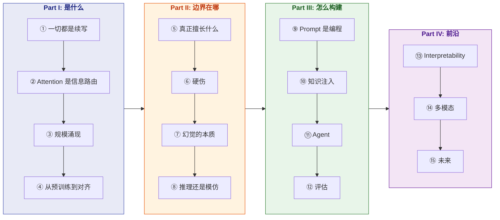

# Thinking in LLM

> 从 next-token prediction 的本质出发，理解 LLM 的思维机制，掌握构建 LLM 系统的第一性原理。

**Languages**: [中文](README.md) | [English](en/README.md)
**在线阅读**：[yingwang.github.io/thinking-in-llm](https://yingwang.github.io/thinking-in-llm/)（搜索、暗色、目录侧栏）

面向有编程基础、在用或想用 LLM 构建产品的工程师。不要求机器学习背景。

## 这本书的逻辑

**核心逻辑**: 先理解 LLM 怎么"想" → 再知道它的边界 → 然后基于正确理解去构建 → 最后看前沿方向。

市面上要么是纯理论（论文），要么是纯实操（prompt cookbook）。这本书从**"为什么"推导出"怎么做"**——理解了 attention 的本质，自然知道什么样的 prompt 有效；理解了 scaling law，自然知道什么时候该换大模型而不是调 prompt。

## 目录

### Part I: LLM 是什么（The Machine）

| # | 章节 | 核心问题 |
|---|------|---------|
| 1 | [一切都是续写](chapters/01-next-token.md) | LLM 只做一件事：预测下一个 token |
| 2 | [Attention 是信息路由](chapters/02-attention.md) | 每个 token 在问"我该看哪里？" |
| 3 | [规模涌现](chapters/03-scaling.md) | 为什么大模型突然"会"了？ |
| 4 | [从预训练到对齐](chapters/04-alignment.md) | 对齐不改变能力，只改变表达 |

### Part II: LLM 的能力边界（The Boundaries）

| # | 章节 | 核心问题 |
|---|------|---------|
| 5 | [LLM 真正擅长什么](chapters/05-strengths.md) | 模式识别、转换、压缩 |
| 6 | [LLM 的硬伤](chapters/06-limitations.md) | 数数、算术、长程推理为什么不行 |
| 7 | [幻觉的本质](chapters/07-hallucination.md) | 幻觉不是 bug，是续写器的必然 |
| 8 | [推理还是模仿？](chapters/08-reasoning.md) | CoT、reasoning model、System 1 vs 2 |

### Part III: 用 LLM 构建（The Practice）

| # | 章节 | 核心问题 |
|---|------|---------|
| 9 | [Prompt 是编程](chapters/09-prompting.md) | System prompt = 类定义，few-shot = 测试用例 |
| 10 | [知识注入的三条路](chapters/10-knowledge.md) | RAG vs Fine-tuning vs Long Context |
| 11 | [Agent 的第一性原理](chapters/11-agents.md) | Tool use 扩展 token 空间到真实世界 |
| 12 | [评估——最被低估的环节](chapters/12-evaluation.md) | 先写 eval，再调系统 |

### Part IV: 前沿与未来（The Frontier）

| # | 章节 | 核心问题 |
|---|------|---------|
| 13 | [Interpretability——打开黑箱](chapters/13-interpretability.md) | 模型内部在干什么？ |
| 14 | [多模态——超越文本](chapters/14-multimodal.md) | 图像、音频、视频都变成 token |
| 15 | [LLM 的未来](chapters/15-future.md) | Scaling 会撞墙吗？ |

## 与《LLM 训练工程师完全指南》的关系

| | [训练指南](https://github.com/yingwang/llm-tutorial) | Thinking in LLM |
|---|---|---|
| **视角** | 怎么**造** LLM | 怎么**理解和用** LLM |
| **读者** | 训练工程师 | 所有 LLM 开发者 |
| **前置** | 需要 ML 基础 | 只需编程基础 |
| **目标** | 能训练模型 | 能设计 LLM 系统 |

两本互补：训练指南教你造引擎，这本书教你开车——但不是驾校手册，而是理解发动机原理后的驾驶。

## 如何阅读

- **从头到尾**: Part I → II → III → IV，每一部分建立在前一部分之上
- **赶时间**: 第1章 → 第6章 → 第9章 → 第11章（核心四章）
- **已有基础**: 跳到 Part III，遇到不懂的回头查 Part I/II

## 作者

Ying Wang

## 许可

[CC BY-NC-SA 4.0](LICENSE)

---

> 最后更新: 2026-04-26（全 15 章完稿）
