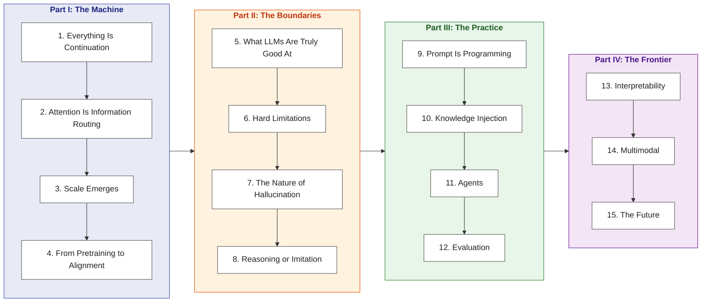
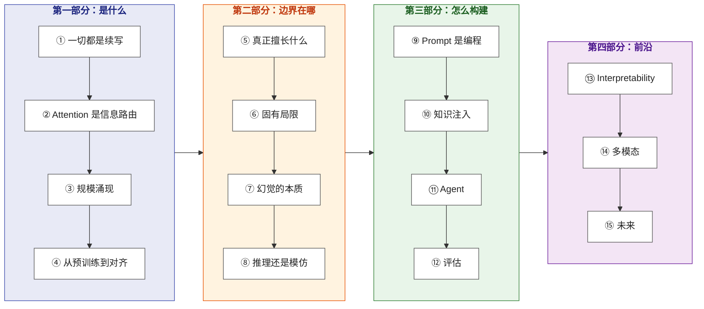

# Thinking in LLM

> A first-principles guide to how large language models compute, their structural capability boundaries, and modern system engineering design.

**Languages**: [English](#thinking-in-llm) | [中文版](#中文版)  
**Read Online**: [yingwang.github.io/thinking-in-llm](https://yingwang.github.io/thinking-in-llm/)  
**Glossary**: [English Terminology Reference](en/GLOSSARY.md)

Written for software engineers, architects, and technical leaders who build or plan to build systems powered by LLMs. No prior background in deep mathematical machine learning is required.

---

## The Architecture of This Book

**Core Trajectory**: **Understand the Machine** (how tokens and attention compute) $\to$ **Map the Boundaries** (why arithmetic and counting fail, and what hallucination really is) $\to$ **Build Systems** (prompting, RAG vs fine-tuning, agents, and evaluations) $\to$ **Explore the Frontier** (interpretability, multimodality, and the post-scaling era).

Most literature leans toward two extremes: dense academic papers with heavy mathematical derivations, or superficial prompt cookbook recipes. This book bridges the gap by **deriving engineering practice directly from underlying mechanics**:
- Grasping attention as dynamic information routing makes prompt structuring second nature;
- Understanding compute-optimal scaling laws allows you to weigh model sizes against prompting strategies rather than blindly tuning.

---

## Table of Contents

### Part I: What an LLM Is (The Machine)

| # | Chapter | Core Question & Key Concept |
|:---:|---|---|
| 01 | [Everything Is Continuation](en/chapters/01-next-token.md) | The single primitive of LLMs: predicting the next token distribution |
| 02 | [Attention Is Information Routing](en/chapters/02-attention.md) | Dynamic addressing per token: *Where in the context should I aggregate information?* |
| 03 | [Emergence From Scale](en/chapters/03-scaling.md) | Compute, parameters, and tokens: Why do capabilities jump non-linearly? |
| 04 | [From Pretraining to Alignment](en/chapters/04-alignment.md) | The true nature of RLHF/DPO: Alignment does not create knowledge; it shapes expression |

### Part II: Capability Boundaries (The Boundaries)

| # | Chapter | Core Question & Key Concept |
|:---:|---|---|
| 05 | [What LLMs Are Truly Good At](en/chapters/05-strengths.md) | High-dimensional pattern recognition, structural transformation, and fuzzy compression |
| 06 | [Hard Limitations of LLMs](en/chapters/06-limitations.md) | Structural bottlenecks: Why counting, exact arithmetic, and long-range planning fail |
| 07 | [The Nature of Hallucination](en/chapters/07-hallucination.md) | Hallucination is not a system bug, but the intrinsic mechanism of probabilistic continuation |
| 08 | [Reasoning or Imitation?](en/chapters/08-reasoning.md) | Chain-of-thought, slow thinking, search over test-time compute, and System 1 vs System 2 |

### Part III: Building With LLMs (The Practice)

| # | Chapter | Core Question & Key Concept |
|:---:|---|---|
| 09 | [Prompt Is Programming](en/chapters/09-prompting.md) | System prompt as type definition, context as memory layout, few-shot as test cases |
| 10 | [Three Paths for Knowledge Injection](en/chapters/10-knowledge.md) | Architectural trade-offs between RAG, Fine-Tuning, and Long-Context windows |
| 11 | [First Principles of Agents](en/chapters/11-agents.md) | Tool use as bridging token space to external state execution in the physical world |
| 12 | [Evaluation: The Most Underestimated Step](en/chapters/12-evaluation.md) | Write unit and behavioral evals before iterating; ground metrics in golden datasets |

### Part IV: Frontier and Future (The Frontier)

| # | Chapter | Core Question & Key Concept |
|:---:|---|---|
| 13 | [Interpretability: Opening the Black Box](en/chapters/13-interpretability.md) | Mechanistic interpretability: Probing linear representations and circuits in hidden layers |
| 14 | [Multimodal: Beyond Text](en/chapters/14-multimodal.md) | Unified tokenization across vision, audio, and video |
| 15 | [The Future of LLMs](en/chapters/15-future.md) | The boundary of scaling laws and the paradigm shift in the post-scaling era |

---

## Relationship to *"The Complete Guide for LLM Training Engineers"*

| Dimension | [LLM Training Guide](https://github.com/yingwang/llm-tutorial) | Thinking in LLM |
|---|---|---|
| **Perspective** | How to **train & optimize** LLMs | How to **understand & architect** with LLMs |
| **Target Audience** | ML & Training Engineers | Software Engineers & System Architects |
| **Prerequisites** | Machine learning & PyTorch background | Core programming proficiency |
| **Core Objective** | Master pretraining, SFT, and RLHF pipelines | Build rigorous architectural intuition for LLM systems |

These two books complement each other: *The Training Guide* teaches you how to cast and build the engine; *Thinking in LLM* teaches you the thermodynamics of how it works and how to design systems around it.

---

## Recommended Reading Paths

- **Comprehensive Path**: Read sequentially from Part I through Part IV. Each section builds upon the theoretical foundation of the previous one.
- **Fast-Track Path**: Chapter 1 $\to$ Chapter 6 $\to$ Chapter 9 $\to$ Chapter 11 (the four foundational pillars of LLM system architecture).
- **Practitioner Path**: Jump straight to Part III for system design patterns, returning to Parts I and II whenever theoretical mechanics arise.

---
---

# 中文版

> 从 next-token prediction 的本质出发，洞察大语言模型的计算机理，掌握构建现代 LLM 系统的第一性原理。

**在线阅读**：[yingwang.github.io/thinking-in-llm](https://yingwang.github.io/thinking-in-llm/)  
**大纲总览**：[完整大纲](OUTLINE.md)

面向具备编程基础、正在使用或计划使用 LLM 构建系统的软件工程师与架构师。无需深厚的机器学习数学背景。

## 这本书的逻辑

**核心主线**：先理解 LLM 的生成机理与表征方式，进而厘清其确定性边界与结构局限，随后基于第一性原理开展系统工程设计，最终洞察前沿演进方向。

当前的技术资料往往走向两极：要么深陷论文中的推导细节，要么流于浅层的提示词工程清单。本书致力于**从底层机理推演工程实践**：洞悉了注意力机制的路由本质，便能自然写出高效的提示词；把握了规模法则与计算最优边界，便能在系统选型时权衡模型规模与提示策略，而非盲目调优。

## 中文目录

### 第一部分：LLM 是什么（The Machine）

| # | 章节 | 核心问题 |
|:---:|---|---|
| 01 | [一切都是续写](chapters/01-next-token.md) | LLM 的单一原语：预测下一个 token 的概率分布 |
| 02 | [Attention 是信息路由](chapters/02-attention.md) | 每个 token 的动态寻址：我该聚合何处的信息？ |
| 03 | [规模涌现](chapters/03-scaling.md) | 算力与参数的缩放：复杂能力为何跃迁？ |
| 04 | [从预训练到对齐](chapters/04-alignment.md) | 对齐的本质：不增删底层能力，重塑表达概率 |

### 第二部分：LLM 的能力边界（The Boundaries）

| # | 章节 | 核心问题 |
|:---:|---|---|
| 05 | [LLM 真正擅长什么](chapters/05-strengths.md) | 模式识别、结构映射与高维压缩 |
| 06 | [LLM 的固有局限](chapters/06-limitations.md) | 计数、精确算术与长程规划的结构性制约 |
| 07 | [幻觉的本质](chapters/07-hallucination.md) | 幻觉非系统故障，乃概率续写的必然伴生 |
| 08 | [推理还是模仿？](chapters/08-reasoning.md) | CoT、慢思考机制与双系统认知模型 |

### 第三部分：用 LLM 构建（The Practice）

| # | 章节 | 核心问题 |
|:---:|---|---|
| 09 | [Prompt 是编程](chapters/09-prompting.md) | System Prompt 奠定类型定义，Few-shot 充当测试用例 |
| 10 | [知识注入的三条路](chapters/10-knowledge.md) | RAG、微调与长上下文的系统权衡 |
| 11 | [Agent 的第一性原理](chapters/11-agents.md) | 工具调用：将 token 空间映射至物理世界操作 |
| 12 | [评估：最被低估的环节](chapters/12-evaluation.md) | 先行定义度量基准，再行迭代优化系统 |

### 第四部分：前沿与未来（The Frontier）

| # | 章节 | 核心问题 |
|:---:|---|---|
| 13 | [可解释性：打开黑箱](chapters/13-interpretability.md) | 神经网络隐层中的表征与回路解析 |
| 14 | [多模态：超越文本维度](chapters/14-multimodal.md) | 图像、音频与视频的统摄与 token 化 |
| 15 | [LLM 的未来](chapters/15-future.md) | 缩放定律的边界与后 Scaling 时代的范式转移 |

## 与《LLM 训练工程师完全指南》的关系

| 维度 | [训练指南](https://github.com/yingwang/llm-tutorial) | Thinking in LLM |
|---|---|---|
| **视角** | 探索如何**构建与训练** LLM | 探索如何**理解与驾驭** LLM |
| **读者** | 算法与训练工程师 | 软件系统开发者与架构师 |
| **前置** | 需具备机器学习基础 | 仅需基础编程经验 |
| **目标** | 掌握模型训练全流程 | 建立 LLM 系统的架构设计直觉 |

两书互为补充：训练指南解析发动机的设计与铸造，本书则剖析热力学原理与动力分配，助你在通晓底层机理后，自如驾驭复杂的应用系统。

## 如何阅读

- **循序渐进**：Part I $\to$ II $\to$ III $\to$ IV，层层递进，后文理论与工程构建以前文物理图景为基石。
- **快速聚焦**：第 1 章 $\to$ 第 6 章 $\to$ 第 9 章 $\to$ 第 11 章（构筑核心心智模型的关键四章）。
- **按需切入**：具备基础的读者可直接阅读 Part III，遇到机理疑问随时回溯 Part I 与 Part II。

---

## Author / 作者

**Ying Wang** ([@yingwang](https://github.com/yingwang))

## License / 许可

[CC BY-NC-SA 4.0](LICENSE)

---

> Last updated: 2026-08-30 (All 15 chapters completed in English & Chinese)
