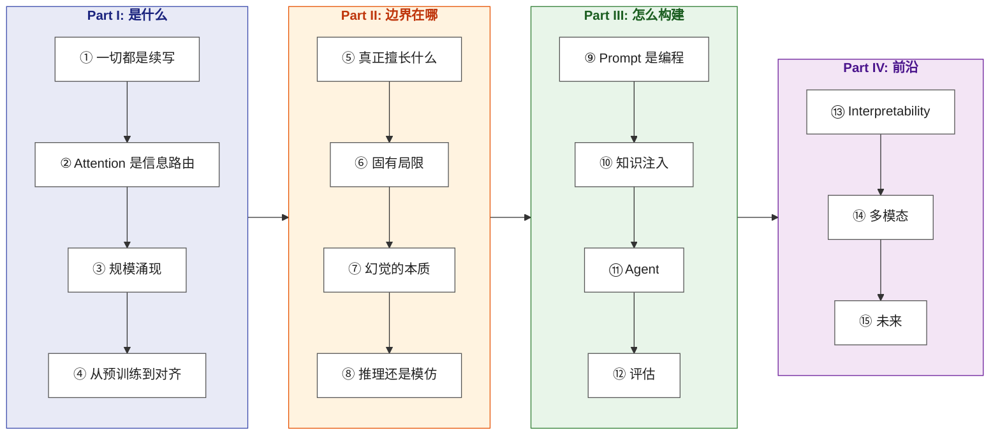

# Thinking in LLM

> 从 next-token prediction 的本质出发，洞察大语言模型的计算机理，掌握构建现代 LLM 系统的第一性原理。

**Languages**: [中文](README.md) | [English](en/README.md)
**在线阅读**：[yingwang.github.io/thinking-in-llm](https://yingwang.github.io/thinking-in-llm/)

面向具备编程基础、正在使用或计划使用 LLM 构建系统的工程师。无需深厚的机器学习背景。

## 这本书的逻辑

**核心主线**：先理解 LLM 的生成机理与表征方式，进而厘清其确定性边界与结构局限，随后基于第一性原理开展系统工程设计，最终洞察前沿演进方向。

当前的技术资料往往走向两极：要么深陷论文中的推导细节，要么流于浅层的提示词工程清单。本书致力于**从底层机理推演工程实践**：洞悉了注意力机制的路由本质，便能自然写出高效的提示词；把握了规模法则与计算最优边界，便能在系统选型时权衡模型规模与提示策略，而非盲目调优。

## 目录

### Part I: LLM 是什么（The Machine）

| # | 章节 | 核心问题 |
|---|------|---------|
| 1 | [一切都是续写](chapters/01-next-token.md) | LLM 的单一原语：预测下一个 token |
| 2 | [Attention 是信息路由](chapters/02-attention.md) | 每个 token 的动态寻址：我该聚合何处的信息？ |
| 3 | [规模涌现](chapters/03-scaling.md) | 算力与参数的缩放：复杂能力为何跃迁？ |
| 4 | [从预训练到对齐](chapters/04-alignment.md) | 对齐的本质：不增删能力，重塑表达概率 |

### Part II: LLM 的能力边界（The Boundaries）

| # | 章节 | 核心问题 |
|---|------|---------|
| 5 | [LLM 真正擅长什么](chapters/05-strengths.md) | 模式识别、结构映射与高维压缩 |
| 6 | [LLM 的固有局限](chapters/06-limitations.md) | 计数、精确算术与长程推理的结构性制约 |
| 7 | [幻觉的本质](chapters/07-hallucination.md) | 幻觉非系统故障，乃概率续写的必然伴生 |
| 8 | [推理还是模仿？](chapters/08-reasoning.md) | CoT、慢思考机制与双系统认知模型 |

### Part III: 用 LLM 构建（The Practice）

| # | 章节 | 核心问题 |
|---|------|---------|
| 9 | [Prompt 是编程](chapters/09-prompting.md) | System Prompt 奠定类型定义，Few-shot 充当测试用例 |
| 10 | [知识注入的三条路](chapters/10-knowledge.md) | RAG、微调与长上下文的系统权衡 |
| 11 | [Agent 的第一性原理](chapters/11-agents.md) | 工具调用：将 token 空间映射至物理世界操作 |
| 12 | [评估：最被低估的环节](chapters/12-evaluation.md) | 先行定义度量基准，再行迭代优化系统 |

### Part IV: 前沿与未来（The Frontier）

| # | 章节 | 核心问题 |
|---|------|---------|
| 13 | [可解释性：打开黑箱](chapters/13-interpretability.md) | 神经网络隐层中的表征与回路解析 |
| 14 | [多模态：超越文本维度](chapters/14-multimodal.md) | 图像、音频与视频的统摄与 token 化 |
| 15 | [LLM 的未来](chapters/15-future.md) | 缩放定律的边界与后 Scaling 时代的范式转移 |

## 与《LLM 训练工程师完全指南》的关系

| | [训练指南](https://github.com/yingwang/llm-tutorial) | Thinking in LLM |
|---|---|---|
| **视角** | 探索如何**构建** LLM | 探索如何**理解与驾驭** LLM |
| **读者** | 算法与训练工程师 | 软件系统开发者与架构师 |
| **前置** | 需具备机器学习基础 | 仅需基础编程经验 |
| **目标** | 掌握模型训练全流程 | 建立 LLM 系统的架构设计直觉 |

两书互为补充：训练指南解析发动机的设计与铸造，本书则剖析热力学原理与动力分配，助你在通晓底层机理后，自如驾驭复杂的应用系统。

## 如何阅读

- **循序渐进**：Part I → II → III → IV，层层递进，后文理论与工程构建以前文物理图景为基石。
- **快速聚焦**：第1章 → 第6章 → 第9章 → 第11章（构筑核心心智模型的关键四章）。
- **按需切入**：具备基础的读者可直接阅读 Part III，遇到机理疑问随时回溯 Part I 与 Part II。

## 作者

Ying Wang

## 许可

[CC BY-NC-SA 4.0](LICENSE)

---

> 最后更新: 2026-04-26（全 15 章完稿）
