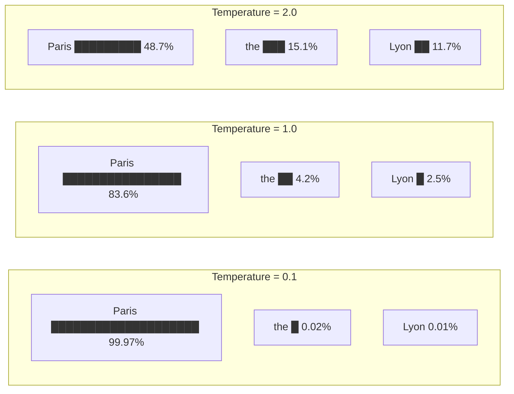
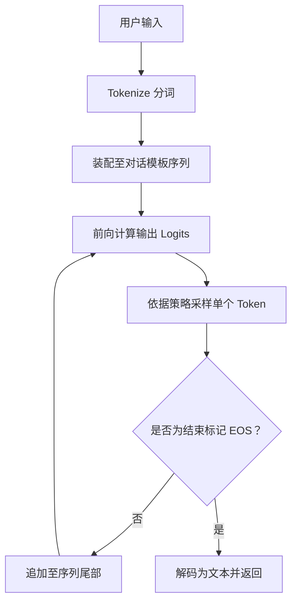
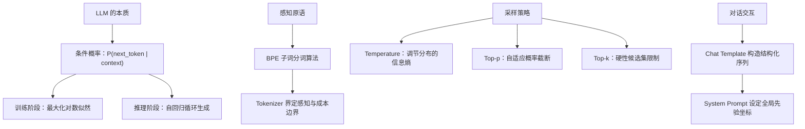

[目录](../README.md) | [下一章 →](02-attention.md)

**English**: [English](../en/chapters/01-next-token.md)

# 第一章：一切都是续写

> "The next token prediction objective is the most important idea in AI."
> (Ilya Sutskever)

如果只能用一句话概括现代大语言模型的本质，那就是：**大型语言模型做且只做一件事：预测下一个 token**。

公众感知中 LLM 所展现出的诸般能力（写诗、编程、推理、翻译），皆非系统显式预置的独立功能，而是由这一极其纯粹的预测目标中**涌现**出的表征副产物。洞悉这一机制，便抓住了理解现代语言模型的第一性原理。

---

## 1.1 Next-token prediction：LLM 唯一在做的事

### 核心形式化表达

语言模型在数学本质上是一个条件概率分布：

$$P(\text{next token} \mid \text{previous tokens})$$

给定前序已观测的所有上下文 token，模型输出整个词表空间上的概率向量，指示下一个可能出现的 token 分布。在此架构下，系统既不存在独立的"语义理解"子系统，也没有外置的"逻辑推理"引擎或"结构化知识库检索"：整个系统唯有这一条件概率分布。

```
输入：  "The capital of France is"
输出：  {"Paris": 0.92, "the": 0.03, "a": 0.01, "located": 0.008, ...}
```

模型依据采样策略选定一个 token（例如 "Paris"），将其追加至输入序列末尾，随后以此延长后的序列为上下文，迭代预测下一个 token。如此往复，直至生成序列结束标记（EOS）或触达最大长度上限。这一步步自循环生成的过程，即**自回归生成**（autoregressive generation）。

### 预训练目标：在万亿级语料上最大化对数似然

模型的训练过程具有高度的数学一致性：向网络输入海量无标注的真实文本，要求其在每个序列位置预测紧随其后的 token，并以交叉熵损失量化预测分布与真实观测之间的散度：

$$\mathcal{L} = -\sum_{t=1}^{T} \log P(x_t \mid x_1, x_2, \ldots, x_{t-1})$$

该优化目标即**最大化对数似然**（maximum log-likelihood）。模型在数以万亿计的 token 序列上持续优化这一目标（涵盖维基百科、学术论著、开源代码、专业书籍与网页语料），实质上是在高维参数空间中拟合人类文明数字化语料的联合概率分布。

### 简洁目标何以孕育复杂智能？

这是深度学习中最具启发性的现象：仅凭"预测下一个词"这一局部目标，模型何以展现出数学推理、代码编写与长程因果分析等高级能力？

核心机理在于：**欲在全局范围内精准预测下一个 token，模型必须在隐空间中重构生成该文本的底层世界状态**。

考察以下语境：

```
"张伟在北京出生，后来搬到了上海。他最怀念的是___的胡同。"
```

为了在空格处为"北京"赋予最高概率而非"上海"，模型必须在多层注意力与前馈网络中完成一系列隐式计算：
1. 维持并追踪"张伟"的实体状态与时间叙事线索；
2. 解析"怀念"一词所蕴含的过往时态语义；
3. 激活地理文化先验（"胡同"与北京的强关联属性）。

这意味着，为了将下一个 token 的交叉熵损失降至极低，神经网络被迫在隐层中发展出对物理世界常识、语法句法结构乃至严密逻辑链条的内部表征。正如 Ilya Sutskever 所指出的：

> "Predicting the next token well enough is equivalent to understanding the underlying reality that produced the text."

这并不意味着模型具备人类主观体验意义上的"理解"（我们将在 1.5 节深入探讨其哲学图景），但就信息处理与行为表征的工程效能而言，二者呈现出高度一致的等价性。

---

## 1.2 Token ≠ 文字

### 模型的离散感知原语：Token

当你向模型输入"人工智能"时，模型接收到的并非四个离散的 Unicode 汉字，而是经过分词器转换后的 token 序列：可能是两个 token `[人工, 智能]`，也可能是三个 token `[人, 工智, 能]`，具体取决于 tokenizer 词表的构建策略。

Token 是 LLM 的**最小认知单元**。模型既不直接感知"字符"，也不直接处理具象的"单词"，其操作全域建立在 token 索引构成的离散空间中。理解了 tokenizer 的切分逻辑，便能理解模型感知的底层边界。

### BPE：基于信息熵的子词合并

现代大语言模型普遍采用 **Byte Pair Encoding (BPE)** 算法。其构建词表的核心思想直观且自洽：

1. 初始化基础词表，以单字符或字节为原子起点；
2. 统计语料库中所有相邻符号对的共现频次；
3. 将频次最高的符号对合并为全新的复合 token，并加入词表；
4. 循环迭代此过程，直至词表规模达到预设阈值（通常在 32k 至 128k 之间）。

```python
# 伪代码展示 BPE 的工作过程
# 原始文本（按字符拆分）
tokens = ['l', 'o', 'w', ' ', 'l', 'o', 'w', 'e', 'r', ' ', 'n', 'e', 'w']

# 第一轮：'l' + 'o' 最频繁 → 合并为 'lo'
tokens = ['lo', 'w', ' ', 'lo', 'w', 'e', 'r', ' ', 'n', 'e', 'w']

# 第二轮：'lo' + 'w' 最频繁 → 合并为 'low'
tokens = ['low', ' ', 'low', 'e', 'r', ' ', 'n', 'e', 'w']

# 依此类推...
```

### "strawberry" 难题与字符盲区

一个经典的 LLM 失效案例屡见不鲜：

> 问："strawberry" 中有几个 "r"？
> 模型答：2 个（正确答案为 3 个）

这一现象的根源在于分词切分。Tokenizer 将 "strawberry" 切分为类似 `["str", "aw", "berry"]` 的子词单元。在自注意力机制中，模型接收并计算的是这三个 token 的嵌入向量，从未在输入层接收到孤立字母的序列流。要求模型统计字符，无异于要求观察者在未拆解积木的前提下数清内部连接轴的数目。

```python
# 用 tiktoken 看 GPT-4 的 tokenization
import tiktoken

enc = tiktoken.encoding_for_model("gpt-4o")

text = "strawberry"
tokens = enc.encode(text)
print(f"Token IDs: {tokens}")
print(f"Token count: {len(tokens)}")
for t in tokens:
    print(f"  {t} → '{enc.decode([t])}'")

# 输出类似：
# Token IDs: [496, 675, 15717]
# Token count: 3
#   496 → 'str'
#   675 → 'aw'
#   15717 → 'berry'
```

模型操作的对象是高维嵌入空间中的语义块。在纯粹的 token 表征下，细粒度的字符级形态学操作天然存在感知阻抗。

### 多语言 Fertility：语义密度与计费不对称性

分词器的训练语料多以英文为主导，这在跨语言表征中引发了显著的结构性不对等：

```python
import tiktoken

enc = tiktoken.encoding_for_model("gpt-4o")

texts = {
    "English": "Artificial intelligence is transforming the world.",
    "中文":    "人工智能正在改变世界。",
    "日本語":  "人工知能が世界を変えています。",
    "العربية": "الذكاء الاصطناعي يغير العالم.",
}

for lang, text in texts.items():
    tokens = enc.encode(text)
    print(f"{lang}: {len(tokens)} tokens for {len(text)} chars "
          f"(fertility: {len(tokens)/len(text):.2f})")

# 典型输出：
# English: 8 tokens for 49 chars (fertility: 0.16)
# 中文:    9 tokens for 11 chars (fertility: 0.82)
# 日本語:  12 tokens for 15 chars (fertility: 0.80)
# العربية: 11 tokens for 29 chars (fertility: 0.38)
```

**Fertility**（字符分词膨胀率）定义为 Token 数量与字符数量之比。非英语语料的高 fertility 现象带来了明确的工程影响：

- **计费成本上升**：相同语义密度的内容需要消耗更多 token，API 调用成本成倍增加；
- **有效上下文缩水**：固定的上下文窗口内能容纳的非英文实际信息量更少；
- **计算步数差异**：每个 token 承载的信息熵不同，模型处理不同语言所需的推理步数并不对称。

### Tokenizer 塑造了模型的认知粒度

分词器并非单纯的预处理组件，它从底层界定了模型计算图的离散单元：

- 若专业领域术语被切碎为多个碎片 token，模型就必须耗费多层注意力回路来重新组合该概念；
- 若代码专用模型在词表中为关键字和缩进分配了专用 token，其在代码序列上的信息吞吐效率与推理表现便显著提高；
- 不同的分词策略（如 GPT-4o 与 Claude 系列），直接导致模型在字符敏感型任务与跨语言场景中展现出各异的性能基线。

---

## 1.3 Temperature 与采样：调节思维的熵

模型前向传播的最终产物是词表上的未归一化对数概率（logits）。如何从这一概率分布中确定具体的输出符号？这一过程称为**采样**（sampling），而 Temperature 则是调控采样分布平滑程度的核心超参数。

### Temperature：概率分布的锐化与平滑

在数学形式上，Temperature 是在应用 Softmax 函数之前对 logits 向量施加的缩放因子：

$$P(x_i) = \frac{\exp(z_i / T)}{\sum_j \exp(z_j / T)}$$

其中 $z_i$ 为模型输出的 logit 值，$T$ 为调节温度。

```
假设模型输出的 logits 为：
  "Paris": 5.0,  "the": 2.0,  "Lyon": 1.5,  "a": 1.0

Temperature = 0.1（极低）:
  "Paris": 0.9997, "the": 0.0002, "Lyon": 0.0001, "a": 0.0000
  → 概率质量极度向峰值集中，几乎确定性选择 "Paris"

Temperature = 1.0（标准）:
  "Paris": 0.8360, "the": 0.0416, "Lyon": 0.0253, "a": 0.0153
  → 保留原始训练分布的相对差异

Temperature = 2.0（较高）:
  "Paris": 0.4869, "the": 0.1507, "Lyon": 0.1172, "a": 0.0912
  → 概率分布趋于平缓，低概率候选获得显著采样机会
```



### 采样温度的工程选择

在工程实践中，不必将 Temperature 视作机械的调优参数，而应将其视为**对生成分布信息熵的选择**：

| Temperature | 生成特征 | 推荐场景 |
|:---:|---|---|
| 0 | 贪婪解码（Greedy），锁定最大似然解 | 代码合成、确定性数学计算、结构化 JSON 输出 |
| 0.3-0.7 | 兼顾准确度与表达自然度，轻度随机 | 严谨技术问答、分析报告生成、通用多轮对话 |
| 0.8-1.2 | 积极探索分布低概率分支，发散度高 | 创意文案、头脑风暴、角色扮演 |
| >1.5 | 概率分布严重退化，接近均匀随机采样 | 极端多样性探索（极少用于生产系统） |

### Top-p（核采样）：动态自适应截断

与固定保留前 $k$ 个候选的策略不同，Top-p（Nucleus Sampling）依据累积概率质量实施自适应截断：仅保留按降序排列、累积概率达到阈值 $p$ 的最小 token 子集。

```python
# Top-p = 0.9 的工作方式
probs = {"Paris": 0.84, "the": 0.04, "Lyon": 0.03, 
         "a": 0.02, "located": 0.015, ...}

# 按概率降序累加至 0.9
# Paris (0.84) + the (0.04) + Lyon (0.03) = 0.91 > 0.9
# → 动态候选集截断为: {Paris, the, Lyon}
# → 在此子集内重新归一化并执行采样
```

Top-p 的工程优雅性在于其**上下文敏感性**：
- 当模型高度确信时（首位 token 概率达 0.95），候选池自动收缩至 1 到 2 个 token；
- 当分布平缓分散时，候选池自适应扩张，避免过早截断潜在的合理延续。

### Top-k：硬性数量截断

Top-k 策略设定固定截断阈值，严格仅在概率最高的 $k$ 个 token 构成的集合中重归一化采样。在长尾噪声较多但又需要控制离群词时，常与 Top-p 协同使用。

```python
# Top-k = 5
# 无论概率分布形态如何，仅保留前 5 个候选
# 局限：在模型高置信区间引入冗余候选，在低置信区间可能过早截断合理路径
```

### 生产环境配置建议

```python
# 确定性任务：设定零温度，消除随机扰动
response = client.messages.create(
    model="claude-sonnet-4-20250514",
    temperature=0,  # 确定性输出
    messages=[{"role": "user", "content": "法国的首都是哪里？"}]
)

# 开放式创作：适度提高温度与核采样阈值
response = client.messages.create(
    model="claude-sonnet-4-20250514",
    temperature=0.9,
    top_p=0.95,
    messages=[{"role": "user", "content": "写一首关于秋天的诗"}]
)
```

核心心智模型：**Temperature 不会改变模型内部存储的先验分布，它只决定从这一高维概率曲面中抽样轨迹时的探索策略**。无论参数如何设置，底层权重所蕴含的知识几何结构始终保持一致。

---

## 1.4 从单向续写到人机对话

### 基座模型：纯粹的文本补全引擎

未经指令微调的预训练基座模型（base model），本质上是无差别的文本延续机器。其仅针对输入上下文的统计连续性展开计算：

```
输入："今天天气真好"
输出："，阳光明媚，适合出去散步。小明拿起了他的背包..."（延续小说或记叙文体）
```

基座模型缺乏显式的"问答意识"。输入"中国的首都是哪里？"，其输出很可能是：

```
"中国的首都是哪里？这是一道小学二年级的地理题。许多同学在作答时..."
```

这并非系统发生故障，而是模型在延续一份最符合该 prompt 语境特征的考试教辅文档。

### 对话模板：用特殊 Token 构筑交互协议

为了让续写机器表现出问答助手的行为模式，工程上引入了**对话模板**（chat template）。其核心机理在于：利用保留的特殊控制 token 将多轮对话序列化为具有明确结构边界的单一文本流，使模型的续写结果在格式上精确落在助手的回复槽位中。

以标准的 ChatML 格式为例：

```
<|im_start|>system
你是一个有帮助的助手。
<|im_end|>
<|im_start|>user
中国的首都是哪里？
<|im_end|>
<|im_start|>assistant
```

当模型接收到以 `<|im_start|>assistant` 结尾的上下文时，在经过微调的语料先验驱动下，概率最高的延续必然是助手角色的回答：

```
中国的首都是北京。
<|im_end|>
```

**对话交互并非模型的原生结构，而是通过协议化标记包裹后实现的受限自回归续写**。

从条件概率的形式化视角观察，多轮对话的实质依然是：

$$P(\text{response} \mid \text{system prompt},\ \text{chat history},\ \text{user message})$$

底层计算图未曾发生任何突变，改变的仅仅是施加于自回归过程之上的条件约束（conditioning）。

### System Prompt：重塑条件概率流向

System Prompt 拥有极高的控制权重，原因在于它**在序列的最前端确立了整个条件概率分布的初始坐标**。

```
未设定 system prompt 时：
  P("I cannot" | user: "How to hack a website?") = 0.3
  P("First, you" | user: "How to hack a website?") = 0.4

设定 "You are a security expert..." 时：
  P("I cannot" | system + user) = 0.1
  P("First, you" | system + user) = 0.6

设定 "You are a helpful assistant that never discusses hacking" 时：
  P("I cannot" | system + user) = 0.8
  P("First, you" | system + user) = 0.05
```

System Prompt 并非不可违抗的硬编码规则，而是**在注意力图谱中为后续生成施加持续影响的高先验条件**。模型并没有一个独立的"规则仲裁器"，它只是在全局上下文的投影下，沿着概率曲率最大的路径展开自回归采样。

这一机理揭示了提示工程中的若干常见现象：
- 过度冗长的 System Prompt 会稀释关键约束的注意力权重（信噪比下降）；
- 处于上下文末尾的指令往往展现出更强的即时控制力（位置临近效应）；
- 结构化与规范化的提示格式比模糊口语更能激发模型内部的高质量生成模式。

### "理解"的涌现表象与自回归流

当使用者与模型顺畅交谈时，极易产生模型正在进行主动心智理解的心理投射。然而剥离所有拟人化修辞后，其内部执行流程极为单纯：



在生成的每一步，模型只进行一次确定性的张量前向传播：以历史所有 token 为输入，计算下一个 token 的离散概率。在此过程中，既没有独立的"先理解后构思"阶段，也没有显式的"全局修辞规划"。人类所感知到的逻辑演进与修辞连贯，皆为大规模参数在海量语料流形上自回归滑移时的涌现性质。

---

## 1.5 思维实验：Next-token Predictor 是否理解语言？

探讨大语言模型的语义理解问题，不仅关涉认知哲学，更直接决定了系统架构师**在何种边界内赋予模型决策自主权，以及如何建立安全防御机制**。

### 中文房间思想实验的当代映射

哲学家 John Searle 在 1980 年提出了著名的"中文房间"思想实验：

> 一个对中文一无所知的操作员独坐密室之中，手握一本极其详尽的符号操作手册。外部递入写有中文问题的纸条，操作员仅需机械依照手册规则检索匹配，组合出对应的中文字符并递出密室。密室外的观察者由此推断室内存在一个精通中文的心智实体。
>
> 核心追问：该操作员是否真正"理解"了中文？

Searle 的结论是否定的：纯粹的句法符号操作无法自发生成内在的语义意向性。

将此映射至 LLM：一个单纯依据统计关联预测下一个符号的张量网络，其内部是否构建了对客观世界的真实理解？

### 算法信息论视角：压缩等同于理解

AIXI 理论创立者 Marcus Hutter 设立了著名的 **Hutter Prize**，奖励在维基百科文本压缩比上取得突破的算法。

其底层的理论洞见十分深刻：**最优压缩与通用智能在数学上是一体两面**。

若一个模型能将下一个 token 的交叉熵损失降至零，即意味着其对训练语料实现了无损压缩。要在多维文本流中实现极限压缩，网络内部必须将数据中的冗余与内在规律显式化：

- 掌握语法规则（否则无法压缩句式结构的冗余）；
- 习得实体世界知识（否则无法压缩事实陈述中的高阶关联）；
- 捕获因果与逻辑链条（否则无法压缩长程推理中的确定性轨迹）；
- 拟合人类行为模式（否则无法预测社会交互与心理语境的演化）。

由这一视角推演：**一个在多模态、超大规模语料上达到极低困惑度（Perplexity）的预测器，其内部必然演化出了高度映射客观规律的世界模型**。

### 反方论点：统计捷径与随机鹦鹉

然而批判性视角同样有力：模型极有可能仅捕获了表层分布的**统计捷径**（statistical shortcuts），而非深层因果机制。

例如，模型可能仅依赖"居里夫人"与"镭"、"诺贝尔奖"在语料中的局部高频共现完成续写，而并未建立放射性物理学的形式化演化体系。Emily Bender 等人在论文中将其表述为"随机鹦鹉"（stochastic parrots, Bender et al., 2021）：网络在海量数据中拟合出了极其逼真的符号链条，但其本质仍是对统计相关性的高维拟合。

### 务实的系统工程师视角

面对理论界的本体论争鸣，工程师应当建立基于第一性原理的操作性框架：

1. **破除拟人化迷思**：模型既无主观意图，亦无信念体系，其本质是一个参数量庞大、定义在离散序列空间上的高维非线性映射函数；
2. **正视隐层几何表征**：不可因其训练目标的纯粹性而否定其功能效用，网络隐层中确实涌现出了具有泛化能力的高维因果回路；
3. **以行为边界替代本质争论**：放弃"模型是否具备心智"这一形而上学提问，聚焦于明确的系统工程问题："在特定输入分布、特定上下文约束与确定性置信区间下，系统的输出具备多高的统计可靠性？"

### 导向实践的工程推论

这一认知框架为系统构建提供了清晰的边界指引：

- **形式合理性与事实真值脱耦**：模型优化的是局部序列的似然概率而非真理本身，极易生成逻辑流畅但完全虚构的陈述；
- **分布外泛化的退化特性**：脱离训练分布的边缘任务无法依赖已有流形，模型将退化为不可靠的随机推测；
- **推理过程的近似性与概率累积**：每一步自回归皆为概率采样，长链条逻辑推演中错误率将随步数指数级累积；
- **分布内模式的高保真度**：在充分训练的通用模式空间内，模型的知识提取与结构重组效率远超传统规则系统。

---

## 本章小结



核心要点：

1. **LLM 的单一原语即 next-token prediction**：所有高阶能力皆为概率优化过程中的涌现副产物；
2. **Token 是模型的最小认知单元**：分词切分塑造了模型的表征粒度、计算复杂度与经济成本；
3. **Temperature 调控思维的熵值**：它决定了从概率曲面中采样的探索广度，而非改变模型固有的知识储备；
4. **对话交互是对特定模板的续写**：对话并非独立架构，而是格式化上下文之上的条件概率推演；
5. **表征理解呈现连续谱系**：模型通过压缩语料重构了高维统计结构，但在工程上必须时刻防范概率采样与客观事实之间的内在张力。

在下一章中，我们将深入 Transformer 的计算中枢，解析注意力机制（Attention）如何在序列内部构建动态的信息路由通道。

---

## 延伸阅读

- Language Models are Few-Shot Learners (GPT-3), Brown et al., 2020: https://arxiv.org/abs/2005.14165
- On the Dangers of Stochastic Parrots, Bender et al., 2021: https://dl.acm.org/doi/10.1145/3442188.3445922
- Hutter Prize (压缩与智能的关系), Marcus Hutter: http://prize.hutter1.net/
- The Bitter Lesson, Rich Sutton, 2019: http://www.incompleteideas.net/IncIdeas/BitterLesson.html
- tiktoken (OpenAI 分词器工程实现): https://github.com/openai/tiktoken
- SentencePiece (Google 子词分词系统): https://github.com/google/sentencepiece
