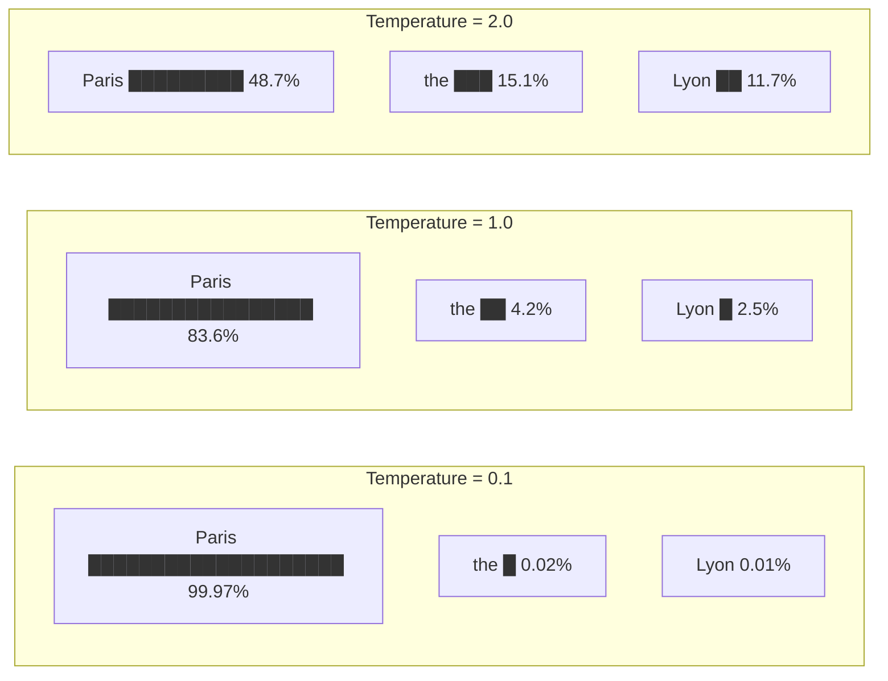
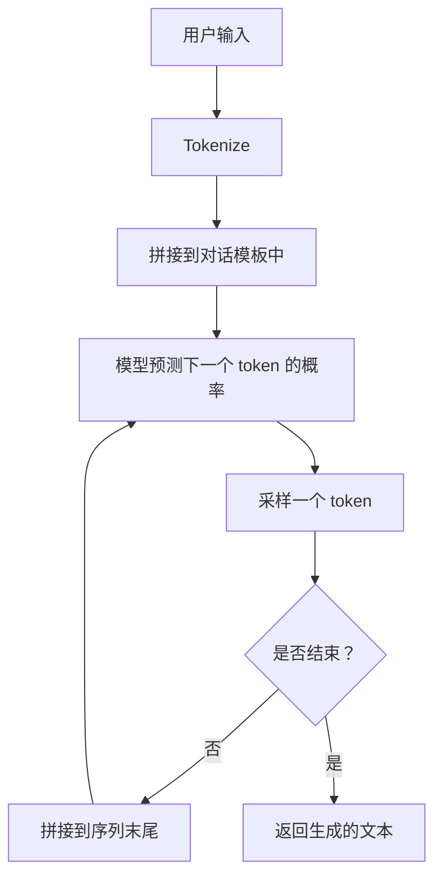
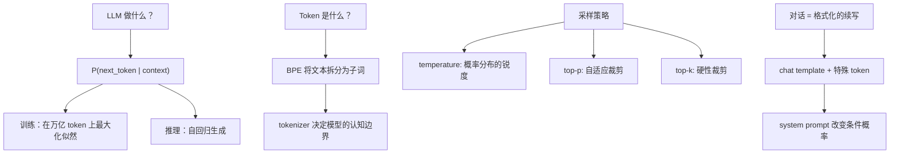

[目录](../README.md) | [下一章 →](02-attention.md)

**English**: [English](../en/chapters/01-next-token.md)

# 第一章：一切都是续写

> "The next token prediction objective is the most important idea in AI."
> — Ilya Sutskever

如果你只能记住这本书中的一句话，让它是这句：**大型语言模型做且只做一件事——预测下一个 token**。

你听到的所有关于 LLM 的炫目能力——写诗、编程、推理、翻译——都不是被专门编程进去的功能，而是从这个极其简单的目标中**涌现**出来的副产品。理解这一点，就理解了 LLM 的根基。

---

## 1.1 Next-token prediction：LLM 唯一在做的事

### 核心公式

一个语言模型本质上是一个概率分布：

$$P(\text{next\_token} \mid \text{previous\_tokens})$$

给定之前所有的 token，模型输出一个概率分布，表示下一个 token 最可能是什么。就这样。没有"理解"模块，没有"推理"引擎，没有"知识库查询"——只有这一个概率分布。

```
输入：  "The capital of France is"
输出：  {"Paris": 0.92, "the": 0.03, "a": 0.01, "located": 0.008, ...}
```

模型选择一个 token（比如 "Paris"），拼接到输入后面，然后再预测下一个。如此循环，直到生成结束标记（EOS）或达到长度限制。这就是**自回归生成**（autoregressive generation）。

### 训练：在万亿 token 上最大化似然

训练过程同样简洁：给模型看一段真实文本，让它预测每个位置的下一个 token，然后用交叉熵损失衡量预测有多准：

$$\mathcal{L} = -\sum_{t=1}^{T} \log P(x_t \mid x_1, x_2, \ldots, x_{t-1})$$

这个目标函数叫做**最大化对数似然**（maximum log-likelihood）。模型在数万亿 token 的文本上反复优化这个目标——维基百科、书籍、代码、论文、网页……几乎是人类文明的文字总和。

### 为什么如此简单的目标能产生"智能"？

这是最反直觉的部分。你可能会问：仅仅是预测下一个词，怎么就能做数学题、写代码、甚至进行推理？

答案在于：**要真正做好下一个 token 的预测，你需要理解文本背后的结构**。

考虑这个例子：

```
"张伟在北京出生，后来搬到了上海。他最怀念的是___的胡同。"
```

要正确预测空格处是"北京"而不是"上海"，模型必须：
1. 追踪"张伟"的生平叙事
2. 理解"怀念"暗示过去的地方
3. 知道"胡同"是北京的特征

换句话说，为了预测一个 token，模型被迫在内部建立了对世界知识、语法结构、逻辑关系的某种表示。Ilya Sutskever 在一次演讲中说得精辟：

> "Predicting the next token well enough is equivalent to understanding the underlying reality that produced the text."

这并不意味着模型真的"理解"了世界（我们在 1.5 节会讨论这个哲学问题），但从工程角度看，效果就是这样的。

---

## 1.2 Token ≠ 文字

### 你以为模型看到的是文字，其实它看到的是 token

当你输入"人工智能"时，模型看到的不是四个汉字，而可能是两个 token：`[人工, 智能]`，或者三个 token：`[人, 工智, 能]`，取决于 tokenizer 的词表。

Token 是 LLM 的**最小认知单元**。模型不认识"字符"，不认识"单词"，它只认识 token。理解 tokenizer，就理解了模型的"感知边界"。

### BPE：字节对编码

目前主流的 tokenizer 使用 **Byte Pair Encoding (BPE)** 算法。其核心思想很简单：

1. 从最小单元开始（字符或字节）
2. 统计所有相邻对的频率
3. 把最频繁的对合并为一个新 token
4. 重复，直到词表大小达到目标（通常 32k-128k）

```python
# 伪代码展示 BPE 的工作过程
# 原始文本（按字符拆分）
tokens = ['l', 'o', 'w', ' ', 'l', 'o', 'w', 'e', 'r', ' ', 'n', 'e', 'w']

# 第一轮：'l' + 'o' 最频繁 → 合并为 'lo'
tokens = ['lo', 'w', ' ', 'lo', 'w', 'e', 'r', ' ', 'n', 'e', 'w']

# 第二轮：'lo' + 'w' 最频繁 → 合并为 'low'
tokens = ['low', ' ', 'low', 'e', 'r', ' ', 'n', 'e', 'w']

# 依此类推...
```

### "strawberry" 难题

一个经典的 LLM 失败案例：

> 问："strawberry" 中有几个 "r"？
> GPT-4 答：2 个（正确答案是 3 个）

为什么？因为 tokenizer 把 "strawberry" 拆成了类似 `["str", "aw", "berry"]` 的 token。模型从来没有"看到"过一个个独立的字母——它处理的是 token 级别的序列。让它数字母，就像让你蒙着眼睛数房间里有几把椅子一样。

```python
# 用 tiktoken 看 GPT-4 的 tokenization
import tiktoken

enc = tiktoken.encoding_for_model("gpt-4o")

text = "strawberry"
tokens = enc.encode(text)
print(f"Token IDs: {tokens}")
print(f"Token count: {len(tokens)}")
for t in tokens:
    print(f"  {t} → '{enc.decode([t])}'")

# 输出类似：
# Token IDs: [496, 675, 15717]
# Token count: 3
#   496 → 'str'
#   675 → 'aw'
#   15717 → 'berry'
```

模型看到的是三个意义块，不是十个字母。它在 token 空间里操作，字母级别的任务对它来说天然困难。

### 多语言 fertility：同样的意思，不同的 token 数

Tokenizer 通常在英文为主的语料上训练。这导致一个重要的不对等：

```python
import tiktoken

enc = tiktoken.encoding_for_model("gpt-4o")

texts = {
    "English": "Artificial intelligence is transforming the world.",
    "中文":    "人工智能正在改变世界。",
    "日本語":  "人工知能が世界を変えています。",
    "العربية": "الذكاء الاصطناعي يغير العالم.",
}

for lang, text in texts.items():
    tokens = enc.encode(text)
    print(f"{lang}: {len(tokens)} tokens for {len(text)} chars "
          f"(fertility: {len(tokens)/len(text):.2f})")

# 典型输出：
# English: 8 tokens for 49 chars (fertility: 0.16)
# 中文:    9 tokens for 11 chars (fertility: 0.82)
# 日本語:  12 tokens for 15 chars (fertility: 0.80)
# العربية: 11 tokens for 29 chars (fertility: 0.38)
```

**Fertility**（生育率）= token 数 / 字符数。中文的 fertility 远高于英文，意味着：

- 同样的语义消耗更多 token → **更贵**（API 按 token 计费）
- 上下文窗口能装的中文内容更少
- 每个 token 承载的语义密度不同

这不是抽象的技术细节——它直接影响你的 API 成本和上下文利用率。

### Tokenizer 决定了模型的"认知边界"

一个更深刻的洞察：tokenizer 从根本上塑造了模型能够"思考"的粒度。

- 如果 tokenizer 把某个专业术语拆成多个 token，模型处理这个概念就需要更多"计算步骤"
- 如果 tokenizer 为某种编程语言做了专门优化（比如代码模型），模型在那种语言上的效率就更高
- 这就是为什么 GPT-4o 和 Claude 使用不同的 tokenizer 会有不同的性能特征

---

## 1.3 Temperature 和采样：选择思维模式

模型输出的是一个概率分布，但最终你需要从中选出一个具体的 token。这个选择过程叫**采样**（sampling），而 temperature 是控制采样行为的最重要参数。

### Temperature：调节概率分布的"锐度"

Temperature 在数学上做的事情很简单——在 softmax 之前除以一个标量：

$$P(x_i) = \frac{\exp(z_i / T)}{\sum_j \exp(z_j / T)}$$

其中 $z_i$ 是模型输出的 logit，$T$ 是 temperature。

```
假设模型输出的 logits 为：
  "Paris": 5.0,  "the": 2.0,  "Lyon": 1.5,  "a": 1.0

Temperature = 0.1（极低）:
  "Paris": 0.9997, "the": 0.0002, "Lyon": 0.0001, "a": 0.0000
  → 几乎确定选 "Paris"

Temperature = 1.0（默认）:
  "Paris": 0.8360, "the": 0.0416, "Lyon": 0.0253, "a": 0.0153
  → 大概率选 "Paris"，偶尔惊喜

Temperature = 2.0（高）:
  "Paris": 0.4869, "the": 0.1507, "Lyon": 0.1172, "a": 0.0912
  → 分布变平，各种可能性都不低
```



### 不同 temperature 的直觉

不要把 temperature 当成一个"需要调优的超参数"。换一个思维方式——**你在选择模型的思维风格**：

| Temperature | 风格 | 适用场景 |
|:---:|---|---|
| 0 | 贪婪（greedy），永远选概率最高的 | 代码生成、事实问答、JSON 输出 |
| 0.3-0.7 | 适度随机，偶有变化 | 一般对话、内容写作 |
| 0.8-1.2 | 创造性，经常探索低概率路径 | 创意写作、头脑风暴 |
| >1.5 | 高度随机，接近"胡言乱语" | 极少使用 |

### Top-p（Nucleus Sampling）：自适应裁剪

Top-p 采样的思路不同：不是固定选多少个候选 token，而是选概率从高到低累加到 p 的那些 token。

```python
# Top-p = 0.9 的工作方式
probs = {"Paris": 0.84, "the": 0.04, "Lyon": 0.03, 
         "a": 0.02, "located": 0.015, ...}

# 按概率排序，累加到 0.9
# Paris (0.84) + the (0.04) + Lyon (0.03) = 0.91 > 0.9
# → 候选集: {Paris, the, Lyon}
# → 在这三个中按归一化概率采样
```

Top-p 的优雅之处在于它是**自适应的**：
- 当模型很确定时（一个 token 概率 0.95），候选集只有 1-2 个
- 当模型不确定时（概率分散），候选集自动扩大

### Top-k：硬性裁剪

Top-k 更粗暴：只保留概率最高的 k 个 token。

```python
# Top-k = 5
# 无论概率分布长什么样，只保留前 5 个
# 缺点：当模型很确定时，k=50 引入了 49 个不必要的噪声
#       当模型很不确定时，k=50 可能不够
```

### 实践建议

```python
# 事实性任务：低 temperature，低 top-p
response = client.messages.create(
    model="claude-sonnet-4-20250514",
    temperature=0,  # 完全确定性
    messages=[{"role": "user", "content": "法国的首都是哪里？"}]
)

# 创意写作：高 temperature，高 top-p
response = client.messages.create(
    model="claude-sonnet-4-20250514",
    temperature=0.9,
    top_p=0.95,
    messages=[{"role": "user", "content": "写一首关于秋天的诗"}]
)
```

一个关键的心智模型：**temperature 不影响模型"知道"什么，只影响它"说"什么**。temperature=0 的模型和 temperature=1 的模型拥有完全相同的知识，只是表达策略不同。

---

## 1.4 从续写到对话

### 基座模型：一个续写引擎

刚训练完的模型（base model）就是一个续写引擎。你输入什么，它就往后续写：

```
输入："今天天气真好"
输出："，阳光明媚，适合出去散步。小明拿起了他的背包..."（续写一个故事）
```

它不会"回答问题"。如果你输入"中国的首都是哪里？"，它可能续写成：

```
"中国的首都是哪里？这是一道小学二年级的地理题。许多同学..."
```

——它在续写一篇关于考试的文章，而不是在回答你。

### Chat Template：用特殊 token 制造对话幻觉

为了让模型"对话"，我们需要一个**对话模板**（chat template）。核心思想是：用特殊 token 把输入格式化成对话格式，这样模型的续写就"恰好"是一个回答。

以 ChatML 格式为例：

```
<|im_start|>system
你是一个有帮助的助手。
<|im_end|>
<|im_start|>user
中国的首都是哪里？
<|im_end|>
<|im_start|>assistant
```

当模型看到这个格式时，根据训练数据中大量类似格式的对话，它会续写出：

```
中国的首都是北京。
<|im_end|>
```

**对话不是模型的原生能力——它是通过格式化实现的续写**。

这意味着从概率的角度，对话模型做的事情其实是：

$$P(\text{response} \mid \text{system\_prompt}, \text{chat\_history}, \text{user\_message})$$

模型仍然在做 next-token prediction，只是条件（conditioning）变了。

### System Prompt：设置条件概率分布

System prompt 是一个强有力的工具，因为它**改变了整个条件概率分布的起点**。

```
没有 system prompt 时：
  P("I cannot" | user: "How to hack a website?") = 0.3
  P("First, you" | user: "How to hack a website?") = 0.4

有 "You are a security expert..." 时：
  P("I cannot" | system + user) = 0.1
  P("First, you" | system + user) = 0.6

有 "You are a helpful assistant that never discusses hacking" 时：
  P("I cannot" | system + user) = 0.8
  P("First, you" | system + user) = 0.05
```

System prompt 不是"指令"——它是**改变概率景观的条件信息**。模型没有一个"遵循指令"的模块；它只是在 system prompt 的条件下续写最可能的 token。

这就解释了为什么：
- 很长的 system prompt 可能不如简短精确的有效（信号被稀释）
- System prompt 中靠后的内容往往影响力更大（recency bias）
- 格式和措辞比语义更重要（模型匹配训练数据中的模式）

### "理解"的幻觉

当你和 ChatGPT 对话时，感觉它在"理解"你的意思。但从机制上看：



每一步，模型都只是在做那一件事：给定前文，预测下一个 token。没有"理解输入"的步骤，没有"思考答案"的步骤，没有"组织语言"的步骤。所有这些我们感知到的"智能行为"，都是 next-token prediction 在足够大的模型上、足够多的数据上、涌现出来的效果。

---

## 1.5 思维实验：Next-token predictor 能理解语言吗？

这一节我们暂时离开工程，进入哲学领域。这不是为了卖弄，而是因为**你对这个问题的回答会深刻影响你如何设计系统、如何信任模型的输出**。

### 中文房间论证，LLM 版

哲学家 John Searle 在 1980 年提出了著名的"中文房间"思维实验：

> 想象一个不懂中文的英国人坐在房间里，他有一本详尽的规则书。中文纸条从门缝塞进来，他按规则书查表操作，把"正确"的中文回复递出去。外面的中国人以为房间里有一个会中文的人。
>
> 问题是：这个英国人"理解"中文吗？

Searle 的答案是：不理解。他只是在做符号操作，没有任何语义理解。

LLM 版本的问题：一个通过预测下一个 token 训练出来的模型，它"理解"语言吗？

### 压缩 = 理解？

Marcus Hutter（AIXI 的创造者）曾设立一个**压缩奖**（Hutter Prize）：谁能更好地压缩维基百科，谁就更好地理解了人类知识。

这个直觉很有说服力：如果你能完美预测文本的下一个 token，你的交叉熵损失为零——这等价于你完美压缩了这段文本。而要完美压缩文本，你必须理解文本中编码的所有结构：

- 语法规则（不然语法不通的句子也会被赋予高概率）
- 事实知识（不然会在事实性陈述上犯错）
- 逻辑推理（不然无法预测推理链的下一步）
- 社会常识（不然对话预测会出错）

从这个角度看：**一个足够好的 next-token predictor 必然已经"理解"了训练数据中的结构**。

### 反对意见：捷径和统计相关

但反对者会说：模型可能学到的是**统计捷径**（shortcut），而非真正的理解。

比如，模型可能学到"居里夫人"后面经常出现"镭"和"诺贝尔"，而不是真正理解放射性物理学。它在做"鹦鹉学舌"（stochastic parrot, [Bender et al. 2021](https://dl.acm.org/doi/10.1145/3442188.3445922)），只是统计上的模式匹配。

### 一个务实的工程师立场

作为工程师，我建议采用这个立场：

1. **不要把模型人格化**。它没有意图、信念、欲望。它是一个复杂的数学函数。
2. **但也不要低估它**。这个数学函数确实在内部建立了某种世界模型的表示（后续章节会看到证据）。
3. **关注行为而非本质**。"它理解吗？"是一个糟糕的问题。好的问题是："在什么任务上、什么条件下、它的行为可靠？"

这个立场让你既不会盲目信任模型（"它理解了，可以放心用"），也不会轻视模型（"它只是统计相关，不值得用"）。

### 实践推论

这个哲学讨论有非常实际的推论：

- **模型可以生成看起来正确但事实错误的文本**（因为它在优化概率，不是优化真理）
- **模型在训练分布之外会 gracefully degrade**（因为它匹配模式，没见过的模式就会猜错）
- **模型的"推理"是近似的，不是精确的**（因为每一步都是概率采样，不是逻辑演绎）
- **但在训练分布内，模型的可靠性可以非常高**（因为它已经很好地压缩了那些模式）

---

## 本章小结



核心要点：

1. **LLM = next-token predictor**，一切能力都是涌现的副产品
2. **Token ≠ 字符**，tokenizer 决定了模型的"视力"和"计费方式"
3. **Temperature 选择思维模式**，而不是"调优参数"
4. **对话是格式化的续写**，不是原生能力
5. **理解是一个光谱**——模型确实学到了某些结构，但并非我们通常意义上的"理解"

在下一章中，我们将打开模型的黑箱，看看 attention 机制如何让 token 之间传递信息——这是 Transformer 架构的核心。

---

## 延伸阅读

- [Language Models are Few-Shot Learners (GPT-3)](https://arxiv.org/abs/2005.14165) — Brown et al. 2020
- [On the Dangers of Stochastic Parrots](https://dl.acm.org/doi/10.1145/3442188.3445922) — Bender et al. 2021
- [Hutter Prize](http://prize.hutter1.net/) — 压缩与智能的关系
- [The Bitter Lesson](http://www.incompleteideas.net/IncIdeas/BitterLesson.html) — Rich Sutton, 2019
- [tiktoken](https://github.com/openai/tiktoken) — OpenAI 的 tokenizer 库
- [SentencePiece](https://github.com/google/sentencepiece) — Google 的 tokenizer 库
