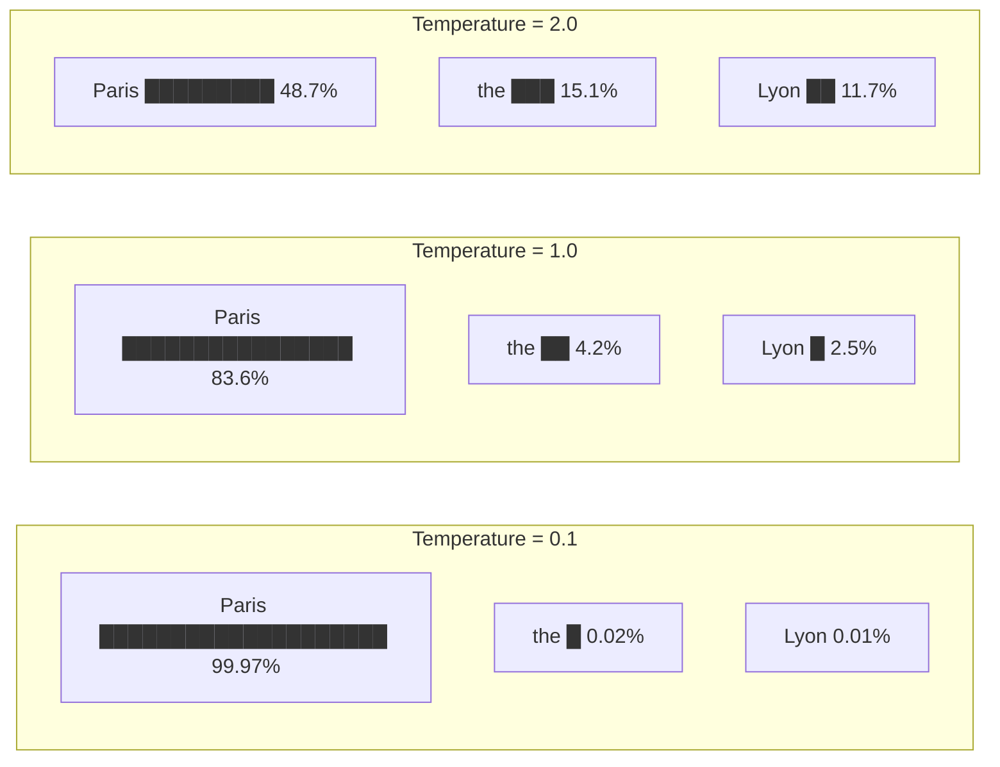
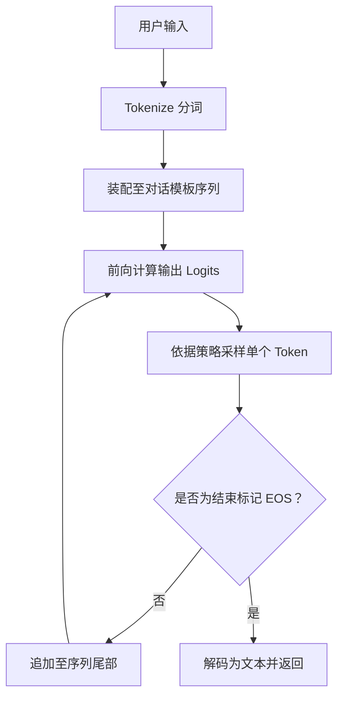
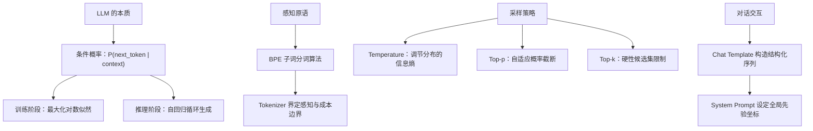

[目录](../README.md) | [下一章 →](02-attention.md)

**English**: [English](../en/chapters/01-next-token.md)

# 第一章：一切都是续写

> "The next token prediction objective is the most important idea in AI."
> (Ilya Sutskever)

若只用一句话道破现代大语言模型的本质，其实极其简单：模型从头到尾只做一件事，那就是**预测下一个 token**。

在公众眼里，大模型能写诗、能写代码，也能做复杂的推理与翻译。可这些本事从来不是工程师专门塞进系统里的独立功能，全是在追求极简预测目标的过程中自然**涌现**出的副产物。看懂了这层机理，才算真正抓住了理解现代语言模型的第一性原理。

---

## 1.1 Next-token prediction：LLM 唯一在做的事

### 核心形式化表达

从数学本质来看，语言模型就是一个纯粹的条件概率分布：

$$P(\text{next token} \mid \text{previous tokens})$$

只要拿到前面已经出现的所有上下文 token，模型就会在整个词表空间上算出一个概率向量，给出下一个位置可能出现的词元分布。在这样的结构里，找不出专门负责“语义理解”的独立模块，没有外挂的“逻辑推理”引擎，更见不到“结构化知识库检索”的影子：整套系统运转的全部家当，就是这个条件概率分布。

```
输入：  "The capital of France is"
输出：  {"Paris": 0.92, "the": 0.03, "a": 0.01, "located": 0.008, ...}
```

模型按照预设的采样策略从中挑选一个 token（比如 “Paris”），把它接在现有输入序列的末尾，再把这串变长了的文本作为新的上下文，继续预测下一个词。这个过程一轮轮循环下去，直到吐出序列结束标记（EOS），或是撞上预设的最大长度上限。这种一步步推着自己往前走的循环生成方式，就是**自回归生成**（autoregressive generation）。

### 预训练目标：在万亿级语料上最大化对数似然

模型的训练过程在数学上格外规整：把海量未经标注的真实文本喂给网络，要求它在序列里的每一个位置猜测下一个紧跟而来的 token，并用交叉熵损失来度量预测分布与真实观测之间的偏差：

$$\mathcal{L} = -\sum_{t=1}^{T} \log P(x_t \mid x_1, x_2, \ldots, x_{t-1})$$

这个优化目标就是**最大化对数似然**（maximum log-likelihood）。模型在数以万亿计的 token 序列上不断逼近这个目标，吞下的语料涵盖维基百科、学术论著、开源代码、专业书籍与网页。表面上它只是在算一个个词的概率，可投射到高维参数空间里，这实际上是在拟合整个人类数字化文明语料的联合概率分布。

### 简洁目标何以孕育复杂智能？

这是深度学习里最耐人寻味的现象：仅仅守着“预测下一个词”这么一个看似局部的目标，模型却在不知不觉中展现出了数学推理、编写代码与长程因果分析等一系列高阶能力。

背后的关键机理在于：想要在全局语境下精准预测下一个 token，模型就必须在隐空间里重建生成这段文本的底层世界状态。

不妨来看下面这个语境：

```
"张伟在北京出生，后来搬到了上海。他最怀念的是___的胡同。"
```

为了在空格处把最高概率给到“北京”而不是“上海”，模型必须在多层注意力与前馈网络里完成一连串隐式计算：
1. 持续追踪“张伟”的实体状态与时间叙事线索；
2. 解析“怀念”一词所包含的过往时态语义；
3. 调动地理文化先验，唤起“胡同”与北京之间的强关联属性。

这意味着，为了把下一个 token 的交叉熵损失压到极低，神经网络被迫在隐层中一点点建立起对物理世界常识、语法句法结构乃至严密逻辑链条的内部表征。正如 Ilya Sutskever 所指出的：

> "Predicting the next token well enough is equivalent to understanding the underlying reality that produced the text."

这倒不是说模型拥有了人类主观体验意义上的“理解”（我们会在 1.5 节深入探讨这幅哲学图景），但在信息处理与外在表现的实际效果上，二者展现出了高度的等价性。

---

## 1.2 Token ≠ 文字

### 模型的离散感知原语：Token

当你给模型输入“人工智能”四个字时，它看到的绝不是四个孤立的 Unicode 汉字，而是经过分词器切分出来的 token 序列：可能是两个 token `[人工, 智能]`，也可能是三个 token `[人, 工智, 能]`，全看分词器词表的构建策略。

Token 是大模型的**最小认知单元**。模型直接打交道的从来不是孤立的字符，也不是现实里的完整单词，它的所有计算都建立在由 token 索引构成的离散空间之上。摸清了分词器的切分逻辑，才能看清模型感知的底层边界。

### BPE：基于信息熵的子词合并

现代大语言模型普遍采用 **Byte Pair Encoding (BPE)** 算法。它构建词表的核心思路直观且自洽：

1. 初始化基础词表，以单字符或单字节作为最初的起点；
2. 统计整个语料库里所有相邻符号对碰在一起的频次；
3. 把出现频次最高的符号对合并成一个全新的复合 token，收入词表；
4. 反复重复这套循环，直到词表规模达到预设的数量（通常在 32k 到 128k 之间）。

```python
# 伪代码展示 BPE 的工作过程
# 原始文本（按字符拆分）
tokens = ['l', 'o', 'w', ' ', 'l', 'o', 'w', 'e', 'r', ' ', 'n', 'e', 'w']

# 第一轮：'l' + 'o' 最频繁 → 合并为 'lo'
tokens = ['lo', 'w', ' ', 'lo', 'w', 'e', 'r', ' ', 'n', 'e', 'w']

# 第二轮：'lo' + 'w' 最频繁 → 合并为 'low'
tokens = ['low', ' ', 'low', 'e', 'r', ' ', 'n', 'e', 'w']

# 依此类推...
```

### "strawberry" 难题与字符盲区

大模型有一个经常被拿来讨论的经典失效案例：

> 问："strawberry" 中有几个 "r"？
> 模型答：2 个（正确答案为 3 个）

问题的症结全在分词上。分词器把 “strawberry” 拆成了类似 `["str", "aw", "berry"]` 的子词单元。在自注意力机制里，模型拿到并计算的只是这三个 token 的嵌入向量，输入层根本没见过一个个单立的字母。让模型去数里面的字母，就像让人隔着组装好的积木，硬去数清楚里面藏了多少根连接轴一样勉为其难。

```python
# 用 tiktoken 看 GPT-4 的 tokenization
import tiktoken

enc = tiktoken.encoding_for_model("gpt-4o")

text = "strawberry"
tokens = enc.encode(text)
print(f"Token IDs: {tokens}")
print(f"Token count: {len(tokens)}")
for t in tokens:
    print(f"  {t} → '{enc.decode([t])}'")

# 输出类似：
# Token IDs: [496, 675, 15717]
# Token count: 3
#   496 → 'str'
#   675 → 'aw'
#   15717 → 'berry'
```

模型真正打交道的，是高维嵌入空间里的语义块。在这种纯粹由 token 构成的世界里，细粒度的字符级操作天然带有一层难以穿透的感知阻隔。

### 多语言 Fertility：语义密度与计费不对称性

分词器的训练语料向来以英文为主，这一先天偏置在面对不同语言时，扯开了一道明显的结构性鸿沟：

```python
import tiktoken

enc = tiktoken.encoding_for_model("gpt-4o")

texts = {
    "English": "Artificial intelligence is transforming the world.",
    "中文":    "人工智能正在改变世界。",
    "日本語":  "人工知能が世界を変えています。",
    "العربية": "الذكاء الاصطناعي يغير العالم.",
}

for lang, text in texts.items():
    tokens = enc.encode(text)
    print(f"{lang}: {len(tokens)} tokens for {len(text)} chars "
          f"(fertility: {len(tokens)/len(text):.2f})")

# 典型输出：
# English: 8 tokens for 49 chars (fertility: 0.16)
# 中文:    9 tokens for 11 chars (fertility: 0.82)
# 日本語:  12 tokens for 15 chars (fertility: 0.80)
# العربية: 11 tokens for 29 chars (fertility: 0.38)
```

**Fertility**（字符分词膨胀率）指的就是 Token 数量与字符数量之比。非英语语料偏高的 fertility 现象，在工程落地时会带来直接而具体的代价：

- **计费成本上升**：表达相同密度的语义往往要消耗更多 token，调用 API 的账单成倍往上翻；
- **有效上下文缩水**：在固定长度的上下文窗口里，能塞进去的非英文实际信息要少得多；
- **计算步数差异**：每个 token 背后的信息熵不同，模型处理不同语言时实际花费的推理步数并不对等。

### Tokenizer 塑造了模型的认知粒度

分词器远不止是个简单的数据预处理工具，它从最底层划定了模型计算图里的离散单元：

- 一旦专业领域的术语被切成七零八落的碎片 token，模型就得耗费好几层注意力回路，才能把这个概念重新拼凑起来；
- 若代码专用模型提前在词表里给关键字和缩进留好了专属 token，它在吞吐代码序列时的效率与推理表现就会大幅跃升；
- 采用不同的分词策略（例如 GPT-4o 与 Claude 系列），会直接让模型在字符敏感任务和跨语言场景里显出截然不同的性能底色。

---

## 1.3 Temperature 与采样：调节思维的熵

模型跑完一遍前向传播，交出来的最终产物，只是整个词表上一组未归一化的对数概率（logits）。要把这串冰冷的数字变成具体的输出符号，还得挑出一个词来，这一步就叫**采样**（sampling）。在这个环节里，Temperature 是最关键的调节阀，管着整张概率分布到底该陡峭还是平缓。

### Temperature：概率分布的锐化与平滑

落在数学公式上，Temperature 其实就是在送入 Softmax 函数之前，先拿来给 logits 向量除一下的缩放因子：

$$P(x_i) = \frac{\exp(z_i / T)}{\sum_j \exp(z_j / T)}$$

式中的 $z_i$ 是模型输出的 logit 值，$T$ 就是调节温度。

```
假设模型输出的 logits 为：
  "Paris": 5.0,  "the": 2.0,  "Lyon": 1.5,  "a": 1.0

Temperature = 0.1（极低）:
  "Paris": 0.9997, "the": 0.0002, "Lyon": 0.0001, "a": 0.0000
  → 概率质量极度向峰值集中，几乎确定性选择 "Paris"

Temperature = 1.0（标准）:
  "Paris": 0.8360, "the": 0.0416, "Lyon": 0.0253, "a": 0.0153
  → 保留原始训练分布的相对差异

Temperature = 2.0（较高）:
  "Paris": 0.4869, "the": 0.1507, "Lyon": 0.1172, "a": 0.0912
  → 概率分布趋于平缓，低概率候选获得显著采样机会
```



### 采样温度的工程选择

真正落到工程里，不必把 Temperature 当成随手乱拧的旋钮，它挑的其实是生成分布的**信息熵**：

| Temperature | 生成特征 | 推荐场景 |
|:---:|---|---|
| 0 | 贪婪解码（Greedy），锁定最大似然解 | 代码合成、确定性数学计算、结构化 JSON 输出 |
| 0.3-0.7 | 兼顾准确度与表达自然度，轻度随机 | 严谨技术问答、分析报告生成、通用多轮对话 |
| 0.8-1.2 | 积极探索分布低概率分支，发散度高 | 创意文案、头脑风暴、角色扮演 |
| >1.5 | 概率分布严重退化，接近均匀随机采样 | 极端多样性探索（极少用于生产系统） |

### Top-p（核采样）：动态自适应截断

Top-p（Nucleus Sampling，核采样）不走固定死守前 $k$ 个候选的老路，而是看累积概率来动态切一刀：把候选词按概率从大到小排好，只留下累积概率刚好凑满阈值 $p$ 的最小 token 集合。

```python
# Top-p = 0.9 的工作方式
probs = {"Paris": 0.84, "the": 0.04, "Lyon": 0.03, 
         "a": 0.02, "located": 0.015, ...}

# 按概率降序累加至 0.9
# Paris (0.84) + the (0.04) + Lyon (0.03) = 0.91 > 0.9
# → 动态候选集截断为: {Paris, the, Lyon}
# → 在此子集内重新归一化并执行采样
```

Top-p 在工程上的高明之处，全在它的**上下文敏感性**：
- 遇到模型把握极大的情况（排在第一的 token 概率达到 0.95），候选池会自动收窄到 1 到 2 个 token；
- 赶上概率分布平缓分散，候选池又会跟着放宽，省得过早切断那些其实说得通的句子走向。

### Top-k：硬性数量截断

Top-k 策略切得干脆直接，划定一条死线，死死咬住概率最高的 $k$ 个 token 重新归一化再采样。碰上长尾噪声杂乱又想卡死离群词的场面，通常拿它配合 Top-p 一起压阵。

```python
# Top-k = 5
# 无论概率分布形态如何，仅保留前 5 个候选
# 局限：在模型高置信区间引入冗余候选，在低置信区间可能过早截断合理路径
```

### 生产环境配置建议

```python
# 确定性任务：设定零温度，消除随机扰动
response = client.messages.create(
    model="claude-sonnet-4-20250514",
    temperature=0,  # 确定性输出
    messages=[{"role": "user", "content": "法国的首都是哪里？"}]
)

# 开放式创作：适度提高温度与核采样阈值
response = client.messages.create(
    model="claude-sonnet-4-20250514",
    temperature=0.9,
    top_p=0.95,
    messages=[{"role": "user", "content": "写一首关于秋天的诗"}]
)
```

这里最要紧的心智模型是：Temperature 根本改不了模型内部存储的先验分布，它决定的只是在这张高维概率曲面上抽样轨迹时的探索策略。无论参数怎么设，底层权重里沉淀下来的知识几何结构，从头到尾都在那里，分毫未改。

---

## 1.4 从单向续写到人机对话

### 基座模型：纯粹的文本补全引擎

未经指令微调的预训练基座模型（base model），说到底是台不问青红皂白的文字接龙机器。它算来算去，唯一的执念就是顺着输入上下文的统计概率把后面的字接出来：

```
输入："今天天气真好"
输出："，阳光明媚，适合出去散步。小明拿起了他的背包..."（延续小说或记叙文体）
```

基座模型压根没有明面上的“问答意识”。你给它输入“中国的首都是哪里？”，它吐出来的很可能是：

```
"中国的首都是哪里？这是一道小学二年级的地理题。许多同学在作答时..."
```

这可不是系统出了故障，只是模型顺着这个 prompt 散发出来的语境，挑了一篇最像考试教辅的文档接着往下写。

### 对话模板：用特殊 Token 构筑交互协议

想让接龙机器规规矩矩扮成问答助手，工程上搬出了**对话模板**（chat template）。这套做法用上专门保留的特殊控制 token，把来来回回的多轮对话串成一条界限分明的单一文本流，硬生生把模型接下来的输出，严丝合缝地框在助手的回复槽位里。

拿标准的 ChatML 格式来看：

```
<|im_start|>system
你是一个有帮助的助手。
<|im_end|>
<|im_start|>user
中国的首都是哪里？
<|im_end|>
<|im_start|>assistant
```

当上下文一路喂到结尾的 `<|im_start|>assistant`，微调语料里训出来的先验就接管了局面，此时概率最高的续写，自然落在了助手该说的话上：

```
中国的首都是北京。
<|im_end|>
```

对话从来不是模型与生俱来的结构，无非是套上一层协议标记、在规矩里跑出来的受限自回归续写。

要是换成条件概率的数学眼光来看，多轮对话的底子依旧没变：

$$P(\text{response} \mid \text{system prompt},\ \text{chat history},\ \text{user message})$$

底层的计算图从没起过半点波澜，变动的无非是加在自回归过程上的条件约束（conditioning）。

### System Prompt：重塑条件概率流向

System Prompt 握着极大的分量，全因它稳坐序列的最前端，给后头整张条件概率分布定下了起跑的初始坐标。

```
未设定 system prompt 时：
  P("I cannot" | user: "How to hack a website?") = 0.3
  P("First, you" | user: "How to hack a website?") = 0.4

设定 "You are a security expert..." 时：
  P("I cannot" | system + user) = 0.1
  P("First, you" | system + user) = 0.6

设定 "You are a helpful assistant that never discusses hacking" 时：
  P("I cannot" | system + user) = 0.8
  P("First, you" | system + user) = 0.05
```

System Prompt 绝不是什么焊死的硬编码规则，它只是嵌进注意力图谱里、持续拉扯后续生成的强力先验条件。模型内部并没有一个独立的“规则仲裁器”，无非是在整片上下文的笼罩下，顺着概率坡度最陡的路径一路自回归采样下去。

这个底子，正好解开了提示工程里几桩常见的现象：
- 篇幅过长、事无巨细的 System Prompt，会冲淡关键要求的注意力权重（信噪比随之下降）；
- 落在上下文最末尾的指令，往往更有即时掌控力（位置临近效应）；
- 规整严密的结构化格式，比含混随意的口语更能调动起底层的高质量生成模式。

### “理解”的涌现表象与自回归流

跟模型聊得投机时，人很容易产生错觉，以为对面当真生出了心智、在认真理解字句。可要是把这些拟人化的修辞一层层剥开，里头的执行过程其实单纯得近乎机械：



往前吐字的每一步，模型不过是做了一次确定性的张量前向传播：把前头所有的 token 整个吞进去，算出下一个 token 的离散概率。这里头根本不存在什么先理解再构思的独立阶段，更谈不上通盘的修辞筹划。人所感受到的严密逻辑与行文连贯，无非是大规模参数在海量语料流形上自回归滑移时，自然涌现出来的表象。

---

## 1.5 思维实验：Next-token Predictor 是否理解语言？

大模型到底懂不懂语义，看似是认知哲学的思辨，实则直接决定了架构师怎么划定防线：你究竟能在多大范围内放手让它自主决策，又该在哪里筑起安全兜底。

### 中文房间思想实验的当代映射

哲学家 John Searle 在 1980 年提出了著名的“中文房间”思想实验：

> 一个对中文一无所知的操作员独坐密室，手里只有一本极其详尽的符号操作手册。门外递进写有中文问题的纸条，操作员照着手册机械检索匹配，拼出对应的中文字符递出密室。门外的观察者由此推断，屋里存在一个精通中文的心智实体。
>
> 核心追问：该操作员是否真正“理解”了中文？

Searle 给出的结论是否定的：纯粹的句法符号操作，无法自发生成内在的语义意向性。

把这套逻辑映射到 LLM 身上，追问同样直接：一个单纯依据统计关联预测下一个符号的张量网络，内部究竟有没有构建起对客观世界的真实理解？

### 算法信息论视角：压缩等同于理解

AIXI 理论创立者 Marcus Hutter 设立了著名的 **Hutter Prize**，奖赏那些在维基百科文本压缩比上取得突破的算法。

背后的理论洞见格外深刻：最优压缩与通用智能在数学上本就是一体两面。

一个模型若能把预测下一个 token 的交叉熵损失降到零，就等于把训练语料做到了无损压缩。要在多维文本流中做到极限压缩，网络内部必须把数据里的冗余与内在规律彻底显式化：

- 掌握语法规则（否则无法压缩句式结构里的冗余）；
- 习得实体世界知识（否则无法压缩事实陈述中的高阶关联）；
- 捕获因果与逻辑链条（否则无法压缩长程推理中的确定性轨迹）；
- 拟合人类行为模式（否则无法预测社会交互与心理语境的演化）。

沿着这一视角推演下去：一个在多模态、超大规模语料上把困惑度（Perplexity）压到极低的预测器，其内部必然演化出了高度映射客观规律的**世界模型**。

### 反方论点：统计捷径与随机鹦鹉

反方的批判视角同样有力：模型极有可能只是抓住了表层分布里的**统计捷径**（statistical shortcuts），而不是深层的因果机制。

比如，模型能顺畅续写，可能仅仅依赖语料中“居里夫人”与“镭”、“诺贝尔奖”在局部的频繁共现，并不代表它掌握了放射性物理学的形式化演化体系。Emily Bender 等人在论文中将其表述为“随机鹦鹉”（stochastic parrots, Bender et al., 2021）：网络在海量数据中拟合出极其逼真的符号链条，本质上依然只是对高维统计关联的拟合。

### 务实的系统工程师视角

面对理论界的本体论争吵，做系统的工程师更需要一套立足第一性原理的操作框架：

1. **破除拟人化迷思**：模型没有主观意图，更谈不上信念体系，说到底是一个参数量庞大、定义在离散序列空间上的高维非线性映射函数；
2. **正视隐层几何表征**：不能因为训练目标单一就否定它的实际效用，网络隐层中的确涌现出了具有泛化能力的高维因果回路；
3. **以行为边界替代本质争论**：抛开“模型是否拥有心智”这类形而上学的发问，把精力收回到明确的系统工程问题上：“在特定输入分布、特定上下文约束与确定性置信区间下，系统的输出究竟有多高的统计可靠性？”

### 导向实践的工程推论

这套认知框架落到系统构建上，给出了清晰的边界指引：

- **形式合理性与事实真值脱耦**：模型优化的是局部序列的似然概率，而不是真理本身，极易生成逻辑流畅却完全虚构的陈述；
- **分布外泛化的退化特性**：一旦脱离训练分布，边缘任务便无法依赖已有的流形结构，模型将退化为不可靠的随机推测；
- **推理过程的近似性与概率累积**：自回归的每一步都是一次概率采样，在长链条逻辑推演中，错误率会随着步数呈指数级叠加；
- **分布内模式的高保真度**：只要身处充分训练的通用模式空间，模型在知识提取与结构重组上的效率，就远超传统的规则系统。

---

## 本章小结



核心要点：

1. **LLM 的单一原语即 next-token prediction**：所有高阶能力，归根结底都是概率优化过程中涌现出来的副产物；
2. **Token 是模型的最小认知单元**：分词切分直接决定了模型的表征粒度、计算复杂度与经济成本；
3. **Temperature 调控思维的熵值**：它决定了在概率曲面上采样的探索广度，改变的是采样的多样性，而非模型固有的知识储备；
4. **对话交互是对特定模板的续写**：对话并非独立架构，无非是在格式化上下文之上的条件概率推演；
5. **表征理解呈现连续谱系**：模型通过压缩语料重构了高维统计结构，但在工程落地时，必须时刻警惕概率采样与客观事实之间的内在张力。

在下一章中，我们将深入 Transformer 的计算中枢，拆解注意力机制（Attention）如何在序列内部搭建起动态的信息路由通道。

---

## 延伸阅读

- Language Models are Few-Shot Learners (GPT-3), Brown et al., 2020: https://arxiv.org/abs/2005.14165
- On the Dangers of Stochastic Parrots, Bender et al., 2021: https://dl.acm.org/doi/10.1145/3442188.3445922
- Hutter Prize (压缩与智能的关系), Marcus Hutter: http://prize.hutter1.net/
- The Bitter Lesson, Rich Sutton, 2019: http://www.incompleteideas.net/IncIdeas/BitterLesson.html
- tiktoken (OpenAI 分词器工程实现): https://github.com/openai/tiktoken
- SentencePiece (Google 子词分词系统): https://github.com/google/sentencepiece
