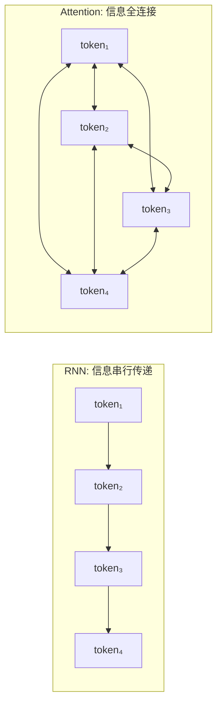
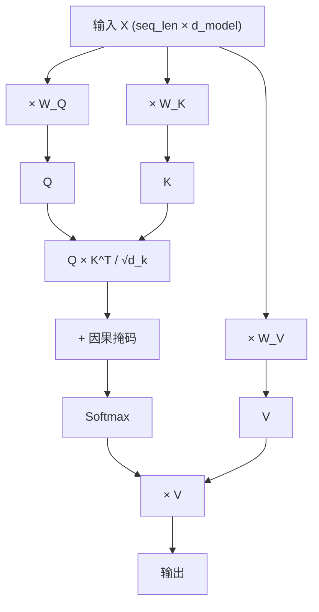
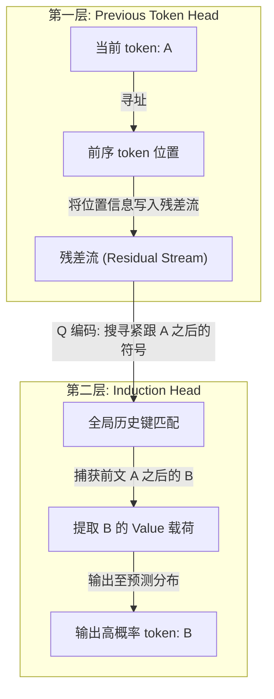
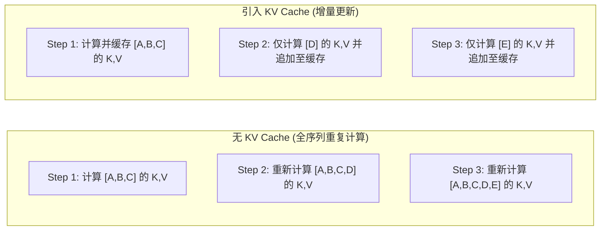
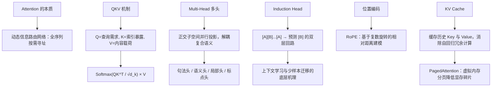

[← 上一章](01-next-token.md) | [目录](../README.md) | [下一章 →](03-scaling.md)

**English**: [English](../en/chapters/02-attention.md)

# 第二章：Attention 是信息路由

> "Attention is all you need."
> (Vaswani et al., 2017)

“注意力”这个名字起得很像人的心智活动，听上去总叫人想到目光停在何处、心思偏向哪端。但在 Transformer 的数学底子里，Attention 本质上是一套**动态信息路由网络**：序列里的每个 token 自己发起查询，量出自己和上下文里每一个位置的亲疏关系，再把全篇散落的信息按需抓取回来。

看清了这套路由机制，也就抓住了 Transformer 架构的中枢；大语言模型内部所有的计算流，底子全在这里。

---

## 2.1 Attention 解决了什么问题

### RNN 的瓶颈：串行递推与信息隘口

在 Transformer 出现以前，处理序列数据主要靠循环神经网络（RNN）。RNN 走的是一条一步接一步的链式传递路子：

```
token_1 → [h₁] → token_2 → [h₂] → token_3 → [h₃] → ... → token_n → [hₙ]
```

无论前面写了多少字，所有的历史记忆都得硬塞进一个固定维度的隐藏状态向量 $h$ 里。要把 token_1 的信息送给 token_1000，信号就得挨过 999 次矩阵乘法与非线性变换。这种串行递推结构注定会遇上梯度消失与信息衰减，就像排成一长排的传话游戏，传到队尾，开头的细节早就磨损殆尽了。

后来的 LSTM 与 GRU 引入了门控机制，也只是稍作缓解，没能彻底消除**长程依赖瓶颈**。时间轴上一环扣一环的强串行依赖，更是从底层锁死了硬件做大规模并行加速的可能。

### Attention：全连接的信息直连图谱

Attention 机制彻底重写了信息传递的拓扑结构：序列里任意两个 token 之间，都能建起距离为 $O(1)$ 的直接通信通道。



在这张全连接的图谱里，token_1000 不用再穿过中间的层层递推，直接寻址就能抓取 token_1 的表征。

这种全局连通的代价，是计算复杂度会随着序列长度呈平方级增长：**$O(n^2)$**。在一个包含 $n$ 个 token 的序列里，每两个位置之间都要算上一回注意力权重。如果处理一段长达 100K token 的文本，单单跑一层自注意力，就得做 $10^5 \times 10^5 = 100$ 亿次点积运算。这也是上下文窗口无法无休止扩充的硬约束。

---

## 2.2 QKV：查询、匹配与加权聚合

自注意力机制的核心运算，落在那三个由线性投影矩阵变换出的高维向量上：**Query (Q)、Key (K)、Value (V)**。

### 直觉：可微分的软寻址数据库

要建立对 QKV 的直觉，最顺手的视角就是带参数的数据库查询系统：

```sql
SELECT value FROM memory WHERE key MATCHES query
```

- **Q (Query)**：当前 token 想要寻找什么样的语义特征；
- **K (Key)**：当前 token 拿出来供别人检索的索引特征；
- **V (Value)**：一旦匹配成功，当前 token 真正向外输出的表征内容。

在每一层自注意力里，每个 token 都身兼三角：拿自身的 Q 去检索全局，凭自身的 K 响应其他位置的探寻，再用自身的 V 向匹配上的对象传递具体信息。

### 计算过程

```python
import torch
import torch.nn.functional as F

def attention(Q, K, V, mask=None):
    """
    Q, K, V: [batch, seq_len, d_k]
    """
    d_k = Q.size(-1)
    
    # Step 1: 计算注意力得分（Q 和 K 的点积）
    scores = torch.matmul(Q, K.transpose(-2, -1)) / (d_k ** 0.5)
    # scores: [batch, seq_len, seq_len]，表示每对 token 之间的相关度
    
    # Step 2: 因果掩码（对于 decoder，不能看到未来）
    if mask is not None:
        scores = scores.masked_fill(mask == 0, float('-inf'))
    
    # Step 3: Softmax 归一化 → 注意力权重
    weights = F.softmax(scores, dim=-1)
    # weights: [batch, seq_len, seq_len]，每行求和为 1
    
    # Step 4: 用权重加权求和 V
    output = torch.matmul(weights, V)
    # output: [batch, seq_len, d_k]
    
    return output, weights
```

这段计算拆开来看，主要分为四个阶段：

**第一阶段：点积相似度与尺度缩放**

向量 $Q$ 和 $K$ 之间的点积，衡量的是两者在几何空间里的契合程度。算出的点积越大，说明当前的查询需求与对方给出的索引匹配得越紧密。

这里除以 $\sqrt{d_k}$，图的是数值上的平稳。当隐层维度 $d_k$ 变大时，向量点积的方差会跟着维度线性抬升，极容易把计算结果推入 Softmax 函数两端的饱和区，引发梯度弥散。缩放因子 $\frac{1}{\sqrt{d_k}}$ 能把方差重新拉回单位尺度，这正是 **Scaled Dot-Product Attention** 的核心设计。

**第二阶段：因果掩码（Causal Mask）**

自回归解码器在生成当前位置时，绝不能提前看到未来的内容。因果掩码在这里构筑起一个严格的下三角矩阵：

```
     t₁  t₂  t₃  t₄
t₁ [  1   0   0   0 ]    t₁ 仅可寻址自身
t₂ [  1   1   0   0 ]    t₂ 可寻址 t₁ 与自身
t₃ [  1   1   1   0 ]    t₃ 可寻址 t₁, t₂ 与自身
t₄ [  1   1   1   1 ]    t₄ 可寻址全局历史
```

凡是被掩码挡住的位置都会填上 $-\infty$，走过一遍 Softmax 之后，对应的权重就精准地化为零。

**第三阶段：Softmax 概率归一化**

Softmax 会把未校准的匹配得分压成一份规整的概率分布。每个 token 手头都有 100% 的权重预算，按照匹配程度的高低，把注意力动态分配给序列里的各个历史位置。

**第四阶段：Value 向量的加权汇聚**

拿归一化后的注意力权重，对 $V$ 矩阵做一次线性加权求和。如果 token_5 分给 token_2 的权重是 0.7，分给 token_1 的是 0.2，那么 token_5 汇聚后的输出向量里，就会包含 70% 来自 token_2 的信息与 20% 来自 token_1 的信息。

### 完整的自注意力数据流



这里最关键的地方在于，Q、K、V 全都出自同一组输入表征 $X$，只是各自经过了不同的可学习线性投影。模型在持续更新参数矩阵 $W_Q$、$W_K$ 与 $W_V$ 的过程中，自然会学会根据不同任务“去寻找何种特征”、“亮出何种索引”，并“传递何种信息载荷”。

---

## 2.3 Multi-Head Attention：多子空间并行路由

单一组 QKV 投影只能在高维空间里走出一种关联方向。**多头注意力**（Multi-Head Attention）的做法，是把表征切分到多个低维的正交子空间里：各头各自去算注意力，让模型在同一个瞬间看清序列里的多重关系。

```python
class MultiHeadAttention(torch.nn.Module):
    def __init__(self, d_model, n_heads):
        super().__init__()
        self.n_heads = n_heads
        self.d_k = d_model // n_heads
        
        # 每个头有自己的 Q, K, V 投影
        self.W_q = torch.nn.Linear(d_model, d_model)
        self.W_k = torch.nn.Linear(d_model, d_model)
        self.W_v = torch.nn.Linear(d_model, d_model)
        self.W_o = torch.nn.Linear(d_model, d_model)
    
    def forward(self, x, mask=None):
        batch, seq_len, d_model = x.shape
        
        # 投影并拆分成多个头
        Q = self.W_q(x).view(batch, seq_len, self.n_heads, self.d_k).transpose(1, 2)
        K = self.W_k(x).view(batch, seq_len, self.n_heads, self.d_k).transpose(1, 2)
        V = self.W_v(x).view(batch, seq_len, self.n_heads, self.d_k).transpose(1, 2)
        # Q, K, V: [batch, n_heads, seq_len, d_k]
        
        # 每个头独立做 attention
        out, weights = attention(Q, K, V, mask)
        
        # 拼接所有头的输出
        out = out.transpose(1, 2).contiguous().view(batch, seq_len, d_model)
        
        # 最终线性变换
        return self.W_o(out)
```

### 多头关注的语义模式分化

在关于机制可解释性的研究（Clark et al., 2019）里，只要网络训练得足够充分，不同的注意力头就会分工明确，各自盯住不同的语言特征：

- **句法头（Syntactic Heads）**：专门处理主谓一致等句法依赖（比如在 "The dogs **are** running" 中，"are" 会牢牢指向 "dogs"）；
- **位置邻域头（Positional Heads）**：紧盯着相邻的前后位置，如同在局部上下文里拉开一扇滑动窗口；
- **指代消解头（Coreference Heads）**：跨过漫长的距离，把代词准确系在它对应的先行词上；
- **标点与边界头（Delimiter Heads）**：一路追踪句号、换行符这类标点，守住段落与句子的边界；
- **模式匹配头（Pattern Matching Heads）**：在整个序列里搜寻反复出现的固定搭配与结构模式。

### 复杂语义的并行解析

不妨看一句同时包含歧义与远距离指代的复杂句子：

> "The trophy doesn't fit in the brown suitcase because **it** is too big."

要理清这句话背后的物理因果，模型必须在同一时刻分头理清好几条线索：
- **代词指代**："it" 究竟指向 "trophy" 还是 "suitcase"（由指代头判定）；
- **逻辑因果**："because" 串联起的前后因果从句（由逻辑关系头维持）；
- **物理量纲**："too big" 所描述的空间大小（由实体属性头关联）；
- **句法骨架**：谓语动词与宾语之间的支配结构（由句法解析头搭建）。

正是靠着正交子空间的并行投影，单层网络不必在不同的语义流形之间取舍，便能在同一时间把零散的信息分路送达、重新拼合。

---

## 2.4 Induction Heads：上下文学习的最小算法回路

### 什么是 Induction Head？

Olsson 等人在 2022 年的研究里，发现了一种名为 **Induction Head（归纳头）** 的特殊注意力回路。它被看作是 Transformer 在无监督预训练中自发演化出来的、最基础的“算法回路”。

归纳头所做的事情，在逻辑上格外清晰：

> 若在前序上下文中曾出现过模式 `[A][B]`，当序列再度出现 `[A]` 时，模型倾向于预测紧随其后的 token 为 `[B]`。

```
文本上下文: "Harry Potter is a wizard. Harry Potter is a"
                                                 ^
                                    模型在此位置预测下一个 token
                                    
归纳头回路的协同机制：
  1. 感知当前活跃 token 为 "a"；
  2. 沿历史注意力图谱检索先前出现过 "a" 的上下文节点；
  3. 定位至前文 "...is a wizard..." 片段；
  4. 提取该节点紧邻的后置 token 内容："wizard"；
  5. 显著提升下一个预测 token 为 "wizard" 的似然概率。
```

### 上下文学习（In-Context Learning）的物理基石

Induction Head 正是 Few-shot Prompting 能够奏效的微观机理。模型根本不需要调整任何权重，单凭上下文里的几个样例就能摸索出规律并照样套用，靠的就是这种机制：

```
输入样例:
  "cat → 猫
   dog → 狗
   bird → "

模型借助 Induction Head 激活模式匹配：
  英文标识符 → 中文映射
  英文标识符 → 中文映射
  英文标识符 → [触发归纳复制]
  
生成输出: "鸟"
```

此时模型并没有去查阅什么显式的符号翻译词典，模式匹配、上下文寻址与条件补全，全都在注意力回路里一气呵成。

### 双层注意力回路的级联协作

单层注意力装不下完整的 Induction Head，它必须靠两层注意力机制在残差流中搭手协作：



1. **第 1 层（前序位置头）**：把“前一个 token 的标识与位置”编码之后，写入大家共享的残差流；
2. **第 2 层（归纳头）**：读取残差流里的前序信息来构造 Query，在整段历史中精准匹配相同的 Key，顺势取出其后继 token 的 Value 向量。

这也是一个极具代表性的例子：神经网络在自回归训练中，仅凭多层结构之间的层层交互，就能自发搭出精巧的逻辑算法。

---

## 2.5 位置编码：为置换不变性引入几何序

### Transformer 的排列不变性挑战

纯粹的自注意力计算天生带着**置换不变性**（Permutation Invariance）。哪怕把输入序列里 token 的顺序随手打乱，算出来的注意力权重也只是跟着换了换位置，数值之间的相对关系根本不会发生实质改变。

这意味着，要是抽掉位置信息，Transformer 将完全分不清：

- "猫 吃 鱼" 与 "鱼 吃 猫"

因为两句话拆出来的嵌入集合完全重合。

### RoPE：基于复数旋转的相对位置编码

如今主流的大语言模型，普遍采用 **Rotary Position Embedding (RoPE)**（Su et al., 2021）。

RoPE 的精妙之处在于，它把 token 的绝对位置编码成了高维向量在复数子空间里的旋转角度。当模型计算两个 token 之间的注意力得分时，向量点积会自然消去各自的绝对坐标，最终留下的注意力强度，仅仅取决于彼此之间的**相对距离**。

```python
import torch

def apply_rope(x, positions, d_model):
    """
    x: [batch, seq_len, d_model], Q 或 K 向量
    positions: [seq_len], 位置索引
    """
    # 频率：不同维度用不同频率
    freqs = 1.0 / (10000 ** (torch.arange(0, d_model, 2).float() / d_model))
    # [d_model/2]
    
    # 角度 = 位置 × 频率
    angles = positions.unsqueeze(-1) * freqs.unsqueeze(0)
    # [seq_len, d_model/2]
    
    cos_angles = torch.cos(angles)
    sin_angles = torch.sin(angles)
    
    # 对 x 的偶数维和奇数维分别处理
    x_even = x[..., 0::2]  # 偶数维
    x_odd  = x[..., 1::2]  # 奇数维
    
    # 旋转
    x_rotated_even = x_even * cos_angles - x_odd * sin_angles
    x_rotated_odd  = x_even * sin_angles + x_odd * cos_angles
    
    # 交错拼接
    x_rotated = torch.stack([x_rotated_even, x_rotated_odd], dim=-1)
    return x_rotated.flatten(-2)
```

RoPE 在结构上的长处，集中体现在三点：
- 相对距离敏感：点积随距离自然衰减的特质，与自然语言本身的规律高度契合；
- 零额外参数：计算完全依靠确定性的正余弦变换，不需要引入任何可学习参数；
- 外推友好：在长上下文扩展算法中留出了良好的连续插值空间。

### 上下文窗口：注意力的物理边界

所谓上下文窗口（Context Window），指的就是模型在单次前向传播中，能够同时维持注意力计算的最大序列长度。

```
GPT-4o:      128K tokens
Claude 3.5:  200K tokens
Gemini 1.5:  1M-2M tokens
```

想要把上下文窗口继续拉长，面前横着三道硬碰硬的防线：
1. **计算复杂度**：$O(n^2)$ 的注意力计算在面对长序列时，浮点开销会陡增；
2. **显存容量**：KV Cache 随着序列变长与批次规模而线性膨胀；
3. **位置流形衰减**：一旦超出预训练接触过的最大距离，位置编码在内积外推时的稳定性就会迅速衰退。

只要掉出上下文窗口的边界之外，那些信息在模型的前向传播里就彻底不可见，成了物理意义上的绝对盲区。

---

## 2.6 KV Cache：自回归推理的时空权衡

### 自回归生成的计算冗余

自回归模型生成文本，过程是一步接着一步往前推的：

```
Step 1: 输入 [A, B, C]       → 预测 D
Step 2: 输入 [A, B, C, D]     → 预测 E
Step 3: 输入 [A, B, C, D, E]   → 预测 F
```

在最朴素的前向传播里，模型在 Step 2 处理 [A, B, C, D] 时，会把前序 token [A, B, C] 的 QKV 矩阵乘法完完整整重算一遍。可因为因果掩码立在那里，前面这些 token 算出来的 Key 和 Value 向量在后续时间步里从来不会改变；每往前走一步就重算一整轮历史，平白耗费了大把算力。

### KV Cache：以内存换时延的核心优化

优化的核心思路并不复杂：在自回归生成阶段把所有历史 token 的 Key 与 Value 张量存入缓存，往后每次迭代，只需为最新生成的单个 token 计算 QKV 向量。

```python
class CachedAttention:
    def __init__(self):
        self.k_cache = None  # 缓存所有已生成 token 的 K
        self.v_cache = None  # 缓存所有已生成 token 的 V
    
    def forward(self, x_new, W_q, W_k, W_v):
        """x_new: 只有新 token 的表示"""
        # 只计算新 token 的 Q, K, V
        q_new = x_new @ W_q
        k_new = x_new @ W_k
        v_new = x_new @ W_v
        
        # 把新的 K, V 追加到缓存
        if self.k_cache is not None:
            self.k_cache = torch.cat([self.k_cache, k_new], dim=1)
            self.v_cache = torch.cat([self.v_cache, v_new], dim=1)
        else:
            self.k_cache = k_new
            self.v_cache = v_new
        
        # Q 只有新 token 的，但 K 和 V 是全部历史
        scores = torch.matmul(q_new, self.k_cache.transpose(-2, -1))
        weights = F.softmax(scores / (self.d_k ** 0.5), dim=-1)
        output = torch.matmul(weights, self.v_cache)
        
        return output
```



### 显存占用的量化分析

KV Cache 省下了重复计算的算力，却把推理的压力全推到了**显存容量与内存带宽**上。我们不妨为一个标准的 70B 密集模型算一笔账，以 FP16 精度为例：

```
单个 token 在单层网络中的 KV Cache 尺寸:
  = 2 (K与V) × n_heads × d_head × sizeof(float16)
  = 2 × 64 × 128 × 2 bytes
  = 32 KB / layer / token

在 80 层 Transformer 网络中：
  80 层 × 32 KB = 2.56 MB / token

在 128K 超长上下文单并发请求下：
  128,000 × 2.56 MB ≈ 327.68 GB (显存需求已显著超过模型本身的权重开销)
```

长文本推理之所以贵，症结从来不在 GPU 的算力上限，而在于高带宽显存（HBM）的物理容量与读写吞吐。

### PagedAttention：操作系统级显存分页管理

早期的服务框架总想为每个请求提前切出一整块连续显存，结果落得满地碎片。vLLM 换了个思路，把操作系统里的虚拟内存分页机制搬了过来，提出 **PagedAttention**（Kwon et al., 2023），重新规整了 KV Cache 的管理方式：

```
连续预分配模式：为每个请求按照最长上下文分配连续显存池
  → 产生大量内部碎片与外部碎片，有效显存利用率不足 40%

PagedAttention 模式：将 KV Cache 切分为固定尺寸的物理 Block（页）
  → 建立逻辑页到非连续物理页的页表映射
  → 实现零显存碎片与跨请求前缀的写时复制（Copy-on-Write）
  → 显存吞吐与并发服务容量提升 2 至 4 倍
```

正是这一步改动，真正抬高了大语言模型在线推理集群的吞吐天花板，把部署成本实打实压了下来。

---

## 2.7 可视化：注意力图谱的微观观测

把模型内部的注意力矩阵画出来看上一眼，前面推演的那些机制便有了清晰可辨的微观形态。

### 用 BertViz 做交互式分析

```python
from bertviz import head_view
from transformers import AutoTokenizer, AutoModel

model_name = "bert-base-uncased"
tokenizer = AutoTokenizer.from_pretrained(model_name)
model = AutoModel.from_pretrained(model_name, output_attentions=True)

text = "The cat sat on the mat because it was tired."
inputs = tokenizer(text, return_tensors="pt")
outputs = model(**inputs)

attention = outputs.attentions  # tuple of (batch, heads, seq, seq)
tokens = tokenizer.convert_ids_to_tokens(inputs["input_ids"][0])

head_view(attention, tokens)
```

### 典型注意力模式剖析

**1. 主谓对齐头**

```
"The dogs in the park are running fast"

   dogs ←←←←←←←←←← are
   (特定 head 在跨越介词短语障碍后，精准将谓语与主语建立高权重连接)
```

**2. 先行词消解头**

```
"Alice told Bob that she would help him tomorrow"

   she →→→→→→→→→→→ Alice    (代词精准回溯指向对应主体)
   him →→→→→→→→→ Bob
```

**3. 邻域平滑头**

有些注意力头在图谱上走出清晰的次对角线，专门在邻近的小窗口里平滑语境表征，做的事情就像局部的 $n$-gram 提取器。

**4. 标点汇聚头**

许多注意力会大量涌向句号与换行符这类特殊标记。研究发现，模型经常把标点符号用作全局路由中继站，在此处暂存信息，再向全篇广播。

### 深浅隐层的特征表征演进

顺着网络深度一层层看下去，注意力展现出清晰的由表及里的演进轨迹：底部的浅层网络主要忙于局部的分词拼装与浅层句法对齐；越往深处的高层走，注意力便逐步抽象为全局语义消歧、实体关系追踪和逻辑推理。这种自底向上的层层抽象，正是深度架构强大表达能力的根基。

---

## 本章小结



核心要点：

1. **Attention 的本质是信息路由**：摆脱了 RNN 必须按部就班的串行包袱，让每个 token 都能在整条序列里按需寻址；
2. **QKV 三元组构建软寻址通道**：Query 带着需求主动寻址，Key 亮出特征供匹配索引，Value 负责承载真正的内容；
3. **Multi-Head 实现了多维语义解耦**：多组正交投影让模型能够分头并行，同时捕获句法、逻辑和实体指代；
4. **Induction Head 构成了上下文学习的原语**：两层级联的注意力回路，让网络在训练中自发演化出了模式复现的算法；
5. **RoPE 赋予模型相对位置感知**：用精巧的复数旋转几何，把序列的时序先后自然融进了表征之中；
6. **KV Cache 决定了在线推理的显存天花板**：序列拉长之后，死死卡住在线推理的不再是算力，而是显存带宽与物理容量；
7. **上下文窗口构成刚性边界**：落在窗口外面的信息，在前向传播中完全不可见。

下一章我们会把视野拉得更开，去看看当这些基础模块在澎湃算力下堆叠到万亿参数规模时，整个系统会展现出怎样的统计规律与涌现特性。

---

## 延伸阅读

- Attention Is All You Need, Vaswani et al., 2017: https://arxiv.org/abs/1706.03762
- In-context Learning and Induction Heads, Olsson et al., 2022: https://arxiv.org/abs/2209.11895
- What Does BERT Look At?, Clark et al., 2019: https://arxiv.org/abs/1906.04341
- RoFormer: Enhanced Transformer with Rotary Position Embedding, Su et al., 2021: https://arxiv.org/abs/2104.09864
- Efficient Memory Management for Large Language Model Serving with PagedAttention, Kwon et al., 2023: https://arxiv.org/abs/2309.06180
- BertViz (注意力交互式可视化工具): https://github.com/jessevig/bertviz
- A Mathematical Framework for Transformer Circuits, Elhage et al., 2021: https://transformer-circuits.pub/2021/framework/index.html
