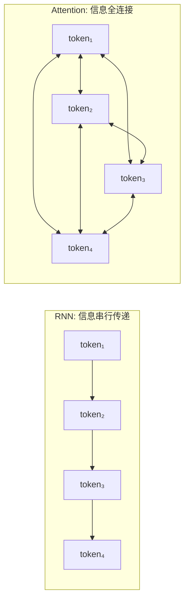
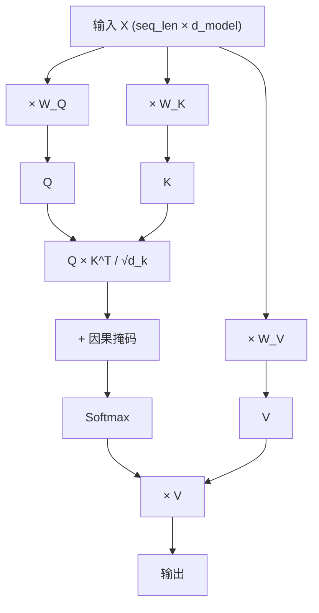
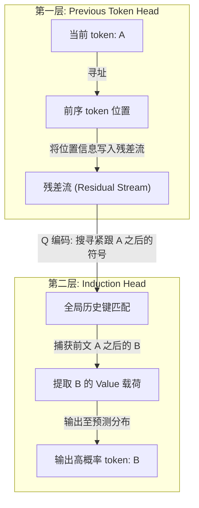
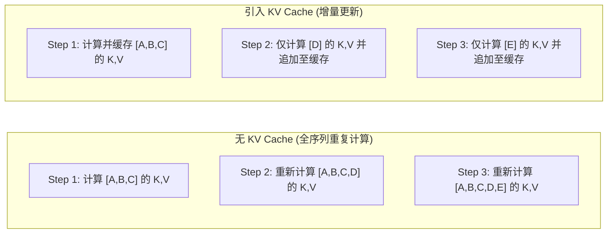
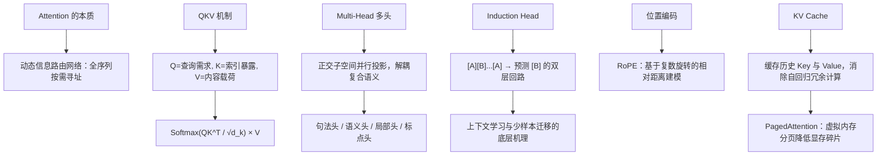

[← 上一章](01-next-token.md) | [目录](../README.md) | [下一章 →](03-scaling.md)

**English**: [English](../en/chapters/02-attention.md)

# 第二章：Attention 是信息路由

> "Attention is all you need."
> (Vaswani et al., 2017)

"注意力"在命名上带有直观的拟人色彩，容易让人联想到人类意识在特定焦点上的聚焦与筛选。然而在 Transformer 的数学图景中，Attention 的实质是一个**动态信息路由网络**：序列中的每个 token 主动发起寻址查询，评估与上下文中所有位置的关联强度，进而**按需聚合**全局信息。

洞悉了 Attention 的路由本质，便把握了 Transformer 架构的核心中枢，也构筑了理解现代大语言模型内部计算流的坚实基石。

---

## 2.1 Attention 解决了什么问题

### RNN 的瓶颈：串行递推与信息隘口

在 Transformer 问世之前，序列建模的核心范式是循环神经网络（RNN）。RNN 采取逐步推进的链式传递机制：

```
token_1 → [h₁] → token_2 → [h₂] → token_3 → [h₃] → ... → token_n → [hₙ]
```

所有前序历史必须被强制压缩至固定维度的隐藏状态向量 $h$ 中。若要将 token_1 的信息传递至 token_1000，该信号必须历经 999 次非线性压缩与矩阵相乘。这一串行递推结构不可避免地导致梯度消失与信息衰减，如同多轮转述的传话实验，末端状态难以无损保留长程前序特征。

即便 LSTM 与 GRU 引入了门控机制，亦仅能缓解而无法从根本上消除**长程依赖瓶颈**。此外，时间维度的强串行依赖从底层锁死了大规模硬件的并行加速潜力。

### Attention：全连接的信息直连图谱

Attention 机制从几何拓扑上重塑了信息交互路径：**使序列中任意两个 token 之间建立 $O(1)$ 距离的直接通信通道**。



在全连接注意力图谱中，token_1000 无需穿越中间层层递推，即可直接寻址并提取 token_1 的表征。

这一全局直连的代价，是随序列长度呈平方级增长的计算复杂度：**$O(n^2)$**。在包含 $n$ 个 token 的序列中，任意位置对之间均需计算注意力权重。处理长达 100K token 的文本，单层自注意力便涉及 $10^5 \times 10^5 = 100$ 亿次点积运算。这构成了上下文窗口无法无限扩充的物理硬约束。

---

## 2.2 QKV：查询、匹配与加权聚合

自注意力机制的计算核心，是由三个线性投影矩阵生成的三组高维向量：**Query (Q)、Key (K)、Value (V)**。

### 直觉：可微分的软寻址数据库

理解 QKV 的最佳视角是参数化的数据库查询系统：

```sql
SELECT value FROM memory WHERE key MATCHES query
```

- **Q (Query)**：当前 token 正在检索何种语义特征；
- **K (Key)**：当前 token 能够向外暴露的索引特征；
- **V (Value)**：当匹配成功时，当前 token 实际向外输出的表征内容。

在每一层自注意力中，每个 token 同时承载三重角色：以自身 Q 去检索全局，以自身 K 响应其他位置的查询，以自身 V 向匹配方输送信息载荷。

### 计算过程

```python
import torch
import torch.nn.functional as F

def attention(Q, K, V, mask=None):
    """
    Q, K, V: [batch, seq_len, d_k]
    """
    d_k = Q.size(-1)
    
    # Step 1: 计算注意力得分（Q 和 K 的点积）
    scores = torch.matmul(Q, K.transpose(-2, -1)) / (d_k ** 0.5)
    # scores: [batch, seq_len, seq_len]，表示每对 token 之间的相关度
    
    # Step 2: 因果掩码（对于 decoder，不能看到未来）
    if mask is not None:
        scores = scores.masked_fill(mask == 0, float('-inf'))
    
    # Step 3: Softmax 归一化 → 注意力权重
    weights = F.softmax(scores, dim=-1)
    # weights: [batch, seq_len, seq_len]，每行求和为 1
    
    # Step 4: 用权重加权求和 V
    output = torch.matmul(weights, V)
    # output: [batch, seq_len, d_k]
    
    return output, weights
```

让我们拆解这四个关键计算阶段：

**第一阶段：点积相似度与尺度缩放**

向量 $Q$ 与 $K$ 的点积量化了两者的几何共线性。点积越大，表明查询需求与索引标识高度契合。

为何除以 $\sqrt{d_k}$？当隐层维度 $d_k$ 较大时，向量点积的方差会随着维度增加而线性增大，导致点积结果落在 Softmax 函数的饱和区，引发梯度弥散。缩放因子 $\frac{1}{\sqrt{d_k}}$ 能够将方差稳定在单位尺度，这正是 **Scaled Dot-Product Attention** 的核心设计。

**第二阶段：因果掩码（Causal Mask）**

在自回归解码器中，模型生成当前位置时严禁捕获未来时刻的信息。因果掩码构建了一个严格的下三角矩阵：

```
     t₁  t₂  t₃  t₄
t₁ [  1   0   0   0 ]    t₁ 仅可寻址自身
t₂ [  1   1   0   0 ]    t₂ 可寻址 t₁ 与自身
t₃ [  1   1   1   0 ]    t₃ 可寻址 t₁, t₂ 与自身
t₄ [  1   1   1   1 ]    t₄ 可寻址全局历史
```

被掩码阻断的位置被赋予 $-\infty$，经由 Softmax 映射后权重精确归零。

**第三阶段：Softmax 概率归一化**

Softmax 操作将未经校准的相关度得分转换为严格的概率分布。每个 token 拥有 100% 的权重预算，按匹配程度动态分配给序列中的各个历史位置。

**第四阶段：Value 向量的加权汇聚**

利用归一化后的注意力权重对 $V$ 矩阵实施线性加权求和。若 token_5 对 token_2 的注意力权重为 0.7，对 token_1 为 0.2，则 token_5 聚合后的输出向量中将包含 70% 的 token_2 信息与 20% 的 token_1 信息。

### 完整的自注意力数据流



关键洞察：**Q、K、V 均是由同一输入表征 $X$ 经由不同的可学习线性投影衍生而来**。模型通过持续优化参数矩阵 $W_Q$、$W_K$ 与 $W_V$，自主学习在不同任务模式下"应检索何种特征"、"应暴露何种索引"以及"应传递何种信息载荷"。

---

## 2.3 Multi-Head Attention：多子空间并行路由

单一组 QKV 投影只能在特定的高维方向上构建一种关联拓扑。Multi-Head Attention（多头注意力）的核心思想在于：**将表征切分至多个低维正交子空间中并行执行注意力路由，使得模型能够同时捕获多种异构关系**。

```python
class MultiHeadAttention(torch.nn.Module):
    def __init__(self, d_model, n_heads):
        super().__init__()
        self.n_heads = n_heads
        self.d_k = d_model // n_heads
        
        # 每个头有自己的 Q, K, V 投影
        self.W_q = torch.nn.Linear(d_model, d_model)
        self.W_k = torch.nn.Linear(d_model, d_model)
        self.W_v = torch.nn.Linear(d_model, d_model)
        self.W_o = torch.nn.Linear(d_model, d_model)
    
    def forward(self, x, mask=None):
        batch, seq_len, d_model = x.shape
        
        # 投影并拆分成多个头
        Q = self.W_q(x).view(batch, seq_len, self.n_heads, self.d_k).transpose(1, 2)
        K = self.W_k(x).view(batch, seq_len, self.n_heads, self.d_k).transpose(1, 2)
        V = self.W_v(x).view(batch, seq_len, self.n_heads, self.d_k).transpose(1, 2)
        # Q, K, V: [batch, n_heads, seq_len, d_k]
        
        # 每个头独立做 attention
        out, weights = attention(Q, K, V, mask)
        
        # 拼接所有头的输出
        out = out.transpose(1, 2).contiguous().view(batch, seq_len, d_model)
        
        # 最终线性变换
        return self.W_o(out)
```

### 多头关注的语义模式分化

机制可解释性研究（Clark et al., 2019）表明，在充分训练的网络中，不同的注意力头展现出高度分工的功能特化：

- **句法头（Syntactic Heads）**：专精于主谓一致等句法依赖（例如在 "The dogs **are** running" 中，"are" 强力指向 "dogs"）；
- **位置邻域头（Positional Heads）**：高度聚焦于相邻位置，构建局部上下文滑动窗口；
- **指代消解头（Coreference Heads）**：跨越长距离将代词锚定至其先行词；
- **标点与边界头（Delimiter Heads）**：紧密跟踪句号、换行符等宏观段落边界；
- **模式匹配头（Pattern Matching Heads）**：搜寻序列中重复出现的结构化搭配。

### 复杂语义的并行解析

考察以下含有歧义与长程指代的复杂句子：

> "The trophy doesn't fit in the brown suitcase because **it** is too big."

要正确解析该句的物理因果，模型必须在同一时刻解耦并追踪多重维度：
- **代词指代**："it" 指向 "trophy" 还是 "suitcase"？（由指代头判定）；
- **逻辑因果**："because" 连接的前后从句结构（由逻辑关系头维持）；
- **物理量纲**："too big" 描述的空间属性对应（由实体属性头关联）；
- **句法骨架**：谓语动词与宾语的支配关系（由句法解析头构建）。

多头注意力机制通过正交子空间的并行投影，让单层网络能够在多个语义流形上同时完成信息路由与重组。

---

## 2.4 Induction Heads：上下文学习的最小算法回路

### 什么是 Induction Head？

Olsson 等人在 2022 年的研究中发现了一种名为 **Induction Head（归纳头）** 的特殊注意力回路。这被认为是 Transformer 在无监督预训练中自发演化出的最基础"算法回路"。

归纳头执行的操作在逻辑上十分清晰：

> 若在前序上下文中曾出现过模式 `[A][B]`，当序列再度出现 `[A]` 时，模型倾向于预测紧随其后的 token 为 `[B]`。

```
文本上下文: "Harry Potter is a wizard. Harry Potter is a"
                                                 ^
                                    模型在此位置预测下一个 token
                                    
归纳头回路的协同机制：
  1. 感知当前活跃 token 为 "a"；
  2. 沿历史注意力图谱检索先前出现过 "a" 的上下文节点；
  3. 定位至前文 "...is a wizard..." 片段；
  4. 提取该节点紧邻的后置 token 内容："wizard"；
  5. 显著提升下一个预测 token 为 "wizard" 的似然概率。
```

### 上下文学习（In-Context Learning）的物理基石

Induction Head 是 Few-shot Prompting 生效的底层微观机制。它赋予了模型在不调整权重的前提下、仅依赖上下文样例完成模式迁移的能力：

```
输入样例:
  "cat → 猫
   dog → 狗
   bird → "

模型借助 Induction Head 激活模式匹配：
  英文标识符 → 中文映射
  英文标识符 → 中文映射
  英文标识符 → [触发归纳复制]
  
生成输出: "鸟"
```

此时模型并非调用显式的符号翻译字典，而是在注意力回路中完成了**模式匹配、上下文寻址与条件补全**。

### 双层注意力回路的级联协作

一个完整的 Induction Head 无法在单层注意力内闭环，它需要两层注意力机制在残差流中协同运算：



1. **第 1 层（前序位置头）**：学习将"前一个 token 的标识与位置"编码写入共享的残差流；
2. **第 2 层（归纳头）**：读取残差流中的前序信息构造 Query，在全局历史中精准匹配相同的 Key，进而提取其后继 token 的 Value 向量。

这是神经网络在自回归训练中，通过多层交互自发构建复杂逻辑算法的典型例证。

---

## 2.5 位置编码：为置换不变性引入几何序

### Transformer 的排列不变性挑战

纯粹的自注意力计算具有天然的**置换不变性**（Permutation Invariance）。若将输入序列中 token 的排列顺序随机打乱，注意力权重的计算结果仅发生相应的空间置换，其相对数值关系未发生实质改变。

这意味着，脱离位置信息的 Transformer 将完全无法区分：
- "猫 吃 鱼" 与 "鱼 吃 猫"

因为两者的嵌入集合完全重合。

### RoPE：基于复数旋转的相对位置编码

目前主流的大语言模型普遍采用 **Rotary Position Embedding (RoPE)**（Su et al., 2021）。

RoPE 的核心洞见在于：**将 token 的绝对位置信息编码为高维向量在复数子空间中的旋转角度**。计算两个 token 之间的注意力得分时，向量点积自然消解绝对坐标，使得注意力强度仅取决于两者的**相对距离**。

```python
import torch

def apply_rope(x, positions, d_model):
    """
    x: [batch, seq_len, d_model], Q 或 K 向量
    positions: [seq_len], 位置索引
    """
    # 频率：不同维度用不同频率
    freqs = 1.0 / (10000 ** (torch.arange(0, d_model, 2).float() / d_model))
    # [d_model/2]
    
    # 角度 = 位置 × 频率
    angles = positions.unsqueeze(-1) * freqs.unsqueeze(0)
    # [seq_len, d_model/2]
    
    cos_angles = torch.cos(angles)
    sin_angles = torch.sin(angles)
    
    # 对 x 的偶数维和奇数维分别处理
    x_even = x[..., 0::2]  # 偶数维
    x_odd  = x[..., 1::2]  # 奇数维
    
    # 旋转
    x_rotated_even = x_even * cos_angles - x_odd * sin_angles
    x_rotated_odd  = x_even * sin_angles + x_odd * cos_angles
    
    # 交错拼接
    x_rotated = torch.stack([x_rotated_even, x_rotated_odd], dim=-1)
    return x_rotated.flatten(-2)
```

RoPE 的结构优势体现在三个维度：
- 相对距离敏感：点积衰减特性与自然语言的距离相关性保持高度自洽；
- 零额外参数：完全基于确定性正余弦变换，无需额外可学习参数；
- 外推友好：在长上下文扩展算法中具备优良的连续插值空间。

### 上下文窗口：注意力的物理边界

上下文窗口（Context Window）定义了单次前向传播中模型能够同时维系注意力计算的最大序列长度。

```
GPT-4o:      128K tokens
Claude 3.5:  200K tokens
Gemini 1.5:  1M-2M tokens
```

上下文窗口的扩展受制于三道严密防线：
1. **计算复杂度**：$O(n^2)$ 注意力在长序列下的浮点开销；
2. **显存容量**：KV Cache 随序列长度与批次规模线性膨胀；
3. **位置流形衰减**：超出预训练最大距离后，位置编码的内积外推稳定性面临退化。

超越上下文窗口边界的信息在模型的前向传播中完全不可见，构成了物理意义上的绝对盲区。

---

## 2.6 KV Cache：自回归推理的时空权衡

### 自回归生成的计算冗余

回顾自回归逐步生成的计算模式：

```
Step 1: 输入 [A, B, C]       → 预测 D
Step 2: 输入 [A, B, C, D]     → 预测 E
Step 3: 输入 [A, B, C, D, E]   → 预测 F
```

在朴素的前向传播中，Step 2 处理 [A, B, C, D] 时会对前序 token [A, B, C] 重新执行全部 QKV 矩阵乘法。由于因果掩码的存在，前序 token 的 Key 和 Value 向量在后续时间步完全保持不变，重新计算带来了极大的算力浪费。

### KV Cache：以内存换时延的核心优化

核心优化准则：**在自回归生成阶段，缓存历史所有 token 的 Key 与 Value 张量，每次迭代仅需计算最新生成的单个 token 的 QKV 向量**。

```python
class CachedAttention:
    def __init__(self):
        self.k_cache = None  # 缓存所有已生成 token 的 K
        self.v_cache = None  # 缓存所有已生成 token 的 V
    
    def forward(self, x_new, W_q, W_k, W_v):
        """x_new: 只有新 token 的表示"""
        # 只计算新 token 的 Q, K, V
        q_new = x_new @ W_q
        k_new = x_new @ W_k
        v_new = x_new @ W_v
        
        # 把新的 K, V 追加到缓存
        if self.k_cache is not None:
            self.k_cache = torch.cat([self.k_cache, k_new], dim=1)
            self.v_cache = torch.cat([self.v_cache, v_new], dim=1)
        else:
            self.k_cache = k_new
            self.v_cache = v_new
        
        # Q 只有新 token 的，但 K 和 V 是全部历史
        scores = torch.matmul(q_new, self.k_cache.transpose(-2, -1))
        weights = F.softmax(scores / (self.d_k ** 0.5), dim=-1)
        output = torch.matmul(weights, self.v_cache)
        
        return output
```



### 显存占用的量化分析

KV Cache 将推理阶段的计算密集型瓶颈转换为了**显存容量与内存带宽瓶颈**。对于一个标准的 70B 密集模型（以 FP16 精度为例）：

```
单个 token 在单层网络中的 KV Cache 尺寸:
  = 2 (K与V) × n_heads × d_head × sizeof(float16)
  = 2 × 64 × 128 × 2 bytes
  = 32 KB / layer / token

在 80 层 Transformer 网络中：
  80 层 × 32 KB = 2.56 MB / token

在 128K 超长上下文单并发请求下：
  128,000 × 2.56 MB ≈ 327.68 GB (显存需求已显著超过模型本身的权重开销)
```

长文本推理之所以成本高昂，核心矛盾并非来自 GPU 的算力上限，而是受限于高带宽显存（HBM）的物理容量与读写吞吐。

### PagedAttention：操作系统级显存分页管理

针对传统服务框架为请求预分配连续显存导致的严重碎片化问题，vLLM 提出了 **PagedAttention**（Kwon et al., 2023），将操作系统的虚拟内存分页思想引入 KV Cache 管理：

```
连续预分配模式：为每个请求按照最长上下文分配连续显存池
  → 产生大量内部碎片与外部碎片，有效显存利用率不足 40%

PagedAttention 模式：将 KV Cache 切分为固定尺寸的物理 Block（页）
  → 建立逻辑页到非连续物理页的页表映射
  → 实现零显存碎片与跨请求前缀的写时复制（Copy-on-Write）
  → 显存吞吐与并发服务容量提升 2 至 4 倍
```

这一架构级创新直接重塑了大规模语言模型在线推理集群的吞吐天花板与部署成本。

---

## 2.7 可视化：注意力图谱的微观观测

通过工具对模型内部的注意力矩阵进行可视化，能够直观印证上述理论机制。

### 使用 BertViz 进行交互式分析

```python
from bertviz import head_view
from transformers import AutoTokenizer, AutoModel

model_name = "bert-base-uncased"
tokenizer = AutoTokenizer.from_pretrained(model_name)
model = AutoModel.from_pretrained(model_name, output_attentions=True)

text = "The cat sat on the mat because it was tired."
inputs = tokenizer(text, return_tensors="pt")
outputs = model(**inputs)

attention = outputs.attentions  # tuple of (batch, heads, seq, seq)
tokens = tokenizer.convert_ids_to_tokens(inputs["input_ids"][0])

head_view(attention, tokens)
```

### 典型注意力模式剖析

**1. 主谓对齐头**

```
"The dogs in the park are running fast"

   dogs ←←←←←←←←←← are
   (特定 head 在跨越介词短语障碍后，精准将谓语与主语建立高权重连接)
```

**2. 先行词消解头**

```
"Alice told Bob that she would help him tomorrow"

   she →→→→→→→→→→→ Alice    (代词精准回溯指向对应主体)
   him →→→→→→→→→ Bob
```

**3. 邻域平滑头**

部分头呈现清晰的次对角线分布，负责在局部窗口内平滑语境表征，充当局部 $n$-gram 提取器的功能。

**4. 标点汇聚头**

大量注意力集中于句号、换行符等特殊标记。研究表明，标点符号常被模型用作信息暂存与广播的全局路由中继站。

### 深浅隐层的特征表征演进

观测表明，注意力机制在网络深度上呈现由表及里的演进规律：网络浅层（底层）主要完成局部的分词拼装与浅层句法对齐，而网络深层（高层）则逐步抽象为全局语义消歧、实体关系追踪与逻辑推理。这一自底向上的抽象过程，构成了深度架构强大表达能力的基础。

---

## 本章小结



核心要点：

1. **Attention 的本质是信息路由**：摆脱了 RNN 的串行瓶颈，赋予 token 在全局序列中按需寻址的能力；
2. **QKV 三元组构建软寻址通道**：Query 负责寻址，Key 负责被索引，Value 负责承载实际信息；
3. **Multi-Head 实现了多维语义解耦**：多组正交投影使得模型能够同时捕获句法、逻辑与实体指代；
4. **Induction Head 构成了上下文学习的原语**：两层级联的注意力回路使网络自发演化出模式复现算法；
5. **RoPE 赋予模型相对位置感知**：通过旋转几何结构优雅融入序列时序信息；
6. **KV Cache 决定了在线推理的显存天花板**：长序列推理的关键约束在于显存带宽与容量而非纯粹算力；
7. **上下文窗口构成刚性边界**：处于窗口之外的信息在前向传播中完全不可见。

在下一章中，我们将进一步拉开视野，探讨当这些基础模块在算力驱动下堆叠至万亿参数规模时，系统将展现出何种统计规律与涌现特性。

---

## 延伸阅读

- Attention Is All You Need, Vaswani et al., 2017: https://arxiv.org/abs/1706.03762
- In-context Learning and Induction Heads, Olsson et al., 2022: https://arxiv.org/abs/2209.11895
- What Does BERT Look At?, Clark et al., 2019: https://arxiv.org/abs/1906.04341
- RoFormer: Enhanced Transformer with Rotary Position Embedding, Su et al., 2021: https://arxiv.org/abs/2104.09864
- Efficient Memory Management for Large Language Model Serving with PagedAttention, Kwon et al., 2023: https://arxiv.org/abs/2309.06180
- BertViz (注意力交互式可视化工具): https://github.com/jessevig/bertviz
- A Mathematical Framework for Transformer Circuits, Elhage et al., 2021: https://transformer-circuits.pub/2021/framework/index.html
