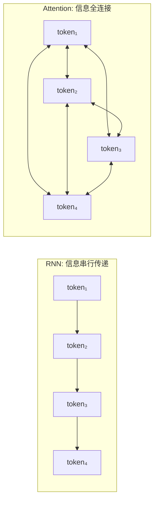
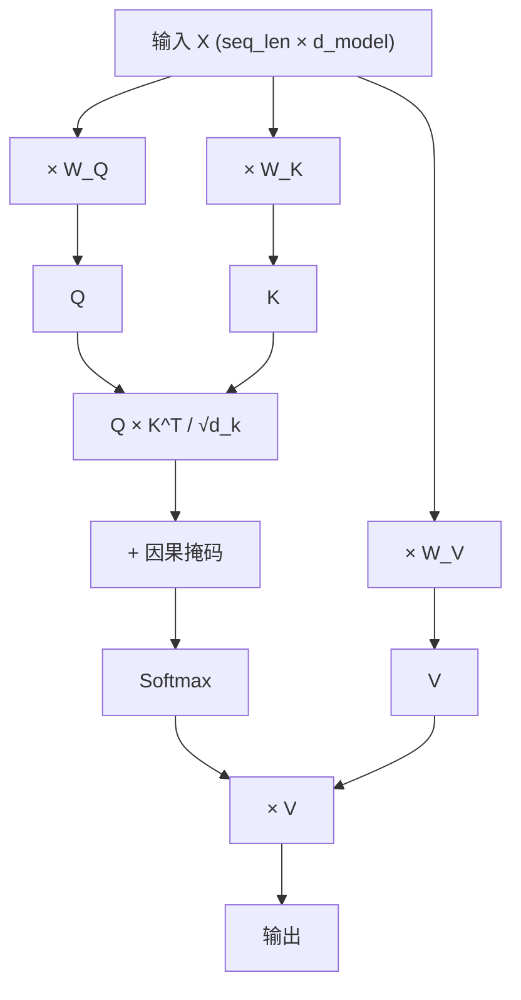
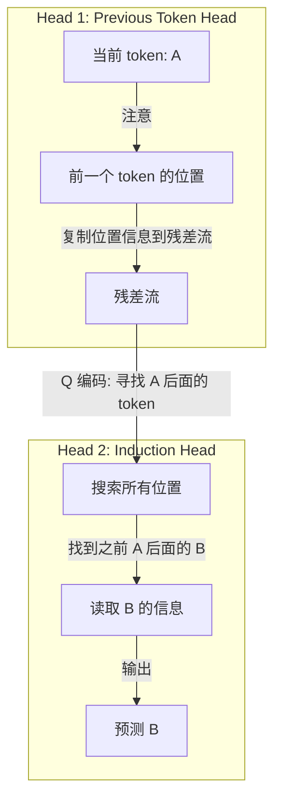
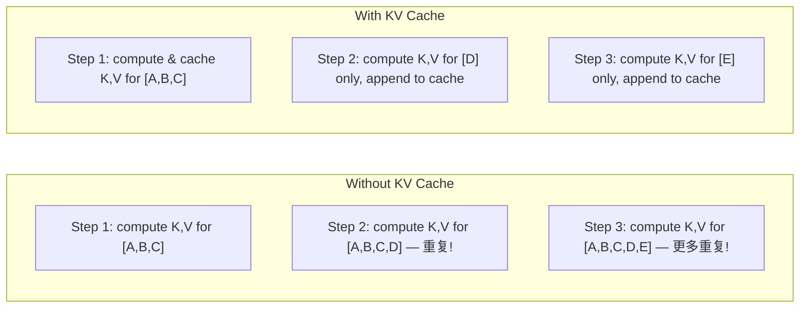
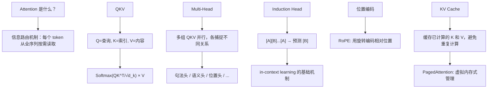

[← 上一章](01-next-token.md) | [目录](../README.md) | [下一章 →](03-scaling.md)

# 第二章：Attention 是信息路由

> "Attention is all you need."
> — Vaswani et al., 2017

"注意力"这个名字是有误导性的。当我们说"注意力机制"时，你可能联想到人类集中注意力的样子——聚焦某件事，忽略其他。但 Transformer 中的 attention 更像是一个**信息路由网络**：每个 token 都在问"我需要从哪里获取信息？"，然后从整个序列中**按需读取**。

理解 attention，就理解了 Transformer 的核心——也就理解了现代 LLM 的"大脑结构"。

---

## 2.1 Attention 解决了什么问题

### RNN 的瓶颈：万事皆经一隘口

在 Transformer 之前，序列建模的主力是 RNN（循环神经网络）。RNN 的工作方式类似流水线：

```
token_1 → [h₁] → token_2 → [h₂] → token_3 → [h₃] → ... → token_n → [hₙ]
```

所有历史信息都被压缩进一个固定大小的隐藏向量 $h$。要从 token_1 传递信息到 token_1000，这个信息必须经过 999 个压缩步骤。想象一下：你要通过 999 个人玩传话游戏，传到最后还能保留多少原始信息？

这就是著名的**长距离依赖问题**。LSTM 和 GRU 缓解了这个问题，但没有根本解决。

### Attention：每个位置直接访问所有位置

Attention 的解决方案很暴力也很优雅：**让每个 token 直接和所有其他 token 通信**。



Token_1000 想知道 token_1 说了什么？直接去读，不需要经过中间 998 个人。

代价是 **O(n²)** 的计算复杂度——n 个 token，每对之间都要计算一次注意力权重。这就是为什么上下文窗口不能无限大：处理 100K token 的文本需要计算 100K × 100K = 100 亿次注意力得分。

---

## 2.2 QKV：查询-匹配-读取

Attention 机制的核心是三个投影矩阵产生的三个向量：**Query (Q)、Key (K)、Value (V)**。

### 直觉：数据库查询

最好的类比是数据库查询：

```sql
SELECT value FROM memory WHERE key MATCHES query
```

- **Q (Query)**：我在找什么信息？
- **K (Key)**：我这里有什么信息可以提供？
- **V (Value)**：如果你需要我的信息，这是具体内容。

每个 token 同时扮演三个角色：它用自己的 Q 去查询别人，用自己的 K 被别人查询，用自己的 V 提供信息给匹配到它的人。

### 计算过程

```python
import torch
import torch.nn.functional as F

def attention(Q, K, V, mask=None):
    """
    Q, K, V: [batch, seq_len, d_k]
    """
    d_k = Q.size(-1)
    
    # Step 1: 计算注意力得分（Q 和 K 的点积）
    scores = torch.matmul(Q, K.transpose(-2, -1)) / (d_k ** 0.5)
    # scores: [batch, seq_len, seq_len] — 每对 token 之间的"相关度"
    
    # Step 2: 因果掩码（对于 decoder，不能看到未来）
    if mask is not None:
        scores = scores.masked_fill(mask == 0, float('-inf'))
    
    # Step 3: Softmax 归一化 → 注意力权重
    weights = F.softmax(scores, dim=-1)
    # weights: [batch, seq_len, seq_len] — 每行加起来为 1
    
    # Step 4: 用权重加权求和 V
    output = torch.matmul(weights, V)
    # output: [batch, seq_len, d_k]
    
    return output, weights
```

让我们拆解每一步：

**Step 1：计算"匹配度"**

Q 和 K 的点积衡量两个 token 之间的"相关度"。点积越大，说明 Q 在找的东西和 K 能提供的越匹配。

为什么要除以 $\sqrt{d_k}$？防止点积值太大，导致 softmax 输出接近 one-hot（梯度消失）。这就是所谓的 **Scaled Dot-Product Attention**。

**Step 2：因果掩码**

在语言模型（decoder）中，token 不能看到未来的 token——否则就是作弊。因果掩码是一个下三角矩阵：

```
     t₁  t₂  t₃  t₄
t₁ [  1   0   0   0 ]    t₁ 只能看到自己
t₂ [  1   1   0   0 ]    t₂ 能看到 t₁ 和自己
t₃ [  1   1   1   0 ]    t₃ 能看到 t₁, t₂, 自己
t₄ [  1   1   1   1 ]    t₄ 能看到所有
```

被掩码的位置设为 $-\infty$，softmax 后变成 0。

**Step 3：Softmax → 注意力权重**

Softmax 把匹配度得分变成概率分布。每个 token 把 100% 的"注意力预算"分配给序列中的各个位置。

**Step 4：加权读取**

用注意力权重对 V 做加权求和。如果 token_5 对 token_2 的注意力权重是 0.7，对 token_1 是 0.2，那么 token_5 的输出有 70% 来自 token_2 的信息，20% 来自 token_1。

### 完整的自注意力流程



关键洞察：**Q、K、V 都是通过可学习的线性变换从同一个输入 X 得来的**。模型通过学习 $W_Q$、$W_K$、$W_V$ 这三个权重矩阵，来决定"什么信息值得查询"、"什么信息值得被索引"、"什么信息值得被传递"。

---

## 2.3 Multi-Head Attention：多双眼睛

一组 QKV 只能捕捉一种"关系模式"。Multi-head attention 的思想是：**用多组 QKV 并行工作，每组捕捉不同类型的关系**。

```python
class MultiHeadAttention(torch.nn.Module):
    def __init__(self, d_model, n_heads):
        super().__init__()
        self.n_heads = n_heads
        self.d_k = d_model // n_heads
        
        # 每个头有自己的 Q, K, V 投影
        self.W_q = torch.nn.Linear(d_model, d_model)
        self.W_k = torch.nn.Linear(d_model, d_model)
        self.W_v = torch.nn.Linear(d_model, d_model)
        self.W_o = torch.nn.Linear(d_model, d_model)
    
    def forward(self, x, mask=None):
        batch, seq_len, d_model = x.shape
        
        # 投影并拆分成多个头
        Q = self.W_q(x).view(batch, seq_len, self.n_heads, self.d_k).transpose(1, 2)
        K = self.W_k(x).view(batch, seq_len, self.n_heads, self.d_k).transpose(1, 2)
        V = self.W_v(x).view(batch, seq_len, self.n_heads, self.d_k).transpose(1, 2)
        # Q, K, V: [batch, n_heads, seq_len, d_k]
        
        # 每个头独立做 attention
        out, weights = attention(Q, K, V, mask)
        
        # 拼接所有头的输出
        out = out.transpose(1, 2).contiguous().view(batch, seq_len, d_model)
        
        # 最终线性变换
        return self.W_o(out)
```

### 不同的头看到什么？

研究发现（[Clark et al. 2019](https://arxiv.org/abs/1906.04341)），不同的 attention head 确实学会了关注不同类型的关系：

- **句法头**：关注主谓一致（"The dogs **are** running" 中，"are" 强烈 attend to "dogs"）
- **位置头**：关注相邻 token（前一个词、后一个词）
- **语义头**：关注同义词或相关概念
- **分隔符头**：关注标点符号和句子边界
- **稀有模式头**：关注不常见的搭配

这就像一个阅读理解小组：每个成员用不同的视角读同一篇文章，然后综合所有人的发现。

### 类比

想象你在读一个复杂的句子：

> "The trophy doesn't fit in the brown suitcase because **it** is too big."

理解这句话需要同时追踪多种关系：
- **指代关系**："it" 指什么？（head 1 负责）
- **因果关系**："because" 连接了什么和什么？（head 2 负责）
- **物理属性**："too big" 描述什么的大小？（head 3 负责）
- **句法结构**：主语是什么？谓语是什么？（head 4 负责）

Multi-head attention 让模型同时在多个维度上路由信息。

---

## 2.4 Induction Heads：模型学到的第一个"算法"

### 什么是 Induction Head？

[Olsson et al. 2022](https://arxiv.org/abs/2209.11895) 发现了一种叫 **induction head** 的注意力模式，可能是 Transformer 学到的最基础的"算法"。

Induction head 做的事情很简单：

> 如果之前出现过 `[A][B]`，当再次出现 `[A]` 时，预测 `[B]`。

```
文本: "Harry Potter is a wizard. Harry Potter is a"
                                                 ^
                                    模型在这里预测下一个 token
                                    
Induction head 的工作：
  1. 看到当前 token 是 "a"
  2. 搜索之前出现过 "a" 的位置
  3. 找到 "...is a wizard..."
  4. 读取 "a" 后面的 token → "wizard"
  5. 预测下一个 token 是 "wizard"
```

### 为什么这很重要？

Induction head 是 **in-context learning** 的最基本形式。它解释了为什么 few-shot prompting 有效：

```
输入:
  "cat → 猫
   dog → 狗
   bird → "

模型通过 induction head 识别模式：
  英文 → 中文
  英文 → 中文
  英文 → ?
  
预测: "鸟"
```

模型不是在"理解"翻译任务，而是在做**模式匹配和补全**。但这个模式匹配足够强大，能处理非常复杂的 few-shot 任务。

### 两层合作

Induction head 实际上需要两个 attention head 的合作：



1. **第一层**：一个"previous token head"学习把"前一个 token 是什么"的信息写入残差流
2. **第二层**：induction head 利用这个信息，找到之前同样模式出现的位置，读取后面的 token

这是 Transformer 中**跨层信息传递**的一个美丽例子。

---

## 2.5 位置编码：给 token 排座次

### Transformer 没有位置概念

Attention 的计算是**排列不变的**（permutation invariant）。如果你把输入 token 的顺序打乱，attention 的输出只是相应打乱，但权重计算本身不变。

这意味着没有位置编码的 Transformer 无法区分：
- "猫吃鱼" 和 "鱼吃猫"

因为两者包含完全相同的 token 集合。

### RoPE：用旋转编码位置

目前最主流的位置编码方案是 **Rotary Position Embedding (RoPE)**（[Su et al. 2021](https://arxiv.org/abs/2104.09864)）。

核心思想：把位置信息编码为向量的**旋转角度**。两个 token 的位置差越大，它们的 Q 和 K 向量之间的"旋转角度差"越大。

```python
import torch

def apply_rope(x, positions, d_model):
    """
    x: [batch, seq_len, d_model] — Q 或 K 向量
    positions: [seq_len] — 位置索引
    """
    # 频率：不同维度用不同频率
    freqs = 1.0 / (10000 ** (torch.arange(0, d_model, 2).float() / d_model))
    # [d_model/2]
    
    # 角度 = 位置 × 频率
    angles = positions.unsqueeze(-1) * freqs.unsqueeze(0)
    # [seq_len, d_model/2]
    
    cos_angles = torch.cos(angles)
    sin_angles = torch.sin(angles)
    
    # 对 x 的偶数维和奇数维分别处理
    x_even = x[..., 0::2]  # 偶数维
    x_odd  = x[..., 1::2]  # 奇数维
    
    # 旋转
    x_rotated_even = x_even * cos_angles - x_odd * sin_angles
    x_rotated_odd  = x_even * sin_angles + x_odd * cos_angles
    
    # 交错拼接
    x_rotated = torch.stack([x_rotated_even, x_rotated_odd], dim=-1)
    return x_rotated.flatten(-2)
```

RoPE 的优雅之处：
- 两个位置的注意力得分只取决于它们的**相对距离**，不取决于绝对位置
- 理论上可以外推到更长的序列（虽然实际效果会衰减）
- 计算高效，不需要额外的可学习参数

### 上下文窗口：注意力的硬限制

每个模型都有一个上下文窗口（context window）——它能同时"看到"的最大 token 数。

```
GPT-4o:      128K tokens
Claude 3.5:  200K tokens
Gemini 1.5:  1M-2M tokens
```

上下文窗口受限于：
1. **计算复杂度**：O(n²) 的 attention 计算
2. **内存**：KV cache 随序列长度线性增长
3. **位置编码泛化**：超过训练长度，位置编码可能失效

超过上下文窗口的文本对模型来说就是**不存在的**。这是一个硬限制，不是软限制。

---

## 2.6 KV Cache：为什么推理不重复计算

### 问题：自回归生成的计算浪费

回顾自回归生成：

```
Step 1: 输入 [A, B, C]     → 预测 D
Step 2: 输入 [A, B, C, D]   → 预测 E
Step 3: 输入 [A, B, C, D, E] → 预测 F
```

在 Step 2 中，A、B、C 已经在 Step 1 处理过了。如果每次都重新计算，大量计算被浪费。

### KV Cache：缓存已计算的 K 和 V

关键观察：在自回归生成中，**之前 token 的 K 和 V 不会变**（因为因果掩码保证它们看不到未来 token）。所以我们可以缓存它们：

```python
class CachedAttention:
    def __init__(self):
        self.k_cache = None  # 缓存所有已生成 token 的 K
        self.v_cache = None  # 缓存所有已生成 token 的 V
    
    def forward(self, x_new, W_q, W_k, W_v):
        """x_new: 只有新 token 的表示"""
        # 只计算新 token 的 Q, K, V
        q_new = x_new @ W_q
        k_new = x_new @ W_k
        v_new = x_new @ W_v
        
        # 把新的 K, V 追加到缓存
        if self.k_cache is not None:
            self.k_cache = torch.cat([self.k_cache, k_new], dim=1)
            self.v_cache = torch.cat([self.v_cache, v_new], dim=1)
        else:
            self.k_cache = k_new
            self.v_cache = v_new
        
        # Q 只有新 token 的，但 K 和 V 是全部历史
        scores = torch.matmul(q_new, self.k_cache.transpose(-2, -1))
        weights = F.softmax(scores / (self.d_k ** 0.5), dim=-1)
        output = torch.matmul(weights, self.v_cache)
        
        return output
```



### 内存代价

KV cache 把计算换成了内存。对于一个典型的 70B 模型：

```
每层每个 token 的 KV cache 大小:
  = 2 (K和V) × n_heads × d_head × sizeof(float16)
  = 2 × 64 × 128 × 2 bytes
  = 32 KB per layer per token

80 层 × 32 KB = 2.5 MB per token

对于 128K context：
  128,000 × 2.5 MB = 320 GB — 比模型本身还大！
```

这就是为什么长上下文推理如此昂贵——不是因为计算，而是因为**内存**。

### PagedAttention：像操作系统一样管理 KV Cache

[vLLM](https://github.com/vllm-project/vllm) 引入了 **PagedAttention**（[Kwon et al. 2023](https://arxiv.org/abs/2309.06180)），借鉴操作系统虚拟内存的思想管理 KV cache：

```
传统方式：为每个请求预分配最大长度的连续内存
  → 大量内存碎片和浪费（实际序列长度远小于最大长度）

PagedAttention：把 KV cache 分成固定大小的页（page）
  → 按需分配，不需要连续内存
  → 类似 OS 的虚拟内存和物理内存映射
  → 内存利用率提升 2-4 倍
```

这不是一个纯学术的优化——它直接决定了同一台 GPU 上能同时服务多少个请求，影响推理成本。

---

## 2.7 可视化：看看 Attention 在看什么

理论说了很多，让我们实际看看 attention 的模式。

### 使用 BertViz 可视化

[BertViz](https://github.com/jessevig/bertviz) 是一个优秀的 attention 可视化工具：

```python
from bertviz import head_view
from transformers import AutoTokenizer, AutoModel

model_name = "bert-base-uncased"
tokenizer = AutoTokenizer.from_pretrained(model_name)
model = AutoModel.from_pretrained(model_name, output_attentions=True)

text = "The cat sat on the mat because it was tired."
inputs = tokenizer(text, return_tensors="pt")
outputs = model(**inputs)

attention = outputs.attentions  # tuple of (batch, heads, seq, seq)
tokens = tokenizer.convert_ids_to_tokens(inputs["input_ids"][0])

head_view(attention, tokens)
```

### 你会看到的典型模式

**1. 主谓一致头**

```
"The dogs in the park are running fast"

   dogs ←←←←←←←←←← are
   (Head 3, Layer 5 高度关注 subject-verb 关系)
```

即使 "dogs" 和 "are" 之间隔了 "in the park"，某些 head 也能精准地把动词的注意力指向主语。

**2. 指代消解头**

```
"Alice told Bob that she would help him tomorrow"

   she →→→→→→→→→→→ Alice    (代词指回先行词)
   him →→→→→→→→→ Bob
```

**3. 位置关注头**

某些 head 专门关注相邻位置（前一个 token 或后一个 token），充当"局部上下文"的角色。这些 head 的注意力模式呈对角线条纹。

**4. 分隔符关注头**

某些 head 把大量注意力放在句号、逗号等标点上。推测是因为标点携带句子边界信息。

### 一个有趣的发现

在 GPT-2 的可视化研究中，研究者发现浅层（前几层）的 head 主要做局部的、句法的关注，而深层的 head 做更抽象的、语义的关注。这符合直觉：模型先"解析"句子结构，然后在此基础上"理解"含义。

---

## 本章小结



核心要点：

1. **Attention = 信息路由**，不是"注意力"——每个 token 从全序列中按需读取信息
2. **QKV 三元组**是 attention 的核心：Query 找信息、Key 被匹配、Value 提供内容
3. **Multi-head** 让模型同时追踪多种关系类型
4. **Induction head** 是 in-context learning 的最基本机制
5. **RoPE** 给 Transformer 赋予了位置感知能力
6. **KV cache** 是推理效率的关键优化，但内存成本随序列长度线性增长
7. **上下文窗口是硬限制**——模型真的看不到窗口外的 token

下一章，我们将缩小视野，看看当这些模块被堆叠到极致规模时，会发生什么——规模如何改变一切。

---

## 延伸阅读

- [Attention Is All You Need](https://arxiv.org/abs/1706.03762) — Vaswani et al. 2017, Transformer 的原始论文
- [In-context Learning and Induction Heads](https://arxiv.org/abs/2209.11895) — Olsson et al. 2022
- [What Does BERT Look At?](https://arxiv.org/abs/1906.04341) — Clark et al. 2019, attention 可视化分析
- [RoFormer: Enhanced Transformer with Rotary Position Embedding](https://arxiv.org/abs/2104.09864) — Su et al. 2021
- [Efficient Memory Management for Large Language Model Serving with PagedAttention](https://arxiv.org/abs/2309.06180) — Kwon et al. 2023
- [BertViz](https://github.com/jessevig/bertviz) — 交互式 attention 可视化工具
- [A Mathematical Framework for Transformer Circuits](https://transformer-circuits.pub/2021/framework/index.html) — Elhage et al. 2021
