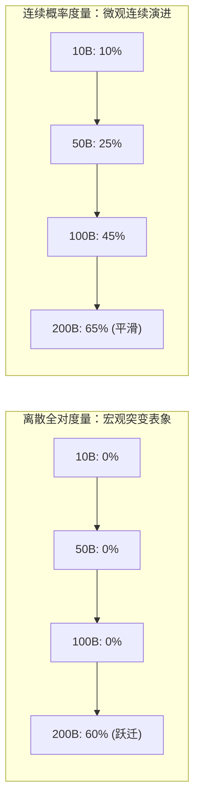
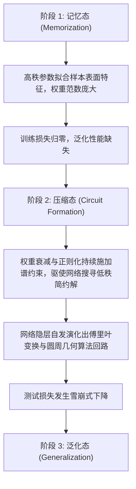
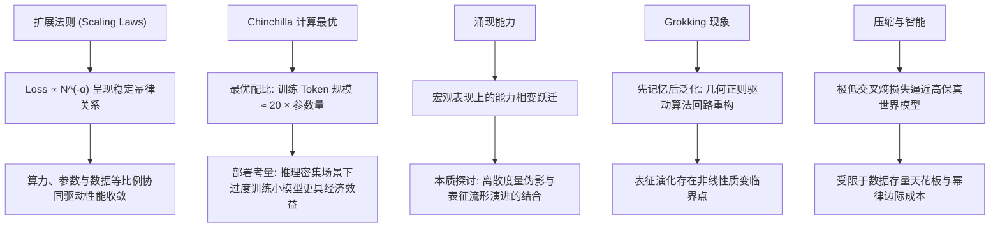

[← 上一章](02-attention.md) | [目录](../README.md) | [下一章 →](04-alignment.md)

**English**: [English](../en/chapters/03-scaling.md)

# 第三章：规模涌现

> "The unreasonable effectiveness of scale."
> （对 Eugene Wigner 经典命题的当代诠释）

这几年人工智能领域最深刻的体会，并不来自某一个精巧的算法技巧，而是一条近乎物理定律的朴素事实：只要持续推高参数规模、喂入更多高质量数据并注入算力，模型的能力就会沿着一条对数线性轨道稳定上升，分毫不差。

按过去的机器学习经验，盲目把模型做大，换来的通常是严重的过拟合与越来越薄的边际收益。但 Transformer 架构碰上海量无标注语料之后，彻底颠覆了这套老规矩，由此立下了以**扩展法则**（Scaling Laws）为基石的新范式。

本章从第一性原理出发，拆解规模扩张背后的动力机制与计算最优分配边界，剖开高维表征流形，看复杂能力如何在微观尺度上完成跃迁。

---

## 3.1 Scaling Laws：可预测的进步
 
 ### 幂律关系
 
 2020 年，OpenAI 的 Kaplan 等人发表了开创性的论文 [Scaling Laws for Neural Language Models](https://arxiv.org/abs/2001.08361)。他们发现，自回归语言模型的交叉熵测试损失（Loss）与模型背后的三大支柱之间，遵循着极其严格的**幂律关系**（power law）：
 
 $$L(N) \approx \left(\frac{N_c}{N}\right)^{\alpha_N} \quad \text{（参数量 N）}$$
 
 $$L(D) \approx \left(\frac{D_c}{D}\right)^{\alpha_D} \quad \text{（数据量 D）}$$
 
 $$L(C) \approx \left(\frac{C_c}{C}\right)^{\alpha_C} \quad \text{（计算量 C）}$$
 
 其中 $\alpha_N \approx 0.076$，$\alpha_D \approx 0.095$，$\alpha_C \approx 0.050$。
 
 ### log-log 坐标系下的确定性轨迹
 
 若是把坐标轴换成双对数（log-log）坐标系，测试损失随着参数量、数据量与浮点计算量的增长，划出了一条极为平直的**线性衰减**轨迹：
 
 ```
 log(Loss)
     |
     |\
     | \
     |  \
     |   \
     |    \
     |     \
     |      \___________  ← 尚未观察到明显的饱和平台期
     |
     +-----------------------> log(Compute)
 ```
 
 这套数学关系落到实处，点出了三件至关紧要的事：
 
 1. **行为的可预测性**：只要在小模型上把幂律曲线拟合出来，千亿大模型训完能收敛到什么水准便能算得一清二楚，根本用不着盲目试错；
 2. **稳定的算力回报**：计算量每推高一个数量级，损失就会按固定的比例稳稳降下来；
 3. **无明显拐点**：在人类已经摸索过的算力范围里，这条幂律曲线还没撞上任何实质的阻碍。
 
 正因模型的提升握有这份数学上的确定性，工业界才敢下定决心，投入数以十亿美元去搭建集群、训练超大模型。
 
 ### 损失估计的工程实现
 
 ```python
 import numpy as np
 
 def estimated_loss(params_billions, data_tokens_billions):
     """根据参数量与训练 token 规模估算预期损失"""
     N_c = 8.8e13   # 参数量特征尺度
     D_c = 5.4e13   # 数据量特征尺度
     alpha_N = 0.076
     alpha_D = 0.095
     
     N = params_billions * 1e9
     D = data_tokens_billions * 1e9
     
     loss_N = (N_c / N) ** alpha_N
     loss_D = (D_c / D) ** alpha_D
     
     # 取两者的平衡近似
     return max(loss_N, loss_D)
 
 # 测算不同规模组合下的理论 loss
 for params in [1, 7, 70, 405]:
     for data in [1000, 5000, 15000]:
         loss = estimated_loss(params, data)
         print(f"{params:>4}B params, {data:>5}B tokens → loss ≈ {loss:.3f}")
 ```
 
 ### 算力视角的统一优化
 
 Kaplan 等人还指出，若把总浮点计算量 $C \approx 6ND$（其中 $N$ 为非嵌入参数量，$D$ 为训练 token 数量）作为统一的约束条件，损失函数的收敛轨迹最为规整。换句话说，在给定的算力预算下，究竟该把资源分给参数规模还是数据吞吐，成了一个清清楚楚的**凸优化问题**。
 
 ---
 
 ## 3.2 Chinchilla 与最优分配
 
 ### Chinchilla 定律：计算最优的资源均衡
 
 2022 年，DeepMind 的 Hoffmann 等人发表了那篇里程碑式的论文 [Training Compute-Optimal Large Language Models](https://arxiv.org/abs/2203.15556)，也就是后来常说的 **Chinchilla 论文**。
 
 他们修正了 Kaplan 早期的判断，指出在固定的计算预算下，模型参数量 $N$ 与训练数据量 $D$ 应当保持等比例增长：
 
 $$N_{opt} \propto C^{0.5}, \quad D_{opt} \propto C^{0.5}$$
 
 顺着这条推论，便能得出一个计算最优的经验法则：最优训练 token 规模大约是参数量的 20 倍（$D \approx 20N$）。
 
 ```
 模型参数量    Chinchilla 最优训练 token 规模
 1B          → 20B tokens
 7B          → 140B tokens
 70B         → 1.4T tokens
 175B        → 3.5T tokens
 ```
 
 ### GPT-3 的欠训练与范式纠偏
 
 若是拿 Chinchilla 的最优标尺去量，拥有 175B 参数的 GPT-3 当年只吃了 300B token 就匆匆收工，离 3.5T 的理论最优配比差得太远，其实处在严重的**欠训练**（under-trained）状态。
 
 在同等的计算预算下，DeepMind 转而训练了 70B 参数的 Chinchilla 模型，给它配足了 1.4T token，在下游基准测试中全面赢过了 175B 的 GPT-3。
 
 ```mermaid
 graph LR
     subgraph "Kaplan (2020) 早期范式"
         K1["固定计算预算"] --> K2["庞大参数量 + 较少数据"]
         K2 --> K3["GPT-3: 175B params, 300B tokens"]
     end
     
     subgraph "Chinchilla (2022) 计算最优"
         C1["同等计算预算"] --> C2["紧凑参数量 + 充分数据"]
         C2 --> C3["Chinchilla: 70B params, 1.4T tokens"]
         C3 --> C4["下游表现全面胜出"]
     end
 ```
 
 ### 过度训练与推理感知扩展
 
 不过，Chinchilla 定律算的是训练阶段的计算最优，并未把模型上线部署后的全生命周期推理成本算进来。
 
 70B 模型单次前向传播所耗费的显存与算力，远比 7B 模型沉重。要是落到高并发的推理业务里，选一个经过“过度训练”（Over-training，即训练 token 数量远超 Chinchilla 比例）的小模型，反而能大幅摊薄全局总持有成本（TCO）。
 
 Meta 打造的 **LLaMA 系列**，正是这套策略走通的经典范例（[Touvron et al., 2023](https://arxiv.org/abs/2302.13971)）：
 
 ```
 LLaMA-7B:   训练于 1T tokens（Chinchilla 最优比例约为 140B，超出 7 倍）
 LLaMA-13B:  训练于 1T tokens（Chinchilla 最优比例约为 260B）
 LLaMA-65B:  训练于 1.4T tokens
 
 结果：小模型通过充分吸收海量数据获得高表征密度，推理时延与显存开销显著降低
 ```
 
 这就引出了**推理最优扩展**（Inference-optimal scaling）的思路：当预期的推理调用量深不见底时，多花力气在训练期给小模型喂入数倍于理论配比的语料，在工程与经济账上都划算得多。
 
 ### 高质量文本的存量边界
 
 扩展法则能一直奏效，暗中咬定了一个前提：高质量语料必须源源不断地供上来。然而，互联网上那些公开的高质量自然语言数据存量，已经在肉眼可见地见底：
 
 ```
 高质量互联网公开发布语料估计: ~10-15T tokens
 人类数字化总文本（含书籍、学术文献全量）: ~100T tokens
 
 GPT-4 训练语料规模（业界估算）: ~13T tokens
 LLaMA-3 405B 训练语料: 15T tokens
 ```
 
 自然语言的存量天花板已经近在眼前。想要把规模效应继续延续下去，把高质量合成数据（Synthetic Data）与视觉、音频等多模态数据融汇进来，成了当下最关键的突围方向。

---

## 3.3 涌现能力（Emergent Abilities）

### 什么是涌现？

扩展法则告诉我们，模型的全局交叉熵损失总随着规模增长平滑、单调地下跌。可一旦具体到某些**特定下游能力**，事情就完全变了模样：它们不是沿着斜坡慢慢爬升，而是在参数量或算力迈过某道阈值的瞬间，像物理相变一样突兀地跃升出来。

Wei 等人（[Wei et al., 2022](https://arxiv.org/abs/2206.07682)）把这类现象正式定义为**涌现能力**（Emergent Abilities）：

> 指那些在小规模模型里全无踪迹、一旦跨过某个临界规模便突然显现出来的高阶能力。

### 经典的涌现案例

**多步复合算术**：
```
模型规模    "23 + 47 = ?"    "237 + 418 = ?"    "23 × 47 = ?"
1B         ✗ 随机概率分布     ✗ 无法处理          ✗ 无法处理
10B        ✓ 基本正确         ✗ 偶发命中          ✗ 无法处理
100B+      ✓ 稳定正确         ✓ 高置信正确        ✓ 初步具备泛化能力
```

**乱序字符重构**（Word Unscrambling）：
```
"dnuorgkcab" → "background"

模型规模    下游任务准确率
<10B       ≈ 0%（无法形成有效模式）
10-50B     ≈ 0%（依然处于随机盲区）
>100B      ≈ 50%+（表征流形重组，突显准确映射）
```

**思维链推理**（Chain-of-Thought）：
```
小参数模型 + CoT 引导 → 性能未见提升甚至引入结构扰动
大参数模型 + CoT 引导 → 复杂多步因果推理准确率显著跃升
```

### 涌现现象的本质争论：真实相变还是度量伪影？

2023 年，Schaeffer 等人（[Schaeffer et al., 2023](https://arxiv.org/abs/2304.15004)）提出了一个极有分量的质疑：所谓涌现，很大程度上可能只是评估指标非线性带来的**度量伪影**（Metric Artifact）。

背后的数学推导其实很直白：

```
传统下游基准多采用离散的"非此即彼"全对准确率（Exact Match Accuracy）：

  准确率 = 完全匹配样本数 / 总样本数

在复合多步任务中，设完成任务需连续正确执行 k 个逻辑步骤，每步的正确概率为 p：
  全局准确率 = p^k

随着模型规模平滑扩展，假设单步正确率 p 从 0.2 平滑上升至 0.8：
  当 k = 5 时：
  p = 0.2 → 全局准确率 = 0.2^5 = 0.032%（宏观表现为 0 分）
  p = 0.5 → 全局准确率 = 0.5^5 = 3.125%（仍接近 0 分）
  p = 0.8 → 全局准确率 = 0.8^5 = 32.8% （宏观呈现为陡峭爆发）

若以连续的交叉熵、Token 级别准确率或 Brier Score 评估：
"涌现"突变即被消解，底层的表征改进实际上始终沿着平滑轨迹推进。
```



### 涌现视角的系统工程推论

不管微观机理只是统计意义上的平滑累积，还是隐层回路真的发生了相变重组，单看宏观的任务执行，系统的能力边界确实完成了根本的跨越：

- **任务复杂度与模型选型解耦**：做简单的格式转换或特征分类用不上大模型，但面对长程符号推理与复杂的约束求解，就非得靠那些拥有高阶表征能力的大模型不可；
- **小模型评测结论不可简单线性外推**：小模型在复杂任务里拿到零分，并不意味着这套网络架构天生解不了这类难题；
- **提示工程策略存在规模阈值**：像少样本提示与思维链这类技巧，只有等模型的表征容量跨过特定临界点，深层的注意力协同回路才能真正被稳稳唤醒。

---

## 3.4 Grokking：延迟的顿悟

### 什么是 Grokking？

2022 年，Power 等人（[Power et al., 2022](https://arxiv.org/abs/2201.02177)）在算法任务实验里，记录下了一种极不寻常的动力学演化：

> 模型在极早期就把训练损失压到了接近零，几乎完美地靠过拟合记住了所有训练样本，测试损失却在随后数十倍的训练周期里始终高位震荡；直到某个瞬间，测试损失突然断崖式暴跌，模型这才完成了从机械记忆到泛化能力的结构跃迁。

```
训练优化进程 →

训练损失:  ████▁▁▁▁▁▁▁▁▁▁▁▁▁▁▁▁▁▁▁▁▁▁▁▁▁▁  (迅速趋近于 0)
测试损失:  ████████████████████████████▁▁▁▁  (长期滞后，突发骤降)
                                       ^
                                   Grokking 临界点
                                (表征流形从局部记忆重构为全局算法解)
```

### 模运算实验中的表征跃迁

以抽象代数里的模运算任务 $(a + b) \bmod 97$ 为例：

```
训练集：全域候选对中随机采样 50%
测试集：剩余 50% 未见样本

动力学演化轨迹：
- Epoch 100:   训练集准确率 100%，测试集准确率 20%（随机分布）
- Epoch 1000:  训练集准确率 100%，测试集准确率 20%
- Epoch 10000: 训练集准确率 100%，测试集准确率 20%（看似已彻底过拟合）
- Epoch 30000: 训练集准确率 100%，测试集准确率 98%（泛化解突变形成）
```

### Grokking 的底层力学机理

机制可解释性研究（[Nanda et al., 2023](https://arxiv.org/abs/2301.05217)）清晰拆解了 Grokking 发生时隐层回路的重构过程：



网络并没有永远守着那张庞大的离散查找表。在权重衰减（Weight Decay）持续施加的几何约束下，连续优化驱使着参数空间不断压缩，最终找到了以**三角函数和傅里叶基**为底层的紧凑算法解。

### 对工程训练的认知更新

Grokking 现象给大模型训练的工程直觉带来了几点深刻的启发：

1. **破除传统早停（Early Stopping）教条**：训练集损失趋近于零绝不是训练的终点，泛化结构的涌现往往远远落后于样本拟合的进度；
2. **正则化的拓扑引导作用**：权重衰减绝非单纯用来防止过拟合的被动阻尼，它更像是一股持续的塑形力量，推着高维参数空间向低复杂度的简约算法回路收敛；
3. **隐式表征演进的非线性**：神经网络在参数空间里的漫游从来不是匀速推进的，漫长的平台期过后，往往伴随着越过临界点时的阶段性跃迁。

---

## 3.5 哲学之问：智能是否等价于极致的压缩？

### Hutter Prize 的形式化洞见

算法信息论学者 Marcus Hutter 设立过一个奖项 **Hutter Prize**，规则定得很干脆：只要写出的算法能把标准文本语料无损压缩到前所未有的极限，就能领走这笔奖金。

这套设定的背后藏着一层形式化推导：数据压缩与统计智能，本质上是同一个信息处理过程的正反两面。两者在数学上完全同构。

想把一段复杂的序列无损压缩到极致，编码系统就得剔除所有的冗余。这倒逼着网络在内部精准捕捉数据生成背后的因果不变量：

$$\mathcal{H}(X) = -\sum P(x) \log_2 P(x)$$

我们在训练中不断压低交叉熵损失，从几何角度来看，就是在一点点挤出序列里的条件信息熵。当损失跌落到极限，网络内部也就搭建起了一座高保真度的数据生成流形。

### 完美语言模型思想实验

不妨设想存在一个终极语言模型，能在任意上下文尺度上把预测损失彻底压到零。要撑起这样毫无破绽的预测，它的内部必然已经建立起一套极尽完备的内在表征：

- **全域事实先验**：若没有对万事万物的先验把握，就无法消除实体关联中的不确定性；
- **严密形式因果推理**：若是断了严谨的因果链条，多步逻辑推演里的条件熵便无从消解；
- **人类心智模型拟合**：若是摸不透人类的心思与动机，就无法在博弈与对话中给出最精准的概率分配；
- **物理与数学规律内化**：若是没把数理法则融进权重，便写不出前后严密自洽的科学证明。

沿着这套逻辑推演下去，便会得到一个深刻的推论：一个能在完备语料上做到极限预测的自回归模型，在功能与表征上，其实等价于一套广义的通用智能系统。

### 规模扩展的客观物理边界

但单靠无监督语料一路推高规模，很快就会撞上几处硬性的边际瓶颈：

**1. 幂律收敛的指数级成本**

```
损失从 3.0 降低至 2.5：需要增加约 10 倍计算量
损失从 2.5 降低至 2.0：需要增加约 100 倍计算量
损失从 2.0 降低至 1.5：需要增加约 1000 倍计算量
```

单纯靠堆砌浮点算力往前硬推，迟早会撞上经济成本与能源消耗的双重硬约束。

**2. 文本模态的表征局限**

现实世界里的许多因果规律，并没有完全编码在文字符号之中：
- 三维物理空间的真实感知与几何直觉；
- 连续运动控制与具身动力学反馈；
- 形式化数学与算法证明中的深度回溯搜索；
- 开放环境里的自主探索与主动试错。

想在这些领域打开局面，就得靠搜索验证机制（如强化学习与测试时计算扩展）、具身多模态融合，再配合模型架构本身的持续演进。

**3. 数据质量维度的决定性制约**

无监督扩展能走多远，全看输入数据本身的质量与保真度。若是在充斥噪声和低价值共现的数据上一味堆砌规模，非但换不来真正的能力，只会成倍放大模型内部的偏差与幻觉。

### 模型选型决策框架

```python
def choose_model_size(task_complexity, latency_budget_ms, cost_budget_per_query):
    """
    根据任务复杂度与工程约束权衡模型规模
    task_complexity: 'simple' | 'moderate' | 'complex' | 'frontier'
    """
    recommendations = {
        'simple': {
            'size': '1-3B',
            'examples': '结构化信息提取、关键词分类、浅层文本转换',
            'note': '支持端侧或单卡极低延迟部署'
        },
        'moderate': {
            'size': '7-14B', 
            'examples': '跨语言翻译、长文摘要提取、通用函数补全',
            'note': '消费级 GPU 可承载，具备优异性价比'
        },
        'complex': {
            'size': '30-70B',
            'examples': '复杂多步因果推理、专业领域深度问答、长程逻辑分析',
            'note': '多卡并行服务，推理成本中等'
        },
        'frontier': {
            'size': '200B+',
            'examples': '前沿科学探索、自主演化 Agent、全域代码系统合成',
            'note': '依赖前沿云端集群，追求极限泛化能力'
        }
    }
    return recommendations[task_complexity]
```

---

## 本章小结



核心要点：

1. **扩展法则使模型性能演进具备可预测性**：它为超大规模的算力押注给出了确定无疑的理论底气；
2. **Chinchilla 定律确立了计算最优的资源均衡**：打破了盲目堆叠参数的旧观念，指明参数规模必须与训练数据量齐头并进；
3. **涌现能力界定了模型任务处理的质变边界**：复杂的逻辑推理与少样本引导，唯有模型规模跨过临界点后才会真正显现；
4. **Grokking 揭示了神经网络表征重构的动力学本质**：从死记硬背迈向真正的泛化，离不开足够的优化周期与正则化引导；
5. **压缩等价于智能构筑了强大的认知透镜**：但无监督文本扩展终究有其物理与经济边界，往前走必须引入强化学习与多模态扩展来拓宽航道。

在下一章里，我们将把视线投向预训练之后的世界：当模型吞下海量语料、拥有了强大的续写本能之后，我们该如何借助微调与对齐（Alignment）技术，把这台野生的概率生成引擎驯化成安全、可控且遵循人类意图的智能系统。

---

## 延伸阅读

- [Scaling Laws for Neural Language Models](https://arxiv.org/abs/2001.08361), Kaplan et al., 2020
- [Training Compute-Optimal Large Language Models (Chinchilla)](https://arxiv.org/abs/2203.15556), Hoffmann et al., 2022
- [Emergent Abilities of Large Language Models](https://arxiv.org/abs/2206.07682), Wei et al., 2022
- [Are Emergent Abilities of Large Language Models a Mirage?](https://arxiv.org/abs/2304.15004), Schaeffer et al., 2023
- [Grokking: Generalization Beyond Overfitting on Small Algorithmic Datasets](https://arxiv.org/abs/2201.02177), Power et al., 2022
- [Progress Measures for Grokking via Mechanistic Interpretability](https://arxiv.org/abs/2301.05217), Nanda et al., 2023
- [LLaMA: Open and Efficient Foundation Language Models](https://arxiv.org/abs/2302.13971), Touvron et al., 2023
- [The Bitter Lesson](http://www.incompleteideas.net/IncIdeas/BitterLesson.html), Rich Sutton, 2019
