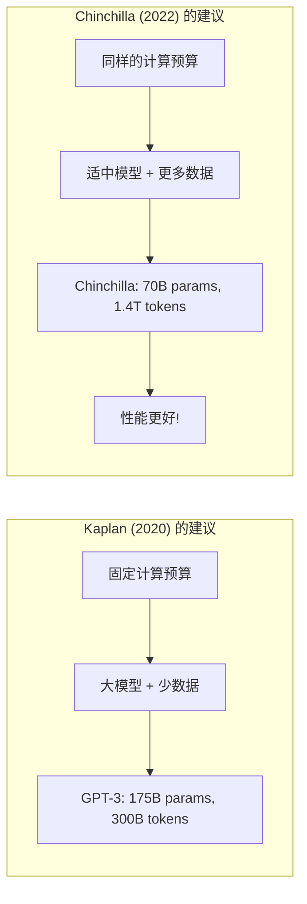
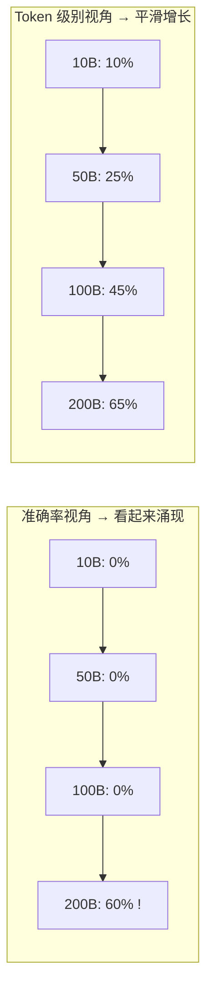
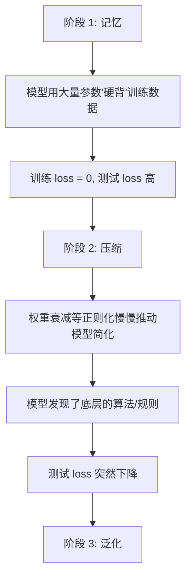
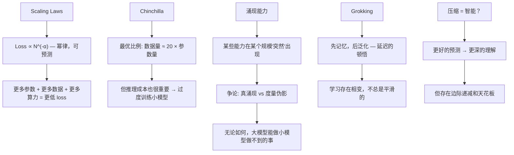

[← 上一章](02-attention.md) | [目录](../README.md) | [下一章 →](04-alignment.md)

# 第三章：规模涌现

> "The unreasonable effectiveness of scale."
> — 对 Wigner 名言的 AI 改写

过去五年，AI 领域最深刻的发现不是某个新算法，而是一个朴素的事实：**把模型变大、数据变多、算力加上去，性能就会提升，而且提升是可预测的**。

这不是一个显而易见的结论。在机器学习的历史中，大多数时候"变大"意味着过拟合和浪费。但 Transformer + 大数据的组合打破了这个规律，催生了一个新范式：**规模就是一切**（scale is all you need）。

这一章我们来理解：为什么规模有效，什么时候规模失效，以及规模如何催生出我们未曾预料的能力。

---

## 3.1 Scaling Laws：可预测的进步

### 幂律关系

2020 年，OpenAI 的 Kaplan 等人发表了一篇改变行业的论文 [Scaling Laws for Neural Language Models](https://arxiv.org/abs/2001.08361)。他们发现语言模型的测试损失（loss）与三个因素之间存在**幂律关系**（power law）：

$$L(N) \approx \left(\frac{N_c}{N}\right)^{\alpha_N} \quad \text{（参数量 N）}$$

$$L(D) \approx \left(\frac{D_c}{D}\right)^{\alpha_D} \quad \text{（数据量 D）}$$

$$L(C) \approx \left(\frac{C_c}{C}\right)^{\alpha_C} \quad \text{（计算量 C）}$$

其中 $\alpha_N \approx 0.076$，$\alpha_D \approx 0.095$，$\alpha_C \approx 0.050$。

### log-log 图：一条直线改变了一切

当你在双对数坐标系上画出 loss vs 参数量/数据量/计算量时，你会看到一条几乎完美的**直线**：

```
log(Loss)
    |
    |\
    | \
    |  \
    |   \
    |    \
    |     \
    |      \___________  ← 还没有看到拐点！
    |
    +-----------------------> log(Compute)
```

这意味着：

1. **可预测性**：你可以提前预测更大模型的性能，不需要先训练再看
2. **投资回报清晰**：10 倍的计算 → 固定比例的 loss 下降
3. **没有明显拐点**：在当时的尺度上，幂律关系没有趋于平缓

这就是为什么科技公司敢于投入数十亿美元训练更大的模型——**收益是可预测的**。

### 一个具体的例子

```python
import numpy as np

# Scaling law 近似（简化版）
def estimated_loss(params_billions, data_tokens_billions):
    """根据参数量和数据量估算 loss"""
    N_c = 8.8e13   # 参数量的特征尺度
    D_c = 5.4e13   # 数据量的特征尺度
    alpha_N = 0.076
    alpha_D = 0.095
    
    N = params_billions * 1e9
    D = data_tokens_billions * 1e9
    
    loss_N = (N_c / N) ** alpha_N
    loss_D = (D_c / D) ** alpha_D
    
    # 简化：取两者的调和近似
    return max(loss_N, loss_D)

# 不同规模的预估 loss
for params in [1, 7, 70, 405]:
    for data in [1000, 5000, 15000]:
        loss = estimated_loss(params, data)
        print(f"{params:>4}B params, {data:>5}B tokens → loss ≈ {loss:.3f}")
```

### 对计算的统一观点

Kaplan 还发现：如果只看总计算量 C（≈ 6ND，N 是参数量，D 是训练 token 数），loss 的表现最"整齐"。这意味着——在固定算力预算下，如何分配参数量和数据量是一个**优化问题**。

---

## 3.2 Chinchilla 与最优分配

### Chinchilla 定律

2022 年，DeepMind 的 Hoffmann 等人发表了 [Training Compute-Optimal Large Language Models](https://arxiv.org/abs/2203.15556)，通常称为 **Chinchilla 论文**。

核心发现：**给定固定的计算预算，参数量 N 和训练数据量 D 应该等比例增长**。

$$N_{opt} \propto C^{0.5}, \quad D_{opt} \propto C^{0.5}$$

粗略的经验法则：**最优数据量 ≈ 20 × 参数量**。

```
模型参数量    最优训练 token 数
1B          → 20B tokens
7B          → 140B tokens
70B         → 1.4T tokens
175B        → 3.5T tokens
```

### GPT-3 训练不足了

根据 Chinchilla 定律，GPT-3（175B 参数）应该在约 3.5T token 上训练，但实际只用了 300B token——**严重欠训练**。同样的计算预算，如果按 Chinchilla 最优分配，可以训练一个更小但效果更好的模型。

DeepMind 用与 GPT-3 相同的计算量训练了 70B 参数的 Chinchilla 模型，在几乎所有基准测试上都超过了 GPT-3。



### 过度训练（Over-training）

但实践中的故事更复杂。Chinchilla 定律优化的是**训练效率**——用最少的计算达到最低的 loss。但现实世界还需要考虑**推理效率**。

一个 70B 模型的推理成本远高于 7B 模型。如果你的应用需要高吞吐量的推理，一个"训练过度"（数据量远超 Chinchilla 最优）但更小的模型可能总体成本更低。

这就是 Meta 训练 **LLaMA** 的思路（[Touvron et al. 2023](https://arxiv.org/abs/2302.13971)）：

```
LLaMA-7B:   在 1T tokens 上训练（Chinchilla 最优 ≈ 140B）
LLaMA-13B:  在 1T tokens 上训练（Chinchilla 最优 ≈ 260B）
LLaMA-65B:  在 1.4T tokens 上训练（Chinchilla 最优 ≈ 1.3T）

→ 小模型被大量"过度训练"，但推理更便宜
→ 在推理密集的场景下总 TCO 更低
```

**Inference-optimal scaling**：如果推理次数远多于训练次数（几乎所有商业场景），那么在更多数据上训练一个更小的模型在经济上更合理。

### 数据墙

Chinchilla 定律还隐含了一个挑战：模型越大，需要的高质量训练数据越多。但互联网上的高质量文本是有限的：

```
估算的高质量互联网文本总量: ~10-15T tokens
人类历史产生的所有文字:      ~100T tokens（包括所有语言、所有载体）

GPT-4 训练数据（估算）:     ~13T tokens
LLaMA-3 405B:               15T tokens
```

我们可能正在接近"数据墙"——自然产生的高质量文本可能不够训练下一代模型。合成数据（让模型产生训练数据）和多模态数据（图片、视频、音频）是目前的主要应对方向。

---

## 3.3 涌现能力（Emergent Abilities）

### 什么是涌现？

Scaling law 告诉我们 loss 是平滑下降的。但一些研究者发现某些**具体能力**的出现并不平滑——它们似乎在某个规模突然"跳"出来。

[Wei et al. 2022](https://arxiv.org/abs/2206.07682) 定义了**涌现能力**（emergent abilities）：

> 一种在小模型中不存在但在大模型中突然出现的能力。

### 经典的涌现例子

**多步算术**：
```
模型规模    "23 + 47 = ?"    "237 + 418 = ?"    "23 × 47 = ?"
1B         ✗ 随机猜           ✗                   ✗
10B        ✓ 基本正确         ✗ 偶尔对             ✗
100B+      ✓ 稳定正确         ✓ 经常正确           ✓ 开始能做
```

**单词解码**（word unscrambling）：
```
"dnuorgkcab" → "background"

模型规模    准确率
<10B       ≈ 0%（完全做不到）
10-50B     ≈ 0%（还是做不到）
>100B      ≈ 50%+ （突然可以了）
```

**思维链推理**（Chain-of-Thought）：
```
小模型 + CoT prompt → 性能不变甚至下降
大模型 + CoT prompt → 性能大幅提升
```

### 涌现是真实的吗？争论

2023 年，[Schaeffer et al.](https://arxiv.org/abs/2304.15004) 提出了一个有争议的观点：**涌现可能是测量伪影**。

他们的论证：

```
传统的涌现度量方式（准确率）：

  准确率 = 完全正确答案数 / 总数

  问题: 这是一个"非此即彼"的指标
  
  考虑多步算术:
    小模型可能算对了 3 步中的 2 步 → 准确率 = 0
    大模型算对了所有 3 步 → 准确率 = 1
    
  看起来是"突然涌现"，但实际上每一步的能力是平滑增长的。
  
  如果换成连续指标（如 token-level accuracy 或 Brier score），
  "涌现"消失了——性能是平滑增长的。
```



### 无论如何，大模型质变了

不管涌现是否是统计幻觉，一个事实是无法否认的：**存在某些任务，小模型做不了但大模型能做**。无论底层机制是平滑增长还是相变，从用户角度看，效果就是"从不行到行"。

这对实践的启示：
- **选择模型大小时考虑任务复杂度**：简单任务不需要大模型，复杂推理任务需要
- **不要在小模型上评估复杂能力然后外推**：小模型的 0 分不意味着大模型也是 0 分
- **Prompt 技巧（如 CoT）只在足够大的模型上有效**

---

## 3.4 Grokking：延迟的顿悟

### 什么是 Grokking？

2022 年，[Power et al.](https://arxiv.org/abs/2201.02177) 在一个简单实验中发现了一个惊人的现象：

> 训练 loss 很早就降到 0（完美记忆了训练集），但测试 loss 在很长时间内仍然很高——然后**突然**测试 loss 也下降了。

```
训练进度 →

训练 loss:  ████▁▁▁▁▁▁▁▁▁▁▁▁▁▁▁▁▁▁▁▁▁▁▁▁▁▁  (很快降到 0)
测试 loss:  ████████████████████████████▁▁▁▁  (很久才下降)
                                       ^
                                   "grokking" 发生！
                               (从记忆到泛化的相变)
```

### 具体例子

Power 等人在模运算（modular arithmetic）上做实验：

```
任务: 学习 (a + b) mod 97

训练集: 所有 (a,b) 对中的随机 50%
测试集: 剩余 50%

观察:
- Epoch 100:   训练准确率 100%, 测试准确率 20% (随机猜)
- Epoch 1000:  训练准确率 100%, 测试准确率 20% (还是随机猜)
- Epoch 10000: 训练准确率 100%, 测试准确率 20% (仍然随机猜!)
- Epoch 30000: 训练准确率 100%, 测试准确率 98% (突然学会了!)
```

模型先**记忆**了训练集，然后在继续训练很长时间后，突然**泛化**了。

### 为什么会 grok？

目前的理解是这样的：



[Nanda et al. 2023](https://arxiv.org/abs/2301.05217) 对模运算的 grokking 进行了详细分析，发现模型最终学到了用**傅里叶变换**来计算模运算——一个优雅的算法解决方案，而不是查找表。

### 对实践的启示

Grokking 的发现挑战了传统的"早停"（early stopping）智慧：

1. **训练 loss 为 0 不意味着应该停止训练**：泛化可能还没发生
2. **正则化很重要**：权重衰减是推动从记忆到泛化的关键力量
3. **模型可能已经接近"理解"但还没完全 grok**：有时多训练一些就能突破
4. **阶段转变是真实的**：学习并非总是平滑的，存在质变节点

不过需要谨慎：grokking 目前主要在小规模的算法任务上被观察到。它是否在大型语言模型的训练中也发生，还是一个开放问题。

---

## 3.5 哲学之问：智能 = 压缩？

### Hutter Prize 的启示

Marcus Hutter（Solomonoff 归纳推理和 AIXI 理论的推动者）设立了 [Hutter Prize](http://prize.hutter1.net/)：奖励能更好地**压缩**维基百科的算法。

这背后的哲学是：**压缩和智能是同一件事的两面**。

要压缩数据，你需要找到数据中的规律——这就是理解。一个完美的压缩器就是一个完美的预测器（因为压缩 = 消除冗余 = 预测下一个 bit/token）。

语言模型训练的交叉熵损失就是在衡量压缩效率：

$$H = -\sum P(x) \log P(x)$$

Loss 越低 → 压缩越好 → "理解"越深。

### 一个思维实验

假设你有一个完美的语言模型（loss = 0，对任何文本都能完美预测下一个 token）。这个模型必须拥有什么？

- **完整的世界知识**：否则无法预测事实性陈述
- **完美的逻辑推理**：否则无法预测推理链
- **对人类行为的建模**：否则无法预测对话和小说
- **物理直觉**：否则无法预测关于物理现象的描述
- **数学能力**：否则无法预测数学证明

换句话说，一个完美的 next-token predictor **在功能上等价于通用人工智能**。

当然，完美的语言模型不存在。但这个思维实验告诉我们：更好的预测 → 更多的能力，而且这个"更多"可能是没有上限的。

### 反对意见和限制

不过，scaling 并非万能：

**1. 幂律的衰减意味着边际递减**

```
从 loss 3.0 → 2.5: 需要 10x 算力
从 loss 2.5 → 2.0: 需要 100x 算力
从 loss 2.0 → 1.5: 需要 1000x 算力
```

虽然进步在继续，但越来越贵。

**2. 有些能力可能不在文本的压缩中**

- 视觉空间推理
- 运动控制
- 长期规划（需要搜索，不只是直觉）
- 形式化数学证明（需要验证，不只是生成）

这些能力可能需要架构创新或训练范式的改变，不只是更多的 scale。

**3. 数据质量比数据数量重要**

垃圾进，垃圾出。在低质量数据上 scale 只会产生一个更大的低质量模型。

### 实践总结

```python
# 选择模型规模的决策框架
def choose_model_size(task_complexity, latency_budget_ms, cost_budget_per_query):
    """
    task_complexity: 'simple' | 'moderate' | 'complex' | 'frontier'
    """
    recommendations = {
        'simple': {
            'size': '1-3B',
            'examples': '分类、实体抽取、简单问答',
            'note': '可以本地部署，极低延迟'
        },
        'moderate': {
            'size': '7-13B', 
            'examples': '摘要、翻译、代码补全',
            'note': '单 GPU 可运行，良好的性价比'
        },
        'complex': {
            'size': '30-70B',
            'examples': '复杂推理、长文写作、多步任务',
            'note': '需要多 GPU，延迟较高'
        },
        'frontier': {
            'size': '200B+',
            'examples': '前沿研究、复杂 agent 任务',
            'note': 'API 调用，成本最高但能力最强'
        }
    }
    return recommendations[task_complexity]
```

---

## 本章小结



核心要点：

1. **Scaling law 使 AI 进步变得可预测**——这是大规模投资的理论基础
2. **Chinchilla 纠正了"越大越好"的简单思维**——关键是参数和数据的平衡
3. **涌现能力意味着规模带来质变**——不能从小模型外推大模型的能力
4. **Grokking 表明学习不总是渐进的**——相变和突破性进展是可能的
5. **压缩 ≈ 理解 是一个有力但有限的框架**——帮助我们理解为什么 scale 有效

在下一章中，我们将看到：有了强大的基座模型之后，如何通过对齐（alignment）让它变成一个有用的助手，而不是一个危险的续写引擎。

---

## 延伸阅读

- [Scaling Laws for Neural Language Models](https://arxiv.org/abs/2001.08361) — Kaplan et al. 2020
- [Training Compute-Optimal Large Language Models (Chinchilla)](https://arxiv.org/abs/2203.15556) — Hoffmann et al. 2022
- [Emergent Abilities of Large Language Models](https://arxiv.org/abs/2206.07682) — Wei et al. 2022
- [Are Emergent Abilities of Large Language Models a Mirage?](https://arxiv.org/abs/2304.15004) — Schaeffer et al. 2023
- [Grokking: Generalization Beyond Overfitting on Small Algorithmic Datasets](https://arxiv.org/abs/2201.02177) — Power et al. 2022
- [Progress Measures for Grokking via Mechanistic Interpretability](https://arxiv.org/abs/2301.05217) — Nanda et al. 2023
- [LLaMA: Open and Efficient Foundation Language Models](https://arxiv.org/abs/2302.13971) — Touvron et al. 2023
- [The Bitter Lesson](http://www.incompleteideas.net/IncIdeas/BitterLesson.html) — Rich Sutton, 2019
