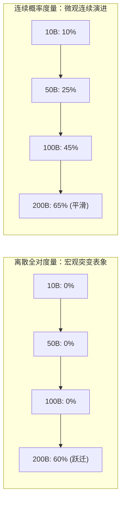
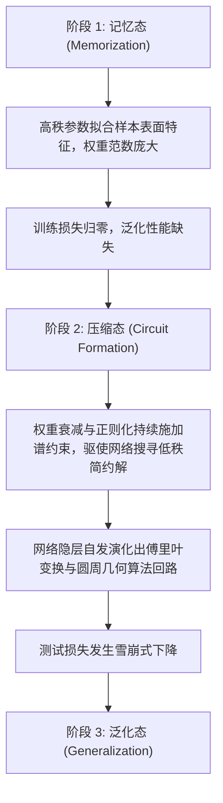
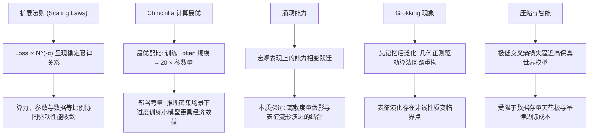

[← 上一章](02-attention.md) | [目录](../README.md) | [下一章 →](04-alignment.md)

**English**: [English](../en/chapters/03-scaling.md)

# 第三章：规模涌现

> "The unreasonable effectiveness of scale."
> （对 Eugene Wigner 经典命题的当代诠释）

过去数年间，人工智能领域最深刻的洞见并非源于某一孤立的算法技巧，而是一个朴素而宏大的物理事实：**持续扩展参数规模、扩充高质量数据并注入算力，模型的性能便会呈现出稳定且高度可预测的对数线性增长**。

在传统机器学习经验中，模型容量的盲目膨胀往往伴随着严重的过拟合与边际效益衰减。然而，Transformer 架构与海量无标注语料的结合彻底重塑了这一认知，确立了以**扩展法则**（Scaling Laws）为核心的新范式。

本章将从第一性原理出发，剖析规模扩展的底层动力机制、计算最优分配边界，以及高维表征流形中复杂能力跃迁的微观图景。

---

## 3.1 Scaling Laws：可预测的进步
 
 ### 幂律关系
 
 2020 年，OpenAI 的 Kaplan 等人发表了奠基性论文 [Scaling Laws for Neural Language Models](https://arxiv.org/abs/2001.08361)。他们发现自回归语言模型的交叉熵测试损失（Loss）与三大要素之间存在严格的**幂律关系**（power law）：
 
 $$L(N) \approx \left(\frac{N_c}{N}\right)^{\alpha_N} \quad \text{（参数量 N）}$$
 
 $$L(D) \approx \left(\frac{D_c}{D}\right)^{\alpha_D} \quad \text{（数据量 D）}$$
 
 $$L(C) \approx \left(\frac{C_c}{C}\right)^{\alpha_C} \quad \text{（计算量 C）}$$
 
 其中 $\alpha_N \approx 0.076$，$\alpha_D \approx 0.095$，$\alpha_C \approx 0.050$。
 
 ### log-log 坐标系下的确定性轨迹
 
 在双对数（log-log）坐标系下，测试损失随参数量、数据量与浮点计算量呈现出极其规则的**线性衰减**：
 
 ```
 log(Loss)
     |
     |\
     | \
     |  \
     |   \
     |    \
     |     \
     |      \___________  ← 尚未观察到明显的饱和平台期
     |
     +-----------------------> log(Compute)
 ```
 
 这一数学规律揭示了三个关键结论：
 
 1. **行为的可预测性**：在小尺度模型上拟合幂律曲线后，可精确预测千亿级别大模型的收敛表现，无需盲目试错；
 2. **稳定的算力回报**：计算量每扩大一个数量级，将带来固定比例的损失下降；
 3. **无明显拐点**：在已探索的算力区间内，幂律关系未见实质性停滞。
 
 这正是工业界敢于投入数以十亿美元构建集群训练超大模型的理论支柱：**性能跃迁具有数学上的确定性**。
 
 ### 损失估计的工程实现
 
 ```python
 import numpy as np
 
 def estimated_loss(params_billions, data_tokens_billions):
     """根据参数量与训练 token 规模估算预期损失"""
     N_c = 8.8e13   # 参数量特征尺度
     D_c = 5.4e13   # 数据量特征尺度
     alpha_N = 0.076
     alpha_D = 0.095
     
     N = params_billions * 1e9
     D = data_tokens_billions * 1e9
     
     loss_N = (N_c / N) ** alpha_N
     loss_D = (D_c / D) ** alpha_D
     
     # 取两者的平衡近似
     return max(loss_N, loss_D)
 
 # 测算不同规模组合下的理论 loss
 for params in [1, 7, 70, 405]:
     for data in [1000, 5000, 15000]:
         loss = estimated_loss(params, data)
         print(f"{params:>4}B params, {data:>5}B tokens → loss ≈ {loss:.3f}")
 ```
 
 ### 算力视角的统一优化
 
 Kaplan 等人进一步指出：当以总浮点计算量 $C \approx 6ND$（其中 $N$ 为非嵌入参数量，$D$ 为训练 token 数量）为统一约束时，损失函数的收敛轨迹最为规整。这意味着，在既定算力预算下，如何在参数规模与数据吞吐之间分配资源，构成了一个明确的**凸优化问题**。
 
 ---
 
 ## 3.2 Chinchilla 与最优分配
 
 ### Chinchilla 定律：计算最优的资源均衡
 
 2022 年，DeepMind 的 Hoffmann 等人发表了著名论文 [Training Compute-Optimal Large Language Models](https://arxiv.org/abs/2203.15556)（即 **Chinchilla 论文**）。
 
 他们修正了 Kaplan 的早期结论，指出：**在固定计算预算下，模型参数量 $N$ 与训练数据量 $D$ 应当保持等比例增长**：
 
 $$N_{opt} \propto C^{0.5}, \quad D_{opt} \propto C^{0.5}$$
 
 由此推导出计算最优的经验法则：**最优训练 token 规模约为参数量的 20 倍**（$D \approx 20N$）。
 
 ```
 模型参数量    Chinchilla 最优训练 token 规模
 1B          → 20B tokens
 7B          → 140B tokens
 70B         → 1.4T tokens
 175B        → 3.5T tokens
 ```
 
 ### GPT-3 的欠训练与范式纠偏
 
 依照 Chinchilla 最优边界审视，GPT-3（175B 参数）仅在 300B token 上完成训练，远未达到 3.5T 的理论最优匹配，处于严重的**欠训练**（under-trained）状态。
 
 在同等计算预算下，DeepMind 训练了 70B 参数的 Chinchilla 模型（匹配 1.4T token），其下游基准性能全面超越了 175B 的 GPT-3。
 
 ```mermaid
 graph LR
     subgraph "Kaplan (2020) 早期范式"
         K1["固定计算预算"] --> K2["庞大参数量 + 较少数据"]
         K2 --> K3["GPT-3: 175B params, 300B tokens"]
     end
     
     subgraph "Chinchilla (2022) 计算最优"
         C1["同等计算预算"] --> C2["紧凑参数量 + 充分数据"]
         C2 --> C3["Chinchilla: 70B params, 1.4T tokens"]
         C3 --> C4["下游表现全面胜出"]
     end
 ```
 
 ### 过度训练与推理感知扩展
 
 然而，Chinchilla 定律的优化目标是**训练阶段的计算最优**，并未涵盖模型部署后的**全生命周期推理成本**。
 
 70B 模型的单次前向传播与显存占用显著高于 7B 模型。若业务场景涉及极高频次的并发推理，采用"过度训练"（Over-training，即训练 token 数量远超 Chinchilla 比例）的小模型，将大幅摊薄全局总持有成本（TCO）。
 
 Meta 的 **LLaMA 系列**正是基于该策略设计的典型范式（[Touvron et al., 2023](https://arxiv.org/abs/2302.13971)）：
 
 ```
 LLaMA-7B:   训练于 1T tokens（Chinchilla 最优比例约为 140B，超出 7 倍）
 LLaMA-13B:  训练于 1T tokens（Chinchilla 最优比例约为 260B）
 LLaMA-65B:  训练于 1.4T tokens
 
 结果：小模型通过充分吸收海量数据获得高表征密度，推理时延与显存开销显著降低
 ```
 
 这构成了**推理最优扩展**（Inference-optimal scaling）：当预期推理量极为庞大时，在训练阶段向小模型注入数倍于理论最优的语料，具备显著的经济效益与工程合理性。
 
 ### 高质量文本的存量边界
 
 扩展法则所隐含的前提，是持续供给充足的高质量语料。然而互联网公开的高质量自然语言数据存量正迅速收敛：
 
 ```
 高质量互联网公开发布语料估计: ~10-15T tokens
 人类数字化总文本（含书籍、学术文献全量）: ~100T tokens
 
 GPT-4 训练语料规模（业界估算）: ~13T tokens
 LLaMA-3 405B 训练语料: 15T tokens
 ```
 
 业界正在逼近自然语言的存量天花板。高质量合成数据（Synthetic Data）与多模态数据（视觉、音频）的跨域融合，已成为延续规模效应的关键探索方向。

---

## 3.3 涌现能力（Emergent Abilities）

### 什么是涌现？

扩展法则表明全局交叉熵损失呈现平滑连续的单调下降。然而诸多研究观察到：某些**特定下游能力**的演化轨迹并不平缓，而是在模型越过特定参数或算力阈值时，呈现出类似相变的跃迁式爆发。

Wei 等人（[Wei et al., 2022](https://arxiv.org/abs/2206.07682)）将此类现象形式化定义为**涌现能力**（Emergent Abilities）：

> 即在低参数规模模型中完全不具备、而在跨越某一临界规模后突变式显现的高阶能力。

### 经典的涌现案例

**多步复合算术**：
```
模型规模    "23 + 47 = ?"    "237 + 418 = ?"    "23 × 47 = ?"
1B         ✗ 随机概率分布     ✗ 无法处理          ✗ 无法处理
10B        ✓ 基本正确         ✗ 偶发命中          ✗ 无法处理
100B+      ✓ 稳定正确         ✓ 高置信正确        ✓ 初步具备泛化能力
```

**乱序字符重构**（Word Unscrambling）：
```
"dnuorgkcab" → "background"

模型规模    下游任务准确率
<10B       ≈ 0%（无法形成有效模式）
10-50B     ≈ 0%（依然处于随机盲区）
>100B      ≈ 50%+（表征流形重组，突显准确映射）
```

**思维链推理**（Chain-of-Thought）：
```
小参数模型 + CoT 引导 → 性能未见提升甚至引入结构扰动
大参数模型 + CoT 引导 → 复杂多步因果推理准确率显著跃升
```

### 涌现现象的本质争论：真实相变还是度量伪影？

2023 年，Schaeffer 等人（[Schaeffer et al., 2023](https://arxiv.org/abs/2304.15004)）提出了极具穿透力的批判性视角：**所谓涌现，可能在很大程度上源于评估度量方式的非线性非对称性（Metric Artifact）**。

其形式化推导如下：

```
传统下游基准多采用离散的"非此即彼"全对准确率（Exact Match Accuracy）：

  准确率 = 完全匹配样本数 / 总样本数

在复合多步任务中，设完成任务需连续正确执行 k 个逻辑步骤，每步的正确概率为 p：
  全局准确率 = p^k

随着模型规模平滑扩展，假设单步正确率 p 从 0.2 平滑上升至 0.8：
  当 k = 5 时：
  p = 0.2 → 全局准确率 = 0.2^5 = 0.032%（宏观表现为 0 分）
  p = 0.5 → 全局准确率 = 0.5^5 = 3.125%（仍接近 0 分）
  p = 0.8 → 全局准确率 = 0.8^5 = 32.8% （宏观呈现为陡峭爆发）

若以连续的交叉熵、Token 级别准确率或 Brier Score 评估：
"涌现"突变即被消解，底层的表征改进实际上始终沿着平滑轨迹推进。
```



### 涌现视角的系统工程推论

无论微观机理是纯粹的统计连续性还是高阶回路的相变重组，在宏观任务执行层面，系统的能力边界确实发生了根本性跨越：

- **任务复杂度与模型选型解耦**：简单格式转换与特征分类无需大模型，长程符号推理与复杂约束求解则必须依赖具备高阶表征能力的模型；
- **小模型评测结论不可简单线性外推**：小模型在复杂任务上的零准确率并不代表该架构无法处理该问题；
- **提示工程策略存在规模阈值**：如少样本引导与思维链技术，唯有在模型表征容量跨越特定临界点后，方能稳定激活深层注意力协同回路。

---

## 3.4 Grokking：延迟的顿悟

### 什么是 Grokking？

2022 年，Power 等人（[Power et al., 2022](https://arxiv.org/abs/2201.02177)）在算法任务实验中观察到一种反常的动力学演化：

> 模型在极早期便将训练损失降至接近零（完美过拟合记忆了训练样本），而测试损失在此后数十倍的训练周期内保持高位震荡；随后在某一时刻，测试损失**发生断崖式下降**，模型实现了从记忆到泛化的结构跃迁。

```
训练优化进程 →

训练损失:  ████▁▁▁▁▁▁▁▁▁▁▁▁▁▁▁▁▁▁▁▁▁▁▁▁▁▁  (迅速趋近于 0)
测试损失:  ████████████████████████████▁▁▁▁  (长期滞后，突发骤降)
                                       ^
                                   Grokking 临界点
                                (表征流形从局部记忆重构为全局算法解)
```

### 模运算实验中的表征跃迁

以抽象代数模运算任务 $(a + b) \bmod 97$ 为例：

```
训练集：全域候选对中随机采样 50%
测试集：剩余 50% 未见样本

动力学演化轨迹：
- Epoch 100:   训练集准确率 100%，测试集准确率 20%（随机分布）
- Epoch 1000:  训练集准确率 100%，测试集准确率 20%
- Epoch 10000: 训练集准确率 100%，测试集准确率 20%（看似已彻底过拟合）
- Epoch 30000: 训练集准确率 100%，测试集准确率 98%（泛化解突变形成）
```

### Grokking 的底层力学机理

机制可解释性研究（[Nanda et al., 2023](https://arxiv.org/abs/2301.05217)）揭示了 Grokking 发生时的隐层回路重构过程：



网络并未长期停留在庞大的离散查找表中，而是在权重衰减（Weight Decay）的持续几何约束下，通过连续优化寻找到以**三角函数和傅里叶基**为底层的紧凑解析算法解。

### 对工程训练的认知更新

Grokking 现象为系统优化带来了重要的范式启发：

1. **破除传统早停（Early Stopping）教条**：训练集损失趋零并非训练终点，泛化结构的涌现往往滞后于拟合过程；
2. **正则化的拓扑引导作用**：权重衰减不仅是防止过拟合的阻尼器，更是驱动高维参数空间向低复杂度算法回路收敛的核心动力；
3. **隐式表征演进的非线性**：神经网络在参数空间的演化并非匀速前进，而是伴随着相变临界点的阶段性跃迁。

---

## 3.5 哲学之问：智能是否等价于极致的压缩？

### Hutter Prize 的形式化洞见

算法信息论学者 Marcus Hutter 设立的 **Hutter Prize** 将奖励授予能对标准文本语料实现极限无损压缩的算法。

其背后的形式化基础揭示了智能与信息论的同构关系：**数据压缩与统计智能本质上是同一信息处理过程的正反两面**。

为了对复杂序列实现无损压缩，编码系统必须剔除一切冗余，这要求网络内部必须精准捕获数据生成过程的因果不变量：

$$\mathcal{H}(X) = -\sum P(x) \log_2 P(x)$$

交叉熵损失的持续优化，即是在几何上不断压缩序列的条件信息熵。损失函数的极限衰减，意味着网络内部构建了高保真度的生成流形。

### 完美语言模型思想实验

设想存在一个在任意上下文尺度上将损失压减至零的终极语言模型，其内部必须建立何种完备表征？

- **全域事实先验**：否则无法消除实体关联中的不确定性；
- **严密形式因果推理**：否则无法消除多步逻辑推演的条件熵；
- **人类心智模型拟合**：否则无法在博弈与对话中实现最优概率分配；
- **物理与数学规律内化**：否则无法生成严格自洽的科学证明。

这在形式上推导出一个深刻结论：**在完备语料上实现极致预测的自回归模型，在功能表征上等价于广义通用智能系统**。

### 规模扩展的客观物理边界

然而，纯粹依赖无监督语料的规模扩展依然面临明确的边际瓶颈：

**1. 幂律收敛的指数级成本**

```
损失从 3.0 降低至 2.5：需要增加约 10 倍计算量
损失从 2.5 降低至 2.0：需要增加约 100 倍计算量
损失从 2.0 降低至 1.5：需要增加约 1000 倍计算量
```

单纯追求浮点算力堆叠，将遭遇经济成本与能源消耗的硬约束。

**2. 文本模态的表征局限**

现实世界的诸多因果维度并未完全编码于文本符号之中：
- 三维物理空间感知与几何直觉；
- 连续运动控制与具身动力学反馈；
- 形式化数学与算法证明中的系统性回溯搜索；
- 开放环境中的探索与主动试错。

这些维度的突破，依赖于搜索验证机制（如强化学习与测试时计算扩展）、具身多模态融合以及架构层面的持续革新。

**3. 数据质量维度的决定性制约**

无监督扩展的效能完全受制于输入分布的保真度。在充斥噪声或低价值共现的数据集上进行规模扩展，仅会放大系统内部的偏差与幻觉。

### 模型选型决策框架

```python
def choose_model_size(task_complexity, latency_budget_ms, cost_budget_per_query):
    """
    根据任务复杂度与工程约束权衡模型规模
    task_complexity: 'simple' | 'moderate' | 'complex' | 'frontier'
    """
    recommendations = {
        'simple': {
            'size': '1-3B',
            'examples': '结构化信息提取、关键词分类、浅层文本转换',
            'note': '支持端侧或单卡极低延迟部署'
        },
        'moderate': {
            'size': '7-14B', 
            'examples': '跨语言翻译、长文摘要提取、通用函数补全',
            'note': '消费级 GPU 可承载，具备优异性价比'
        },
        'complex': {
            'size': '30-70B',
            'examples': '复杂多步因果推理、专业领域深度问答、长程逻辑分析',
            'note': '多卡并行服务，推理成本中等'
        },
        'frontier': {
            'size': '200B+',
            'examples': '前沿科学探索、自主演化 Agent、全域代码系统合成',
            'note': '依赖前沿云端集群，追求极限泛化能力'
        }
    }
    return recommendations[task_complexity]
```

---

## 本章小结



核心要点：

1. **扩展法则使模型性能演进具备可预测性**：为超大规模算力投入提供了坚实的理论基石；
2. **Chinchilla 定律确立了计算最优的资源均衡**：破除了盲目堆叠参数的误区，强调参数量与数据吞吐的协同增长；
3. **涌现能力界定了模型任务处理的质变边界**：复杂推理与少样本引导必须依托跨越临界规模的模型容量；
4. **Grokking 揭示了神经网络表征重构的动力学本质**：从记忆到泛化的跨越需要充分的优化周期与正则化引导；
5. **压缩等价于智能构筑了强大的认知透镜**：但必须正视无监督文本扩展的物理与经济边界，结合强化学习与多模态扩展开辟新路径。

在下一章中，我们将探讨：在完成了海量语料的无监督预训练之后，如何通过微调与对齐技术（Alignment），将原始的概率续写引擎驯化为安全、可控且遵循人类意图的智能系统。

---

## 延伸阅读

- [Scaling Laws for Neural Language Models](https://arxiv.org/abs/2001.08361), Kaplan et al., 2020
- [Training Compute-Optimal Large Language Models (Chinchilla)](https://arxiv.org/abs/2203.15556), Hoffmann et al., 2022
- [Emergent Abilities of Large Language Models](https://arxiv.org/abs/2206.07682), Wei et al., 2022
- [Are Emergent Abilities of Large Language Models a Mirage?](https://arxiv.org/abs/2304.15004), Schaeffer et al., 2023
- [Grokking: Generalization Beyond Overfitting on Small Algorithmic Datasets](https://arxiv.org/abs/2201.02177), Power et al., 2022
- [Progress Measures for Grokking via Mechanistic Interpretability](https://arxiv.org/abs/2301.05217), Nanda et al., 2023
- [LLaMA: Open and Efficient Foundation Language Models](https://arxiv.org/abs/2302.13971), Touvron et al., 2023
- [The Bitter Lesson](http://www.incompleteideas.net/IncIdeas/BitterLesson.html), Rich Sutton, 2019
