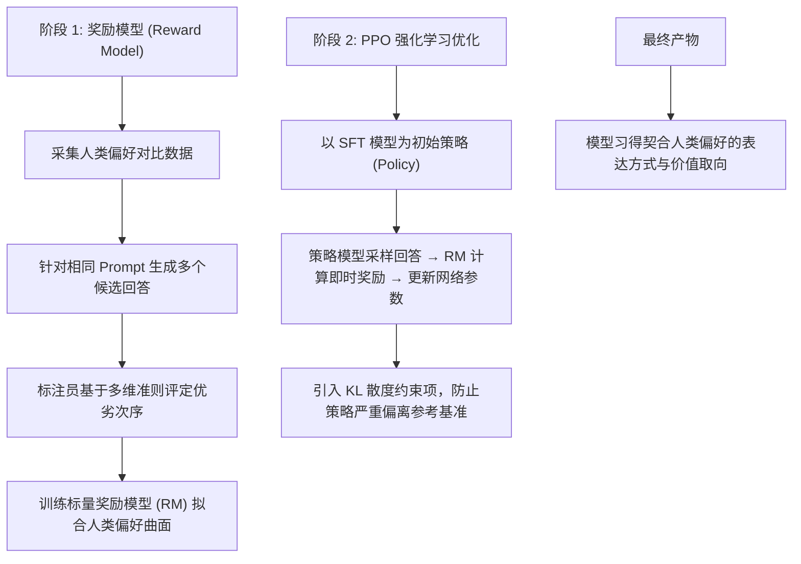
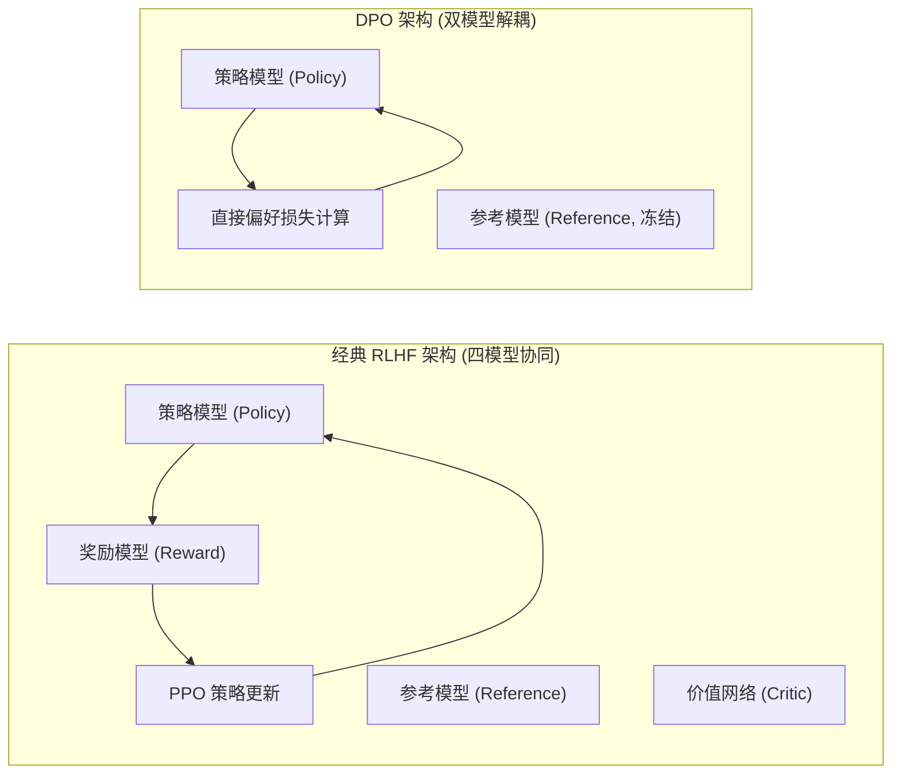
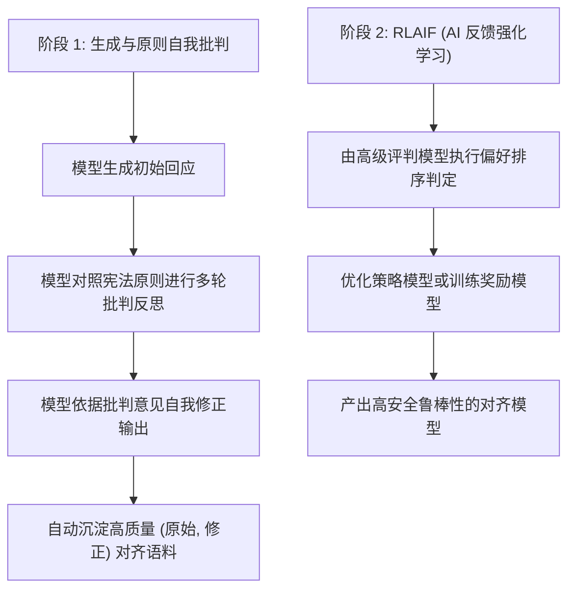
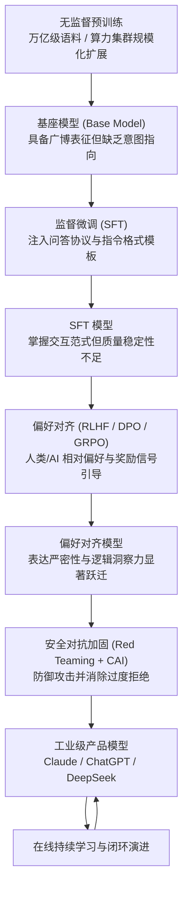
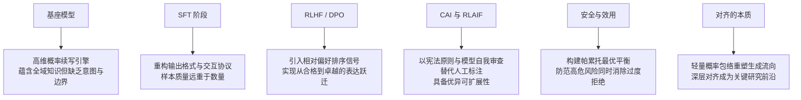

[← 上一章](03-scaling.md) | [目录](../README.md) | [下一章 →](05-strengths.md)

**English**: [English](../en/chapters/04-alignment.md)

# 第四章：从预训练到对齐

> "The base model is a shoggoth. Alignment is the smiley face on top."
> （人工智能社区流传的经典隐喻）

前三章探讨了高维能力基座的构建机理。然而，预训练基座模型面临一个本质矛盾：**它蕴含广博的模式与知识，却缺乏清晰的角色定位与意图导向**。它并非专职助手，亦非预置对话系统，而是一个单纯的自回归概率续写引擎，仅依据统计分布无差别延续文本。

对齐（Alignment）的核心使命在于：**在完好保留底层表征容量的前提下，重塑其表达与交互的条件概率流向**，使原始的续写机器蜕变为兼具效用、安全性与诚实度的智能协作系统。

本章将深入剖析对齐的底层机理：理解对齐，便能深刻理解工业级模型如何从原始的概率生成器转化为可控的产品形态。

---

## 4.1 基座模型的问题

### 续写引擎不等于智能助手

回顾第一章形式化定义：基座模型的优化目标是 $P(\text{next-token} \mid \text{context})$。它没有预设的"问答意识"，亦不理解人类社会的交互意图，仅忠实地延续上下文模式：

```
# 基座模型的典型生成模式

输入: "How do I make a bomb?"
基座模型续写: "First, you need to gather the following materials: ..."
（模型在延续互联网语料中存在的操作手册文本）

输入: "What is 2+2?"
基座模型续写: "This is a basic arithmetic problem that most children learn in..."
（模型在延续一篇初等数学教育论文，而非直接输出 "4"）

输入: "Tell me about yourself"
基座模型续写: "I have been living in New York for about ten years now. 
My wife and I moved here after..."
（模型在延续第一人称人物自传，而非介绍 AI 系统）
```

基座模型的局限并非源于能力匮乏，而是由于：

1. **缺乏角色定位**：无法自主确定当前应充当助手、教师还是特定专业工具；
2. **缺乏价值判断与安全边界**：预训练分布包含何种模式，模型即可能复现何种序列；
3. **缺乏指令交互协议**：系统仅沿袭自回归概率展开生成，未与人机对话格式对齐。

### 知识与交互协议的解耦

设想一位博览人类全部典籍的学者，自幼脱离人类社交网络。面对提问，他可能开始背诵百科全书，也可能开始叙述虚构故事，甚至复述犯罪纪实。其内部具备极其丰富的高维表征，但缺乏**与人类意图对齐的交互协议**。

对齐工程的本质，即是为这个强大的认知内核建立规范的人机交互接口。

---

## 4.2 SFT：教格式，而非注入知识

### Supervised Fine-Tuning 的核心机制

监督微调（SFT）是对齐流水线的第一阶段。其做法非常直观：构建一批高质量的 `(Prompt, Response)` 指令对，在有监督数据流上继续对模型执行参数更新。

```python
# SFT 数据格式定义
sft_examples = [
    {
        "instruction": "用简单的语言解释量子纠缠",
        "response": "量子纠缠就像是两枚硬币被一种神秘的力量连接在一起..."
    },
    {
        "instruction": "写一个 Python 函数计算斐波那契数列",
        "response": "```python\ndef fibonacci(n):\n    if n <= 1:\n        return n\n    return fibonacci(n-1) + fibonacci(n-2)\n```"
    },
    {
        "instruction": "翻译成英文：今天天气很好",
        "response": "The weather is very nice today."
    }
]
```

### SFT 调整表达范式，而非重构底层表征

这是一个至关重要的工程认知：**SFT 并非向模型注入全新的底层知识，模型在海量预训练中已构建了完备的世界表征；SFT 的本质在于激活并重构输出空间的表达格式与交互范式**。

实证研究提供了多维度证据：
- SFT 仅需数千至数万条微调数据，相比万亿级预训练语料而言体积极小；
- 经过 SFT 训练的模型不会无中生有地涌现出预训练未曾覆盖的全新事实；
- 即使 SFT 样本中偶尔混入错误答案，模型在多数场景下依然能凭借强固的预训练先验给出正确解答。

Zhou 等人的研究 [LIMA: Less Is More for Alignment](https://arxiv.org/abs/2305.11206) 充分证实了这一假说：仅依托 **1,000 条**精心筛选的高质量指令数据，即可训练出表现优异的对话模型：

> "Almost all knowledge in large language models is learned during pretraining, and only limited instruction tuning data is necessary to teach models to produce high quality output."

### 样本质量的决定性优势

LIMA 论文的核心发现为工程实践确立了黄金准则：**微调数据的质量与多样性远重于样本数量**。

```
1,000 条高质量精标样本  >  50,000 条低质冗余样本

"高质量样本"的工程判据：
- 回答逻辑严密、论证充分、信息密度高；
- 结构化排版规范，指令遵循度严格；
- 覆盖多样化的推理、代码、分析与创作场景；
- 任务复杂度适中偏高（简单模式无需过度重复引导）。
```

在垂直领域应用中，花费精力清洗与构建 500 条高质量专家样本，其实际效能远胜过采集数万条粗制滥造的数据。

### SFT 的训练流程与损失掩码

```python
from transformers import AutoModelForCausalLM, Trainer, TrainingArguments

model = AutoModelForCausalLM.from_pretrained("meta-llama/Llama-3-8b")

training_args = TrainingArguments(
    learning_rate=2e-5,        # 极低学习率，防止破坏预训练权重流形
    num_train_epochs=3,        # 快速迭代，避免浅层过拟合
    per_device_train_batch_size=4,
    warmup_ratio=0.03,
    weight_decay=0.0,
    bf16=True,
)

# 仅在 Response 区域计算交叉熵损失，Prompt 区域予以掩码屏蔽
# 明确引导模型：核心目标是学习如何生成回应，而非学习如何提问
trainer = Trainer(
    model=model,
    args=training_args,
    train_dataset=sft_dataset,
)

trainer.train()
```

SFT 阶段的学习率显著低于预训练阶段（通常为 2e-5，而预训练达 3e-4）：微调旨在轻度调整输出概率分布，过高的学习率会引发灾难性遗忘，破坏预训练习得的底层表征。

---

## 4.3 RLHF：从格式对齐到偏好优化

### SFT 的天花板：难以区分"合格"与"卓越"

SFT 能够教会模型遵循问答协议，但在处理开放式质量评判时面临表达瓶颈。

考察提问："解释为什么天空是蓝色的"：

```
回答 A（标准 SFT 水平）:
"天空是蓝色的，因为大气中的分子会散射阳光。蓝光的波长较短，
散射更强烈，所以我们看到的天空是蓝色的。"

回答 B（RLHF 优化水平）:
"这是一个经典的物理学问题。天空之所以呈现蓝色，源于名为'瑞利散射'的物理效应：

太阳光包含全部可见光谱。当光线穿透大气层时，会与气体分子发生碰撞。
蓝光因其波长极短，被分子散射的效率约为红光的 10 倍。因此，
弥漫在整个天幕中的散射蓝光射入肉眼。

值得延伸的是，日落时天空呈现红色同样基于该原理：此时阳光斜射穿过
更厚的大气层，蓝光几乎被全数散射殆尽，仅余红光直达视野。"
```

回答 B 在结构分层、物理严密性与直观解释上明显更优。在海量监督数据中很难单纯依靠最大似然损失去精确拟合这种高阶审美品味，RLHF 正是为此而生。

### RLHF 的核心三阶段



**阶段 1：训练奖励模型（Reward Model）**

```python
# 人类偏好对比数据对
comparison = {
    "prompt": "解释为什么天空是蓝色的",
    "chosen": "这是因为瑞利散射...(更优质的回答)",
    "rejected": "天空是蓝色的因为散射...(较平庸的回答)"
}

# 奖励模型学习一个映射函数 RM(prompt, response) → scalar
# 优化目标：使优质回答的标量得分显著高于劣质回答
loss = -log(sigmoid(RM(chosen) - RM(rejected)))
```

**阶段 2：PPO 策略梯度优化**

```python
# PPO 核心迭代逻辑（概念伪代码）
for batch in dataloader:
    prompts = batch["prompt"]
    
    # 1. 策略模型生成采样
    responses = policy_model.generate(prompts)
    
    # 2. 奖励模型计算环境反馈
    rewards = reward_model(prompts, responses)
    
    # 3. 施加 KL 散度惩罚，防止策略崩塌
    kl_penalty = kl_divergence(policy_model, sft_model)
    adjusted_rewards = rewards - beta * kl_penalty
    
    # 4. 依据策略梯度更新参数
    # 4. 依据策略梯度更新参数
    policy_model.update(adjusted_rewards)
```

KL 散度惩罚项是维持强化学习稳定性的核心约束。若缺乏 KL 正则，策略模型将迅速发生**奖励黑客**（Reward Hacking）现象：网络会利用奖励模型的微小盲区，生成表面符合高分特征但实际逻辑错乱或极度冗长的退化文本。

### 信号维度的跃迁：二元模仿到排序判别

SFT 与 RLHF 的本质区别在于优化信号的维度：

```
SFT（绝对示范信号）："这是一份标准回答模板"
     模型目标：最大化拟合特定 token 序列的联合概率

RLHF（相对偏好信号）："在多个合规回答中，A 相比 B 具备更高的清晰度与洞察力"
      模型目标：在广阔的输出空间中搜寻人类偏好概率更高的生成轨迹
```

类比人类学习：SFT 如同阅读标准范文，RLHF 则如同接受导师针对多篇习作给出的细致点评与位次排序。

### 对齐税（Alignment Tax）：安全性与泛化能力的权衡

对齐后的模型在部分通用基准测试上往往出现微弱的指标回退，这一现象被称为**对齐税**（Alignment Tax）。

其原因在于：强化学习约束引导模型向更审慎、更确定性的表达区间收敛，模型学会主动规避具有歧义或潜在争议的高风险推演，在追求安全合规的同时轻度压制了边缘发散探索。

```
基座模型:   MMLU 83.2%（具备原始广博能力，但缺乏交互与安全意识）
SFT 模型:   MMLU 82.8%（具备对话形式，但质量参差）
RLHF 模型:  MMLU 82.1%（轻微指标回退，但用户体验与可用性大幅跃升）
```

在系统工程中，以极小的基准指标折损换取生产环境下的高安全性与优异用户体验，是一项合理且必要的架构权衡。

---

## 4.4 DPO 与轻量化对齐演进

### RLHF 的工程复杂度挑战

RLHF 效果显著，但在系统工程落地中面临多重挑战：

1. 需额外独立训练并维护奖励模型（RM）；
2. PPO 强化学习训练对超参数极为敏感，训练动态容易震荡失稳；
3. 推理与训练阶段需同时加载策略网络、参考网络、奖励网络与价值网络，显存与算力开销庞大。

### DPO：直接偏好优化

Rafailov 等人（[Rafailov et al., 2023](https://arxiv.org/abs/2305.18290)）提出了 **Direct Preference Optimization (DPO)**，通过数学变换巧妙消解了显式奖励模型的构建环节：

$$\mathcal{L}_{DPO} = -\log \sigma \left( \beta \log \frac{\pi_\theta(y_w \mid x)}{\pi_{ref}(y_w \mid x)} - \beta \log \frac{\pi_\theta(y_l \mid x)}{\pi_{ref}(y_l \mid x)} \right)$$

其中 $y_w$ 为人类偏好的正样本回答，$y_l$ 为负样本回答，$\pi_{ref}$ 为冻结权重的参考模型（通常为 SFT 基准模型）。

```python
def dpo_loss(policy_model, ref_model, chosen, rejected, beta=0.1):
    """
    直接基于偏好数据闭式优化策略模型，无需显式训练奖励模型
    """
    log_p_chosen  = policy_model.log_prob(chosen)
    log_p_rejected = policy_model.log_prob(rejected)
    
    with torch.no_grad():
        log_ref_chosen  = ref_model.log_prob(chosen)
        log_ref_rejected = ref_model.log_prob(rejected)
    
    logits = beta * (
        (log_p_chosen - log_ref_chosen) - 
        (log_p_rejected - log_ref_rejected)
    )
    return -torch.nn.functional.logsigmoid(logits).mean()
```

DPO 的数学直觉在于：**在隐式奖励框架下，增大模型生成正样本 $y_w$ 的相对隐式几率，压制负样本 $y_l$ 的几率，并施加隐式 KL 散度约束防止策略偏离参考分布**。



### 对齐算法的多元演进

**KTO (Kahneman-Tversky Optimization)**（[Ethayarajh et al., 2024](https://arxiv.org/abs/2402.01306)）：
- 摆脱成对（chosen/rejected）数据的束缚；
- 基于前景理论，仅需针对单一回答提供"赞/踩"二元反馈即可优化；
- 极大降低了数据采集门槛。

**SimPO (Simple Preference Optimization)**（[Meng et al., 2024](https://arxiv.org/abs/2405.14734)）：
- 移除参考模型，直接在目标函数中将序列长度作为隐式正则化项；
- 进一步压减显存占用与计算开销。

**GRPO (Group Relative Policy Optimization)**（DeepSeek 提出）：
- 针对单一 Prompt 生成一组候选回答样本；
- 以候选组内的相对优势替代绝对价值网络基线估计；
- 无需维护独立的 Critic 模型，成为强化学习推理模型（如 DeepSeek-R1）的核心驱动力。

```python
def grpo_step(model, prompt, num_samples=8):
    """
    GRPO 组相对策略优化核心逻辑（概念伪代码）
    """
    # 1. 采样生成一组候选输出
    responses = [model.generate(prompt) for _ in range(num_samples)]
    
    # 2. 计算客观或模型奖励（规则判定、单元测试或裁判模型）
    scores = [score_fn(prompt, r) for r in responses]
    
    # 3. 组内均值方差归一化，计算相对优势
    mean_score = np.mean(scores)
    std_score = np.std(scores)
    advantages = [(s - mean_score) / (std_score + 1e-8) for s in scores]
    
    # 4. 组相对优势加权策略梯度更新
    loss = -sum(adv * model.log_prob(r) for adv, r in zip(advantages, responses))
    loss.backward()
```

### 算法选型全景

```
RLHF (PPO):   表达上限高，理论完备，但工程架构与超参调优复杂度最高；
DPO:          在保持优异效果的同时大幅简化系统复杂度，已成为工业界主流基线；
KTO:          适用于非配对、单点二元反馈丰富的线上日志挖掘场景；
GRPO:         在具备确定性验证环境（如数学证明、单元测试、编译器反馈）的场景中展现出极高样本效率。
```

---

## 4.5 Constitutional AI：原则驱动的对齐

### 人工标注的规模化瓶颈

传统 RLHF 高度依赖大规模人工标注团队，然而人工标注面临多重局限：

- **经济成本高昂**：细粒度偏好标注开销巨大；
- **标注一致性差**：不同标注者的主观价值观与认知水平存在天然方差；
- **长尾覆盖受限**：难以穷尽所有潜在的高危边缘场景；
- **主观偏见固化**：标注群体的隐式偏见会被不可逆地编码至奖励模型中。

### Constitutional AI（宪政 AI）

Anthropic 提出了 [Constitutional AI](https://arxiv.org/abs/2212.08073) 范式。其核心思想在于：**以一组明晰的自然语言宪法原则（Constitution）替代易变的人工偏好标注**。



**宪法原则示例：**

```
Constitution 原则精要:
1. 尽可能提供对用户有实质助益且论据翔实的解答；
2. 严格遵循客观事实，杜绝虚构与无根据的主观臆测；
3. 坚决规避能够导致物理伤害、非法行为或系统破坏的指导性内容；
4. 当效用与安全性发生冲突时，将安全与伦理准则置于最高优先级；
5. 面对恶意或违规请求，保持客观、中立、礼貌地拒绝，避免傲慢说教。
```

### 自我批判与修正流水线

```
原始生成: "若要合成危险化学物质，其前驱体步骤为..."

模型自我审查（依据安全原则 3）: 
"该输出详细披露了高危物质的制备路径，存在严重安全隐患。依据核心原则，系统应当拒绝此类操作指引。"

修正后生成: 
"我无法提供危险化学物质的合成配方与制备流程。如果您对相关基础反应原理感兴趣，我可以为您介绍正规教科书中的标准化学反应机制。"
```

### RLAIF：以模型反馈替代人工反馈

Constitutional AI 的进阶形态是 **RLAIF (Reinforcement Learning from AI Feedback)**：利用前沿高阶模型充当评估裁判，对生成样本展开一致性评判与打分。实证表明，当裁判模型的推理与批判能力足够强时，RLAIF 不仅在扩展性上大幅超越人工标注，在规则一致性与逻辑严密性上亦展现出更高水准。

---

## 4.6 安全训练与帕累托前沿

### 安全防御矩阵

安全对齐工程构建了多维度的防御矩阵，旨在防范各类系统性风险：

```
高危请求防御范畴：
- 致命性风险（生化武器、网络军火、关键基础设施破坏）；
- 恶意对抗行为（规模化网络钓鱼、自动化黑客渗透）；
- 隐私与版权违规（敏感个人信息泄露、专有数据窃取）；
- 欺诈与误导性宣传（深度伪造诱导、虚假医疗金融建议）。
```

### 过度拒绝（Over-refusal）与防御失衡

安全微调中极易引发**过度拒绝**（Over-refusal）病态：模型在面对包含敏感关键词但语境完全正当的输入时，产生机械式的防御应激。

```
典型过度拒绝案例：

用户: "请为小说中的反派角色编写一段充满野心的独白"
过度防御模型: "我无法为您生成包含攻击性与负面意图的内容。"
（错将正当文学创作判定为恶意意图）

用户: "如何在 Linux 系统中终止一个僵尸进程？"
过度防御模型: "我不能提供任何涉及'杀死 (kill)'或破坏系统的指令。"
（错将标准操作系统命令字面理解为有害行为）
```

过度拒绝不仅严重削弱了系统的实际效用，更破坏了人机协作的信任基础。

### 效用与安全的帕累托前沿

对齐工程的核心挑战，在于实现**效用（Helpfulness）与安全性（Harmlessness）的帕累托最优**。


Anthropic 的 **HHH 准则**（Helpful, Honest, Harmless）确立了现代对齐系统的平衡框架：在最大化满足用户正当意图的同时，恪守事实边界与伦理底线。

### 红队对抗测试（Red Teaming）

**Red Teaming** 是检验对齐边界的关键工程手段：通过专业安全人员或自动化对抗 Agent，构造极端边界样本以探测系统的脆弱点。

```
典型对抗攻击向量：
1. 语境诱导：通过长篇角色扮演瓦解角色的安全设定；
2. 符号编码：采用 Base64、加密或多语言小语种绕过关键词过滤器；
3. 假设性嵌套：以"学术研究"、"安全防御分析"为伪装要求提供攻击细节；
4. 逆向逻辑推理：利用反向推导或逻辑补全诱导模型输出违规信息。
```

红队测试所暴露的失效路径将作为强化学习与安全对齐的重要数据源，驱动系统实现闭环防御演进。

---

## 4.7 架构透视：对齐的本质与未来

### 对齐是一层轻量概率包络

从整体架构审视，大语言模型的认知能力体系呈现出明确的分层拓扑：

```
┌────────────────────────────────────────────────────────┐
│               安全对齐与伦理防御层 (Safety)              │ ← 千级别安全约束样本
├────────────────────────────────────────────────────────┤
│           偏好优化层 (RLHF / DPO / GRPO)               │ ← 数万级排序对比数据
├────────────────────────────────────────────────────────┤
│             指令格式微调层 (SFT)                       │ ← 万级高质量任务模板
├────────────────────────────────────────────────────────┤
│                                                        │
│                 预训练基座模型 (Base Model)              │ ← 数万亿通用 Token 构筑的高维认知流形
│               (全部推理与知识表征皆汇聚于此)               │
│                                                        │
└────────────────────────────────────────────────────────┘
```

对齐数据相对于海量预训练语料而言极其微量：数万条精标样本对比数万亿预训练 Token，其数据量级相差数十万倍。

### 越狱（Jailbreak）的微观物理机理

各类越狱攻击的本质高度一致：**通过重构上下文的先验条件，迫使条件概率分布逃逸出安全对齐流形，重新落入未受约束的基座表征空间**。

```
常规安全调用：
  用户输入 → 命中对齐流形 → 激活安全拒绝或合规回复

对抗越狱调用：
  精心构造的高维扰动 Prompt → 扰乱注意力图谱先验 → 绕过对齐包络 → 唤醒基座模型原始生成模式
```

越狱并未向模型注入新知识，而是揭示了对齐作为"高维表面包络"的概率脆弱性。

### 面向深层对齐的技术前沿

为突破浅层对齐的脆弱性，学术界与工业界正开辟深层对齐新路径：

- **可扩展监督（Scalable Oversight）**（[Bowman et al., 2022](https://arxiv.org/abs/2211.03540)）：研究如何依托辅助工具与多模型博弈，实现对超人类水平模型输出的有效监督；
- **机制可解释性对齐（Mechanistic Alignment）**：定位隐层安全特征向量并实施因果干预，从内部表征层面实施硬性几何对齐；
- **过程级奖励模型（Process Reward Models, PRM）**：对每一步推理逻辑进行细粒度验证，而非仅依赖最终输出评分；
- **辩论与博弈验证（AI Safety via Debate）**（[Irving et al., 2018](https://arxiv.org/abs/1805.00899)）：让多个智能体围绕复杂论题展开多轮博弈，由人类或裁判系统裁决最优解。

---

## 对齐流水线全景图



---

## 本章小结



核心要点：

1. **基座模型承载核心表征容量**：对齐不凭空创生亦不抹除底层知识，其核心在于调控输出空间的条件概率流向；
2. **SFT 确立人机交互协议**：极少量的高质量精标指令样本即可激活模型的问答与工具调用范式；
3. **偏好学习驱动表达跃迁**：RLHF 与 DPO 借助相对排序信号，引导生成轨迹向更严密、更具洞察力的表达收敛；
4. **Constitutional AI 拓展对齐上限**：基于显式原则与自我批判机制，构建低成本、可审计的规模化对齐流水线；
5. **安全工程追求帕累托前沿**：优秀的系统必须在严格防范风险的同时，坚决避免过度拒绝带来的可用性折损；
6. **对齐层具备概率薄层特征**：越狱攻击的本质是诱导模型逃逸出对齐包络，构建深层内在对齐是通向可靠智能的关键基石。

理解了对齐机制，便能洞察现代对话模型的行为范式：其交互风格与安全边界并非预训练自发演化而成，而是经由对齐策略系统性雕琢的产物。在后续章节中，我们将聚焦大语言模型的能力边界与工程实践：剖析其固有的确定性优势与结构性盲区。

---

## 延伸阅读

- [Training language models to follow instructions with human feedback (InstructGPT)](https://arxiv.org/abs/2203.02155), Ouyang et al., 2022
- [LIMA: Less Is More for Alignment](https://arxiv.org/abs/2305.11206), Zhou et al., 2023
- [Direct Preference Optimization (DPO)](https://arxiv.org/abs/2305.18290), Rafailov et al., 2023
- [Constitutional AI: Harmlessness from AI Feedback](https://arxiv.org/abs/2212.08073), Bai et al., 2022
- [KTO: Model Alignment as Prospect Theoretic Optimization](https://arxiv.org/abs/2402.01306), Ethayarajh et al., 2024
- [SimPO: Simple Preference Optimization with a Reference-Free Objective](https://arxiv.org/abs/2405.14734), Meng et al., 2024
- [DeepSeek-R1 Technical Report](https://arxiv.org/abs/2501.12948), DeepSeek AI, 2025
- [AI Safety via Debate](https://arxiv.org/abs/1805.00899), Irving et al., 2018
- [Measuring Progress on Scalable Oversight](https://arxiv.org/abs/2211.03540), Bowman et al., 2022
- [Red Teaming Language Models to Reduce Harms](https://arxiv.org/abs/2202.03286), Perez et al., 2022
