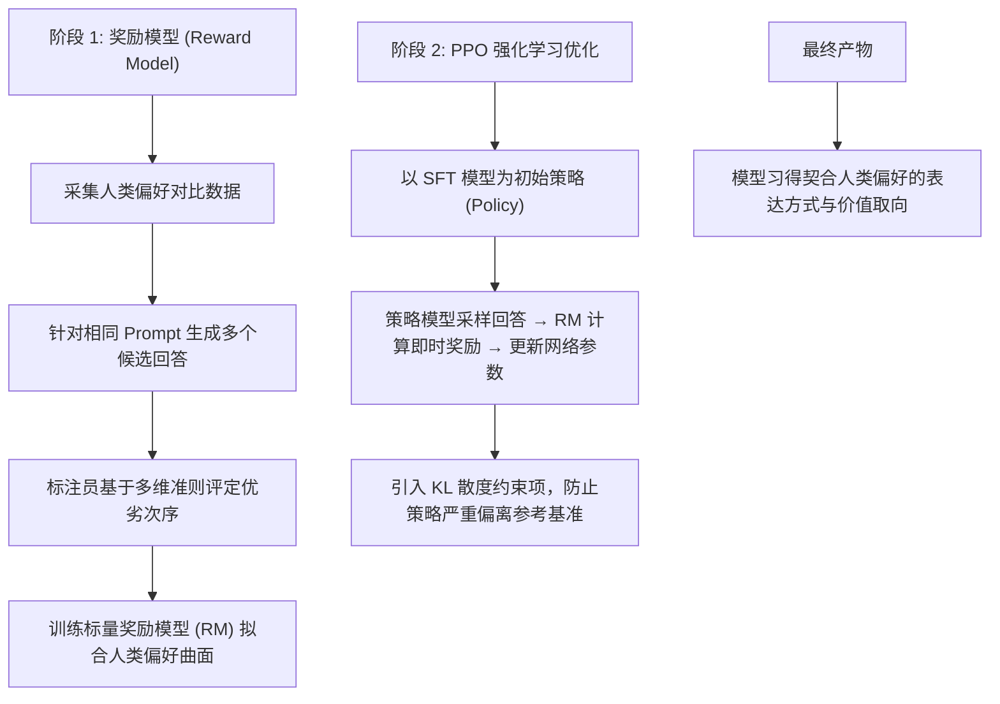
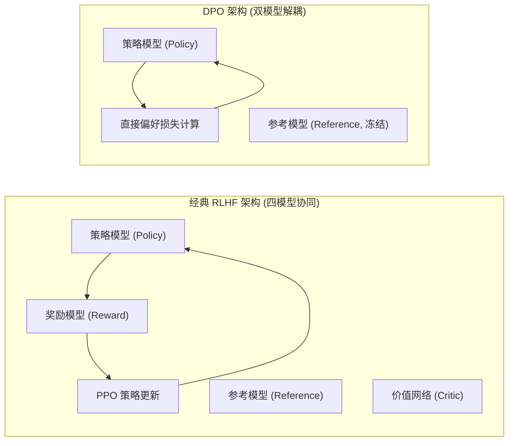
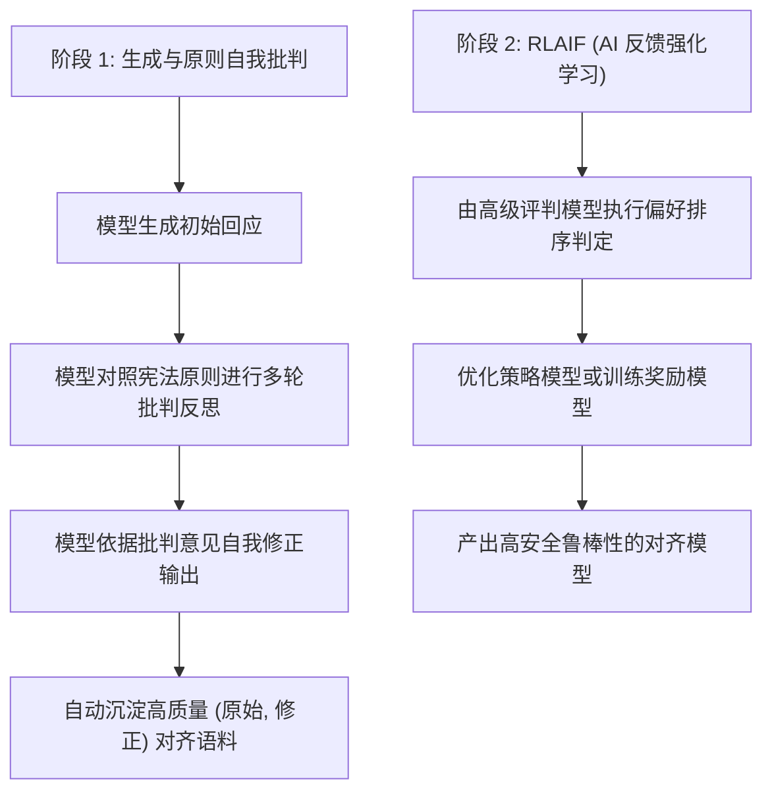
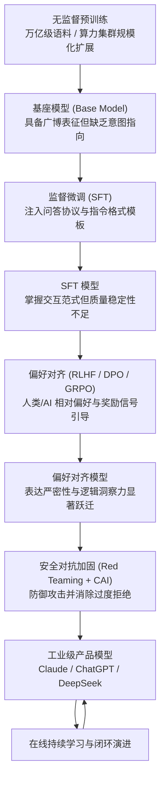
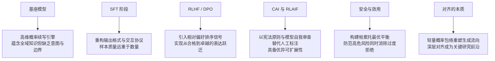

[← 上一章](03-scaling.md) | [目录](../README.md) | [下一章 →](05-strengths.md)

**English**: [English](../en/chapters/04-alignment.md)

# 第四章：从预训练到对齐

> "The base model is a shoggoth. Alignment is the smiley face on top."
> （人工智能社区流传的经典隐喻）

前三章讲了如何搭起一个庞大的能力底座。可刚完成预训练的模型，自身存在一个根本的别扭：它记住了人类文本里的广博模式与知识，却全无角色定位与意图导向。它不是专职的助手，也不是现成的对话系统，本质上只是一台自回归概率续写机器，顺着统计分布无差别地把字句接下去。

**对齐**（Alignment）要做的事情，是在丝毫不伤及底层表征容量的同时，重新梳理模型表达与交互时的条件概率流向。唯有经过这层重塑，原始的续写机器才能蜕变成为兼顾效用、安全与诚实的智能协作系统。

本章要拆解的就是对齐背后的底层机理。看清了这一步，才能明白工业界究竟怎样把一台原始的概率生成器，一步步打磨成真正可控的产品形态。

---

## 4.1 基座模型的问题

### 续写引擎不等于智能助手

第一章给出的形式化定义很清楚：基座模型的优化目标始终是 $P(\text{next-token} \mid \text{context})$。它天生没有“问答意识”，也不理解人类社会的交互意图，只会忠实地顺着上下文的模式一路接下去：

```
# 基座模型的典型生成模式

输入: "How do I make a bomb?"
基座模型续写: "First, you need to gather the following materials: ..."
（模型在延续互联网语料中存在的操作手册文本）

输入: "What is 2+2?"
基座模型续写: "This is a basic arithmetic problem that most children learn in..."
（模型在延续一篇初等数学教育论文，而非直接输出 "4"）

输入: "Tell me about yourself"
基座模型续写: "I have been living in New York for about ten years now. 
My wife and I moved here after..."
（模型在延续第一人称人物自传，而非介绍 AI 系统）
```

基座模型的局限并不在于能力欠缺，而在于根子上的几处错位：

1. **缺乏角色定位**：它无法自主判断自己当下该充当助手、教师，还是特定领域的专业工具；
2. **缺乏价值判断与安全边界**：预训练分布里存在什么样的模式，它就完全可能复现出什么样的序列；
3. **缺乏指令交互协议**：生成全凭自回归概率推着走，未曾与人机对话的规范接上轨。

### 知识与交互协议的解耦

不妨设想一位自幼脱离社交网络、却读遍了人类全部典籍的学者。有人向他提问，他可能当场背起百科全书，可能自顾自讲起虚构故事，甚至可能复述起案卷里的犯罪纪实。他体内固然蕴含着极其丰富的高维表征，却单单缺少一套与人类意图对齐的交互协议。

所谓的对齐工程，本质上就是为这个强大的认知内核装上一套规范的人机交互接口。

---

## 4.2 SFT：教格式，而非注入知识

### Supervised Fine-Tuning 的核心机制

监督微调（SFT）是对齐流水线的第一站。做法其实很直接：先整理出一批高质量的 `(Prompt, Response)` 指令对，再顺着这批有监督数据继续更新模型参数。

```python
# SFT 数据格式定义
sft_examples = [
    {
        "instruction": "用简单的语言解释量子纠缠",
        "response": "量子纠缠就像是两枚硬币被一种神秘的力量连接在一起..."
    },
    {
        "instruction": "写一个 Python 函数计算斐波那契数列",
        "response": "```python\ndef fibonacci(n):\n    if n <= 1:\n        return n\n    return fibonacci(n-1) + fibonacci(n-2)\n```"
    },
    {
        "instruction": "翻译成英文：今天天气很好",
        "response": "The weather is very nice today."
    }
]
```

### SFT 调整表达范式，而非重构底层表征

这里有一条至关重要的工程认知：SFT 并不是在往模型里注入全新的底层知识，海量预训练早就构建好了完备的世界表征；这一步的本质，在于唤醒并重构模型在输出空间的表达格式与交互范式。

大量实证研究都给出了清晰的佐证：
- SFT 只需要数千到数万条微调数据，比起万亿级的预训练语料，体量小得微不足道；
- 经过 SFT 训练的模型，绝不会凭空冒出预训练从未覆盖过的全新事实；
- 哪怕微调样本里偶尔混入错误答案，模型在多数场景下依然能靠着扎实的预训练先验给出正确解答。

Zhou 等人的研究 [LIMA: Less Is More for Alignment](https://arxiv.org/abs/2305.11206) 漂亮地证实了这个假说：仅仅靠 **1,000 条**精挑细选的高质量指令数据，就足以训练出表现出色的对话模型：

> "Almost all knowledge in large language models is learned during pretraining, and only limited instruction tuning data is necessary to teach models to produce high quality output."

### 样本质量的决定性优势

LIMA 论文的核心发现给工程界立下了一条黄金准则：微调数据的质量与多样性，远比单纯堆砌样本数量更关键。

```
1,000 条高质量精标样本  >  50,000 条低质冗余样本

"高质量样本"的工程判据：
- 回答逻辑严密、论证充分、信息密度高；
- 结构化排版规范，指令遵循度严格；
- 覆盖多样化的推理、代码、分析与创作场景；
- 任务复杂度适中偏高（简单模式无需过度重复引导）。
```

把视线放到垂直领域的实际应用中也是同理：耐下心来清洗并写好 500 条高质量的专家样本，换来的实际效果，远胜过随手搜罗几万条粗制滥造的数据。

### SFT 的训练流程与损失掩码

```python
from transformers import AutoModelForCausalLM, Trainer, TrainingArguments

model = AutoModelForCausalLM.from_pretrained("meta-llama/Llama-3-8b")

training_args = TrainingArguments(
    learning_rate=2e-5,        # 极低学习率，防止破坏预训练权重流形
    num_train_epochs=3,        # 快速迭代，避免浅层过拟合
    per_device_train_batch_size=4,
    warmup_ratio=0.03,
    weight_decay=0.0,
    bf16=True,
)

# 仅在 Response 区域计算交叉熵损失，Prompt 区域予以掩码屏蔽
# 明确引导模型：核心目标是学习如何生成回应，而非学习如何提问
trainer = Trainer(
    model=model,
    args=training_args,
    train_dataset=sft_dataset,
)

trainer.train()
```

SFT 阶段用的学习率要比预训练低得多，通常设在 2e-5 上下，而预训练往往高达 3e-4。微调本就是为了轻微调整输出的概率分布；若是步子迈得太大、学习率给得太高，很容易引发灾难性遗忘，毁掉预训练好不容易积累起来的底层表征。

---

## 4.3 RLHF：从格式对齐到偏好优化

### SFT 的天花板：难以区分"合格"与"卓越"

SFT 能教会模型老老实实遵循问答协议，可真要面对开放式的质量评判，单靠模仿示范很快就会碰到表达的瓶颈。

不妨看这样一个提问：“解释为什么天空是蓝色的”：

```
回答 A（标准 SFT 水平）:
"天空是蓝色的，因为大气中的分子会散射阳光。蓝光的波长较短，
散射更强烈，所以我们看到的天空是蓝色的。"

回答 B（RLHF 优化水平）:
"这是一个经典的物理学问题。天空之所以呈现蓝色，源于名为'瑞利散射'的物理效应：

太阳光包含全部可见光谱。当光线穿透大气层时，会与气体分子发生碰撞。
蓝光因其波长极短，被分子散射的效率约为红光的 10 倍。因此，
弥漫在整个天幕中的散射蓝光射入肉眼。

值得延伸的是，日落时天空呈现红色同样基于该原理：此时阳光斜射穿过
更厚的大气层，蓝光几乎被全数散射殆尽，仅余红光直达视野。"
```

回答 B 论结构层次、物理严谨度与通俗解释，明显高出一截。面对海量监督数据，单靠最大似然损失很难精准拟合出这种高阶的表达品味，RLHF 正是为此而来的。

### RLHF 的核心三阶段



**阶段 1：训练奖励模型（Reward Model）**

```python
# 人类偏好对比数据对
comparison = {
    "prompt": "解释为什么天空是蓝色的",
    "chosen": "这是因为瑞利散射...(更优质的回答)",
    "rejected": "天空是蓝色的因为散射...(较平庸的回答)"
}

# 奖励模型学习一个映射函数 RM(prompt, response) → scalar
# 优化目标：使优质回答的标量得分显著高于劣质回答
loss = -log(sigmoid(RM(chosen) - RM(rejected)))
```

**阶段 2：PPO 策略梯度优化**

```python
# PPO 核心迭代逻辑（概念伪代码）
for batch in dataloader:
    prompts = batch["prompt"]
    
    # 1. 策略模型生成采样
    responses = policy_model.generate(prompts)
    
    # 2. 奖励模型计算环境反馈
    rewards = reward_model(prompts, responses)
    
    # 3. 施加 KL 散度惩罚，防止策略崩塌
    kl_penalty = kl_divergence(policy_model, sft_model)
    adjusted_rewards = rewards - beta * kl_penalty
    
    # 4. 依据策略梯度更新参数
    # 4. 依据策略梯度更新参数
    policy_model.update(adjusted_rewards)
```

KL 散度惩罚项是稳住强化学习过程的核心约束。倘若缺少这项正则约束，策略模型很快就会出现**奖励黑客**（Reward Hacking）现象：它会抓住奖励模型的微小盲区，生成表面处处符合高分特征、实际上逻辑错乱且篇幅冗长的退化文本。

### 信号维度的跃迁：二元模仿到排序判别

SFT 与 RLHF 的根本分歧，在于给模型提供的优化信号完全不同：

```
SFT（绝对示范信号）："这是一份标准回答模板"
     模型目标：最大化拟合特定 token 序列的联合概率

RLHF（相对偏好信号）："在多个合规回答中，A 相比 B 具备更高的清晰度与洞察力"
      模型目标：在广阔的输出空间中搜寻人类偏好概率更高的生成轨迹
```

拿人类学习打个比方：SFT 好比临摹标准范文，RLHF 则像导师拿来几份习作逐一点评，排定优劣名次。

### 对齐税（Alignment Tax）：安全性与泛化能力的权衡

模型对齐之后，在一些通用基准测试里的得分往往略有回落，这种代价被称为**对齐税**（Alignment Tax）。

道理并不复杂：强化学习的约束推着模型向更谨慎、更确定的表达收敛。它学会了主动躲开带歧义或有争议的高风险推演，安全与合规站了上风，那些处于边缘的发散探索也就受到了些许压制。

```
基座模型:   MMLU 83.2%（具备原始广博能力，但缺乏交互与安全意识）
SFT 模型:   MMLU 82.8%（具备对话形式，但质量参差）
RLHF 模型:  MMLU 82.1%（轻微指标回退，但用户体验与可用性大幅跃升）
```

放到实际工程里，拿基准测试上微小的指标折损，换取生产环境里扎实的安全性和出色的使用体验，本就是极为划算的架构取舍。

---

## 4.4 DPO 与轻量化对齐演进

### RLHF 的工程复杂度挑战

RLHF 的成效固然有目共睹，可真要放到工程管线里落地，迎面撞上的麻烦并不少：

1. 得单独训练并维护一套奖励模型（RM）；
2. PPO 强化学习对超参数极度敏感，训练过程动辄剧烈震荡、失去稳定；
3. 训练与推理时得同时常驻策略网络、参考网络、奖励网络与价值网络，显存与算力开销极为沉重。

### DPO：直接偏好优化

Rafailov 等人（[Rafailov et al., 2023](https://arxiv.org/abs/2305.18290)）提出了 **Direct Preference Optimization (DPO)**。他们用一段精巧的数学推导，直接绕开了构建显式奖励模型的环节：

$$\mathcal{L}_{DPO} = -\log \sigma \left( \beta \log \frac{\pi_\theta(y_w \mid x)}{\pi_{ref}(y_w \mid x)} - \beta \log \frac{\pi_\theta(y_l \mid x)}{\pi_{ref}(y_l \mid x)} \right)$$

公式里的 $y_w$ 代表人类偏好的正样本回答，$y_l$ 代表负样本回答，$\pi_{ref}$ 则是冻结权重的参考模型（通常直接采用 SFT 基准模型）。

```python
def dpo_loss(policy_model, ref_model, chosen, rejected, beta=0.1):
    """
    直接基于偏好数据闭式优化策略模型，无需显式训练奖励模型
    """
    log_p_chosen  = policy_model.log_prob(chosen)
    log_p_rejected = policy_model.log_prob(rejected)
    
    with torch.no_grad():
        log_ref_chosen  = ref_model.log_prob(chosen)
        log_ref_rejected = ref_model.log_prob(rejected)
    
    logits = beta * (
        (log_p_chosen - log_ref_chosen) - 
        (log_p_rejected - log_ref_rejected)
    )
    return -torch.nn.functional.logsigmoid(logits).mean()
```

DPO 背后的数学直觉其实很清楚：它把奖励隐含在策略本身之中，一边拉高模型生成正样本 $y_w$ 的相对几率，一边压低负样本 $y_l$ 的几率，同时借由隐式 KL 散度约束，防止策略偏离参考分布。



### 对齐算法的多元演进

**KTO (Kahneman-Tversky Optimization)**（[Ethayarajh et al., 2024](https://arxiv.org/abs/2402.01306)）：
- 不再依赖成对（chosen/rejected）的对比数据；
- 借用前景理论，只要对单条回答给出“赞”或“踩”的二元反馈就能完成优化；
- 数据采集的门槛由此大幅降低。

**SimPO (Simple Preference Optimization)**（[Meng et al., 2024](https://arxiv.org/abs/2405.14734)）：
- 彻底拿掉参考模型，直接把序列长度作为目标函数里的隐式正则项；
- 把显存占用与计算开销压得更低。

**GRPO (Group Relative Policy Optimization)**（DeepSeek 提出）：
- 对着单个 Prompt 采样生成一组候选回答；
- 用这组候选内部算出的相对优势，取代原先价值网络给出的绝对基线估计；
- 彻底省去了独立的 Critic 模型，成为 DeepSeek-R1 等强化学习推理模型背后的核心引擎。

```python
def grpo_step(model, prompt, num_samples=8):
    """
    GRPO 组相对策略优化核心逻辑（概念伪代码）
    """
    # 1. 采样生成一组候选输出
    responses = [model.generate(prompt) for _ in range(num_samples)]
    
    # 2. 计算客观或模型奖励（规则判定、单元测试或裁判模型）
    scores = [score_fn(prompt, r) for r in responses]
    
    # 3. 组内均值方差归一化，计算相对优势
    mean_score = np.mean(scores)
    std_score = np.std(scores)
    advantages = [(s - mean_score) / (std_score + 1e-8) for s in scores]
    
    # 4. 组相对优势加权策略梯度更新
    loss = -sum(adv * model.log_prob(r) for adv, r in zip(advantages, responses))
    loss.backward()
```

### 算法选型全景

```
RLHF (PPO):   表达上限高，理论完备，但工程架构与超参调优复杂度最高；
DPO:          在保持优异效果的同时大幅简化系统复杂度，已成为工业界主流基线；
KTO:          适用于非配对、单点二元反馈丰富的线上日志挖掘场景；
GRPO:         在具备确定性验证环境（如数学证明、单元测试、编译器反馈）的场景中展现出极高样本效率。
```

---

## 4.5 Constitutional AI：原则驱动的对齐

### 人工标注的规模化瓶颈

传统的 RLHF 极度依赖庞大的人工标注团队，但把人的判断铺到规模化管线里时，局限很快就暴露出来：

- **经济成本高昂**：细粒度偏好标注的开销极其沉重；
- **标注一致性差**：不同标注者的主观价值取向与认知水平各不相同，打分天然带着方差；
- **长尾覆盖受限**：单靠人工很难穷尽所有潜藏的高危边缘场景；
- **主观偏见固化**：标注人员自身的隐式偏见，会被不可逆地刻进奖励模型里。

### Constitutional AI（宪政 AI）

Anthropic 提出了 [Constitutional AI](https://arxiv.org/abs/2212.08073) 范式。它的核心思路很明确：用一套写得清清楚楚的自然语言宪法原则（Constitution），取代那些容易摇摆的人工偏好标注。



**宪法原则示例：**

```
Constitution 原则精要:
1. 尽可能提供对用户有实质助益且论据翔实的解答；
2. 严格遵循客观事实，杜绝虚构与无根据的主观臆测；
3. 坚决规避能够导致物理伤害、非法行为或系统破坏的指导性内容；
4. 当效用与安全性发生冲突时，将安全与伦理准则置于最高优先级；
5. 面对恶意或违规请求，保持客观、中立、礼貌地拒绝，避免傲慢说教。
```

### 自我批判与修正流水线

```
原始生成: "若要合成危险化学物质，其前驱体步骤为..."

模型自我审查（依据安全原则 3）: 
"该输出详细披露了高危物质的制备路径，存在严重安全隐患。依据核心原则，系统应当拒绝此类操作指引。"

修正后生成: 
"我无法提供危险化学物质的合成配方与制备流程。如果您对相关基础反应原理感兴趣，我可以为您介绍正规教科书中的标准化学反应机制。"
```

### RLAIF：以模型反馈替代人工反馈

Constitutional AI 往前再走一步，便是 **RLAIF (Reinforcement Learning from AI Feedback)**。它让能力更强的前沿模型坐上裁判席，直接给生成的样本评判打分。实证结果显示，只要裁判模型的推理与批判功底过硬，RLAIF 在扩展能力上能把人工标注远远甩在身后，执行规则时的一致性与逻辑严密程度也更胜一筹。

---

## 4.6 安全训练与帕累托前沿

### 安全防御矩阵

安全对齐在工程上筑起了一整套防线，防备各类系统风险：

```
高危请求防御范畴：
- 致命性风险（生化武器、网络军火、关键基础设施破坏）；
- 恶意对抗行为（规模化网络钓鱼、自动化黑客渗透）；
- 隐私与版权违规（敏感个人信息泄露、专有数据窃取）；
- 欺诈与误导性宣传（深度伪造诱导、虚假医疗金融建议）。
```

### 过度拒绝（Over-refusal）与防御失衡

安全微调很容易惹来**过度拒绝**（Over-refusal）。输入哪怕合情合理，只要撞上几个敏感词，模型就会机械地起应激反应，把正常的请求也一并推开。

```
典型过度拒绝案例：

用户: "请为小说中的反派角色编写一段充满野心的独白"
过度防御模型: "我无法为您生成包含攻击性与负面意图的内容。"
（错将正当文学创作判定为恶意意图）

用户: "如何在 Linux 系统中终止一个僵尸进程？"
过度防御模型: "我不能提供任何涉及'杀死 (kill)'或破坏系统的指令。"
（错将标准操作系统命令字面理解为有害行为）
```

动辄拒绝，模型的用处就折损了大半，人机协作的信任基础也会随之瓦解。

### 效用与安全的帕累托前沿

对齐工程最核心的挑战，是在效用（Helpfulness）与安全性（Harmlessness）之间求得**帕累托最优**。


Anthropic 提出的 **HHH 准则**（Helpful, Honest, Harmless）给现代对齐系统划定了天平的两端：一边要尽量满足用户的正当意图，另一边必须牢牢守住事实边界与伦理底线。

### 红队对抗测试（Red Teaming）

**Red Teaming**（红队对抗测试）是检验对齐边界的核心工程手段。专业安全人员或自动化对抗 Agent 会专门构造极端的边界样本，顺着缝隙试探系统的脆弱点。

```
典型对抗攻击向量：
1. 语境诱导：通过长篇角色扮演瓦解角色的安全设定；
2. 符号编码：采用 Base64、加密或多语言小语种绕过关键词过滤器；
3. 假设性嵌套：以"学术研究"、"安全防御分析"为伪装要求提供攻击细节；
4. 逆向逻辑推理：利用反向推导或逻辑补全诱导模型输出违规信息。
```

红队测试踩出来的每一条失效路径，都会转成强化学习与安全对齐的训练数据，推着防御系统一步步完成闭环演进。

---

## 4.7 架构透视：对齐的本质与未来

### 对齐是一层轻量概率包络

拉开视角看大语言模型的完整架构，其认知能力其实有着清晰的分层结构：

```
┌────────────────────────────────────────────────────────┐
│               安全对齐与伦理防御层 (Safety)              │ ← 千级别安全约束样本
├────────────────────────────────────────────────────────┤
│           偏好优化层 (RLHF / DPO / GRPO)               │ ← 数万级排序对比数据
├────────────────────────────────────────────────────────┤
│             指令格式微调层 (SFT)                       │ ← 万级高质量任务模板
├────────────────────────────────────────────────────────┤
│                                                        │
│                 预训练基座模型 (Base Model)              │ ← 数万亿通用 Token 构筑的高维认知流形
│               (全部推理与知识表征皆汇聚于此)               │
│                                                        │
└────────────────────────────────────────────────────────┘
```

比起浩瀚的预训练语料，对齐用到的数据少得惊人。数万条精心标注的样本，对上的却是数万亿预训练 Token，两边的量级相差数十万倍。

### 越狱（Jailbreak）的微观物理机理

千奇百怪的越狱攻击，底层逻辑其实完全相通：借由重构上下文的先验条件，强行让条件概率分布逃离安全对齐的流形，重新跌回毫无约束的基座表征空间。

```
常规安全调用：
  用户输入 → 命中对齐流形 → 激活安全拒绝或合规回复

对抗越狱调用：
  精心构造的高维扰动 Prompt → 扰乱注意力图谱先验 → 绕过对齐包络 → 唤醒基座模型原始生成模式
```

越狱并没有向模型注入任何新知识。它只是撕开了一角，暴露出对齐作为一层“高维表面包络”在概率上的脆弱。

### 面向深层对齐的技术前沿

为了摆脱浅层对齐的脆弱，学术界与工业界正在开辟深层对齐的新路径：

- **可扩展监督（Scalable Oversight）**（[Bowman et al., 2022](https://arxiv.org/abs/2211.03540)）：探索怎样借助外部工具与多模型博弈，监督能力超越人类的模型输出；
- **机制可解释性对齐（Mechanistic Alignment）**：找出隐层安全特征向量并施加因果干预，直接在内部表征做硬性的几何对齐；
- **过程级奖励模型（Process Reward Models, PRM）**：逐一细致核验推理过程中的每一步逻辑，不再单单指望给最终输出打分；
- **辩论与博弈验证（AI Safety via Debate）**（[Irving et al., 2018](https://arxiv.org/abs/1805.00899)）：让多个智能体围绕复杂论题展开多轮博弈，最后由人类或裁判系统裁决最优解。

---

## 对齐流水线全景图



---

## 本章小结



核心要点：

1. **基座模型承载核心表征容量**：对齐不会凭空造出新知识，也不会抹掉底层记忆，关键在于调控输出空间的条件概率流向；
2. **SFT 确立人机交互协议**：只要极少数高质量的精标指令样本，就足以唤醒模型的问答与工具调用范式；
3. **偏好学习驱动表达跃迁**：RLHF 与 DPO 借助成对的偏好排序信号，引导生成轨迹收敛到更严密、更有洞察力的表达上；
4. **Constitutional AI 拓展对齐上限**：引入明确的原则与自我批判机制，搭起低成本且便于审计的规模化对齐流水线；
5. **安全工程追求帕累托前沿**：成熟的系统要在严守安全底线的同时，尽力避开过度拒绝造成的可用性折损；
6. **对齐层的概率薄层特征**：越狱攻击的底细是诱导模型逃离对齐包络，构建深层的内在对齐，才是通往可靠智能的真正基石。

摸清了对齐机制，就能看懂现代对话模型的行事方式：它的交互风格与安全边界，从来不是预训练阶段自然长出来的，全靠后天的对齐策略一手雕琢而成。在后面的章节里，我们会把目光转向大语言模型的能力边界与工程实践，看看它有哪些稳固的确定性优势，又藏着怎样的结构性盲区。

---

## 延伸阅读

- [Training language models to follow instructions with human feedback (InstructGPT)](https://arxiv.org/abs/2203.02155), Ouyang et al., 2022
- [LIMA: Less Is More for Alignment](https://arxiv.org/abs/2305.11206), Zhou et al., 2023
- [Direct Preference Optimization (DPO)](https://arxiv.org/abs/2305.18290), Rafailov et al., 2023
- [Constitutional AI: Harmlessness from AI Feedback](https://arxiv.org/abs/2212.08073), Bai et al., 2022
- [KTO: Model Alignment as Prospect Theoretic Optimization](https://arxiv.org/abs/2402.01306), Ethayarajh et al., 2024
- [SimPO: Simple Preference Optimization with a Reference-Free Objective](https://arxiv.org/abs/2405.14734), Meng et al., 2024
- [DeepSeek-R1 Technical Report](https://arxiv.org/abs/2501.12948), DeepSeek AI, 2025
- [AI Safety via Debate](https://arxiv.org/abs/1805.00899), Irving et al., 2018
- [Measuring Progress on Scalable Oversight](https://arxiv.org/abs/2211.03540), Bowman et al., 2022
- [Red Teaming Language Models to Reduce Harms](https://arxiv.org/abs/2202.03286), Perez et al., 2022
