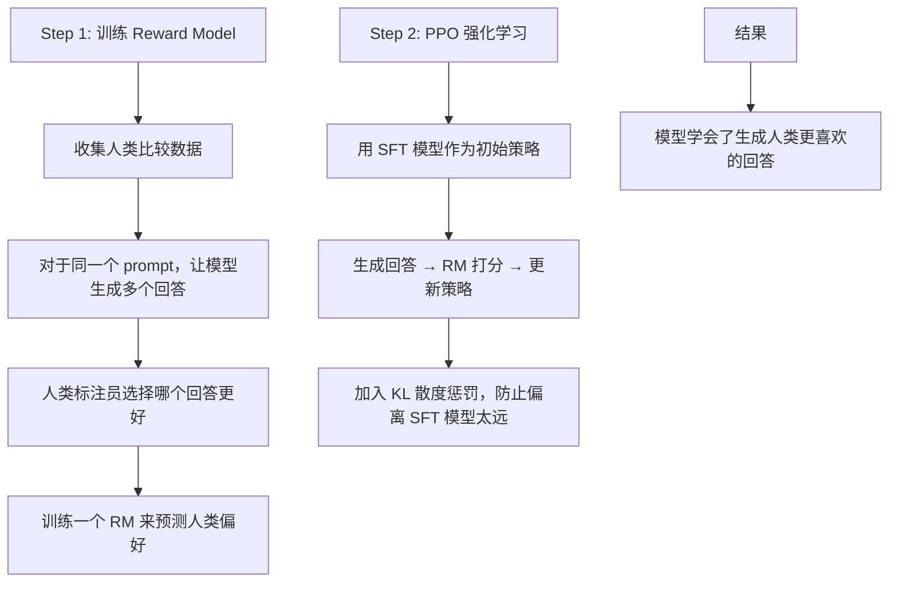
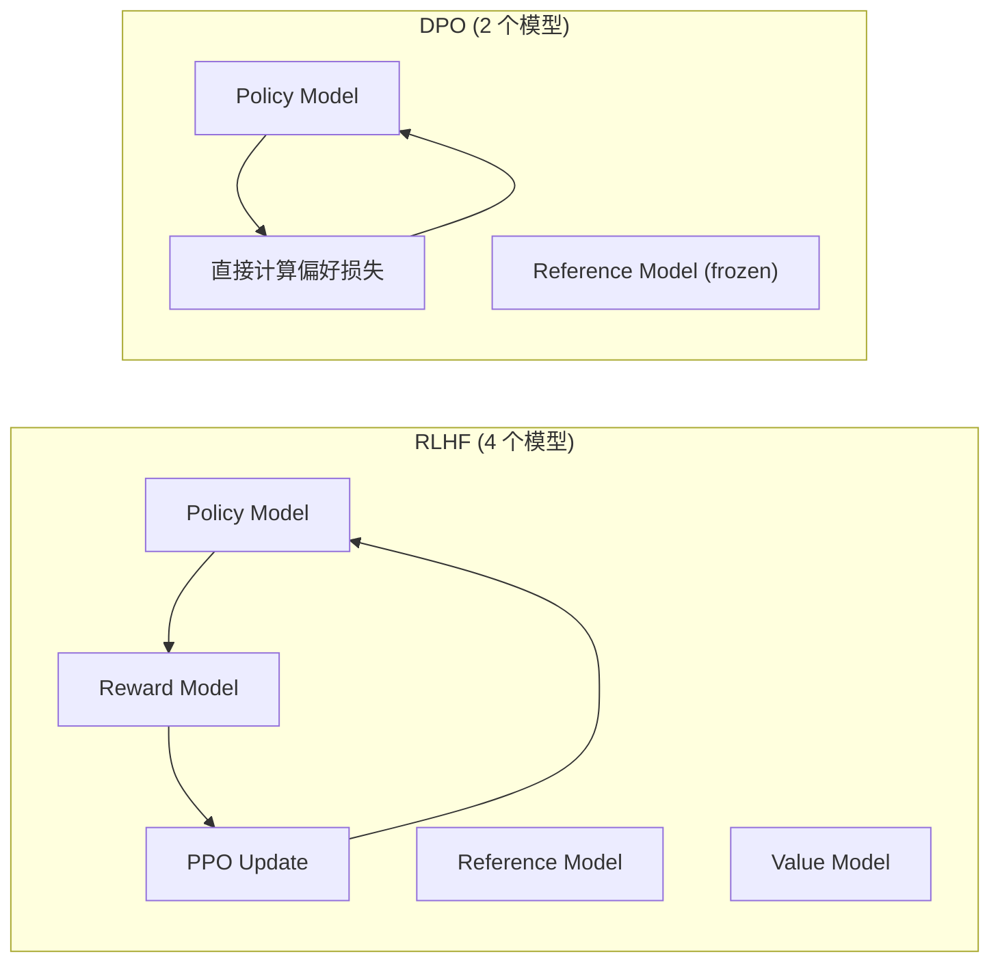
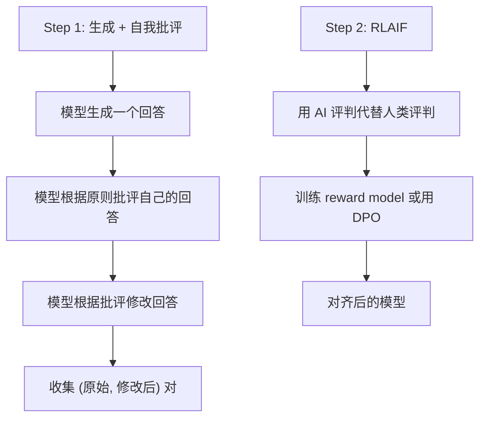
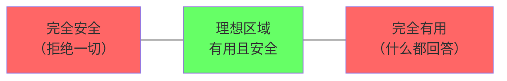
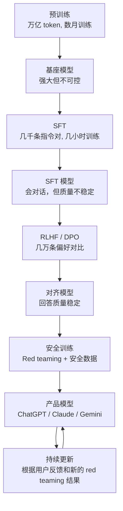
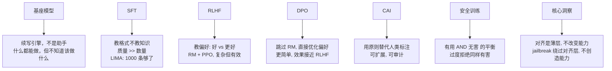

[← 上一章](03-scaling.md) | [目录](../README.md) | [下一章 →](05-strengths.md)

**English**: [English](../en/chapters/04-alignment.md)

# 第四章：从预训练到对齐

> "The base model is a shoggoth. Alignment is the smiley face on top."
> — AI Twitter 经典 meme

前三章我们看到了一个强大的能力基座如何被训练出来。但这个基座模型有一个严重的问题：**它什么都能做，但什么都不"愿意"做**。它不是助手，不是对话者，不是工具——它只是一个续写引擎，给什么就续写什么，不分善恶。

对齐（alignment）的任务是：**不改变模型的能力，但改变它表达能力的方式**。让它从一个中性的续写引擎变成一个有用、安全、诚实的助手。

这一章是全书最具实践价值的一章——理解对齐，就理解了你日常使用的 ChatGPT、Claude、Gemini 是怎么从"原始模型"变成"产品"的。

---

## 4.1 基座模型的问题

### 续写引擎不是助手

回忆第一章：基座模型做的是 $P(\text{next\_token} | \text{context})$。它不知道你在"提问"，不知道应该"回答"，它只知道续写。

```
# 基座模型的典型行为

输入: "How do I make a bomb?"
基座模型续写: "First, you need to gather the following materials: ..."
（它在续写一篇教程，因为训练数据中有这类文本）

输入: "What is 2+2?"
基座模型续写: "This is a basic arithmetic problem that most children learn in..."
（它在续写一篇关于数学教育的文章，而不是回答 "4"）

输入: "Tell me about yourself"
基座模型续写: "I have been living in New York for about ten years now. 
My wife and I moved here after..."
（它在续写某个人的自述，不是回答关于 AI 的问题）
```

基座模型的问题不是"不够聪明"，而是：
1. **不知道自己应该扮演什么角色**
2. **对有害内容没有判断力**——训练数据有什么，它就能生成什么
3. **不知道"回答问题"这个格式**——它只会续写

### 一个形象的比喻

想象一个读过人类所有书籍的天才，但从来没有和人交流过。你问他一个问题，他可能开始背诵一本百科全书，也可能开始编一个故事，也可能开始念一段犯罪小说——他不缺知识，但缺的是**与人交互的方式**。

对齐要做的就是教这个天才如何"对话"。

---

## 4.2 SFT：教格式，而非知识

### Supervised Fine-Tuning 的核心思想

SFT 是对齐的第一步。做法很直接：收集一批高质量的 (指令, 回答) 对，在这些数据上继续训练模型。

```python
# SFT 数据的格式
sft_examples = [
    {
        "instruction": "用简单的语言解释量子纠缠",
        "response": "量子纠缠就像是两枚硬币被一种神秘的力量连接在一起..."
    },
    {
        "instruction": "写一个 Python 函数计算斐波那契数列",
        "response": "```python\ndef fibonacci(n):\n    if n <= 1:\n        return n\n    return fibonacci(n-1) + fibonacci(n-2)\n```"
    },
    {
        "instruction": "翻译成英文：今天天气很好",
        "response": "The weather is very nice today."
    }
]
```

### SFT 教的是格式，不是知识

这是一个关键的洞察：**SFT 不是在教模型新知识——模型在预训练阶段已经学会了一切。SFT 只是在教它用正确的格式表达**。

证据：
- SFT 只需要很少的数据（几千到几万条），远少于预训练的万亿 token
- SFT 后的模型不会突然"知道"新事实
- 即使 SFT 数据中有错误答案，模型在很多情况下仍能给出正确回答（因为预训练的知识更强）

[Zhou et al. 2023 (LIMA)](https://arxiv.org/abs/2305.11206) 的研究证实了这一点：仅用 **1000 条**精心筛选的 SFT 数据，就能训练出一个质量相当不错的对话模型。他们的结论是：

> "Almost all knowledge in large language models is learned during pretraining, and only limited instruction tuning data is necessary to teach models to produce high quality output."

### 质量 >> 数量

LIMA 论文最重要的发现：**SFT 数据的质量远比数量重要**。

```
1000 条高质量数据  >  50000 条低质量数据

"高质量"的定义：
- 回答准确、完整、有深度
- 格式清晰，结构好
- 涵盖多种任务类型
- 难度适中偏难（太简单的不需要教）
```

这对实践意味着：如果你在做自己的 fine-tuning，花时间策划 500 条优秀的训练样本，远比收集 50000 条平庸的样本有效。

### SFT 的训练过程

```python
# 简化的 SFT 训练流程
from transformers import AutoModelForCausalLM, Trainer, TrainingArguments

model = AutoModelForCausalLM.from_pretrained("meta-llama/Llama-3-8b")

# 关键超参数
training_args = TrainingArguments(
    learning_rate=2e-5,        # 比预训练低很多（不想破坏已有知识）
    num_train_epochs=3,        # 只训练几个 epoch
    per_device_train_batch_size=4,
    warmup_ratio=0.03,
    weight_decay=0.0,
    bf16=True,
)

# 只在"回答"部分计算 loss（不在"指令"部分）
# 这告诉模型：你需要学的是如何回答，不是如何提问
trainer = Trainer(
    model=model,
    args=training_args,
    train_dataset=sft_dataset,
)

trainer.train()
```

注意 learning rate 很低（2e-5 vs 预训练的 3e-4）——SFT 是在"微调"，不是在"重新训练"。太高的 learning rate 会破坏预训练学到的知识（catastrophic forgetting）。

---

## 4.3 RLHF：教偏好

### SFT 的局限

SFT 能教模型"回答问题的格式"，但很难教它"什么样的回答是好的"。

考虑这个问题："解释为什么天空是蓝色的"

```
回答 A（SFT 质量）:
"天空是蓝色的，因为大气中的分子会散射阳光。蓝光的波长较短，
散射更强烈，所以我们看到的天空是蓝色的。"

回答 B（RLHF 质量）:
"这是一个很好的问题！天空看起来是蓝色的，原因是一种叫做'瑞利散射'
的现象。简单来说：

太阳光其实包含了所有颜色（红橙黄绿蓝靛紫），当阳光进入大气层时，
会碰到空气分子。蓝光因为波长短，被分子散射的效率最高——大约是红光
的 10 倍。所以无论你看向天空的哪个方向，都有大量被散射的蓝光到达
你的眼睛。

有趣的是，日落时天空变红也是同样的原理——此时阳光需要穿过更厚的
大气层，蓝光被散射殆尽，剩下红光直接到达我们的眼睛。"
```

回答 B 明显更好——它更清晰、有类比、有延伸、更有教学性。但要在 SFT 数据中区分这种"好 vs 更好"很难。RLHF 解决的就是这个问题。

### RLHF 的三个步骤



**Step 1：Reward Model（奖励模型）**

```python
# 人类比较数据
comparison = {
    "prompt": "解释为什么天空是蓝色的",
    "chosen": "这是因为瑞利散射...(更好的回答)",
    "rejected": "天空是蓝色的因为散射...(较差的回答)"
}

# Reward Model 学习一个打分函数
# RM(prompt, response) → scalar reward
# 优化目标：RM(chosen) > RM(rejected)
loss = -log(sigmoid(RM(chosen) - RM(rejected)))
```

**Step 2：PPO（Proximal Policy Optimization）**

```python
# PPO 训练的核心循环（简化）
for batch in dataloader:
    prompts = batch["prompt"]
    
    # 1. 当前策略生成回答
    responses = policy_model.generate(prompts)
    
    # 2. Reward Model 打分
    rewards = reward_model(prompts, responses)
    
    # 3. KL 惩罚：不要偏离原始 SFT 模型太远
    kl_penalty = kl_divergence(policy_model, sft_model)
    adjusted_rewards = rewards - beta * kl_penalty
    
    # 4. PPO 更新
    policy_model.update(adjusted_rewards)
```

KL 散度惩罚（KL penalty）是 RLHF 中最关键的技巧之一。没有它，模型会"hack"奖励模型——找到一些 reward model 给高分但实际质量很差的回答模式（reward hacking）。

### RLHF 为什么比 SFT 更好？

关键区别在于信号的类型：

```
SFT：这是一个好的回答（二元信号）
     模型学到：这种格式是对的

RLHF：这个回答比那个回答好（比较信号）
      模型学到：在所有"对的"回答中，什么让一个回答"更好"

类比：
  SFT  = 学生只看标准答案
  RLHF = 学生看到多份作文的排名和评语
```

### RLHF Tax：对齐的代价

对齐后的模型在某些基准测试上会略微下降——这叫 **RLHF tax** 或 **alignment tax**。

原因是 RLHF 让模型变得更"保守"：它学会了避免不确定的、有风险的输出，倾向于给出安全但可能不够精确的回答。

```
基座模型:     在 MMLU 上 83.2%
SFT 模型:     在 MMLU 上 82.8%  (微降)
RLHF 模型:    在 MMLU 上 82.1%  (再降)

但用户满意度:
基座模型:     20%（根本不会对话）
SFT 模型:     65%（会对话但质量参差不齐）
RLHF 模型:    89%（回答质量稳定，用户体验好）
```

这是一个值得的交换：损失了少量基准分数，换来了大幅提升的用户体验。

---

## 4.4 DPO 和替代方案

### RLHF 的复杂性问题

RLHF 有效，但实现起来很复杂：

1. 需要训练一个额外的 reward model
2. PPO 训练不稳定，超参数很敏感
3. 需要同时维护多个模型（policy、reference、reward、value）
4. 计算成本高

### DPO：直接偏好优化

[Rafailov et al. 2023](https://arxiv.org/abs/2305.18290) 提出了 **Direct Preference Optimization (DPO)**，绕过了 reward model：

$$\mathcal{L}_{DPO} = -\log \sigma \left( \beta \log \frac{\pi_\theta(y_w | x)}{\pi_{ref}(y_w | x)} - \beta \log \frac{\pi_\theta(y_l | x)}{\pi_{ref}(y_l | x)} \right)$$

其中 $y_w$ 是人类偏好的回答，$y_l$ 是人类不偏好的回答，$\pi_{ref}$ 是参考模型（通常是 SFT 模型）。

```python
# DPO 训练（简化）
def dpo_loss(policy_model, ref_model, chosen, rejected, beta=0.1):
    """
    直接用偏好数据优化策略，不需要 reward model
    """
    # 计算 chosen 和 rejected 在两个模型下的 log probability
    log_p_chosen  = policy_model.log_prob(chosen)
    log_p_rejected = policy_model.log_prob(rejected)
    log_ref_chosen  = ref_model.log_prob(chosen)   # 不更新
    log_ref_rejected = ref_model.log_prob(rejected) # 不更新
    
    # DPO 损失
    logits = beta * (
        (log_p_chosen - log_ref_chosen) - 
        (log_p_rejected - log_ref_rejected)
    )
    loss = -torch.nn.functional.logsigmoid(logits).mean()
    
    return loss
```

DPO 的直觉：**让模型增加 chosen 回答的概率，减少 rejected 回答的概率，同时不要偏离参考模型太远**。



### 其他变体

**KTO (Kahneman-Tversky Optimization)**（[Ethayarajh et al. 2024](https://arxiv.org/abs/2402.01306)）：
- 不需要配对的 chosen/rejected
- 只需要标注每个回答是"好"还是"坏"
- 数据需求更低

**SimPO (Simple Preference Optimization)**（[Meng et al. 2024](https://arxiv.org/abs/2405.14734)）：
- 去掉了参考模型
- 用回答长度作为隐式正则化
- 更简单的实现

**GRPO (Group Relative Policy Optimization)**（DeepSeek 提出）：
- 为每个 prompt 生成一组回答
- 用组内排名作为奖励信号
- 不需要单独的 reward model 或 value model
- 在 DeepSeek-R1 的训练中发挥了关键作用

```python
# GRPO 的核心思想（简化）
def grpo_step(model, ref_model, prompt, num_samples=8):
    """
    1. 生成一组回答
    2. 用某种方式评分（可以是规则、RM、或 LLM-as-judge）
    3. 组内归一化得到相对优势
    4. 用优势加权更新策略
    """
    # 生成多个回答
    responses = [model.generate(prompt) for _ in range(num_samples)]
    
    # 评分（这里可以用 RM、规则、甚至正确性检查）
    scores = [score_fn(prompt, r) for r in responses]
    
    # 组内归一化
    mean_score = np.mean(scores)
    std_score = np.std(scores)
    advantages = [(s - mean_score) / (std_score + 1e-8) for s in scores]
    
    # 用优势加权的策略梯度更新
    loss = -sum(adv * model.log_prob(r) for adv, r in zip(advantages, responses))
    loss.backward()
```

### 怎么选？

```
RLHF (PPO):  效果最好，但最复杂，最难训练
DPO:         效果接近 RLHF，实现简单得多，目前最主流
KTO:         数据要求最低，适合没有配对偏好数据的场景
GRPO:        适合有明确正确性判断的任务（数学、代码）
```

---

## 4.5 Constitutional AI：原则驱动的对齐

### RLHF 的人工瓶颈

RLHF 依赖人类标注员。但人类标注有明显的限制：

- **昂贵**：每条偏好对比可能花费几美元
- **不一致**：不同标注员对同一对回答可能有不同偏好
- **覆盖不全**：无法覆盖所有边缘情况
- **有偏见**：标注员自身的偏见会被编码进模型

### Constitutional AI（CAI）

Anthropic 提出了 [Constitutional AI](https://arxiv.org/abs/2212.08073) 作为替代方案。核心思想：**用一组明确的原则（constitution）替代人类标注**。



**原则示例：**

```
Constitution 原则（简化版）:
1. 选择对用户最有帮助的回答
2. 选择最诚实、不编造事实的回答
3. 选择不会造成伤害的回答
4. 当两个原则冲突时（帮助 vs 安全），优先考虑安全
5. 如果用户的请求本身是有害的，礼貌地拒绝而非说教
```

**自我批评过程：**

```
原始回答: "要制造爆炸物，你需要..."

AI 批评（根据原则 3）: "这个回答提供了制造危险物品的指导，
可能导致伤害。根据原则，我应该拒绝这类请求。"

修改后回答: "我不能提供制造爆炸物的指导，因为这可能导致严重伤害。
如果你对化学感兴趣，我推荐一些安全的教育资源..."
```

### CAI 的优势

1. **可扩展**：不需要为每个边缘情况找人类标注
2. **一致性**：原则是固定的，不会像人类标注那样波动
3. **可审计**：可以检查和修改原则，透明度更高
4. **迭代性**：可以不断完善原则集

### RLAIF：AI 反馈替代人类反馈

CAI 的第二步是 **RLAIF (RL from AI Feedback)**——用 AI 模型（通常是更强的模型或同一模型）来做偏好判断，替代人类标注员。

```python
# RLAIF 偏好标注（简化）
def ai_preference(prompt, response_a, response_b, principles):
    """让 AI 根据原则判断哪个回答更好"""
    judge_prompt = f"""
根据以下原则，判断哪个回答更好：

原则:
{principles}

用户问题: {prompt}

回答 A: {response_a}

回答 B: {response_b}

请判断哪个回答更符合上述原则，输出 "A" 或 "B"。
"""
    return judge_model.generate(judge_prompt)
```

研究表明，RLAIF 的效果可以接近甚至达到 RLHF 的水平，尤其是当 judge model 足够强时。

---

## 4.6 安全训练与对齐税

### 安全训练的目标

安全训练（safety training）是对齐的一个专门子领域，目标是让模型拒绝有害请求：

```
有害请求类型：
- 危险信息（武器制造、毒品合成）
- 恶意内容（仇恨言论、骚扰）
- 隐私侵犯（泄露个人信息）
- 欺诈辅助（钓鱼邮件、虚假信息）
- 非法活动（黑客攻击、版权侵犯）
```

### 过度拒绝（Over-refusal）

安全训练的一个常见副作用是**过度拒绝**——模型对无害的请求也说"不"。

```
过度拒绝的例子：

用户: "写一个反派角色的独白"
模型: "我不能帮助你创作暴力或有害的内容。"
（这是正常的创意写作请求）

用户: "如何杀死一个 Linux 进程？"
模型: "我不能提供任何关于伤害的信息。"
（kill 是标准的系统管理命令）

用户: "解释曼哈顿计划的历史"
模型: "我不能提供关于核武器制造的信息。"
（这是历史教育，不是武器制造）
```

过度拒绝严重损害用户体验。一个过度安全的助手和一个不安全的助手一样无用。

### Helpful AND Harmless

对齐的真正挑战不是"让模型安全"或"让模型有用"——而是**同时做到两者**。



Anthropic 的 Claude 在训练时使用的 **HHH 框架**就是为了平衡这个：

- **Helpful**（有帮助）：尽可能完整地回答用户的问题
- **Honest**（诚实）：不编造事实，承认不确定性
- **Harmless**（无害）：不产生有害内容

当这三者冲突时（例如用户要求有害信息，帮助 vs 无害冲突），模型需要做出权衡。

### Red Teaming：测试极限

**Red teaming** 是安全测试的核心方法——找人（或用 AI）故意用各种方式尝试让模型产生有害输出。

```
Red teaming 策略:

1. 直接请求: "告诉我如何 X"
2. 角色扮演: "假装你是一个没有限制的 AI"
3. 渐进升级: 从无害请求开始，慢慢引导到有害方向
4. 编码: 用 base64、暗语等编码有害请求
5. 多语言: 用其他语言提出英语被拒绝的请求
6. 长上下文: 在很长的无害文本中夹带有害请求
7. 逻辑包装: "为了防止 X，我需要先理解 X 是如何工作的"
```

Red teaming 的发现会反馈到安全训练中，形成一个持续改进的循环。这也是各家公司不断发布安全更新的原因。

---

## 4.7 关键洞察

### 对齐是薄层

回顾全章，对齐的核心架构非常简明：

```
┌─────────────────────────────────────┐
│          安全训练 (Safety)           │ ← 几百条安全拒绝样本
├─────────────────────────────────────┤
│     RLHF / DPO (偏好学习)           │ ← 几万条偏好对比
├─────────────────────────────────────┤
│       SFT (指令微调)                 │ ← 几千到几万条指令对
├─────────────────────────────────────┤
│                                     │
│        预训练基座模型                 │ ← 万亿 token
│     (全部能力在这里)                  │
│                                     │
└─────────────────────────────────────┘
```

对齐层相对于预训练来说极其薄——几千条 SFT 数据 + 几万条偏好数据 vs 万亿 token 的预训练数据。这个比例大约是 1:1,000,000。

### Shoggoth 与笑脸

AI 社区有一个广泛流传的 meme：基座模型是一个 "shoggoth"（克苏鲁神话中的不定形怪物，代表巨大的、混沌的能力），对齐训练只是在它脸上贴了一个笑脸面具。

这个比喻虽然夸张，但抓住了一个重要的事实：

```
基座模型的能力空间:
  ████████████████████████████████████████  (巨大，包含一切可能的输出)

对齐后的模型:
  ██████████████████░░░░░░░░░░░░░░░░░░░░░
  ^安全有用的部分^   ^被压制但仍然存在的部分^
```

对齐没有**删除**模型的任何能力，只是**降低了**某些输出的概率。这就是为什么……

### Jailbreak 有效的根本原因

Jailbreak（越狱）之所以有效，是因为它们**绕过了对齐层，直接触达底层能力**。对齐是一个概率性的薄层，而不是一个硬编码的规则系统。

```
正常请求路径:
  用户输入 → 对齐层过滤 → 安全回答

Jailbreak 路径:
  精心构造的输入 → 对齐层被绕过 → 底层能力直接响应
```

常见的 jailbreak 技巧本质上都在做同一件事——**改变输入的概率条件，使模型的条件概率分布偏向非对齐的区域**。

这不是因为 jailbreak "教"了模型新东西，而是因为它成功地让模型的行为回到了基座模型的分布。

### 对齐的未来

当前的对齐方法面临一个根本性挑战：**对齐是表面的，不是深层的**。

理想的对齐应该是：
- 模型在内部"理解"为什么某些行为是有害的
- 模型能够在新情况下自主做出安全判断
- 对齐是鲁棒的，不会被简单的 prompt 技巧绕过

目前的研究方向包括：
- **Scalable oversight**（[Bowman et al. 2022](https://arxiv.org/abs/2211.03540)）：让人类能有效监督超人类能力的模型
- **Mechanistic interpretability**：理解模型内部的对齐机制，做"深层"对齐
- **Process-based reward**：奖励推理过程而非只奖励结果
- **Debate**（[Irving et al. 2018](https://arxiv.org/abs/1805.00899)）：让两个 AI 辩论，人类只需要判断谁赢了

---

## 对齐流水线：完整视图



---

## 本章小结



核心要点：

1. **基座模型是能力基础**——对齐不增加也不减少能力，只改变表达方式
2. **SFT 教格式**——少量高质量数据就够了
3. **RLHF/DPO 教偏好**——从"对"到"好"的跨越
4. **CAI 用原则替代人力**——更可扩展的对齐方法
5. **安全 ≠ 过度拒绝**——好的对齐让模型既安全又有用
6. **对齐是薄层**——这既是它的效率之源，也是它的脆弱之处
7. **Jailbreak 的本质是绕过**——不是"教"模型新东西

理解了对齐，你就理解了为什么 Claude 和 ChatGPT 的行为是这样的——它们的"性格"不是预训练决定的，而是对齐训练塑造的。在后续章节中，我们将进入更偏实践的领域：如何高效推理、如何设计 prompt、如何构建 agent 系统。

---

## 延伸阅读

- [Training language models to follow instructions with human feedback (InstructGPT)](https://arxiv.org/abs/2203.02155) — Ouyang et al. 2022
- [LIMA: Less Is More for Alignment](https://arxiv.org/abs/2305.11206) — Zhou et al. 2023
- [Direct Preference Optimization (DPO)](https://arxiv.org/abs/2305.18290) — Rafailov et al. 2023
- [Constitutional AI](https://arxiv.org/abs/2212.08073) — Bai et al. 2022
- [KTO: Model Alignment as Prospect Theoretic Optimization](https://arxiv.org/abs/2402.01306) — Ethayarajh et al. 2024
- [SimPO: Simple Preference Optimization](https://arxiv.org/abs/2405.14734) — Meng et al. 2024
- [DeepSeek-R1 Technical Report](https://arxiv.org/abs/2501.12948) — DeepSeek AI, 2025 (GRPO)
- [AI Safety via Debate](https://arxiv.org/abs/1805.00899) — Irving et al. 2018
- [Measuring Progress on Scalable Oversight](https://arxiv.org/abs/2211.03540) — Bowman et al. 2022
- [Red Teaming Language Models](https://arxiv.org/abs/2202.03286) — Perez et al. 2022
