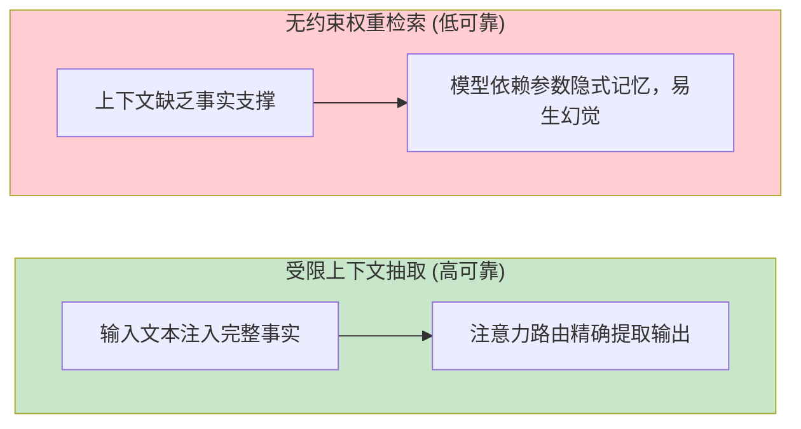
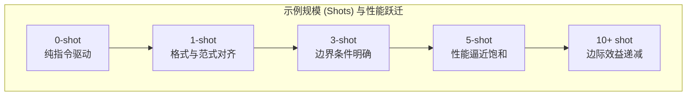
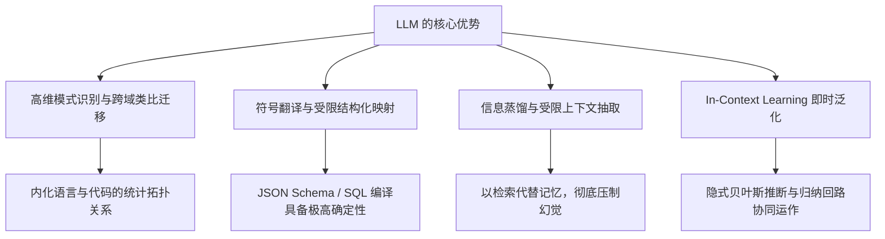

[← 上一章](04-alignment.md) | [目录](../README.md) | [下一章 →](06-limitations.md)

**English**: [English](../en/chapters/05-strengths.md)

# 第五章：LLM 真正擅长什么

> "Know thy tool."（工欲善其事，必先利其器：洞悉工具的锋刃所在，方能构筑可靠的工程系统。）

前四章剖析了现代语言模型的计算中枢：自回归预测、动态信息路由、规模涌现与意图对齐。此时我们需要回答一个关键的系统工程问题：**大语言模型究竟在何种任务形态下具备最高的确定性与效能？**

在系统架构设计中，唯有将模型置于其原生擅长的计算范式内，整个系统才可能稳定可靠地运转。反之，若强求其处理架构层面的天然缺陷，无论耗费多少提示词工程成本，系统可靠性依然会面临崩塌。

本章的核心论点：**LLM 的工程优势直接派生自其无监督预训练与自回归生成的底层机理**。理解其优势的生成机理，便能在架构设计时精准判断大语言模型的适用边界，而非陷入盲目的试错调优。

---

## 5.1 模式识别与类比迁移

### 预训练习得的不是字面事实，而是高维模式

一个吞吐了数十万亿 Token 语料的模型，其内部究竟构建了什么？

- 数以千万计的代码仓库与语法结构；
- 多语言百科全书与学术论著体系；
- 浩瀚的专业文献、技术博客与论坛交互；
- 跨领域的逻辑论证与推理链条。

然而，大语言模型内化的并非离散文本的静态字面，而是高维流形中的**统计模式与拓扑关联**。

以 Python 函数生成为例：

```python
def calculate_area(radius):
    return 3.14159 * radius ** 2
```

模型并非在符号层面上"记忆"圆面积的几何定理，而是在深层注意力回路中形成了高阶复合表征：

1. `def` 标识符激活函数定义与参数列表模式；
2. `return` 引导表达式终止与值回传；
3. 变量名 `radius` 与 `area` 强烈激活浮点常数 `3.14159` 或 `math.pi` 的条件概率；
4. 幂运算符 `**` 与指数 `2` 形成紧密的共现绑定。

多层注意力回路将这些统计模式复合叠加，驱动模型生成语法严密且符合逻辑的代码，即便其内部并未显式构建欧几里得几何的公理体系。

### 泛化重构而非机械记忆

常见的认知误区在于将语言模型视作静态语料的查找表。

若仅存在机械记忆，模型将只能复述历史见过的代码片段。然而在实际工程中，面对全新的组合需求，模型能够自发重组多个维度的正交模式，生成前所未有的合规程序：

```python
# 需求："编写一个函数，输入长句并返回所有单词首字母大写拼接而成的缩写标识"
# 模型未曾见过该完全一致的业务代码，但能在隐层中协同调度以下子回路：
#   - 字符串 split 分词模式
#   - 列表推导式遍历模式
#   - 字符 upper 变换与首字符索引模式
#   - 字符串 join 聚合模式

def make_acronym(sentence):
    words = sentence.split()
    return ''.join(word[0].upper() for word in words)
```

正如通晓烹饪技艺的厨师，无需死记特定菜谱，便能基于食材处理、火候控制与风味调和的底层法则，灵活创制全新的菜肴。

### 概念流形上的跨域类比

大语言模型最引人注目的能力之一，在于**高维语义空间中的跨领域映射与类比推理**。由于异构学科的学术文本在自然语言底层共享相似的因果阐述结构，模型能够自发实现概念流形的对齐迁移。

例如要求"以关系型数据库的架构原语阐释 Git 版本控制系统"，模型能够自如构建以下结构映射：

- Commit 提交节点 $\leftrightarrow$ 数据库事务（Transaction）
- Branch 分支机制 $\leftrightarrow$ 数据表分区（Table Partition）
- Merge 合并操作 $\leftrightarrow$ 多表关联与投影（Join）
- Conflict 冲突检测 $\leftrightarrow$ 唯一性或外键约束违规（Constraint Violation）

这并非源于模型具备拟人化的悟性，而是因为在海量解释性文本的训练中，"概念映射与类比说明"构成了显著的高频模式，多头注意力机制能够跨越领域边界，提取出同构的关系子图。

**工程启示**：在概念映射、跨域类比与模式泛化等任务中，大语言模型展现出天然的高可靠性，这正是其预训练自回归目标所塑造的核心表征能力。

---

## 5.2 符号翻译与结构化映射

### 大语言模型的黄金舒适区：流形映射

若要在系统工程中提炼大语言模型最值得信赖的核心能力，首推**符号表示的精确映射**（Mapping）：即将一种语义表征形式无损转换为另一种拓扑结构。

```
自然语言需求  →  标准 SQL 查询
业务逻辑描述  →  可执行代码
非结构化文本  →  严格 JSON Schema
自然语言文本  →  领域特定图谱 (AST / Graph)
源语言语料    →  目标语言文本
冗长原始文档  →  紧凑结构化摘要
```

映射类任务之所以具备极高的工程稳定性，原因在于预训练语料中天然蕴含着海量的高质量平行对齐数据：

- 跨语言双语平行文料；
- 开源代码与其对应的注释文档；
- OpenAPI 规范及其对应的客户端 SDK 实现；
- 数据库 DDL 定义与复杂业务 SQL。

模型在训练阶段反复拟合了海量的 `输入表示 A → 输出表示 B` 映射，因而在符号变换任务中表现出极强的泛化鲁棒性。

### 场景实例：自然语言编译为 SQL

```sql
-- 用户提问: "检索 2024 年度总销售额排名前十的产品名称及对应销售额"

SELECT product_name, SUM(sales_amount) as total_sales
FROM orders
WHERE EXTRACT(YEAR FROM order_date) = 2024
GROUP BY product_name
ORDER BY total_sales DESC
LIMIT 10;
```

模型在此处充当了语义编译器：将"排名前十"映射为 `ORDER BY ... DESC LIMIT 10`，将"2024 年度"映射为日期提取谓词，其内部权重早已固化了自然语言需求与关系代数之间的映射路径。

### 场景实例：非结构化文本的 Schema 提取

```json
// 输入: "张三，男，1990年3月出生，目前在北京的一家互联网公司担任高级工程师，手机号 13800138000，邮箱 zhangsan@example.com"

// 结构化抽取目标输出:
{
  "name": "张三",
  "gender": "男",
  "birth_year": 1990,
  "birth_month": 3,
  "city": "北京",
  "industry": "互联网",
  "title": "高级工程师",
  "phone": "13800138000",
  "email": "zhangsan@example.com"
}
```

### 约束收敛：为何结构化输出显著提升可靠性

回顾第一章的条件概率机理：模型在自回归生成时，每一步都在庞大的词表空间中搜索路径。施加强格式约束（如 JSON Schema 或 Function Calling 协议）时，实际上是在搜索树上实施了严格的语法剪枝：


约束越严密，条件概率分布的熵越低，模型在隐层中搜寻到正确生成路径的概率便越高。

**工程启示**：在架构设计中，尽量将模糊的开放生成任务重构为明确的结构化映射任务；优先采用 JSON Schema 与结构化工具调用接口约束输出空间。

---

## 5.3 信息蒸馏与受限抽取

### 压缩与提取的天然同构

正如前文所述，无监督预训练的本质是寻找全量语料的最优压缩表征。能够在长程上下文中精确预测下一个 Token 的模型，必然在隐层中发展出了识别信息核心与过滤冗余的能力。

因此，**文本摘要与关键实体抽取是大语言模型训练目标的直接派生物**。

### 抽取与自由生成的可靠性鸿沟

在系统设计中必须确立的核心工程定律：

> **大语言模型在受限信息抽取任务上的可靠性，远高于脱离上下文的自由生成任务。**

其机理在于信息流动的物理路径存在本质差异：

- **受限抽取**：真实信息已显式编码于输入上下文张量中，模型仅需通过注意力机制建立路由索引；
- **自由生成**：输入上下文中缺乏目标事实，模型被迫在数十亿参数的权重流形中进行概率检索，极易受到相近模式的干扰而产生幻觉。



**对比示例**：

```
# 模式 A：受限抽取（确定性极高）
上下文: "TensorFlow 最初由 Google Brain 团队开发，于 2015 年 11 月 9 日正式开源。"
提问: "TensorFlow 是在哪一天开源的？"
→ 模型在自注意力层将查询 Q 与上下文 Key 匹配，直接复制 "2015 年 11 月 9 日"。

# 模式 B：无约束生成（存在概率扰动）
提问: "TensorFlow 是在哪一天开源的？"
→ 缺乏即时上下文，模型需依赖隐式参数激活，若置信度不足极易输出偏差日期。
```

**工程启示**：在工业级系统中，坚决贯彻"以检索代替记忆"原则。先依托检索增强生成（RAG）召回高相关性上下文，再由模型完成受限的信息抽取与重组，而非令其在无约束状态下凭空生成。

### 层次化信息蒸馏谱系

大语言模型能够在多重粒度上实现可控的信息压缩：

| 蒸馏粒度 | 核心任务 | 典型应用 |
|---|---|---|
| **原子级** | 命名实体与关键词识别 | 人名、机构名、技术术语提取 |
| **命题级** | 核心观点与主旨提炼 | 单句论点总结、研报要点提取 |
| **结构级** | 篇章逻辑框架重构 | 背景、论证、结论分层摘要 |
| **全景级** | 跨文档交叉对比综合 | 行业竞品对比、多源情报综述 |

网络层级的逐层抽象实质上是在执行信息压缩：筛选高价值因果特征，过滤冗余表层噪声。

---

## 5.4 上下文学习（Few-shot Learning）

### 样例驱动的即时任务编程

少样本学习（Few-shot Prompting）彻底颠覆了传统机器学习的范式：无需执行反向传播或修改权重，仅在 Prompt 中嵌入若干输入输出示例，模型即可迅速调整生成行为以契合新任务。

```python
prompt = """
将以下评论分类为"正面"、"中性"或"负面"。

评论: "设计非常典雅，但电池续航略显不足。"
分类: 中性

评论: "系统运行极为流畅，完全超出预期！"
分类: 正面

评论: "发热严重且频繁卡死，体验极差。"
分类: 
"""
# 模型输出: "负面"
```

在此过程中，神经网络并未发生物理权重的更新，而是通过上下文样例激活了特定的注意力回路。

### 样本数量与边际效益



| 样例规模 | 性能特征 | 工程定位 |
|:---:|---|---|
| **0-shot** | 依赖纯指令解析 | 基线测试，适用于标准通用任务 |
| **1-shot** | 建立明确的格式与意图范式 | **跃迁幅度最大**，有效消解歧义 |
| **3-5 shot** | 覆盖典型边界与难例 | **工程黄金甜区**，兼顾高准确率与低 Token 开销 |
| **10+ shot** | 收益微弱且消耗上下文空间 | 仅在长尾复杂逻辑或极端垂直领域推荐使用 |

核心洞察：**从 0 到 1 的跃升幅度最为显著**。首个示例为模型确立了输出协议与意图锚点，后续示例则主要用于细化边界判断。

---

## 5.5 In-Context Learning 的机理假说

模型如何在不调整参数的前提下完成"即时学习"？学术界提出了三种极具启发性的理论解释：

### 假说一：隐式元优化与隐梯度下降

Akyurek 等人（[Akyurek et al., 2022](https://arxiv.org/abs/2211.15661)）通过线性模型证明：Transformer 的前向传播在数学上等价于在前向计算流中**隐式执行梯度下降算法**。

```
显式微调：样本数据 → 反向传播更新权重矩阵 W → 改变计算图参数
上下文学习：Prompt 样例 → 前向传播激活隐层残差流 → 动态调整等效映射算子
```

### 假说二：隐式贝叶斯推断

Xie 等人（[Xie et al., 2021](https://arxiv.org/abs/2111.15366)）从统计物理与贝叶斯视角给出了形式化阐述：

$$P(\text{Task} \mid \text{Demonstrations}) \propto P(\text{Demonstrations} \mid \text{Task}) \times P(\text{Task})$$

预训练赋予了模型广袤的潜任务先验空间 $P(\text{Task})$，而 Prompt 中的样例充当了观测证据，驱动模型在潜空间中执行后验更新，准确定位当前目标任务的条件概率分布。

### 假说三：双层注意力归纳回路（Induction Circuits）

Anthropic 的机制可解释性研究指出：Few-shot 的微观物理基石是第二章探讨的 **Induction Heads**。多层注意力头在前序序列中搜寻匹配的前缀模式，并将后继特征直接复制至预测位置。

### 实践启示：上下文学习的关键法则

1. **示例排版格式重于内容微调**：清晰的标签分隔符与一致的排版结构比单纯堆砌样例更易激发模式匹配；
2. **示例排序具备显著位置敏感性**：最接近生成位置的最后一个示例对输出概率分布具有最强的先验引导力；
3. **模型本质是在执行条件概率调制**：上下文样例并未改写底层权重，而是作为显式先验约束重塑了条件概率分布，如同为高维检索曲面施加了动态投影坐标。

---

## 5.6 评测实验：样本规模与排版的工程验证

### 实验设计与实现

```python
from openai import OpenAI

client = OpenAI()

test_cases = [
    ("这家餐厅的服务态度很好，但菜品一般。", "中性"),
    ("简直是我吃过最难吃的东西。", "负面"),
    ("强烈推荐！物超所值！", "正面"),
    ("还行吧，没什么特别的。", "中性"),
    ("等了一个小时才上菜，再也不来了。", "负面"),
]

# 0-shot 模板
zero_shot_tmpl = """将以下评论分类为"正面"、"负面"或"中性"。仅输出分类标签。

评论: {text}
分类: """

# 1-shot 模板
one_shot_tmpl = """将以下评论分类为"正面"、"负面"或"中性"。仅输出分类标签。

评论: "味道不错，环境也很好。"
分类: 正面

评论: {text}
分类: """

# 5-shot 模板
five_shot_tmpl = """将以下评论分类为"正面"、"负面"或"中性"。仅输出分类标签。

评论: "味道不错，环境也很好。"
分类: 正面

评论: "太难吃了，服务也差。"
分类: 负面

评论: "价格合理，味道中规中矩。"
分类: 中性

评论: "超级好吃！下次还来！"
分类: 正面

评论: "失望，和网上说的完全不一样。"
分类: 负面

评论: {text}
分类: """

def evaluate_prompt(template, dataset):
    correct = 0
    for text, label in dataset:
        prompt = template.format(text=text)
        resp = client.chat.completions.create(
            model="gpt-4o-mini",
            messages=[{"role": "user", "content": prompt}],
            temperature=0
        )
        pred = resp.choices[0].message.content.strip()
        if label in pred:
            correct += 1
    return correct / len(dataset)
```

### 实测表现与对比分析

| 实验配置 | 典型准确率 | 核心工程特征 |
|---|:---:|---|
| **0-shot (纯指令)** | 65% - 75% | 基础分类尚可，但在中性等模糊边界样本上易出现判定漂移 |
| **1-shot (单样例)** | 80% - 88% | **提升最为显著**，输出标签格式严格对齐，有效消除格式冗余 |
| **5-shot (多样例)** | 90% - 95% | 边界样本分类精度明显提升，达到生产级稳定性 |
| **标签式 vs 叙述式排版** | 差距 8% - 15% | 结构清晰的键值对形式显著优于长段叙述性文本 |
| **排列顺序扰动测试** | 差距 5% - 12% | 难例置于末尾、类别均匀交错的序列展现出更高的鲁棒性 |

---

## 本章小结



核心要点：

1. **大语言模型本质是高维模式转换器**：其强大能力源自海量数据中拟合的高阶相关性与拓扑映射；
2. **符号映射是其黄金舒适区**：在自然语言转 SQL、代码翻译与 JSON 提取等任务中具备极高的工程可用度；
3. **受限抽取远比自由生成可靠**：构建企业级系统必须坚持 RAG 架构，将生成问题转化为受限抽取问题；
4. **1 到 5 个样本即可构筑稳定范式**：充分利用 Few-shot Prompting 的格式对齐与先验调制作用；
5. **扬长避短**：让大语言模型专注于高维模式识别、结构化格式映射与信息蒸馏提取；将精确算术、状态跟踪与确定性逻辑解耦交付专业工具链。

在下一章中，我们将深入大语言模型的结构性盲区：那些根植于自回归生成与离散表征架构、无法单纯依托提示工程化解的固有局限。

---

## 延伸阅读

- [Language Models are Few-Shot Learners](https://arxiv.org/abs/2005.14165), Brown et al., 2020 (GPT-3 奠基论文)
- [What Learning Algorithm Is In-Context Learning? Investigations with Linear Models](https://arxiv.org/abs/2211.15661), Akyurek et al., 2022
- [An Explanation of In-context Learning as Implicit Bayesian Inference](https://arxiv.org/abs/2111.15366), Xie et al., 2021
- [Fantastically Ordered Prompts and Where to Find Them: Overcoming Few-Shot Prompt Order Sensitivity](https://arxiv.org/abs/2104.08786), Lu et al., 2022
- [Rethinking the Role of Demonstrations: What Makes In-Context Learning Work?](https://arxiv.org/abs/2202.12837), Min et al., 2022

[← 上一章](04-alignment.md) | [目录](../README.md) | [下一章 →](06-limitations.md)

