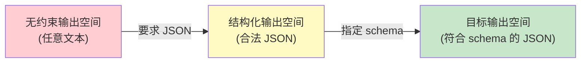
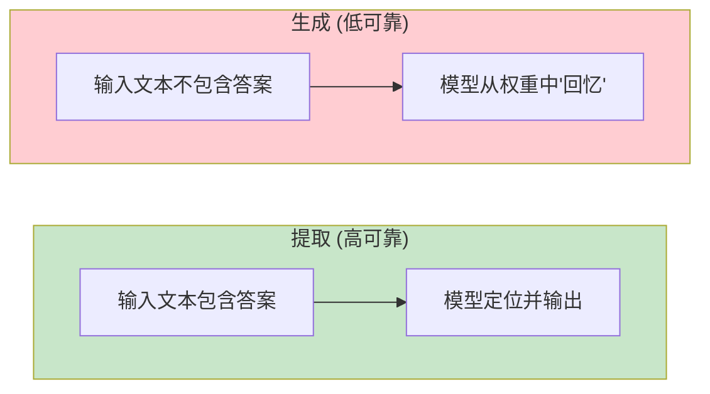
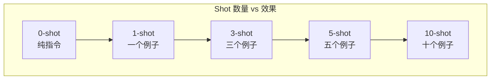
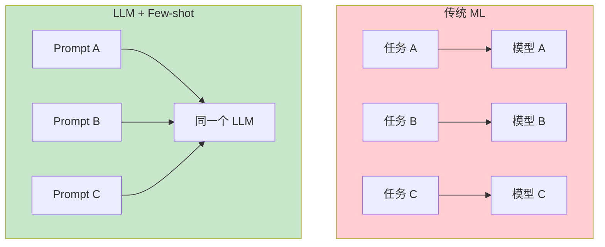

[← 上一章](04-alignment.md) | [目录](../README.md) | [下一章 →](06-limitations.md)

# 第五章：LLM 真正擅长什么

> "Know thy tool." —— 每个工程师都应该知道自己手里的工具在什么场景下最锋利。

前四章我们拆解了 LLM 的内部机制：next-token prediction、attention、scaling、alignment。现在是时候回答一个实际问题了：**LLM 到底擅长干什么？**

这不是一个学术问题。当你设计一个 LLM 系统时，把模型放在它擅长的任务上，系统才有可能可靠地工作。反过来，如果你让 LLM 做它天然不擅长的事（下一章会详细讨论），再多的 prompt engineering 也救不了你。

本章的核心论点：**LLM 的优势直接源于它的训练方式**。理解了"为什么擅长"，你就能判断新场景下 LLM 是否适用——而不是靠试错。

---

## 5.1 模式识别与类比

### 从万亿 token 中学到的不是知识，是模式

一个在数万亿 token 上训练的模型，见过了什么？

- 几乎所有公开的代码仓库
- 维基百科的全部内容（多种语言）
- 数百万篇论文、书籍、新闻
- 无数的论坛讨论、技术博客、Stack Overflow 回答

但 LLM 学到的不是这些文本的"内容"。它学到的是**模式**——token 之间的统计关系。

举个例子。模型见过成千上万个 Python 函数定义：

```python
def calculate_area(radius):
    return 3.14159 * radius ** 2
```

它学到的不是"圆的面积公式是 πr²"这个知识点。它学到的是：

1. `def` 后面跟函数名和参数
2. `return` 后面是一个表达式
3. 涉及 `radius` 和 `area` 时，通常会出现 `3.14` 或 `math.pi`
4. `**` 运算符常和 `2` 搭配

这些模式叠加在一起，让模型能够"写出"正确的代码——即使它不"理解"几何学。

### 不是记忆，是泛化

一个常见的误解：LLM 只是在背诵训练数据。

如果是纯粹的记忆，模型应该只能复述见过的代码。但实际上，你可以给模型一个从未见过的需求，它能组合已有的模式生成全新的代码。

```python
# 你的需求："写一个函数，输入一个句子，返回每个单词的首字母组成的缩写"
# 模型从未见过这个确切的需求，但它能组合：
#   - 字符串 split 的模式
#   - 列表推导的模式
#   - 字符串 join 的模式
#   - 首字母提取的模式

def make_acronym(sentence):
    words = sentence.split()
    return ''.join(word[0].upper() for word in words)
```

这就像一个读过所有烹饪书的人。他不需要见过"番茄炒鸡蛋配蒜"的确切菜谱，他能从"番茄怎么处理"、"鸡蛋怎么炒"、"蒜怎么用"这些模式中组合出新菜。

### 类比：模式的迁移

LLM 最惊人的能力之一是**跨领域类比**。因为不同领域的文本共享底层的语言模式，模型能把一个领域的知识"迁移"到另一个领域。

比如你问："用数据库的概念解释 Git"，模型能生成：

- commit = transaction
- branch = table partition
- merge = join
- conflict = constraint violation

这不是因为模型"理解"了 Git 和数据库，而是因为在训练数据中，解释性的类比文本有大量的共现模式，模型学会了这种"A 相当于 B"的映射结构。

**实践启示**：当你需要 LLM 做类比推理、知识迁移、举一反三时，它通常表现很好——因为这正是万亿 token 训练出来的核心能力。

---

## 5.2 翻译与格式转换

### LLM 的甜区：映射

如果要用一个词概括 LLM 最可靠的能力，那就是**映射**（mapping）。把一种表示转换成另一种表示。

```
自然语言 → SQL
自然语言 → 代码
JSON → XML
英文 → 中文
非结构化文本 → 结构化数据
口语 → 书面语
长文 → 摘要
```

为什么映射任务特别可靠？因为训练数据中充满了各种形式的平行对照：

- 双语文本（翻译语料）
- 代码和它的注释
- API 文档和代码示例
- 数据库 schema 和对应的 SQL 查询
- 需求描述和实现代码

模型在训练中见过海量的"输入 A → 输出 B"对，自然而然地学会了这种转换模式。

### 例子：自然语言到 SQL

```
用户: "找出2024年销售额最高的前10个产品"

模型:
SELECT product_name, SUM(sales_amount) as total_sales
FROM orders
WHERE EXTRACT(YEAR FROM order_date) = 2024
GROUP BY product_name
ORDER BY total_sales DESC
LIMIT 10;
```

模型能做到这一点，不是因为它"理解" SQL 语义，而是因为它见过数十万个类似的自然语言-SQL 对照。"最高的前 N 个" → `ORDER BY ... DESC LIMIT N` 这个模式已经被深深编码在权重中。

### 例子：结构化数据提取

```
输入: "张三，男，1990年3月出生，目前在北京的一家互联网公司担任高级工程师，
      手机号 13800138000，邮箱 zhangsan@example.com"

输出:
{
  "name": "张三",
  "gender": "男",
  "birth_year": 1990,
  "birth_month": 3,
  "city": "北京",
  "industry": "互联网",
  "title": "高级工程师",
  "phone": "13800138000",
  "email": "zhangsan@example.com"
}
```

这种非结构化到结构化的转换，是 LLM 最可靠的应用之一。

### 为什么结构化输出如此有效

回忆第一章的内容：LLM 的本质是在 token 空间中生成最可能的续写。当你要求 JSON 格式输出时，你实际上是在用格式约束大幅缩小了可能的输出空间。



约束越强，模型越容易"找到"正确答案。这就是为什么 function calling 和 JSON mode 的可靠性通常远高于自由文本生成。

**实践启示**：尽可能把任务框架化为"转换"问题。不要问"帮我分析这个数据"，而是问"把这段文本转换成以下 JSON 格式"。

---

## 5.3 摘要与信息提取

### 压缩就是理解

第一章说过，next-token prediction 的本质是压缩。一个能准确预测下一个 token 的模型，必须理解文本中什么是重要的、什么是冗余的。

这意味着**摘要和信息提取是 LLM 训练目标的直接产物**。

想想看：要预测一篇新闻报道的下一段话，模型必须理解前面几段的要点。要预测一篇论文的结论，模型必须理解全文的核心论点。这种"理解要点"的能力是训练出来的副产品。

### 提取 vs 生成：可靠性差异

一个关键的实践洞察：

> **LLM 在提取任务上比生成任务可靠得多。**

为什么？

- **提取**：答案就在输入文本中，模型只需要"找到"它
- **生成**：答案不在输入中，模型需要从权重中"回忆"



比较这两个任务：

```
# 提取（高可靠）
输入: "苹果公司2024年Q3收入为949亿美元，同比增长5%。"
问题: "苹果Q3收入是多少？"
→ 模型只需要从输入中找到 "949亿美元"

# 生成（低可靠）
问题: "苹果2024年Q3收入是多少？"
→ 没有提供上下文，模型必须从训练数据中"回忆"
→ 可能准确，也可能是幻觉
```

**实践启示**：尽可能把生成任务转化为提取任务。先用 RAG 检索相关文档，再让 LLM 从文档中提取答案——而不是让 LLM 凭空回答。

### 摘要的层次

LLM 可以做不同粒度的摘要：

| 粒度 | 任务 | 示例 |
|------|------|------|
| 关键词 | 提取核心概念 | "这篇文章关于：机器学习、Transformer、注意力机制" |
| 实体 | 命名实体识别 | 人名、公司名、日期、地点 |
| 一句话 | 核心论点 | "本文提出了一种新的注意力机制" |
| 段落 | 结构化摘要 | 背景 + 方法 + 结论 |
| 详细 | 全面总结 | 保留主要细节的缩写版 |

每一层都是在做信息压缩——保留重要信息，丢弃冗余信息。这正是 LLM 被训练去做的事。

---

## 5.4 Few-shot Learning

### 几个例子就够了

Few-shot learning 是 LLM 最让人惊叹的能力之一：你不需要微调模型，只需要在 prompt 里给几个例子，模型就能学会新任务。

```python
prompt = """
将以下句子分类为"正面"或"负面"。

句子: "这部电影太精彩了，强烈推荐！"
分类: 正面

句子: "浪费了两个小时，烂片一部。"
分类: 负面

句子: "演员的表演令人印象深刻，但剧情有些拖沓。"
分类: 
"""
# 模型输出: "正面"（或者"正面，略有保留"）
```

这里发生了什么？我们没有修改模型的任何权重，没有做任何训练。我们只是在 prompt 中给了两个例子，模型就"学会"了一个分类任务。

### 从 0-shot 到 few-shot：递减收益



| Shot 数 | 效果 | 说明 |
|---------|------|------|
| 0-shot | 基线 | 纯靠指令理解任务 |
| 1-shot | 显著提升 | 从 0 到 1 的跃升最大 |
| 3-shot | 继续提升 | 边际效益开始递减 |
| 5-shot | 接近饱和 | 大多数任务在此趋于稳定 |
| 10+ shot | 微弱提升 | 占用上下文空间，收益极小 |

关键洞察：**从 0 到 1 的提升远大于从 5 到 10 的提升**。这是因为第一个例子帮模型理解了任务的**格式**和**意图**，后续例子只是在微调边界情况的处理。

### 任务规范在 prompt 中，不在权重中

Few-shot learning 的一个重要含义是：**任务的定义可以完全存在于 prompt 中**。

传统机器学习中，你需要为每个新任务训练一个新模型。而使用 few-shot learning，同一个 LLM 可以通过不同的 prompt 变成：

```
几个情感分析的例子 → 情感分类器
几个翻译的例子 → 翻译器
几个代码的例子 → 代码生成器
几个摘要的例子 → 摘要器
```

这彻底改变了 ML 系统的架构：不再是"一个任务一个模型"，而是"一个模型，无数 prompt"。



---

## 5.5 In-Context Learning 的本质

Few-shot learning 有一个更学术的名字：**in-context learning**（ICL）。模型从上下文中的例子"学习"，而不是从梯度更新中学习。

但这里面有一个深刻的问题：**ICL 到底是怎么工作的？**

### 假说一：隐式梯度下降

Akyurek et al. (2022) 的论文 [_What Learning Algorithm Is In-Context Learning? Investigations with Linear Models_](https://arxiv.org/abs/2211.15661) 提出了一个惊人的假说：

> Transformer 的前向传播过程实际上在**隐式地执行梯度下降**。

具体来说，当模型处理 few-shot 例子时，attention 层的计算等价于对一个内部线性模型执行了几步梯度更新。例子就像是训练数据，前向传播就像是训练过程。

```
传统学习: 数据 → 训练循环（多次梯度下降）→ 更新权重 → 预测
ICL:      例子 → 前向传播（隐式梯度下降）→ 不更新权重 → 预测
```

### 假说二：贝叶斯推断

Xie et al. (2021) 的论文 [_An Explanation of In-context Learning as Implicit Bayesian Inference_](https://arxiv.org/abs/2111.15366) 提出了另一种解释：

> ICL 是隐式的贝叶斯推断。模型在预训练中学会了多种"概念"（先验），few-shot 例子帮助模型选择正确的概念（后验更新）。

用贝叶斯的语言说：

```
P(任务 | 例子) ∝ P(例子 | 任务) × P(任务)
```

模型的预训练给了它丰富的先验 P(任务)，few-shot 例子提供了似然 P(例子 | 任务)，两者结合得到后验——模型"推断"出你想要什么任务。

### 假说三：复杂的模式匹配

第三种、也是最保守的解释：ICL 就是非常复杂的模式匹配。

模型在训练中见过大量的"例子 → 结论"模式（教科书、FAQ、编程教程都是这种结构）。当你在 prompt 中给出例子时，模型只是在匹配它见过的最相似的模式，然后延续那个模式。

### 实践中什么最重要

不管哪种理论是对的，有几个实践结论是确定的：

**1. 例子的格式极其重要**

```python
# 格式 A：效果好
"""
Input: "I love this movie"
Sentiment: positive

Input: "Terrible experience"
Sentiment: negative

Input: "The food was okay"
Sentiment: 
"""

# 格式 B：效果差
"""
"I love this movie" is positive.
"Terrible experience" is negative.
"The food was okay" is 
"""
```

同样的例子，不同的格式，效果可能差很多。因为模型匹配的是**结构模式**，不只是语义。

**2. 例子的顺序有影响**

研究表明（[Lu et al., 2022: _Fantastically Ordered Prompts and Where to Find Them_](https://arxiv.org/abs/2104.08786)），few-shot 例子的排列顺序可以导致准确率从接近随机到 90%+ 的巨大差异。

一般的经验法则：
- 最后一个例子对结果影响最大（因为离目标最近）
- 例子之间应该有多样性（不要全是同一类型）
- 如果有"难"的例子，放在后面

**3. 模型不是在"学习"，是在"条件化"**

这是最重要的概念转变：

```
❌ 模型从例子中学到了新知识
✅ 模型根据例子调整了自己的行为分布
```

例子不会改变模型的权重，不会让模型"学到"新东西。它们只是改变了模型当前的条件概率分布——就像给搜索引擎加了过滤条件，不是给它灌了新数据。

---

## 5.6 实验：same task, varying shots

让我们用一个具体的实验来验证上面的理论。

### 实验设计

任务：情感分类（正面/负面/中性）

我们比较以下配置：
1. **0-shot**：只给指令
2. **1-shot**：每类一个例子
3. **5-shot**：每类多个例子
4. **格式变体**：同样的例子，不同的格式
5. **顺序变体**：同样的例子，不同的排列

### 实验代码

```python
from openai import OpenAI

client = OpenAI()

# 测试数据
test_cases = [
    ("这家餐厅的服务态度很好，但菜品一般。", "中性"),
    ("简直是我吃过最难吃的东西。", "负面"),
    ("强烈推荐！物超所值！", "正面"),
    ("还行吧，没什么特别的。", "中性"),
    ("等了一个小时才上菜，再也不来了。", "负面"),
]

# 0-shot prompt
zero_shot = """将以下评论分类为"正面"、"负面"或"中性"。只输出分类结果。

评论: {text}
分类: """

# 1-shot prompt
one_shot = """将以下评论分类为"正面"、"负面"或"中性"。只输出分类结果。

评论: "味道不错，环境也很好。"
分类: 正面

评论: {text}
分类: """

# 5-shot prompt
five_shot = """将以下评论分类为"正面"、"负面"或"中性"。只输出分类结果。

评论: "味道不错，环境也很好。"
分类: 正面

评论: "太难吃了，服务也差。"
分类: 负面

评论: "价格合理，味道中规中矩。"
分类: 中性

评论: "超级好吃！下次还来！"
分类: 正面

评论: "失望，和网上说的完全不一样。"
分类: 负面

评论: {text}
分类: """

def classify(prompt_template, text):
    response = client.chat.completions.create(
        model="gpt-4o-mini",
        messages=[{"role": "user", "content": prompt_template.format(text=text)}],
        temperature=0,
        max_tokens=10,
    )
    return response.choices[0].message.content.strip()

# 运行实验
for name, template in [("0-shot", zero_shot), ("1-shot", one_shot), ("5-shot", five_shot)]:
    print(f"\n=== {name} ===")
    correct = 0
    for text, expected in test_cases:
        result = classify(template, text)
        match = "✓" if expected in result else "✗"
        if expected in result:
            correct += 1
        print(f"  {match} '{text[:20]}...' → {result} (期望: {expected})")
    print(f"  准确率: {correct}/{len(test_cases)}")
```

### 格式对比实验

```python
# 格式 A：标签式（推荐）
format_a = """
评论: "味道不错"
分类: 正面

评论: "{text}"
分类: """

# 格式 B：叙述式（不推荐）
format_b = """
"味道不错"这条评论是正面的。

"{text}"这条评论是"""

# 格式 C：JSON 式（适合结构化输出）
format_c = """
{{"text": "味道不错", "sentiment": "正面"}}
{{"text": "{text}", "sentiment": """"
```

在实际实验中，格式 A 通常表现最好，因为它最清晰地分离了输入和输出，模型更容易匹配这种模式。

### 顺序对比实验

```python
import itertools
import random

examples = [
    ("味道不错，环境也很好。", "正面"),
    ("太难吃了，服务也差。", "负面"),
    ("价格合理，味道中规中矩。", "中性"),
]

# 生成所有排列
permutations = list(itertools.permutations(examples))

results = {}
for perm in permutations:
    prompt = "将评论分类为正面/负面/中性。\n\n"
    for text, label in perm:
        prompt += f'评论: "{text}"\n分类: {label}\n\n'
    prompt += f'评论: "这家餐厅的服务态度很好，但菜品一般。"\n分类: '
    
    result = classify_with_prompt(prompt)
    order_key = " → ".join([label for _, label in perm])
    results[order_key] = result

# 观察不同顺序下的结果差异
for order, result in results.items():
    print(f"  顺序 [{order}] → {result}")
```

### 典型实验结果

| 配置 | 准确率范围 | 关键发现 |
|------|-----------|---------|
| 0-shot | 60-75% | 能做，但边界情况处理差 |
| 1-shot | 75-85% | 从 0 到 1 的跃升最大 |
| 5-shot | 85-92% | 继续提升，但边际递减 |
| 格式 A vs B | 差距 5-15% | 结构化格式明显优于叙述式 |
| 最优顺序 vs 最差顺序 | 差距 10-20% | 顺序影响超出大多数人预期 |

### 关键结论

1. **1-shot 是性价比最高的投资**：如果你只能给一个例子，它的收益远大于后续的例子。

2. **格式比内容更重要**：好的格式 + 普通例子 > 差的格式 + 好例子。

3. **顺序不可忽视**：如果你的 few-shot 效果不稳定，试试调整例子的顺序。

4. **5-shot 是实践中的甜蜜点**：足够好的准确率，合理的上下文开销。

---

## 总结

LLM 的核心优势可以归结为一句话：**它是一个极其强大的模式转换器**。

| 擅长的任务 | 为什么擅长 | 典型应用 |
|-----------|-----------|---------|
| 模式识别与类比 | 从万亿 token 中学到了丰富的模式 | 代码生成、问答、创意写作 |
| 翻译与格式转换 | 训练数据中有大量平行对照 | NL→SQL、JSON转换、多语言翻译 |
| 摘要与信息提取 | 压缩是训练目标的直接产物 | 文档摘要、实体提取、结构化数据提取 |
| Few-shot Learning | ICL 让同一模型适配无数任务 | 零样本/少样本分类、格式转换 |

设计 LLM 系统时，请遵循这个原则：

> **把 LLM 放在它擅长的位置——模式识别、格式转换、信息提取。把它不擅长的事交给工具。**

下一章，我们来看 LLM 的硬伤——那些再怎么调 prompt 也解决不了的问题。

---

## 延伸阅读

- [Brown et al., 2020: _Language Models are Few-Shot Learners_](https://arxiv.org/abs/2005.14165) — GPT-3 论文，few-shot learning 的里程碑
- [Akyurek et al., 2022: _What Learning Algorithm Is In-Context Learning?_](https://arxiv.org/abs/2211.15661) — ICL 作为隐式梯度下降
- [Xie et al., 2021: _An Explanation of In-context Learning as Implicit Bayesian Inference_](https://arxiv.org/abs/2111.15366) — ICL 的贝叶斯解释
- [Lu et al., 2022: _Fantastically Ordered Prompts and Where to Find Them_](https://arxiv.org/abs/2104.08786) — Few-shot 顺序的影响
- [Min et al., 2022: _Rethinking the Role of Demonstrations_](https://arxiv.org/abs/2202.12837) — 例子的标签甚至可以是错的？

[← 上一章](04-alignment.md) | [目录](../README.md) | [下一章 →](06-limitations.md)
