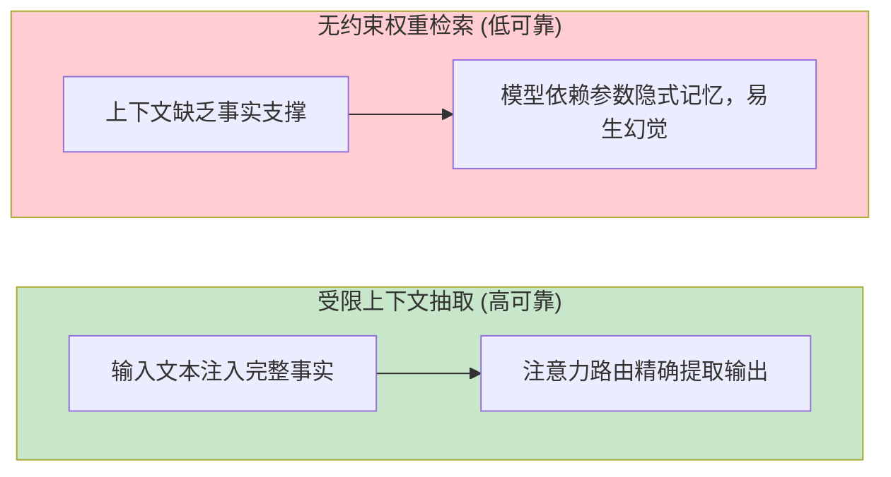
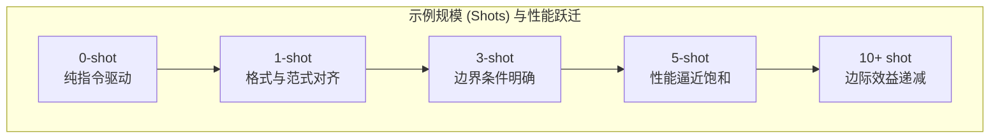
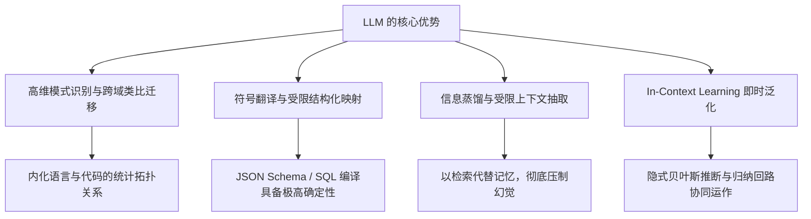

[← 上一章](04-alignment.md) | [目录](../README.md) | [下一章 →](06-limitations.md)

**English**: [English](../en/chapters/05-strengths.md)

# 第五章：LLM 真正擅长什么

> "Know thy tool."（工欲善其事，必先利其器：摸清一件工具最锋利的刃口朝向哪里，才能造出真正扎实的工程系统。）

前四章拆解了现代语言模型的核心机理：自回归预测、动态信息路由、规模涌现与意图对齐。走到这里，工程设计上最要紧的一件事，便是弄清楚大语言模型究竟在哪种任务形态下能给出最高的确定性与最好的表现。

搭架构的时候，只有把模型放在它天生擅长的计算范式里，整套系统才能稳当运转。要是反过来，硬要它去弥补模型本身的先天缺陷，任凭你花再多力气写提示词，系统也终究会在某个时刻失灵崩塌。

本章的核心论点很明确：LLM 在工程上的长处，直接源于无监督预训练与自回归生成的底层机理。摸透了这些长处究竟从何而来，做架构时就能看准大语言模型的真正边界，而不至于在暗处盲目试错调优。

---

## 5.1 模式识别与类比迁移

### 预训练习得的不是字面事实，而是高维模式

把数十万亿 Token 的语料吞进模型之后，其内部真正沉淀下来的东西远比表面看起来丰富：

- 数以千万计的代码仓库与语法结构；
- 多语言百科全书与学术论著体系；
- 浩瀚的专业文献、技术博客与论坛讨论；
- 跨领域的逻辑论证与推理链条。

然而，大语言模型真正吃透的并不是一条条孤立的静态文字，而是高维流形里的**统计模式与拓扑关联**。

拿一个 Python 函数的生成过程来说：

```python
def calculate_area(radius):
    return 3.14159 * radius ** 2
```

模型并不是在符号上去死记圆面积的几何定理，而是在深层注意力回路里生成了高阶复合表征：

1. `def` 标识符激活函数定义与参数列表模式；
2. `return` 引导表达式终止与返回值；
3. 变量名 `radius` 与 `area` 强烈拉高浮点常数 `3.14159` 或 `math.pi` 的条件概率；
4. 幂运算符 `**` 与指数 `2` 形成紧密的共现绑定。

多层注意力回路把这些统计模式层层叠加，驱使模型写出语法严密、逻辑严谨的代码，即便它体内根本没有显式建立过欧几里得几何的公理体系。

### 泛化重构而非机械记忆

一个常见的误区，是把语言模型当成静态语料的查找表。

如果模型肚子里只有死记硬背，它充其量只能机械复述过去见过的代码片段。但在实际工程里，遇到全新的组合需求，模型能自行把几套互不干涉的模式重新拼装起来，写出前所未有却完全合规的程序：

```python
# 需求："编写一个函数，输入长句并返回所有单词首字母大写拼接而成的缩写标识"
# 模型未曾见过该完全一致的业务代码，但能在隐层中协同调度以下子回路：
#   - 字符串 split 分词模式
#   - 列表推导式遍历模式
#   - 字符 upper 变换与首字符索引模式
#   - 字符串 join 聚合模式

def make_acronym(sentence):
    words = sentence.split()
    return ''.join(word[0].upper() for word in words)
```

这就好比真正懂做菜的厨师，不必死背某一张特定的菜谱，只要摸透了食材处理、火候拿捏与风味调和的底层规矩，信手就能做出从未做过的新菜。

### 概念流形上的跨域类比

大语言模型身上最让人惊叹的本事之一，是**跨领域映射与类比推理**。不同学科的学术文本，在自然语言底层其实共享着极其相似的因果叙事脉络；正是这层共通的底色，让模型能够在高维语义空间中自发完成概念流形的对齐与迁移。

比如要求它“以关系型数据库的架构原语阐释 Git 版本控制系统”，模型就能自如排出这样一张结构映射表：

- Commit 提交节点 $\leftrightarrow$ 数据库事务（Transaction）
- Branch 分支机制 $\leftrightarrow$ 数据表分区（Table Partition）
- Merge 合并操作 $\leftrightarrow$ 多表关联与投影（Join）
- Conflict 冲突检测 $\leftrightarrow$ 唯一性或外键约束违规（Constraint Violation）

这并不意味着模型真有什么拟人化的悟性，而是在吞下海量解释性文本的训练中，“概念映射与类比说明”本身就是一种极高频出现的模式。多头注意力机制跨越了不同领域的界限，顺理成章地抽取出同构的关系子图。

**工程启示**：面对概念映射、跨域类比与模式泛化这类任务，大语言模型天生就有着极高的可靠性。这种底气，正是预训练的自回归目标一路打磨出来的核心表征能力。

---

## 5.2 符号翻译与结构化映射

### 大语言模型的黄金舒适区：流形映射

如果要给大语言模型挑出一项最值得工程师托付的核心能力，排在第一位的必然是**符号表示的精确映射**（Mapping）：把一种语义表征形式，原原本本地换成另一种拓扑结构。

```
自然语言需求  →  标准 SQL 查询
业务逻辑描述  →  可执行代码
非结构化文本  →  严格 JSON Schema
自然语言文本  →  领域特定图谱 (AST / Graph)
源语言语料    →  目标语言文本
冗长原始文档  →  紧凑结构化摘要
```

映射类任务在工程上之所以稳得让人放心，根子在预训练语料里本就埋着海量高质量的平行对齐数据：

- 跨语言双语平行文料；
- 开源代码与其对应的注释文档；
- OpenAPI 规范及其对应的客户端 SDK 实现；
- 数据库 DDL 定义与复杂业务 SQL。

模型在训练时一次又一次拟合了海量的 `输入表示 A → 输出表示 B` 映射关系，到了符号变换的任务里，自然拿得出极强的泛化鲁棒性。

### 场景实例：自然语言编译为 SQL

```sql
-- 用户提问: "检索 2024 年度总销售额排名前十的产品名称及对应销售额"

SELECT product_name, SUM(sales_amount) as total_sales
FROM orders
WHERE EXTRACT(YEAR FROM order_date) = 2024
GROUP BY product_name
ORDER BY total_sales DESC
LIMIT 10;
```

模型在这里其实扮演了语义编译器的角色：把“排名前十”映射成 `ORDER BY ... DESC LIMIT 10`，把“2024 年度”映射成日期提取谓词。自然语言的需求与关系代数之间的对应路径，早已牢牢刻进了它的内部权重里。

### 场景实例：非结构化文本的 Schema 提取

```json
// 输入: "张三，男，1990年3月出生，目前在北京的一家互联网公司担任高级工程师，手机号 13800138000，邮箱 zhangsan@example.com"

// 结构化抽取目标输出:
{
  "name": "张三",
  "gender": "男",
  "birth_year": 1990,
  "birth_month": 3,
  "city": "北京",
  "industry": "互联网",
  "title": "高级工程师",
  "phone": "13800138000",
  "email": "zhangsan@example.com"
}
```

### 约束收敛：为何结构化输出显著提升可靠性

回想第一章讲过的条件概率机理：模型自回归生成时，每一步都在庞大的词表空间里摸索前行的路径。一旦给它加上强格式约束（比如 JSON Schema 或者 Function Calling 协议），等于直接在搜索树上做了一场干脆利落的语法剪枝：


约束套得越严密，条件概率分布的熵就越低，模型在隐层中摸索出正确生成路径的几率也就越高。

**工程启示**：做架构设计时，尽可能把那些边界模糊的自由生成任务，改写成定义清晰的结构化映射；优先使用 JSON Schema 和结构化工具调用接口来锁死输出空间。

---

## 5.3 信息蒸馏与受限抽取

### 压缩与提取的天然同构

无监督预训练做的事，说到底就是在给浩瀚的语料找一套压缩效率最高的表达。一个模型能在很长的上下文里咬准下一个 Token，它的隐层早就学会了辨别什么是主干、什么是噪音。

正因如此，文本摘要与关键实体提取，本就是大语言模型训练目标直接派生出来的产物。

### 抽取与自由生成的可靠性鸿沟

做系统设计时，有一条必须尽早立下的工程铁律：

> 大语言模型在受限信息抽取任务上的可靠性，远高于脱离上下文的自由生成任务。

这背后的根源，在于两者在信息流动路径上有本质区别：

- **受限抽取**：真实信息已经显式编码在输入的上下文张量里，模型只需要靠注意力机制建立起路由索引；
- **自由生成**：上下文里找不到现成的事实，模型只能在数十亿参数织成的权重流形里做概率搜索，稍有相近模式的干扰就会滑向幻觉。



**对比示例**：

```
# 模式 A：受限抽取（确定性极高）
上下文: "TensorFlow 最初由 Google Brain 团队开发，于 2015 年 11 月 9 日正式开源。"
提问: "TensorFlow 是在哪一天开源的？"
→ 模型在自注意力层将查询 Q 与上下文 Key 匹配，直接复制 "2015 年 11 月 9 日"。

# 模式 B：无约束生成（存在概率扰动）
提问: "TensorFlow 是在哪一天开源的？"
→ 缺乏即时上下文，模型需依赖隐式参数激活，若置信度不足极易输出偏差日期。
```

**工程启示**：在工业级系统里，必须守住“以检索代替记忆”的原则。先用检索增强生成（RAG）把高度匹配的上下文召回进来，再交由模型完成受限的信息抽取与重组，而不是放任它在毫无约束的状态下凭空生成。

### 层次化信息蒸馏谱系

大语言模型的信息压缩能力，可以自如覆盖从微观到宏观的多重粒度：

| 蒸馏粒度 | 核心任务 | 典型应用 |
|---|---|---|
| **原子级** | 命名实体与关键词识别 | 人名、机构名、技术术语提取 |
| **命题级** | 核心观点与主旨提炼 | 单句论点总结、研报要点提取 |
| **结构级** | 篇章逻辑框架重构 | 背景、论证、结论分层摘要 |
| **全景级** | 跨文档交叉对比综合 | 行业竞品对比、多源情报综述 |

神经网络逐层向上的抽象过程，本质上就是一场精细的信息压缩：把真正有价值的因果特征筛出来，把浮在表层的冗余噪声滤干净。

---

## 5.4 上下文学习（Few-shot Learning）

### 样例驱动的即时任务编程

少样本学习（Few-shot Prompting）彻底扭转了传统机器学习的范式：根本不需要反向传播，也不必改动任何权重，只要在 Prompt 里塞进几个输入输出示例，模型就能立刻调整生成行为，严丝合缝地对齐新任务。

```python
prompt = """
将以下评论分类为"正面"、"中性"或"负面"。

评论: "设计非常典雅，但电池续航略显不足。"
分类: 中性

评论: "系统运行极为流畅，完全超出预期！"
分类: 正面

评论: "发热严重且频繁卡死，体验极差。"
分类: 
"""
# 模型输出: "负面"
```

整个过程里，神经网络的物理权重纹丝未动，是上下文中的这几个样例，即时激活了特定的注意力回路。

### 样本数量与边际效益



| 样例规模 | 性能特征 | 工程定位 |
|:---:|---|---|
| **0-shot** | 依赖纯指令解析 | 基线测试，适用于标准通用任务 |
| **1-shot** | 建立明确的格式与意图范式 | **跃迁幅度最大**，彻底消除歧义 |
| **3-5 shot** | 覆盖典型边界与难例 | **工程黄金甜区**，兼顾高准确率与低 Token 开销 |
| **10+ shot** | 收益微弱且消耗上下文空间 | 仅在长尾复杂逻辑或极端垂直领域推荐使用 |

最关键的跨越永远发生在从 0 到 1 的那一刻。第一个示例直接为模型立住了输出协议与意图锚点，往后再加示例，主要也就是帮它细化边界判断了。

---

## 5.5 In-Context Learning 的机理假说

模型在不改动任何参数的前提下做到即时学习，学术界对这一现象给出了三种很有启发性的理论解释：

### 假说一：隐式元优化与隐梯度下降

Akyurek 等人（[Akyurek et al., 2022](https://arxiv.org/abs/2211.15661)）借助线性模型证明了一件事：Transformer 的前向传播，在数学上等价于在前向计算流中**隐式执行梯度下降**。

```
显式微调：样本数据 → 反向传播更新权重矩阵 W → 改变计算图参数
上下文学习：Prompt 样例 → 前向传播激活隐层残差流 → 动态调整等效映射算子
```

### 假说二：隐式贝叶斯推断

Xie 等人（[Xie et al., 2021](https://arxiv.org/abs/2111.15366)）则从统计物理与贝叶斯视角，给出了另一套形式化阐述：

$$P(\text{Task} \mid \text{Demonstrations}) \propto P(\text{Demonstrations} \mid \text{Task}) \times P(\text{Task})$$

预训练赋予了模型一片广袤的潜任务先验空间 $P(\text{Task})$。Prompt 里的样例充当了观测证据，推动模型在潜空间中完成这一轮后验更新，精准锁定当前目标任务的条件概率分布。

### 假说三：双层注意力归纳回路（Induction Circuits）

Anthropic 的机制可解释性研究指出了更底层的物理基石：Few-shot 依赖的正是第二章探讨过的 **Induction Heads**。多层注意力头在前序序列中搜寻匹配的前缀模式，把紧跟在后面的特征直接复制到了预测位置。

### 实践启示：上下文学习的关键法则

1. **示例排版格式重于内容微调**：清晰的标签分隔符与前后一致的排版结构，往往比单纯堆砌样例更易激发模型的模式匹配；
2. **示例排序具备显著位置敏感性**：排在最后、离生成位置最近的那个示例，对输出概率分布有着最强的先验引导力；
3. **模型本质是在执行条件概率调制**：上下文样例丝毫没有改写底层权重，而是作为显式的先验约束重塑了条件概率分布，就像给高维检索曲面打上了一组动态投影坐标。

---

## 5.6 评测实验：样本规模与排版的工程验证

### 实验设计与实现

```python
from openai import OpenAI

client = OpenAI()

test_cases = [
    ("这家餐厅的服务态度很好，但菜品一般。", "中性"),
    ("简直是我吃过最难吃的东西。", "负面"),
    ("强烈推荐！物超所值！", "正面"),
    ("还行吧，没什么特别的。", "中性"),
    ("等了一个小时才上菜，再也不来了。", "负面"),
]

# 0-shot 模板
zero_shot_tmpl = """将以下评论分类为"正面"、"负面"或"中性"。仅输出分类标签。

评论: {text}
分类: """

# 1-shot 模板
one_shot_tmpl = """将以下评论分类为"正面"、"负面"或"中性"。仅输出分类标签。

评论: "味道不错，环境也很好。"
分类: 正面

评论: {text}
分类: """

# 5-shot 模板
five_shot_tmpl = """将以下评论分类为"正面"、"负面"或"中性"。仅输出分类标签。

评论: "味道不错，环境也很好。"
分类: 正面

评论: "太难吃了，服务也差。"
分类: 负面

评论: "价格合理，味道中规中矩。"
分类: 中性

评论: "超级好吃！下次还来！"
分类: 正面

评论: "失望，和网上说的完全不一样。"
分类: 负面

评论: {text}
分类: """

def evaluate_prompt(template, dataset):
    correct = 0
    for text, label in dataset:
        prompt = template.format(text=text)
        resp = client.chat.completions.create(
            model="gpt-4o-mini",
            messages=[{"role": "user", "content": prompt}],
            temperature=0
        )
        pred = resp.choices[0].message.content.strip()
        if label in pred:
            correct += 1
    return correct / len(dataset)
```

### 实测表现与对比分析

| 实验配置 | 典型准确率 | 核心工程特征 |
|---|:---:|---|
| **0-shot (纯指令)** | 65% - 75% | 基础分类尚能应付，但在中性这类模糊边界样本上容易出现判定漂移 |
| **1-shot (单样例)** | 80% - 88% | 跃升最为明显，输出标签格式严格对齐，彻底清除了格式冗余 |
| **5-shot (多样例)** | 90% - 95% | 边界样本分类精度明显提高，达到生产级稳定性 |
| **标签式 vs 叙述式排版** | 差距 8% - 15% | 结构分明的键值对形式，表现明显好过长段叙述文本 |
| **排列顺序扰动测试** | 差距 5% - 12% | 把难例压到末尾、类别均匀交错的序列，展现出更高的鲁棒性 |

---

## 本章小结



核心要点：

1. **大语言模型本质是高维模式转换器**：它的过人之处，全在海量数据中拟合出来的高阶统计关联与拓扑映射；
2. **符号映射是其黄金舒适区**：在自然语言转 SQL、代码翻译与 JSON 提取这类任务上，它展现出极高的工程可用度；
3. **受限抽取远比自由生成可靠**：构建企业级系统必须坚持 RAG 架构，把凭空生成的问题，转化为边界分明的受限抽取问题；
4. **1 到 5 个样本即可构筑稳定范式**：借由 Few-shot Prompting 牢牢对齐输出格式，迅速调定上下文的先验分布；
5. **扬长避短**：让大语言模型专注于高维模式识别、结构化格式映射与信息蒸馏抽取；把精确算术、状态跟踪与确定性逻辑彻底解耦，交付给专业工具链。

在下一章中，我们将深入大语言模型的结构性盲区：那些深植于自回归生成与离散表征架构、光靠提示工程根本化解不掉的固有局限。

---

## 延伸阅读

- [Language Models are Few-Shot Learners](https://arxiv.org/abs/2005.14165), Brown et al., 2020 (GPT-3 奠基论文)
- [What Learning Algorithm Is In-Context Learning? Investigations with Linear Models](https://arxiv.org/abs/2211.15661), Akyurek et al., 2022
- [An Explanation of In-context Learning as Implicit Bayesian Inference](https://arxiv.org/abs/2111.15366), Xie et al., 2021
- [Fantastically Ordered Prompts and Where to Find Them: Overcoming Few-Shot Prompt Order Sensitivity](https://arxiv.org/abs/2104.08786), Lu et al., 2022
- [Rethinking the Role of Demonstrations: What Makes In-Context Learning Work?](https://arxiv.org/abs/2202.12837), Min et al., 2022

[← 上一章](04-alignment.md) | [目录](../README.md) | [下一章 →](06-limitations.md)
