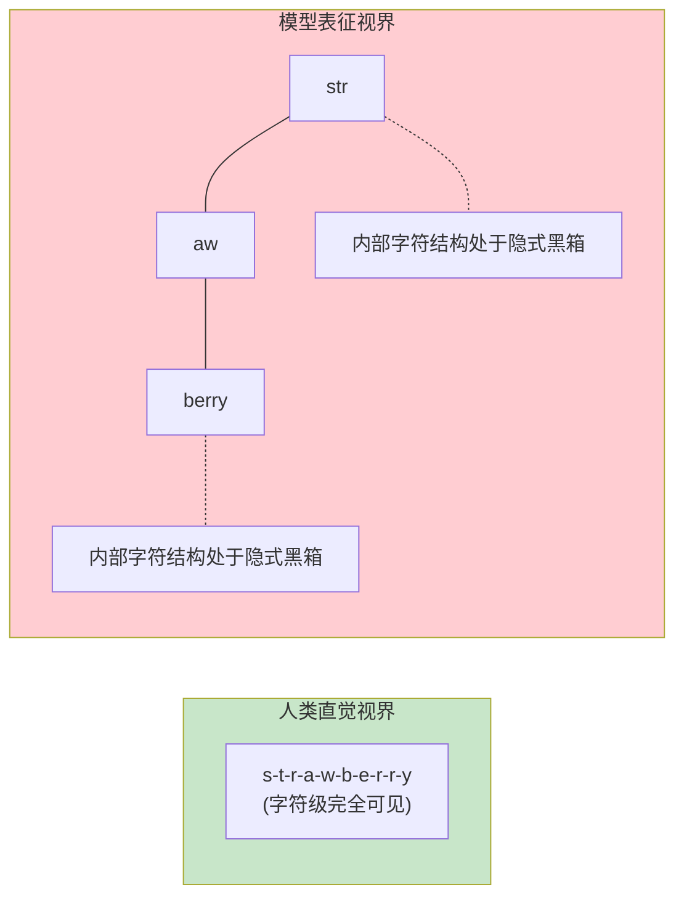
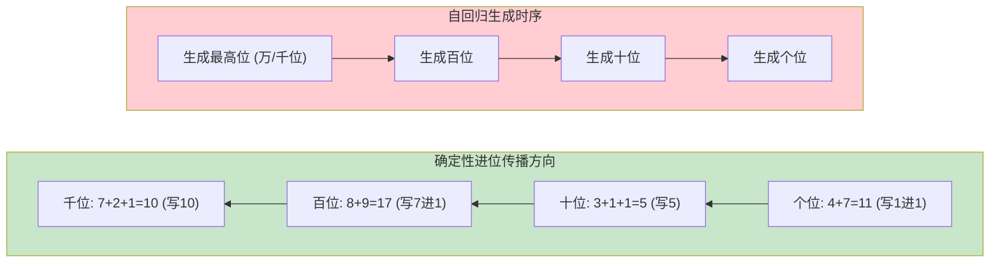
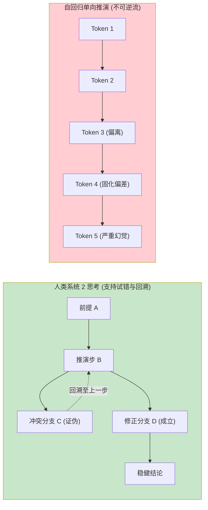
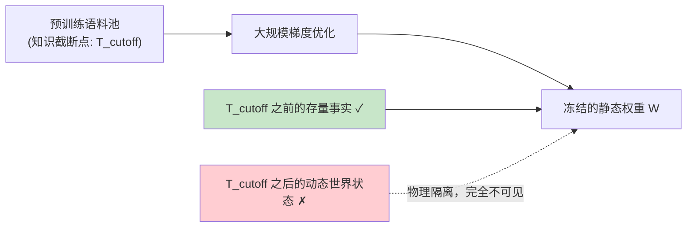
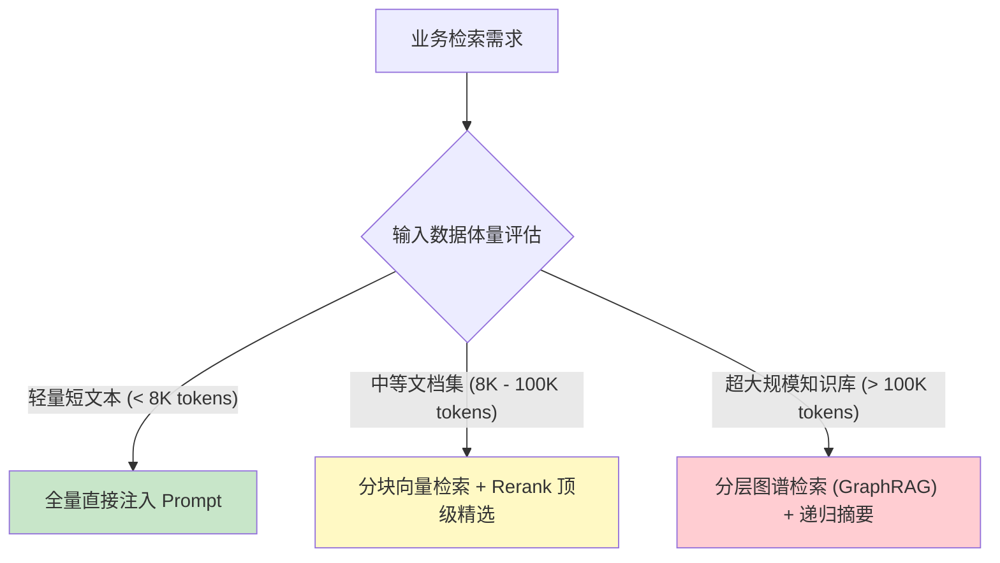
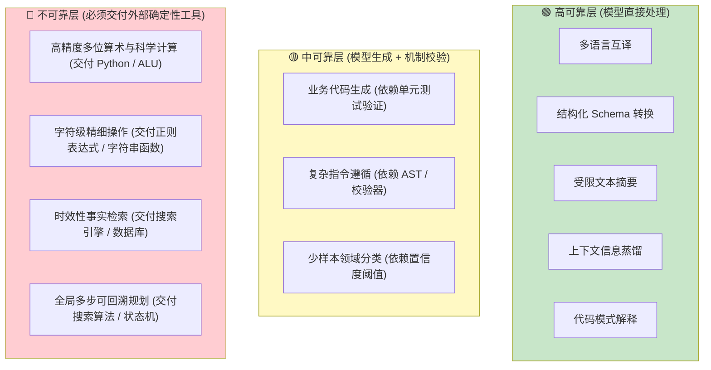
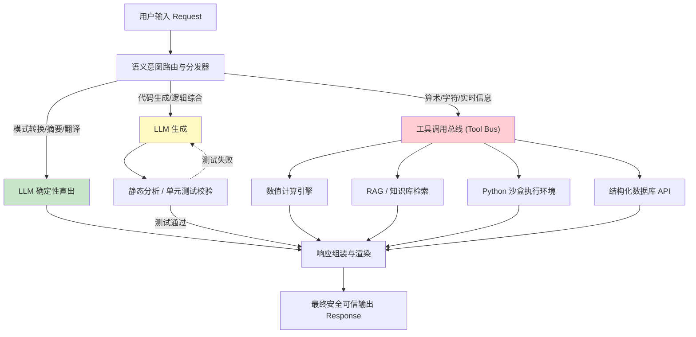
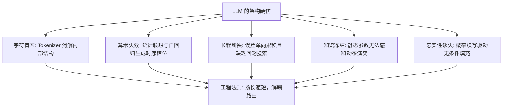

[← 上一章](05-strengths.md) | [目录](../README.md) | [下一章 →](07-hallucination.md)

**English**: [English](../en/chapters/06-limitations.md)

# 第六章：LLM 的固有局限

> "It's not a bug, it's a fundamental architectural limitation."

上一章剖析了大语言模型在高维模式匹配与符号转换中的原生优势。本章转向其物理图景的反面：**受限于底层架构而天然难以胜任的计算任务**。

此类现象并非暂未修复的工程瑕疵，而是根植于底层计算架构的**结构性硬约束**。深刻理解这些限制的产生机理，工程师能够：

1. 规避在违反第一性原理的场景中耗费无谓的调优成本；
2. 确立清晰的系统解耦架构（由模型承载泛化理解，由专业工具链兜底确定性计算）；
3. 建立客观的边界防御与故障隔离机制。

本章的核心论点：**大语言模型的每一项固有缺陷，皆可追溯至其分词表示、因果注意力掩码或自回归生成的底层机理**。洞悉了机理根源，工程解决方案便会自然浮现。

---

## 6.1 字符感知盲区与计数失效

### 经典失效案例

```
用户: "strawberry" 中包含几个字母 "r"？
GPT-4: 2 个。

标准答案: 3 个（st-r-awbe-r-r-y）
```

这一现象曾引发广泛关注。公众困惑于具备复杂编程能力的模型为何会在基础字母计数上发生错误。然而从 Tokenizer 的离散切分机理审视，该结果完全符合预期。

### 机理剖析：分词机制消解了字符级拓扑

回顾第一章：模型在输入层接收的并非连续的字符流，而是由 BPE 分词算法离散化后的 Token 标识。

```python
import tiktoken

enc = tiktoken.encoding_for_model("gpt-4")
tokens = enc.encode("strawberry")
print([enc.decode([t]) for t in tokens])
# 输出典型序列: ['str', 'aw', 'berry']
```

当模型处理 "strawberry" 时，其注意力网络接收到的输入张量是 `str`、`aw`、`berry` 三个语义块的嵌入向量，从未直接观测到孤立字符 `r` 的独立位置索引。

若要得出准确计数，网络必须在隐层多步推演：
1. 解析 `str` 内部包含 1 个 `r`；
2. 判定 `aw` 不含 `r`；
3. 解析 `berry` 内部包含 2 个 `r`；
4. 在前向传播中完成求和汇总。

此操作要求模型对 Token 内部的字符形态学具备显式感知；然而在无监督预训练中，Token 作为离散原子单元参与注意力计算，模型并未建立针对 Token 内部子结构的解析回路。



### 工程应对策略

```python
# 策略一：工具调用（Tool Use）交付确定性代码执行
def count_char(text: str, char: str) -> int:
    return text.count(char)

# 策略二：在提示词中显式诱导符号解耦拆分
prompt = """
请将单词 "strawberry" 拆解为单字符序列，标注每个字符的索引位置，随后统计目标字母 "r" 的出现次数。

字符序列: s, t, r, a, w, b, e, r, r, y
目标字母 "r" 索引: [3, 8, 9]
统计结果: 3
"""
```

**架构准则**：凡涉及字符级形态操作（精确计数、回文字符串检验、正则逆向构造），严禁依赖模型的无约束生成，必须路由至符号执行工具。

---

## 6.2 确定性算术的概率退化

### 数值规模与可靠性坍缩

```
问题: 7 + 5 = ?
输出: 12 (置信度极高)

问题: 347 + 289 = ?
输出: 636 (大概率命中)

问题: 7834 + 2917 = ?
输出: 10741 (错误，正确结果为 10751)

问题: 38472 × 9513 = ?
输出: 366,023,736 (错误，正确结果为 365,924,136)
```

### 机理剖析：模式联想替代精确算法

语言模型并不内嵌算术逻辑单元（ALU），其前向传播计算本质是：

1. 观测到输入序列 `"7 + 5 =" `；
2. 激活预训练语料中高频出现的 `"7 + 5 = 12"` 关联；
3. 输出最大似然 Token `"12"`。

在小数值区间，海量共现使得统计联想与真实数学运算恰好重合。然而当数字位宽增加：

```
面对输入 "7834 + 2917 = ?"：
- 训练集未曾高频共现该精确组合；
- 模型尝试依赖相近数值模式在流形上插值近似；
- 产物仅具备数值数量级的统计合理性，丧失了算术确定性。
```

更本质的矛盾在于计算拓扑的冲突：**多位数算术进位是严格自右向左（低位向高位）传播的确定性算法**；而自回归语言模型必须遵循自左向右（高位向低位）的时序生成流。模型在生成高位数字时，后序低位的进位累加状态在因果掩码阻断下尚未确定。



自左向右的生成方向与自右向左的进位依赖在因果时序上发生不可调和的错位。

### 算术任务可靠性分布

| 运算类型 | 数值范围 | 经验准确率 | 系统工程建议 |
|---|:---:|:---:|---|
| **基础加减** | 1 至 100 | > 98% | 可直接使用 |
| **多位加减** | 100 至 10,000 | ~ 80% | 需引入思维链或验证 |
| **大数加减** | > 10,000 | < 50% | **必须路由至代码执行** |
| **基础乘法** | 九九乘法表以内 | > 98% | 可直接使用 |
| **多位乘法** | 两位数乘法 | ~ 70% | 需引入草稿本（Scratchpad） |
| **高位乘除 / 根式** | 任意多位数 | < 25% | **坚决禁止直接推理** |

### 工程解耦实践

```python
# 声明精确计算工具元数据
calculator_tool = {
    "type": "function",
    "function": {
        "name": "execute_python_calculation",
        "description": "执行严谨的数学计算、矩阵运算与复杂数值分析",
        "parameters": {
            "type": "object",
            "properties": {
                "code": {"type": "string", "description": "待执行的 Python 表达式或脚本"}
            },
            "required": ["code"]
        }
    }
}
```

---

## 6.3 长程推理断裂与因果误差累积

### 自回归生成的不可逆性

人类在探索复杂逻辑时具备系统 2（System 2）思维：尝试路径、遭遇矛盾、动态回溯（Backtracking）、修正前置假设。

然而在标准自回归生成中：**每一个已生成的 Token 将永久固化于上下文张量中，无法撤销或动态擦除**。



### 条件概率链中的误差指数累积

在包含 $k$ 个推演步骤的链条中，设每一步的独立正确概率为 $p_i$。整体推演的最终正确概率为：

$$P(\text{Final Success}) = \prod_{i=1}^{k} p_i$$

若每一步正确率为 $90\%$，历经 10 步连续推演后，全局成功率将衰减至 $0.9^{10} \approx 34.8\%$。前序步骤的微小偏差会作为后续采样的强条件，导致模型在错误路径上自信地越走越远。

### "Lost in the Middle" 效应

Liu 等人（[Liu et al., 2023](https://arxiv.org/abs/2307.03172)）揭示了超长序列注意力分配的物理非对称性：

> 当输入上下文长度显著膨胀时，模型对序列两端（头部与尾部）的信息检索准确率最高，而处于文档中段的信息极易被注意力稀释所忽略。


### 工程加固方案

1. **思维链结构化显式展开（Chain-of-Thought）**：通过生成中间步骤扩充计算图的思考容量；
2. **外部搜索与多路径验证（Tree of Thoughts / Best-of-N）**：通过多次采样与外挂验证器模拟回溯搜索；
3. **上下文首尾锚定优化**：在组装 Prompt 时，将核心业务约束与最关键证据置于上下文最前端或紧邻问答的最末端。

---

## 6.4 知识时效性与静态权重约束

### 知识冻结的物理本质

大语言模型内部存储的事实性知识完全固化在预训练结束时的静态权重矩阵中：

```
提问: "2025 年全球人工智能安全峰会的主办城市是哪里？"
模型: （受限于 2024 年训练截断点）"该会议尚未召开或缺乏公开记录..."

隐蔽性风险提问:
提问: "当前 Next.js 的推荐架构规范是什么？"
模型: 自信地输出过时的 Pages Router 模式，而非最新的 App Router 范式。
```

后一种情形在生产系统中更具隐蔽性与破坏力：模型无法感知自身知识的时间衰减，依然会以极高的确定性概率输出过时信息。



### 知识注入方案对比

| 方案架构 | 知识更新周期 | 实施成本 | 适用场景 |
|---|:---:|:---:|---|
| **RAG (检索增强生成)** | 毫秒至分钟级 (实时向量化) | 极低 (仅检索索引开销) | **生产系统首选**，高频变动的企业知识库 |
| **实时 Web Search 插件** | 实时调用 | 极低 (API 成本) | 开放领域最新资讯与事实核查 |
| **全量微调 (Fine-Tuning)** | 天至周级别 | 高 | 调整领域行文风格与专业术语表达，不宜用于事实注入 |
| **模型全量重训** | 月至年级别 | 极高 (数百万美元算力) | 基础认知底座的周期性迭代 |

---

## 6.5 忠实性缺失与拒答机制的本质

### 续写器的本质决定了无条件响应

大语言模型的首要目标是在给定上下文下输出最大似然延续。当模型隐层权重中缺乏特定领域事实时，其计算图不会抛出 `NullPointerException`，而是会在语义流形相近的区域中搜寻表面合理的词元进行拼装。

### "我不知道"仅是一种概率预测

```
当模型输出"很抱歉，根据已知信息我无法回答该问题"时：
- 并非模型建立了本体论层面的自我无知感知；
- 而是该 Prompt 激活了对齐阶段中拒答样本的条件概率分支。
```

经过强化学习对齐的模型能更频繁地输出"我无法确定"，但这并不等同于模型建立了内省式的真实不确定性度量，而仅表明模型习得了在特定提问模式下生成拒答 Token 能够获得更高的环境奖励。

在模型以极高流畅度输出长篇大论时，调用方无法仅凭其文本语调判定其事实真伪。

```python
# 脆弱架构：直接采信模型内隐事实
raw_answer = llm.generate("某初创企业最新的估值与轮次信息？")
# 模型可能输出看似精确的数值，实则完全源于参数流形的虚构拟合

# 健壮架构：受限 RAG 闭环验证
retrieved_docs = knowledge_retriever.query("某初创企业 最新 估值")
safe_answer = llm.generate(f"""
【严格约束】请仅依据以下参考资料回答问题。若参考资料未提及具体数值，请明确声明"依据已知材料无法确定"，严禁结合外部常识推测。

参考资料：
{retrieved_docs}
""")
```

---

## 6.6 上下文窗口的物理与经济硬约束

### $O(n^2)$ 计算与显存带宽墙

标准的自注意力计算复杂度随 Token 长度 $n$ 呈平方级增长：

| 上下文长度 | 相对浮点计算量 | 单并发 KV Cache 显存占用 (70B 模型) |
|:---:|:---:|:---:|
| **4K** | $1\times$ | ~ 10.24 MB |
| **16K** | $16\times$ | ~ 40.96 MB |
| **128K** | $1024\times$ | ~ 327.68 MB |
| **1M** | $62500\times$ | ~ 2.56 GB |

长上下文不仅带来计算与显存的指数级膨胀，更会导致首字延迟（TTFT）与吞吐量大幅恶化。

### 上下文并非无序信息垃圾桶

盲目将全量数据塞入上下文窗口将引发四大工程危机：
1. **API 调用成本线性激增**；
2. **推理时延超出实时交互容忍阈值**；
3. **"大海捞针"检索衰减**：有效信息被噪声淹没；
4. **注意力分散导致输出质量降级**。



---

## 6.7 系统工程可靠性分级框架

将前述分析综合推演，我们可以建立一套**系统工程可靠性分级框架**，为大语言模型系统的职责边界划分提供清晰的架构判定标准。

### 三级可靠性拓扑



### 全景可靠性矩阵

| 任务类型 | 固有可靠性 | 架构根因 | 工业级解决方案 |
|---|:---:|---|---|
| **语言翻译** | 🟢 高 | 海量平行先验 | 直接调用，设定 Temperature=0 |
| **文档摘要** | 🟢 高 | 预训练压缩目标一致 | 直接调用，控制输出长度 |
| **格式映射** | 🟢 高 | 双向平行语法对照 | 启用 JSON Mode / Grammar 约束 |
| **受限抽取** | 🟢 高 | 答案显式包含于输入 | 结合 Few-shot 约束输出 Schema |
| **代码生成** | 🟡 中 | 逻辑分支可能存在疏漏 | 配套沙盒执行与自动化单元测试 |
| **上下文问答** | 🟡 中 | 易受诱导性提示词干扰 | 强制要求生成原文引用（Citations） |
| **精确数值运算** | 🔴 低 | 模式联想非严谨计算 | **强制路由至代码解释器或计算器** |
| **字符级计数** | 🔴 低 | BPE 分词打碎字符拓扑 | **强制交由原生字符串函数处理** |
| **实时动态事实** | 🔴 低 | 静态权重时间截断 | **强制构建 RAG 检索管线** |
| **长程状态规划** | 🔴 低 | 自回归缺乏回溯机制 | **外置规划状态机与验证器** |

### 系统调度总线架构



---

## 本章小结



核心要点：

1. **缺陷是架构的内生属性**：字符数不对、大数算不对、长程推演偏离皆源于底层表征与生成算法；
2. **严禁依赖提示词解决架构缺陷**：不要试图通过优化 Prompt 让模型胜任精确计算，必须交付确定性工具；
3. **建立三级可靠性工程分流**：高可靠任务直接输出，中可靠任务引入验证环，不可靠任务坚决工具化；
4. **以 RAG 与工具调用化解静态边界**：让语言模型充当具备泛化理解力的调度中枢，让专用系统保障数据与事实的绝对准确。

在下一章中，我们将聚焦大语言模型最受瞩目、也是破坏力最大的失效表征：深入剖析幻觉（Hallucination）的统计本质与消除路径。

---

## 延伸阅读

- [Lost in the Middle: How Language Models Use Long Contexts](https://arxiv.org/abs/2307.03172), Liu et al., 2023
- [Faith and Fate: Limits of Transformers on Compositionality](https://arxiv.org/abs/2305.18654), Dziri et al., 2023
- [Toolformer: Language Models Can Teach Themselves to Use Tools](https://arxiv.org/abs/2302.04761), Schick et al., 2023
- [Measuring and Narrowing the Compositionality Gap in Language Models](https://arxiv.org/abs/2210.03350), Press et al., 2022
- [Large Language Models Cannot Self-Correct Reasoning Yet](https://arxiv.org/abs/2310.01798), Mirchandani et al., 2023

[← 上一章](05-strengths.md) | [目录](../README.md) | [下一章 →](07-hallucination.md)

