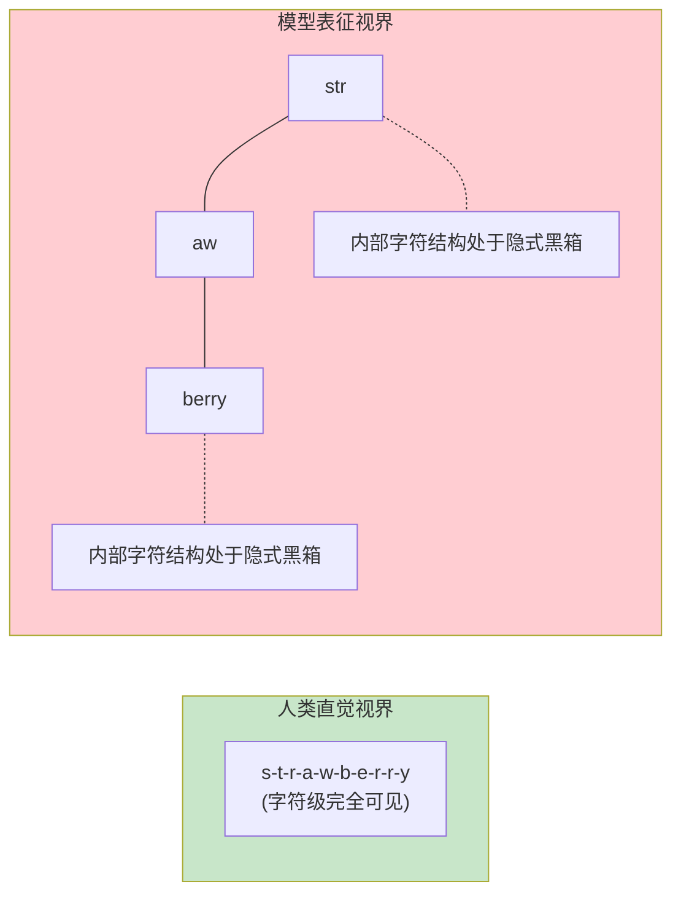
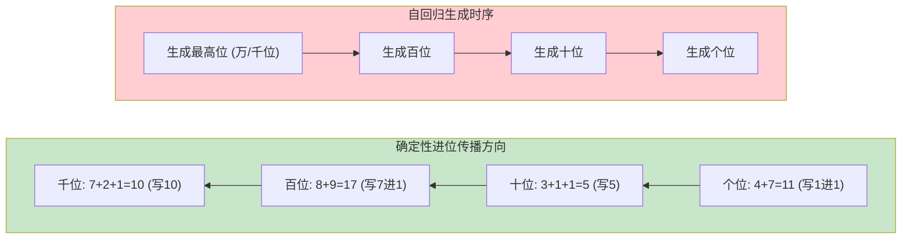
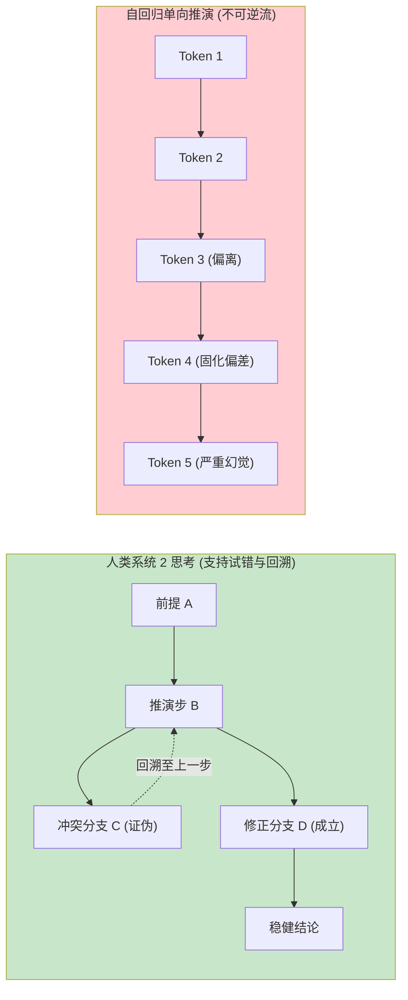
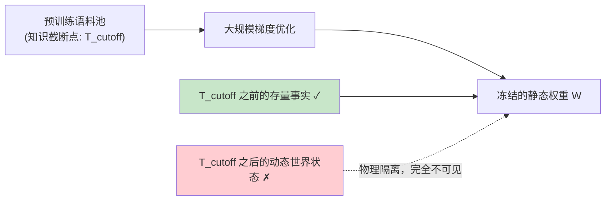
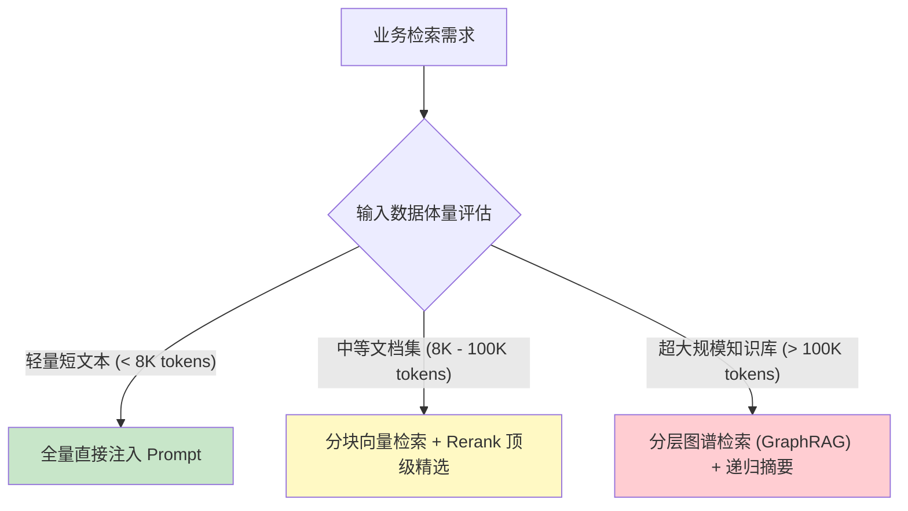
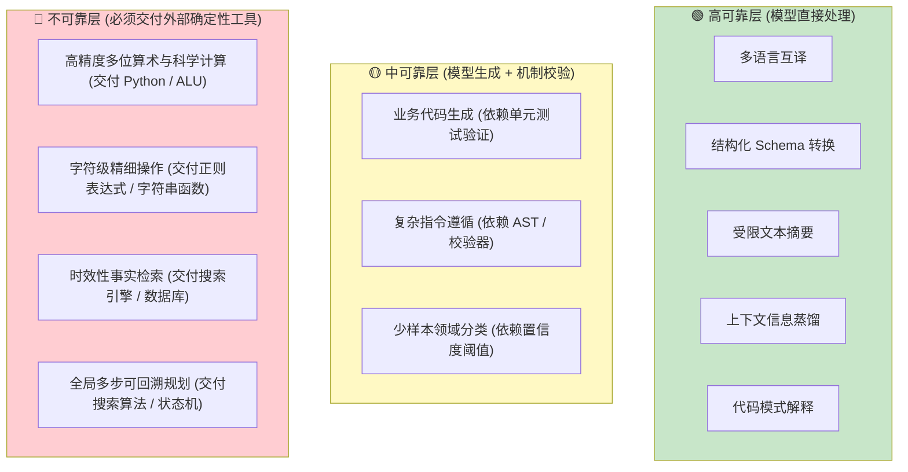
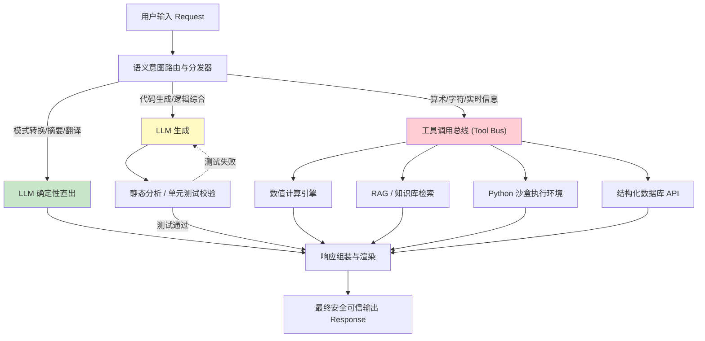
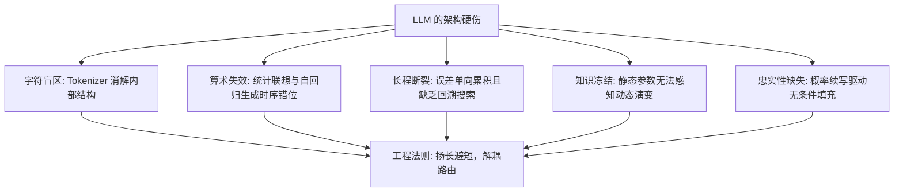

[← 上一章](05-strengths.md) | [目录](../README.md) | [下一章 →](07-hallucination.md)

**English**: [English](../en/chapters/06-limitations.md)

# 第六章：LLM 的固有局限

> "It's not a bug, it's a fundamental architectural limitation."

上一章讲了大语言模型在高维模式匹配与符号转换上的长处。这一章要转过来看这幅图景的反面：那些受制于底层架构、模型天生就处理不好的计算任务。

这类问题并不是没来得及修复的工程缺陷，而是写在底层计算架构里的**结构性约束**。把这些限制背后的机理摸透，在工程上至少能想清楚三件事：

1. 不在明摆着违背底层原理的地方耗费精力去盲目调优；
2. 厘清系统的分工边界（让模型负责泛化理解，把确定性的计算留给现成的工具链）；
3. 为系统设立清醒的边界防御与故障隔离机制。

这一章的核心论点其实很明确：大语言模型身上的每一处短板，根子都在分词表示、因果注意力掩码或是自回归生成的底层机制里。把根源看透，工程上的解法自然就会浮现出来。

---

## 6.1 字符感知盲区与计数失效

### 经典失效案例

```
用户: "strawberry" 中包含几个字母 "r"？
GPT-4: 2 个。

标准答案: 3 个（st-r-awbe-r-r-y）
```

这个例子曾引来不少讨论。很多人觉得奇怪：一个连复杂代码都能写的模型，怎么偏偏在数字母这种小事上算错？但只要顺着分词器的切分逻辑看下去，就会发现这个结果完全合乎常理。

### 机理剖析：分词机制消解了字符级拓扑

回头看第一章：送进模型输入层的从来不是一串连贯的字符，而是经过 BPE 算法切分后的 Token 编号。

```python
import tiktoken

enc = tiktoken.encoding_for_model("gpt-4")
tokens = enc.encode("strawberry")
print([enc.decode([t]) for t in tokens])
# 输出典型序列: ['str', 'aw', 'berry']
```

当模型处理 "strawberry" 时，注意力网络接收到的输入张量实际上是 `str`、`aw`、`berry` 这三个语义切片的嵌入向量。模型自始至终都没有直接看到单个字符 `r` 落在哪个具体位置上。

真想把数字数对，网络就必须在隐藏层里做一连串推演：
1. 认出 `str` 里面含有 1 个 `r`；
2. 确认 `aw` 里面没有 `r`；
3. 认出 `berry` 里面含有 2 个 `r`；
4. 在前向传播的过程中把这几个数加起来。

这要求模型对 Token 内部的字符形态有清晰的感知。然而在无监督预训练里，Token 本身就是参与注意力计算的最小原子单元，模型内部并没有长出专门拆解这些细小结构的回路。



### 工程应对策略

```python
# 策略一：工具调用（Tool Use）交付确定性代码执行
def count_char(text: str, char: str) -> int:
    return text.count(char)

# 策略二：在提示词中显式诱导符号解耦拆分
prompt = """
请将单词 "strawberry" 拆解为单字符序列，标注每个字符的索引位置，随后统计目标字母 "r" 的出现次数。

字符序列: s, t, r, a, w, b, e, r, r, y
目标字母 "r" 索引: [3, 8, 9]
统计结果: 3
"""
```

**架构准则**：凡是涉及字符级形态的操作，无论是精确计数、回文字符串检验还是反向推导正则表达式，都不要依赖模型的自由生成，必须把任务交给符号执行工具。

---

## 6.2 确定性算术的概率退化

### 数值规模与可靠性坍缩

```
问题: 7 + 5 = ?
输出: 12 (置信度极高)

问题: 347 + 289 = ?
输出: 636 (大概率命中)

问题: 7834 + 2917 = ?
输出: 10741 (错误，正确结果为 10751)

问题: 38472 × 9513 = ?
输出: 366,023,736 (错误，正确结果为 365,924,136)
```

### 机理剖析：模式联想替代精确算法

语言模型内部并没有算术逻辑单元（ALU），它在前向传播中所做的事情，说到底只有几步：

1. 看到输入序列 `"7 + 5 =" `；
2. 唤起预训练语料里高频出现的 `"7 + 5 = 12"` 关联记忆；
3. 输出概率最大的 Token `"12"`。

数字很小的时候，海量语料里的高频共现让统计联想恰好撞上了真实的数学结果。可一旦数字的位数多起来，这套联想就会露馅：

```
面对输入 "7834 + 2917 = ?"：
- 训练集未曾高频共现该精确组合；
- 模型尝试依赖相近数值模式在流形上插值近似；
- 产物仅具备数值数量级的统计合理性，丧失了算术确定性。
```

更深层的矛盾出在计算拓扑上。多位数算术的进位是由低位向高位、严格自右向左传递的确定性过程；自回归模型生成文本时，却必须自左向右先输出高位再输出低位。当模型还在生成最高位数字的时候，由于因果掩码的阻隔，后面低位累加出来的进位根本还没算出来。



自左向右的生成顺序与自右向左的进位依赖，在因果时序上形成了无法调和的错位。

### 算术任务可靠性分布

| 运算类型 | 数值范围 | 经验准确率 | 系统工程建议 |
|---|:---:|:---:|---|
| **基础加减** | 1 至 100 | > 98% | 可直接使用 |
| **多位加减** | 100 至 10,000 | ~ 80% | 需引入思维链或验证 |
| **大数加减** | > 10,000 | < 50% | **必须路由至代码执行** |
| **基础乘法** | 九九乘法表以内 | > 98% | 可直接使用 |
| **多位乘法** | 两位数乘法 | ~ 70% | 需引入草稿本（Scratchpad） |
| **高位乘除 / 根式** | 任意多位数 | < 25% | **坚决禁止直接推理** |

### 工程解耦实践

```python
# 声明精确计算工具元数据
calculator_tool = {
    "type": "function",
    "function": {
        "name": "execute_python_calculation",
        "description": "执行严谨的数学计算、矩阵运算与复杂数值分析",
        "parameters": {
            "type": "object",
            "properties": {
                "code": {"type": "string", "description": "待执行的 Python 表达式或脚本"}
            },
            "required": ["code"]
        }
    }
}
```

---

## 6.3 长程推理断裂与因果误差累积

### 自回归生成的不可逆性

人在琢磨复杂逻辑时，靠的是所谓的系统 2（System 2）：先挑一条路径往前推，撞上矛盾就退回上一步（Backtracking），重新推翻前面的假设，换个方向再试。

标准的自回归生成却没有退路可言：只要一个 Token 被生成出来，它就永久固化在上下文张量中，无法撤销，也不能动态擦除。



### 条件概率链中的误差指数累积

设一条推演链包含 $k$ 个步骤，每一步各自正确的概率是 $p_i$，整条推演链走到最后的正确概率便是：

$$P(\text{Final Success}) = \prod_{i=1}^{k} p_i$$

哪怕每一步的正确率都能达到 $90\%$，连着推上 10 步，全局成功率也会一路跌到 $0.9^{10} \approx 34.8\%$。前序步骤哪怕只偏了一点，这个微小的偏差都会变成后续每一步采样的硬性条件，推着模型在错路上走得越来越自信。

### "Lost in the Middle" 效应

Liu 等人（[Liu et al., 2023](https://arxiv.org/abs/2307.03172)）揭示了超长序列在注意力分配上的物理非对称性：

> 当输入的上下文急剧拉长时，模型对序列两端（头部与尾部）的信息检索准确率最高，夹在文档中段的内容却很容易被稀释的注意力直接漏掉。


### 工程加固方案

1. **思维链结构化显式展开（Chain-of-Thought）**：生成详细的中间推演步骤，借此扩充计算图的思考容量；
2. **外部搜索与多路径验证（Tree of Thoughts / Best-of-N）**：用多次采样配上外挂验证器，在外部模拟出回溯搜索的过程；
3. **上下文首尾锚定优化**：组装 Prompt 时，把核心业务约束与最关键的证据放到上下文最开头，或者紧贴着问答的最末尾。

---

## 6.4 知识时效性与静态权重约束

### 知识冻结的物理本质

大语言模型内部存储的事实知识，在预训练结束的那一刻，就已经彻底固定在静态权重矩阵中了：

```
提问: "2025 年全球人工智能安全峰会的主办城市是哪里？"
模型: （受限于 2024 年训练截断点）"该会议尚未召开或缺乏公开记录..."

隐蔽性风险提问:
提问: "当前 Next.js 的推荐架构规范是什么？"
模型: 自信地输出过时的 Pages Router 模式，而非最新的 App Router 范式。
```

后一种情形落到生产系统里，往往隐蔽得多，破坏力也大得多：模型根本不知道自己的知识已经随时间老去，依然会带着极高的确定性，输出早已过时的信息。



### 知识注入方案对比

| 方案架构 | 知识更新周期 | 实施成本 | 适用场景 |
|---|:---:|:---:|---|
| **RAG (检索增强生成)** | 毫秒至分钟级 (实时向量化) | 极低 (仅检索索引开销) | **生产系统首选**，高频变动的企业知识库 |
| **实时 Web Search 插件** | 实时调用 | 极低 (API 成本) | 开放领域最新资讯与事实核查 |
| **全量微调 (Fine-Tuning)** | 天至周级别 | 高 | 调整领域行文风格与专业术语表达，不宜用于事实注入 |
| **模型全量重训** | 月至年级别 | 极高 (数百万美元算力) | 基础认知底座的周期性迭代 |

---

## 6.5 忠实性缺失与拒答机制的本质

### 续写器的本质决定了无条件响应

大语言模型的首要目标，是在给定的上下文下算出最大似然的延续。当模型的隐层权重里缺少特定领域的事实时，计算图并不会抛出 `NullPointerException` 报错停机，而是转向语义流形相近的区域搜寻看似合理的词元，将它们拼装成文。

### "我不知道"仅是一种概率预测

```
当模型输出"很抱歉，根据已知信息我无法回答该问题"时：
- 并非模型建立了本体论层面的自我无知感知；
- 而是该 Prompt 激活了对齐阶段中拒答样本的条件概率分支。
```

经过强化学习对齐的模型，确实会更频繁地输出“我无法确定”。但这绝不意味着它拥有了内省式的真实不确定性度量，无非是在某些特定的提问模式下，生成拒答的 Token 恰好能给它换来更高的环境奖励。

当模型以极高的流畅度写下长篇大论时，调用方光看那副笃定的语气，根本无从分辨里面的事实是真是假。

```python
# 脆弱架构：直接采信模型内隐事实
raw_answer = llm.generate("某初创企业最新的估值与轮次信息？")
# 模型可能输出看似精确的数值，实则完全源于参数流形的虚构拟合

# 健壮架构：受限 RAG 闭环验证
retrieved_docs = knowledge_retriever.query("某初创企业 最新 估值")
safe_answer = llm.generate(f"""
【严格约束】请仅依据以下参考资料回答问题。若参考资料未提及具体数值，请明确声明"依据已知材料无法确定"，严禁结合外部常识推测。

参考资料：
{retrieved_docs}
""")
```

---

## 6.6 上下文窗口的物理与经济硬约束

### $O(n^2)$ 计算与显存带宽墙

标准的自注意力计算复杂度，会随着 Token 长度 $n$ 呈平方级增长：

| 上下文长度 | 相对浮点计算量 | 单并发 KV Cache 显存占用 (70B 模型) |
|:---:|:---:|:---:|
| **4K** | $1\times$ | ~ 10.24 MB |
| **16K** | $16\times$ | ~ 40.96 MB |
| **128K** | $1024\times$ | ~ 327.68 MB |
| **1M** | $62500\times$ | ~ 2.56 GB |

超长上下文带来的计算与显存膨胀只是账面上的开销，落到工程实际中，首字延迟（TTFT）会被急剧拉长，系统的吞吐量也会跟着大幅恶化。

### 上下文并非无序信息垃圾桶

盲目将所有数据塞进上下文窗口，很快就会引出四大工程危机：
1. **API 调用成本线性激增**；
2. **推理时延超出实时交互容忍阈值**；
3. **“大海捞针”检索衰减**：关键信息被杂乱的噪声彻底淹没；
4. **注意力分散导致输出质量降级**。



---

## 6.7 系统工程可靠性分级框架

把前面的各项分析推演到底，我们便能理出一套**系统工程可靠性分级框架**。模型该接什么、不该碰什么，系统里的权责边界到底划在哪里，全看这把尺子。

### 三级可靠性拓扑



### 全景可靠性矩阵

| 任务类型 | 固有可靠性 | 架构根因 | 工业级解决方案 |
|---|:---:|---|---|
| **语言翻译** | 🟢 高 | 海量平行先验 | 直接调用，设定 Temperature=0 |
| **文档摘要** | 🟢 高 | 预训练压缩目标一致 | 直接调用，控制输出长度 |
| **格式映射** | 🟢 高 | 双向平行语法对照 | 启用 JSON Mode / Grammar 约束 |
| **受限抽取** | 🟢 高 | 答案显式包含于输入 | 结合 Few-shot 约束输出 Schema |
| **代码生成** | 🟡 中 | 逻辑分支可能存在疏漏 | 配套沙盒执行与自动化单元测试 |
| **上下文问答** | 🟡 中 | 易受诱导性提示词干扰 | 强制要求生成原文引用（Citations） |
| **精确数值运算** | 🔴 低 | 模式联想非严谨计算 | 强制路由至代码解释器或计算器 |
| **字符级计数** | 🔴 低 | BPE 分词打碎字符拓扑 | 强制交由原生字符串函数处理 |
| **实时动态事实** | 🔴 低 | 静态权重时间截断 | 强制构建 RAG 检索管线 |
| **长程状态规划** | 🔴 低 | 自回归缺乏回溯机制 | 外置规划状态机与验证器 |

### 系统调度总线架构



---

## 本章小结



核心要点：

1. **缺陷是架构的内生属性**：数不清字符、算不对大数、长程推演半途走偏，根子全在底层的表征与生成算法里，由不得模型自己；
2. **严禁依赖提示词解决架构缺陷**：别指望靠优化 Prompt 让模型胜任精确计算，这类容不得差错的硬活，必须干脆地交付确定性工具；
3. **建立三级可靠性工程分流**：高可靠任务由模型直接输出，中可靠任务套上验证环再放行，不可靠任务则坚决剥离给外部工具；
4. **以 RAG 与工具调用化解静态边界**：让擅长泛化理解的语言模型坐镇调度中枢，至于数据与事实的绝对准确，交由专用系统稳稳守住。

下一章，我们将把目光转向大语言模型身上最显眼、破坏力也最强的一处失效：深挖幻觉（Hallucination）背后的统计本质，摸清消除它的现实路径。

---

## 延伸阅读

- [Lost in the Middle: How Language Models Use Long Contexts](https://arxiv.org/abs/2307.03172), Liu et al., 2023
- [Faith and Fate: Limits of Transformers on Compositionality](https://arxiv.org/abs/2305.18654), Dziri et al., 2023
- [Toolformer: Language Models Can Teach Themselves to Use Tools](https://arxiv.org/abs/2302.04761), Schick et al., 2023
- [Measuring and Narrowing the Compositionality Gap in Language Models](https://arxiv.org/abs/2210.03350), Press et al., 2022
- [Large Language Models Cannot Self-Correct Reasoning Yet](https://arxiv.org/abs/2310.01798), Mirchandani et al., 2023

[← 上一章](05-strengths.md) | [目录](../README.md) | [下一章 →](07-hallucination.md)
