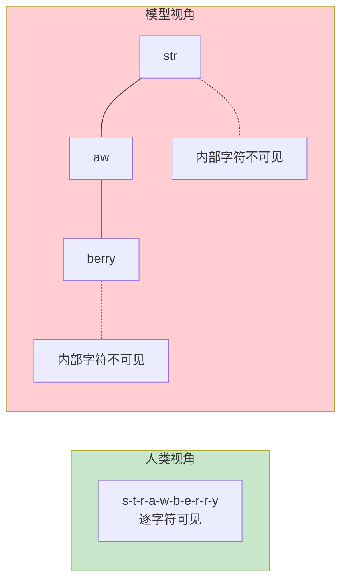
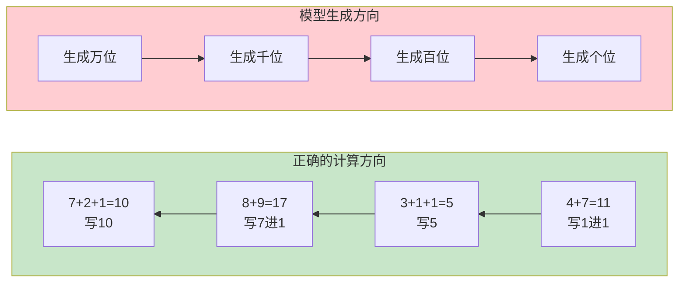
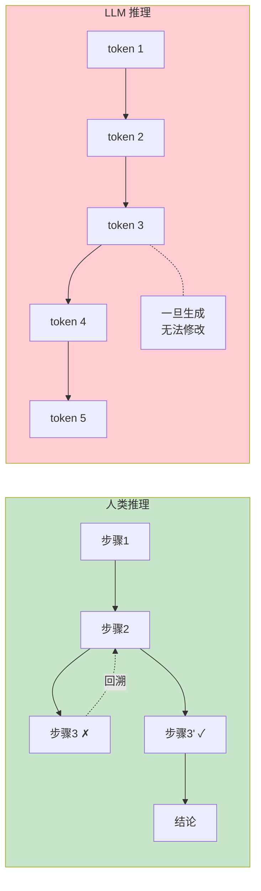
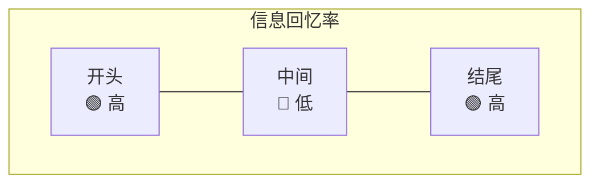
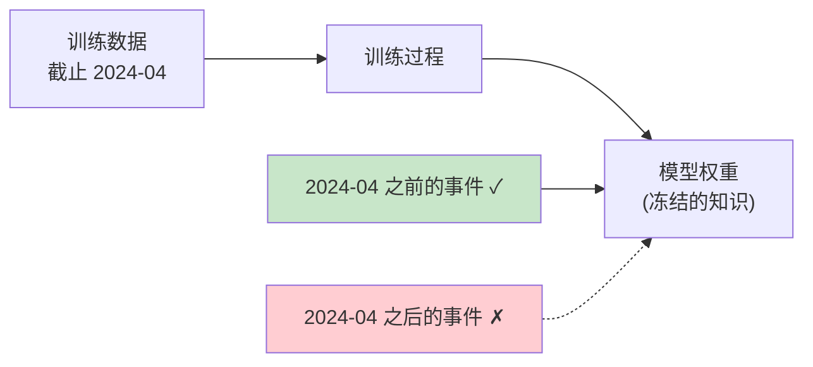
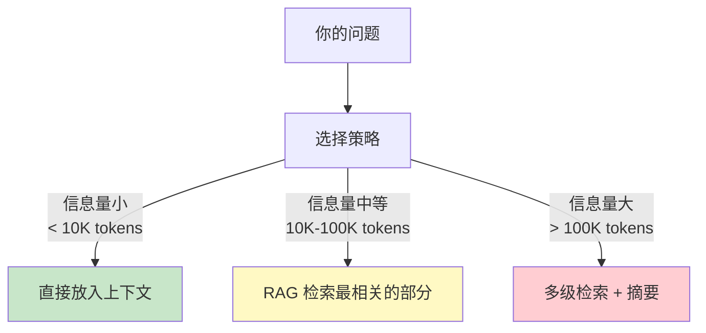
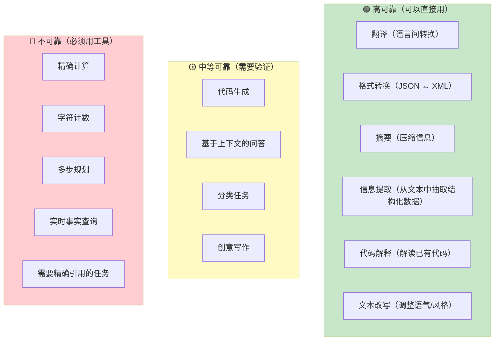
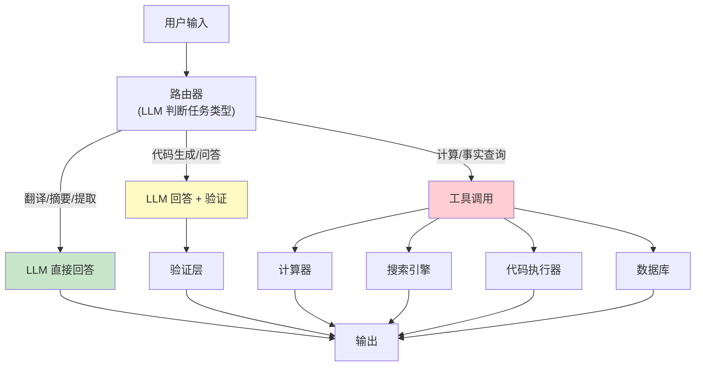

[← 上一章](05-strengths.md) | [目录](../README.md) | [下一章 →](07-hallucination.md)

# 第六章：LLM 的硬伤

> "It's not a bug, it's a ~~feature~~ fundamental architectural limitation."

上一章我们看到了 LLM 擅长的领域。本章转向另一面：**LLM 天然做不好的事情**。

这些不是"还没解决的问题"——它们是**架构层面的限制**。理解这些限制的根因，你就能：

1. 避免在注定失败的场景上浪费时间
2. 设计出正确的系统架构（让 LLM 做它擅长的，让工具做剩下的）
3. 在面试/评审中提出正确的问题

本章的核心论点：**每一个"硬伤"都可以追溯到 LLM 的训练方式或推理机制**。一旦你理解了根因，解决方案自然浮现。

---

## 6.1 数数数不对

### 经典翻车现场

```
用户: "strawberry" 里有几个 r？
GPT-4: 2个。

正确答案: 3个（st-r-awbe-r-r-y）
```

这个问题曾经在网上引发热议。人们惊讶于一个"如此聪明"的模型竟然数不对字母。但如果你理解了 tokenizer，这个错误毫不意外。

### 根因：tokenizer 打碎了字符边界

回忆第一章：LLM 不是逐字符处理文本的，它处理的是 token。

```python
import tiktoken

enc = tiktoken.encoding_for_model("gpt-4")
tokens = enc.encode("strawberry")
print([enc.decode([t]) for t in tokens])
# 可能的输出: ['str', 'aw', 'berry']
```

当模型看到 "strawberry" 时，它看到的不是 `s-t-r-a-w-b-e-r-r-y` 这 10 个字符，而是 `str`-`aw`-`berry` 这 3 个 token。

**模型从来没有"看到"过单独的字符 r。** 它看到的是包含 r 的 token 片段。要数出 r 的个数，模型需要：

1. 知道 "str" 里有一个 r
2. 知道 "aw" 里没有 r
3. 知道 "berry" 里有两个 r
4. 把它们加起来

这要求模型对 token 内部的字符组成有精确的认知——但训练过程中，token 是最小单位，模型没有被训练去分析 token 内部的结构。



### 解决方案

```python
# 让模型用代码来数（tool use）
def count_char(text, char):
    return text.count(char)

# 或者在 prompt 中引导模型逐字拆解
prompt = """
请逐个列出 "strawberry" 的每个字符，然后数出 r 的个数。

字符列表: s, t, r, a, w, b, e, r, r, y
r 出现的位置: 第3个, 第8个, 第9个
r 的个数: 3
"""
```

**核心原则**：凡是需要字符级操作的任务（计数、回文判断、字谜），不要信任 LLM 的直接回答，给它代码执行工具。

---

## 6.2 算术不可靠

### 小数字没问题，大数字就翻车

```
问: 7 + 5 = ?
答: 12 ✓

问: 347 + 289 = ?
答: 636 ✓（大概率）

问: 7834 + 2917 = ?
答: 10741 ✗（正确答案是 10751）

问: 38472 × 9513 = ?
答: 366,023,736 ✗（正确答案是 365,924,136）
```

### 根因：模式匹配不是计算

LLM 不会"算"数学。它做的是：

1. 看到 "7 + 5 ="
2. 在训练数据中，"7 + 5 = 12" 出现了无数次
3. "12" 是最可能的下一个 token

对于小数字，这种模式匹配和真正的计算给出相同的结果。但对于大数字：

```
"7834 + 2917 = ?" 
→ 模型从未在训练数据中见过这个精确的加法
→ 它尝试从类似的模式中"推断"答案
→ 这不是计算，是猜测
```

更深层的问题：**多位数运算需要进位——一个需要从右到左处理的算法**。但自回归模型是从左到右生成的。模型在生成"万位"数字时，还不知道后面的进位情况。



计算需要从右到左（低位到高位），但 token 生成是从左到右（高位到低位）。这是一个根本性的方向冲突。

### 可靠性曲线

| 运算类型 | 数字范围 | 可靠性 |
|---------|---------|--------|
| 加减法 | 1-100 | 很高（~99%） |
| 加减法 | 100-10000 | 中等（~80%） |
| 加减法 | 10000+ | 不可靠（~50%） |
| 乘法 | 1-12（乘法表） | 很高（~99%） |
| 乘法 | 两位数 × 两位数 | 中等（~70%） |
| 乘法 | 三位数+ | 不可靠（<30%） |
| 除法/开方 | 任何 | 不可靠 |

### 解决方案

```python
# 方案一：代码执行工具
# 让 LLM 写代码，然后执行代码得到结果
"""
问题：计算 7834 + 2917

让我用 Python 来计算：
```python
result = 7834 + 2917
print(result)  # 10751
```

答案是 10751。
"""

# 方案二：Function Calling
tools = [{
    "type": "function",
    "function": {
        "name": "calculator",
        "description": "执行精确的数学运算",
        "parameters": {
            "type": "object",
            "properties": {
                "expression": {"type": "string", "description": "数学表达式"}
            }
        }
    }
}]
```

**核心原则**：任何需要精确数值结果的任务，都应该交给代码执行器或计算器工具，而不是 LLM 的直接推理。

---

## 6.3 长程推理断裂

### 自回归生成的致命缺陷：没有回头路

人类在做复杂推理时，会：

1. 先尝试一个方向
2. 发现走不通
3. **回溯**，尝试另一个方向
4. 在多个中间结果之间**来回对比**

LLM 做不到这些。自回归生成意味着：**每个 token 一旦生成，就无法修改**。



### 错误累积

更糟的是，多步推理中的错误会**累积**。如果第 3 步推理出了一个小错误，后续所有步骤都建立在这个错误之上。

```
问题: 一个班有30个学生，其中60%是女生。女生中有75%参加了运动会。
      男生中有一半参加了运动会。问参加运动会的学生占全班的百分之几？

理想推理:
1. 女生人数 = 30 × 60% = 18 ✓
2. 参加运动会的女生 = 18 × 75% = 13.5 → 实际应该是整数...
   （这里问题本身设计有问题，但我们关注推理过程）
3. 男生人数 = 30 - 18 = 12 ✓
4. 参加运动会的男生 = 12 × 50% = 6 ✓
5. 总参加人数 = 13.5 + 6 = 19.5
6. 百分比 = 19.5 / 30 = 65%

LLM 可能的错误推理:
1. 女生人数 = 30 × 60% = 18 ✓
2. 参加运动会的女生 = 18 × 75% = 12 ✗（计算错误）
3. 男生人数 = 30 - 18 = 12 ✓
4. 参加运动会的男生 = 12 × 50% = 6 ✓
5. 总参加人数 = 12 + 6 = 18 ✗（基于步骤2的错误）
6. 百分比 = 18 / 30 = 60% ✗（错误的最终答案）
```

一步错，步步错。

### "Lost in the Middle" 问题

Liu et al. (2023) 的研究 [_Lost in the Middle: How Language Models Use Long Contexts_](https://arxiv.org/abs/2307.03172) 发现了一个令人不安的现象：

当输入包含大量信息时，**模型对开头和结尾的信息回忆率最高，中间的信息最容易被忽略**。



这是 attention 机制的一个副作用：位置越远，attention 越弱。虽然理论上 attention 能关注任何位置，但实践中模型对中间位置的信息关注度明显下降。

### 解决方案

```python
# 方案一：Chain-of-Thought（CoT）
prompt = """
请一步一步推理：

问题：...

步骤1：首先...
步骤2：然后...
步骤3：接着...
最终答案：...
"""

# 方案二：分解任务
# 不要一次让模型解决整个问题
# 把复杂问题分解成多个简单问题

# 方案三：验证步骤
prompt = """
请解决以下问题。解决后，请验证你的每一步推理。

问题：...

推理：...
验证：让我检查每一步...
"""

# 方案四：对抗 "Lost in the Middle"
# 把最重要的信息放在开头或结尾
# 或者明确指示模型关注特定部分
prompt = """
以下文档中，【重要段落】标记的部分包含回答问题的关键信息：

[文档内容，关键信息用标记高亮]

基于上述文档回答：...
"""
```

---

## 6.4 时间截止

### 知识冻结

LLM 的知识来自训练数据。训练数据有一个截止时间，截止时间之后发生的事，模型一无所知。

```
问: 2025年超级碗的冠军是谁？
答: （如果训练数据截止于2024年初）我无法确定...

更危险的是:
问: React 最新版本是什么？
答: React 18.2（自信的回答，但可能已经过时）
```

第二种情况更危险——模型不会告诉你它的信息可能过时了。它会自信地给出训练数据截止时最新的信息，就好像那仍然是"现在"。

### 这不是 bug，是静态权重的必然



模型的权重在训练完成后就固定了。新的信息无法"注入"到已有的权重中（除非重新训练或微调）。

### 解决方案

| 方案 | 适用场景 | 优缺点 |
|------|---------|--------|
| RAG（检索增强生成） | 需要实时信息 | 灵活、可更新，但需要维护检索系统 |
| Web Search 工具 | 需要最新信息 | 实时，但依赖搜索质量 |
| Fine-tuning | 特定领域的新知识 | 昂贵、不灵活、知识可能冲突 |
| 定期重训 | 保持整体知识更新 | 极其昂贵 |

```python
# RAG 的基本模式
def answer_with_rag(question):
    # 1. 检索最新的相关文档
    docs = vector_store.search(question, top_k=5)
    
    # 2. 把检索到的文档注入 prompt
    context = "\n\n".join([doc.text for doc in docs])
    
    prompt = f"""基于以下参考资料回答问题。如果参考资料中没有相关信息，请说明。

参考资料：
{context}

问题：{question}
"""
    # 3. 让 LLM 基于检索到的上下文回答
    return llm.generate(prompt)
```

---

## 6.5 忠实性（Faithfulness）问题

### 续写器必须续写

回忆第一章的核心论点：LLM 是一个续写器。无论输入什么，它都会生成一个"最可能的续写"。

这意味着：**模型永远不会真正"拒绝回答"**。即使它"不知道"答案，它生成的文本也是在模拟一个"知道答案的人会说什么"。

```
问: 量子引力的统一理论方程是什么？

模型不会说: "这个问题人类还没有解决。"
模型可能说: "根据某某理论，统一方程可以表示为..."（然后编造一个看起来合理的方程）
```

### "我不知道"也是一种预测

这是一个微妙但重要的区别：

```
当模型说"我不知道"时：
  ✗ 它不是在表达真实的不确定性
  ✓ 它是在预测"在这个上下文中，'我不知道'是最可能的续写"
```

经过 RLHF 训练的模型更经常说"我不知道"，但这不意味着它变得更"诚实"了——它只是学会了在什么场景下"说不知道"能获得更高的 reward。

在它自信回答的时候，你无法从回答本身判断它是真的知道还是在编造。（第七章会详细讨论这个问题。）

### 实践影响

```python
# 危险模式：直接信任模型的回答
answer = llm.generate("XX公司2024年Q3的净利润是多少？")
# 模型可能返回一个精确的数字——但完全是编造的

# 安全模式：先检索，再让模型基于检索结果回答
docs = search("XX公司 2024 Q3 财报")
answer = llm.generate(f"基于以下财报数据回答：{docs}\n\n净利润是多少？")
# 如果检索结果包含答案，模型的回答大概率正确
# 如果检索结果不包含答案，模型更可能表示"资料中未找到"
```

---

## 6.6 上下文窗口限制

### O(n^2) 的代价

Attention 的计算复杂度是 O(n^2)，其中 n 是 context length。这意味着：

| Context Length | 相对计算量 |
|---------------|-----------|
| 4K tokens | 1x |
| 16K tokens | 16x |
| 128K tokens | 1024x |
| 1M tokens | 62500x |

虽然现代模型支持很长的上下文（Claude 支持 200K tokens，Gemini 支持 1M+ tokens），但更长的上下文意味着更多的计算、更高的延迟、更大的成本。

### 长上下文 ≠ 好的信息利用

"Needle in a Haystack" 测试表明，即使模型的上下文窗口足够大，它在长上下文中查找特定信息的能力也会随着上下文长度的增加而下降。

```python
# "Needle in a Haystack" 测试的基本思路
def needle_in_haystack_test(model, context_length, needle_position):
    """
    1. 生成一段指定长度的"干草"（无关文本）
    2. 在指定位置插入一个"针"（关键信息）
    3. 让模型找到并回忆这个信息
    4. 检查回忆的准确性
    """
    hay = generate_irrelevant_text(context_length)
    needle = "The secret code is: ALPHA-7749-ZULU"
    
    # 在指定位置插入针
    text = hay[:needle_position] + needle + hay[needle_position:]
    
    response = model.generate(
        f"{text}\n\nWhat is the secret code mentioned in the text above?"
    )
    
    return "ALPHA-7749-ZULU" in response
```

典型的结果分布：

```
位置 \ 长度 |  4K   |  32K  | 128K  |  1M
------------|-------|-------|-------|------
开头 (0-10%)   | 99%  | 98%  | 95%  | 90%
中前 (10-40%)  | 98%  | 95%  | 85%  | 70%
中间 (40-60%)  | 97%  | 88%  | 75%  | 55%
中后 (60-90%)  | 98%  | 90%  | 80%  | 65%
结尾 (90-100%) | 99%  | 97%  | 93%  | 85%
```

> 注意：上表为示意性数据。实际结果因模型而异，最新的模型在长上下文任务上已经有显著改进。但"上下文越长，信息利用率越低"这个趋势仍然成立。

### 不能把一切都塞进上下文

一个常见的错误思路是："模型支持 1M tokens，那我把所有文档都塞进去就行了！"

问题在于：
1. **成本**：token 越多，成本越高（按 token 计费）
2. **延迟**：O(n^2) 意味着上下文翻倍，计算量翻四倍
3. **信息检索退化**：长上下文中关键信息更容易被忽略
4. **干扰**：无关信息可能影响模型的输出质量



---

## 6.7 可靠性框架

把前面讨论的所有内容综合起来，我们可以构建一个**可靠性框架**——帮助你判断一个任务该不该让 LLM 做。

### 可靠性分级



### 完整可靠性表

| 任务类型 | 可靠性 | 根因 | 解决方案 |
|---------|--------|------|---------|
| 翻译 | 🟢 高 | 海量平行语料训练 | 直接使用 |
| 摘要 | 🟢 高 | 压缩是训练目标 | 直接使用 |
| 格式转换 | 🟢 高 | 大量格式对照 | 直接使用，加 schema 验证 |
| 信息提取 | 🟢 高 | 答案在输入中 | 直接使用，加结构化输出 |
| 代码解释 | 🟢 高 | 理解 > 生成 | 直接使用 |
| 代码生成 | 🟡 中 | 可能有逻辑错误 | 需要测试验证 |
| 上下文问答 | 🟡 中 | 可能有幻觉 | 要求引用来源 |
| 分类 | 🟡 中 | 边界情况不稳定 | few-shot + 验证 |
| 精确算术 | 🔴 低 | 模式匹配非计算 | 用 code interpreter |
| 字符操作 | 🔴 低 | tokenizer 限制 | 用代码工具 |
| 实时事实 | 🔴 低 | 知识截止 | RAG / web search |
| 长程规划 | 🔴 低 | 无回溯能力 | 分解 + 验证 |
| 精确引用 | 🔴 低 | 幻觉倾向 | 检索 + 校验 |

### 设计原则

基于这个框架，LLM 系统设计的核心原则是：

```
🟢 任务 → LLM 直接处理
🟡 任务 → LLM 处理 + 验证/确认
🔴 任务 → LLM 调用工具，工具返回结果
```

用一张架构图来表达：



---

## 总结

LLM 的每一个"硬伤"都不是随机的 bug，而是源于其根本架构：

| 硬伤 | 根因 | 一句话总结 |
|------|------|-----------|
| 数不对字符 | Tokenizer 打碎字符边界 | 模型从未"看见"单个字符 |
| 算不对数 | 模式匹配不是计算 | 生成方向与进位方向冲突 |
| 长程推理断裂 | 自回归无回溯 | 每个 token 一旦写下就无法修改 |
| 时间截止 | 静态权重 | 训练后的新信息无法进入模型 |
| 忠实性问题 | 续写器必须续写 | 不知道答案也会生成"看起来对"的文本 |
| 上下文限制 | O(n^2) + 信息退化 | 更长不等于更好 |

理解这些限制后，正确的做法不是"想办法让 LLM 克服这些限制"，而是**设计系统来绕开这些限制**：

> **让 LLM 做它擅长的（模式识别、转换、提取），让工具做 LLM 不擅长的（计算、检索、验证）。**

下一章，我们深入讨论 LLM 最著名的"硬伤"：幻觉。

---

## 延伸阅读

- [Liu et al., 2023: _Lost in the Middle: How Language Models Use Long Contexts_](https://arxiv.org/abs/2307.03172) — 长上下文中的信息遗失
- [Dziri et al., 2023: _Faith and Fate: Limits of Transformers on Compositionality_](https://arxiv.org/abs/2305.18654) — 组合推理的根本限制
- [Schick et al., 2023: _Toolformer: Language Models Can Teach Themselves to Use Tools_](https://arxiv.org/abs/2302.04761) — 让模型学会使用工具
- [Press et al., 2022: _Measuring and Narrowing the Compositionality Gap_](https://arxiv.org/abs/2210.03350) — 组合推理的差距
- [Mirchandani et al., 2023: _Large Language Models Cannot Self-Correct Reasoning Yet_](https://arxiv.org/abs/2310.01798) — LLM 自我纠错的局限

[← 上一章](05-strengths.md) | [目录](../README.md) | [下一章 →](07-hallucination.md)
