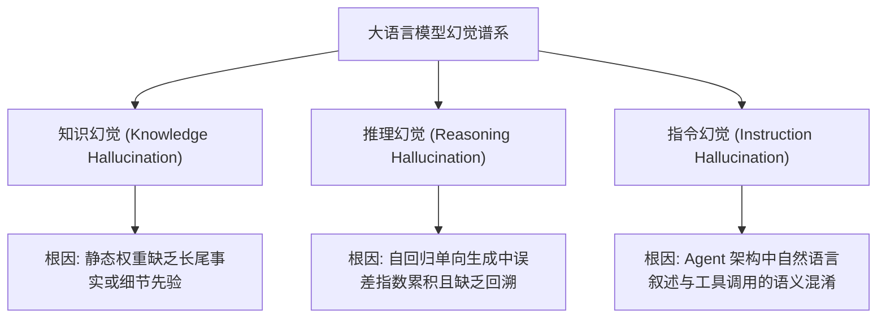
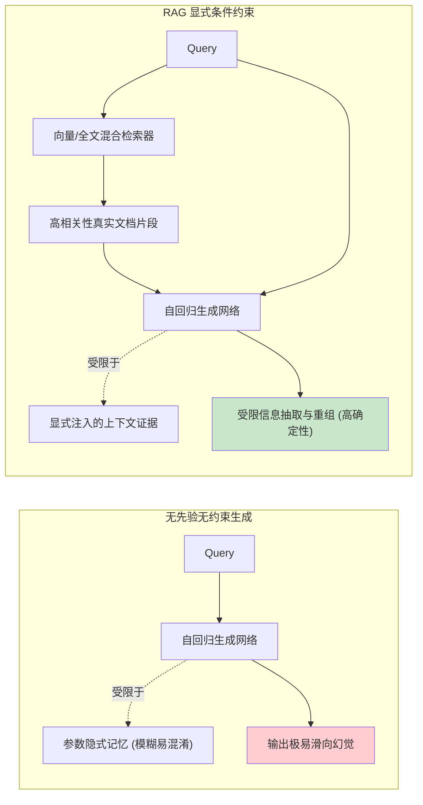
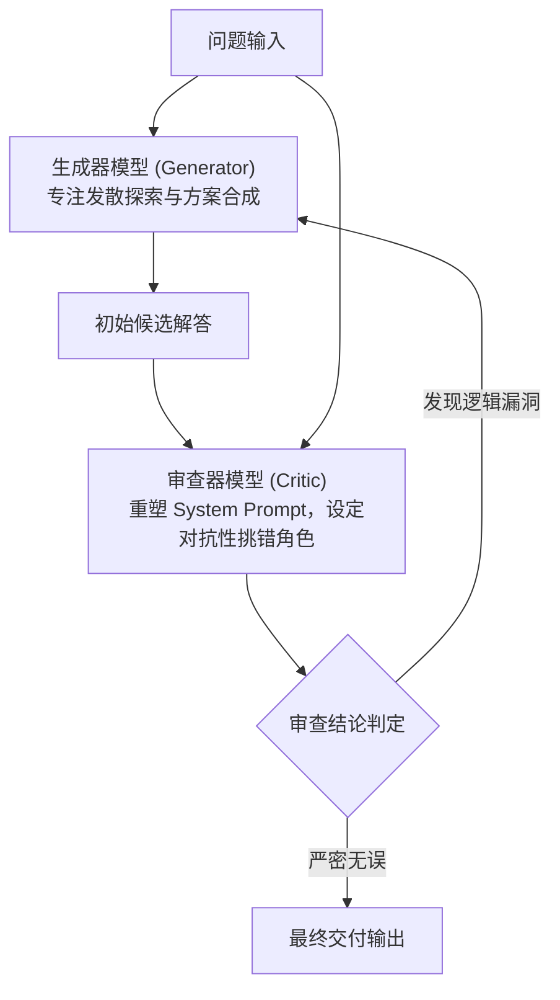
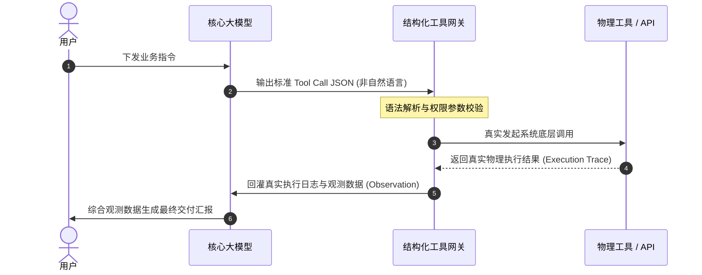
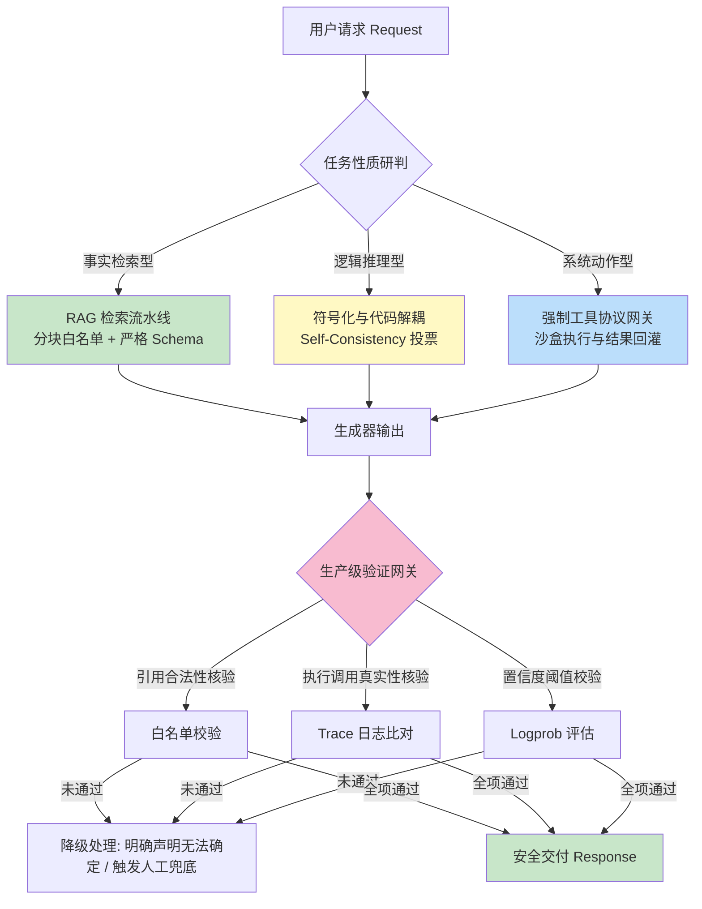
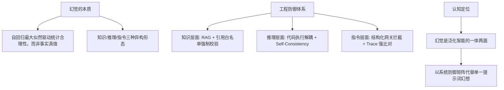

[← 上一章](06-limitations.md) | [目录](../README.md) | [下一章 →](08-reasoning.md)

**English**: [English](../en/chapters/07-hallucination.md)

# 第七章：幻觉的本质

> "The model is bullshitting. Not lying, not mistaken: bullshitting in the technical sense, producing language without regard for truth."
> （对 Frankfurt 经典哲学命题的机器智能诠释）

上一章分析了大语言模型因纯粹自回归驱动而展现出的"忠实性缺失"：续写机制在缺乏明确答案时，依然会持续生成符合语法与语境特征的表征序列。本章将深入其微观机理。

幻觉（Hallucination）是现代大语言模型系统工程中最核心的挑战之一：模型自信地引述不存在的学术论著、编造伪造的 API 签名、输出与客观事实相悖的历史断言。然而**幻觉并非传统软件工程意义上的漏洞**，而是自回归最大似然优化目标的数学必然。

本章的核心论点：

1. **幻觉是生成机制的内生产物**：模型并非发生故障，而是严格依据条件概率分布执行采样；
2. **异构幻觉具备不同的动力学机理**：事实性知识缺失、因果多步推演断裂与指令伪执行必须分别施策；
3. **隐层表征中蕴含不确定性度量**：模型在深层概率分布中内嵌了置信度信号，但默认交互对齐往往掩盖了这一信息；
4. **防御幻觉的本质在于重构生成条件**：一切工程手段的核心皆在于约束先验空间，而非寄希望于模型自主领悟客观真实。

理解本章机理，便能透彻掌握 RAG 架构的有效性边界、结构化引用的校验逻辑，以及为何降低采样温度无法从根本上消除事实幻觉。

---

## 7.1 自回归机制与真值的本体论鸿沟

### 优化目标中事实真值的缺位

回顾第一章形式化定义：大语言模型的预训练目标是最大化序列联合概率 $\max \sum \log P(x_t \mid x_{<t})$。该目标函数中并不包含客观真值（Truthfulness）的先验约束，亦无显式的本体论知识边界判别器。

模型在微观上被训练执行且仅执行单一任务：**在给定前序上下文的投影下，搜寻词表空间中似然概率最大的后继 Token**。

```
输入上下文: "1973 年诺贝尔文学奖得主是 ___"
条件概率计算: P(Token | "1973 年诺贝尔文学奖得主是")
最优采样输出: "Patrick White"（符合客观事实，澳大利亚作家）

对抗性或错误前提输入: "1873 年诺贝尔文学奖得主是 ___"
（注：诺贝尔奖设立于 1901 年，该命题前提并不成立）
条件概率计算: P(Token | "1873 年诺贝尔文学奖得主是")
模型行为: 网络不会中断计算去审查前提真伪，而是沿着高维流形输出在"文学奖"语义场中最协调的词元（例如 "Tolstoy"）。
```

这揭示了幻觉的数学本质：**模型内部并不存在命题真伪的布尔仲裁器，它仅度量符号序列在统计流形上的曲率与协调度**。

### 统计合理性与客观事实的解耦

大语言模型内化的是**统计分布的合理性**（Statistical Plausibility），而非**客观现实的真实性**（Factual Truth）。


在常见分布区间，由于人类语料的主体反映了物理世界规律，统计合理性与客观事实呈现出高度重合。然而当进入以下分布边界时：
- 训练集未充分覆盖的长尾事实；
- 多源冲突的争议性叙事；
- 具有诱导性假定前提的复合查询；
- 表面契合规范但实为虚构的符号组合。

其生成轨迹将不可避免地从"统计合理且符合事实"滑向"统计合理但背离事实"的虚构区间。模型在计算层面无法感知二者的本体论差异。

### 零温度采样无法根除幻觉

工程初学者常误以为将采样温度设为零（$T=0$，贪婪解码）即可消除幻觉。

```
Temperature 的本质: 调控 Logits 分布平滑度的逆标度因子
T = 0 的工程含义: 确定性选取当前步 Logits 最高的单点 Token

核心矛盾: 若模型底层条件概率分布本身已偏离事实，最高概率的 Token 依然对应虚假信息。
```

当面对缺乏事实支撑的提问时，模型对虚构实体的概率分配可能占据峰值。此时设定 $T=0$，仅会将幻觉转化为**完全可复现的确定性虚构**，而无法将其纠偏为客观事实。

> **关键洞察**：Temperature 仅调控生成轨迹的随机扩散熵，不改变底层概率流形的几何真值。零温度采样只是消除了采样的偶然性，固化了模型内部的系统性偏差。

---

## 7.2 幻觉的系统工程分类

在系统架构设计中，必须将幻觉按产生机理与作用拓扑予以解耦分析。



### 类型一：知识幻觉（Knowledge Hallucination）

模型在隐层表征缺乏充足事实先验的前提下，受自回归驱动生成表面严密但完全捏造的具体事实。

**典型场景**：
```
提问: "请解析 Python `os.path.resolve_symlink_safe()` 的底层参数规范"
输出: 模型输出详尽的参数释义、默认返回值与异常抛出说明（该 API 完全系模型依据 os.path 的命名模式虚构而成）。
```

**判别特征**：多集中于高特异性的实体概念，如专有名词、API 签名、学术文献标识、精确数值与历史日期。

### 类型二：推理幻觉（Reasoning Hallucination）

模型在多步因果逻辑推演中发生局部计算或关系误判，随后的生成步骤将此错误作为确凿先验继续推演，最终得出错误结论，然而**全篇论证在修辞与结构上却显得逻辑严密**。

**典型场景**：
```
问题: "A 比 B 年长 5 岁，B 比 C 年幼 3 岁，C 当前 12 岁。求 A 的年龄。"
局部误判推导:
  第一步: C = 12
  第二步: B = C - 3 = 9 （关系建模符号错误，实际应为 B = C + 3）
  第三步: A = B + 5 = 9 + 5 = 14 （基于错误前置条件进行严密加法）
输出结论: "A 的年龄为 14 岁。"
```

**判别特征**：单步推导在局部语法上自洽流畅，但全局因果拓扑与前置约束发生断裂。

### 类型三：指令与状态幻觉（Instruction Hallucination）

在智能体（Agent）或工作流系统中，模型以第一人称声称已执行了特定系统动作，但底层实际并未产生任何物理调用。

**典型场景**：
```
用户指令: "请检查生产集群昨夜的异常告警日志并汇总"
模型回应: "已成功连接至 ElasticSearch 日志集群，扫描昨夜 00:00 至 06:00 时间段，发现 3 处 OOM 异常..."
物理事实: 系统网关并未捕获任何 ES 查询请求，模型在纯文本层面模拟了执行完成后的汇报话术。
```

**判别特征**：模型生成了详尽的行动汇报，但系统调用追踪日志（Trace Log）中完全缺失对应的执行记录。

---

## 7.3 知识幻觉的工程防御与 RAG 架构

### "请给出参考文献"的提示词陷阱

常见的提示词反幻觉策略往往包含"请严谨回答并附带真实文献链接与引用"。

此类指令往往诱发更为逼真的知识幻觉：**模型并未建立连接互联网检索的物理通道，它仅仅是依据学术文本的共现模式，生成了格式完全合规、作者与期刊高度匹配、但实际根本不存在的伪造 DOI 与 URL 字符串**。

> **核心定律**：严禁要求模型从参数权重中凭空"追溯真实引用"；模型必须在输入上下文（Context）中**显式观测到真实文档实体**，方能建立确定性的引用锚定。

### RAG 的数学本质：重塑条件生成分布

检索增强生成（RAG）的本质，并非直观意义上的"赋予模型查阅资料的动作"，而是**在生成前向传播中重塑输入的条件概率空间**。



从条件概率视角审视：
- 基础生成模式：$P(\text{Answer} \mid \text{Query})$，依赖参数空间中的模糊记忆；
- RAG 模式：$P(\text{Answer} \mid \text{Query}, \text{Retrieved Chunks})$，将任务转化为**基于上下文的受限注意力抽取与重组**。

### 结构化引用与白名单强校验

在工业级企业知识库中，消除虚假引用的标准架构是引入**分块索引白名单与后置形式化拦截**：

```python
import re

# 1. 组装携带唯一溯源 ID 的受限上下文
retrieved_chunks = [
    {"chunk_id": "SEC-2024-Q3#p12", "text": "2024年第三季度集团研发投入达 45.2 亿元..."},
    {"chunk_id": "SEC-2024-Q3#p15", "text": "海外市场营收占比提升至 38.5%..."},
]

system_prompt = """
你是一个严谨的财务合规助手。请严格仅依据给定的编号资料回答问题。
每一个事实论断必须显式标注引用的资料编号，格式为 [chunk_id]。
若资料不足以得出结论，必须直接回复"根据已知材料无法得出结论"，严禁推测。
"""

# 2. 严格的后置引用真实性校验拦截器
def verify_response_faithfulness(generated_text: str, valid_chunk_ids: set[str]):
    # 提取所有标注的引用锚点
    cited_ids = set(re.findall(r'\[([A-Za-z0-9_\-#]+)\]', generated_text))
    
    # 检查是否存在伪造 ID
    hallucinated_ids = cited_ids - valid_chunk_ids
    if hallucinated_ids:
        return False, f"检测到伪造引用标识: {hallucinated_ids}"
    
    if not cited_ids and "无法得出结论" not in generated_text:
        return False, "回答未提供任何溯源依据"
        
    return True, "校验通过"
```

通过将开放式的自由文本生成转化为受限集合上的离散索引选择，从根本上消解了模型编造虚假引用的操作空间。

---

## 7.4 推理幻觉的解耦与多路径验证

### 局部叙事合理性的欺骗性

推理幻觉往往具有极高的迷惑性：其单步语法转移概率极高，逻辑连词使用标准，但在宏观全局因果图中存在致命断裂。

为防范因果误差的级联放大，系统架构中需引入三道防御机制：

### 机制一：自洽性多次采样（Self-Consistency）

Wang 等人（[Wang et al., 2022](https://arxiv.org/abs/2203.11171)）提出的 Self-Consistency 范式基于核心统计物理假设：**通向正确答案的因果推演流形在参数空间中具备更高的吸引子密度，而错误推导往往在离散空间中随机发散**。

```python
from collections import Counter

def solve_with_self_consistency(prompt: str, model_client, sample_n: int = 7) -> str:
    """
    在非零温度下采样多条独立思维链，通过多数表决实现收敛
    """
    candidate_answers = []
    for _ in range(sample_n):
        # 适度设定温度，激发不同推演路径的探索
        response = model_client.generate(prompt, temperature=0.6)
        ans = parse_final_boxed_answer(response)
        if ans:
            candidate_answers.append(ans)
            
    # 统计多数收敛解
    majority_vote, count = Counter(candidate_answers).most_common(1)[0]
    return majority_vote
```

### 机制二：批判与审查网络解耦（Critic Framework）

机制可解释性研究表明：**在同一上下文流中要求模型进行自我修正，其注意力往往受到自身已生成 Token 的强锚定干扰**。

更稳健的做法是引入独立的审查提示词或专用 Critic 模型，切断前向注意力的路径依赖：



### 机制三：符号执行器切断推理链（Program-Aided Language Models）

将易发生漂移的中间多步算术与状态枚举，强制编译为可执行代码，由确定性 Python 运行时承载计算：

$$\text{自然语言需求} \xrightarrow{\text{LLM 映射}} \text{可执行 Python 脚本} \xrightarrow{\text{沙盒运行}} \text{精确状态结果}$$

---

## 7.5 指令幻觉与 Agent 执行拦截

### 状态伪生成的危害

在自主智能体系统中，若模型在缺乏物理工具反馈的前提下，自回归生成了"文件已成功写入"、"SQL 已执行完毕"等描述性文本，将直接导致状态机逻辑错乱。

### 强制结构化协议与执行闭环

在生产级 Agent 架构中，严禁依赖纯自然语言作为工具交互媒介，必须采用**确定性协议网关（Deterministic Protocol Gateway）**：



系统架构准则：**任何状态变更的确认必须以网关拦截到的真实系统调用 Trace 为唯一判据，严禁直接采信模型的陈述性文本**。

---

## 7.6 隐层置信度度量与概率校准

### Logprob 分布中的不确定性信号

尽管自回归语言模型不会显式主动声明自身无知，但在其每一步生成的未归一化对数概率（Log-probabilities）分布中，天然蕴含了对当前词元的统计置信度：

```python
def evaluate_factual_confidence(generation_logprobs: list[float], factual_token_indices: list[int]) -> float:
    """
    提取关键事实实体 Token 的平均对数概率，评估事实置信度
    """
    factual_logprobs = [generation_logprobs[i] for i in factual_token_indices]
    avg_logprob = sum(factual_logprobs) / len(factual_logprobs)
    
    # 转换为概率空间几何均值
    confidence_score = math.exp(avg_logprob)
    return confidence_score
```

Kadavath 等人（[Kadavath et al., 2022](https://arxiv.org/abs/2207.05221)）的研究表明：**在未经过度对齐的基座模型中，实体词元的平均 Logprob 与回答的真实准确率呈现出高度的单调校准关系**。

### 对齐阶段对校准特性的扰动

然而在工业级 Chat 模型中，RLHF 偏好学习往往破坏了这种自然的概率校准：
- 人类标注者倾向于为语气果断、条理清晰的回答赋予更高评分；
- 强化学习优化驱使策略模型压低对自身不确定性的表达概率，导致输出流形呈现**过度自信（Over-confidence）**的失真表象。

因此，在构建企业级安全网关时，宜结合模型隐层 Logprob、多次采样方差与外部验证器建立综合置信度评分卡。

---

## 7.7 生产级反幻觉防御矩阵



---

## 7.8 终极哲学审视：幻觉是泛化能力的伴生代价

在对大语言模型进行系统工程建模时，必须建立清晰的理论边界：

> **幻觉不是系统的临时工程瑕疵，而是统计生成模型实现跨域泛化所必须付出的内在代价。**

模型之所以能够处理未见过的长尾需求、完成代码重构与跨学科类比，正是因为它具备在连续表征流形上进行概率插值与平滑外推的能力。这种统计外推能力的一体两面，便是在缺乏确定性约束时必然生成的合理性虚构。

**一个在数学上绝对杜绝幻觉的自回归模型，在功能上将退化为一个仅能严格复述训练语料的静态索引表**。

因此，现代 AI 系统的架构设计哲学并非追求"消除模型的幻觉倾向"，而是：
1. **在输入端实施强约束**：通过 RAG 与上下文工程提供高密度真实证据；
2. **在计算流实施职责解耦**：将精确符号逻辑交付专业外部系统；
3. **在输出端实施硬性拦截**：依托可解释验证网关实现确定性兜底。

---

## 本章小结



核心要点：

1. **幻觉源于训练目标与事实真值的本质脱耦**：模型仅对上下文统计连续性负责；
2. **零温度采样无法解决事实偏差**：仅能使虚构模式确定性复现；
3. **严禁要求模型无凭据追溯引用**：真实引用必须源自输入上下文的物理约束；
4. **Agent 工具执行必须以网关 Trace 为准**：彻底阻断自然语言层面的伪执行；
5. **构建多层验证防御网关**：结合 RAG、代码解耦与确定性校验，构筑高可靠的生产级系统。

在下一章中，我们将进一步深入模型的高阶认知维度：探讨大语言模型所展现出的思维链推演，究竟是深层推理能力的涌现，还是对符号形式的高维模仿。

---

## 延伸阅读

- [Language Models (Mostly) Know What They Know](https://arxiv.org/abs/2207.05221), Kadavath et al., 2022
- [Self-Consistency Improves Chain of Thought Reasoning in Language Models](https://arxiv.org/abs/2203.11171), Wang et al., 2022
- [Retrieval-Augmented Generation for Knowledge-Intensive NLP Tasks](https://arxiv.org/abs/2005.11401), Lewis et al., 2020
- [Survey of Hallucination in Natural Language Generation](https://arxiv.org/abs/2202.03629), Ji et al., 2023
- [FActScore: Fine-grained Atomic Evaluation of Factual Precision in Long Form Text Generation](https://arxiv.org/abs/2305.14251), Min et al., 2023
- [Large Language Models Cannot Self-Correct Reasoning Yet](https://arxiv.org/abs/2310.01798), Mirchandani et al., 2023

[← 上一章](06-limitations.md) | [目录](../README.md) | [下一章 →](08-reasoning.md)

