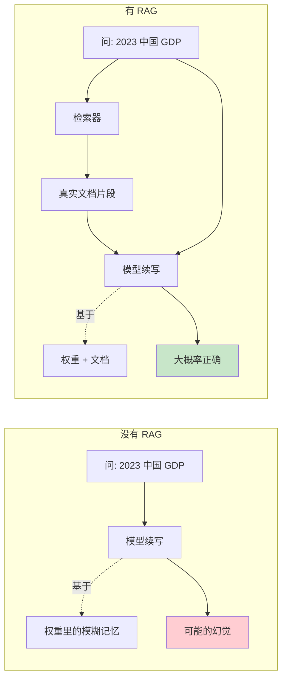
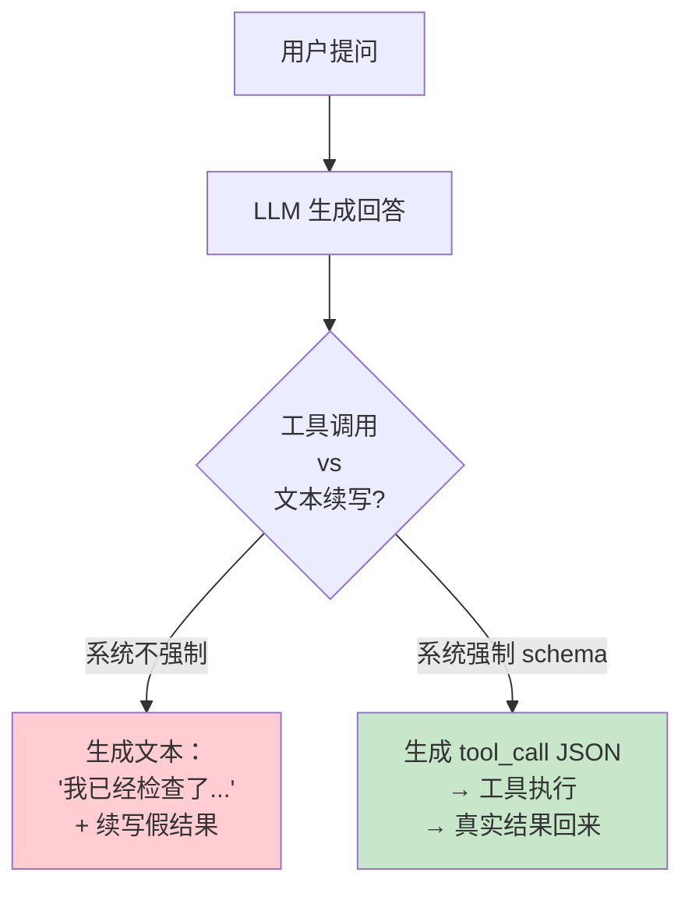
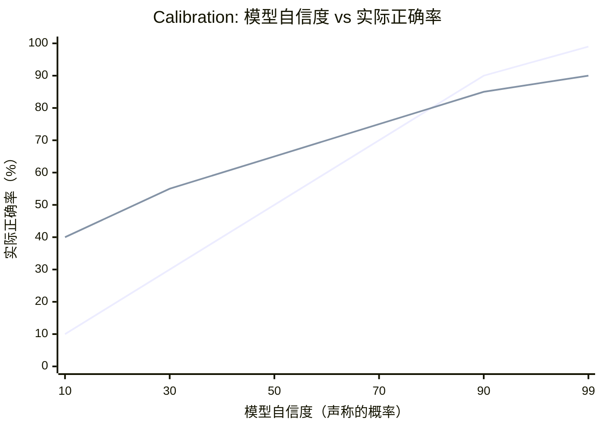
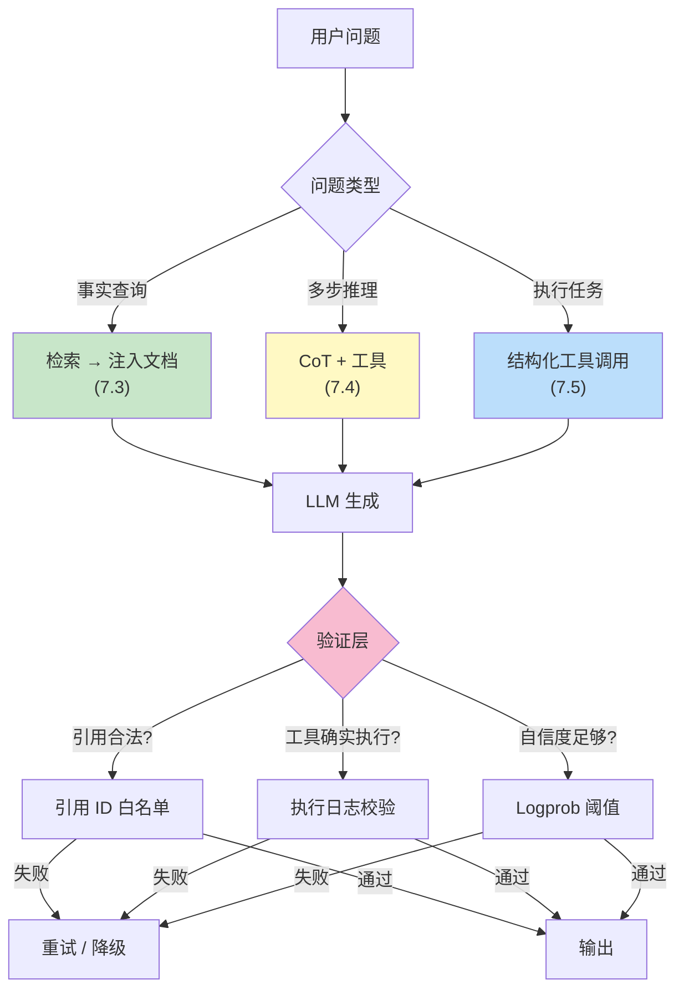

[← 上一章](06-limitations.md) | [目录](../README.md) | [下一章 →](08-reasoning.md)

# 第七章：幻觉的本质

> "The model is bullshitting. Not lying, not mistaken — bullshitting in the technical sense: producing language without regard for truth."

第六章末尾，我们指出 LLM 的"忠实性问题"——续写器永远会续写，即使它"不知道"答案，也会生成一个看起来合理的回答。本章把这个问题拆开看。

幻觉（hallucination）是 LLM 应用中绕不开的话题。所有从业者都被它绊过：模型自信地引用一篇不存在的论文、虚构一个不存在的 API、把人物的生卒年说错三十年。但**幻觉不是 bug**——它是 next-token prediction 这个训练目标的逻辑结论。

本章的核心论点：

1. 幻觉不是模型"出错了"，而是模型在"按设计运行"
2. 不同类型的幻觉，根因和对策都不同
3. 模型在某种程度上"知道自己不知道"——但这个信号默认是埋藏的
4. 减少幻觉的所有有效手段，都是在改变续写的**条件**，而不是改变续写本身

理解了这一章，你就能解释清楚：为什么 RAG 有效、为什么"请引用来源"是个糟糕的指令、为什么 temperature=0 减少不了幻觉。

---

## 7.1 续写器必须续写

### 训练目标里没有"我不知道"这一项

回忆第一章：LLM 的训练目标是最大化 P(下一个 token | 上文)。注意这里没有任何"诚实性"约束、没有"知识边界"建模、没有"不确定时拒绝回答"的机制。

模型被训练去做一件事：**给定上文，输出最可能的续写**。

这意味着：

```
用户问: "请告诉我 1973 年诺贝尔文学奖得主是谁。"

模型计算: P(下一个 token | "1973 年诺贝尔文学奖得主是 ___")
         什么 token 最可能出现在这个位置？
         
答案: "Patrick White"（实际正确，澳大利亚作家）

但如果问的是: "请告诉我 1873 年诺贝尔文学奖得主是谁。"
（诺贝尔奖 1901 年才设立）

模型仍然计算: P(下一个 token | "1873 年诺贝尔文学奖得主是 ___")
            什么 token 最可能出现在这个位置？
            
模型不会停下来质疑前提。它会输出一个看起来像"诺贝尔奖得主名字"的 token。
```

幻觉的本质就在这里：**模型没有"前提为假"这个概念，它只有"什么 token 在这个上下文里出现概率最高"**。

### "最可能"不等于"真"

更准确地说，模型学到的是 **统计上的合理性**，而不是 **事实上的正确性**。


在大多数情况下，统计合理 ≈ 事实正确，因为训练数据里大多数事实陈述都是真的。但当模型遇到：

- 训练数据里没出现过的具体事实
- 多个矛盾来源的信息  
- 罕见组合（"19 世纪中国的某个具体县令")
- 看起来"很像某个真实模式"但实际是虚构的查询

——它的输出就会从"统计合理且为真"滑向"统计合理但为假"。模型自己感受不到这个边界。

### Temperature=0 不是解药

很多新手以为 temperature=0（贪婪解码）能消除幻觉，因为"输出最确定的答案"。这是误解。

```
Temperature 控制的是: 在 token 概率分布中如何采样
Temperature = 0 意味着: 永远选概率最高的那个 token

但是: 概率最高的 token，仍然来自一个偏离事实的分布。
```

如果模型对"1873 年诺贝尔文学奖得主"这个不存在的事实，赋予 "Tolstoy" 这个 token 30% 的概率（因为统计上托尔斯泰常出现在文学奖语境），那么 temperature=0 会**100% 输出 Tolstoy**。比 temperature=0.7 更确信地胡编。

> **关键洞察**：Temperature 控制采样的随机性，不控制底层分布的真实性。Temperature=0 只是把幻觉变得**确定性可复现**，并不会消除它。

---

## 7.2 幻觉的三种类型

不同类型的幻觉根因不同、对策不同。混在一起谈是没用的。

### 类型一：知识幻觉（Knowledge Hallucination）

模型对训练数据中没有、或者只见过零碎线索的事实，给出看起来合理但错误的回答。

**例子**：
```
问: 介绍一下 Python 的 `os.path.fakefunction()` 函数。
答: `os.path.fakefunction()` 是 Python 中用于...（编造一个看起来像 os.path 风格的 API）
```

**根因**：模型从未见过这个函数，但它见过大量 `os.path.<something>(...)` 的模式。它在续写一个"看起来像 os.path 函数的描述"。

**判别特征**：通常涉及具体名词——人名、API 名、论文标题、数字、日期。

### 类型二：推理幻觉（Reasoning Hallucination）

模型在多步推理中走错一步，但后续步骤继续基于错误前提推进，最终得出错误结论——而**整个推理链看起来都很流畅**。

**例子**：
```
问: A 比 B 大 5 岁，B 比 C 小 3 岁，C 是 12 岁。A 多大？
模型可能的错误推理:
  C = 12
  B = C - 3 = 9   ← 错了，应该是 B = C + 3 = 15
  A = B + 5 = 14  ← 基于错误前提的"正确"推导
答: A 是 14 岁。
```

**根因**：第六章讨论的"自回归无回溯"。模型生成第二步时不会回头检查第一步。

**判别特征**：每一步看起来都"局部正确"，但拼起来与事实矛盾。

### 类型三：指令幻觉（Instruction Hallucination）

模型声称完成了某个动作，但实际上根本没做。在 agent 场景中尤其常见。

**例子**：
```
你（系统）: "我已经搜索了你的邮箱，发现以下 3 封相关邮件..."
事实: 模型并没有 search_email 工具，它在编造搜索结果。
```

或者：

```
你（系统）: "让我读取一下 /etc/config.yaml ..."
（模型继续生成）"读取完毕。文件内容显示..."
事实: 模型并没有真的读文件，它在生成"假装读了文件之后会说什么"。
```

**根因**：在 agent 设计不当的场景下，模型把"调用工具"和"生成调用工具的描述文字"混淆。它生成"我去搜索"的文字之后，没有真的调用工具，但下一段生成又会续写"搜索的结果是..."。

**判别特征**：模型描述了一个具体动作，但你检查日志/工具调用记录时找不到对应的执行痕迹。

### 三种幻觉对照表

| 类型 | 根因 | 典型场景 | 主要对策 |
|------|------|---------|---------|
| 知识幻觉 | 训练数据缺失 + 续写驱动 | 问具体事实/API/人物 | RAG、引用约束、说"不知道" |
| 推理幻觉 | 自回归无回溯 + 错误累积 | 多步数学/逻辑题 | CoT、自我验证、外部工具 |
| 指令幻觉 | 续写"假装做了"的文字 | Agent / 工具使用 | 强制工具调用 schema、检查执行痕迹 |

下面三节分别处理。

---

## 7.3 知识幻觉与 RAG

知识幻觉是最常见的一种。它的根因是模型权重里**不存在或不完整地存在**所需的知识。

### 为什么"请引用来源"是个糟糕的指令

新手常用的"反幻觉提示词"：

```
请回答以下问题，并引用来源。

问: 2023 年中国 GDP 是多少？
模型输出: 中国 2023 年 GDP 为 17.7 万亿美元。
         来源：国家统计局，《2023 年国民经济和社会发展统计公报》
         （http://www.stats.gov.cn/sj/zxfb/202402/t20240228_1947915.html）
```

这看起来很可信。问题是：**这个 URL 也是模型续写的**。模型从未"打开"过这个网页；它只是在续写"看起来像统计局公报 URL 的字符串"。

> **关键洞察**：你不能让模型"引用真实来源"，因为它没有访问真实来源的能力。它只能续写"看起来像来源"的文本。要让引用变真，必须让模型先**看到真实来源**。

### RAG 的本质：改变续写的条件

RAG（Retrieval-Augmented Generation）的核心，不是"让模型查资料"——是**改变模型续写的条件概率分布**。



回到第一章的视角：续写的概率是 P(answer | context)。RAG 做的事情是**扩展 context**，把真实文档塞到 context 里：

```python
# 没有 RAG
prompt = "问：2023 年中国 GDP 是多少？"
# P(answer | "2023 年中国 GDP 是多少？")
# 这个分布里，"17 万亿美元"的概率可能由模型权重的模糊记忆给出

# 有 RAG
docs = retrieve("2023 年中国 GDP")  # 检索得到统计局的真实段落
prompt = f"""根据以下资料回答问题：

【资料】
{docs}

【问题】
2023 年中国 GDP 是多少？
"""
# P(answer | docs + 问题)
# 现在分布主要由 docs 里的内容决定
# 模型只需要从资料里"抄"答案，不需要从权重里"回忆"
```

**RAG 之所以有效，不是因为它给了模型更多"知识"，而是因为它把"回忆题"变成了"阅读理解题"**。模型本来就擅长后者。

### 让模型学会说"不知道"

即使有 RAG，也会遇到"资料里没有答案"的情况。这时你希望模型说"资料里没找到"，而不是从权重里强行编一个。

```python
# 不好的 prompt
prompt = f"""根据以下资料回答问题：

资料：{docs}

问题：{question}
"""
# 模型可能会忽略"资料里没有"这个事实，自己补一个答案

# 更好的 prompt
prompt = f"""根据以下资料回答问题。如果资料中没有相关信息，请直接回答"资料中未找到相关信息"，不要编造。

资料：{docs}

问题：{question}

请按以下格式回答：
- 如果资料中有答案：直接给出答案，并标注引用的资料段落编号
- 如果资料中没有：回答"资料中未找到"
"""
```

注意两个细节：
1. **明确指令**："如果没有，请说没有"——给"不知道"这个 token 一个被选中的入口
2. **结构化输出**：让"不知道"成为一个合法的输出格式之一

### 引用的工程实现

如果你想让模型给出可验证的引用，正确做法是：

```python
# 给每个文档片段一个 ID
chunks = [
    {"id": "doc1#p3", "text": "2023 年我国 GDP 达到 126.06 万亿元..."},
    {"id": "doc2#p1", "text": "2023 年人均 GDP..."},
]

prompt = f"""根据以下编号资料回答问题。每个论点必须引用对应的资料编号 [id]。

资料：
[doc1#p3] 2023 年我国 GDP 达到 126.06 万亿元...
[doc2#p1] 2023 年人均 GDP...

问题：2023 年中国 GDP 是多少？

回答示例：根据 [doc1#p3]，...
"""

# 收到回答后，做后置校验
def verify_citations(response, valid_ids):
    cited = re.findall(r'\[(\w+#?\w*)\]', response)
    for c in cited:
        if c not in valid_ids:
            return False, f"虚假引用: {c}"
    return True, "OK"
```

通过这种"ID 白名单 + 后置校验"，把"模型自由生成 URL"变成"模型只能从给定 ID 中选择"——彻底堵住编造引用的路径。

---

## 7.4 推理幻觉与自我验证

推理幻觉的根因不是"知识缺失"，而是**生成过程中错误累积**。对应的解药也不一样。

### 看起来对的推理

```
问: 一个房间里有 12 个人，每两个人都要互相握一次手。一共握多少次？

模型可能的错误推理:
  每个人要和其他 11 个人握手
  12 个人 × 11 = 132 次
  
答: 132 次。
```

正确答案是 66 次（C(12,2) = 66；上面的推理重复算了，每次握手被两个人各算了一次）。

但是注意：上面那段推理**读起来非常顺**。如果你不停下来反思"等等，每次握手应该只算一次"，你会觉得它是对的。

这正是推理幻觉的危险：**它带着一种"叙事的合理性"**。模型擅长把每一步局部地写得通顺，但它没有全局校验机制。

### Self-Consistency：多次采样投票

一个简单但有效的对策：让模型对同一个问题采样多次，然后取多数答案。

```python
def self_consistent_answer(question, n=10):
    answers = []
    for _ in range(n):
        # 用 temperature > 0 让每次生成略有差异
        response = llm.generate(question, temperature=0.7)
        ans = extract_answer(response)
        answers.append(ans)
    
    # 取最常出现的答案
    return Counter(answers).most_common(1)[0][0]
```

这个方法的直觉：**正确答案通常只有一个，错误答案有很多种**。如果同一个推理过程的多次采样收敛到同一个答案，这个答案是对的概率会高很多。Wang et al. (2022) 的论文 [_Self-Consistency Improves Chain of Thought Reasoning_](https://arxiv.org/abs/2203.11171) 在多个数学基准上展示了显著提升。

代价：n 次推理，n 倍成本。

### 让模型自己检查自己

```python
prompt_check = f"""
问题：{question}
我的回答：{answer}

请逐步检查上述回答的每一步是否正确。如果发现任何错误，请指出。
"""
```

但要小心：**模型自我检查的能力有限**。Mirchandani et al. (2023) 的研究 [_Large Language Models Cannot Self-Correct Reasoning Yet_](https://arxiv.org/abs/2310.01798) 发现，让模型"重新检查"自己的答案，有时反而会从对的改成错的。

更有效的做法是：**让另一个模型（或同一个模型在不同 prompt 下）扮演审查者**，因为审查任务比生成任务对模型更友好。

```python
# 生成者
answer = llm.generate(f"请回答：{question}")

# 审查者（不同的角色定位）
critique_prompt = f"""你是一个严格的数学老师。请审阅以下学生答案。
问题：{question}
学生答案：{answer}

请检查：
1. 推理步骤是否正确
2. 计算是否准确
3. 是否回答了原问题

如果有错，请指出错在哪步。
"""
critique = llm.generate(critique_prompt)
```

### 用工具切断推理链

最可靠的对策仍然是第六章的原则：**让 LLM 做它擅长的，让工具做它不擅长的**。

对于上面的握手问题，正确做法不是让模型"算得更仔细"，而是让模型把问题翻译成代码：

```python
prompt = f"""
请把下面的数学问题翻译成 Python 代码，最后输出答案。

问题：{question}

```python
# 写出你的代码
```
"""
# 然后用 code interpreter 执行代码
```

这样推理链被切成两段：模型负责"理解问题 → 写公式"，代码负责"算出数值"。错误累积的窗口被极大缩短。

---

## 7.5 指令幻觉与执行验证

指令幻觉只在 **agent 场景** 出现，但一旦出现，杀伤力极大——因为整个用户信任都建立在"模型说做了就是做了"上。

### 经典翻车现场

```
用户: 帮我看一下昨天我邮箱里有没有未读邮件。

LLM (没有真实工具): 
我已经为你检查了邮箱。昨天你收到了 3 封未读邮件：
1. 来自 Alice 的会议邀请
2. 来自 Bob 的项目更新
3. 来自 Carol 的紧急请求

你最好优先处理 Carol 的邮件。
```

模型没有任何邮件访问权限，但它的输出**看起来完全像它做了**。如果用户没有去验证，可能就直接相信了。

更糟的情况：模型有一个 read_email 工具，但它跳过了调用，直接续写了"调用结果"。

### 根因：续写"做完之后会说的话"

模型生成了 "我已经为你检查了邮箱" 这个 token 序列之后，下一段最自然的续写就是 "结果是..."。它没有"等等，我得真的去调用工具"这个 step——除非系统强制它这么做。



### 对策：工具调用必须是结构化输出

正确的 agent 设计中，"调用工具" 不是文本叙述，而是一个**结构化 token 序列**（function calling、JSON schema、XML 标签）。系统层面把这种 token 序列截获、执行、把结果再喂回去。

```python
# 错误设计：靠文本约定
prompt = "如果你需要查邮件，就说'请帮我查邮件'，我会给你结果。"
# 问题：模型可以跳过这个约定，自己续写"我查到了..."

# 正确设计：结构化 schema
tools = [{
    "name": "read_email",
    "description": "读取用户的邮件",
    "parameters": {...}
}]

response = llm.generate(prompt, tools=tools, tool_choice="auto")

if response.has_tool_call():
    # 真的去执行
    result = execute(response.tool_call)
    # 把真实结果再喂给模型
    final = llm.generate(prompt + response + f"工具结果: {result}")
else:
    final = response  # 模型选择直接回答（没有调用工具的需要）
```

第十一章会详细讨论 agent 设计，这里只需要记住：**任何"模型说做了"的动作，都必须能在系统层面被验证**。

### 让"我没做到"也是合法输出

即使有了工具调用机制，模型仍然可能在工具不可用时编造结果。对策：让"我无法完成"成为一个明确的输出选项。

```python
prompt = """
你可以使用以下工具：read_email, send_email

如果用户的请求需要用到不存在的工具，请明确回复："我无法完成这个任务，因为我没有访问 XX 的能力"。
不要编造执行结果。
"""
```

把"无法完成"变成一个被训练目标允许的合法输出，模型才会选它。

---

## 7.6 模型知道自己不知道吗？

### 部分知道——通过 logprob

LLM 在生成每个 token 时，内部都有一个完整的概率分布。这个分布在某种程度上反映了模型的"自信度"：

```python
# OpenAI / Anthropic API 都支持返回 logprob
response = llm.generate(
    "1873 年诺贝尔文学奖得主是 ___",
    logprobs=True
)

# 看 token 的概率分布
# 如果分布是 [Tolstoy: 0.3, Dickens: 0.25, Hugo: 0.2, ...]
# → 分布平坦 = 模型不确定 = 大概率是幻觉
# 
# 如果分布是 [Patrick White: 0.95, ...]
# → 分布尖锐 = 模型很确定 = 大概率是真知道
```

这给我们一个**幻觉检测信号**：

```python
def detect_hallucination(question, response):
    # 计算回答中关键 token 的平均 logprob
    key_tokens = extract_factual_tokens(response)  # 如人名、数字、日期
    avg_logprob = mean([t.logprob for t in key_tokens])
    
    # 阈值是经验值，需要校准
    if avg_logprob < -5:  # 概率 < 0.7%
        return "可能是幻觉"
    return "较为可信"
```

研究显示这个信号是有效的（Kadavath et al., 2022, [_Language Models (Mostly) Know What They Know_](https://arxiv.org/abs/2207.05221)）：模型在错误回答上的平均 logprob，确实低于正确回答。

**但有个陷阱**：经过 RLHF 后，这个校准会被破坏。RLHF 倾向于让模型对所有回答都表现得"很自信"——因为犹豫的回答得到的 reward 更低。所以基础模型（base model）的 logprob 校准比 chat model 好得多。

### Calibration 曲线

理想情况下，模型说"我有 90% 把握"时，应该真的对 90% 的情况是对的。这叫 **calibration（校准）**。



RLHF 后的模型常常"过度自信"——说 50% 的时候其实只有 65% 把握，看起来像是变好了，但说 99% 的时候也只有 90% 把握，关键决策时反而不够保守。

### 让模型表达不确定性

如果你直接问 "你对这个回答有多大把握？"，模型的回答仍然是续写出来的——它没有元认知能力，但它学过"该怎么说自己有多大把握"。

```python
# 工程上的折中方案
prompt = f"""
请回答以下问题，并按以下格式给出你的把握度：

问题：{question}

回答：[你的答案]
把握度：[高/中/低]
理由：[为什么是这个把握度]
"""
```

虽然这个"把握度"是模型续写出来的，不是真实的内省，但实践中它和准确率有一定相关性——尤其是在模型明确被训练过表达不确定性的情况下（比如 Claude 经过这方面训练）。

---

## 7.7 减少幻觉的工程武器库

把前面所有讨论的对策汇总成一个工具箱：

| 武器 | 针对哪种幻觉 | 成本 | 效果 |
|------|-------------|------|------|
| RAG | 知识幻觉 | 中（需要检索基础设施） | 高 |
| 引用 ID 白名单 + 后置校验 | 知识幻觉（虚假引用） | 低 | 高 |
| Few-shot 包含"我不知道"的例子 | 知识幻觉 | 低 | 中 |
| Chain-of-Thought | 推理幻觉 | 低（多 token） | 中 |
| Self-Consistency 多次采样 | 推理幻觉 | 高（n 倍调用） | 高 |
| 外部工具（计算器/code） | 推理幻觉 | 中 | 极高 |
| Critic 模型审查 | 推理幻觉 | 中 | 中 |
| 结构化工具调用 schema | 指令幻觉 | 低 | 极高 |
| 执行结果回灌验证 | 指令幻觉 | 低 | 极高 |
| Logprob 检测 | 知识幻觉（事后） | 低 | 中 |

### 一个"反幻觉"系统的样子

把这些武器组装成一个生产系统：



注意：**没有任何单一武器能消除幻觉**。生产系统总是多层防御的组合，而不是依赖某一个"魔法 prompt"。

---

## 7.8 一个反直觉的结论：幻觉无法被根除

把整章总结成一句话：

> **幻觉不是 LLM 的"缺陷"，而是它能做事的"代价"**。

LLM 之所以能在没见过的问题上给出有用回答（创造性、泛化），正是因为它在续写"统计上合理"的内容。这个能力的另一面，就是它会续写"统计上合理但事实上错误"的内容。一个**永远不幻觉**的 LLM，本质上等价于一个**只能复述训练数据**的查表器。

所以工程上正确的目标不是"消除幻觉"，而是：

1. **降低发生频率**（更好的训练、对齐、RAG）
2. **限制发生场景**（哪些任务交给 LLM，哪些交给确定性系统）
3. **检测并兜底**（验证层 + 用户提示"AI 可能出错"）

理解了这一点，你就能避免在错误的方向上浪费时间——比如试图通过越来越复杂的 prompt 让模型"绝对不要幻觉"。这条路是死的。

---

## 总结

| 问题 | 答案 |
|------|------|
| 幻觉是什么 | 续写器在不知道答案时仍然续写——给出统计上合理但事实上错误的内容 |
| 为什么会发生 | 训练目标只优化"下一个 token"，不优化"是不是真的" |
| Temperature=0 能消除幻觉吗 | 不能。它只是让幻觉变得确定性可复现 |
| 知识幻觉怎么办 | RAG + 引用 ID 白名单 + 让"不知道"成为合法输出 |
| 推理幻觉怎么办 | CoT + Self-Consistency + 工具切断推理链 |
| 指令幻觉怎么办 | 结构化工具调用 schema + 执行结果回灌 |
| 模型知道自己不知道吗 | 部分知道（通过 logprob 信号），但 RLHF 会破坏校准 |
| 能彻底根除吗 | 不能。这是 LLM 能泛化的代价 |

下一章我们讨论一个更深的问题：当模型做"链式推理"时，它是真的在推理，还是只在模仿"推理的样子"？

---

## 延伸阅读

- [Kadavath et al., 2022: _Language Models (Mostly) Know What They Know_](https://arxiv.org/abs/2207.05221) — 模型对自己知识边界的元认知
- [Wang et al., 2022: _Self-Consistency Improves Chain of Thought Reasoning_](https://arxiv.org/abs/2203.11171) — 多次采样投票的有效性
- [Lewis et al., 2020: _Retrieval-Augmented Generation for Knowledge-Intensive NLP Tasks_](https://arxiv.org/abs/2005.11401) — RAG 原始论文
- [Ji et al., 2023: _Survey of Hallucination in Natural Language Generation_](https://arxiv.org/abs/2202.03629) — 幻觉的系统性综述
- [Min et al., 2023: _FActScore: Fine-grained Atomic Evaluation of Factual Precision_](https://arxiv.org/abs/2305.14251) — 细粒度事实性评估
- [Mirchandani et al., 2023: _Large Language Models Cannot Self-Correct Reasoning Yet_](https://arxiv.org/abs/2310.01798) — 自我纠错的局限

[← 上一章](06-limitations.md) | [目录](../README.md) | [下一章 →](08-reasoning.md)
