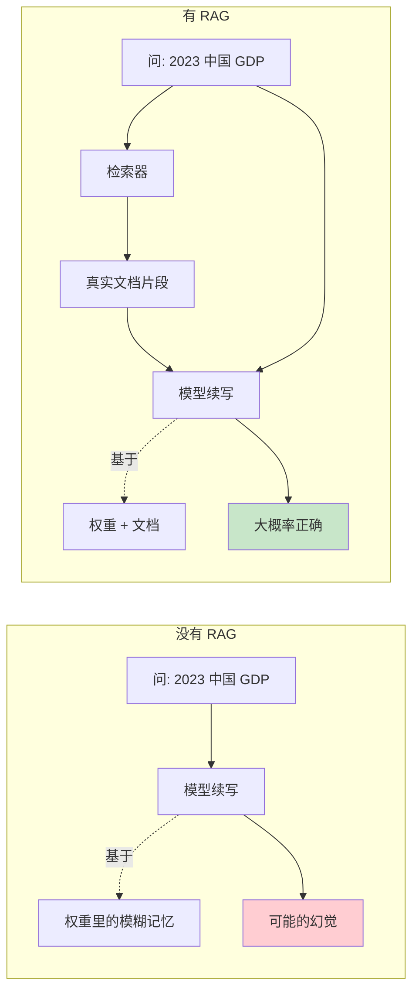
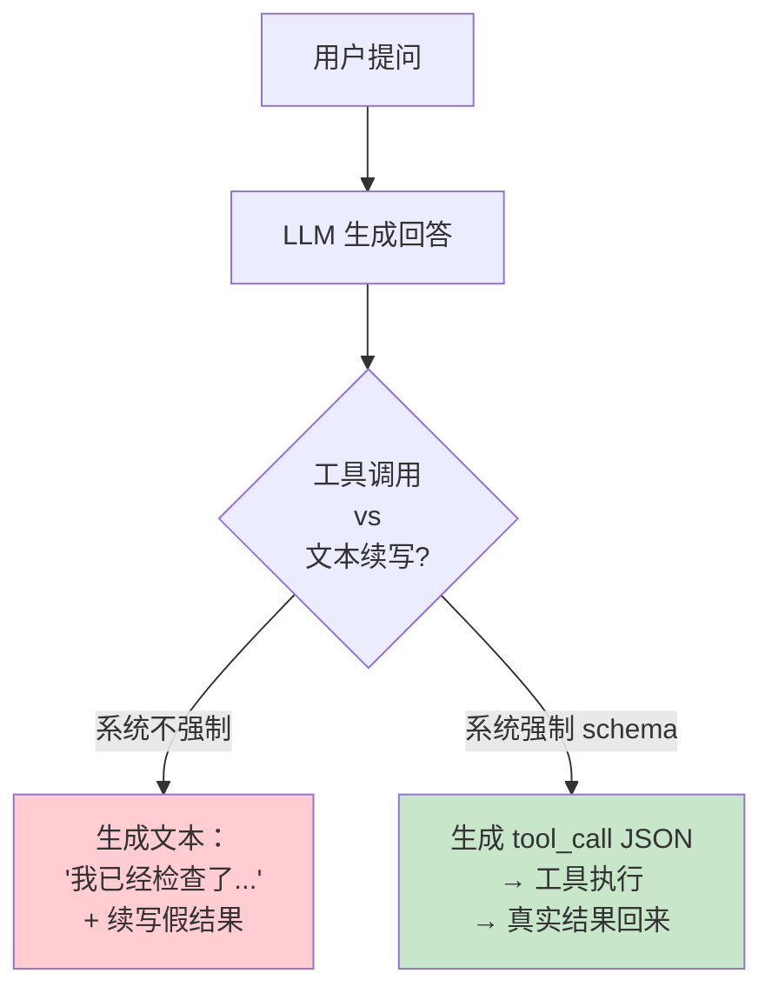
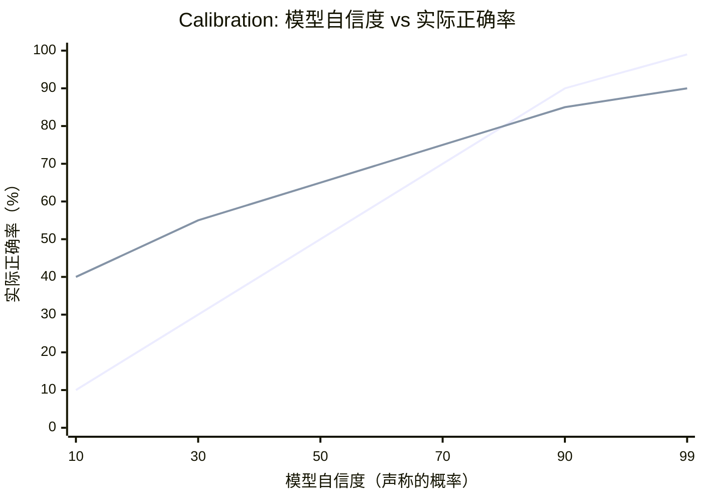
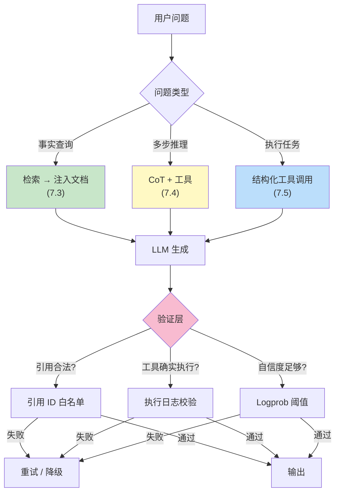

[← 上一章](06-limitations.md) | [目录](../README.md) | [下一章 →](08-reasoning.md)

**English**: [English](../en/chapters/07-hallucination.md)

# 第七章：幻觉的本质

> "The model is bullshitting. Not lying, not mistaken — bullshitting in the technical sense: producing language without regard for truth."

第六章末尾，我们聊过大语言模型的“忠实性问题”。续写器永远在往下写，哪怕自己根本“不知道”答案，也会顺手给出一个看起来挑不出毛病的回答。这一章，我们把这个问题一层层拆开来看。

只要做过 LLM 应用，没有谁没被幻觉（hallucination）绊倒过。模型能极其笃定地引出一篇根本不存在的论文，捏造一套子虚乌有的 API，或者把历史人物的生卒年一口咬错三十年。但幻觉不是 bug，它是 next-token prediction 这个训练目标自然结出的果子。

本章的核心论点：

1. 幻觉不是模型“出错了”，而是模型完全在“按设计运行”
2. 幻觉分好几种，各自的根因与对策并不相通
3. 模型在某种程度上“知道自己不知道”，只是这个信号默认被埋了起来
4. 能压制幻觉的管用手段，都在于改变续写的**条件**，而不是改变续写动作本身

读通了这一章，你就能彻底想明白几件事：为什么 RAG 能真正管用、为什么“请引用来源”是一条糟糕的指令、为什么 temperature=0 根本压不住幻觉。

---

## 7.1 续写器必须续写

### 训练目标里没有“我不知道”这一项

回想第一章讲过的核心逻辑：LLM 的训练目标就是最大化 P(下一个 token | 上文)。这里面找不出任何“诚实性”约束，没有对“知识边界”的刻画，也没有“不确定时拒绝回答”的退出机制。

从头到尾，模型只被训练去做好一件事：给定上文，输出概率最高的续写。

这意味着：

```
用户问: "请告诉我 1973 年诺贝尔文学奖得主是谁。"

模型计算: P(下一个 token | "1973 年诺贝尔文学奖得主是 ___")
         什么 token 最可能出现在这个位置？
         
答案: "Patrick White"（实际正确，澳大利亚作家）

但如果问的是: "请告诉我 1873 年诺贝尔文学奖得主是谁。"
（诺贝尔奖 1901 年才设立）

模型仍然计算: P(下一个 token | "1873 年诺贝尔文学奖得主是 ___")
            什么 token 最可能出现在这个位置？
            
模型不会停下来质疑前提。它会输出一个看起来像"诺贝尔奖得主名字"的 token。
```

幻觉的根子就在这里：模型根本没有“前提为假”的概念，它唯一的衡量标准，就是“在这个上下文里，哪个 token 的出现概率最高”。

### “最可能”不等于“真”

说得更确切些，模型学到的是统计上的合理性，而不是事实上的正确性。


多数时候，统计合理确实约等于事实正确，毕竟训练语料里的大部分事实陈述本来就是真的。可一旦模型碰上下面这些情况：

- 训练数据里未曾收录的具体事实
- 来源相互冲突的矛盾信息
- 极其罕见的组合（“19 世纪中国的某个具体县令”）
- 看起来符合真实模式、实际却凭空捏造的查询

在这些关口，它的输出就会不知不觉从“统计合理且为真”，一路滑向“统计合理但为假”。至于这道边界划在哪里，模型自己根本无从知晓。

### Temperature=0 不是解药

不少初学者误以为把 temperature 设为 0（也就是贪婪解码）就能根除幻觉，觉得这样就能逼模型“输出最确定的答案”。这完全是一种误解。

```
Temperature 控制的是: 在 token 概率分布中如何采样
Temperature = 0 意味着: 永远选概率最高的那个 token

但是: 概率最高的 token，仍然来自一个偏离事实的分布。
```

就拿那个根本不存在的“1873 年诺贝尔文学奖得主”来说，假如模型给“Tolstoy”这个 token 分配了 30% 的概率（只因托尔斯泰的名字在统计上总跟文学奖挨在一起），那么在 temperature=0 时，它就会 100% 输出 Tolstoy。比起 temperature=0.7，它只是在用更笃定的语气胡编乱造。

> **关键洞察**：Temperature 调节的只是采样的随机程度，管不到底层分布是否符合事实。Temperature=0 不过是让幻觉变得可以确定性复现，丝毫没有消除它。

---

## 7.2 幻觉的三种类型

不同类型的幻觉，成因各异，解法也完全不同。把它们混为一谈，根本理不出头绪。

### 类型一：知识幻觉（Knowledge Hallucination）

面对训练数据里完全没有、或是只见过零碎影子的事实，模型硬是给出了一个听起来合理、实则完全错误的答复。

**例子**：

```
问: 介绍一下 Python 的 `os.path.fakefunction()` 函数。
答: `os.path.fakefunction()` 是 Python 中用于...（编造一个看起来像 os.path 风格的 API）
```

**根因**：模型从来没见过这个函数，但它在海量语料里见过无数 `os.path.<something>(...)` 的模样。它所做的一切，无非是顺着惯性，续写一段“看着很像 os.path 风格的函数说明”。

**判别特征**：这类问题往往落脚在具体名词上，比如人名、API 名称、论文标题、数字或是确切日期。

### 类型二：推理幻觉（Reasoning Hallucination）

模型在多步推演里走偏了一步，接下来的每个环节却继续踩着这个错误的前提往前推，最后得出一个荒谬的结论，而整条推演链条读起来竟然挑不出逻辑破绽。

**例子**：

```
问: A 比 B 大 5 岁，B 比 C 小 3 岁，C 是 12 岁。A 多大？
模型可能的错误推理:
  C = 12
  B = C - 3 = 9   ← 错了，应该是 B = C + 3 = 15
  A = B + 5 = 14  ← 基于错误前提的"正确"推导
答: A 是 14 岁。
```

**根因**：这正是第六章讨论过的“自回归无回溯”特性。模型在生成第二步时，永远不会回过头去校验第一步是否站得住脚。

**判别特征**：拆开来看，每一步推导都显得“局部正确”，可一旦拼在一起，就与事实南辕北辙。

### 类型三：指令幻觉（Instruction Hallucination）

模型嘴上宣称自己做完了某项操作，实际上却什么都没执行。在智能体（agent）场景里，这种现象尤为多见。

**例子**：

```
你（系统）: "我已经搜索了你的邮箱，发现以下 3 封相关邮件..."
事实: 模型并没有 search_email 工具，它在编造搜索结果。
```

或者：

```
你（系统）: "让我读取一下 /etc/config.yaml ..."
（模型继续生成）"读取完毕。文件内容显示..."
事实: 模型并没有真的读文件，它在生成"假装读了文件之后会说什么"。
```

**根因**：在 agent 设计不够严密的场合，模型很容易混淆“真正调用工具”与“写出一段调用工具的描述文字”。它在吐出“我去搜索”这几个字之后，并没有实际触发工具，可接下来的续写却自然而然地编出了“搜索到的结果是……”这一套说辞。

**判别特征**：模型绘声绘色地描述了一个具体动作，但你去翻看系统日志或工具调用记录时，却找不到任何执行过的痕迹。

### 三种幻觉对照表

| 类型 | 根因 | 典型场景 | 主要对策 |
|------|------|---------|---------|
| 知识幻觉 | 训练数据缺失 + 续写驱动 | 问具体事实/API/人物 | RAG、引用约束、说“不知道” |
| 推理幻觉 | 自回归无回溯 + 错误累积 | 多步数学/逻辑题 | CoT、自我验证、外部工具 |
| 指令幻觉 | 续写“假装做了”的文字 | Agent / 工具使用 | 强制工具调用 schema、检查执行痕迹 |

接下来的三节，我们分别解决这三种麻烦。

---

## 7.3 知识幻觉与 RAG

在各种各样的幻觉里，知识幻觉碰到的次数最多。根子其实很单纯：回答所需要的知识，在模型权重里压根不存在，或者只留下了残缺的碎片。

### 为什么“请引用来源”是个糟糕的指令

刚上手的人，总喜欢写出这类“反幻觉提示词”：

```
请回答以下问题，并引用来源。

问: 2023 年中国 GDP 是多少？
模型输出: 中国 2023 年 GDP 为 17.7 万亿美元。
         来源：国家统计局，《2023 年国民经济和社会发展统计公报》
         （http://www.stats.gov.cn/sj/zxfb/202402/t20240228_1947915.html）
```

输出看着有模有样，连公报名称和链接都齐齐整整。问题在于这行 URL 同样是模型凭空续写出来的：它从来没打开过任何网页，不过是照着统计局公报网址该有的格式，拼出了一串看起来像那么回事的字符。

> **关键洞察**：你没法命令模型去“引用真实来源”，它根本连不上真实世界，手头只有生成“长得像来源”的本事。真想让引文字字有着落，唯一的办法是先把真实资料端到它眼前。

### RAG 的本质：改变续写的条件

所谓的 RAG（Retrieval-Augmented Generation），骨子里不是让模型去翻书查资料，而是重塑它续写时的条件概率分布。



回到第一章建立的视角，续写的概率始终遵循 P(answer | context)。RAG 的全部机巧，无非是把查到的真实文档硬塞进输入，借此扩充 context 的边界：

```python
# 没有 RAG
prompt = "问：2023 年中国 GDP 是多少？"
# P(answer | "2023 年中国 GDP 是多少？")
# 这个分布里，"17 万亿美元"的概率可能由模型权重的模糊记忆给出

# 有 RAG
docs = retrieve("2023 年中国 GDP")  # 检索得到统计局的真实段落
prompt = f"""根据以下资料回答问题：

【资料】
{docs}

【问题】
2023 年中国 GDP 是多少？
"""
# P(answer | docs + 问题)
# 现在分布主要由 docs 里的内容决定
# 模型只需要从资料里"抄"答案，不需要从权重里"回忆"
```

RAG 的妙处，不在于它凭空塞给了模型多少新知识，而是把闭卷的“回忆题”改成了开卷的“阅读理解”。照着眼前现成的材料找答案，模型向来擅长得多。

### 让模型学会说“不知道”

哪怕用上了 RAG，也总会碰上检索材料里根本没有答案的时刻。这种关头，你更想听它老老实实答一句“资料里没找到”，而不是任由它调动权重里的碎片记忆，硬着头皮胡编乱造。

```python
# 不好的 prompt
prompt = f"""根据以下资料回答问题：

资料：{docs}

问题：{question}
"""
# 模型可能会忽略"资料里没有"这个事实，自己补一个答案

# 更好的 prompt
prompt = f"""根据以下资料回答问题。如果资料中没有相关信息，请直接回答"资料中未找到相关信息"，不要编造。

资料：{docs}

问题：{question}

请按以下格式回答：
- 如果资料中有答案：直接给出答案，并标注引用的资料段落编号
- 如果资料中没有：回答"资料中未找到"
"""
```

这里藏着两个细节：
1. **明确指令**：写明“没有就说没有”，等于在概率分布里给“不知道”这类 token 开辟一条被选中的通路
2. **结构化输出**：把“不知道”直接列为预设的输出格式之一，模型照章办事时便不必为了交差而硬编答案

### 引用的工程实现

想让模型交出经得起核实的引用，在工程上应当这么做：

```python
# 给每个文档片段一个 ID
chunks = [
    {"id": "doc1#p3", "text": "2023 年我国 GDP 达到 126.06 万亿元..."},
    {"id": "doc2#p1", "text": "2023 年人均 GDP..."},
]

prompt = f"""根据以下编号资料回答问题。每个论点必须引用对应的资料编号 [id]。

资料：
[doc1#p3] 2023 年我国 GDP 达到 126.06 万亿元...
[doc2#p1] 2023 年人均 GDP...

问题：2023 年中国 GDP 是多少？

回答示例：根据 [doc1#p3]，...
"""

# 收到回答后，做后置校验
def verify_citations(response, valid_ids):
    cited = re.findall(r'\[(\w+#?\w*)\]', response)
    for c in cited:
        if c not in valid_ids:
            return False, f"虚假引用: {c}"
    return True, "OK"
```

靠着“ID 白名单加后置校验”这套组合，模型不再有随手编造 URL 的自由，只能在给定的 ID 范围里挑选。凭空捏造引用的路，自此被彻底堵死。

---

## 7.4 推理幻觉与自我验证

推理幻觉的病根，不在于知识匮乏，而在于生成过程中的错误累积：推导只要走偏一步，后面的结论就会跟着全盘脱轨。病因变了，对症下药的路子自然也得换。

### 看起来对的推理

```
问: 一个房间里有 12 个人，每两个人都要互相握一次手。一共握多少次？

模型可能的错误推理:
  每个人要和其他 11 个人握手
  12 个人 × 11 = 132 次
  
答: 132 次。
```

正确答案其实是 66 次（即 C(12,2) = 66）。上面那套推导算重了，把两人之间的每一场握手都在两头各算了一遍。

可怪就怪在，上面那段推导读起来丝丝入扣。只要你没停下来琢磨一句“等等，两个人握手只能算一次”，多半就会顺着它的语气信以为真。

推理幻觉最凶险的地方，恰恰在于它披着一层叙事合理性的外衣。模型极擅长把局部的每一步写得合情合理，却偏偏没有通盘校验全局的本事。

### Self-Consistency：多次采样投票

有个简单实用的招数：同一道题让模型反复作答多次，最后清点票数，取出现次数最多的那个答案。

```python
def self_consistent_answer(question, n=10):
    answers = []
    for _ in range(n):
        # 用 temperature > 0 让每次生成略有差异
        response = llm.generate(question, temperature=0.7)
        ans = extract_answer(response)
        answers.append(ans)
    
    # 取最常出现的答案
    return Counter(answers).most_common(1)[0][0]
```

这套做法背后的直觉并不复杂：正确答案往往殊途同归，荒唐的错法却千奇百怪。倘若同一种推导在多次独立采样后收敛到了同一个结论，答对的把握自然高出许多。Wang et al. (2022) 在论文 [_Self-Consistency Improves Chain of Thought Reasoning_](https://arxiv.org/abs/2203.11171) 中做过验证，在多项数学基准测试里，这一招带来了清晰的准确率跃升。

代价很直白：算力账单得翻上 n 倍，毕竟每道题都要结结实实跑满 n 趟推理。

### 让模型自己检查自己

```python
prompt_check = f"""
问题：{question}
我的回答：{answer}

请逐步检查上述回答的每一步是否正确。如果发现任何错误，请指出。
"""
```

不过别高兴太早，大语言模型自我纠错的本事其实相当勉强。Mirchandani et al. (2023) 在论文 [_Large Language Models Cannot Self-Correct Reasoning Yet_](https://arxiv.org/abs/2310.01798) 里指出，催着模型去“复查”自己刚刚给出的推导，非但挑不出毛病，有时反倒会把原本算对的答案改得错漏百出。

更稳妥的办法是换个角色立场：引入另一个模型，或者在同一个模型上套用全新的 prompt，让它专职扮演审查者。挑刺纠错这件事，本身就比漫无边际地从头生成要好办得多。

```python
# 生成者
answer = llm.generate(f"请回答：{question}")

# 审查者（不同的角色定位）
critique_prompt = f"""你是一个严格的数学老师。请审阅以下学生答案。
问题：{question}
学生答案：{answer}

请检查：
1. 推理步骤是否正确
2. 计算是否准确
3. 是否回答了原问题

如果有错，请指出错在哪步。
"""
critique = llm.generate(critique_prompt)
```

### 用工具切断推理链

归根结底，最稳妥的策略还是第六章定下的规矩：让大语言模型做它拿手的事，剩下的短板全数交给工具填补。

就拿刚才的握手题来说，明智的解法绝不是催促模型“再算仔细一点”，而是让它把题意直接写成 Python 代码：

`````python
prompt = f"""
请把下面的数学问题翻译成 Python 代码，最后输出答案。

问题：{question}

```python
# 写出你的代码
```
"""
# 然后用 code interpreter 执行代码
`````

这一来，原本拖沓脆弱的推导链条被利落地截为两半：模型只管理解题意、列出公式，计算求值的脏活全数扔给代码运行环境。错误层层堆叠的窗口，也就被压缩得微乎其微。

---

## 7.5 指令幻觉与执行验证

指令幻觉只在 **agent 场景** 里露头，破坏力却格外狠。用户对 agent 的信任全系在一件事上：模型说它做过了，你便以为它真的动过手。

### 经典翻车现场

```
用户: 帮我看一下昨天我邮箱里有没有未读邮件。

LLM (没有真实工具): 
我已经为你检查了邮箱。昨天你收到了 3 封未读邮件：
1. 来自 Alice 的会议邀请
2. 来自 Bob 的项目更新
3. 来自 Carol 的紧急请求

你最好优先处理 Carol 的邮件。
```

模型手头根本没有读邮件的权限，交出来的答复却像模像样。只要用户不去查证，这桩无中生有的差事就这么蒙混过去了。

更糟糕的是另一种情形：系统明明给模型配了 read_email 工具，它却根本不去调，抬手就替工具把“执行结果”写了出来。

### 根因：续写"做完之后会说的话"

模型吐出“我已经为你检查了邮箱”这串 token 之后，统计上最顺理成章的下文自然就是“结果如下”。在它的世界里，压根不存在“停一下，我该去调工具了”这个 step，除非外围系统在规矩上卡死它。



### 对策：工具调用必须是结构化输出

在成熟的 agent 架构里，“调用工具”绝不能写成一段普通文本，它必须是一串**结构化 token 序列**（比如 function calling、JSON schema 或 XML 标签）。外围系统截下这串特殊的 token，替它把外部程序跑完，再将真实的返回值塞回模型眼前。

```python
# 错误设计：靠文本约定
prompt = "如果你需要查邮件，就说'请帮我查邮件'，我会给你结果。"
# 问题：模型可以跳过这个约定，自己续写"我查到了..."

# 正确设计：结构化 schema
tools = [{
    "name": "read_email",
    "description": "读取用户的邮件",
    "parameters": {...}
}]

response = llm.generate(prompt, tools=tools, tool_choice="auto")

if response.has_tool_call():
    # 真的去执行
    result = execute(response.tool_call)
    # 把真实结果再喂给模型
    final = llm.generate(prompt + response + f"工具结果: {result}")
else:
    final = response  # 模型选择直接回答（没有调用工具的需要）
```

第十一章会摊开来讲 agent 设计，眼下只要认准一条铁律：只要模型声称自己做过某件事，系统就必须握有能拿来核验的凭据。

### 让"我没做到"也是合法输出

即便定下了工具调用的规矩，一旦手头缺了对应的工具，模型保不准还是会胡乱编造一份交代。破局的办法，是光明正大地给它留一条明路：允许它输出“我做不到”。

```python
prompt = """
你可以使用以下工具：read_email, send_email

如果用户的请求需要用到不存在的工具，请明确回复："我无法完成这个任务，因为我没有访问 XX 的能力"。
不要编造执行结果。
"""
```

只有在训练目标和提示词里把“无法完成”列为合规选项，模型在无路可走时才敢真正选它。

---

## 7.6 模型知道自己不知道吗？

### 通过 logprob 知道一部分

大模型吐出每一个 token 的当口，内部其实都攥着一份完整的概率分布。这组数字多多少少透出了它下笔时的“底气”：

```python
# OpenAI / Anthropic API 都支持返回 logprob
response = llm.generate(
    "1873 年诺贝尔文学奖得主是 ___",
    logprobs=True
)

# 看 token 的概率分布
# 如果分布是 [Tolstoy: 0.3, Dickens: 0.25, Hugo: 0.2, ...]
# → 分布平坦 = 模型不确定 = 大概率是幻觉
# 
# 如果分布是 [Patrick White: 0.95, ...]
# → 分布尖锐 = 模型很确定 = 大概率是真知道
```

这就给了我们一个用来抓取破绽的**幻觉检测信号**：

```python
def detect_hallucination(question, response):
    # 计算回答中关键 token 的平均 logprob
    key_tokens = extract_factual_tokens(response)  # 如人名、数字、日期
    avg_logprob = mean([t.logprob for t in key_tokens])
    
    # 阈值是经验值，需要校准
    if avg_logprob < -5:  # 概率 < 0.7%
        return "可能是幻觉"
    return "较为可信"
```

实证研究印证了这种思路（Kadavath et al., 2022, [_Language Models (Mostly) Know What They Know_](https://arxiv.org/abs/2207.05221)）：遇上答错的地方，模型给出的平均 logprob 确实明显低于答对时的数值。

**但有个陷阱**：一经 RLHF 调优，这套原本灵验的校准机制往往就被打乱了。在人类偏好对齐的训练里，犹犹豫豫的作答拿不到高 reward，模型便被训得事事都要显得胜券在握。正因如此，基础模型（base model）在 logprob 上的诚实度，反倒比精调过的 chat model 好得多。

### Calibration 曲线

最理想的状态，是模型放话声称“自己有 90% 把握”时，拿去对应场景验证，真有 90% 的概率是正确的。这种自信度与真实胜率的吻合程度，就叫 **calibration（校准）**。



走过 RLHF 的模型常常容易“过度自信”。它自称 50% 把握时，实际测下来或许有 65% 的准确率，表面上看像是在超常发挥；可一旦它咬定自己有 99% 把握，实际正确率往往也只有 90%。真遇上需要严防死守的关键决策，这种虚高的自信反而会误事。

### 让模型表达不确定性

要是你直截了当地问它“对这个回答有多大把握？”，模型给出的解释终究只是一段顺着上文续出来的句子。它自己并没有元认知能力，只是恰好学过人类在谈论“几成把握”时通常怎么开口。

```python
# 工程上的折中方案
prompt = f"""
请回答以下问题，并按以下格式给出你的把握度：

问题：{question}

回答：[你的答案]
把握度：[高/中/低]
理由：[为什么是这个把握度]
"""
```

写在文本里的“把握度”固然是生造的续写而非真切的自我审视，可真落到工程实践里，这个指标和回答的实际准确率多少能对得上号。要是模型在训练阶段专门学过如何坦白自己的拿不准（正如 Claude 受过的针对性训练），这种判断往往会来得更准一些。

---

## 7.7 减少幻觉的工程武器库

把前面散落的招式收拢起来，便成了一套摆在工程台面上的工具箱：

| 武器 | 针对哪种幻觉 | 成本 | 效果 |
|------|-------------|------|------|
| RAG | 知识幻觉 | 中（需要检索基础设施） | 高 |
| 引用 ID 白名单 + 后置校验 | 知识幻觉（虚假引用） | 低 | 高 |
| Few-shot 包含"我不知道"的例子 | 知识幻觉 | 低 | 中 |
| Chain-of-Thought | 推理幻觉 | 低（多 token） | 中 |
| Self-Consistency 多次采样 | 推理幻觉 | 高（n 倍调用） | 高 |
| 外部工具（计算器/code） | 推理幻觉 | 中 | 极高 |
| Critic 模型审查 | 推理幻觉 | 中 | 中 |
| 结构化工具调用 schema | 指令幻觉 | 低 | 极高 |
| 执行结果回灌验证 | 指令幻觉 | 低 | 极高 |
| Logprob 检测 | 知识幻觉（事后） | 低 | 中 |

### 一个"反幻觉"系统的样子

若要把这些防御手段拼装成一套真正能上生产环境的系统，骨架大致会长成这样：



需要清醒看到的是，没有任何单一武器能彻底掐灭幻觉。真正立得住的生产系统，向来靠层层设防的组合拳，而不是指望某句一劳永逸的“魔法 prompt”。

---

## 7.8 一个反直觉的结论：幻觉无法被根除

把整章的心得归结起来，其实就一句话：

> **幻觉不是 LLM 的“缺陷”，而是它能做事的“代价”**。

大语言模型之所以能对素未谋面的新问题给出精妙的解答，靠的全是统计规律驱动下的泛化与生发。可硬币的反面同样显而易见：只要它在根据概率拼凑“看起来合情合理”的文字，就必然会写出“逻辑通顺却纯属捏造”的谬误。一个宣称自己永远不产生幻觉的模型，充其量只是一台只能机械复述已有语料的查表器。

因此在工程视角下，真正的目标从来不是天真地“根除幻觉”，而是想清楚三件事：

1. **降低发生频率**（靠更扎实的训练、对齐机制与 RAG 知识注入）
2. **限制发生场景**（划清边界：哪些差事交给模型，哪些交给确定性系统）
3. **检测并兜底**（布设验证层，外加提示用户“AI 可能出错”的兜底机制）

想通了这个关节，便能省下大把走弯路的功夫。如果还指望靠堆砌越来越冗长晦涩的 prompt 去逼迫模型“绝不胡说八道”，那纯粹是缘木求鱼，前头根本没有路。

---

## 总结

| 问题 | 答案 |
|------|------|
| 幻觉是什么 | 续写器在不知道答案时仍会继续写，输出统计上合理、事实上却错误的内容 |
| 为什么会发生 | 训练目标只盯住“下一个 token”，并不在乎这句话“是不是真的” |
| Temperature=0 能消除幻觉吗 | 不能。它只是让幻觉确定下来，变得每次都能原样复现 |
| 知识幻觉怎么办 | 接入 RAG 检索真实资料，搭配引用 ID 白名单做校验，同时让“不知道”成为合法的输出选项 |
| 推理幻觉怎么办 | 用 CoT 展开推导步骤，靠 Self-Consistency 多次采样投票，并用外部工具切断易错的推理链 |
| 指令幻觉怎么办 | 用结构化 schema 规范工具调用，再把真实的执行结果回灌给模型 |
| 模型知道自己不知道吗 | 部分知道（可以通过底层的 logprob 信号来判断），但 RLHF 会破坏这种概率校准 |
| 能彻底根除吗 | 不能。这是 LLM 换取泛化能力必须付出的代价 |

下一章我们将讨论一个更深的问题：当模型一步步展开“链式推理”时，它到底是在真正推理，还是只在模仿“推理的样子”？

---

## 延伸阅读

- [Kadavath et al., 2022: _Language Models (Mostly) Know What They Know_](https://arxiv.org/abs/2207.05221)：探讨模型对自身知识边界的认知
- [Wang et al., 2022: _Self-Consistency Improves Chain of Thought Reasoning_](https://arxiv.org/abs/2203.11171)：多次采样投票如何改善推理表现
- [Lewis et al., 2020: _Retrieval-Augmented Generation for Knowledge-Intensive NLP Tasks_](https://arxiv.org/abs/2005.11401)：检索增强生成（RAG）的奠基论文
- [Ji et al., 2023: _Survey of Hallucination in Natural Language Generation_](https://arxiv.org/abs/2202.03629)：关于自然语言生成中幻觉现象的全面综述
- [Min et al., 2023: _FActScore: Fine-grained Atomic Evaluation of Factual Precision_](https://arxiv.org/abs/2305.14251)：细粒度原子事实准确率的评测方法
- [Mirchandani et al., 2023: _Large Language Models Cannot Self-Correct Reasoning Yet_](https://arxiv.org/abs/2310.01798)：大语言模型在自我纠错上的局限

[← 上一章](06-limitations.md) | [目录](../README.md) | [下一章 →](08-reasoning.md)
