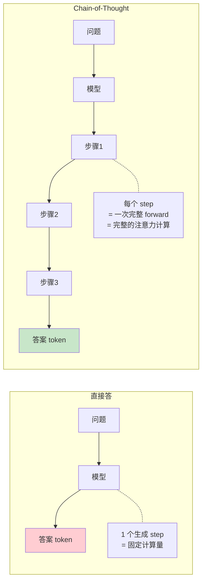
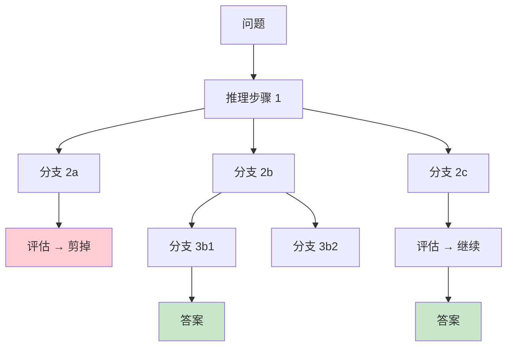
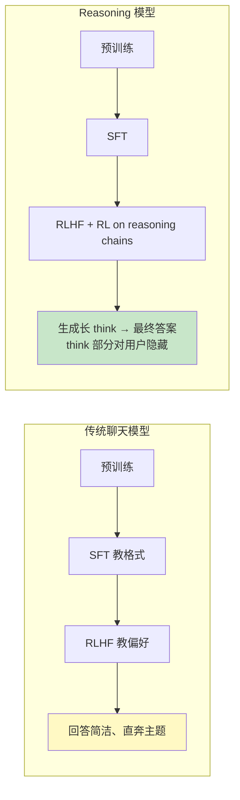
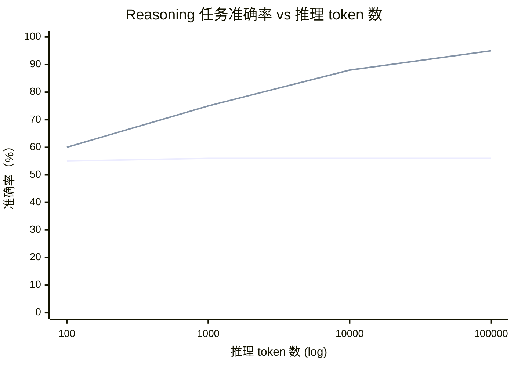
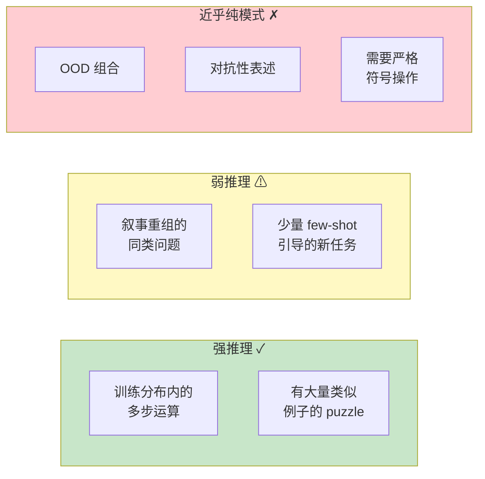
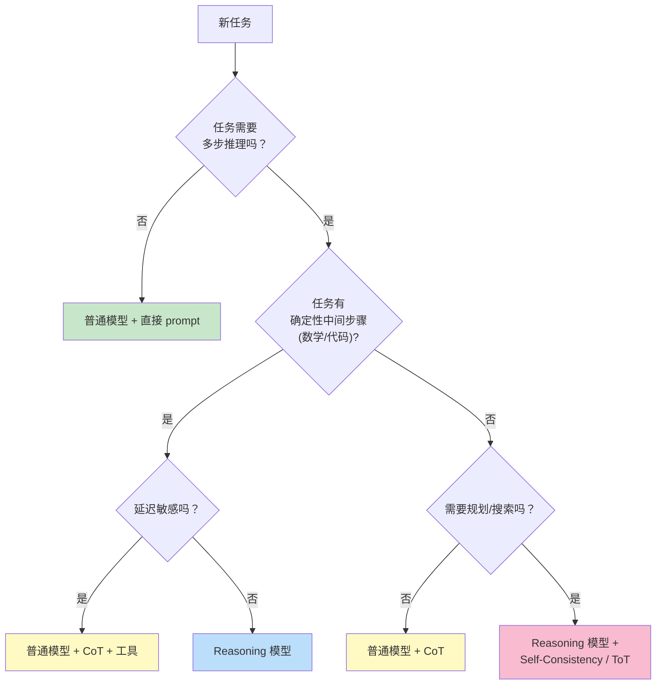

[← 上一章](07-hallucination.md) | [目录](../README.md) | [下一章 →](09-prompting.md)

**English**: [English](../en/chapters/08-reasoning.md)

# 第八章：推理还是模仿？

> "Asked to think step by step, the model writes down what 'thinking step by step' looks like — and gets the right answer more often. We don't fully understand why."

大语言模型展现出了令人瞩目的解题能力：推演数学定理、构筑算法系统、执行严谨的多步逻辑归纳。当目睹一个模型将一道复杂难题层层拆解、徐徐写出推导脉络并最终收敛至正确答案时，直觉上很难否认它似乎"正在思考"。

然而，深入的工程实践往往会揭开另一面真实图景：

- 它能推导抽象的高难度数理题，却可能数不清一个普通单词里包含几个特定字母；
- 它能给出高深严整的复杂度分析，却可能在比较 `9.11 与 9.9 哪个更大` 时得出反直觉的荒谬结论；
- 它能写出数十行环环相扣的严密论证，却在推演收官的最后一步出现毫无征兆的逻辑坍塌。

**这究竟是真正的逻辑推理，还是一种极其精妙的高维模式拟合？** 本章并不试图给出一个武断的定论，因为这本身就是当代人工智能与认知科学中最具活力的开放课题之一。但我们可以解构这一现象，从第一性原理出发，剖析不同理论视角各自的解释力与局限。

更为关键的是：**唯有透彻理解推理机制（无论其本质是否为"纯粹"逻辑推演）的计算实质，工程师才能在系统设计中最大化释放它的效能，并为其构筑坚固的工程护栏**。

---

## 8.1 Chain-of-Thought：给模型一张草稿纸

### 一个简单而深远的发现

2022 年，Wei 等人在论文 [_Chain-of-Thought Prompting Elicits Reasoning in Large Language Models_](https://arxiv.org/abs/2201.11903) 中揭示了一个极具启发性的现象。这一发现的精髓可以通过两组提示词的对比清晰呈现：

```
Prompt A（直接问）:
Q: Roger 有 5 个网球。他又买了 2 罐网球，每罐 3 个。
   现在他一共有几个网球？
A: 11 个。  ← 模型经常答错（如答 17）

Prompt B（加一句"让我们一步步思考"）:
Q: Roger 有 5 个网球。他又买了 2 罐网球，每罐 3 个。
   现在他一共有几个网球？
A: 让我们一步步思考。
   Roger 一开始有 5 个网球。
   2 罐 × 每罐 3 个 = 6 个新网球。
   5 + 6 = 11 个。
   答案是 11。  ← 模型答对的概率显著提高
```

仅需添加一句看似平常的提示语 "Let's think step by step"（思维链提示，Chain-of-Thought，简称 CoT），模型在 GSM8K 数学基准上的准确率便从约 18% 跃升至约 50%。

**这一现象不同寻常**：权重未做任何微调，外部知识库未作任何增补，仅仅通过提示词引导重构了生成上下文，复杂的多步推演能力便应声涌现。

### 效能之源：以序列长度换取计算深度

最直接的第一性原理诠释在于：**自回归语言模型的所谓"思考"，实质上是分布在 Token 生成序列上的连续前向计算**。



在自回归生成中，每输出一个新 Token，模型都需要执行一次完整的前向传播（Forward Pass），并通过自注意力机制对此前所有已生成的历史上下文进行全局动态聚合。若要求模型一步直达答案，计算预算被严格锁定在单次前向传播的常数级容量内；而一旦允许模型输出中间推导过程，最终答案的生成就能直接建立在**此前若干步前向计算所沉淀出的中间表征状态**之上。

换言之：**CoT 本质上是将高复杂度的计算图，在时间步上展开为 Token 序列的顺序拓扑演进**。原本试图压缩在单次网络计算中的巨量隐式信息处理，被分摊到了 $N$ 次连续的前向迭代中逐步完成。

理论层面，Feng 等人在 [_Towards Revealing the Mystery behind Chain of Thought_](https://arxiv.org/abs/2305.15408) (2023) 中严格证明：对于某些计算复杂度超出固定层数 Transformer 单步表达极限的任务，CoT 机制能够从数学上拓展其计算能力边界，使其有能力拟合原本无法在单步内表达的复杂函数。

**直觉洞察**：标准 Transformer 的物理网络深度（网络层数 $L$）在推理时是完全固定的。但引入 CoT 后，系统**通过拓展生成序列的长度，换取了等效的计算深度**：每一个新生成的中间 Token，都等同于为整个系统追加了一层虚拟的前向推理层。

### CoT 的代价与工程边界

CoT 并非免费的午餐，在工程实践中伴随着显著代价：

1. **时延激增**：生成 Token 量由单一结果暴增数十乃至数百倍，首字时延（TTFT）与端到端响应时延显著拉长；
2. **算力成本攀升**：按 Token 计费与显存 KV Cache 占用呈线性增长；
3. **误差累积风险**：在结构简单的直觉型任务上，强行引入 CoT 反而可能因冗长推导引入中间幻觉或逻辑跑偏，从而拉低最终准确率。

```python
# 何时该用 CoT 的简单决策
def should_use_cot(task):
    if is_factual_lookup(task):
        return False  # 直接回忆即可
    if is_simple_classification(task):
        return False  # 一步就能给答案
    if requires_multi_step_reasoning(task):
        return True   # 这是 CoT 的主场
    if needs_arithmetic(task):
        return True   # CoT + 工具
```

---

## 8.2 CoT 的关键变体

在工程落地中，CoT 演化出了多种各具特性的拓扑结构。理解这些变体的差异，有助于针对不同业务场景精准选型。

### Zero-shot CoT：零样本引导

```python
prompt = f"""问题：{question}

让我们一步步思考。
"""
```

形式最为简洁，无需构造标注示范样本，对大多数通用大模型均可直接生效。在生产系统探索阶段，通常应作为首选的基线对照方案。

### Few-shot CoT：少样本范例引导

```python
prompt = """
Q: Roger 有 5 个网球，又买了 2 罐每罐 3 个，共多少个？
A: 让我们一步步思考。Roger 一开始 5 个。2 × 3 = 6 个新的。5 + 6 = 11 个。答案是 11。

Q: Cafeteria 有 23 个苹果，用了 20 个做午餐，又买了 6 个，现在有多少？
A: 让我们一步步思考。23 - 20 = 3 个剩下。3 + 6 = 9 个。答案是 9。

Q: {actual_question}
A: 让我们一步步思考。
"""
```

示范样本在此承载双重职能：**规范推理范式**（约束步骤拆解的粒度与句式风格）与**显式定义任务边界**（明确问题的领域范畴与输出规格）。

适用场景：格式要求高度专业化、逻辑严苛或通用模型难以自发领会推导路径的垂直领域。

### Self-Consistency：集成投票与多路采样

如第七章所述，在确定性推理任务中，正确答案的收敛路径往往具备内在一致性，而错误推导则分散在随机的逻辑漂移中。

```python
def self_consistency(question, n=10):
    answers = [llm.generate_with_cot(question, temp=0.7) for _ in range(n)]
    return Counter(answers).most_common(1)[0][0]
```

以 $n$ 倍的并发与计算开销为代价，换取显著的准确率增益（在 GSM8K 等数学评测集上通常带来 10% 至 20% 的稳健提升）。

### Tree-of-Thoughts：显式搜索与状态树回溯

Yao 等人在 [_Tree of Thoughts_](https://arxiv.org/abs/2305.10601) (2023) 中提出：打破单一维度的线性前向生成，将推理过程建模为**状态树的展开、评估、剪枝与回溯**。



在需要多步试错与全局规划的复杂决策任务（例如 24 点游戏、组合规划、约束满足求解）中，Tree-of-Thoughts 的表现显著超越线性 CoT。其核心制约在于调用开销巨大，单次求解可能触发数十次模型交互。

### CoT 与确定性工具联动

当概率推演遭遇严密的确定性计算时，最强固的工程范式是将逻辑拆解与外部执行引擎无缝联结：模型负责高阶规划与形式化编码，确定性引擎负责底层执行。

```python
# 推理 → 写代码 → 执行 → 继续推理
prompt = """
解决以下问题。当需要精确计算时，用 ```python ... ``` 写代码，我会执行后给你结果。

问题：从 1 到 1000 的所有质数之和是多少？

让我们一步步思考。
"""

# 模型可能输出:
# 这需要遍历 1-1000 找质数。让我用代码:
# ```python
# def is_prime(n): ...
# print(sum(n for n in range(2, 1001) if is_prime(n)))
# ```
# 
# (执行 → 76127)
# 
# 答案是 76127。
```

这正是 ChatGPT Code Interpreter、Claude Tool Use 及现代 Agent 架构中最核心的系统协作基础。

---

## 8.3 原生推理模型：将思维链内化于权重之中

从 2024 年开始，模型演进路径迎来重要分水岭：以 OpenAI o1、DeepSeek-R1、Claude Extended Thinking 为代表的原生推理模型（Reasoning Models）相继问世。

其根本范式转变在于：**思维链不再依赖提示词工程的外在诱导，而是作为一种内生计算图谱，被直接固化在模型的权重与默认行为之中**。

### 训练范式的根本重塑



原生推理模型在对齐与强化学习阶段引入了两项关键变革：

1. **确定性奖励信号主导**：强化学习的奖励直接绑定最终解的客观正确性（如数学定理验证、代码单测通过率），而非人类偏好评分中的表面流畅度或陈述礼貌度。这促使模型专注于优化真实推演路径的严密性。

2. **长程思维链的生成探索机制**：强化学习鼓励模型在推演过程中主动经历假设构建、试错、自我怀疑与路径回溯。系统不再强求模型从第一个 Token 开始就呈现毫无破绽的断言，而是允许其在潜在解空间中展开动态搜索与自我修正。

### 推理期的行为特征

原生推理模型在推断时展现出独特的状态转移轨迹：

```
用户: 12 + 13 + ... + 99 = ?

普通模型直接答: 4914 (可能错)

Reasoning 模型:
  <thinking>
  这是一个等差数列求和。
  首项 a = 12, 末项 l = 99
  项数 n = 99 - 12 + 1 = 88
  和 S = n*(a+l)/2 = 88*(12+99)/2 = 88*111/2
  = 88*55.5
  让我重新算: 88 * 111 = 9768; 9768 / 2 = 4884
  
  我应该再核对一下项数。99 - 12 = 87, +1 = 88。对。
  和 = 4884
  </thinking>
  
  答案是 4884。
```

其核心行为呈现如下特征：
- 显式思维流可达数千至数万 Token；
- 具备元认知（Metacognition）属性，能进行**运行时动态自我纠错**；
- 内部思考过程在交付给终端用户前可被折叠或隐匿，兼顾推导透明度与交付简洁性；
- 在高阶数理推导、形式化验证及复杂代码重构任务中准确率显著飞跃。

### Test-Time Compute：推理时算力扩展律

原生推理模型确立了全新的算力扩展维度：**测试期计算扩展（Test-Time Compute Scaling）**。



> 注：趋势示意图，实际收敛曲线因模型架构与任务类型而异。

传统生成模型无论输出 Token 多少，其单步推理计算量受制于固定网络深度；而原生推理模型成功将推理期投入的 Token 预算（即思考时间与搜索步长）稳定转化为准确率收益。

第三章探讨的模型缩放定律（Scaling Laws）主要关注预训练阶段的参数量与数据吞吐；而测试期计算扩展律则表明：**在不改变模型固有权重的前提下，仅通过动态分配推理期的思考预算，便可实现计算深度与任务能力的弹性伸缩**。

在工程代码中的直观体现：

```python
# 普通模型的 API
response = llm.generate(prompt)  # 几秒，固定成本

# Reasoning 模型的 API
response = reasoning_llm.generate(
    prompt,
    thinking_budget=10000  # 允许它思考最多 10000 token
)  # 可能几十秒到几分钟，但答案准确率显著高
```

**工程架构权衡**：系统设计者需要根据业务对时延与成本的敏感度，动态调配 `thinking_budget`，在"低延迟直觉响应"与"高开销深度求解"之间建立自适应路由机制。

### 推理模型的适用边界

推理模型并非万能解药。在以下场景中，其投入产出比并不显著，甚至可能产生负面效应：

| 任务类型 | Reasoning 模型 vs 普通模型 |
|---------|---------------------------|
| 数学竞赛、ICPC 算法题目 | 显著提升（+30% 至 +50%） |
| 复杂多步因果推理与路径规划 | 显著提升（+20% 至 +40%） |
| 基础事实检索与实体问答 | 收益极微 |
| 文本翻译与风格润色 | 差异微弱（过度推导反而破坏自然语感） |
| 开放式创意写作 | 往往产生反效果（结构推演痕迹过重，缺乏文采） |
| 极低时延交互式实时对话 | 不适用（响应时延过长） |

**工程判别法则**：若人类专家在解决该问题时必须借助草稿纸进行符号推演与多步分拆，推理模型将发挥巨大价值；若人类依赖即时直觉与经验匹配即可瞬间作答，标准模型往往更为经济高效。

---

## 8.4 是真推理还是拟态推演？两种理论视角的交锋

至此，工程表现已清晰确立。然而在认知科学与基础理论层面，核心争议依然尖锐：**模型究竟是在进行真正的逻辑推理，还是在以极其精巧的概率拓扑复现推理的外在形态？**

学术界目前存在两派互为映照的核心立场。

### 立场 A：高阶模式匹配与统计插值

持怀疑立场的学者提出了如下关键实证证据：

**论据 1：对无关扰动的反直觉脆弱性**

若将数理题干中的实体名称、计量单位或陈述语序稍作置换，模型的求解稳定性便可能出现剧烈抖动。Mirzadeh 等人在 [_GSM-Symbolic_](https://arxiv.org/abs/2410.05229) (2024) 中的实验表明：仅对基础算术题中的专有名词与数值进行符号等价替换，模型在基准测试上的准确率波动就可能超过 10%。

若模型真正掌握了问题底层的形式化抽象逻辑，表层语义扰动不应动摇其推演骨架。这一现象揭示其推导在相当程度上仍受制于训练语料中具体表述模式的共现概率。

**论据 2：长尾非常规场景下的逻辑滑坡**

当题目结构偏离常规语料分布时（例如倒置因果叙述顺序、混入弱相关冗余条件或引入罕见单位体系），模型的错误率呈非线性攀升。这表明模型在缺乏语料统计锚点时，难以仅靠形式逻辑维持推演链条的自洽。

**论据 3：分布外（OOD）组合泛化边界受限**

模型在训练集覆盖的参数区间内表现优异，但跨越边界后往往迅速失效。Dziri 等人在 [_Faith and Fate_](https://arxiv.org/abs/2305.18654) (2023) 中证明：在多位数乘法等典型组合性逻辑任务中，模型在训练位宽内准确率接近 100%，然而一旦测试输入的位宽超出语料上界，准确率便发生断崖式下跌。

这符合**高维统计插值**的典型特征，而与通用推理算法所具备的任意尺度泛化能力相距甚远。

### 立场 B：高维表征涌现出等效算法回路

支持演化推理观点的学者则给出了针锋相对的观察：

**论据 1：人类认知本身高度依赖模式识别**

认知心理学研究表明，人类日常的所谓"逻辑推理"极大程度依赖于经验图式与启发式直觉检索，而非纯粹的一阶谓词逻辑演算。下棋大师的全局大局观、资深医生的病情研判，本质上都是高阶抽象特征在生物神经网络中的高效匹配。若人类的直觉图式匹配被承认为推理，则高维表征空间中的等效计算过程同样具有合法性。

**论据 2：网络内部自发构筑算法子电路**

机制可解释性（Mechanistic Interpretability）领域的最新进展证实：自回归模型在训练收敛过程中，会自发组装出具有明确算法语义的内部神经回路。例如 Induction Heads 实现了通用序列复制查找逻辑，模运算注意力头在隐藏层自发构建出了离散傅里叶变换的三角函数坐标系。

Nanda 等人在 [_Progress measures for grokking via mechanistic interpretability_](https://arxiv.org/abs/2301.05217) (2023) 中揭示：当模型经历"顿悟"（Grokking）时，其内部表征会从早期的记忆性查表，突变跃迁为基于高维几何旋转的代数运算，这展现出了真正的内部算法重构能力。

**论据 3：强化学习催生非模仿性质的策略涌现**

在 DeepSeek-R1 等强化学习推理模型的训练轨迹中，模型在未被提供显式人类解题范例的前提下，自发探索出了"回溯复查"、"反思验算"、"反例构造"等元认知策略。这些策略并非对人类文本语料的机械模仿，而是优化目标导向下由强化学习自主探索出的有效解空间搜索策略。

### 综合视角：认知能力的连续谱系

追问"是否为真推理"往往容易陷入语义学的概念泥潭。

在系统工程与计算数学视角下，更为务实的表述是：**语言模型的推理能力呈现为一个连续、任务依赖且具有明确几何边界的谱系**。



**工程落地启示**：无需纠缠于哲学本体论的争辩。工程师的核心任务在于精确测绘具体业务场景在上述谱系中的坐标，明晰模型在何时可靠、何时脆弱，并设计多层校验机制对冲潜在的逻辑坍塌。

---

## 8.5 快思考与慢思考：双系统隐喻在模型中的映射

Daniel Kahneman 在《思考，快与慢》（_Thinking, Fast and Slow_）中将人类认知系统抽象为两种模式：

- **System 1（快思考）**：快速、自动化、直觉驱动、低能量消耗；
- **System 2（慢思考）**：缓慢、刻意控制、逻辑推演、高能量消耗。

这一经典划分在 LLM 体系中形成了清晰的工程映射：

| 维度 | System 1（直觉式生成） | System 2（推演式求解） |
|---|---|---|
| **人类认知** | 面孔识别、母语闲聊、日常骑行 | 复杂心算、逻辑谜题、全局路径规划 |
| **LLM 对应** | 直接单步生成（无 CoT） | CoT 思维链、原生 Reasoning 模型 |
| **计算特征** | 低延迟、低成本、单步概率输出 | 高时延、高算力投入、多步推演验证 |
| **适配场景** | 模式识别、文本润色、格式规整 | 多步推演、约束满足、严密算法构造 |

### 运行时模式决策

```python
def choose_thinking_mode(task):
    """决定用 System 1 还是 System 2"""
    
    # System 1 任务
    if task in [
        "翻译一段文字",
        "提取实体",
        "改写语气",
        "情感分类",
        "信息抽取",
    ]:
        return "直接调用，不要 CoT"
    
    # System 2 任务
    if task in [
        "解数学题",
        "调试代码",
        "规划多步操作",
        "权衡多个方案",
        "复杂的法律/医学分析",
    ]:
        return "CoT 或 reasoning model"
    
    # 灰色地带：视任务难度而定
    return "默认 CoT，简单时去掉"
```

### 一个反直觉的实验发现：System 1 在特定任务上更优

Sprague 等人在 [_To CoT or Not to CoT?_](https://arxiv.org/abs/2409.12183) (2024) 中对思维链在多样化任务上的效能进行了系统性基准测试，得出了引人深思的结论：

- 在复杂数学与符号推理任务中，CoT 平均带来 15% 至 20% 的显著收益；
- 在通用常识问答任务中，CoT 的增益几乎归零；
- 在特定简单事实检索任务中，CoT **反而导致整体准确率下降**。

其深层原因在于：对于原本依靠底层模式即可直接命中的简单事实，强行展开推导链条反而引入了额外的误差积累窗口，模型在中间步骤中可能自设逻辑陷阱，从而污染最终输出。

> **工程原则**：CoT 并非无代价的全局增益。在生产系统设计中，应当针对具体业务基准进行严格离线实测，而非无差别全局启用。

---

## 8.6 推理能力的工程落地实践

将前述理论机制转化为可操作的工程决策框架：

### 架构选型决策树



### 成本与准确率权衡矩阵

| 方案 | 相对成本 | 相对延迟 | 准确率收益 | 推荐适用场景 |
|------|---------|---------|--------|---------|
| 普通模型 + 直接输出 | 1x | 1x | 基线参考 | 简单事实分类、低时延交互对话 |
| 普通模型 + CoT | 2-3x | 2-3x | +10% 至 +20% | 中等难度多步逻辑推导 |
| 普通模型 + CoT + 确定性工具 | 3-4x | 3-5x | +20% 至 +40% | 包含数值计算与结构查询的混合推理 |
| Self-Consistency (n=10) | 10-30x | 10-30x（支持并行）| +10% 至 +20% | 高商业价值的离线复杂推演 |
| 原生 Reasoning 模型 | 5-20x | 10-100x | +20% 至 +50% | 高难度数学推导、核心代码攻坚 |
| Reasoning + ToT / 显式搜索 | 50-100x | 100-1000x | +30% 至 +60% | 极高难度、允许异步调度的规划问题 |

### 常见工程反模式

**反模式 1：无差别注入 "Let's think step by step"**

盲目在所有提示词中注入思维链指令。在简单分类与直觉提取任务中，这不仅会成倍增加 token 账单与响应延迟，还会增加逻辑漂移的概率。

**反模式 2：将原生推理模型直接挂载于交互式实时会话**

原生推理模型的端到端耗时常在数十秒乃至数分钟级别。将其直接置于交互式会话前端，将直接破坏交互体验并引发连接超时。

**反模式 3：误判推导演进的合理粒度**

推导步骤并非越冗长越好。过长的思维链会放大错误累积风险。工程上最优的推导应遵循"精要充分"原则，可通过提示词进行收敛约束（例如限定"请以精简紧凑的要点展开推导"）。

**反模式 4：缺乏最终结果的独立验证层**

模型在思维链中一旦出现推导断裂，最终答案往往会顺承该逻辑错误。在生产架构中，必须在推导链路下游设置**独立的结果校验网关**（例如断言引擎、沙箱执行或轻量审查模型）。

---

## 8.7 开放前沿：模型推理能力的物理天花板

本章留出一个关键的理论开放问题：**大语言模型的推理能力是否存在物理上限？如果有，其边界位于何处？**

当前已经得到实证验证的进展：

1. CoT 机制在数学上突破了固定深度 Transformer 单步表达能力的理论上限；
2. 原生 Reasoning 模型通过强化学习大幅抬升了高难度推导任务的准确率天花板；
3. 测试期计算扩展（Test-Time Compute）确立了算力转化的全新演进曲线。

与此同时，结构性挑战依然清晰存在：

1. 严苛的形式化符号运算（如超长位宽运算、严格命题逻辑推演）在概率框架下仍缺乏确定性保证；
2. 跨越训练分布（OOD）的抽象组合泛化能力仍然受限；
3. 涉及数十乃至上百步的长程规划任务中，误差的指数级累积效应仍未彻底根除。

学术阵营为此呈现出两种前瞻路线：
- **架构重构派**（如 Yann LeCun 等所倡导）：认为当前自回归概率架构从数学本质上无法实现系统级因果推理，必须转向世界模型（World Models）与基于能量的模型（Energy-Based Models）；
- **演化扩展派**（如 OpenAI、Anthropic 等主力机构）：坚信通过强化学习、测试期搜索空间扩张与外部工具体系的深度共融，现有架构足以持续向上突破，尚未触及可见的理论瓶颈。

在第十五章中，我们将重新审视这一宏大命题。此处需要明确的核心原则在于：**这是一个仍在激烈演进的前沿开放课题，工程实践应始终保持严谨与务实**。

---

## 本章小结

| 核心维度 | 理论机理与工程结论 |
|------|------|
| CoT 效能本质 | 将单次网络计算分摊至 $N$ 次前向迭代，等效于"以序列长度换取计算深度" |
| 引入代价 | 时延激增、算力成本攀升、简单任务上可能引入冗余逻辑误差 |
| 原生 Reasoning 模型 | 通过面向客观验证的强化学习，将试错与回溯机制固化为内在计算图谱 |
| 测试期计算扩展律 | 推理阶段投入更多 Token 预算，可实现求解准确率的确定性提升 |
| 推理与模仿之辩 | 呈现为连续的能力谱系，工程重点在于界定适用边界而非形而上争辩 |
| 双系统协同架构 | 直觉模式处理低延迟高吞吐，推演模式攻坚高难度多步复杂问题 |
| 关键禁忌 | 避免全量滥用 CoT、避免在实时交互链路强行部署高延迟推理模型 |

在下一章中，我们将步入 Part III，探索如何将前两部分建立的能力理解与边界认知，系统性转化为构建工业级 LLM 系统的工程技艺。

---

## 延伸阅读

- [Wei et al., 2022: _Chain-of-Thought Prompting Elicits Reasoning in Large Language Models_](https://arxiv.org/abs/2201.11903) : 思维链机制的奠基之作
- [Kojima et al., 2022: _Large Language Models are Zero-Shot Reasoners_](https://arxiv.org/abs/2205.11916) : 零样本思维链 "Let's think step by step" 的经典发现
- [Yao et al., 2023: _Tree of Thoughts: Deliberate Problem Solving with Large Language Models_](https://arxiv.org/abs/2305.10601) : 引入显式状态树搜索与回溯机制
- [Feng et al., 2023: _Towards Revealing the Mystery behind Chain of Thought: A Theoretical Perspective_](https://arxiv.org/abs/2305.15408) : CoT 拓展 Transformer 计算能力的理论证明
- [Mirzadeh et al., 2024: _GSM-Symbolic: Understanding the Limitations of Mathematical Reasoning in Large Language Models_](https://arxiv.org/abs/2410.05229) : 符号扰动下大模型推理脆弱性的系统性实证
- [Dziri et al., 2023: _Faith and Fate: Limits of Transformers on Compositionality_](https://arxiv.org/abs/2305.18654) : Transformer 在组合性任务上的固有边界分析
- [Sprague et al., 2024: _To CoT or Not to CoT?_](https://arxiv.org/abs/2409.12183) : 思维链在不同任务场景中效能差异的实证评估
- [DeepSeek-AI, 2025: _DeepSeek-R1: Incentivizing Reasoning Capability in LLMs via Reinforcement Learning_](https://arxiv.org/abs/2501.12948) : 原生开源推理模型的强化学习训练实践
- [Snell et al., 2024: _Scaling LLM Test-Time Compute Optimally can be More Effective than Scaling Model Parameters_](https://arxiv.org/abs/2408.03314) : 测试期计算扩展律的深入理论与实证

[← 上一章](07-hallucination.md) | [目录](../README.md) | [下一章 →](09-prompting.md)

