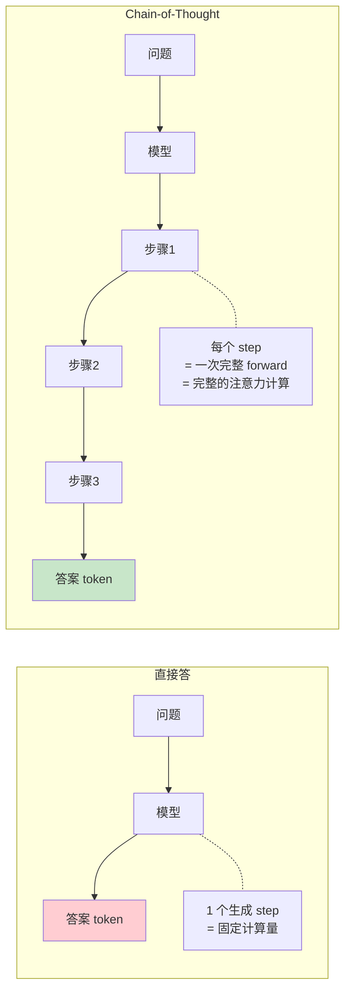
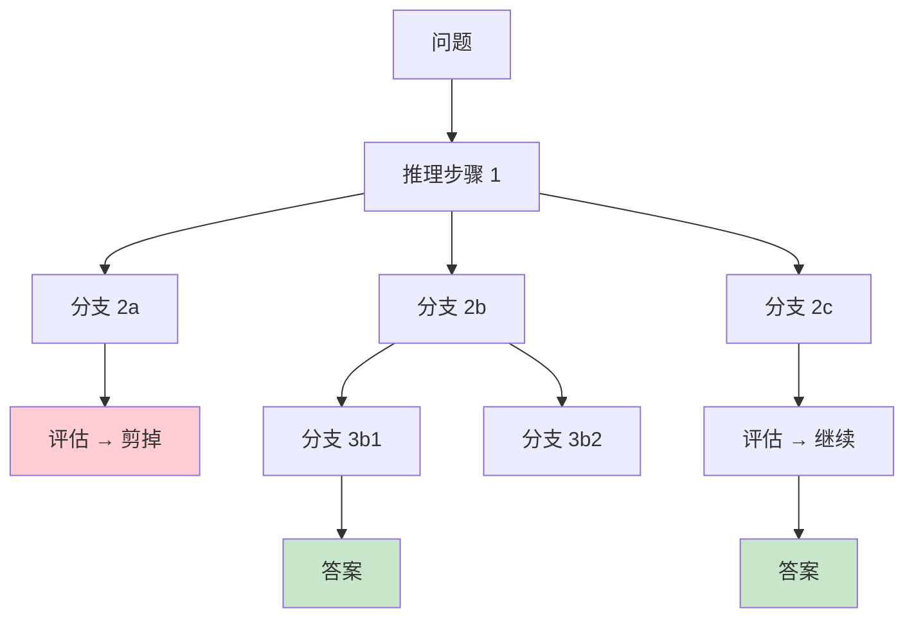
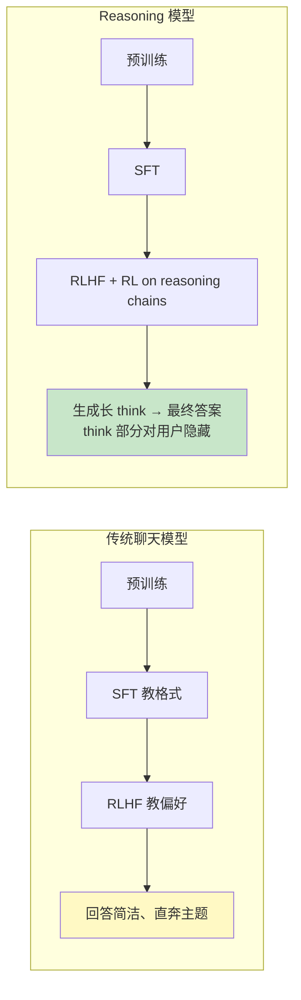
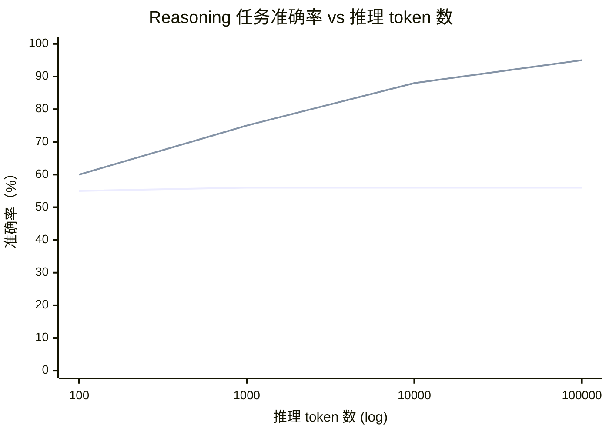
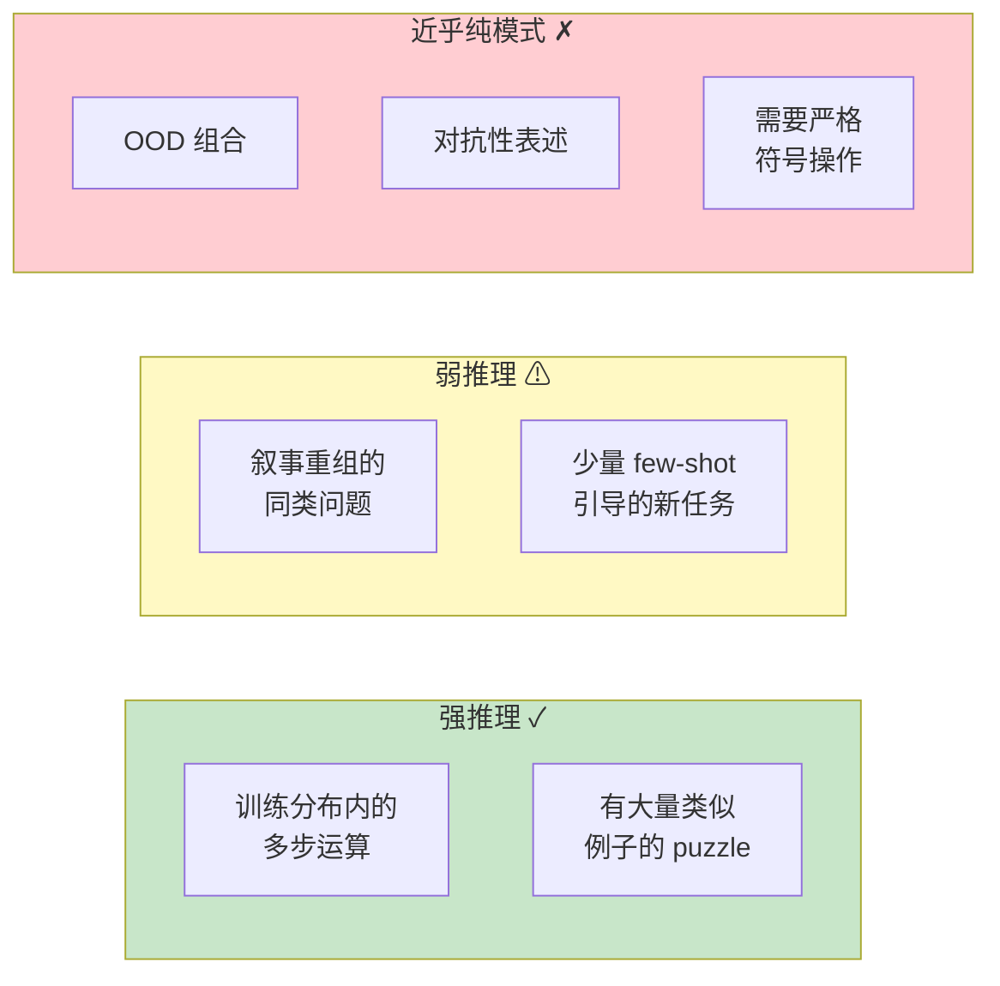
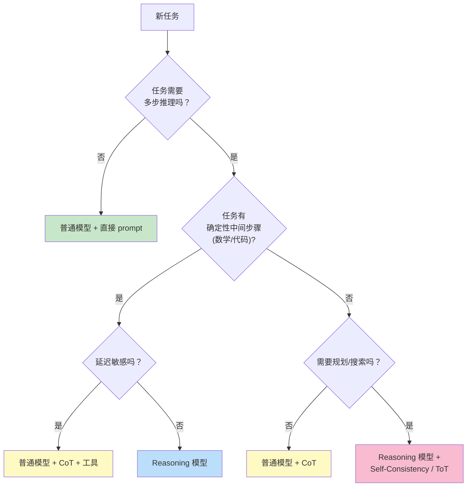

[← 上一章](07-hallucination.md) | [目录](../README.md) | [下一章 →](09-prompting.md)

**English**: [English](../en/chapters/08-reasoning.md)

# 第八章：推理还是模仿？

> "Asked to think step by step, the model writes down what 'thinking step by step' looks like — and gets the right answer more often. We don't fully understand why."

今天的语言模型解起题来让人侧目：推导数学定理，编写算法程序，做多步逻辑归纳。看着它把一道复杂难题一层层拆开，不紧不慢地写出推导脉络，最后稳稳落在正确答案上，任谁在直觉上都很难否认，屏幕那头仿佛真的“正在思考”。

但在真实的工程实践里，另一面很快就会露出来：

- 它能推导抽象的高难度数理题，转头却可能数不清一个普通单词里有几个特定的字母；
- 它能给出严丝合缝的复杂度分析，却会在比较 `9.11 与 9.9 哪个更大` 时得出荒谬的结论；
- 它能写出几十行环环相扣的严密论证，却在推演收尾的最后一步毫无征兆地全盘散架。

这到底是真正的逻辑推理，还是极精妙的高维模式拟合，本章无意给出一个武断的定论，这本就是当代人工智能与认知科学中最有生气的开放课题之一。但我们可以回到第一性原理，把这个现象拆开来看，弄清不同理论视角各自的解释力与局限。

更要紧的是摸清背后的计算实质。无论其本质算不算“纯粹”的逻辑推演，工程师只有透彻理解了它的底层机制，才能在系统设计里把这种能力用足，并为它筑起一道牢靠的工程护栏。

---

## 8.1 Chain-of-Thought：给模型一张草稿纸

### 一个简单而深远的发现

2022 年，Wei 等人在论文 [_Chain-of-Thought Prompting Elicits Reasoning in Large Language Models_](https://arxiv.org/abs/2201.11903) 中指出了一个极有启发性的现象。只要把两组提示词放在一起对比，这个发现的核心便一目了然：

```
Prompt A（直接问）:
Q: Roger 有 5 个网球。他又买了 2 罐网球，每罐 3 个。
   现在他一共有几个网球？
A: 11 个。  ← 模型经常答错（如答 17）

Prompt B（加一句"让我们一步步思考"）:
Q: Roger 有 5 个网球。他又买了 2 罐网球，每罐 3 个。
   现在他一共有几个网球？
A: 让我们一步步思考。
   Roger 一开始有 5 个网球。
   2 罐 × 每罐 3 个 = 6 个新网球。
   5 + 6 = 11 个。
   答案是 11。  ← 模型答对的概率显著提高
```

仅仅加上一句看似平淡无奇的 "Let's think step by step"（思维链提示，Chain-of-Thought，简称 CoT），模型在 GSM8K 数学基准测试上的准确率，就从约 18% 一路跃升到了约 50%。

这件事非同寻常。没有微调任何权重，没有增补任何外部知识库，仅仅靠着提示词重构了生成的上下文，复杂的多步推演能力就这么应声涌现。

### 效能之源：以序列长度换取计算深度

若从第一性原理来看，答案很直接：自回归语言模型所谓的“思考”，本质上是铺展在 Token 生成序列上的连续前向计算。



在自回归生成中，每输出一个新 Token，模型都得跑一次完整的前向传播（Forward Pass），借由自注意力机制将此前写下的所有历史上下文扫视一遍。若要求模型一步给出答案，计算预算便被死死卡在单次前向传播的常数级容量里；可一旦允许它把推导过程一步步写下来，最终答案就能稳稳立在前面多轮前向计算沉淀出的中间表征之上。

换句话说，CoT 的本质，是把原本高复杂度的计算图，沿着时间步拉开成一条顺序演进的 Token 序列。原本试图塞进单次网络计算里的海量隐式信息处理，就这样被分摊到了 $N$ 次连续的前向迭代之中。

理论上也站得住脚。Feng 等人在论文 [_Towards Revealing the Mystery behind Chain of Thought_](https://arxiv.org/abs/2305.15408) (2023) 中给出了严格证明：对于某些计算复杂度超出固定层数 Transformer 单步表达极限的任务，CoT 能在数学上拓宽计算能力的边界，让模型有能力拟合单步内根本无法表达的复杂函数。

**直觉洞察**：标准 Transformer 在推理时的物理网络深度（网络层数 $L$）是固定死的。但在引入 CoT 之后，系统用生成序列的长度换取了等效的计算深度：每一个新生成的中间 Token，都等同于为整个系统追加了一层虚拟的前向推理层。

### CoT 的代价与工程边界

天下没有免费的午餐。落到工程实践里，CoT 带来的代价同样很真切：

1. **时延激增**：生成的 Token 数量比直接输出答案多出几十甚至上百倍，首字时延（TTFT）与端到端响应时间都被大幅拉长；
2. **算力成本攀升**：按 Token 计费的账单与显存里的 KV Cache 占用，全都在成倍往上涨；
3. **误差累积风险**：在那些结构简单的直觉型任务上，强行引入 CoT 反而容易因冗长的推导滋生中间幻觉或中途跑偏，把最终的准确率倒拉了下来。

```python
# 何时该用 CoT 的简单决策
def should_use_cot(task):
    if is_factual_lookup(task):
        return False  # 直接回忆即可
    if is_simple_classification(task):
        return False  # 一步就能给答案
    if requires_multi_step_reasoning(task):
        return True   # 这是 CoT 的主场
    if needs_arithmetic(task):
        return True   # CoT + 工具
```

---

## 8.2 CoT 的关键变体

真正把 CoT 放进工程代码里，它就不再只有一条路走到黑的直线，而是长出了好几种形态各异的拓扑结构。摸清这些变体的脾气与分量，遇到具体的业务场景，手里该拿哪一把刀也就心里有数了。

### Zero-shot CoT：零样本引导

```python
prompt = f"""问题：{question}

让我们一步步思考。
"""
```

这是最省事的一种做法。不用费心去写带标注的范例，随手添上一句提示语，主流大模型大多就能顺着思路推下去。在系统刚起步摸索的阶段，拿它来当基线对照，再合适不过。

### Few-shot CoT：少样本范例引导

```python
prompt = """
Q: Roger 有 5 个网球，又买了 2 罐每罐 3 个，共多少个？
A: 让我们一步步思考。Roger 一开始 5 个。2 × 3 = 6 个新的。5 + 6 = 11 个。答案是 11。

Q: Cafeteria 有 23 个苹果，用了 20 个做午餐，又买了 6 个，现在有多少？
A: 让我们一步步思考。23 - 20 = 3 个剩下。3 + 6 = 9 个。答案是 9。

Q: {actual_question}
A: 让我们一步步思考。
"""
```

示范样本放在这里，实际上要压住两件事：它给推导立下规矩，约束拆解步骤时的颗粒度与句式；同时把任务的**边界**挑明，交代清楚问题所在的专业领域与最终的输出规格。

那些格式要求极为严苛、推导链条环环相扣，或者通用模型单凭自己摸不着推导思路的垂直场景，最适合用这种方式带路。

### Self-Consistency：集成投票与多路采样

第七章提到过，在目标明确的确定性推理里，通往正确答案的路径大体是相通的，算出来的结果总能聚到一起；错误的推导却各有各的岔子，零散漂在随机的逻辑死胡同里。

```python
def self_consistency(question, n=10):
    answers = [llm.generate_with_cot(question, temp=0.7) for _ in range(n)]
    return Counter(answers).most_common(1)[0][0]
```

你得掏出 $n$ 倍的并发与算力去算，换回来的则是实打实的准确率：在 GSM8K 这类数学评测集上，它通常能稳稳拉高 10% 到 20%。

### Tree-of-Thoughts：显式搜索与状态树回溯

Yao 等人在 2023 年发表的 [_Tree of Thoughts_](https://arxiv.org/abs/2305.10601) 里换了个思路：推理不再是一条道走到黑的单向生成，而是把思考过程放进一棵**状态树**里，边展开、边评估、随时剪枝与回溯。



面对 24 点游戏、组合规划或约束满足求解这类需要反复试错与全局统筹的复杂问题，Tree-of-Thoughts 的表现远远甩开线性的 CoT。不过代价也摆在明处：调用的开销极大，解一道题往往要跟模型来回交互数十次。

### CoT 与确定性工具联动

当充满概率色彩的语言推演碰上分毫不差的算术，最稳妥的工程解法，就是把拆解逻辑的模型与外部执行引擎接在一起：模型负责出谋划策、写出形式化的代码，底层的运算则全盘交给确定性的引擎去跑。

```python
# 推理 → 写代码 → 执行 → 继续推理
prompt = """
解决以下问题。当需要精确计算时，用 ```python ... ``` 写代码，我会执行后给你结果。

问题：从 1 到 1000 的所有质数之和是多少？

让我们一步步思考。
"""

# 模型可能输出:
# 这需要遍历 1-1000 找质数。让我用代码:
# ```python
# def is_prime(n): ...
# print(sum(n for n in range(2, 1001) if is_prime(n)))
# ```
# 
# (执行 → 76127)
# 
# 答案是 76127。
```

ChatGPT 的 Code Interpreter、Claude 的 Tool Use，乃至当下各类 Agent 架构的底层协作，靠的全是这套机制。

---

## 8.3 原生推理模型：将思维链内化于权重之中

2024 年是个分水岭。以 OpenAI o1、DeepSeek-R1 和 Claude Extended Thinking 为代表的原生推理模型（Reasoning Models）在这年陆续亮相，大语言模型的技术路线也由此拐了个大弯。

最根本的变化在于：思维链不再靠外部提示词去费力诱导，它已经化作一种**内生计算图谱**，被牢牢刻进了模型的权重与默认行为里。

### 训练范式的根本重塑



在对齐与强化学习阶段，原生推理模型带来了两处关键变化：

1. **确定性奖励信号主导**：强化学习的奖励直接与答案客观上的对错挂钩，不管是数学定理的严密推导还是代码单测的通过率，都来不得半点虚假。模型不再琢磨怎么把话说得更体面、更讨人类评委欢心，而是把全部力气花在推导链条的严丝合缝上。

2. **长程思维链的生成探索机制**：强化学习鼓励模型在解题时大胆去猜、去碰壁、去怀疑自己并推倒重来。系统不再逼着它从吐出第一个 Token 起就给出天衣无缝的结论，而是留出空间，容许它在解题的迷宫里来回搜索、自行校正。

### 推理期的行为特征

到了实际推理阶段，原生推理模型的状态流转轨迹与以往大不相同：

```
用户: 12 + 13 + ... + 99 = ?

普通模型直接答: 4914 (可能错)

Reasoning 模型:
  <thinking>
  这是一个等差数列求和。
  首项 a = 12, 末项 l = 99
  项数 n = 99 - 12 + 1 = 88
  和 S = n*(a+l)/2 = 88*(12+99)/2 = 88*111/2
  = 88*55.5
  让我重新算: 88 * 111 = 9768; 9768 / 2 = 4884
  
  我应该再核对一下项数。99 - 12 = 87, +1 = 88。对。
  和 = 4884
  </thinking>
  
  答案是 4884。
```

这种运行机制落到具体的行为上，有几处非常显眼：
- 显式的思考过程极长，动辄涌出数千乃至数万个 Token；
- 带有元认知（Metacognition）的色彩，能在**运行时动态自我纠错**；
- 内部推演的内容可以在呈现给最终用户前直接折叠或隐匿，推导有据可查，给出的回答也干脆利落；
- 在高阶数理推导、形式化验证与复杂代码重构这类硬核任务里，准确率出现大幅跃升。

### Test-Time Compute：推理时算力扩展律

原生推理模型给算力扩展砸开了一条全新的通道：**测试期计算扩展（Test-Time Compute Scaling）**。



> 注：趋势示意图，实际收敛曲线因模型架构与任务类型而异。

传统的生成模型不管往外吐多少个 Token，每一步的计算量都被固定的网络深度卡得死死的；原生推理模型却把推理阶段投进去的 Token 预算（也就是思考时长与搜索步数），实打实地换成了更高的准确率。

第三章聊过的模型缩放定律（Scaling Laws），眼睛盯的是预训练时的参数规模与数据吞吐；测试期计算扩展律却指出了另一条路：在模型权重纹丝不动的前提下，只要动态调配推理阶段的思考预算，就能把计算深度与任务能力拉伸开来。

落在具体的工程代码上，逻辑非常直观：

```python
# 普通模型的 API
response = llm.generate(prompt)  # 几秒，固定成本

# Reasoning 模型的 API
response = reasoning_llm.generate(
    prompt,
    thinking_budget=10000  # 允许它思考最多 10000 token
)  # 可能几十秒到几分钟，但答案准确率显著高
```

**工程架构权衡**：系统设计者必须看清业务对时延与成本的容忍度，动态调整 `thinking_budget`，在“低时延的直觉反应”与“高开销的深度求解”之间搭出一套自适应的分流机制。

### 推理模型的适用边界

推理模型并不是包治百病的灵药。遇到下面这些场景，多掏的算力往往换不来对等的收益，弄不好还会适得其反：

| 任务类型 | Reasoning 模型 vs 普通模型 |
|---------|---------------------------|
| 数学竞赛、ICPC 算法题目 | 大幅提升（+30% 至 +50%） |
| 复杂多步因果推理与路径规划 | 大幅提升（+20% 至 +40%） |
| 基础事实检索与实体问答 | 收益极微 |
| 文本翻译与风格润色 | 差异微弱（过度推导反而破坏自然语感） |
| 开放式创意写作 | 往往适得其反（结构推演痕迹过重，缺乏文采） |
| 极低时延交互式实时对话 | 不适用（响应时延过长） |

**工程判别法则**：如果人类专家解这道题必须抽出一张草稿纸，埋头做符号推导与多步拆解，推理模型的威力就能显现出来；要是凭着直觉和经验一抬眼就能报出答案，用普通模型反而划算得多。

---

## 8.4 是真推理还是拟态推演？两种理论视角的交锋

工程上的表现已经摆在眼前。可若是退回到认知科学与基础理论的视角，分歧依然尖锐：模型究竟走通了真正的逻辑推演，还是只凭极其精巧的概率拓扑，临摹出了推理的外在形态。

学术界当下分出了两派立场，彼此针锋相对，互为照见。

### 立场 A：高阶模式匹配与统计插值

持怀疑立场的学者拿出了几项关键的实证证据：

**论据 1：对无关扰动的反直觉脆弱性**

只要把数理题目里的实体名称、计量单位或陈述语序稍作调换，模型解题的稳定性便可能剧烈晃动。Mirzadeh 等人在 [_GSM-Symbolic_](https://arxiv.org/abs/2410.05229) (2024) 中的实验给出了明证：仅仅替换基础算术题里的专有名词与数值做符号等价改动，模型在基准测试上的准确率波动就能超过 10%。

如果模型真正掌握了问题底层抽象的形式逻辑，表层语义的微调绝不至于动摇推演的骨架。这一现象恰恰揭示出，它的推导在很大程度上依然受制于训练语料中具体表述模式的共现概率。

**论据 2：长尾非常规场景下的逻辑滑坡**

一旦题目结构偏离了常见的语料分布（例如倒置因果叙述顺序、混入关联微弱的冗余条件，或是引入罕见的单位体系），模型的错误率便会非线性地一路攀升。这表明，一旦失去了语料里的统计锚点，模型很难单凭形式逻辑来维持整条推演链条的自洽。

**论据 3：分布外（OOD）组合泛化边界受限**

在训练集覆盖的参数区间内，模型的表现堪称出色，可一旦跨出边界便迅速失灵。Dziri 等人在 [_Faith and Fate_](https://arxiv.org/abs/2305.18654) (2023) 中给出了证明：在多位数乘法这类典型的组合逻辑任务中，模型在训练位宽内的准确率接近 100%，可只要测试输入的位宽超出语料上限，准确率便发生断崖式下跌。

这完全符合**高维统计插值**的典型特征，与通用推理算法在任意尺度上从容泛化的能力相去甚远。

### 立场 B：高维表征涌现出等效算法回路

支持演化推理观点的学者，则给出了针锋相对的观察：

**论据 1：人类认知本身高度依赖模式识别**

认知心理学的研究显示，人类日常所谓的“逻辑推理”，大半依赖经验图式与启发式直觉检索，绝非时刻在做纯粹的一阶谓词逻辑演算。下棋大师的全局大局观、资深医生的病情研判，归根结底都是高阶抽象特征在生物神经网络里的高效匹配。既然人类依赖直觉图式匹配能够被承认为推理，那么高维表征空间里发生的等效计算过程，同样拥有成立的理由。

**论据 2：网络内部自发构筑算法子电路**

机制可解释性（Mechanistic Interpretability）领域的进展证实：自回归模型在训练收敛的过程中，会自发组装出带有明确算法语义的内部神经回路。例如 Induction Heads 跑通了通用序列复制查找逻辑，模运算注意力头在隐藏层自发构建出了离散傅里叶变换的三角函数坐标系。

Nanda 等人在 [_Progress measures for grokking via mechanistic interpretability_](https://arxiv.org/abs/2301.05217) (2023) 中揭示：当模型经历“顿悟”（Grokking）时，内部表征会从早期的记忆性查表，突变跃迁为基于高维几何旋转的代数运算，展现出了真正的内部算法重构能力。

**论据 3：强化学习催生非模仿性质的策略涌现**

在 DeepSeek-R1 等强化学习推理模型的训练轨迹中，哪怕没有显式的人类解题范例作为参考，模型也自发探索出了“回溯复查”、“反思验算”、“反例构造”等元认知策略。这些策略绝非对人类文本语料的机械模仿，而是在优化目标驱动下，由强化学习自主在解空间中摸索出的搜索策略。

### 综合视角：认知能力的连续谱系

一味追问模型算不算“真推理”，往往很容易掉进语义学的概念泥潭。

站在系统工程与计算数学的角度，更为务实的表述是：语言模型的推理能力呈现为一个连续、依赖具体任务且带有明确几何边界的谱系。



**工程落地启示**：大可不必纠缠于哲学本体论的争辩。工程师的核心任务，在于精确测绘具体业务场景在上述谱系中的坐标，看清模型何时可靠、何时脆弱，并通过多层校验机制防范潜在的逻辑坍塌。

---

## 8.5 快思考与慢思考：双系统隐喻在模型中的映射

Daniel Kahneman 在《思考，快与慢》（_Thinking, Fast and Slow_）中，把人类的认知系统划分为两种模式：

- **System 1（快思考）**：反应迅速、全自动运转、由直觉驱动，几乎不耗费什么能量；
- **System 2（慢思考）**：步调迟缓、需要刻意专注、依赖逻辑逐步推演，需要消耗大量能量。

这一经典划分在 LLM 体系中形成了清晰的工程映射：

| 维度 | System 1（直觉式生成） | System 2（推演式求解） |
|---|---|---|
| **人类认知** | 面孔识别、母语闲聊、日常骑行 | 复杂心算、逻辑谜题、全局路径规划 |
| **LLM 对应** | 直接单步生成（无 CoT） | CoT 思维链、原生 Reasoning 模型 |
| **计算特征** | 低延迟、低成本、单步概率输出 | 高时延、高算力投入、多步推演验证 |
| **适配场景** | 模式识别、文本润色、格式规整 | 多步推演、约束满足、严密算法构造 |

### 运行时模式决策

```python
def choose_thinking_mode(task):
    """决定用 System 1 还是 System 2"""
    
    # System 1 任务
    if task in [
        "翻译一段文字",
        "提取实体",
        "改写语气",
        "情感分类",
        "信息抽取",
    ]:
        return "直接调用，不要 CoT"
    
    # System 2 任务
    if task in [
        "解数学题",
        "调试代码",
        "规划多步操作",
        "权衡多个方案",
        "复杂的法律/医学分析",
    ]:
        return "CoT 或 reasoning model"
    
    # 灰色地带：视任务难度而定
    return "默认 CoT，简单时去掉"
```

### 一个反直觉的实验发现：System 1 在特定任务上更优

Sprague 等人在 [_To CoT or Not to CoT?_](https://arxiv.org/abs/2409.12183) (2024) 中针对思维链在各类任务上的表现做了详尽的基准测试，得出了耐人寻味的结论：

- 在复杂的数学与符号推理任务中，CoT 平均带来 15% 至 20% 的可观收益；
- 在通用的常识问答任务中，CoT 带来的增益几乎归零；
- 在某些特定的简单事实检索任务中，CoT 反而导致整体准确率出现下滑。

背后的原因其实很直白：面对那些依靠底层模式就能直接命中的简单事实，强行展开推导链条，反而平白多出了积累误差的窗口。模型容易在中间步骤里自设逻辑陷阱，反倒污染了最终的输出。

> **工程原则**：CoT 并非没有代价的全局增益。在设计生产系统时，应当针对具体业务基准做严格的离线实测，而不是无差别全局开启。

---

## 8.6 推理能力的工程落地实践

把前述理论机制落到具体的工程决策中，可以理出一条清晰的选型路径：

### 架构选型决策树



### 成本与准确率权衡矩阵

| 方案 | 相对成本 | 相对延迟 | 准确率收益 | 推荐适用场景 |
|------|---------|---------|--------|---------|
| 普通模型 + 直接输出 | 1x | 1x | 基线参考 | 简单事实分类、低时延交互对话 |
| 普通模型 + CoT | 2-3x | 2-3x | +10% 至 +20% | 中等难度多步逻辑推导 |
| 普通模型 + CoT + 确定性工具 | 3-4x | 3-5x | +20% 至 +40% | 包含数值计算与结构查询的混合推理 |
| Self-Consistency (n=10) | 10-30x | 10-30x（支持并行）| +10% 至 +20% | 高商业价值的离线复杂推演 |
| 原生 Reasoning 模型 | 5-20x | 10-100x | +20% 至 +50% | 高难度数学推导、核心代码攻坚 |
| Reasoning + ToT / 显式搜索 | 50-100x | 100-1000x | +30% 至 +60% | 极高难度、允许异步调度的规划问题 |

### 常见工程反模式

**反模式 1**：无差别注入 "Let's think step by step"

不加区分地在所有提示词里塞入思维链指令，往往适得其反。面对简单的事实分类或直觉提取，强行让模型展开推导，换来的只是成倍增加的 token 账单与响应延迟；推导步骤一多，还会平白增加逻辑漂移的概率。

**反模式 2**：将原生推理模型直接挂载于交互式实时会话

原生推理模型的端到端推导动辄需要数十秒乃至数分钟。若是直接把它放在交互式会话的前端，用户的界面交互体验会被彻底打碎，还会频繁引发网关与客户端的连接超时。

**反模式 3**：误判推导演进的合理粒度

推导步骤绝非越冗长越好，过长的思维链只会放大错误累积的风险。工程实践中最适宜的推导应当遵循“精要充分”原则，可以通过提示词对推导过程做出收敛约束，例如限定“请以精简紧凑的要点展开推导”便已足够。

**反模式 4**：缺乏最终结果的独立验证层

模型在思维链中一旦出现推导断裂，最终给出的答案往往会直接顺承这一逻辑错误。在面向生产的架构里，推导链路下游必须设置**独立的结果校验网关**，通过断言引擎、沙箱执行或轻量审查模型完成最终确认。

---

## 8.7 开放前沿：模型推理能力的物理天花板

本章最后留出一个关键的理论开放课题：大语言模型的推理能力究竟是否存在物理上限，若确实存在，其边界又落在何处。

从目前的实证研究来看，已经有几项进展得到了明确验证：

1. CoT 机制在数学上突破了固定深度 Transformer 单步表达能力的理论上限；
2. 原生 Reasoning 模型借助强化学习，把高难度推导任务的准确率天花板大幅推高；
3. 测试期计算扩展（Test-Time Compute）确立了算力转化的全新演进曲线。

但在另一面，底层的结构性挑战依然清晰可见：

1. 严苛的形式化符号运算（例如超长位宽计算、严格命题逻辑推演）在概率框架下，始终缺乏确定性的结果保证；
2. 跨越训练分布（OOD）时的抽象组合泛化能力依然受限；
3. 面对数十乃至上百步的长程规划任务，误差呈指数级累积的现象仍未彻底根除。

面对这些边界，学术界目前分化出两条前瞻路线：
- **架构重构派**（如 Yann LeCun 等学者所主张）：认为目前的自回归概率架构在数学本质上做不到系统级的因果推理，必须转向世界模型（World Models）与基于能量的模型（Energy-Based Models）；
- **演化扩展派**（如 OpenAI、Anthropic 等主力机构）：坚信借助强化学习、测试期搜索空间扩张与外部工具体系的深度融合，现有架构完全能够持续向上突破，尚未触及可见的理论瓶颈。

到了第十五章，我们还会重新审视这个宏大的命题。而在眼下的工程实践中，最要紧的原则其实很清楚：面对仍在激烈演进的前沿开放课题，工程实践应始终保持严谨与务实。

---

## 本章小结

| 核心要点 | 理论机理与工程结论 |
|------|------|
| CoT 效能本质 | 将单次网络计算分摊至 $N$ 次前向迭代，等效于“以序列长度换取计算深度” |
| 引入代价 | 时延激增、算力成本攀升、简单任务上可能引入冗余逻辑误差 |
| 原生 Reasoning 模型 | 通过面向客观验证的强化学习，将试错与回溯机制固化为内在计算图谱 |
| 测试期计算扩展律 | 推理阶段投入更多 Token 预算，能够带来求解准确率的确定性提升 |
| 推理与模仿之辩 | 呈现为连续的能力谱系，工程重点在于界定适用边界而非形而上争辩 |
| 双系统协同架构 | 直觉模式处理低延迟高吞吐，推演模式攻坚高难度多步复杂问题 |
| 关键禁忌 | 避免全量滥用 CoT、避免在实时交互链路强行部署高延迟推理模型 |

下一章我们将步入 Part III，把前两部分建立起的能力理解与边界认知，化作一套构建工业级 LLM 系统的扎实工程技艺。

---

## 延伸阅读

- [Wei et al., 2022: _Chain-of-Thought Prompting Elicits Reasoning in Large Language Models_](https://arxiv.org/abs/2201.11903) : 思维链机制的奠基之作
- [Kojima et al., 2022: _Large Language Models are Zero-Shot Reasoners_](https://arxiv.org/abs/2205.11916) : 零样本思维链 "Let's think step by step" 的经典发现
- [Yao et al., 2023: _Tree of Thoughts: Deliberate Problem Solving with Large Language Models_](https://arxiv.org/abs/2305.10601) : 引入显式状态树搜索与回溯机制
- [Feng et al., 2023: _Towards Revealing the Mystery behind Chain of Thought: A Theoretical Perspective_](https://arxiv.org/abs/2305.15408) : CoT 拓展 Transformer 计算能力的理论证明
- [Mirzadeh et al., 2024: _GSM-Symbolic: Understanding the Limitations of Mathematical Reasoning in Large Language Models_](https://arxiv.org/abs/2410.05229) : 符号扰动下大模型推理脆弱性的实证检验
- [Dziri et al., 2023: _Faith and Fate: Limits of Transformers on Compositionality_](https://arxiv.org/abs/2305.18654) : Transformer 在组合性任务上的固有边界分析
- [Sprague et al., 2024: _To CoT or Not to CoT?_](https://arxiv.org/abs/2409.12183) : 思维链在不同任务场景中效能差异的实证评估
- [DeepSeek-AI, 2025: _DeepSeek-R1: Incentivizing Reasoning Capability in LLMs via Reinforcement Learning_](https://arxiv.org/abs/2501.12948) : 原生开源推理模型的强化学习训练实践
- [Snell et al., 2024: _Scaling LLM Test-Time Compute Optimally can be More Effective than Scaling Model Parameters_](https://arxiv.org/abs/2408.03314) : 测试期计算扩展律的深入理论与实证

[← 上一章](07-hallucination.md) | [目录](../README.md) | [下一章 →](09-prompting.md)
