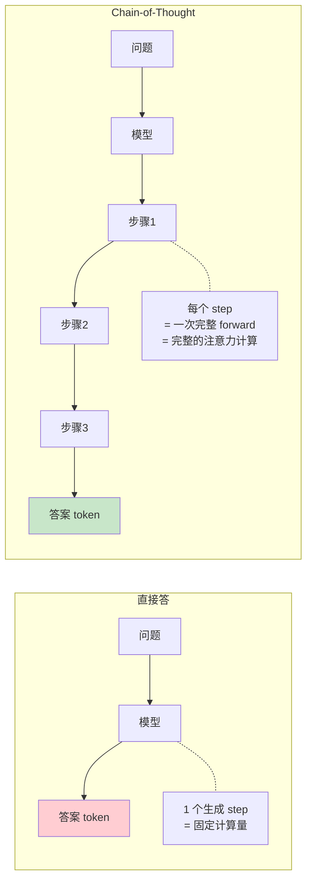
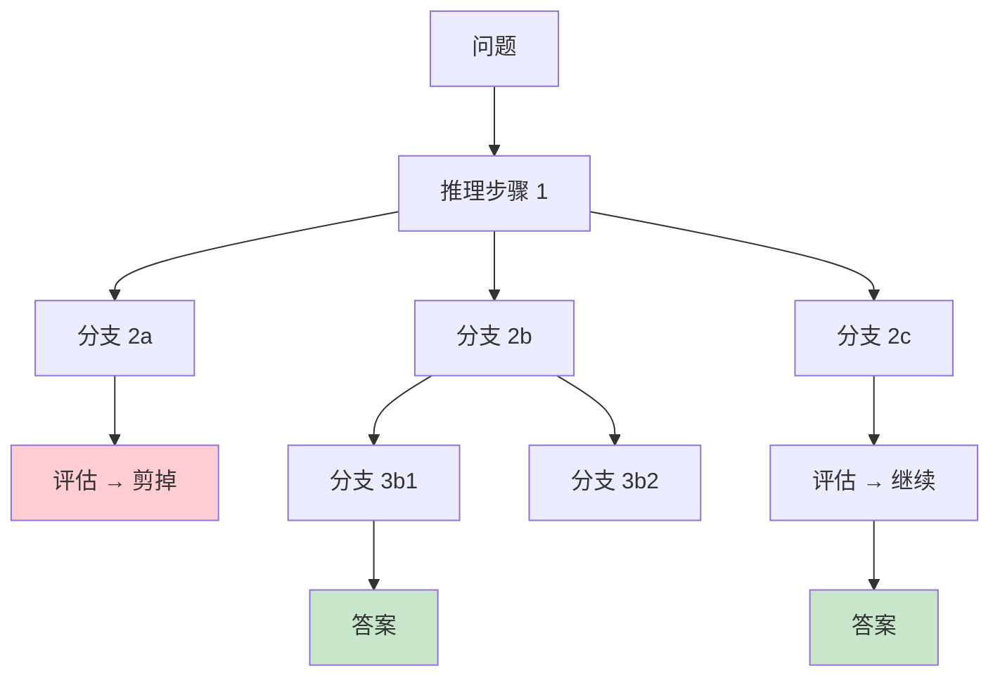
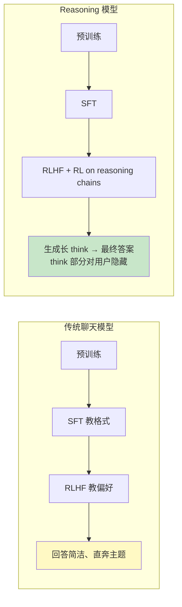
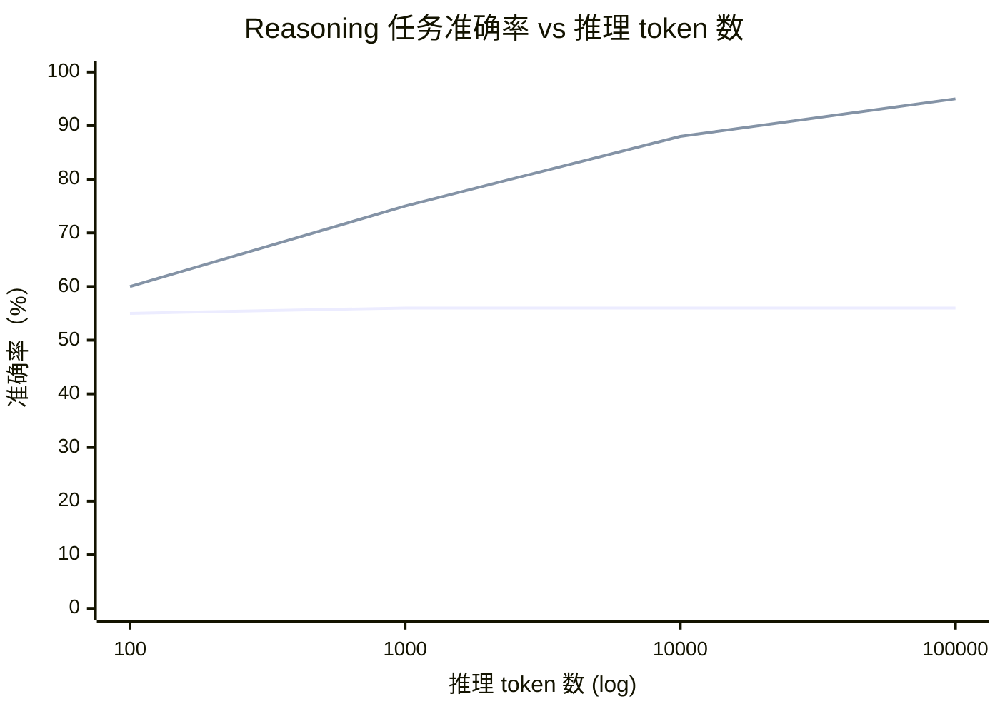
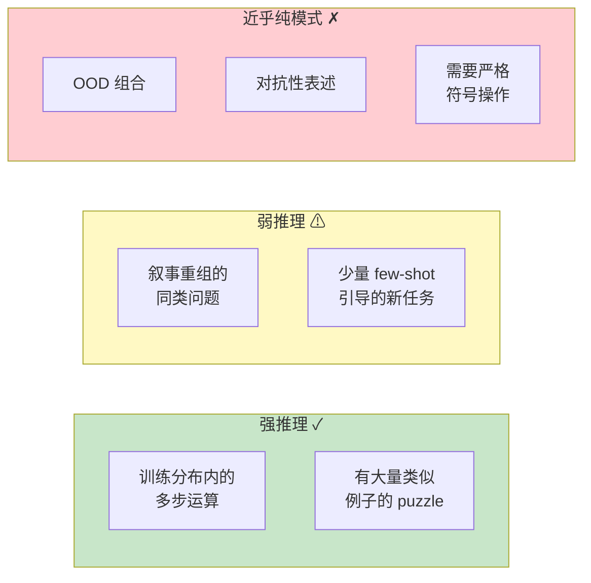
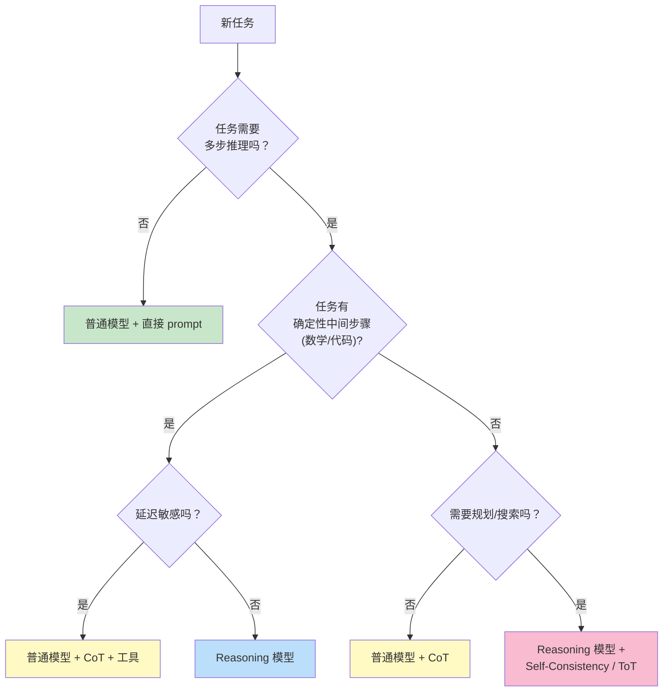

[← 上一章](07-hallucination.md) | [目录](../README.md) | [下一章 →](09-prompting.md)

# 第八章：推理还是模仿？

> "Asked to think step by step, the model writes down what 'thinking step by step' looks like — and gets the right answer more often. We don't fully understand why."

LLM 会做数学题。LLM 会写程序。LLM 会推导逻辑。当看着一个模型把一道复杂题分解成步骤、写出推理过程、最终给出正确答案时，很难不觉得"它在思考"。

但如果你跟模型对话过一阵子，也一定见过另一面：

- 它能解高考数学题，却数不清单词里有几个字母
- 它能写出复杂的算法分析，却会把 `9.11 vs 9.9 哪个大` 答错
- 它能给你 50 行严谨论证，最后一步却莫名其妙地翻车

**到底是真的推理，还是高级模仿？** 这一章不假装给一个最终答案——这是当前 AI 研究最活跃的开放问题之一。但我们可以把问题拆开看，看看不同视角各自能解释什么、不能解释什么。

更重要的：**理解了 reasoning 的机制（无论是不是"真"推理），你就知道在工程上如何最大化它的效果**。

---

## 8.1 Chain-of-Thought：给模型一张草稿纸

### 一个简单到不可思议的发现

2022 年，Wei et al. 发表了 [_Chain-of-Thought Prompting Elicits Reasoning in Large Language Models_](https://arxiv.org/abs/2201.11903)。论文的核心发现可以用两个 prompt 表达：

```
Prompt A（直接问）:
Q: Roger 有 5 个网球。他又买了 2 罐网球，每罐 3 个。
   现在他一共有几个网球？
A: 11 个。  ← 模型经常答错（如答 17）

Prompt B（加一句"让我们一步步思考"）:
Q: Roger 有 5 个网球。他又买了 2 罐网球，每罐 3 个。
   现在他一共有几个网球？
A: 让我们一步步思考。
   Roger 一开始有 5 个网球。
   2 罐 × 每罐 3 个 = 6 个新网球。
   5 + 6 = 11 个。
   答案是 11。  ← 模型答对的概率显著提高
```

仅仅加一句 "Let's think step by step"，GSM8K 数学基准上的准确率从约 18% 跳到约 50%。

**这是一个不寻常的发现**——你没有重新训练模型，没有给它新的知识，只是改了一句 prompt，能力就"涌现"了。

### 为什么有效：更多 token = 更多计算

最简洁的解释：**LLM 的"思考"是 token 上的计算**。



每生成一个 token，都是一次完整的 forward pass，模型可以利用所有之前生成的内容做计算。如果直接生成答案，模型只有"问题"这么多 context 可以用；如果先生成一段推理，模型在生成最终答案时，能用上**自己刚刚生成的中间结果**。

换个说法：**CoT 等于让模型在 token 序列上做了一次线性搜索 / 顺序计算**。原本要在一个 forward 里塞进去的全部计算，被分散到了 N 个 forward 里。

这在理论上有支撑。Feng et al. (2023) 的 [_Towards Revealing the Mystery behind Chain of Thought_](https://arxiv.org/abs/2305.15408) 证明：对于某些计算复杂度高于 Transformer 单层表达力的任务，CoT 能让 Transformer 在理论上表达原本不能表达的函数。

**直觉**：Transformer 的"深度"是固定的（多少层）。但通过 CoT，你可以**用 token 序列的长度，换深度**——每个新 token 等于多了一层"虚拟深度"。

### CoT 不是免费的

CoT 有显著代价：

1. **延迟**：要生成的 token 数量从 1 个变成几十上百个，TTFT (time to last token) 显著拉长
2. **成本**：按 token 计费，成本线性增加
3. **不一定有效**：在简单任务上，CoT 可能反而拉低准确率（因为多生成的步骤本身可能引入错误）

```python
# 何时该用 CoT 的简单决策
def should_use_cot(task):
    if is_factual_lookup(task):
        return False  # 直接回忆即可
    if is_simple_classification(task):
        return False  # 一步就能给答案
    if requires_multi_step_reasoning(task):
        return True   # 这是 CoT 的主场
    if needs_arithmetic(task):
        return True   # CoT + 工具
```

---

## 8.2 CoT 的几种变体

CoT 不止一种用法。理解变体的差异，能帮你在不同场景下选对工具。

### Zero-shot CoT：一句话搞定

```python
prompt = f"""问题：{question}

让我们一步步思考。
"""
```

最简单，不需要例子，对大多数任务有效。在生产中先试这个。

### Few-shot CoT：示范带例子

```python
prompt = """
Q: Roger 有 5 个网球，又买了 2 罐每罐 3 个，共多少个？
A: 让我们一步步思考。Roger 一开始 5 个。2 × 3 = 6 个新的。5 + 6 = 11 个。答案是 11。

Q: Cafeteria 有 23 个苹果，用了 20 个做午餐，又买了 6 个，现在有多少？
A: 让我们一步步思考。23 - 20 = 3 个剩下。3 + 6 = 9 个。答案是 9。

Q: {actual_question}
A: 让我们一步步思考。
"""
```

例子起两个作用：**示范推理风格**（用什么样的句式分解）+ **隐式 task 定义**（告诉模型这是一个数学题，不是别的）。

适用场景：任务格式比较"非主流"、模型不容易猜到你想要什么样的推理结构。

### Self-Consistency：多次采样投票

第七章已经提过。在推理任务上特别有效——因为正确答案唯一，错误答案分散。

```python
def self_consistency(question, n=10):
    answers = [llm.generate_with_cot(question, temp=0.7) for _ in range(n)]
    return Counter(answers).most_common(1)[0][0]
```

代价是 n 倍调用，但准确率提升通常显著（在 GSM8K 上 +10-20%）。

### Tree-of-Thoughts：让模型探索多条路径

Yao et al. (2023) 的 [_Tree of Thoughts_](https://arxiv.org/abs/2305.10601) 提出：不要让模型走一条直路，让它**展开多条推理分支**，然后评估、剪枝、回溯。



ToT 对需要**回溯**的任务（24 点游戏、规划问题）效果显著好于直接 CoT。

代价巨大——可能需要几十次模型调用。

### CoT + 工具：第七章的回响

最强的组合：模型用 CoT 分解问题，每一步需要确定性结果时调用工具。

```python
# 推理 → 写代码 → 执行 → 继续推理
prompt = """
解决以下问题。当需要精确计算时，用 ```python ... ``` 写代码，我会执行后给你结果。

问题：从 1 到 1000 的所有质数之和是多少？

让我们一步步思考。
"""

# 模型可能输出:
# 这需要遍历 1-1000 找质数。让我用代码:
# ```python
# def is_prime(n): ...
# print(sum(n for n in range(2, 1001) if is_prime(n)))
# ```
# 
# (执行 → 76127)
# 
# 答案是 76127。
```

这是 ChatGPT Code Interpreter / Claude Computer Use / Anthropic 的 Tool Use 模型背后最重要的设计。

---

## 8.3 Reasoning Models：把 CoT 内化到训练中

2024 年开始，AI 行业出现了一类新模型——OpenAI 的 o1、DeepSeek 的 R1、Anthropic 的 Claude（带 extended thinking）、Google 的 Gemini Thinking 等。它们被统称为 **reasoning models**。

它们的核心改变：**CoT 不再是 prompt 时的把戏，而是被训练进了模型的默认行为**。

### 训练流程的变化



具体来说，reasoning models 的训练有两个关键差异：

1. **强化学习的奖励信号是"答案对不对"**，而不是"回答是否被人喜欢"。这让模型学会优化"得出正确答案"，而不是"写得让人看着舒服"。

2. **训练时鼓励模型生成长推理链**——即使中间会犯错、犹豫、回溯。模型被允许"先错后对"，而不是从第一个 token 起就装得很自信。

### 推理时的特征

reasoning models 在推理（inference）时的行为也很不同：

```
用户: 12 + 13 + ... + 99 = ?

普通模型直接答: 4914 (可能错)

Reasoning 模型:
  <thinking>
  这是一个等差数列求和。
  首项 a = 12, 末项 l = 99
  项数 n = 99 - 12 + 1 = 88
  和 S = n*(a+l)/2 = 88*(12+99)/2 = 88*111/2
  = 88*55.5
  让我重新算: 88 * 111 = 9768; 9768 / 2 = 4884
  
  我应该再核对一下项数。99 - 12 = 87, +1 = 88。对。
  和 = 4884
  </thinking>
  
  答案是 4884。
```

注意几个关键特征：
- 推理过程可能很长（几千到几万 token）
- 模型会**自我纠错**（"让我重新算"）
- 用户看到的是简洁的最终答案，思考过程被隐藏
- 解决困难问题的准确率显著高于普通模型

### Test-time compute：用推理时间换准确率

reasoning models 引入了一个新的 scaling 维度：**推理时计算量**。



> 注：示意图，实际数据因任务和模型而异。趋势来自 OpenAI o1 的公开测试结果。

传统模型推理多少 token 都不会变更准确——它只想"赶快给一个答案"。Reasoning 模型则把推理时间转化为准确率：思考越久，越准。

这是 **scaling laws 的一个新维度**。第三章讲的是"训练时的 scaling"（更多参数、更多数据），这是"推理时的 scaling"——你可以在不重新训练模型的情况下，**通过给它更多思考时间**来提升能力。

工程上意味着什么？

```python
# 普通模型的 API
response = llm.generate(prompt)  # 几秒，固定成本

# Reasoning 模型的 API
response = reasoning_llm.generate(
    prompt,
    thinking_budget=10000  # 允许它思考最多 10000 token
)  # 可能几十秒到几分钟，但答案准确率显著高
```

**新的工程取舍**：你可以选择"贵但准"或"便宜但快"，按场景选择 thinking budget。

### Reasoning models 不是万能的

也别神化。reasoning models 在以下场景没有明显优势：

| 任务类型 | Reasoning 模型 vs 普通模型 |
|---------|---------------------------|
| 数学竞赛、ICPC 题目 | 显著提升（+30-50%） |
| 复杂推理、规划 | 显著提升（+20-40%） |
| 事实问答 | 几乎无差别 |
| 翻译、摘要 | 几乎无差别（甚至略差，因为过度思考） |
| 创意写作 | 通常更差（分析味太重） |
| 实时对话 | 不适合（延迟太高） |

**经验法则**：如果一个普通工程师做这个任务时会停下来在草稿纸上写很多步骤，那 reasoning model 会有用；如果是凭直觉就能答的，普通模型更好。

---

## 8.4 这是真的推理吗？两种立场

到这里，我们看到了 LLM 通过 CoT、reasoning models 等方式，能在推理任务上做得相当好。问题是：**它是真的在"推理"，还是在用更精细的方式模仿推理？**

学界对此分裂明显。我们看两种立场各自的论据。

### 立场 A：这只是高级模式匹配

支持这种立场的代表性论据：

**论据 1：模型对"无关变化"过度敏感**

把数学题里的人名、物品名换掉，准确率会显著变化。Mirzadeh et al. (2024) 的 [_GSM-Symbolic_](https://arxiv.org/abs/2410.05229) 显示：仅仅替换数字或人名，模型在 GSM8K 上的表现可以波动 10% 以上。

如果模型真的在"推理"——理解了问题的逻辑结构——这些表面替换不应该影响它。但实际上影响很大。这暗示模型在很大程度上**依赖训练数据中见过的具体表述模式**。

**论据 2：长尾问题崩溃**

只要把题目变得稍微"非常规"——比如换一种叙事顺序、加一些无关信息、用罕见的单位——模型的表现就会大幅下降。一个真的会推理的人不会被这些迷惑。

**论据 3：不能 OOD（Out-of-Distribution）**

模型在训练分布内表现好，但稍微偏离就崩溃。Dziri et al. (2023) 的 [_Faith and Fate_](https://arxiv.org/abs/2305.18654) 证明：在乘法等组合任务上，模型在训练范围内的位数下表现接近 100%，但只要超出训练时见过的位数，准确率断崖式跌到接近 0%。

这是**模式匹配的特征**，不是**推理的特征**。真正的推理算法应该可以推广到任意大的输入。

### 立场 B：模式匹配做得足够好就是推理

反过来的立场也有论据：

**论据 1：人类的推理也大量依赖模式**

认知科学早就指出：人类的"推理"绝大部分是模式识别 + 经验调用，而非纯粹的符号演算。下棋大师靠"棋感"、医生靠"直觉"——这些都是高度抽象的模式匹配。如果我们承认人类是在"推理"，那么 LLM 的同类能力为什么不算？

**论据 2：模型确实学到了内部"算法"**

机制可解释性（mechanistic interpretability，第十三章详谈）的研究发现：模型内部确实存在可识别的"电路"——比如 induction heads 学会了"复制粘贴"算法、模运算 heads 学会了三角函数表示。这些不是表面模式匹配，而是**内化的算法结构**。

Nanda et al. (2023) 的 [_Progress measures for grokking via mechanistic interpretability_](https://arxiv.org/abs/2301.05217) 展示：模型在学习模运算时，会突然从"查表"切换到"用傅里叶变换计算"——这是一个真实的算法，不只是统计。

**论据 3：通过 RL 学到的能力很难只用"模式匹配"解释**

DeepSeek-R1 的训练过程中，模型在没有人类示范的情况下，**自发地**学会了"嗯，让我重新检查一下"、"等等，这里可能有问题"这种 metacognition 行为。这些行为不是从训练数据里抄来的——它们是 RL 优化过程中**涌现**的策略。

如果只是"模仿"，模仿一个不存在的样本是很难解释的。

### 一个折中的视角

或许"是不是真的推理"这个问题本身问错了。

更有用的提法是：**LLM 的推理能力是连续的、依赖任务的、有边界的**。



工程上的启示：**不要在哲学问题上停留**。问的不应该是"它是不是真的会推理"，而应该是"在我的具体任务上，它的推理能力够不够、什么时候会失败、怎么补救"。

---

## 8.5 System 1 vs System 2：一个有用的隐喻

Daniel Kahneman 在 _Thinking, Fast and Slow_ 里把人类思维分成两种：

- **System 1**：快、自动、直觉、低能耗
- **System 2**：慢、刻意、推理、高能耗

这个区分套到 LLM 上意外地贴切：

| | System 1（直觉） | System 2（推理） |
|---|---|---|
| **人类** | 看图识人、母语对话、骑车 | 心算、解谜、规划 |
| **LLM** | 直接答（无 CoT） | CoT、reasoning model |
| **特点** | 快、便宜、低准确 | 慢、贵、高准确 |
| **适合** | 直觉性、模式性任务 | 多步、需要核对的任务 |

### 何时用哪个

```python
def choose_thinking_mode(task):
    """决定用 System 1 还是 System 2"""
    
    # System 1 任务
    if task in [
        "翻译一段文字",
        "提取实体",
        "改写语气",
        "情感分类",
        "信息抽取",
    ]:
        return "直接调用，不要 CoT"
    
    # System 2 任务
    if task in [
        "解数学题",
        "调试代码",
        "规划多步操作",
        "权衡多个方案",
        "复杂的法律/医学分析",
    ]:
        return "CoT 或 reasoning model"
    
    # 灰色地带——视任务难度而定
    return "默认 CoT，简单时去掉"
```

### 一个反直觉的发现：System 1 在某些任务上反而更好

Sprague et al. (2024) 的 [_To CoT or Not to CoT?_](https://arxiv.org/abs/2409.12183) 系统性测了 CoT 在不同任务上的效果。结论令人意外：

- 在数学和符号推理任务上，CoT 平均提升 15-20%
- 在常识问答上，CoT 几乎没有效果
- 在某些事实任务上，CoT **反而降低准确率**

为什么？因为对于"模型本来就直觉得到对的"任务，硬让它写推理过程反而引入了出错的机会——它可能在中间步骤里给自己挖个坑。

> **工程原则**：CoT 不是免费午餐。在生产系统里，应该**实测**它在你的具体任务上是否有效，而不是默认打开。

---

## 8.6 Reasoning 的工程实践

把这一章的所有内容组织成一个工程决策框架：

### 决策树



### 成本-准确率权衡表

| 方案 | 相对成本 | 相对延迟 | 准确率 | 适合场景 |
|------|---------|---------|--------|---------|
| 普通模型 + 直接答 | 1x | 1x | 基线 | 简单任务、实时对话 |
| 普通模型 + CoT | 2-3x | 2-3x | +10-20% | 中等推理任务 |
| 普通模型 + CoT + 工具 | 3-4x | 3-5x | +20-40% | 含计算的推理 |
| Self-Consistency (n=10) | 10-30x | 10-30x（可并行）| +10-20% | 高价值离线任务 |
| Reasoning 模型 | 5-20x | 10-100x | +20-50% | 困难推理任务 |
| Reasoning + ToT | 50-100x | 100-1000x | +30-60% | 极困难、可异步 |

### 几个常见错误

**错误 1：在所有 prompt 里都加 "Let's think step by step"**

不是所有任务都需要 CoT。简单分类、直觉判断任务上，加 CoT 反而拖慢响应、可能降低准确率。

**错误 2：用 reasoning model 做实时对话**

Reasoning model 的延迟通常在十秒到几分钟。把它放进交互式 chatbot 用户会疯掉。

**错误 3：以为"CoT 写得越详细越好"**

CoT 越长，错误累积窗口越大。最好的 CoT 是"恰好够"——不多不少。可以通过 prompt 引导：「请用简洁的步骤推理」。

**错误 4：忽视"思考过程"对最终答案的污染**

模型在 CoT 中犯了一个错误后，最终答案大概率会基于这个错误。应该在工程上加上**最终答案的独立验证**——比如用工具重算、或者让另一个模型审查。

---

## 8.7 一个开放问题：reasoning 的天花板

这一章最后留一个开放问题：**LLM 的推理能力是否有天花板？如果有，在哪里？**

目前我们看到的情况：

1. CoT 让 Transformer 在某些任务上突破了"原本架构的表达力上限"
2. Reasoning models 通过 RL 进一步显著提升了推理任务的准确率
3. Test-time compute 给了一个新的 scaling 维度

但同时：

1. 严格的符号操作（大数乘法、形式逻辑、定理证明）仍然不可靠
2. OOD 泛化的能力有限
3. 非常长程的规划（几十上百步）仍然容易崩溃

一个观点（Yann LeCun 等支持的）：当前架构本质上不能做"系统性推理"，需要新的架构（World Models, Energy-based models）才能突破。

另一个观点（OpenAI、Anthropic 等支持的）：通过 RL + 更长的 thinking + 工具使用，当前架构能持续改进，没有明显天花板。

第十五章会回到这个话题。这里只想强调：**这是一个真实的开放问题，不要相信任何宣称已有答案的人**。

---

## 总结

| 问题 | 答案 |
|------|------|
| CoT 为什么有效 | 把 1 个 forward 的计算分散到 N 个 forward，等价于"用 token 长度换深度" |
| 有效但有代价 | 延迟、成本、可能引入新错误 |
| Reasoning model 是什么 | 通过 RL 训练，把"长思考"内化到模型默认行为里 |
| Test-time compute scaling | 推理时给更多思考时间，可以单调提升准确率 |
| 是真推理还是模仿 | 没有最终答案；但工程上可以承认它有一定推理能力，同时知道边界 |
| System 1 vs System 2 | 简单任务用直接答，复杂任务用 CoT/reasoning |
| 何时不该用 CoT | 简单任务、实时对话、本来就直觉对的任务 |

下一章我们转入 Part III——把前两部分理解的能力与边界，转化为构建 LLM 系统的实战技巧。

---

## 延伸阅读

- [Wei et al., 2022: _Chain-of-Thought Prompting_](https://arxiv.org/abs/2201.11903) — CoT 的开创性工作
- [Kojima et al., 2022: _Large Language Models are Zero-Shot Reasoners_](https://arxiv.org/abs/2205.11916) — "Let's think step by step" 这一句话的发现
- [Yao et al., 2023: _Tree of Thoughts_](https://arxiv.org/abs/2305.10601) — 让模型探索多条推理路径
- [Feng et al., 2023: _Towards Revealing the Mystery behind CoT_](https://arxiv.org/abs/2305.15408) — CoT 的理论分析：增加表达力
- [Mirzadeh et al., 2024: _GSM-Symbolic_](https://arxiv.org/abs/2410.05229) — 推理基准的脆弱性
- [Dziri et al., 2023: _Faith and Fate_](https://arxiv.org/abs/2305.18654) — Transformer 在组合性任务上的根本局限
- [Sprague et al., 2024: _To CoT or Not to CoT?_](https://arxiv.org/abs/2409.12183) — CoT 不总是有效
- [DeepSeek-AI, 2025: _DeepSeek-R1_](https://arxiv.org/abs/2501.12948) — 开源 reasoning model 的训练细节
- [Snell et al., 2024: _Scaling LLM Test-Time Compute Optimally_](https://arxiv.org/abs/2408.03314) — 推理时计算量的 scaling laws

[← 上一章](07-hallucination.md) | [目录](../README.md) | [下一章 →](09-prompting.md)
