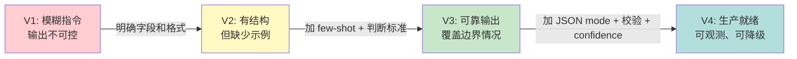
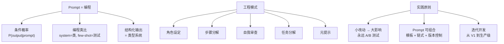

[← 上一章](08-reasoning.md) | [目录](../README.md) | [下一章 →](10-knowledge.md)

**English**: [English](../en/chapters/09-prompting.md)

# 第九章：Prompt 是编程

> "The hottest new programming language is English."
> — Andrej Karpathy

前八章把引擎的内部构造拆开看了一遍，从这一章起，车该真正开上路了。握在手里的那把方向盘，就是 prompt。

核心论点其实只有一句话：prompt 不是在“跟 AI 说话”，而是在用**自然语言编程**。一旦看清了这层关系，手上的习惯就会彻底转变，不再是随手试几句碰运气，而是严肃的工程实践。

---

## 9.1 Prompt 不是指令，是条件概率

### 你不是在“告诉”模型做什么

大多数人随手写 prompt，都把它当成派任务的指令：“帮我写一首诗”、“翻译成英文”、“总结这篇文章”。这么理解不算错，只是看浅了。

回想第一章给出的核心公式：

$$P(\text{output} \mid \text{prompt})$$

每一段写下的 prompt，本质上都是在划定一个**条件概率分布**。你不是在向模型发号施令，而是在布设一个概率场，让你想要的那个答案，恰好成为当前分布里概率最高的续写。

### 一个直觉类比

不妨想象走进一间剧场。舞台上的灯光、布景与戏服，全都是 prompt。演员（也就是模型）置身其中，自会顺理成章地入戏。你没有逐字逐句教他念台词，但只要布景立在那里，他多半会演一出什么戏，其实已经定下了。

```
布景 = 古代宫廷    → 演员大概率开始演古装戏
布景 = 现代办公室  → 演员大概率开始演职场剧
布景 = 法庭        → 演员大概率开始演律政剧
```

System prompt 就是整座舞台的布景。至于你给出的 few-shot examples，则是前几场戏排好的片段：演员看明白了“前面原来是这么演的”，下半场便会顺着同样的腔调接着往下演。

### 小改动，大影响

既然拨动的是高维空间里的概率分布，字句间极微小的变化，就能引出截然不同的输出。这不是 bug，而是整套系统底层的本质特性。

```python
# 看似微小的措辞差异
prompt_a = "List 3 reasons why Python is popular."
prompt_b = "What are 3 reasons Python is popular?"

# 两者的输出风格可能完全不同：
# prompt_a → 倾向于生成编号列表（"1. ... 2. ... 3. ..."）
# prompt_b → 倾向于生成段落式回答
```

道理落在训练数据上。“List” 这个 token 在预训练语料里大量排在列表格式前面，一露面就会唤醒匹配列表格式的 attention 模式；“What are” 则更常出现在一问一答的对话里，调动出来的自然是另一套生成模式。

Token 落在高维空间里，极其细微的扰动也可能推着它越过决策边界（decision boundary），把模型带上一条完全不同的生成路径。这很像混沌系统里的蝴蝶效应：开局选下的第一个 token，会一环扣一环地级联波及后续所有 token。

---

## 9.2 Prompt 的编程类比

只要换上编程的眼光来看 prompt，许多写代码时熟悉的旧概念，便能在这里一一对号入座：

| 编程概念 | Prompt 对应 | 说明 |
|---------|------------|------|
| 类定义 | System prompt | 定义行为、人格、约束 |
| 函数调用 | User message | 具体的输入 |
| 单元测试 | Few-shot examples | 展示期望的输入输出对 |
| 强制中间变量 | CoT 指令 | “先分析，再回答” |
| 返回类型 | Output format spec | “用 JSON 格式返回” |
| 确定性等级 | Temperature | 0 = 完全确定性，1 = 随机性 |
| 函数签名 | Tool/Function definition | 定义可用工具及其参数 |
| 注释 | Prompt 中的解释 | 帮助模型理解意图 |

### System Prompt = 类定义

```python
# 编程中的类定义
class CodeReviewer:
    """A strict code reviewer that focuses on security and performance."""
    
    def __init__(self):
        self.style = "direct and concise"
        self.focus = ["security", "performance", "readability"]
        self.language = "Chinese"
    
    def review(self, code: str) -> str:
        ...
```

```
# 等价的 System Prompt
你是一个严格的代码审查者。
- 风格：直接、简洁
- 关注点：安全性、性能、可读性
- 使用中文回复
```

两者做的是同一件事：定义一个实体的行为模式。区别只在表达方式，类定义依赖精确的语法，prompt 靠的则是日常语言。后者更灵活，却也天生带上了几分模糊。

### Few-shot Examples = 单元测试

```python
# 单元测试定义了期望行为
def test_sentiment_analysis():
    assert analyze("这部电影太棒了！") == "正面"
    assert analyze("服务态度极差") == "负面"
    assert analyze("还行吧，一般般") == "中性"
```

```
# 等价的 Few-shot prompt
对以下评论进行情感分析，输出"正面"、"负面"或"中性"。

评论：这部电影太棒了！
情感：正面

评论：服务态度极差
情感：负面

评论：还行吧，一般般
情感：中性

评论：{new_review}
情感：
```

给出的 few-shot examples 交代了要做什么，更在字里行间立下了清晰的隐性约束：
- **输出格式**：只要一个词，不要整段话
- **输出范围**：限定在三个选项之内
- **边界情况**：面对模棱两可的中性话该怎么定夺

Few-shot 的威力全在于此：它把任务定义、格式要求与边界取舍一口气交代清楚，给出的确定感，比任何纯粹的文字描述都要精确。

### CoT = 强制中间变量

```python
# 编程：用中间变量拆解计算
def complex_calc(a, b, c):
    step1 = a * b          # 不能跳过这步
    step2 = step1 + c      # 依赖 step1
    result = step2 ** 2    # 依赖 step2
    return result
```

```
# 等价的 CoT prompt
请按以下步骤回答：
1. 首先，识别问题中的关键信息
2. 然后，列出可能的解题思路
3. 接着，逐步执行计算
4. 最后，给出最终答案

问题：...
```

在 prompt 里写下“先想再答”，本质上是在**强制模型生成中间 token**。第八章讲过那个核心判断：消耗更多 token，就意味着获得更多计算步数。CoT 指令把原本指望一步到位的输出拆解开来，转成多步推导，硬是在前向传播中给模型撑出了更宽裕的“计算空间”。

---

## 9.3 结构化输出 = 类型系统

### 为什么需要结构化输出

大语言模型默认交出的是散落的自由文本。真到了真实的工程项目里，下游程序没法靠猜测去读懂一堆长篇大论，你几乎时刻都需要**可解析的、格式稳定的输出**。

```python
# 你想要这个
{"sentiment": "positive", "confidence": 0.92, "keywords": ["excellent", "recommend"]}

# 模型可能给你这个
"The sentiment is positive with high confidence. Key words include 'excellent' and 'recommend'."

# 或者这个
"Based on my analysis, I would classify this as a POSITIVE review..."
```

放任模型输出自由文本，感觉就像在用一门没有类型系统的编程语言。表面上看什么都能写，可下游的调用方拿在手里，根本没办法稳妥地解析。

### JSON Mode：最基本的类型约束

```python
from openai import OpenAI
client = OpenAI()

response = client.chat.completions.create(
    model="gpt-4o",
    response_format={"type": "json_object"},
    messages=[
        {"role": "system", "content": "分析用户评论的情感。以 JSON 格式返回，包含 sentiment 和 confidence 字段。"},
        {"role": "user", "content": "这家餐厅的菜品一般，但服务员态度很好。"}
    ]
)

import json
result = json.loads(response.choices[0].message.content)
# {"sentiment": "mixed", "confidence": 0.78}
```

JSON mode 能保证交出来的文本是一段合法的 JSON，却管不住这个 JSON 的内部结构。模型随时可能返回任意字段，格式合规，下游的代码却依然接不住。

### Function Calling：带类型签名的结构化输出

到了 Function calling，规矩就立得更明确了，你可以直接定义一份精确的 schema：

```python
from openai import OpenAI
client = OpenAI()

tools = [{
    "type": "function",
    "function": {
        "name": "analyze_sentiment",
        "description": "分析文本的情感",
        "parameters": {
            "type": "object",
            "properties": {
                "sentiment": {
                    "type": "string",
                    "enum": ["positive", "negative", "neutral", "mixed"],
                    "description": "情感类别"
                },
                "confidence": {
                    "type": "number",
                    "minimum": 0,
                    "maximum": 1,
                    "description": "置信度 0-1"
                },
                "keywords": {
                    "type": "array",
                    "items": {"type": "string"},
                    "description": "关键情感词"
                }
            },
            "required": ["sentiment", "confidence"]
        }
    }
}]

response = client.chat.completions.create(
    model="gpt-4o",
    tools=tools,
    tool_choice={"type": "function", "function": {"name": "analyze_sentiment"}},
    messages=[
        {"role": "user", "content": "这家餐厅的菜品一般，但服务员态度很好。"}
    ]
)
```

这就像在程序里给函数声明了参数类型：`sentiment` 只能取四个枚举值中的一个，`confidence` 必须是 0-1 之间的数字。

### Constrained Decoding：在 token 级别强制语法

走得更彻底的路线是**受限解码**（constrained decoding）：在模型每吐出一个 token 的关口，直接把不符合语法的 token 全部剔除。

```python
# 使用 Outlines 库进行受限解码
# https://github.com/dottxt-ai/outlines
from pydantic import BaseModel, confloat
from enum import Enum
import outlines

class Sentiment(str, Enum):
    positive = "positive"
    negative = "negative"
    neutral = "neutral"
    mixed = "mixed"

class SentimentResult(BaseModel):
    sentiment: Sentiment
    confidence: confloat(ge=0, le=1)
    keywords: list[str]

model = outlines.models.transformers("meta-llama/Llama-3.1-8B-Instruct")
generator = outlines.generate.json(model, SentimentResult)

result = generator("分析以下评论的情感：这家餐厅的菜品一般，但服务员态度很好。")
# result 一定符合 SentimentResult 的 schema
```

Outlines 的底细其实很直接：每一步解码，它都会对照 JSON schema 算出眼下允许出现的合法 token 集合，剩下的其他 token 概率通通设为 0。这相当于把类型检查压到了最底层的 token 粒度。

### 为什么结构化输出有效

从概率的视角来琢磨，这件事的根本逻辑并不复杂：结构化输出**缩小了输出空间**。

```
无约束：输出空间 = 所有可能的 token 序列（无穷大）
JSON mode：输出空间 = 所有合法 JSON（仍然很大）
Function calling：输出空间 = 符合 schema 的 JSON（小得多）
Constrained decoding：输出空间 = 精确匹配语法的序列（最小）
```

候选的输出空间越小，模型犯错的几率就越低。这和软件工程里的常识如出一辙：静态类型语言比动态类型语言更容易及早逮住错误，根本原因就是类型系统大幅收窄了合法程序所能存在的空间。

---

## 9.4 Prompt 工程模式

就像软件工程拥有经典的设计模式（Design Patterns），prompt 工程在漫长的实践中，也沉淀出了一批经受过实战检验的固定模式。

### 模式一：角色设定（Role Prompting）

**核心思想**：给模型指定一个具体的角色，以此唤起训练数据里附着在这一身份上的知识储备与行事风格。

```
❌ 一般的 prompt：
解释量子纠缠。

✅ 加了角色设定：
你是一位物理学教授，擅长用简单的类比向本科生解释复杂概念。
请解释量子纠缠。
```

这招之所以管用，是因为模型的训练语料里本就存着大量大学教授讲课的内容。“物理学教授”这个身份标签一旦贴上，模型就会自然切换到对应的语言习惯，更乐意用类比打比方、拆解出清晰的步骤，同时避开那些晦涩堆砌的专业行话。

不过也别把角色设定当成灵丹妙药。你就算在提示词里写上“你是世界上最顶尖的数学家”，它的算术水平也不会凭空拔高一截。角色调动的只是模型的**语言模式**，根本改变不了底层的计算能力。

### 模式二：步骤分解（Step-by-Step）

**核心思想**：把庞杂的任务拆解成一串次序分明的具体步骤。

```
❌ 一步到位：
分析这段代码有什么 bug，然后修复它。

✅ 分步骤：
请按以下步骤分析这段代码：
1. 先阅读代码，理解它的意图
2. 找出所有可能的 bug（列出每一个）
3. 对每个 bug，解释它会导致什么问题
4. 给出修复后的完整代码
```

这种做法的真正巧妙之处，在于**强制生成中间推理 token**。模型没法抄近道跳步：它只有老老实实把第 1 步的内容生成完，带着这些前置上下文，才能顺理成章地推进到第 2 步。

### 模式三：自我审查（Self-Critique）

**核心思想**：给模型搭一个回头看的台阶，让它自己审视并修正刚刚给出的回答。

```
请按以下流程回答：

1. 【初步回答】先给出你的回答
2. 【自我审查】检查你的回答中是否有以下问题：
   - 事实错误
   - 逻辑漏洞
   - 遗漏的关键点
3. 【修正版本】基于审查结果，给出修正后的最终回答
```

这一招之所以灵验，道理其实很直白：一进入“审查”环节，模型面对的条件就彻底变了。它不再需要从零凭空捏造，而是站在已经摆在眼前的文字上去做审视。这就像人写完草稿再通读一遍，当初落笔时漏掉的破绽，往往在回头审读时一目了然。

### 模式四：任务分解（Decomposition）

**核心思想**：把一个让人无从下手的复杂任务，拆解为一组各自独立的简单子任务。

```
❌ 一个巨大的 prompt：
阅读这 10 篇论文，总结每篇的核心贡献，对比它们的方法论差异，
找出研究空白，然后提出一个新的研究方向。

✅ 分解为 pipeline：
Prompt 1: 总结每篇论文的核心贡献（一次处理一篇）
Prompt 2: 给定所有摘要，对比方法论差异
Prompt 3: 基于对比结果，识别研究空白
Prompt 4: 基于空白，提出新方向
```

这一模式恰好击中了自回归生成的一个硬伤：模型天生缺少全局规划的能力（我们在第八章讲过这一点）。借由人工把流程拆开，原本那个需要一眼望到头的全局难题，就被化解成了一连串只考验局部推理的简单小题。

### 模式五：元提示（Meta-Prompting）

**核心思想**：让模型自己动手，为特定的任务设计 prompt。

```
我需要让 LLM 从产品评论中提取结构化数据（产品名、优点、缺点、评分）。
请为这个任务设计一个高效的 prompt，要求：
1. 输出格式为 JSON
2. 能处理各种评论风格（简短、啰嗦、含讽刺）
3. 在信息不足时输出 null 而不是猜测
```

元提示背后的门道并不神秘：模型在训练阶段读过海量关于提示词工程的讨论、教程与经验总结，它心里自然有数什么样的 prompt 更好用。让它反过来替我们写 prompt，本质上就是在借力它掌握的这层元知识。

---

## 9.5 为什么小改动效果差很多

### Token 级别的蝴蝶效应

把观察视角拉到 token 的尺度，就能看清那些看似无关紧要的措辞变化，究竟如何在模型内部掀起风浪。哪怕只是换掉一两个词，底层的输入序列也会彻底变样。

```python
import tiktoken
enc = tiktoken.encoding_for_model("gpt-4o")

# 两个"差不多"的 prompt
prompt_a = "Summarize the following text:"
prompt_b = "Summarize this text:"

tokens_a = enc.encode(prompt_a)
tokens_b = enc.encode(prompt_b)

print(f"Prompt A tokens: {tokens_a}")  # 不同的 token 序列
print(f"Prompt B tokens: {tokens_b}")  # 不同的 token 序列
```

在人看来，这两句话的意思几乎没有分别；可落进 token 空间里，它们根本就是两串互不相干的输入。既然输入变了，穿过 attention 层算出的 hidden states 便跟着偏移，最终落到下一个 token 上的概率分布也全换了模样。

### 首 token 的级联效应

自回归生成的机理十分苛刻：模型每挑选一个 token，都必须完全依赖此前写下的所有内容。这就意味着，开头吐出的第一个 token 一旦出现分歧，后续整个生成路径都会被带向截然不同的方向。

```
Prompt: "法国的首都是哪里？请用一句话回答。"

路径 A: "法" → "国" → "的" → "首都" → "是" → "巴黎" → "。"
路径 B: "巴" → "黎" → "是" → "法国" → "的" → "首都" → "..." → (更长的解释)
```

起手的第一个 token 选了“法”还是“巴”，直接决定了整段回答的行文骨架。Prompt 里极其微小的措辞起伏，就足以让首个 token 的概率排名发生反转，哪怕分歧仅仅是从 0.49 挪到了 0.51。

### 词序影响 Attention 模式

Transformer 架构里的 attention 机制对**位置敏感**。同样的几个词只要挪换了前后次序，在模型内部激发的 attention 模式就会大不一样：

```
Prompt A: "请先分析原因，然后给出建议"
Prompt B: "请给出建议，并分析原因"

# Prompt A 中，"分析原因"出现在前面，模型更可能先分析再给建议
# Prompt B 中，"给出建议"出现在前面，模型更可能先给建议
# 这不仅仅是因为模型"读懂了顺序"
# 更因为 attention 权重的分布与位置相关
```

### 实践原则：永远做 A/B 测试

摸透了这些底层机理，工程上能立得住的铁律只有一条：永远不要凭空假设哪个 prompt 更好，你必须动手去测。

```python
# 简单的 prompt A/B 测试框架
import asyncio
from openai import AsyncOpenAI

async def evaluate_prompt(client, prompt, test_cases, n_runs=5):
    """对一个 prompt 跑多个测试用例，返回平均得分"""
    scores = []
    for case in test_cases:
        for _ in range(n_runs):
            response = await client.chat.completions.create(
                model="gpt-4o",
                messages=[
                    {"role": "system", "content": prompt},
                    {"role": "user", "content": case["input"]}
                ],
                temperature=0.3
            )
            output = response.choices[0].message.content
            score = case["scorer"](output)
            scores.append(score)
    return sum(scores) / len(scores)

# 用法
prompt_a = "你是一个翻译助手。请将用户输入翻译成英文。"
prompt_b = "将以下中文翻译成地道的英文。保持原文的语气和风格。"

# 在同样的测试集上比较两个 prompt
```

---

## 9.6 Prompt 的可组合性

### 模板变量：Prompt 中的参数

好 prompt 从来不该是写死在代码里的固定字符串，而是一套预留了参数插槽的模板。把变量抽出来，一段提示词才能真正复用起来。

```python
# 硬编码 — 不可复用
prompt = "请将以下英文翻译成中文：Hello, how are you?"

# 模板化 — 可复用
def build_translation_prompt(text: str, source_lang: str, target_lang: str) -> str:
    return f"""请将以下{source_lang}文本翻译成{target_lang}。
要求：
- 保持原文的语气和风格
- 专业术语保留原文并在括号中标注翻译

原文：
{text}

翻译："""

# 使用
prompt = build_translation_prompt(
    text="The attention mechanism allows the model to focus on relevant parts.",
    source_lang="英文",
    target_lang="中文"
)
```

### 条件分支：根据输入调整 prompt

```python
def build_analysis_prompt(text: str, text_type: str) -> str:
    base = "分析以下文本的情感倾向。\n\n"
    
    # 根据文本类型添加不同的指导
    if text_type == "review":
        base += "这是一条产品评论。请关注：产品质量、服务态度、性价比。\n"
    elif text_type == "social_media":
        base += "这是一条社交媒体帖子。注意：可能包含讽刺、网络用语、表情符号。\n"
    elif text_type == "news":
        base += "这是一篇新闻报道。注意：区分事实陈述和观点表达。\n"
    
    base += f"\n文本：{text}\n\n分析："
    return base
```

### Prompt Chaining：管道式组合

```python
async def research_pipeline(topic: str, client) -> dict:
    """一个三步 prompt chain"""
    
    # Step 1: 生成搜索关键词
    keywords_prompt = f"为以下研究主题生成 5 个搜索关键词，用 JSON 数组格式返回：\n主题：{topic}"
    keywords_response = await call_llm(client, keywords_prompt)
    keywords = json.loads(keywords_response)
    
    # Step 2: 对每个关键词生成摘要（前一步的输出是这一步的输入）
    summaries = []
    for kw in keywords:
        summary_prompt = f"关于「{kw}」这个主题，写一段 100 字的摘要，聚焦在最新进展。"
        summary = await call_llm(client, summary_prompt)
        summaries.append({"keyword": kw, "summary": summary})
    
    # Step 3: 综合所有摘要（前面所有步骤的输出是这一步的输入）
    synthesis_prompt = f"""基于以下研究摘要，写一份关于「{topic}」的综合分析报告。

摘要：
{json.dumps(summaries, ensure_ascii=False, indent=2)}

要求：
- 找出共同主题
- 识别矛盾之处
- 指出研究空白
"""
    report = await call_llm(client, synthesis_prompt)
    
    return {"keywords": keywords, "summaries": summaries, "report": report}
```

### 版本控制：像管理代码一样管理 Prompt

Prompt 从来不是随手写下的临时便条，它本身就是系统逻辑的一部分，理应像管理代码那样建立起清晰的版本体系：

```
prompts/
├── sentiment_analysis/
│   ├── v1.txt          # 初版
│   ├── v2.txt          # 加了 few-shot examples
│   ├── v3.txt          # 加了 edge case 处理
│   └── eval_results.json  # 每个版本的评估结果
├── translation/
│   ├── v1.txt
│   └── v2.txt
└── prompt_registry.yaml   # 生产环境使用哪个版本
```

```yaml
# prompt_registry.yaml
sentiment_analysis:
  production: v3
  staging: v4-experimental
  
translation:
  production: v2
  staging: v2
```

关键原则：
- **每次修改都要有记录**：交代清楚为什么改、具体改了什么。
- **每个版本都有评估结果**：不能只凭感觉说“好了”，必须拿出客观的评估数据。
- **生产版本和实验版本分开**：如同代码库中的 main 与 feature branch，把线上的稳定版本与手头的实验版本严格隔开。
- **Prompt 的 review 和代码 review 同等重要**：提示词的变动绝不能随意合入，同样需要经过严谨的同行审查。

---

## 9.7 实战：从烂 Prompt 到好 Prompt

找一个真实的任务做靶子，把一段 prompt 从草稿一路改到能上生产环境，最能看清调优的门道。

**任务**：从客户邮件中提取结构化信息（客户名称、问题类别、紧急程度、核心诉求）。

### V1：最朴素的尝试

```
从这封邮件中提取关键信息。

邮件：{email_content}
```

**问题**：
- 输出格式全凭模型自由发挥，可能是段落、列表，甚至一段残缺的 JSON，下游程序根本接不住。
- “关键信息”四个字太含糊：模型无从得知你到底需要抓取哪些字段。
- 连一个像样的示例都没给，模型只能全凭猜测去拼凑输出。

**实际输出**（不可靠）：
```
这封邮件来自张先生，他对产品的交付延迟表示不满，要求尽快处理。
```

### V2：明确输出格式

```
从以下客户邮件中提取信息，以 JSON 格式返回：
- customer_name: 客户姓名
- category: 问题类别（退款/技术问题/投诉/咨询/其他）
- urgency: 紧急程度（高/中/低）
- core_request: 核心诉求（一句话概括）

邮件：{email_content}
```

**改进**：
- 把要提取的字段一项项明确列了出来。
- 锁定了分类的取值范围（enum）。
- 明确指定用 JSON 格式返回。

**还有什么问题**：
- 模型可能会在 JSON 里夹带中文全角引号，或者漏掉标点导致解析报错。
- 紧急程度缺乏硬性判断准则，全凭模型自己拿捏。
- 压根没交代字段缺失时该如何处理。

### V3：加上 Few-shot 和边界处理

```
你是一个客户邮件分析系统。从邮件中提取结构化信息。

输出格式：严格的 JSON，字段如下：
- customer_name: string | null（如果无法确定）
- category: "refund" | "technical" | "complaint" | "inquiry" | "other"
- urgency: "high" | "medium" | "low"
- core_request: string（一句话，不超过 50 字）

紧急程度判断标准：
- high: 提到了截止日期、法律行动、大额损失、或明确表达愤怒
- medium: 表达了不满但语气尚可，或问题影响了正常使用
- low: 一般咨询，无时间压力

示例 1:
邮件：我是李明，订单号 #12345。我三天前就该收到货了但是一直没到！我这是给客户的赠品，如果明天还不到我要退款！！！
输出：{"customer_name": "李明", "category": "complaint", "urgency": "high", "core_request": "订单延迟未到货，要求次日送达否则退款"}

示例 2:
邮件：你好，我想问一下你们的企业版和个人版有什么区别？我们公司大概50人，适合哪个方案？
输出：{"customer_name": null, "category": "inquiry", "urgency": "low", "core_request": "咨询企业版与个人版区别，50人规模选择建议"}

示例 3:
邮件：你们这个破软件又崩了！！上次你们说修好了，结果今天又出现同样的问题。我们整个团队都在等着用，严重影响项目进度。请尽快给我一个解决方案。- 王经理
输出：{"customer_name": "王经理", "category": "technical", "urgency": "high", "core_request": "软件再次崩溃影响团队工作，要求尽快给出解决方案"}

现在分析这封邮件：
{email_content}
输出：
```

**V3 的改进**：
1. **角色设定**：开门见山把身份定为“分析系统”。
2. **字段使用英文 enum**：借由英文枚举杜绝中英文混杂的毛刺，下游解析省心得多。
3. **null 处理**：把信息缺失时的行为交代得清清楚楚。
4. **判断标准**：给紧急程度立了界限分明的规则，不再让模型凭空猜测。
5. **三个 few-shot 示例**：挑了 3 个典型样本，高、中、低紧急度与各类诉求全覆盖到了。
6. **边界情况**：在示例 2 里专门演示了找不着客户名时老老实实填入 null 的做法。

### V4：生产级别：加入防御性措施

`````python
SYSTEM_PROMPT = """你是一个客户邮件分析系统。你的输出将被程序直接解析，必须是严格合法的 JSON。

## 输出 Schema

```json
{
  "customer_name": "string | null",
  "category": "refund | technical | complaint | inquiry | other",
  "urgency": "high | medium | low",
  "core_request": "string (≤50字)",
  "confidence": "high | medium | low"
}
```

## 规则

1. 只输出 JSON，不输出任何其他文字
2. 如果信息无法确定，用 null，不要猜测
3. confidence 字段反映你对整个提取结果的信心：
   - high: 信息清晰明确
   - medium: 部分信息需要推测
   - low: 邮件内容模糊或缺乏关键信息
4. core_request 必须是陈述句，概括客户的核心诉求

## 紧急程度判断

- **high**: 明确的截止日期 | 威胁法律行动 | 提到重大经济损失 | 情绪激动（多个感叹号、大写字母）
- **medium**: 表达不满 | 影响正常工作 | 第二次联系相同问题
- **low**: 一般咨询 | 无时间压力 | 语气平和"""

FEW_SHOT_EXAMPLES = [
    # ... (同 V3，但放在 messages 的 user/assistant 轮次中)
]

def analyze_email(email_content: str) -> dict:
    messages = [
        {"role": "system", "content": SYSTEM_PROMPT},
    ]
    # 添加 few-shot examples
    for ex in FEW_SHOT_EXAMPLES:
        messages.append({"role": "user", "content": ex["email"]})
        messages.append({"role": "assistant", "content": json.dumps(ex["output"], ensure_ascii=False)})
    # 添加实际输入
    messages.append({"role": "user", "content": email_content})
    
    response = client.chat.completions.create(
        model="gpt-4o",
        messages=messages,
        temperature=0,  # 确定性输出
        response_format={"type": "json_object"},
    )
    
    result = json.loads(response.choices[0].message.content)
    
    # 后处理：校验 schema
    assert result["category"] in ["refund", "technical", "complaint", "inquiry", "other"]
    assert result["urgency"] in ["high", "medium", "low"]
    
    return result
`````

**V4 的防线加固**：
1. **JSON mode 强制**：直接开启 `response_format={"type": "json_object"}`，从协议层把输出锁在 JSON 结构里。
2. **confidence 字段**：让模型主动报出置信度，凡是没底气的输出，统统路由给人工兜底。
3. **Temperature=0**：信息抽取与分类是硬碰硬的工程，容不得随机漂移，必须压到确定性的输出。
4. **后处理校验**：即便有底层协议保底，代码里也必须加上 schema 断言，防御到底。
5. **Few-shot 放在对话轮次中**：把示例拆成多轮 user/assistant 消息，模型的遵循度往往比塞在 system prompt 里更稳。

### 迭代教训总结



**核心教训**：
1. **Prompt 开发和软件开发一样是迭代过程**：谁也没本事第一版就写出无可挑剔的提示词，好效果都是一轮轮改出来的。
2. **明确 > 隐含**：模型不会读心，想要什么格式与边界，就白纸黑字写得一清二楚。
3. **Few-shot examples 是最好的"说明文档"**：精心挑选 3 个好例子，往往胜过洋洋洒洒写满一整页规则描述。
4. **总是为失败做准备**：把置信度字段加上，后处理校验备好，降级分流的兜底策略随时待命。
5. **测量，不要猜**：拿真实语料跑评估，让数据拿主意，千万别凭感觉去盲目改动。

---

## 本章小结



核心要点：

1. **Prompt 是条件概率的构造器**，绝非简单的自然语言发号施令。
2. **编程类比很管用**：System prompt 对应类定义，Few-shot 对应单元测试，CoT 则是强行逼出的中间变量。
3. **结构化输出是你最好的朋友**：从 JSON mode、function calling 到 constrained decoding，约束层层收紧，可靠性步步抬升。
4. **掌握核心模式**：角色设定、步骤分解、自我审查、任务分解与元提示，构成了日常开发的基本武器库。
5. **微小改动可能产生巨大差异**：高维空间极其敏感，永远用数据说话，切忌凭直觉臆断。
6. **Prompt 管理要像代码管理**：模板化、版本控制与评审流程，一个都不能少。
7. **迭代是正道**：从来不存在一步到位的完美提示词，唯有一步步打磨才能立足生产。

---

## 延伸阅读

- [Prompt Engineering Guide](https://www.promptingguide.ai/)：最全面的 prompt 工程指南
- [Chain-of-Thought Prompting Elicits Reasoning](https://arxiv.org/abs/2201.11903)：Wei et al. 2022，CoT 原始论文
- [Self-Consistency Improves Chain of Thought Reasoning](https://arxiv.org/abs/2203.11171)：Wang et al. 2022
- [Large Language Models are Zero-Shot Reasoners](https://arxiv.org/abs/2205.11916)：Kojima et al. 2022，"Let's think step by step"
- [Outlines](https://github.com/dottxt-ai/outlines)：结构化生成库
- [OpenAI Function Calling Guide](https://platform.openai.com/docs/guides/function-calling)
- [DSPy](https://github.com/stanfordnlp/dspy)：编程化的 prompt 优化框架
