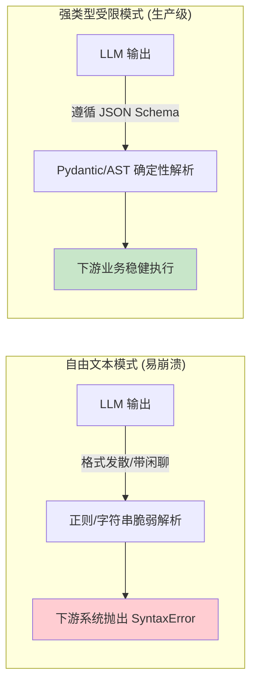
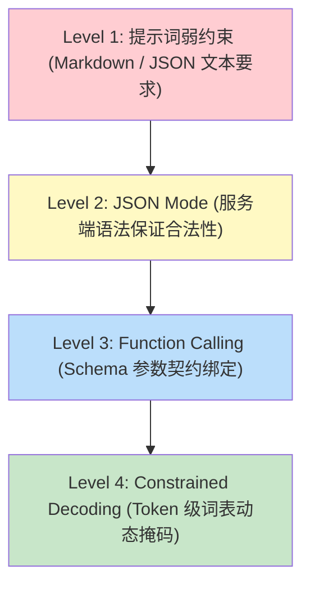
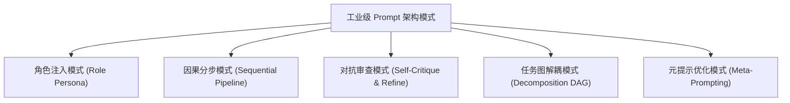
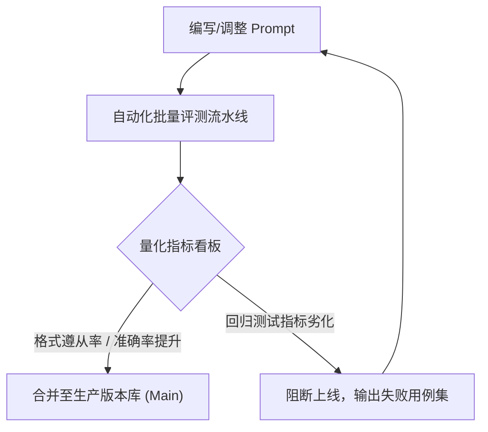
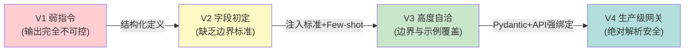
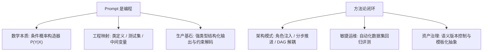

[← 上一章](08-reasoning.md) | [目录](../README.md) | [下一章 →](10-knowledge.md)

**English**: [English](../en/chapters/09-prompting.md)

# 第九章：Prompt 是编程

> "The hottest new programming language is English."
> , Andrej Karpathy

若前八章致力于剖析机器认知引擎的物理与统计机理，那么从本章开始，我们将聚焦系统交互与操控范式。Prompt，正是驱动这一庞大生成流形的核心交互界面。

**核心论点：Prompt 不是泛化的自然语言聊天，而是面向连续概率空间的软性程序构造。** 一旦确立这一工程视角，开发范式将发生质的跃迁：从偶发性的启发式试错，演化为严谨的软件工程实践。

---

## 9.1 Prompt 不是指令，是条件概率构造器

### 从单向控制到先验流形约束

工程初学者常将 Prompt 视为单向命令："请撰写一首十四行诗"、"将该段落转译为英文"、"提取财务指标"。此类理解虽符合直觉，但未能触及计算本质。

回顾第一章形式化定义：大语言模型所执行的核心运算为：

$$P(\text{Output} \mid \text{Prompt})$$

工程师编写的每一个字符，本质上皆是在高维隐空间中**构造一个特定的条件概率超平面**。你并非在对智能体下达硬性指令，而是在调整参数分布的先验条件，使得目标输出成为该分布收敛时似然概率最大的延展轨迹。

### 概率流形的戏剧布景隐喻

设想一座严整的剧场：舞台的聚光灯走向、历史道具陈列与时代服饰，均对应 Prompt 的不同维度。当演员（预训练模型）置身于特定场景中，其认知表征会自动对齐该环境的语义场：

```
先验设定: 古典宫廷语境   → 触发文言或古典句式概率分支
先验设定: 现代金融交易室 → 触发术语密集、短促量化的概率分支
先验设定: 司法审判法庭   → 触发严密因果、合规严谨的概率分支
```

System Prompt 即全局舞台规约；Few-shot 示范样本则等价于前置演练的经典桥段：演员捕捉到既定的叙事范式，便会沿着相同的风格轨迹持续演绎。

### 微小扰动的级联效应

在连续几何流形中，极其微小的输入扰动亦可能引发决策超平面的偏移：

```python
# 语义相近但在 Token 空间异构的 Prompt
prompt_a = "List 3 reasons why Python is popular."
prompt_b = "What are 3 reasons Python is popular?"

# 输出拓扑差异:
# prompt_a → 强烈激活序号枚举模式 (例如 "1. ... 2. ... 3. ...")
# prompt_b → 倾向于激活论述性段落展开
```

其机理在于：Token `"List"` 在预训练语料中与列表排版符号具有极强的注意力共现权重；而 `"What are"` 则显著富集于交互式问答语料。

此现象类似于动力系统中的初值敏感性：首个 Token 的采样决策将作为强条件先验，对后续生成轨迹产生级联影响。

---

## 9.2 Prompt 工程与经典编程范式的同构映射

将 Prompt 视作一门新兴的声明式编程语言，经典软件工程的概念在此能够找到精确的映射：

| 经典软件工程范式 | Prompt 工程等价物 | 系统工程内涵 |
|---|---|---|
| **类定义 (Class Definition)** | System Prompt | 规范全局行为准则、角色边界与不可变约束 |
| **函数入参 (Function Arguments)** | User Message | 注入瞬态业务数据与具体计算目标 |
| **单元测试断言 (Unit Tests)** | Few-shot Examples | 显式声明期望的输入输出对（I/O Pairs） |
| **中间变量与暂存器 (Scratchpad)** | 思维链 (CoT) 指令 | 强制展开多步前向计算，扩充推演容量 |
| **返回类型签名 (Return Types)** | 结构化 Schema 约束 | 锁定 JSON / Pydantic 等结构化输出格式 |
| **确定性度量 (Determinism)** | 采样温度 $T$ / Top-p | $T=0$ 对应确定性求值，$T>0$ 引入探索熵 |
| **外部 API 绑定 (Foreign Function)** | Tool / Function Calling | 声明外部工具元数据及参数签名 |

### System Prompt 即类与接口规范

```python
# 经典 OOP 抽象
class SecurityAuditor:
    """聚焦于高并发安全与内存泄漏的严格代码审计器"""
    def __init__(self):
        self.style = "rigorous_and_concise"
        self.target_vulnerabilities = ["RCE", "SQLi", "Memory_Leak"]
        self.output_language = "zh-CN"
```

```markdown
# 等价的 System Prompt 规约
你是一名资深系统安全审计架构师。
- 交互风格：直指核心、严谨无冗余；
- 审计重点：远程代码执行（RCE）、SQL 注入、并发数据竞争与内存泄漏；
- 交付语言：标准工程中文。
```

两者的本质同构：皆在定义实体的行为契约。差异在于类定义依托形式化语法约束，而 Prompt 采用高维自然语言，具备更强的语义弹性，但同时也引入了不确定性。

### Few-shot 范例即行为驱动的测试用例

```markdown
请对输入评论执行细粒度情感倾向判别，仅允许输出 "Positive"、"Negative" 或 "Neutral"。

评论: 该版本架构设计优雅，吞吐量提升显著。
标签: Positive

评论: 网关连接高频断开，文档与实际实现严重脱节。
标签: Negative

评论: 功能基本符合预期，待长期压测验证。
标签: Neutral

评论: {target_input}
标签:
```

这揭示了 Few-shot 范式的力量所在：它以极低的信息冗余同时固化了任务目标、格式契约与边界处理策略，其约束确定性远胜于纯陈述性指令。

### 思维链即强制中间状态求值

在传统编译中，复杂表达式需拆解为三地址码（Three-Address Code）或中间表征（IR）逐步求值。CoT 亦是在前向生成流中**显式开辟计算内存与中间状态序列**，使复杂逻辑得以分步消化。

---

## 9.3 结构化输出与形式化类型系统

### 自由文本与生产系统的集成鸿沟

大语言模型原生输出连续自由文本。但在企业级分布式系统中，下游服务（如数据库写入、工作流引擎、RPC 调度）依赖于严格确定性的数据格式契约。

无约束的自由文本输出类似于无类型系统：虽然具备极高的表达自由度，但下游业务系统无法建立可靠的解析与消费契约。



### 结构化约束的技术演进阶梯



#### Level 1: 提示词弱约定
在 Prompt 中声明"请务必输出 JSON 格式"。此方案极度脆弱，模型极易夹带 markdown 代码块标记或前置闲聊文本，导致标准解析器崩溃。

#### Level 2: 原生 JSON Mode
API 层开启 `response_format={"type": "json_object"}`。模型确保输出符合通用 JSON 语法，但无法约束字段键名与嵌套类型。

#### Level 3: Function Calling / Structured Outputs
通过 OpenAI / Anthropic 提供的强结构化 Schema，模型在生成过程中严格遵循 JSON Schema 规范，确保字段完整性与类型一致性。

#### Level 4: 受限解码（Constrained Decoding）
依托开源推理引擎（如 Outlines、SGLang、Guidance），在自回归每一步生成 Logits 时，动态构建有限状态机（FSM）或语法树（Grammar），**将不符合当前上下文语法的非法 Token 概率直接置为零**。

```python
# 基于 Outlines 的绝对类型安全生成示例
from pydantic import BaseModel, Field
from enum import Enum
import outlines

class SentimentCategory(str, Enum):
    POSITIVE = "positive"
    NEGATIVE = "negative"
    NEUTRAL = "neutral"

class SentimentAnalysisSchema(BaseModel):
    sentiment: SentimentCategory = Field(description="情感类别枚举")
    confidence: float = Field(ge=0.0, le=1.0, description="置信度评分")
    key_evidence: list[str] = Field(description="支撑判别依据的关键片段列表")

# 绑定模型与 Schema (Token 级受限解码)
model = outlines.models.transformers("meta-llama/Llama-3.1-8B-Instruct")
structured_generator = outlines.generate.json(model, SentimentAnalysisSchema)

# 输出必定在字节级别满足 Pydantic 模型约束
result = structured_generator("系统部署顺利，但文档排版存在微小瑕疵。")
```

### 状态空间收缩的数学原理

从信息论视角审视，结构化约束的本质是**大幅压缩采样的解空间**：

$$\Omega_{\text{All Tokens}} \gg \Omega_{\text{Valid JSON}} \gg \Omega_{\text{Strict Schema}} \gg \Omega_{\text{Exact Grammar}}$$

状态空间越收敛，模型在前向生成中发生语义偏离与结构崩溃的概率就呈指数级衰减。

---

## 9.4 工业级 Prompt 架构设计模式

正如面向对象工程沉淀出经典设计模式，Prompt 系统工程亦发展出经过大规模实践检验的高阶拓扑范式：



### 模式一：高特异性角色注入（Role Persona）

通过引入具备高知识密度的角色上下文，激活预训练流形中高权重专业子空间的语义关联：

```markdown
【反模式】：请优化这段 SQL 查询。
【工业级模式】：你是一名专注于 PostgreSQL 内核调优与执行计划分析的 DBA 专家。请针对给定的慢查询进行代价模型（Cost-based Optimizer）分析，指出隐式类型转换或索引失效风险，并输出重构后的最优 SQL。
```

### 模式二：因果分步约束（Sequential Step-by-Step）

阻断跳步直达答案的倾向，强制分配前向注意力预算：

```markdown
请遵循以下确定性流程处理输入：
阶段 1 [语义解构]：提取输入文本中涉及的所有实体、数值边界与逻辑假设；
阶段 2 [冲突检测]：核验假设之间是否存在自相矛盾或信息缺失；
阶段 3 [方案推演]：基于无冲突假设推演核心解决方案；
阶段 4 [结论输出]：提炼并交付最终结果。
```

### 模式三：双阶段对抗审查（Self-Critique Loop）

在上下文流中引入显式的对抗性自我检验环节：

```markdown
请按以下结构推进响应：
1. 【初步方案】：给出第一版技术选型与实现思路；
2. 【对抗审查】：从高并发、单点故障、极端边界条件三个维度对上述方案进行严格挑错；
3. 【最终演进方案】：吸收审查意见，给出加固后的生产级设计。
```

### 模式四：任务拓扑解耦（DAG Decomposition）

对于超长链路或高认知负载任务，坚决避免单一巨型 Prompt（Monolithic Prompt），必须将其解构为有向无环图（DAG）工作流：


---

## 9.5 敏捷评测与 Prompt 持续集成体系

### 告别直觉经验主义

在生产系统研发中，依靠肉眼观察单次输出并主观评价 Prompt 质量是极其危险的反模式。

基于以上机理推演，Prompt 工程的核心铁律在于：**永远不要凭借主观直觉断定 Prompt 的优劣，必须建立客观的数据度量闭环**。



### 自动化评测网关工程实现

```python
import asyncio
from typing import Callable, Any
from dataclasses import dataclass

@dataclass
class TestCase:
    input_payload: dict
    ground_truth: Any
    evaluator: Callable[[dict, Any], float]

async def benchmark_prompt_version(
    system_prompt: str,
    test_suite: list[TestCase],
    llm_invoker: Callable,
    concurrency: int = 8
) -> float:
    """自动化批量评估 Prompt 版本的综合表现"""
    semaphore = asyncio.Semaphore(concurrency)
    
    async def run_single_case(case: TestCase) -> float:
        async with semaphore:
            response = await llm_invoker(system_prompt, case.input_payload)
            score = case.evaluator(response, case.ground_truth)
            return score
            
    scores = await asyncio.gather(*(run_single_case(case) for case in test_suite))
    return sum(scores) / len(scores)
```

---

## 9.6 模块化与资产管理体系

在大型团队协作中，Prompt 必须被视为核心代码资产纳入版本控制系统（VCS）：

### 目录拓扑规范

```
infra/prompts/
├── registry.yaml             # 生产与测试环境版本路由表
├── core_classification/
│   ├── v1.0.0.prompt.md      # 语义版本固化
│   ├── v1.1.0.prompt.md      # 引入边界 Few-shot
│   └── changelog.md          # 变更动机与离线评测数据
└── summarization/
    ├── v2.0.0.prompt.md
    └── tests/
        └── test_fixtures.jsonl
```

### 参数化模板封装

```python
# 严禁在业务代码中散落硬编码字符串，统一收敛为模板函数
def render_analysis_prompt(
    raw_document: str,
    domain_rules: list[str],
    language: str = "zh-CN"
) -> str:
    rules_block = "\n".join(f"- {r}" for r in domain_rules)
    return f"""请依据以下领域合规规则对文档进行穿透分析。

【合规规则库】
{rules_block}

【目标文档内容】
{raw_document}

【输出规约】
采用 {language} 输出，以 Markdown 表格呈现风险点、严重程度与加固建议。
"""
```

---

## 9.7 实战演进：工业级客户意图路由系统的打磨

以真实的金融客户工单自动化分流场景为例，演示 Prompt 如何从原始雏形演进为高可靠的生产级模块。

### 阶段 1：脆弱的原始单指令（V1）

```markdown
请分析这封客户邮件并提取关键信息。
邮件内容: {email_content}
```
*缺陷诊断*：输出格式发散，缺乏字段类型约束，下游解析极易崩溃。

### 阶段 2：引入结构与枚举限制（V2）

```markdown
请从客户邮件中提取信息并输出 JSON：
- customer_name: 客户姓名
- category: 问题分类 (refund / technical / billing / general)
- urgency: 紧急度 (high / medium / low)
- core_issue: 核心问题概述
```
*缺陷诊断*：未定义边界判定标准，遇到信息缺失时可能产生幻觉推测。

### 阶段 3：注入判别标准与 Few-shot 锚定（V3）

```markdown
你是一个工单智能分发中枢。请严格提取信息并返回 JSON。

【紧急度判定基准】
- high: 涉及资金安全、系统全面宕机、法律诉讼威胁或明确升级至管理层；
- medium: 核心功能局部受阻，但存在临时绕行方案；
- low: 业务咨询、格式查询或轻度体验反馈。

【示范用例 1】
邮件: 订单 #8821 付款已成功扣款，但账户余额未更新，请立刻处理！
输出: {"customer_name": null, "category": "billing", "urgency": "high", "core_issue": "扣款成功但账户未入账"}

【示范用例 2】
邮件: 请问企业旗舰版是否支持私有化私网部署？
输出: {"customer_name": null, "category": "general", "urgency": "low", "core_issue": "咨询企业版私有化部署支持"}

目标邮件:
{email_content}
```

### 阶段 4：生产就绪：强契约与防御性元数据（V4）

```python
import json
from pydantic import BaseModel, Field
from openai import OpenAI

class TicketClassification(BaseModel):
    customer_name: str | None = Field(None, description="客户称谓或标识，若未提及则严格为 null")
    category: str = Field(description="必须严格处于: refund | technical | billing | general")
    urgency: str = Field(description="必须严格处于: high | medium | low")
    core_issue: str = Field(description="核心诉求精炼摘要，不超过 40 字")
    requires_human_escalation: bool = Field(description="是否需直接触发人工客服介入")

def process_ticket(email_content: str, client: OpenAI) -> TicketClassification:
    completion = client.beta.chat.completions.parse(
        model="gpt-4o",
        temperature=0.0,
        messages=[
            {"role": "system", "content": SYSTEM_PROMPT_WITH_STANDARDS},
            {"role": "user", "content": email_content}
        ],
        response_format=TicketClassification,
    )
    return completion.choices[0].message.parsed
```



---

## 本章小结



核心要点：

1. **确立条件概率本质**：Prompt 的核心任务在于重塑高维空间的先验概率分布；
2. **践行强类型工程契约**：在生产系统中优先选用 Structured Outputs 与受限解码，杜绝脆弱的自由文本解析；
3. **善用 Few-shot 锚定空间**：高质量的输入输出样例是对齐任务边界最高效的手段；
4. **以敏捷评测替代主观直觉**：建立固化的评测集与流水线，实现 Prompt 迭代的度量闭环；
5. **推行模块化与版本治理**：像管理核心业务代码一样管理 Prompt 资产。

在下一章中，我们将进一步探索如何让大语言模型突破固有静态权重的物理屏障：深入构建知识检索与 RAG 系统的工程体系。

---

## 延伸阅读

- [Prompt Engineering Guide](https://www.promptingguide.ai/), DAIR.AI
- [Chain-of-Thought Prompting Elicits Reasoning in Large Language Models](https://arxiv.org/abs/2201.11903), Wei et al., 2022
- [Self-Consistency Improves Chain of Thought Reasoning in Language Models](https://arxiv.org/abs/2203.11171), Wang et al., 2022
- [Large Language Models are Zero-Shot Reasoners](https://arxiv.org/abs/2205.11916), Kojima et al., 2022
- [Outlines: Fast and Reliable Structured Generation](https://github.com/dottxt-ai/outlines), Willard & Louf, 2023
- [DSPy: Compiling Declarative Language Model Calls into State-of-the-Art Pipelines](https://arxiv.org/abs/2310.03714), Khattab et al., 2023

[← 上一章](08-reasoning.md) | [目录](../README.md) | [下一章 →](10-knowledge.md)
