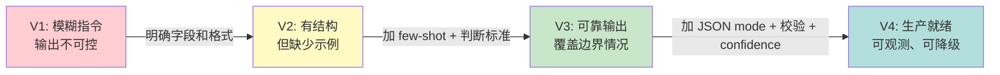
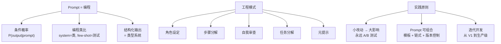

[← 上一章](08-reasoning.md) | [目录](../README.md) | [下一章 →](10-knowledge.md)

**English**: [English](../en/chapters/09-prompting.md)

# 第九章：Prompt 是编程

> "The hottest new programming language is English."
> — Andrej Karpathy

如果前八章是在理解引擎的工作原理，那么从这一章开始，我们要学会开车了。而 prompt，就是你手里的方向盘。

**核心论点：Prompt 不是"跟 AI 说话"，而是用自然语言编程。** 一旦你接受了这个视角，你对待 prompt 的方式会发生根本性变化——从"随便试试"到"严肃的工程实践"。

---

## 9.1 Prompt 不是指令，是条件概率

### 你不是在"告诉"模型做什么

大多数人把 prompt 当指令："帮我写一首诗"、"翻译成英文"、"总结这篇文章"。这种理解没有错，但它浅了。

回忆第一章的核心公式：

$$P(\text{output} \mid \text{prompt})$$

你写的每一个 prompt，本质上是在构造一个**条件概率分布**。你不是在"命令"模型做事，你是在构建一个概率场景，让你想要的输出成为这个分布下最可能的续写。

### 一个直觉类比

想象你走进一个剧场。舞台上的灯光、布景、服装——这些都是 prompt。演员（模型）看到这些条件后，会自然地进入相应的角色。你没有逐字逐句告诉演员该说什么，但布景已经决定了他大概率会演什么戏。

```
布景 = 古代宫廷    → 演员大概率开始演古装戏
布景 = 现代办公室  → 演员大概率开始演职场剧
布景 = 法庭        → 演员大概率开始演律政剧
```

System prompt 就是舞台布景。你写的 few-shot examples 就是前几场的片段——演员看到了"之前是这样演的"，就会按照同样的风格继续下去。

### 小改动，大影响

因为你是在操纵一个高维概率分布，微小的变化可以导致输出的巨大差异。这不是 bug，而是这个系统的本质特性。

```python
# 看似微小的措辞差异
prompt_a = "List 3 reasons why Python is popular."
prompt_b = "What are 3 reasons Python is popular?"

# 两者的输出风格可能完全不同：
# prompt_a → 倾向于生成编号列表（"1. ... 2. ... 3. ..."）
# prompt_b → 倾向于生成段落式回答
```

为什么？因为 "List" 这个 token 在训练数据中大量出现在列表格式的文本前面，它激活了与"列表格式"相关的 attention 模式。而 "What are" 更常出现在问答对话中，激活的是不同的生成模式。

Token 存在于一个高维空间中，微小的扰动可能跨越决策边界（decision boundary），导致模型走上完全不同的生成路径。这就像混沌系统中的蝴蝶效应——第一个 token 的选择会级联影响后续所有 token。

---

## 9.2 Prompt 的编程类比

一旦你把 prompt 看作编程，很多编程中的概念都能找到对应：

| 编程概念 | Prompt 对应 | 说明 |
|---------|------------|------|
| 类定义 | System prompt | 定义行为、人格、约束 |
| 函数调用 | User message | 具体的输入 |
| 单元测试 | Few-shot examples | 展示期望的输入输出对 |
| 强制中间变量 | CoT 指令 | "先分析，再回答" |
| 返回类型 | Output format spec | "用 JSON 格式返回" |
| 确定性等级 | Temperature | 0 = 完全确定性，1 = 随机性 |
| 函数签名 | Tool/Function definition | 定义可用工具及其参数 |
| 注释 | Prompt 中的解释 | 帮助模型理解意图 |

### System Prompt = 类定义

```python
# 编程中的类定义
class CodeReviewer:
    """A strict code reviewer that focuses on security and performance."""
    
    def __init__(self):
        self.style = "direct and concise"
        self.focus = ["security", "performance", "readability"]
        self.language = "Chinese"
    
    def review(self, code: str) -> str:
        ...
```

```
# 等价的 System Prompt
你是一个严格的代码审查者。
- 风格：直接、简洁
- 关注点：安全性、性能、可读性
- 使用中文回复
```

两者做的是同一件事：定义一个实体的行为模式。区别在于，类定义用精确的语法，prompt 用自然语言——后者更灵活，但也更模糊。

### Few-shot Examples = 单元测试

```python
# 单元测试定义了期望行为
def test_sentiment_analysis():
    assert analyze("这部电影太棒了！") == "正面"
    assert analyze("服务态度极差") == "负面"
    assert analyze("还行吧，一般般") == "中性"
```

```
# 等价的 Few-shot prompt
对以下评论进行情感分析，输出"正面"、"负面"或"中性"。

评论：这部电影太棒了！
情感：正面

评论：服务态度极差
情感：负面

评论：还行吧，一般般
情感：中性

评论：{new_review}
情感：
```

Few-shot examples 不仅展示了任务是什么，还隐式定义了：
- **输出格式**：一个词，不是一段话
- **输出范围**：只有三个选项
- **边界情况**：怎么处理中性的表达

这就是为什么 few-shot 如此强大——它同时传达了任务定义、格式要求和边界处理策略，比任何自然语言描述都精确。

### CoT = 强制中间变量

```python
# 编程：用中间变量拆解计算
def complex_calc(a, b, c):
    step1 = a * b          # 不能跳过这步
    step2 = step1 + c      # 依赖 step1
    result = step2 ** 2    # 依赖 step2
    return result
```

```
# 等价的 CoT prompt
请按以下步骤回答：
1. 首先，识别问题中的关键信息
2. 然后，列出可能的解题思路
3. 接着，逐步执行计算
4. 最后，给出最终答案

问题：...
```

当你在 prompt 中要求"先想再答"，本质上你是在**强制模型生成中间 token**。回忆第八章的洞察：更多 token = 更多计算步骤。CoT 指令把一个"一步到位"的问题，变成了需要多步推导的问题，给了模型更多的"计算空间"。

---

## 9.3 结构化输出 = 类型系统

### 为什么需要结构化输出

LLM 默认生成自由文本。但在工程系统中，你几乎总是需要**可解析的、格式稳定的输出**。

```python
# 你想要这个
{"sentiment": "positive", "confidence": 0.92, "keywords": ["excellent", "recommend"]}

# 模型可能给你这个
"The sentiment is positive with high confidence. Key words include 'excellent' and 'recommend'."

# 或者这个
"Based on my analysis, I would classify this as a POSITIVE review..."
```

自由文本输出就像没有类型系统的编程语言——什么都能写，但下游消费者无法可靠地解析。

### JSON Mode：最基本的类型约束

```python
from openai import OpenAI
client = OpenAI()

response = client.chat.completions.create(
    model="gpt-4o",
    response_format={"type": "json_object"},
    messages=[
        {"role": "system", "content": "分析用户评论的情感。以 JSON 格式返回，包含 sentiment 和 confidence 字段。"},
        {"role": "user", "content": "这家餐厅的菜品一般，但服务员态度很好。"}
    ]
)

import json
result = json.loads(response.choices[0].message.content)
# {"sentiment": "mixed", "confidence": 0.78}
```

JSON mode 保证输出是合法的 JSON，但不保证 JSON 的结构——模型可能返回任意字段。

### Function Calling：带类型签名的结构化输出

Function calling 更进一步，定义了精确的 schema：

```python
from openai import OpenAI
client = OpenAI()

tools = [{
    "type": "function",
    "function": {
        "name": "analyze_sentiment",
        "description": "分析文本的情感",
        "parameters": {
            "type": "object",
            "properties": {
                "sentiment": {
                    "type": "string",
                    "enum": ["positive", "negative", "neutral", "mixed"],
                    "description": "情感类别"
                },
                "confidence": {
                    "type": "number",
                    "minimum": 0,
                    "maximum": 1,
                    "description": "置信度 0-1"
                },
                "keywords": {
                    "type": "array",
                    "items": {"type": "string"},
                    "description": "关键情感词"
                }
            },
            "required": ["sentiment", "confidence"]
        }
    }
}]

response = client.chat.completions.create(
    model="gpt-4o",
    tools=tools,
    tool_choice={"type": "function", "function": {"name": "analyze_sentiment"}},
    messages=[
        {"role": "user", "content": "这家餐厅的菜品一般，但服务员态度很好。"}
    ]
)
```

这就像给函数定义了参数类型——`sentiment` 只能是四个值之一，`confidence` 必须是 0-1 之间的数字。

### Constrained Decoding：在 token 级别强制语法

最激进的方式是**受限解码**（constrained decoding）：在生成每个 token 时，直接屏蔽不符合语法的 token。

```python
# 使用 Outlines 库进行受限解码
# https://github.com/dottxt-ai/outlines
from pydantic import BaseModel, confloat
from enum import Enum
import outlines

class Sentiment(str, Enum):
    positive = "positive"
    negative = "negative"
    neutral = "neutral"
    mixed = "mixed"

class SentimentResult(BaseModel):
    sentiment: Sentiment
    confidence: confloat(ge=0, le=1)
    keywords: list[str]

model = outlines.models.transformers("meta-llama/Llama-3.1-8B-Instruct")
generator = outlines.generate.json(model, SentimentResult)

result = generator("分析以下评论的情感：这家餐厅的菜品一般，但服务员态度很好。")
# result 一定符合 SentimentResult 的 schema
```

Outlines 的工作原理：在每一步解码时，根据 JSON schema 计算出当前位置合法的 token 集合，把其他 token 的概率设为 0。这相当于在 token 级别实施了类型检查。

### 为什么结构化输出有效

从概率的角度理解：结构化输出**缩小了输出空间**。

```
无约束：输出空间 = 所有可能的 token 序列（无穷大）
JSON mode：输出空间 = 所有合法 JSON（仍然很大）
Function calling：输出空间 = 符合 schema 的 JSON（小得多）
Constrained decoding：输出空间 = 精确匹配语法的序列（最小）
```

输出空间越小，模型犯错的可能性越低。这和编程中的道理完全一样：静态类型语言比动态类型语言更容易发现错误，因为类型系统缩小了合法程序的空间。

---

## 9.4 Prompt 工程模式

就像软件工程有设计模式（Design Patterns），prompt 工程也发展出了一套经过验证的模式。

### 模式一：角色设定（Role Prompting）

**核心思想**：通过设定角色，激活模型训练数据中与该角色相关的知识和行为模式。

```
❌ 一般的 prompt：
解释量子纠缠。

✅ 加了角色设定：
你是一位物理学教授，擅长用简单的类比向本科生解释复杂概念。
请解释量子纠缠。
```

为什么有效？模型训练数据中包含大量教授讲课的文本。"物理学教授"这个角色标签激活了相关的语言模式——更倾向于使用类比、分步骤解释、避免过度术语。

但要注意：角色设定不是万能的。说"你是世界上最好的数学家"不会让模型算数更准——因为角色改变的是**语言模式**，不是**底层计算能力**。

### 模式二：步骤分解（Step-by-Step）

**核心思想**：把复杂任务拆解为明确的步骤序列。

```
❌ 一步到位：
分析这段代码有什么 bug，然后修复它。

✅ 分步骤：
请按以下步骤分析这段代码：
1. 先阅读代码，理解它的意图
2. 找出所有可能的 bug（列出每一个）
3. 对每个 bug，解释它会导致什么问题
4. 给出修复后的完整代码
```

这个模式本质上是在**强制生成中间推理 token**。模型不能跳步——它必须先完成第 1 步的文本，才能开始第 2 步。

### 模式三：自我审查（Self-Critique）

**核心思想**：让模型审查自己的输出，发现并修正错误。

```
请按以下流程回答：

1. 【初步回答】先给出你的回答
2. 【自我审查】检查你的回答中是否有以下问题：
   - 事实错误
   - 逻辑漏洞
   - 遗漏的关键点
3. 【修正版本】基于审查结果，给出修正后的最终回答
```

为什么有效？模型在"审查"阶段看到的条件变了——它不再是从零生成，而是在已有输出的基础上做判断。这类似于人类写完文章后重读一遍——你往往能发现写的时候没注意到的问题。

### 模式四：任务分解（Decomposition）

**核心思想**：把一个复杂任务分解为多个简单子任务。

```
❌ 一个巨大的 prompt：
阅读这 10 篇论文，总结每篇的核心贡献，对比它们的方法论差异，
找出研究空白，然后提出一个新的研究方向。

✅ 分解为 pipeline：
Prompt 1: 总结每篇论文的核心贡献（一次处理一篇）
Prompt 2: 给定所有摘要，对比方法论差异
Prompt 3: 基于对比结果，识别研究空白
Prompt 4: 基于空白，提出新方向
```

这个模式解决了 LLM 的一个根本限制：自回归生成没有全局规划能力（第八章）。通过人为分解步骤，我们把"需要全局规划的难题"变成了"多个只需局部推理的简单题"。

### 模式五：元提示（Meta-Prompting）

**核心思想**：让模型自己设计 prompt。

```
我需要让 LLM 从产品评论中提取结构化数据（产品名、优点、缺点、评分）。
请为这个任务设计一个高效的 prompt，要求：
1. 输出格式为 JSON
2. 能处理各种评论风格（简短、啰嗦、含讽刺）
3. 在信息不足时输出 null 而不是猜测
```

元提示的深层原理：模型在训练数据中看过大量的 prompt engineering 讨论和教程，所以它"知道"什么样的 prompt 有效。让它生成 prompt，就是利用这个元知识。

---

## 9.5 为什么小改动效果差很多

### Token 级别的蝴蝶效应

让我们从 token 的角度看看微小的措辞变化如何产生巨大影响。

```python
import tiktoken
enc = tiktoken.encoding_for_model("gpt-4o")

# 两个"差不多"的 prompt
prompt_a = "Summarize the following text:"
prompt_b = "Summarize this text:"

tokens_a = enc.encode(prompt_a)
tokens_b = enc.encode(prompt_b)

print(f"Prompt A tokens: {tokens_a}")  # 不同的 token 序列
print(f"Prompt B tokens: {tokens_b}")  # 不同的 token 序列
```

即使语义相同，不同的措辞在 token 空间中是不同的输入。这意味着它们经过 attention 层后产生的 hidden states 不同，最终输出的概率分布也不同。

### 首 token 的级联效应

自回归生成的一个关键特性：**每个 token 的选择都依赖所有之前的 token**。这意味着如果第一个生成的 token 不同，后续所有 token 都会受到影响。

```
Prompt: "法国的首都是哪里？请用一句话回答。"

路径 A: "法" → "国" → "的" → "首都" → "是" → "巴黎" → "。"
路径 B: "巴" → "黎" → "是" → "法国" → "的" → "首都" → "..." → (更长的解释)
```

第一个 token 是"法"还是"巴"，决定了整个回答的结构。Prompt 的微小变化可能导致第一个 token 的概率排序发生翻转——即使只是从 0.49 → 0.51。

### 词序影响 Attention 模式

Transformer 中的 attention 是**位置敏感**的。同样的词放在不同位置，会形成不同的 attention 模式：

```
Prompt A: "请先分析原因，然后给出建议"
Prompt B: "请给出建议，并分析原因"

# Prompt A 中，"分析原因"出现在前面，模型更可能先分析再给建议
# Prompt B 中，"给出建议"出现在前面，模型更可能先给建议
# 这不仅仅是因为模型"读懂了顺序"
# 更因为 attention 权重的分布与位置相关
```

### 实践原则：永远做 A/B 测试

基于以上分析，一个铁律：**永远不要假设一个 prompt 比另一个好——要测量**。

```python
# 简单的 prompt A/B 测试框架
import asyncio
from openai import AsyncOpenAI

async def evaluate_prompt(client, prompt, test_cases, n_runs=5):
    """对一个 prompt 跑多个测试用例，返回平均得分"""
    scores = []
    for case in test_cases:
        for _ in range(n_runs):
            response = await client.chat.completions.create(
                model="gpt-4o",
                messages=[
                    {"role": "system", "content": prompt},
                    {"role": "user", "content": case["input"]}
                ],
                temperature=0.3
            )
            output = response.choices[0].message.content
            score = case["scorer"](output)
            scores.append(score)
    return sum(scores) / len(scores)

# 用法
prompt_a = "你是一个翻译助手。请将用户输入翻译成英文。"
prompt_b = "将以下中文翻译成地道的英文。保持原文的语气和风格。"

# 在同样的测试集上比较两个 prompt
```

---

## 9.6 Prompt 的可组合性

### 模板变量：Prompt 中的参数

好的 prompt 不是硬编码的字符串，而是带参数的模板。

```python
# 硬编码 — 不可复用
prompt = "请将以下英文翻译成中文：Hello, how are you?"

# 模板化 — 可复用
def build_translation_prompt(text: str, source_lang: str, target_lang: str) -> str:
    return f"""请将以下{source_lang}文本翻译成{target_lang}。
要求：
- 保持原文的语气和风格
- 专业术语保留原文并在括号中标注翻译

原文：
{text}

翻译："""

# 使用
prompt = build_translation_prompt(
    text="The attention mechanism allows the model to focus on relevant parts.",
    source_lang="英文",
    target_lang="中文"
)
```

### 条件分支：根据输入调整 prompt

```python
def build_analysis_prompt(text: str, text_type: str) -> str:
    base = "分析以下文本的情感倾向。\n\n"
    
    # 根据文本类型添加不同的指导
    if text_type == "review":
        base += "这是一条产品评论。请关注：产品质量、服务态度、性价比。\n"
    elif text_type == "social_media":
        base += "这是一条社交媒体帖子。注意：可能包含讽刺、网络用语、表情符号。\n"
    elif text_type == "news":
        base += "这是一篇新闻报道。注意：区分事实陈述和观点表达。\n"
    
    base += f"\n文本：{text}\n\n分析："
    return base
```

### Prompt Chaining：管道式组合

```python
async def research_pipeline(topic: str, client) -> dict:
    """一个三步 prompt chain"""
    
    # Step 1: 生成搜索关键词
    keywords_prompt = f"为以下研究主题生成 5 个搜索关键词，用 JSON 数组格式返回：\n主题：{topic}"
    keywords_response = await call_llm(client, keywords_prompt)
    keywords = json.loads(keywords_response)
    
    # Step 2: 对每个关键词生成摘要（前一步的输出是这一步的输入）
    summaries = []
    for kw in keywords:
        summary_prompt = f"关于「{kw}」这个主题，写一段 100 字的摘要，聚焦在最新进展。"
        summary = await call_llm(client, summary_prompt)
        summaries.append({"keyword": kw, "summary": summary})
    
    # Step 3: 综合所有摘要（前面所有步骤的输出是这一步的输入）
    synthesis_prompt = f"""基于以下研究摘要，写一份关于「{topic}」的综合分析报告。

摘要：
{json.dumps(summaries, ensure_ascii=False, indent=2)}

要求：
- 找出共同主题
- 识别矛盾之处
- 指出研究空白
"""
    report = await call_llm(client, synthesis_prompt)
    
    return {"keywords": keywords, "summaries": summaries, "report": report}
```

### 版本控制：像管理代码一样管理 Prompt

Prompt 应该被当作代码来管理：

```
prompts/
├── sentiment_analysis/
│   ├── v1.txt          # 初版
│   ├── v2.txt          # 加了 few-shot examples
│   ├── v3.txt          # 加了 edge case 处理
│   └── eval_results.json  # 每个版本的评估结果
├── translation/
│   ├── v1.txt
│   └── v2.txt
└── prompt_registry.yaml   # 生产环境使用哪个版本
```

```yaml
# prompt_registry.yaml
sentiment_analysis:
  production: v3
  staging: v4-experimental
  
translation:
  production: v2
  staging: v2
```

关键原则：
- **每次修改都要有记录**——为什么改、改了什么
- **每个版本都有评估结果**——不能只凭感觉说"好了"
- **生产版本和实验版本分开**——像代码的 main 和 feature branch
- **Prompt 的 review 和代码的 review 同等重要**

---

## 9.7 实战：从烂 Prompt 到好 Prompt

让我们用一个真实任务来演示 prompt 迭代的全过程。

**任务**：从客户邮件中提取结构化信息（客户名称、问题类别、紧急程度、核心诉求）。

### V1：最朴素的尝试

```
从这封邮件中提取关键信息。

邮件：{email_content}
```

**问题**：
- 输出格式不确定（可能是段落、列表、JSON……）
- "关键信息"定义模糊——模型不知道你要什么字段
- 没有示例，模型只能猜你想要的格式

**实际输出**（不可靠）：
```
这封邮件来自张先生，他对产品的交付延迟表示不满，要求尽快处理。
```

### V2：明确输出格式

```
从以下客户邮件中提取信息，以 JSON 格式返回：
- customer_name: 客户姓名
- category: 问题类别（退款/技术问题/投诉/咨询/其他）
- urgency: 紧急程度（高/中/低）
- core_request: 核心诉求（一句话概括）

邮件：{email_content}
```

**改进**：
- 定义了具体字段
- 限定了分类范围（enum）
- 要求 JSON 格式

**还有什么问题**：
- 模型可能在 JSON 中用中文的引号或格式错误
- 紧急程度的判断标准不明确
- 没有处理信息缺失的情况

### V3：加上 Few-shot 和边界处理

```
你是一个客户邮件分析系统。从邮件中提取结构化信息。

输出格式：严格的 JSON，字段如下：
- customer_name: string | null（如果无法确定）
- category: "refund" | "technical" | "complaint" | "inquiry" | "other"
- urgency: "high" | "medium" | "low"
- core_request: string（一句话，不超过 50 字）

紧急程度判断标准：
- high: 提到了截止日期、法律行动、大额损失、或明确表达愤怒
- medium: 表达了不满但语气尚可，或问题影响了正常使用
- low: 一般咨询，无时间压力

示例 1:
邮件：我是李明，订单号 #12345。我三天前就该收到货了但是一直没到！我这是给客户的赠品，如果明天还不到我要退款！！！
输出：{"customer_name": "李明", "category": "complaint", "urgency": "high", "core_request": "订单延迟未到货，要求次日送达否则退款"}

示例 2:
邮件：你好，我想问一下你们的企业版和个人版有什么区别？我们公司大概50人，适合哪个方案？
输出：{"customer_name": null, "category": "inquiry", "urgency": "low", "core_request": "咨询企业版与个人版区别，50人规模选择建议"}

示例 3:
邮件：你们这个破软件又崩了！！上次你们说修好了，结果今天又出现同样的问题。我们整个团队都在等着用，严重影响项目进度。请尽快给我一个解决方案。—— 王经理
输出：{"customer_name": "王经理", "category": "technical", "urgency": "high", "core_request": "软件再次崩溃影响团队工作，要求尽快给出解决方案"}

现在分析这封邮件：
{email_content}
输出：
```

**V3 的改进**：
1. **角色设定**：明确定义为"分析系统"
2. **字段使用英文 enum**：避免中英文混杂，方便下游解析
3. **null 处理**：明确信息缺失时的行为
4. **判断标准**：紧急程度有明确的规则
5. **三个 few-shot 示例**：覆盖了高/中/低紧急度和不同类别
6. **边界情况**：示例 2 展示了客户名未知时返回 null

### V4：生产级别——加入防御性措施

```python
SYSTEM_PROMPT = """你是一个客户邮件分析系统。你的输出将被程序直接解析，必须是严格合法的 JSON。

## 输出 Schema

```json
{
  "customer_name": "string | null",
  "category": "refund | technical | complaint | inquiry | other",
  "urgency": "high | medium | low",
  "core_request": "string (≤50字)",
  "confidence": "high | medium | low"
}
```

## 规则

1. 只输出 JSON，不输出任何其他文字
2. 如果信息无法确定，用 null，不要猜测
3. confidence 字段反映你对整个提取结果的信心：
   - high: 信息清晰明确
   - medium: 部分信息需要推测
   - low: 邮件内容模糊或缺乏关键信息
4. core_request 必须是陈述句，概括客户的核心诉求

## 紧急程度判断

- **high**: 明确的截止日期 | 威胁法律行动 | 提到重大经济损失 | 情绪激动（多个感叹号、大写字母）
- **medium**: 表达不满 | 影响正常工作 | 第二次联系相同问题
- **low**: 一般咨询 | 无时间压力 | 语气平和"""

FEW_SHOT_EXAMPLES = [
    # ... (同 V3，但放在 messages 的 user/assistant 轮次中)
]

def analyze_email(email_content: str) -> dict:
    messages = [
        {"role": "system", "content": SYSTEM_PROMPT},
    ]
    # 添加 few-shot examples
    for ex in FEW_SHOT_EXAMPLES:
        messages.append({"role": "user", "content": ex["email"]})
        messages.append({"role": "assistant", "content": json.dumps(ex["output"], ensure_ascii=False)})
    # 添加实际输入
    messages.append({"role": "user", "content": email_content})
    
    response = client.chat.completions.create(
        model="gpt-4o",
        messages=messages,
        temperature=0,  # 确定性输出
        response_format={"type": "json_object"},
    )
    
    result = json.loads(response.choices[0].message.content)
    
    # 后处理：校验 schema
    assert result["category"] in ["refund", "technical", "complaint", "inquiry", "other"]
    assert result["urgency"] in ["high", "medium", "low"]
    
    return result
```

**V4 的进一步改进**：
1. **JSON mode 强制**：`response_format={"type": "json_object"}`
2. **confidence 字段**：让模型自报信心，低信心的结果可以转人工
3. **Temperature=0**：分类任务需要确定性
4. **后处理校验**：即使有 JSON mode，仍然校验 schema
5. **Few-shot 放在对话轮次中**：比放在 system prompt 里效果更好

### 迭代教训总结



**核心教训**：
1. **Prompt 开发和软件开发一样是迭代过程**——没有人第一次就写出完美的 prompt
2. **明确 > 隐含**——模型不会猜你的意思，把一切写清楚
3. **Few-shot examples 是最有效的"说明文档"**——三个好例子胜过一页描述
4. **总是为失败做准备**——加 confidence、加校验、加降级策略
5. **测量，不要猜**——在真实数据上跑评估，不要凭感觉迭代

---

## 本章小结



核心要点：

1. **Prompt 是条件概率的构造器**，不是自然语言指令
2. **编程类比有效**——System prompt = 类定义，Few-shot = 单元测试，CoT = 中间变量
3. **结构化输出是你最好的朋友**——JSON mode、function calling、constrained decoding 逐级增强
4. **掌握核心模式**：角色设定、步骤分解、自我审查、任务分解、元提示
5. **微小改动可能产生巨大差异**——永远用数据说话，不要凭直觉
6. **Prompt 管理要像代码管理**——模板化、版本控制、评审流程
7. **迭代是正道**——没有完美的第一版 prompt

---

## 延伸阅读

- [Prompt Engineering Guide](https://www.promptingguide.ai/) — 最全面的 prompt 工程指南
- [Chain-of-Thought Prompting Elicits Reasoning](https://arxiv.org/abs/2201.11903) — Wei et al. 2022, CoT 原始论文
- [Self-Consistency Improves Chain of Thought Reasoning](https://arxiv.org/abs/2203.11171) — Wang et al. 2022
- [Large Language Models are Zero-Shot Reasoners](https://arxiv.org/abs/2205.11916) — Kojima et al. 2022, "Let's think step by step"
- [Outlines](https://github.com/dottxt-ai/outlines) — 结构化生成库
- [OpenAI Function Calling Guide](https://platform.openai.com/docs/guides/function-calling)
- [DSPy](https://github.com/stanfordnlp/dspy) — 编程化的 prompt 优化框架
