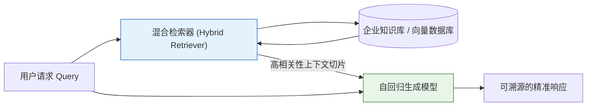
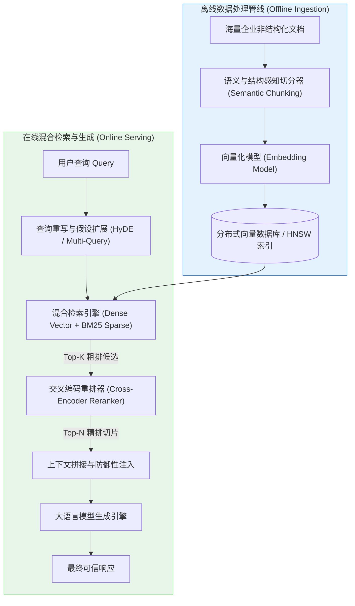
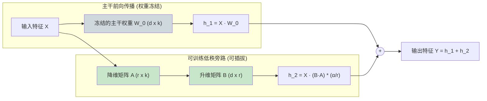
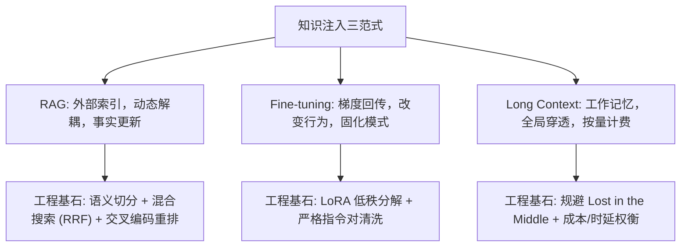

[← 上一章](09-prompting.md) | [目录](../README.md) | [下一章 →](11-agents.md)

**English**: [English](../en/chapters/10-knowledge.md)

# 第十章：知识注入的三条路径

> "An LLM without external knowledge is like a brilliant person with amnesia: great at thinking, terrible at remembering."

大语言模型的预训练语料存在明确的时间截断点，其参数容量存在物理上限，自注意力窗口亦受限于显存与时延带宽。当业务系统要求模型回答超出其静态参数分布的事实时，必须引入**外部知识注入机制**。

**核心论点：检索增强生成（RAG）、模型微调（Fine-tuning）与超长上下文（Long Context）是三种在计算拓扑与先验机制上截然不同的知识注入范式。** 选型的失误往往不是性能调优的问题，而是背离了底层数学原理的系统性偏差。

---

## 10.1 三大知识注入范式的物理图景

### 认知与信息检索的类比

理解三者的差异，可以借助认知心理学与考试场景建立清晰的直觉映射：

| 范式维度 | 考试隐喻 | 知识物理载体 | 更新与维护成本 |
|---|---|---|---|
| **RAG** | **开卷考试**：随时查阅结构化参考手册 | 外部索引数据库（运行时动态检索） | **极低**（实时更新索引即可生效） |
| **Fine-tuning** | **长期备考**：将专业规范内化为直觉反应 | 深度神经网络参数矩阵（梯度反向传播） | **高**（需重新组织样本并消耗 GPU 算力） |
| **Long Context** | **考前临时翻阅**：将全量参考资料置于眼前 | 注意力上下文显存（单次推理工作记忆） | **无额外维护成本**（但单次推理开销昂贵） |

### 范式一：RAG（检索增强生成）



**核心机理**：不试图将海量非结构化事实强行压缩进模型权重，而是在推理时按需实施动态条件注入。

```python
def execute_rag_pipeline(query: str, vector_store, top_k: int = 3) -> str:
    # 1. 在高维空间执行相似度召回
    relevant_chunks = vector_store.similarity_search(query, k=top_k)
    context_str = "\n\n".join([f"[{doc.metadata['id']}] {doc.page_content}" for doc in relevant_chunks])
    
    # 2. 将检索内容作为强条件约束输入
    system_prompt = "请严格仅基于提供的参考资料回答问题。若资料未提及，请明确回复无法确定。"
    user_prompt = f"参考资料：\n{context_str}\n\n问题：{query}\n回答："
    
    return call_llm(system_prompt=system_prompt, user_prompt=user_prompt)
```

- **架构优势**：支持事实的毫秒级动态更新；具备原生可解释性与溯源凭据（Citations）；模型权重视为纯算力引擎，与领域数据解耦。
- **潜在瓶颈**：高度依赖检索召回与重排精度；引入了网络 I/O 与检索时延；检索阶段的漏检直接导致下游生成失效。

### 范式二：Fine-tuning（参数微调）

**核心机理**：通过梯度反向传播，调整部分或全部网络权重，将领域专属的指令风格、输入输出契约或专业推理范式内化于隐层表征。

```python
# 监督微调 (SFT) 数据集结构
sft_sample = {
    "messages": [
        {"role": "system", "content": "你是一名专注于电子病历合规审查的专业临床质控助手。"},
        {"role": "user", "content": "患者主诉'胸痛伴大汗 2 小时'，拟诊急性冠脉综合征，请列出首要必查生化指标。"},
        {"role": "assistant", "content": "首要必查指标包括：1. 肌钙蛋白 I/T (cTnI/cTnT)；2. 肌酸激酶同工酶 (CK-MB)；3. 动态心电图监测与急查 D-二聚体。"}
    ]
}
```

- **架构优势**：深刻重塑模型的行文风格与专业术语表达；推理阶段无需外部检索交互，服务架构精简且吞吐量高。
- **潜在瓶颈**：训练与数据集清洗成本高昂；不适宜频繁变动的动态事实注入；容易发生灾难性遗忘与局部过拟合。

### 范式三：Long Context（超长上下文）

**核心机理**：依托现代长上下文 Transformer 架构，直接将全量长文档（数十万至数百万 Token）完整加载至当前推理的前向注意力计算流中。

- **架构优势**：架构最为精简：无需前置索引构建或模型微调，全部信息显式驻留于工作记忆中。
- **潜在瓶颈**：单次推理成本线性激增；长序列带来显著的首字延迟（TTFT）；注意力在中段面临"Lost in the Middle"稀释效应。

---

## 10.2 工业级 RAG 架构微观拆解



### 语义切分（Chunking）：决定检索精度的隐形瓶颈

文本分块绝非简单的固定字符截断，而是直接决定召回信噪比的核心工程环节：

```python
# 策略一：层次递归切分 (Recursive Splitting)
# 优先级: 段落分隔符 (\n\n) -> 行分隔符 (\n) -> 句号 (。) -> 字符级
from langchain_text_splitters import RecursiveCharacterTextSplitter

recursive_splitter = RecursiveCharacterTextSplitter(
    chunk_size=600,
    chunk_overlap=100,
    separators=["\n\n", "\n", "。", "！", "？", " ", ""]
)

# 策略二：文档结构感知切分 (Markdown / AST Header Splitting)
from langchain_text_splitters import MarkdownHeaderTextSplitter

headers_to_split_on = [
    ("#", "Header_1"),
    ("##", "Header_2"),
    ("###", "Header_3"),
]
markdown_splitter = MarkdownHeaderTextSplitter(headers_to_split_on=headers_to_split_on)
```

**切分尺寸的物理权衡**：
- **切片过细 (< 150 tokens)**：向量表达高纯度，但丧失代词消歧与前置因果上下文；
- **切片过粗 (> 1500 tokens)**：上下文完整，但高维语义向量发生稀释，且在生成时浪费注意力带宽。

### 稠密与稀疏混合检索（Hybrid Search with RRF）

纯语义向量检索擅长概念联想，但在面对精确实体（如产品序列号、错误码 `ERR-9021`、人名）时极易发生注意力漂移；传统 BM25 词频检索则缺乏跨同义词的语义泛化能力。

工业界黄金标准是引入**互惠排名融合算法（Reciprocal Rank Fusion, RRF）**：

```python
def reciprocal_rank_fusion(
    dense_ranked_ids: list[str], 
    sparse_ranked_ids: list[str], 
    k_constant: int = 60
) -> list[tuple[str, float]]:
    """
    RRF 算法: 无需预先对齐分值尺度的无监督集成排序
    Score(d) = sum(1 / (k + rank_i(d)))
    """
    rrf_scores: dict[str, float] = {}
    
    # 累加向量检索排名贡献
    for rank, doc_id in enumerate(dense_ranked_ids):
        rrf_scores[doc_id] = rrf_scores.get(doc_id, 0.0) + 1.0 / (k_constant + rank + 1)
        
    # 累加 BM25 稀疏检索排名贡献
    for rank, doc_id in enumerate(sparse_ranked_ids):
        rrf_scores[doc_id] = rrf_scores.get(doc_id, 0.0) + 1.0 / (k_constant + rank + 1)
        
    # 按综合得分降序排列
    return sorted(rrf_scores.items(), key=lambda item: item[1], reverse=True)
```

### 交叉编码重排（Cross-Encoder Reranking）

向量搜索和 BM25 均属于典型的双塔架构：Query 与 Document 独立执行表征编码，在推理时仅计算高维内积。此类方案检索极快，但缺乏深层交叉注意力交互。

Cross-Encoder 将 Query 与 Document 序列显式拼接，并在全部 Transformer 隐层中进行全量注意力交互：

```python
from sentence_transformers import CrossEncoder

# 加载专门针对重排训练的交叉编码模型
reranker_model = CrossEncoder("BAAI/bge-reranker-v2-m3")

def rerank_candidate_chunks(query: str, candidate_chunks: list[str], top_n: int = 5) -> list[str]:
    # 构造交互对矩阵 [Query, Chunk_i]
    interaction_pairs = [[query, chunk] for chunk in candidate_chunks]
    
    # 执行全层注意力前向计算
    relevance_scores = reranker_model.predict(interaction_pairs)
    
    # 选取最高相关性 Top-N 切片返回给生成模型
    ranked_indices = sorted(range(len(relevance_scores)), key=lambda i: relevance_scores[i], reverse=True)
    return [candidate_chunks[i] for i in ranked_indices[:top_n]]
```

为何不直接采用全量 Cross-Encoder 执行端到端搜索？关键瓶颈在于计算复杂度。面对百万级文档库，端到端 Cross-Encoder 将导致灾难性的推理延迟。因此工程上普遍采用**两阶段召回拓扑：双塔混合粗排（召回 Top 100）+ 交叉编码精排（筛选 Top 5）**。

---

## 10.3 前沿 RAG 优化拓扑

### 假设文档嵌入（HyDE）

Query 与 Document 在语义流形中的几何形态存在本质差异：Query 呈现为短促的疑问句式，而 Document 多为信息密集型的陈述句。

HyDE（[Gao et al., 2022](https://arxiv.org/abs/2212.10496)）通过让 LLM 预先生成一篇虚构但符合语法模式的"假想解答"，利用假想文档的 Embedding 在向量空间中搜索真实文档，从而抹平句式形态的几何鸿沟。


### 父子分块索引（Small-to-Big Retrieval）

- **检索阶段**：使用 150 Token 的微小切片进行稠密向量匹配，保证向量特征的高度聚焦；
- **注入阶段**：命中目标小切片后，自动逆向查找其所属的 1000 Token 父级完整段落，注入模型上下文，兼顾检索精度与宏观语义完整性。

---

## 10.4 参数微调（Fine-tuning）的本质与工程边界

### 核心定律：微调改变行为范式，RAG 注入客观事实

```
✅ 微调的主战场：
1. 规范输出格式（将自然语言严格束缚至特定的复杂 JSON/DSL 语法）；
2. 注入专业行文风格（如法律文书的行文范式、金融合规审查的口吻）；
3. 蒸馏高阶推理模式（将大模型的 CoT 推导能力迁移至轻量端侧模型）。

❌ 微调的误用陷阱：
1. 试图通过微调让模型记忆最新的企业规章（应选用 RAG）；
2. 试图通过微调纠正单个事实错误（极易导致泛化坍塌）；
3. 试图将海量 PDF 文档直接转化为 SFT 语料进行记忆训练。
```

### LoRA（低秩适配）数学机理

在全量参数微调中，高昂的显存开销主要来源于梯度张量与优化器状态。LoRA（[Hu et al., 2021](https://arxiv.org/abs/2106.09685)）基于核心数学假设：**预训练权重在特定下游任务上的内在内在秩（Intrinsic Rank）远低于其全维度物理空间**。

对于原始权重矩阵 $W_0 \in \mathbb{R}^{d \times k}$，将其更新量约束为低秩分解：

$$W = W_0 + \Delta W = W_0 + \frac{\alpha}{r} (B \cdot A)$$

其中 $A \in \mathbb{R}^{r \times k}$ 采用高斯随机初始化，$B \in \mathbb{R}^{d \times r}$ 初始化为零，$r \ll \min(d, k)$ 为微调秩（通常设为 8 或 16）。



- **显存节约**：仅需更新 0.1% 至 1% 的参数，单张消费级 GPU 即可微调数十亿参数模型；
- **服务隔离**：基础底座保持不变，针对不同业务场景仅需在显存中动态切换数兆字节的 LoRA 权重适配器。

---

## 10.5 超长上下文（Long Context）的经济与物理边界

### 真实生产图景

现代模型（如 Gemini 1.5 Pro、Claude 3.5 Sonnet）已支持 200K 至 2M+ Token 的超长上下文窗口。然而在架构选型中，不能将 Long Context 视为无代价的信息倾倒场：

```python
# 生产系统 API 调用成本量化对比 (以 100K Token 上下文为例)
# 方案 A (Long Context): 每次交互全量传入 100K 原始文档
cost_per_call_long_context = (100_000 / 1_000_000) * 3.00  # $0.30 / 请求

# 方案 B (RAG 混合检索): 仅检索召回 Top 3 高相关性切片 (约 1.5K Token)
cost_per_call_rag = (1_500 / 1_000_000) * 3.00           # $0.0045 / 请求

# 成本倍率差距: Long Context 昂贵约 66.7 倍
```

### 适用场景判定矩阵

- **选用 Long Context 的场景**：输入材料处于 50K Token 以内，且任务要求**全局穿透式综合理解**（例如全量法律合同漏洞审查、长篇小说角色关系图谱提取）；
- **坚决选用 RAG 的场景**：知识库总容量达数十兆至数千兆字节，单次查询仅聚焦局部具体事实。

---

## 10.6 架构决策与三位一体融合

```mermaid
flowchart TD
    Start["业务需求: 注入外部领域知识"] --> Q1{"知识是否高频动态变更?"}
    
    Q1 -->|是 (实时/每日更新)| Path_RAG["必须采用 RAG 架构"]
    Q1 -->|否| Q2{"核心诉求是注入事实<br/>还是定制行为与格式?"}
    
    Q2 -->|定制输出格式/特定推理模式| Path_FT["采用 Fine-tuning (LoRA)"]
    Q2 -->|查询静态但高度关联的文档| Q3{"文档总规模是否小于 100K Tokens?"}
    
    Q3 -->|是| Path_LC["采用 Long Context 直接注入"]
    Q3 -->|否| Path_RAG
    
    Path_RAG --> Fusion["生产级黄金组合 (三位一体)"]
    Path_FT --> Fusion
    Path_LC --> Fusion
    
    style Path_RAG fill:#e3f2fd,stroke:#1565c0
    style Path_FT fill:#fff3e0,stroke:#e65100
    style Path_LC fill:#e8f5e9,stroke:#2e7d32
    style Fusion fill:#f3e5f5,stroke:#6a1b9a
```

### 企业级系统的三位一体实践

在成熟的工业级企业智能体中，三大技术路线往往呈现出清晰的垂直分层协作：

1. **底座行为层（Fine-tuning）**：微调小型专用模型，固化企业特定的输出协议、安全审查边界与术语口吻；
2. **知识记忆层（RAG）**：连接分布式向量数据库与搜索引擎，动态提供最新的内部规范与业务事实；
3. **工作记忆层（Long Context）**：在单次会话流中维持多轮历史与工具执行日志的连续完整性。

---

## 本章小结



核心要点：

1. **范式定位各司其职**：RAG 负责事实检索，Fine-tuning 负责行为塑造，Long Context 承载瞬态工作记忆；
2. **切分与重排决定 RAG 成败**：重视结构化切分算法，必须配套 Cross-Encoder 精排以提升信噪比；
3. **混合检索是生产底线**：必须融合稠密语义向量与 BM25 稀疏检索以杜绝实体漂移；
4. **LoRA 实现了参数高效微调**：通过低秩矩阵分解大幅削减微调算力开销；
5. **警惕超长上下文的经济成本**：根据时延容忍度与调用频次在 RAG 与全量上下文之间建立弹性路由。

在下一章中，我们将突破单次问答交互的静态局限，深入自主智能体（Agent）系统的构建：探索大语言模型如何通过感知、规划、工具调用与环境反馈形成动态行动闭环。

---

## 延伸阅读

- [Retrieval-Augmented Generation for Knowledge-Intensive NLP Tasks](https://arxiv.org/abs/2005.11401), Lewis et al., 2020
- [Lost in the Middle: How Language Models Use Long Contexts](https://arxiv.org/abs/2307.03172), Liu et al., 2023
- [Precise Zero-Shot Dense Retrieval without Relevance Labels (HyDE)](https://arxiv.org/abs/2212.10496), Gao et al., 2022
- [LoRA: Low-Rank Adaptation of Large Language Models](https://arxiv.org/abs/2106.09685), Hu et al., 2021
- [QLoRA: Efficient Finetuning of Quantized LLMs](https://arxiv.org/abs/2305.14314), Dettmers et al., 2023
- [MTEB: Massive Text Embedding Benchmark](https://arxiv.org/abs/2210.07316), Muennighoff et al., 2022

[← 上一章](09-prompting.md) | [目录](../README.md) | [下一章 →](11-agents.md)
