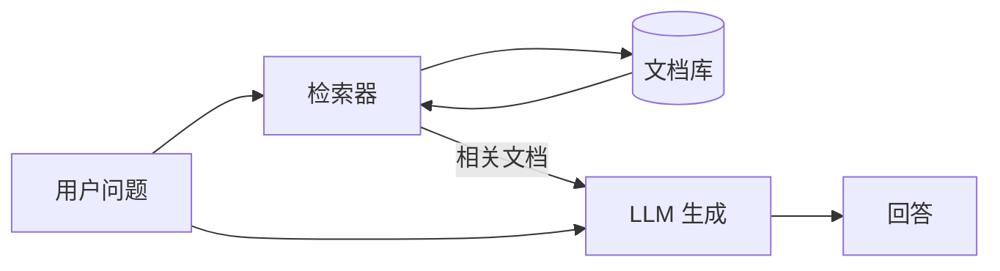
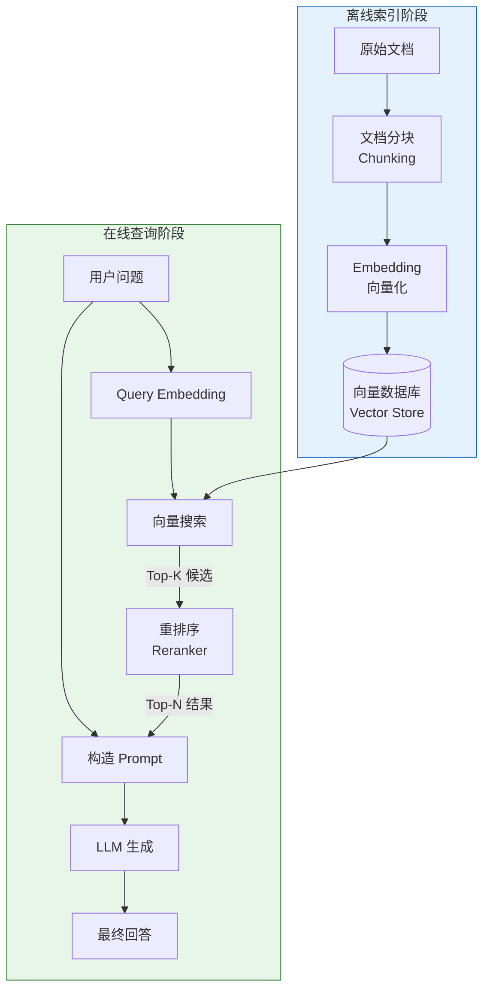
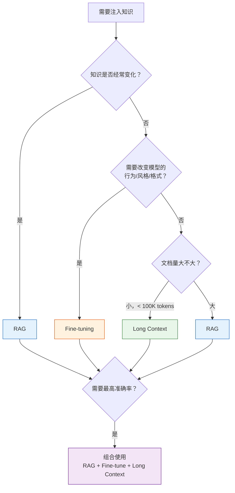
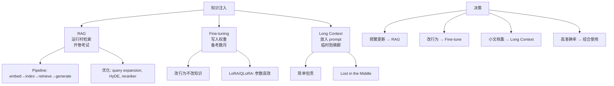

[← 上一章](09-prompting.md) | [目录](../README.md) | [下一章 →](11-agents.md)

**English**: [English](../en/chapters/10-knowledge.md)

# 第十章：知识注入的三条路

> "An LLM without external knowledge is like a brilliant person with amnesia — great at thinking, terrible at remembering."

LLM 的训练数据总有截止日期，内部参数放不下无穷无尽的事实，上下文窗口也受制于长度。当业务需要模型回答它原本不知道的事情时，唯一能走的路就是**注入知识**。

核心论点很明确：RAG、Fine-tuning 与 Long Context 是三种走法完全不同的知识注入路线，各有各的去处。选错了方式，从来不只是效果打点折扣，而是从一开始就走错了方向。

---

## 10.1 三种知识注入方式

### 一个考试类比

要理解这三种方式的区别，最贴切的比方是考试：

| 方式 | 类比 | 知识存在于 | 更新成本 |
|------|------|-----------|---------|
| **RAG** | 开卷考试：带着参考书进考场 | 外部数据库（运行时检索） | 低（更新数据库即可） |
| **Fine-tuning** | 备考数月：知识刻进大脑 | 模型权重（训练时写入） | 高（需要重新训练） |
| **Long Context** | 考前临时抱佛脚：把书全读一遍 | Prompt 上下文（每次调用传入） | 无（直接换文档） |

### RAG（Retrieval-Augmented Generation）



**核心思想**：不把知识硬塞进模型，而是在需要的时候再去查阅。

```python
# RAG 的最简实现
def rag_answer(question: str, documents: list[str]) -> str:
    # 1. 检索相关文档
    relevant_docs = retrieve(question, documents, top_k=3)
    
    # 2. 把检索到的文档和问题一起给 LLM
    prompt = f"""基于以下参考资料回答用户问题。如果资料中没有相关信息，说"我不确定"。

参考资料：
{chr(10).join(relevant_docs)}

问题：{question}
回答："""
    
    return call_llm(prompt)
```

**优点**：知识库可以随时更新，回答能够清楚追溯出处（citations），而且完全不用重新训练模型。
**缺点**：回答质量完全受制于检索模块的表现，每次调用都会拉长响应延迟；一旦检索环节落空，整个回答也就跟着失败了。

### Fine-tuning

**核心思想**：通过额外的专项训练，把知识与行为模式直接写进模型权重。

```python
# Fine-tuning 数据格式（SFT）
training_data = [
    {
        "messages": [
            {"role": "system", "content": "你是一个医疗客服助手，回答关于我们产品的问题。"},
            {"role": "user", "content": "产品 X 的使用剂量是什么？"},
            {"role": "assistant", "content": "产品 X 的推荐剂量是每日两次，每次一片。饭后服用。"}
        ]
    },
    # ... 更多训练样本
]
```

**优点**：能够从根本上重塑模型的言语风格、输出格式与交互习惯，线上推理用不着外挂检索，响应延迟很低。
**缺点**：训练本身的开销很大，知识一旦发生变动就得重新训练，而且很容易出现过拟合。

### Long Context

**核心思想**：不做复杂拆解，把全部需要的参考资料直接塞进 prompt。

```python
# Long context 的朴素实现
def answer_with_full_context(question: str, all_docs: str) -> str:
    prompt = f"""以下是完整的产品文档：

{all_docs}

基于以上文档回答：{question}"""
    
    return call_llm(prompt)  # 可能消耗 100K+ tokens
```

**优点**：工程上最为直截了当：省去了检索管线的搭建，免去了漫长的模型训练，所有需要的材料全在当下的上下文里一览无余。
**缺点**：调用开销贵，每次都要按 token 数量买单；窗口本身有长度上限，模型面对超长文本时还容易出现“中间遗忘”（lost in the middle）的问题。

---

## 10.2 RAG 深入

给大模型注入知识，RAG 是最常用的法子。整条流水线环环相扣，不妨把其中的每一个环节都拆解开来看。

### 完整 RAG Pipeline



### Embedding：把文本变成向量

Embedding 模型的任务，是把一段文本映射到高维向量空间里。只要文本的语义相近，它们在空间里对应的位置就会挨得很近。

```python
from openai import OpenAI
client = OpenAI()

def get_embedding(text: str) -> list[float]:
    response = client.embeddings.create(
        model="text-embedding-3-small",
        input=text
    )
    return response.data[0].embedding

# 语义相似的文本 → 向量距离近
v1 = get_embedding("Python 是一种编程语言")
v2 = get_embedding("Python 是一门程序设计语言")
v3 = get_embedding("今天天气很好")

import numpy as np
def cosine_sim(a, b):
    return np.dot(a, b) / (np.linalg.norm(a) * np.linalg.norm(b))

print(cosine_sim(v1, v2))  # ~0.95（非常相似）
print(cosine_sim(v1, v3))  # ~0.30（不相关）
```

一个好的 embedding 模型，通常要在几件事上立得住：
- **区分度**：意思相近的文本要挨得足够近，不相干的文本要推得足够远。
- **鲁棒性**：哪怕替换了同义词或者调换了语序，算出来的向量也不该产生过大偏差。
- **跨语言能力**：如果手头的数据包含多种语言，模型就得能把不同语种里的同一种意思拉到一块。

### Chunking：最被低估的工程决策

所谓 Chunking，就是把长文档切成一个个小块。这道切分的步骤看似简单，往往却决定了整个 RAG 系统的上限。

```python
# 策略 1: 固定大小切分（简单但粗暴）
def fixed_size_chunks(text: str, chunk_size: int = 500, overlap: int = 50) -> list[str]:
    chunks = []
    start = 0
    while start < len(text):
        end = start + chunk_size
        chunks.append(text[start:end])
        start = end - overlap  # 重叠区域保持上下文连续
    return chunks

# 策略 2: 语义切分（按段落、标题等自然边界）
def semantic_chunks(text: str) -> list[str]:
    # 按标题分割
    sections = re.split(r'\n#{1,3}\s', text)
    
    chunks = []
    for section in sections:
        if len(section) > MAX_CHUNK_SIZE:
            # 长段落再按句子切分
            sentences = re.split(r'[。！？\n]', section)
            current_chunk = ""
            for sent in sentences:
                if len(current_chunk) + len(sent) > MAX_CHUNK_SIZE:
                    chunks.append(current_chunk)
                    current_chunk = sent
                else:
                    current_chunk += sent
            if current_chunk:
                chunks.append(current_chunk)
        else:
            chunks.append(section)
    return chunks

# 策略 3: Recursive splitting（LangChain 默认）
# 先按 \n\n 分，太长再按 \n 分，还太长按 . 分，最后按字符分
```

**Chunk 大小的权衡**：

| Chunk 太小 | Chunk 太大 |
|-----------|-----------|
| 丢失上下文（“他”指代谁） | 关键信息被稀释（一大段里只有一句有用） |
| 检索精度高，但召回的信息不完整 | 检索命中了，LLM 却要在长文本中费力翻找答案 |
| 适合精确事实查询 | 适合需要完整论述的问题 |

**实践建议**：不妨先从 500 到 1000 token 的 chunk 起步，带上 10% 到 20% 的 overlap，后续再对照评估结果逐步调整。

### 向量搜索：HNSW vs IVF

向量检索要解决的核心难题，是如何在百万级的向量海里，飞快挑出最相似的 top-K 个。如果逐一做暴力比对的精确搜索，时间复杂度高达 O(n)，在线上服务中根本无法承受。退而求其次，近似最近邻（ANN）算法成了标准出路。

**HNSW（Hierarchical Navigable Small World）**：
- 构建多层图结构，上层图充当下层图的“快捷通道”。
- 搜索时自顶层切入，逐层向下收窄范围。
- 优点：搜索速度快至毫秒级，召回率高。
- 缺点：内存开销大，全部向量与图结构都要常驻内存。
- 适合：百万级以下的数据集。

**IVF+PQ（Inverted File Index + Product Quantization）**：
- IVF：先将向量空间做聚类切分，搜索时只在邻近的聚类簇里查找。
- PQ：把高维向量压缩成短编码，大幅减轻存储与计算开销。
- 优点：内存利用率高，可以应对亿级规模的数据。
- 缺点：召回率略低于 HNSW。
- 适合：大规模数据集。

```python
# 使用 FAISS 构建向量索引
import faiss
import numpy as np

dimension = 1536  # text-embedding-3-small 的维度
n_vectors = 100000

# HNSW 索引
index_hnsw = faiss.IndexHNSWFlat(dimension, 32)  # 32 = 每个节点的邻居数
index_hnsw.add(vectors)

# IVF+PQ 索引（适合更大规模）
nlist = 100  # 聚类数
m = 48       # PQ 子向量数
quantizer = faiss.IndexFlatL2(dimension)
index_ivfpq = faiss.IndexIVFPQ(quantizer, dimension, nlist, m, 8)
index_ivfpq.train(vectors)
index_ivfpq.add(vectors)

# 搜索
query_vector = get_embedding("如何部署 RAG 系统？")
distances, indices = index_hnsw.search(
    np.array([query_vector]).astype('float32'), k=10
)
```

### 混合搜索：向量 + 关键词

纯向量搜索有自己的软肋：遇到产品名、错误码、人名这类需要**精确匹配**的内容，它往往力不从心。经典的 BM25 关键词搜索同样有死穴：它读不懂语义。“如何减肥”与“减重方法”分明是一回事，在它眼里却是两串互不相干的词。

应对的法子很直接：把两路搜索结合起来。

```python
# 混合搜索的伪代码
def hybrid_search(query: str, top_k: int = 10) -> list[Document]:
    # 向量搜索：语义匹配
    vector_results = vector_store.search(
        embedding=get_embedding(query), 
        top_k=top_k * 2
    )
    
    # BM25 搜索：关键词匹配
    bm25_results = bm25_index.search(
        query=query, 
        top_k=top_k * 2
    )
    
    # Reciprocal Rank Fusion (RRF) 合并排名
    scores = {}
    k = 60  # RRF 常数
    for rank, doc in enumerate(vector_results):
        scores[doc.id] = scores.get(doc.id, 0) + 1 / (k + rank + 1)
    for rank, doc in enumerate(bm25_results):
        scores[doc.id] = scores.get(doc.id, 0) + 1 / (k + rank + 1)
    
    # 按合并分数排序
    ranked = sorted(scores.items(), key=lambda x: x[1], reverse=True)
    return [get_doc(doc_id) for doc_id, _ in ranked[:top_k]]
```

### Reranker：精排

向量搜索与 BM25 本质上都属于“双塔模型”。它们把 query 和 document 各自独立编码，完成之后再去比对两者的向量。这条路子确实飞快，只是挑出来的结果难免有些粗糙。

Cross-encoder reranker 换了另一种思路。它把 query 与 document 拼接在一起输入，让模型看清两者之间的每一处**交互**，算出来的匹配得分自然精确得多。

```python
# 使用 cross-encoder 重排序
from sentence_transformers import CrossEncoder

reranker = CrossEncoder('BAAI/bge-reranker-v2-m3')

def rerank(query: str, documents: list[str], top_n: int = 5) -> list[str]:
    # 构造 [query, doc] 对
    pairs = [[query, doc] for doc in documents]
    
    # Cross-encoder 打分
    scores = reranker.predict(pairs)
    
    # 按分数排序
    ranked = sorted(zip(documents, scores), key=lambda x: x[1], reverse=True)
    return [doc for doc, _ in ranked[:top_n]]
```

至于为什么不直接拿 cross-encoder 来做全量搜索，原因全在一个慢字。Cross-encoder 需要把 query 和每一篇文档拼接起来跑一遍模型，遇到 100 万篇文档，就得实打实跑上 100 万次。所以在实际工程中总是分两步走：先用向量或 BM25 这类快速方法粗选出 top-100，再交给 cross-encoder 精排挑出 top-10。

---

## 10.3 RAG 优化

把一套基础的 RAG pipeline 搭建起来只是开了个头。真要让它在实际场景中运转得当，往后多得是值得细细打磨的优化手段。

### Query Expansion：改善检索入口

用户的查询往往不够精确。提问者随手写下的字句，要么漏掉了关键信息，要么很难恰好对上文档里的具体表述。

```python
def expand_query(original_query: str) -> list[str]:
    """让 LLM 生成多个搜索查询"""
    prompt = f"""用户问了以下问题：
{original_query}

请生成 3 个不同的搜索查询来帮助找到相关信息。
每个查询应该从不同角度表述同一个信息需求。
只输出查询，每行一个。"""
    
    expanded = call_llm(prompt)
    queries = [original_query] + expanded.strip().split('\n')
    return queries

# 例如：
# 原始查询："Python 怎么处理大文件？"
# 扩展后：
# - "Python 怎么处理大文件？"
# - "Python 读取大文件内存优化方法"
# - "Python streaming file processing"
# - "Python 处理 GB 级别文件的最佳实践"
```

### HyDE：假设文档嵌入

这里有个巧妙的办法：先不急着用 query 直接搜索，而是让 LLM 预先写出一份“假设的回答”，再用这份回答的 embedding 去做检索。

```python
def hyde_search(query: str, vector_store) -> list[str]:
    """Hypothetical Document Embeddings"""
    # Step 1: 让 LLM 生成假设性的回答
    hypothetical_answer = call_llm(
        f"请回答以下问题（即使你不完全确定）：\n{query}"
    )
    
    # Step 2: 用假设性回答的 embedding 去搜索
    # 理由：假设性回答在语义空间中更接近真实文档
    # （而 query 通常是短问句，和文档的表述差异大）
    embedding = get_embedding(hypothetical_answer)
    results = vector_store.search(embedding, top_k=10)
    
    return results
```

这套做法之所以管用，在于 query 与 document 在语义空间里的“形态”原本就不同：query 是问句，document 是陈述。HyDE 把 query 转化成了陈述形式，恰好缩小了两者之间的这种“形态差异”。

参考论文：[Precise Zero-Shot Dense Retrieval without Relevance Labels](https://arxiv.org/abs/2212.10496) (Gao et al. 2022)

### Small-to-Big：检索小块，返回大块

```python
# 问题：小 chunk 检索精准，但上下文不够
# 解决：检索时用小 chunk，返回时用大 chunk

class SmallToBigRetriever:
    def __init__(self):
        self.small_chunks = {}  # chunk_id -> small text (用于检索)
        self.parent_chunks = {} # chunk_id -> parent_chunk_id (映射关系)
        self.big_chunks = {}    # parent_chunk_id -> big text (用于返回)
    
    def index(self, document: str):
        # 先切大块（如 2000 token）
        big_chunks = split_into_chunks(document, size=2000)
        for big_id, big_text in enumerate(big_chunks):
            self.big_chunks[big_id] = big_text
            
            # 每个大块再切小块（如 200 token）
            small_chunks = split_into_chunks(big_text, size=200)
            for small_text in small_chunks:
                small_id = len(self.small_chunks)
                self.small_chunks[small_id] = small_text
                self.parent_chunks[small_id] = big_id
                
                # 只索引小块的 embedding
                self.vector_store.add(get_embedding(small_text), small_id)
    
    def search(self, query: str, top_k: int = 3) -> list[str]:
        # 用小块检索
        small_ids = self.vector_store.search(get_embedding(query), top_k=top_k)
        
        # 返回对应的大块（去重）
        parent_ids = list(set(self.parent_chunks[sid] for sid in small_ids))
        return [self.big_chunks[pid] for pid in parent_ids]
```

### Agentic RAG：让模型决定是否检索

传统的 RAG 不论遇到什么输入，都会照例去库里检索一遍。可实际面对的问题大不相同：像“1+1=？”这类算式完全不需要检索，而换作“比较 A 公司和 B 公司的财务状况”，又往往需要多次检索才能给出答案。

```python
def agentic_rag(question: str) -> str:
    """模型自己决定是否需要检索"""
    tools = [{
        "type": "function",
        "function": {
            "name": "search_knowledge_base",
            "description": "在知识库中搜索相关信息。当你需要查找具体事实、数据或文档内容时使用。",
            "parameters": {
                "type": "object",
                "properties": {
                    "query": {"type": "string", "description": "搜索查询"}
                },
                "required": ["query"]
            }
        }
    }]
    
    messages = [
        {"role": "system", "content": "你是一个助手。如果需要查找信息，使用 search_knowledge_base 工具。如果你已经知道答案，直接回答。"},
        {"role": "user", "content": question}
    ]
    
    # 循环：模型可能多次调用工具
    while True:
        response = client.chat.completions.create(
            model="gpt-4o", messages=messages, tools=tools
        )
        
        if response.choices[0].finish_reason == "stop":
            return response.choices[0].message.content
        
        # 执行工具调用
        for tool_call in response.choices[0].message.tool_calls:
            query = json.loads(tool_call.function.arguments)["query"]
            results = search_knowledge_base(query)
            messages.append(response.choices[0].message)
            messages.append({
                "role": "tool",
                "tool_call_id": tool_call.id,
                "content": json.dumps(results, ensure_ascii=False)
            })
```

---

## 10.4 Fine-tuning 深入

### 什么时候应该 Fine-tune

动手做微调之前，得先认清一件事：Fine-tuning 的用处在于改变模型的行为方式，而不是给它灌入事实。

```
✅ 适合 fine-tuning 的场景：
- 改变输出风格（正式 → 口语，英文 → 中文医学术语）
- 改变输出格式（自由文本 → 特定 JSON schema）
- 学习特定领域的推理模式（法律推理、医学诊断流程）
- 减少拒绝（让模型处理被默认拒绝的合法任务）

❌ 不适合 fine-tuning 的场景：
- 注入最新事实（用 RAG）
- 记住特定文档内容（用 RAG 或 long context）
- 给模型新的"能力"（fine-tune 只能调整已有能力的表达）
```

### SFT（Supervised Fine-tuning）

这是最直截了当的微调方式：备好一批成对的指令与回答（instruction-response 对），让模型照着样例一步步去学。

```python
# 使用 OpenAI fine-tuning API
from openai import OpenAI
client = OpenAI()

# 1. 准备训练数据（JSONL 格式）
# training_data.jsonl:
# {"messages": [{"role": "system", "content": "..."}, {"role": "user", "content": "..."}, {"role": "assistant", "content": "..."}]}
# {"messages": [...]}
# ...

# 2. 上传训练文件
file = client.files.create(
    file=open("training_data.jsonl", "rb"),
    purpose="fine-tune"
)

# 3. 创建 fine-tuning job
job = client.fine_tuning.jobs.create(
    training_file=file.id,
    model="gpt-4o-mini-2024-07-18",
    hyperparameters={"n_epochs": 3}
)

# 4. 使用 fine-tuned 模型
response = client.chat.completions.create(
    model=job.fine_tuned_model,  # ft:gpt-4o-mini:my-org:...
    messages=[...]
)
```

### LoRA / QLoRA：参数高效微调

Full fine-tuning 会把模型的全部参数通通改上一遍，算力与显存成本都高得吓人。LoRA（Low-Rank Adaptation）换了个思路，只动其中极小的一部分。

**核心思想**：不去直接改动原有的权重矩阵 W，而是在旁边加上一个低秩分解项 ΔW = BA，其中的 B 和 A 维度远比 W 小得多。

```python
# 使用 HuggingFace PEFT + TRL 做 LoRA fine-tuning
from transformers import AutoModelForCausalLM, AutoTokenizer
from peft import LoraConfig, get_peft_model
from trl import SFTTrainer, SFTConfig

# 加载基础模型
model = AutoModelForCausalLM.from_pretrained(
    "meta-llama/Llama-3.1-8B-Instruct",
    torch_dtype="auto",
    device_map="auto"
)
tokenizer = AutoTokenizer.from_pretrained("meta-llama/Llama-3.1-8B-Instruct")

# 配置 LoRA
lora_config = LoraConfig(
    r=16,                    # 秩（越高越有表达力，但也越大）
    lora_alpha=32,           # 缩放因子
    target_modules=["q_proj", "v_proj", "k_proj", "o_proj"],  # 哪些层加 LoRA
    lora_dropout=0.05,
    task_type="CAUSAL_LM"
)

model = get_peft_model(model, lora_config)
print(f"可训练参数: {model.print_trainable_parameters()}")
# 典型输出: trainable params: 13M || all params: 8B || trainable%: 0.16%

# 训练
training_config = SFTConfig(
    output_dir="./lora-output",
    num_train_epochs=3,
    per_device_train_batch_size=4,
    learning_rate=2e-4,
    logging_steps=10,
)

trainer = SFTTrainer(
    model=model,
    args=training_config,
    train_dataset=dataset,
    tokenizer=tokenizer,
)

trainer.train()
```

**QLoRA** 走得还要更远一些：基础模型先用 4-bit 量化加载进显存，训练时只去更新那几处 LoRA 参数。单凭一块 24GB 的消费级 GPU，就能把 70B 的大模型 fine-tune 起来。

### Fine-tuning 的常见错误

1. **数据太少**：样本少于 100 条很难见出成效，手头通常至少要备上 500 到 1000 条高质量数据。
2. **数据质量差**：100 条高质量数据胜过 10000 条粗糙数据。写进训练集的每一条，都应当是“你希望模型输出的理想回答”。
3. **过拟合**：训练 loss 压得很低，实际输出却越来越糟；模型只是死记硬背了训练数据，把泛化能力丢了个干净。
4. **任务定义错误**：抱着“教事实”的心态硬做 fine-tuning，可这原本该交给 RAG。
5. **评估指标错误**：眼睛只盯着 loss 的数字，从不去看模型实际生成的回答质量。

---

## 10.5 Long Context

### 现代模型的上下文长度

| 模型 | 上下文长度 |
|------|-----------|
| GPT-4o | 128K tokens |
| Claude Opus/Sonnet | 200K tokens |
| Gemini 1.5 Pro | 2M tokens |
| Llama 3.1 | 128K tokens |

128K tokens 摊开来看，差不多能装下一本 300 页的书；若是撑到 2M tokens，吞吐的便足足抵得上 10 本书的体量。

### Long Context 的诱惑和陷阱

**诱惑**：直接把所有文档塞进 prompt 里，省去了搭 RAG pipeline 的工夫，不用切 chunk，也不必张罗向量数据库，省事得让人很难不动心。

**陷阱 1：Lost in the Middle**

[Liu et al. 2023](https://arxiv.org/abs/2307.03172) 的研究发现，只要所需的信息落在长上下文的**中间位置**，模型的性能就会大幅跌落。比起腰部的内容，模型显然更擅长抓住开头与结尾的信息。

```
信息位置:     [开头] ← 性能好
              [中间] ← 性能差  ← "Lost in the Middle"
              [结尾] ← 性能好
```

**陷阱 2：成本**

```python
# 成本对比
# 假设用 GPT-4o: $2.50/1M input tokens

# RAG 方式：只传 3 个相关 chunk（约 1500 tokens）
rag_cost_per_query = 1500 / 1_000_000 * 2.50  # $0.00375

# Long context 方式：传整本文档（100K tokens）
long_context_cost_per_query = 100_000 / 1_000_000 * 2.50  # $0.25

# Long context 贵了 67 倍
```

**陷阱 3：延迟**

处理 100K tokens 带来的延迟，远比处理 1K tokens 沉重得多。一旦放到需要实时交互的场景里，用户便能立刻体会到这种等待的差距。

### 什么时候 Long Context 是正确选择

即便有这些短板，放在某些特定场景下，Long Context 依然是最好的选择：

- **文档数量少，每次查询都需要全局理解**（比如分析一份合同里的所有条款）。
- **快速原型**：先用 long context 验证想法通不通，再决定要不要花本钱去搭 RAG pipeline。
- **上下文之间有强依赖**：内容前后紧密交织，若是硬用 RAG 切成 chunk，反倒会割裂这些依赖关系。

---

## 10.6 决策框架



### 组合使用的实际案例

真正落地的工程系统，往往会把**三者结合**起来用：

```
客户服务系统:
- Fine-tuning: 让模型使用公司的语气和术语（行为层）
- RAG: 检索最新的产品文档和 FAQ（知识层）
- Long Context: 把当前对话的完整历史放入 prompt（会话层）
```

```
代码助手:
- Fine-tuning: 让模型熟悉公司的代码规范（行为层）
- RAG: 检索相关的代码文件和文档（知识层）
- Long Context: 把当前文件和相关文件放入 prompt（上下文层）
```

### 一个简单的决策清单

在敲定方案之前，先在心里把这几个问题答清楚：

1. **知识更新频率？** 每天都在变，选 RAG；按月更新，哪种都行；几乎常年不变，选 Fine-tune 或 Long Context。
2. **需要引用来源吗？** 只要答案必须给出明确出处，就选 RAG（它天然支持 citation）。
3. **需要改变模型行为吗？** 要规范模型的输出风格与格式，选 Fine-tune。
4. **文档总量多大？** 小于 100K tokens 可以直接用 Long Context；超过 100K tokens，选 RAG。
5. **延迟要求？** 对响应时间卡得很严，选 Fine-tune（省去了额外的检索步骤）；要求宽松，选 RAG。
6. **预算？** 每次查询把整份文档全带上太贵，选 RAG。

---

## 10.7 Embedding 的直觉

### 语义相似 = 向量距离近

Embedding 把文本投射到一个高维空间里。在这个空间中，意思相近的文本彼此靠拢，毫无关联的内容则各自离得很远。

```
高维空间中的示意（降到 2D 展示）:

        "Python 编程"  •
                         • "Python 教程"
     "Java 编程" •
                    • "编程入门"

                                    • "今天天气"
                                  • "明天温度"
```

### Contrastive Learning：推近拉远

训练 Embedding 模型最常用的手法是**对比学习**：

```
训练信号:
- (query, positive_doc) → 推近（减小距离）
- (query, negative_doc) → 拉远（增大距离）

例如:
- ("如何学 Python", "Python 入门教程") → 推近
- ("如何学 Python", "今日股市行情")    → 拉远
```

落到数学形式上，最常用的损失函数是 InfoNCE：

$$\mathcal{L} = -\log \frac{\exp(\text{sim}(q, d^+) / \tau)}{\sum_{i} \exp(\text{sim}(q, d_i) / \tau)}$$

式中的 $\tau$ 是温度参数，$d^+$ 代表正样本，$d_i$ 则包含了正样本与所有的负样本。

### 为什么 Cosine Similarity 有效

Cosine similarity 衡量的是两个向量在方向上是否一致，而把各自的长度撇在一旁：

$$\cos(\theta) = \frac{\mathbf{a} \cdot \mathbf{b}}{|\mathbf{a}| \cdot |\mathbf{b}|}$$

方向之所以压过长度，是因为 Embedding 本质上编码的是**语义方向**。只要说的是同一件事，长篇大论与三两句短语在空间里指引的方向就该一致，哪怕两者的向量模长截然不同。

### 选择 Embedding 模型

挑选模型时，[MTEB Leaderboard](https://huggingface.co/spaces/mteb/leaderboard) 是最常用的参考基准，但榜单排名不能照单全收，实际选型时有几件事必须看清：

1. **领域匹配**：在通用榜单上拔得头筹的模型，换到具体业务里未必顺手。医疗、法律、代码这类垂直行业，往往需要专门针对该领域微调过的模型。
2. **维度和速度**：向量维数越高，表达能力越丰富，存储和检索的成本也越高。768 维通常是个不错的平衡点。
3. **多语言**：如果处理的是中文数据，务必确认选用的模型在中文语境下表现过硬，比如 BAAI/bge 系列与 Cohere multilingual。
4. **是否需要训练自己的？** 开箱即用的现成（off-the-shelf）模型足以应付绝大多数场景。只有当业务里充斥着极其冷僻的专有术语（例如半导体制造）时，才值得考虑训练专用的 embedding 模型。

---

## 本章小结



核心要点：

1. **三种方式本质不同**：RAG 走的是运行时检索，Fine-tuning 靠的是重塑权重，Long Context 则是往上下文里硬填。
2. **RAG 是最通用的选择**：知识随时能更新，答案处处可溯源，调用成本也始终落在可控区间内。
3. **Fine-tuning 改变行为，不注入事实**：微调管的是说话风格与行为模式，拿它去死记具体事实，是工程上最普遍的误用。
4. **Long Context 简单但有代价**：省去了搭建检索管道的麻烦，却要扛下高昂的 token 账单、长文本中间的记忆盲区（Lost in the Middle）与居高不下的响应延迟。
5. **Chunking 是 RAG 的隐形杀手**：切分粒度直接决定了检索质量的上限，花在分块策略上的打磨工夫永远不算多。
6. **混合搜索 > 纯向量搜索**：BM25 负责精准命中，向量负责语义泛化，最后用 Reranker 压阵精排，这套组合是眼下的最佳实践。
7. **现实系统往往三者结合**：生产环境下的架构从来不是非此即彼的单选题，把三者按需拼装起来才是常态。

---

## 延伸阅读

- [Retrieval-Augmented Generation for Knowledge-Intensive NLP Tasks](https://arxiv.org/abs/2005.11401)：Lewis et al. 2020，RAG 原始论文
- [Lost in the Middle](https://arxiv.org/abs/2307.03172)：Liu et al. 2023
- [Precise Zero-Shot Dense Retrieval without Relevance Labels (HyDE)](https://arxiv.org/abs/2212.10496)：Gao et al. 2022
- [LoRA: Low-Rank Adaptation of Large Language Models](https://arxiv.org/abs/2106.09685)：Hu et al. 2021
- [QLoRA: Efficient Finetuning of Quantized LLMs](https://arxiv.org/abs/2305.14314)：Dettmers et al. 2023
- [MTEB: Massive Text Embedding Benchmark](https://arxiv.org/abs/2210.07316)：Muennighoff et al. 2022
- [FAISS](https://github.com/facebookresearch/faiss)：Facebook 的向量搜索库
- [LangChain RAG Tutorial](https://python.langchain.com/docs/tutorials/rag/)
- [HuggingFace TRL](https://github.com/huggingface/trl)：训练语言模型的工具库
