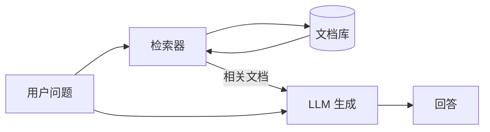
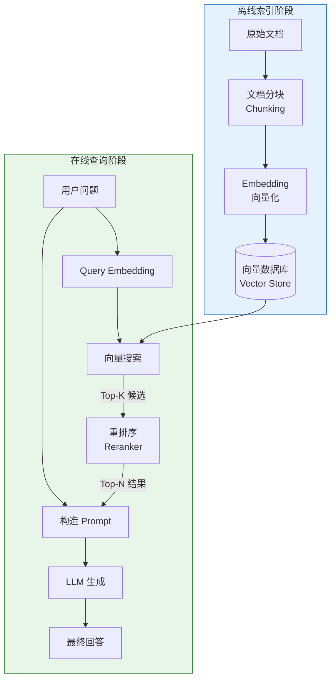
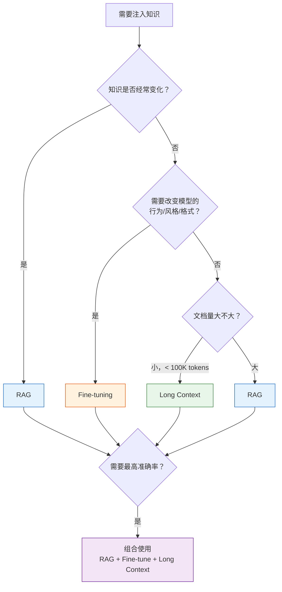
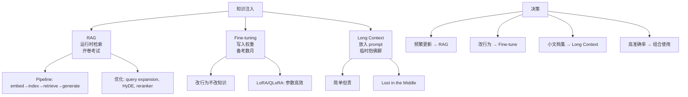

[← 上一章](09-prompting.md) | [目录](../README.md) | [下一章 →](11-agents.md)

# 第十章：知识注入的三条路

> "An LLM without external knowledge is like a brilliant person with amnesia — great at thinking, terrible at remembering."

LLM 的训练数据有截止日期，它的参数空间有容量上限，它的上下文窗口有长度限制。当你的应用需要模型回答"它不知道的事情"时——你需要**注入知识**。

**核心论点：RAG、Fine-tuning 和 Long Context 是三种本质不同的知识注入方式，各有适用场景。选错了方式，不是效果差的问题，是方向错的问题。**

---

## 10.1 三种知识注入方式

### 一个考试类比

理解三种方式最好的类比是考试：

| 方式 | 类比 | 知识存在于 | 更新成本 |
|------|------|-----------|---------|
| **RAG** | 开卷考试：带着参考书进考场 | 外部数据库（运行时检索） | 低（更新数据库即可） |
| **Fine-tuning** | 备考数月：知识刻进大脑 | 模型权重（训练时写入） | 高（需要重新训练） |
| **Long Context** | 考前临时抱佛脚：把书全读一遍 | Prompt 上下文（每次调用传入） | 无（直接换文档） |

### RAG（Retrieval-Augmented Generation）



**核心思想**：不把知识塞进模型，而是在需要时去查。

```python
# RAG 的最简实现
def rag_answer(question: str, documents: list[str]) -> str:
    # 1. 检索相关文档
    relevant_docs = retrieve(question, documents, top_k=3)
    
    # 2. 把检索到的文档和问题一起给 LLM
    prompt = f"""基于以下参考资料回答用户问题。如果资料中没有相关信息，说"我不确定"。

参考资料：
{chr(10).join(relevant_docs)}

问题：{question}
回答："""
    
    return call_llm(prompt)
```

**优点**：知识可以实时更新；可以追溯来源（citations）；不需要重新训练模型。
**缺点**：依赖检索质量；增加延迟；检索失败 = 回答失败。

### Fine-tuning

**核心思想**：通过额外训练，把知识/行为模式写入模型权重。

```python
# Fine-tuning 数据格式（SFT）
training_data = [
    {
        "messages": [
            {"role": "system", "content": "你是一个医疗客服助手，回答关于我们产品的问题。"},
            {"role": "user", "content": "产品 X 的使用剂量是什么？"},
            {"role": "assistant", "content": "产品 X 的推荐剂量是每日两次，每次一片。饭后服用。"}
        ]
    },
    # ... 更多训练样本
]
```

**优点**：改变模型的行为/风格/格式；推理时不需要额外检索；延迟低。
**缺点**：训练成本高；知识更新需要重新训练；容易过拟合。

### Long Context

**核心思想**：把所有相关信息直接塞进 prompt。

```python
# Long context 的朴素实现
def answer_with_full_context(question: str, all_docs: str) -> str:
    prompt = f"""以下是完整的产品文档：

{all_docs}

基于以上文档回答：{question}"""
    
    return call_llm(prompt)  # 可能消耗 100K+ tokens
```

**优点**：最简单——不需要检索管线，不需要训练；所有信息都在上下文中。
**缺点**：贵（按 token 计费）；有长度限制；存在"中间遗忘"（lost in the middle）问题。

---

## 10.2 RAG 深入

RAG 是最常用的知识注入方式。让我们拆解它的每一个环节。

### 完整 RAG Pipeline



### Embedding：把文本变成向量

Embedding 模型把一段文本映射到一个高维向量空间中，语义相近的文本在向量空间中距离相近。

```python
from openai import OpenAI
client = OpenAI()

def get_embedding(text: str) -> list[float]:
    response = client.embeddings.create(
        model="text-embedding-3-small",
        input=text
    )
    return response.data[0].embedding

# 语义相似的文本 → 向量距离近
v1 = get_embedding("Python 是一种编程语言")
v2 = get_embedding("Python 是一门程序设计语言")
v3 = get_embedding("今天天气很好")

import numpy as np
def cosine_sim(a, b):
    return np.dot(a, b) / (np.linalg.norm(a) * np.linalg.norm(b))

print(cosine_sim(v1, v2))  # ~0.95（非常相似）
print(cosine_sim(v1, v3))  # ~0.30（不相关）
```

好的 embedding 模型需要：
- **区分度**：相似文本近，不相似文本远
- **鲁棒性**：同义换词、语序变化不应显著改变向量
- **跨语言能力**：如果你的数据是多语言的

### Chunking：最被低估的工程决策

Chunking 是把长文档切成小块的过程。这个看似简单的步骤，往往决定了 RAG 系统的上限。

```python
# 策略 1: 固定大小切分（简单但粗暴）
def fixed_size_chunks(text: str, chunk_size: int = 500, overlap: int = 50) -> list[str]:
    chunks = []
    start = 0
    while start < len(text):
        end = start + chunk_size
        chunks.append(text[start:end])
        start = end - overlap  # 重叠区域保持上下文连续
    return chunks

# 策略 2: 语义切分（按段落、标题等自然边界）
def semantic_chunks(text: str) -> list[str]:
    # 按标题分割
    sections = re.split(r'\n#{1,3}\s', text)
    
    chunks = []
    for section in sections:
        if len(section) > MAX_CHUNK_SIZE:
            # 长段落再按句子切分
            sentences = re.split(r'[。！？\n]', section)
            current_chunk = ""
            for sent in sentences:
                if len(current_chunk) + len(sent) > MAX_CHUNK_SIZE:
                    chunks.append(current_chunk)
                    current_chunk = sent
                else:
                    current_chunk += sent
            if current_chunk:
                chunks.append(current_chunk)
        else:
            chunks.append(section)
    return chunks

# 策略 3: Recursive splitting（LangChain 默认）
# 先按 \n\n 分，太长再按 \n 分，还太长按 . 分，最后按字符分
```

**Chunk 大小的权衡**：

| Chunk 太小 | Chunk 太大 |
|-----------|-----------|
| 丢失上下文（"他"指代谁？） | 稀释相关性（一大段里只有一句有用） |
| 检索精度高但召回信息不完整 | 检索到了但 LLM 要在长文本中找答案 |
| 适合精确事实查询 | 适合需要完整论述的问题 |

**实践建议**：先从 500-1000 token 的 chunk 开始，带 10-20% 的 overlap，然后根据评估结果调整。

### 向量搜索：HNSW vs IVF

向量检索的核心问题：在百万级向量中快速找到最相似的 top-K。精确搜索（暴力比对）的时间复杂度是 O(n)，不可接受。所以我们用近似最近邻（ANN）算法。

**HNSW（Hierarchical Navigable Small World）**：
- 构建多层图结构，每层是上一层的"快捷通道"
- 搜索时从顶层开始，逐层细化
- 优点：搜索快（毫秒级）、召回率高
- 缺点：内存占用大（全部向量 + 图结构都在内存）
- 适合：百万级以下的数据集

**IVF+PQ（Inverted File Index + Product Quantization）**：
- IVF：先把向量空间聚类，搜索时只在相关聚类中查找
- PQ：把高维向量压缩为短码，减少存储和计算
- 优点：内存效率高，可处理亿级数据
- 缺点：召回率略低于 HNSW
- 适合：大规模数据集

```python
# 使用 FAISS 构建向量索引
import faiss
import numpy as np

dimension = 1536  # text-embedding-3-small 的维度
n_vectors = 100000

# HNSW 索引
index_hnsw = faiss.IndexHNSWFlat(dimension, 32)  # 32 = 每个节点的邻居数
index_hnsw.add(vectors)

# IVF+PQ 索引（适合更大规模）
nlist = 100  # 聚类数
m = 48       # PQ 子向量数
quantizer = faiss.IndexFlatL2(dimension)
index_ivfpq = faiss.IndexIVFPQ(quantizer, dimension, nlist, m, 8)
index_ivfpq.train(vectors)
index_ivfpq.add(vectors)

# 搜索
query_vector = get_embedding("如何部署 RAG 系统？")
distances, indices = index_hnsw.search(
    np.array([query_vector]).astype('float32'), k=10
)
```

### 混合搜索：向量 + 关键词

纯向量搜索的短板：对**精确匹配**（产品名、错误码、人名）不擅长。BM25（经典关键词搜索）的短板：不理解语义（"如何减肥"和"减重方法"是不同的关键词）。

解决方案：两者结合。

```python
# 混合搜索的伪代码
def hybrid_search(query: str, top_k: int = 10) -> list[Document]:
    # 向量搜索：语义匹配
    vector_results = vector_store.search(
        embedding=get_embedding(query), 
        top_k=top_k * 2
    )
    
    # BM25 搜索：关键词匹配
    bm25_results = bm25_index.search(
        query=query, 
        top_k=top_k * 2
    )
    
    # Reciprocal Rank Fusion (RRF) 合并排名
    scores = {}
    k = 60  # RRF 常数
    for rank, doc in enumerate(vector_results):
        scores[doc.id] = scores.get(doc.id, 0) + 1 / (k + rank + 1)
    for rank, doc in enumerate(bm25_results):
        scores[doc.id] = scores.get(doc.id, 0) + 1 / (k + rank + 1)
    
    # 按合并分数排序
    ranked = sorted(scores.items(), key=lambda x: x[1], reverse=True)
    return [get_doc(doc_id) for doc_id, _ in ranked[:top_k]]
```

### Reranker：精排

向量搜索和 BM25 都是"双塔模型"——query 和 document 独立编码，然后比较向量。这快，但粗糙。

Cross-encoder reranker 把 query 和 document 拼在一起输入，让模型看到它们的**交互**，给出更精确的相关性分数。

```python
# 使用 cross-encoder 重排序
from sentence_transformers import CrossEncoder

reranker = CrossEncoder('BAAI/bge-reranker-v2-m3')

def rerank(query: str, documents: list[str], top_n: int = 5) -> list[str]:
    # 构造 [query, doc] 对
    pairs = [[query, doc] for doc in documents]
    
    # Cross-encoder 打分
    scores = reranker.predict(pairs)
    
    # 按分数排序
    ranked = sorted(zip(documents, scores), key=lambda x: x[1], reverse=True)
    return [doc for doc, _ in ranked[:top_n]]
```

**为什么不直接用 cross-encoder 搜索？** 因为太慢。Cross-encoder 需要把 query 和每个文档拼在一起过一遍模型。100 万文档就要跑 100 万次。所以实践中总是：先用快速方法（向量/BM25）粗选 top-100，再用 cross-encoder 精排 top-10。

---

## 10.3 RAG 优化

基础 RAG pipeline 搭好之后，有很多优化手段。

### Query Expansion：改善检索入口

用户的查询往往不够精确，或者和文档中的表述不匹配。

```python
def expand_query(original_query: str) -> list[str]:
    """让 LLM 生成多个搜索查询"""
    prompt = f"""用户问了以下问题：
{original_query}

请生成 3 个不同的搜索查询来帮助找到相关信息。
每个查询应该从不同角度表述同一个信息需求。
只输出查询，每行一个。"""
    
    expanded = call_llm(prompt)
    queries = [original_query] + expanded.strip().split('\n')
    return queries

# 例如：
# 原始查询："Python 怎么处理大文件？"
# 扩展后：
# - "Python 怎么处理大文件？"
# - "Python 读取大文件内存优化方法"
# - "Python streaming file processing"
# - "Python 处理 GB 级别文件的最佳实践"
```

### HyDE：假设文档嵌入

一个巧妙的技巧：不直接用 query 去搜索，而是先让 LLM 生成一个"假设的回答"，用这个回答的 embedding 去搜索。

```python
def hyde_search(query: str, vector_store) -> list[str]:
    """Hypothetical Document Embeddings"""
    # Step 1: 让 LLM 生成假设性的回答
    hypothetical_answer = call_llm(
        f"请回答以下问题（即使你不完全确定）：\n{query}"
    )
    
    # Step 2: 用假设性回答的 embedding 去搜索
    # 理由：假设性回答在语义空间中更接近真实文档
    # （而 query 通常是短问句，和文档的表述差异大）
    embedding = get_embedding(hypothetical_answer)
    results = vector_store.search(embedding, top_k=10)
    
    return results
```

**为什么有效？** Query 和 document 在语义空间中的"形态"不同——query 是问句，document 是陈述。HyDE 把 query 转化为陈述形式，缩小了这个"形态差异"。

参考论文：[Precise Zero-Shot Dense Retrieval without Relevance Labels](https://arxiv.org/abs/2212.10496) (Gao et al. 2022)

### Small-to-Big：检索小块，返回大块

```python
# 问题：小 chunk 检索精准，但上下文不够
# 解决：检索时用小 chunk，返回时用大 chunk

class SmallToBigRetriever:
    def __init__(self):
        self.small_chunks = {}  # chunk_id -> small text (用于检索)
        self.parent_chunks = {} # chunk_id -> parent_chunk_id (映射关系)
        self.big_chunks = {}    # parent_chunk_id -> big text (用于返回)
    
    def index(self, document: str):
        # 先切大块（如 2000 token）
        big_chunks = split_into_chunks(document, size=2000)
        for big_id, big_text in enumerate(big_chunks):
            self.big_chunks[big_id] = big_text
            
            # 每个大块再切小块（如 200 token）
            small_chunks = split_into_chunks(big_text, size=200)
            for small_text in small_chunks:
                small_id = len(self.small_chunks)
                self.small_chunks[small_id] = small_text
                self.parent_chunks[small_id] = big_id
                
                # 只索引小块的 embedding
                self.vector_store.add(get_embedding(small_text), small_id)
    
    def search(self, query: str, top_k: int = 3) -> list[str]:
        # 用小块检索
        small_ids = self.vector_store.search(get_embedding(query), top_k=top_k)
        
        # 返回对应的大块（去重）
        parent_ids = list(set(self.parent_chunks[sid] for sid in small_ids))
        return [self.big_chunks[pid] for pid in parent_ids]
```

### Agentic RAG：让模型决定是否检索

传统 RAG 每次都检索。但有些问题不需要检索（"1+1=?"），有些需要多次检索（"比较 A 公司和 B 公司的财务状况"）。

```python
def agentic_rag(question: str) -> str:
    """模型自己决定是否需要检索"""
    tools = [{
        "type": "function",
        "function": {
            "name": "search_knowledge_base",
            "description": "在知识库中搜索相关信息。当你需要查找具体事实、数据或文档内容时使用。",
            "parameters": {
                "type": "object",
                "properties": {
                    "query": {"type": "string", "description": "搜索查询"}
                },
                "required": ["query"]
            }
        }
    }]
    
    messages = [
        {"role": "system", "content": "你是一个助手。如果需要查找信息，使用 search_knowledge_base 工具。如果你已经知道答案，直接回答。"},
        {"role": "user", "content": question}
    ]
    
    # 循环：模型可能多次调用工具
    while True:
        response = client.chat.completions.create(
            model="gpt-4o", messages=messages, tools=tools
        )
        
        if response.choices[0].finish_reason == "stop":
            return response.choices[0].message.content
        
        # 执行工具调用
        for tool_call in response.choices[0].message.tool_calls:
            query = json.loads(tool_call.function.arguments)["query"]
            results = search_knowledge_base(query)
            messages.append(response.choices[0].message)
            messages.append({
                "role": "tool",
                "tool_call_id": tool_call.id,
                "content": json.dumps(results, ensure_ascii=False)
            })
```

---

## 10.4 Fine-tuning 深入

### 什么时候应该 Fine-tune

一个关键的认知：**Fine-tuning 的目的是改变行为，不是注入事实**。

```
✅ 适合 fine-tuning 的场景：
- 改变输出风格（正式 → 口语，英文 → 中文医学术语）
- 改变输出格式（自由文本 → 特定 JSON schema）
- 学习特定领域的推理模式（法律推理、医学诊断流程）
- 减少拒绝（让模型处理被默认拒绝的合法任务）

❌ 不适合 fine-tuning 的场景：
- 注入最新事实（用 RAG）
- 记住特定文档内容（用 RAG 或 long context）
- 给模型新的"能力"（fine-tune 只能调整已有能力的表达）
```

### SFT（Supervised Fine-tuning）

最直接的方式：准备 instruction-response 对，让模型学习。

```python
# 使用 OpenAI fine-tuning API
from openai import OpenAI
client = OpenAI()

# 1. 准备训练数据（JSONL 格式）
# training_data.jsonl:
# {"messages": [{"role": "system", "content": "..."}, {"role": "user", "content": "..."}, {"role": "assistant", "content": "..."}]}
# {"messages": [...]}
# ...

# 2. 上传训练文件
file = client.files.create(
    file=open("training_data.jsonl", "rb"),
    purpose="fine-tune"
)

# 3. 创建 fine-tuning job
job = client.fine_tuning.jobs.create(
    training_file=file.id,
    model="gpt-4o-mini-2024-07-18",
    hyperparameters={"n_epochs": 3}
)

# 4. 使用 fine-tuned 模型
response = client.chat.completions.create(
    model=job.fine_tuned_model,  # ft:gpt-4o-mini:my-org:...
    messages=[...]
)
```

### LoRA / QLoRA：参数高效微调

Full fine-tuning 修改模型所有参数，成本很高。LoRA（Low-Rank Adaptation）只修改一小部分参数。

**核心思想**：不直接修改权重矩阵 W，而是添加一个低秩分解 ΔW = BA，其中 B 和 A 的维度远小于 W。

```python
# 使用 HuggingFace PEFT + TRL 做 LoRA fine-tuning
from transformers import AutoModelForCausalLM, AutoTokenizer
from peft import LoraConfig, get_peft_model
from trl import SFTTrainer, SFTConfig

# 加载基础模型
model = AutoModelForCausalLM.from_pretrained(
    "meta-llama/Llama-3.1-8B-Instruct",
    torch_dtype="auto",
    device_map="auto"
)
tokenizer = AutoTokenizer.from_pretrained("meta-llama/Llama-3.1-8B-Instruct")

# 配置 LoRA
lora_config = LoraConfig(
    r=16,                    # 秩（越高越有表达力，但也越大）
    lora_alpha=32,           # 缩放因子
    target_modules=["q_proj", "v_proj", "k_proj", "o_proj"],  # 哪些层加 LoRA
    lora_dropout=0.05,
    task_type="CAUSAL_LM"
)

model = get_peft_model(model, lora_config)
print(f"可训练参数: {model.print_trainable_parameters()}")
# 典型输出: trainable params: 13M || all params: 8B || trainable%: 0.16%

# 训练
training_config = SFTConfig(
    output_dir="./lora-output",
    num_train_epochs=3,
    per_device_train_batch_size=4,
    learning_rate=2e-4,
    logging_steps=10,
)

trainer = SFTTrainer(
    model=model,
    args=training_config,
    train_dataset=dataset,
    tokenizer=tokenizer,
)

trainer.train()
```

**QLoRA** 更进一步：基础模型用 4-bit 量化加载，只训练 LoRA 参数。一块 24GB 的消费级 GPU 就能 fine-tune 70B 的模型。

### Fine-tuning 的常见错误

1. **数据太少**：少于 100 条很难有效果。建议至少 500-1000 条高质量样本。
2. **数据质量差**：100 条高质量数据 > 10000 条低质量数据。每条数据都应该是"你希望模型输出的理想回答"。
3. **过拟合**：训练 loss 很低但效果变差——模型死记了训练数据，丧失了泛化能力。
4. **任务定义错误**：用"教事实"的心态做 fine-tuning（应该用 RAG）。
5. **评估指标错误**：只看 loss 不看实际输出质量。

---

## 10.5 Long Context

### 现代模型的上下文长度

| 模型 | 上下文长度 |
|------|-----------|
| GPT-4o | 128K tokens |
| Claude Opus/Sonnet | 200K tokens |
| Gemini 1.5 Pro | 2M tokens |
| Llama 3.1 | 128K tokens |

128K tokens 大约等于一本 300 页的书。2M tokens 大约等于 10 本书。

### Long Context 的诱惑和陷阱

**诱惑**：直接把所有文档塞进 prompt，不需要 RAG pipeline，不需要 chunking，不需要向量数据库。简单！

**陷阱 1：Lost in the Middle**

[Liu et al. 2023](https://arxiv.org/abs/2307.03172) 的研究发现：当相关信息在长上下文的**中间位置**时，模型性能显著下降。模型更擅长利用开头和结尾的信息。

```
信息位置:     [开头] ← 性能好
              [中间] ← 性能差  ← "Lost in the Middle"
              [结尾] ← 性能好
```

**陷阱 2：成本**

```python
# 成本对比
# 假设用 GPT-4o: $2.50/1M input tokens

# RAG 方式：只传 3 个相关 chunk（约 1500 tokens）
rag_cost_per_query = 1500 / 1_000_000 * 2.50  # $0.00375

# Long context 方式：传整本文档（100K tokens）
long_context_cost_per_query = 100_000 / 1_000_000 * 2.50  # $0.25

# Long context 贵了 67 倍
```

**陷阱 3：延迟**

处理 100K tokens 的延迟远高于处理 1K tokens。在用户交互场景中，这个差异很明显。

### 什么时候 Long Context 是正确选择

尽管有这些缺点，Long Context 在某些场景下是最优的：

- **文档数量少，每次查询都需要全局理解**（如分析一份合同的所有条款）
- **快速原型**——先用 long context 验证可行性，再决定是否投资 RAG pipeline
- **上下文之间有强依赖**——RAG 的 chunking 会切断这些依赖

---

## 10.6 决策框架



### 组合使用的实际案例

现实世界的系统往往**三者结合**：

```
客户服务系统:
- Fine-tuning: 让模型使用公司的语气和术语（行为层）
- RAG: 检索最新的产品文档和 FAQ（知识层）
- Long Context: 把当前对话的完整历史放入 prompt（会话层）
```

```
代码助手:
- Fine-tuning: 让模型熟悉公司的代码规范（行为层）
- RAG: 检索相关的代码文件和文档（知识层）
- Long Context: 把当前文件和相关文件放入 prompt（上下文层）
```

### 一个简单的决策清单

在选择方式之前，回答这些问题：

1. **知识更新频率？** 每天 → RAG；每月 → 都行；几乎不变 → Fine-tune 或 Long Context
2. **需要引用来源吗？** 是 → RAG（天然支持 citation）
3. **需要改变模型行为吗？** 是 → Fine-tune
4. **文档总量多大？** < 100K tokens → Long Context；> 100K → RAG
5. **延迟要求？** 严格 → Fine-tune（无额外检索）；宽松 → RAG
6. **预算？** 每次查询都传完整文档太贵 → RAG

---

## 10.7 Embedding 的直觉

### 语义相似 = 向量距离近

Embedding 把文本映射到一个高维空间。在这个空间中，意思相近的文本离得近，意思无关的文本离得远。

```
高维空间中的示意（降到 2D 展示）:

        "Python 编程"  •
                         • "Python 教程"
     "Java 编程" •
                    • "编程入门"

                                    • "今天天气"
                                  • "明天温度"
```

### Contrastive Learning：推近拉远

Embedding 模型通常用**对比学习**训练：

```
训练信号:
- (query, positive_doc) → 推近（减小距离）
- (query, negative_doc) → 拉远（增大距离）

例如:
- ("如何学 Python", "Python 入门教程") → 推近
- ("如何学 Python", "今日股市行情")    → 拉远
```

数学上，常用的损失函数是 InfoNCE：

$$\mathcal{L} = -\log \frac{\exp(\text{sim}(q, d^+) / \tau)}{\sum_{i} \exp(\text{sim}(q, d_i) / \tau)}$$

其中 $\tau$ 是温度参数，$d^+$ 是正样本，$d_i$ 包含正样本和所有负样本。

### 为什么 Cosine Similarity 有效

Cosine similarity 衡量两个向量的方向是否一致，忽略长度：

$$\cos(\theta) = \frac{\mathbf{a} \cdot \mathbf{b}}{|\mathbf{a}| \cdot |\mathbf{b}|}$$

为什么方向比长度重要？因为 embedding 编码的是**语义方向**。一段长文本和一段短文本如果说的是同一件事，它们的向量方向应该一致，但长度（模）可能不同。

### 选择 Embedding 模型

[MTEB Leaderboard](https://huggingface.co/spaces/mteb/leaderboard) 是选择 embedding 模型的参考。但要注意：

1. **领域匹配**：通用 benchmark 上的第一名不一定适合你的领域。医疗、法律、代码等垂直领域可能需要专门的 embedding 模型。
2. **维度和速度**：高维向量更有表达力，但存储和搜索成本更高。768 维通常是个好的平衡点。
3. **多语言**：如果你的数据是中文，确保选择的模型在中文上有好的表现（BAAI/bge 系列、Cohere multilingual）。
4. **是否需要训练自己的？** 大多数情况下，off-the-shelf 模型就够了。只有当你的领域术语非常专业（如半导体制造术语）时，才考虑训练自己的 embedding 模型。

---

## 本章小结



核心要点：

1. **三种方式本质不同**——RAG 是检索，Fine-tuning 是训练，Long Context 是填充
2. **RAG 是最通用的选择**——支持更新、支持引用、成本可控
3. **Fine-tuning 改变行为，不注入事实**——这是最常见的误用
4. **Long Context 简单但有代价**——成本高、Lost in the Middle、延迟大
5. **Chunking 是 RAG 的隐形杀手**——花在 chunking 策略上的时间永远不嫌多
6. **混合搜索 > 纯向量搜索**——BM25 + 向量 + Reranker 是当前最佳实践
7. **现实系统往往三者结合**——不是非此即彼的选择

---

## 延伸阅读

- [Retrieval-Augmented Generation for Knowledge-Intensive NLP Tasks](https://arxiv.org/abs/2005.11401) — Lewis et al. 2020, RAG 原始论文
- [Lost in the Middle](https://arxiv.org/abs/2307.03172) — Liu et al. 2023
- [Precise Zero-Shot Dense Retrieval without Relevance Labels (HyDE)](https://arxiv.org/abs/2212.10496) — Gao et al. 2022
- [LoRA: Low-Rank Adaptation of Large Language Models](https://arxiv.org/abs/2106.09685) — Hu et al. 2021
- [QLoRA: Efficient Finetuning of Quantized LLMs](https://arxiv.org/abs/2305.14314) — Dettmers et al. 2023
- [MTEB: Massive Text Embedding Benchmark](https://arxiv.org/abs/2210.07316) — Muennighoff et al. 2022
- [FAISS](https://github.com/facebookresearch/faiss) — Facebook 的向量搜索库
- [LangChain RAG Tutorial](https://python.langchain.com/docs/tutorials/rag/)
- [HuggingFace TRL](https://github.com/huggingface/trl) — 训练语言模型的工具库
