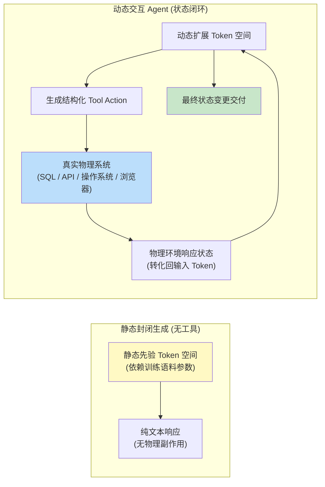
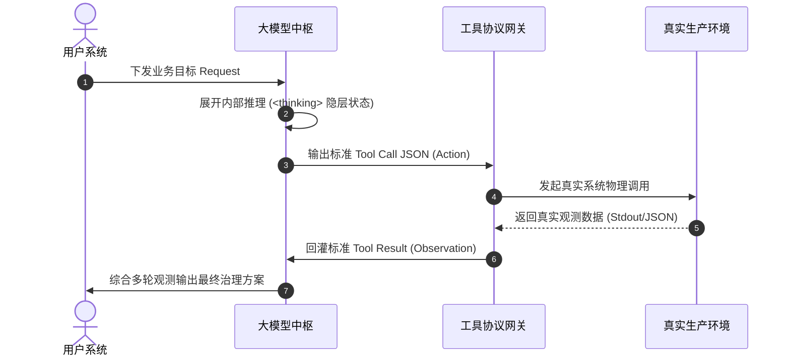
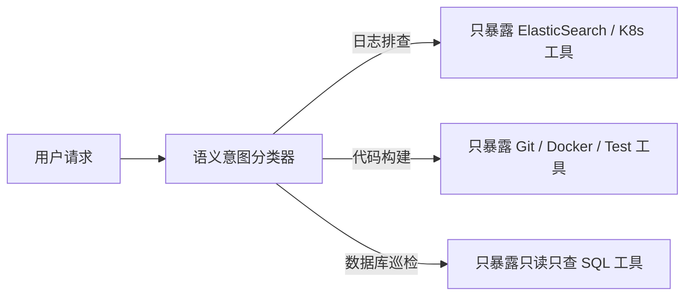
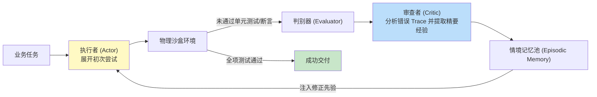
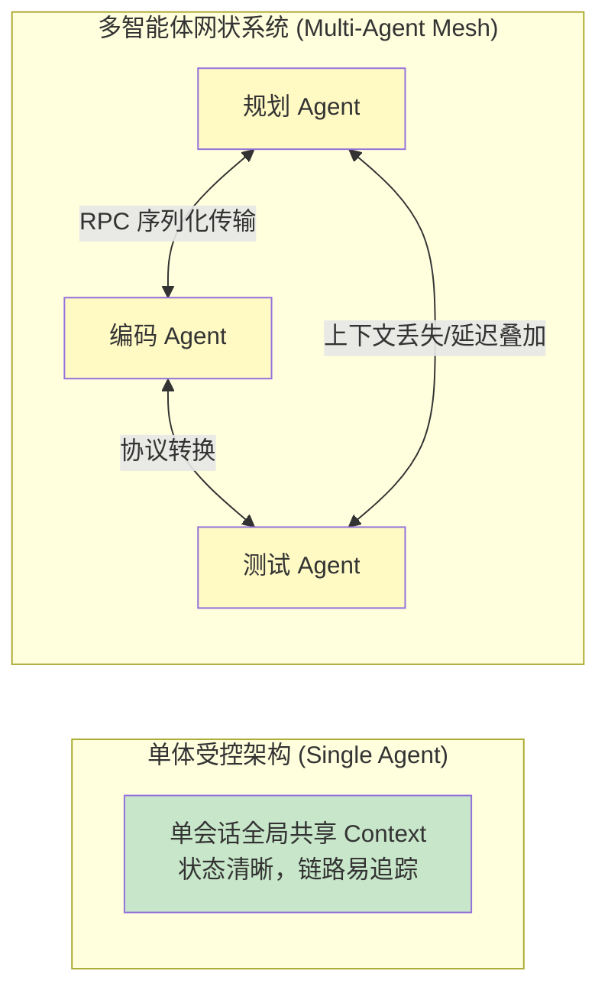
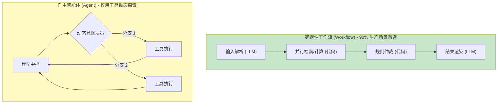
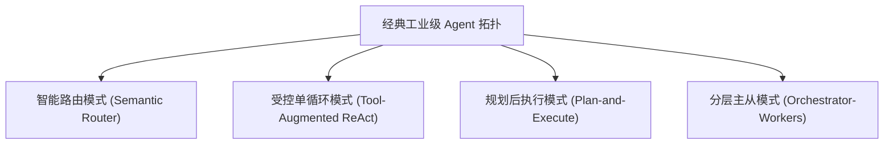
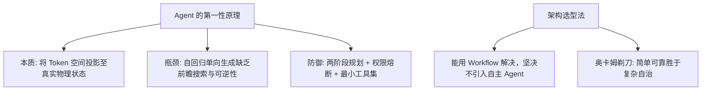

[← 上一章](10-knowledge.md) | [目录](../README.md) | [下一章 →](12-evaluation.md)

**English**: [English](../en/chapters/11-agents.md)

# 第十一章：智能体（Agent）的第一性原理

> "An agent is just a while loop with a tool call."
> （大半工业实践的真相，但也仅揭示了一半物理机理）

"智能体（Agent）"是当代大语言模型工程中最常被泛化的术语之一。从早期的 AutoGPT 到各类 Agent 框架、Function Calling 机制，乃至桌面操作自动化（Computer Use），各类方案皆冠以 Agent 之名。

本章旨在穿透表层术语泡沫，从第九章"Prompt 即程序"与第十章"先验知识注入"的第一性原理出发，**形式化推演** Agent 的计算本质、适用边界与生产级架构准则。

核心论点：

1. **Agent 的物理本质，在于将语言模型的表征流形延展至真实世界状态**；
2. **Agent 的根本结构性瓶颈，源于自回归因果模型天然缺乏前瞻规划与全局状态回溯能力**；
3. **在绝大多数工业业务场景中，一个确定性工作流（Workflow）的可靠性远胜于完全自主的开放式 Agent**；
4. **优秀的 Agent 架构设计遵循奥卡姆剃刀：以最精简的约束实现最高确信度的状态转移**。

---

## 11.1 什么是 Agent：表征空间的物理延展

### 最小形式化定义

剥除复杂的封装库，Agent 在计算本质上可严格形式化为：

> **Agent = 基础语言模型 (LLM) + 外部工具调用 (Tool Interface) + 动态环境反馈循环 (Environment Loop)**
> 
> 即模型在闭环系统中持续执行：状态感知（Observation） $\to$ 隐层推演（Thought） $\to$ 符号动作（Action） $\to$ 环境响应反馈（Observation）。

```python
def minimal_agent_loop(initial_goal: str, available_tools: list, max_iterations: int = 10) -> str:
    """Agent 架构的最小本质骨架"""
    interaction_trace = [initial_goal]
    
    for _ in range(max_iterations):
        # 1. 基于当前全量轨迹预测下一步决策
        step_response = llm.generate_decision(interaction_trace, tools=available_tools)
        
        # 2. 终止条件判定
        if step_response.is_terminal_state():
            return step_response.final_payload
            
        # 3. 拦截并执行物理工具调用
        observation_feedback = execute_tool_call(step_response.tool_call)
        
        # 4. 将环境物理响应回灌至上下文轨迹中
        interaction_trace.append(step_response)
        interaction_trace.append(observation_feedback)
        
    return "达到最大循环阈值，触发熔断降级"
```

当前各类复杂的开源智能体框架（LangChain、CrewAI、AutoGen、Computer Use 等），其底层计算逻辑皆脱胎于上述闭环控制循环，核心差异仅在于工具协议层、状态机路由与故障恢复策略的工程精细度。

### 第一性原理：工具调用对 Token 空间的物理拓扑扩张

回顾第一章的核心结论：大语言模型仅在离散的 Token 符号空间中进行条件概率续写。

标准生成模型的 Token 空间严格受限于其预训练语料的静态先验；而通过工具调用：



**工具调用（Tool Use）的本质并非赋予模型操作物理工具的主体动作，而是将真实物理世界的动态状态投影为模型可读取与可生成的离散 Token**。

- 数据库查询：SQL 执行返回的表格实体 $\to$ 投影为 JSON 格式的 Token 序列；
- 浏览器自动化：网页 DOM 树与视觉截屏 $\to$ 投影为结构化定位坐标与文本 Token；
- 代码解释器：Python 脚本运行的标准输出 $\to$ 投影为 stdout/stderr 的 Token 流。

模型始终未曾离开自回归计算流，但其上下文已被动态注入的外部环境状态赋予了改变物理系统状态的杠杆作用。

---

## 11.2 ReAct 范式：推理与行动的因果交织

### 经典因果拓扑

Yao 等人（[Yao et al., 2022](https://arxiv.org/abs/2210.03629)）提出的 ReAct（Reasoning + Acting）架构确立了智能体交互的标准因果拓扑：

```
Thought 1: 为解答用户关于系统 QPS 骤降的原因，首先需要查询集群过去 1 小时的监控指标。
Action 1: prometheus_query(metric="qps_rate", duration="1h")
Observation 1: 监控数据显示 14:20 分发生剧烈断崖式下跌，同时网关 502 错误率激增。
Thought 2: 502 错误率激增通常与上游微服务 OOM 崩溃相关，接下来需检索对应时间段的容器日志。
Action 2: fetch_k8s_logs(app="gateway", since="14:15", level="ERROR")
Observation 2: 捕获到多条 "java.lang.OutOfMemoryError: Java heap space"。
Thought 3: 故障根因已确立为网关堆内存耗尽，具备充分信息输出根因分析与恢复建议。
Action 3: finish_with_analysis(...)
```

ReAct 范式的关键洞察：**在生成具有物理副作用的 Action 之前，强制要求模型输出一段显式推导的 Thought 序列，能显著提升工具调用的准确率与状态机收敛速度**。

这与第八章所述的思维链（CoT）机理完全同构：中间的 Thought 序列充当了计算图的动态显存，帮助模型在生成具体 API 签名及参数前完成前序观测的语义对齐与逻辑规划。

### 现代类型安全的工业实现

在现代云原生架构中，ReAct 文本已全面演进为强类型协议：



核心拓扑依然延续了 ReAct 的因果闭环，差异仅在于将原本脆弱的自由文本约束为了形式化的强类型协议。

---

## 11.3 智能体的物理瓶颈：缺乏前瞻搜索与可逆性

### 自回归局部贪心策略的缺陷

自回归语言模型遵循单向时序生成，其决策本质上是基于当前上下文所能观测到的历史信息进行**局部贪心采样**。

在具备物理副作用的 Agent 场景中，这种局部贪心策略将导致严峻的工程危机：


### 三大典型工程失效模式

1. **组合爆炸与低效震荡**：面对多文件批处理任务，模型频繁在单文件层级重复调用 `read_file` 与 `write_file`，陷入冗余的状态轮询（在传统工程中仅需单行 Shell 脚本即可高效解决）；
2. **死循环与状态停滞**：当工具返回非预期的错误响应时，模型受限于上下文的强注意力锚定，容易在相同的错误参数空间内反复重试；
3. **不可逆的副作用灾难**：在涉及数据删除（`DROP TABLE` / `rm -rf`）或外部通信（发送邮件、支付接口）时，局部误判将造成不可挽回的物理损失。

此类失效并非单纯的提示词工程瑕疵，而是根植于**自回归因果单向生成的结构性局限**。

---

## 11.4 工业级 Agent 的工程防御机制

为防范前向生成的不可逆风险，生产级系统必须构筑四道确定性工程护栏：

### 护栏一：两阶段规划与执行解耦（Plan-and-Solve）

强制将"推演构想"与"物理执行"拆分为两轮显式交互：

```markdown
【前置规划阶段 Prompt】
目标任务：{task}
在发起任何物理工具调用前，请首先输出一份完整的形式化执行计划：
1. 步骤拓扑与依赖关系；
2. 每一步的预期成功判据（Exit Code / Assertion）；
3. 若遭遇权限缺失或格式异常时的降级预案。
计划提交后，需等待调度器仲裁确认方可进入执行阶段。
```

模型在输出计划文本时虽然仍处于自回归流中，但该文本仅作为可修改的符号中间态，未向外界环境发出具有副作用的写操作。

### 护栏二：人在环路与关键权限熔断（Human-in-the-loop）

```python
# 声明不可逆或破坏性操作的高风险集合
HIGH_RISK_ACTIONS = {
    "db_drop_table", "db_truncate", "fs_delete_recursive",
    "k8s_delete_pod", "payment_execute_transfer"
}

def dispatch_tool_with_gatekeeper(tool_call_request) -> str:
    action_name = tool_call_request.function.name
    arguments = tool_call_request.function.arguments
    
    if action_name in HIGH_RISK_ACTIONS:
        # 触发安全审计中断，上报人工网关
        approval_token = request_human_supervisor_approval(action_name, arguments)
        if not approval_token.is_authorized():
            return f"安全熔断：管理员拒绝执行高风险操作 [{action_name}]"
            
    return execute_sandboxed_api(action_name, arguments)
```

生产级系统普遍引入精细的鉴权拦截器，为关键决策保留绝对的人工熔断开关。

### 护栏三：基于意图路由的工具空间动态收敛

严禁无差别向模型上下文注入数十个甚至上百个 API 描述。工具数量的增加将导致模型在参数空间中的注意力极度发散。

标准做法是基于第一阶段的意图识别，**动态加载最小特权工具子集**：



此设计在架构上将高熵的开放式探索降级为受限状态机路由，大幅提升了系统的可预测性。

### 护栏四：外部控制总线强制终止条件

严禁将终止判定完全交由模型自主裁决，必须依托外部控制总线施加硬性约束：
- 严格限制单次会话最大工具调用步数（例如 $N \le 8$）；
- 引入滑动窗口哈希算法，检测最近 3 次工具调用是否陷入参数重复或死循环；
- 设置全局端到端超时与 Token 预算消耗上限。

---

## 11.5 反思机制（Reflexion）的真实效能与误区

Shinn 等人（[Shinn et al., 2023](https://arxiv.org/abs/2303.11366)）提出的 Reflexion 范式，通过在错误发生后引入自省步骤，将历史经验以文本记忆形式持久化至下一轮重试中：



该模式的有效性再次印证了第七章阐述的计算非对称性：状态校验与逻辑审查的计算难度显著低于零样本生成。

**工程警示**：若由同一个模型在同一个对话上下文中既当执行者又当裁判，自我审查极易陷入认知惯性与防御性合理化倾向。

生产级反思系统必须满足：
1. **角色物理隔离**：审查模型与生成模型分立，或由确定性测试断言（Unit Test / Linter / AST）承担客观裁判；
2. **上下文脱敏重构**：向审查模型提供执行 Trace 与最终差异对比，而非模型自身的长篇自洽辩解。

---

## 11.6 多智能体系统（Multi-Agent System）的收益与工程代价

### 理论构想与现实摩擦

直觉上的工程假设往往认为：既然单体智能体难以胜任长链路全功能任务，便应引入专业化分工体系（例如架构师 Agent、编码 Agent、测试 Agent 互相交互协作）。

然而在生产落地中，多智能体网络往往伴随着严峻的系统摩擦：



1. **序列化与上下文丢失**：各智能体之间进行自然语言消息传递时，前置关键约束极易发生信息衰减与语义漂移；
2. **错误级联放大**：单体推演幻觉在多智能体网络中极易级联放大为系统性群体幻觉；
3. **可观测性与排障黑洞**：在单体系统中，执行 Trace 线性可查；而在多智能体协同网络中，故障归因与可观测性链路极其复杂；
4. **算力与时延成本指数膨胀**：多轮分布式会话将带来数倍的 Token 账单与无法满足交互预期的超长时延。

> **工程选型准则**：在单体 Agent 配套确定性工具尚能解决问题前，坚决不要引入自治的多智能体网络架构。

---

## 11.7 工作流（Workflow）与智能体（Agent）的本质分野

Anthropic 在《Building Effective Agents》中给出了极具穿透力的架构判定法则：

- **确定性工作流（Workflow）**：由工程师通过代码显式编排控制流（条件分支、并行循环、状态持久化），LLM 仅在预定义的各个节点中承担局部的高维语义理解与转换；
- **自主智能体（Agent）**：控制流交由 LLM 自主驱动，由模型在前向计算中动态决定调用何种工具、是否继续迭代、何时终止。



| 评估维度 | 确定性工作流 (Workflow) | 自主智能体 (Agent) |
|---|---|---|
| **控制流主导权** | 工程师硬编码 (Code-driven) | 语言模型概率驱动 (Model-driven) |
| **系统可预测性** | 极高（符合传统软件确定性预期） | 较低（存在长尾随机漂移风险） |
| **可观测与调试** | 极易（清晰的断点与日志打点） | 困难（依赖非结构化自然语言追踪） |
| **工程吞吐与时延** | 高吞吐、低延迟 | 延迟长、Token 消耗大 |
| **推荐适用场景** | 流程结构已知、边界严密的业务（90%） | 路径高度不确定、需探索式求解（10%） |

在绝大多数工程实践中，确定性工作流具备压倒性的性能与成本优势。

---

## 11.8 生产级 Agent 系统架构设计模式



### 模式一：智能语义路由（Semantic Router）
结构最精简的智能分流模式：依据用户输入动态路由至专用的工作流引擎。

### 模式二：受控单循环 ReAct（Tool-Augmented ReAct）
最通用的受控智能体模式：以单个 LLM 为推理中枢，驱动特定工具集在动态循环中迭代。

### 模式三：两阶段规划与执行（Plan-and-Execute）
适用于依赖拓扑清晰的长任务：第一阶段由高级模型生成全局有向无环图（DAG），第二阶段交由执行器按序运行。

### 模式四：分层主从编排（Orchestrator-Workers）
适用于可高度并行化的大规模批处理：主控 Agent 负责任务拆解与聚合，多个工作 Agent 并行执行独立子任务。

---

## 11.9 生产级 Agent 上线工程核对清单

```markdown
### 1. 工具接口契约
- [ ] 所有工具输入皆严格绑定 JSON Schema / Pydantic，禁止自然语言模糊传参；
- [ ] 工具异常时返回包含修复建议的高信噪比错误信息，避免单一的通用失败码；
- [ ] 破坏性与不可逆操作具备独立的人工授权拦截网关。

### 2. 状态机与控制流
- [ ] 设有不可突破的最大循环步数（Max Iterations）硬性上限；
- [ ] 部署动作序列重复性检测算法，防止状态停滞与无限死循环；
- [ ] 设有全局调用时延（Timeout）与 Token 预算熔断拦截器。

### 3. 可观测性与追踪
- [ ] 完整记录每一次生成过程中的 Thought、Tool Call 与 Observation 原始张量及日志；
- [ ] 接入 OpenTelemetry / Langfuse 等分布式 Trace 链路追踪平台；
- [ ] 建立失败归因分类监控（模型语义解析失败 vs 工具超时 vs 下游权限不足）。

### 4. 系统安全性防御
- [ ] 建立针对间接提示注入（Indirect Prompt Injection）的输入脱敏层；
- [ ] 工具调用实行基于角色的最小权限访问控制（RBAC）；
- [ ] 设立全局一键物理熔断开关（Kill Switch）。
```

---

## 11.10 奥卡姆剃刀：以极简设计对抗系统熵增

复杂智能体系统的崩溃往往源于系统熵增本身：
- 注册工具过多，导致参数空间注意力分散；
- 状态转移链条过长，导致概率误差指数累积；
- 角色定义过度分化，导致通信信噪比持续恶化。

**大语言模型系统架构的第一设计法则：永远优先使用确定性工作流。当必须引入 Agent 机制时，保持工具集的最精简与状态机的受控可逆。**

---

## 本章小结



核心要点：

1. **Tool Use 是状态空间的投影**：工具让语言模型能够读写真实世界的环境状态；
2. **警惕自回归的前向盲目性**：模型缺乏全局回溯能力，必须由外部系统建立状态保护与回滚机制；
3. **重视 ReAct 结构化演进**：将自然语言思考转化为强类型的规范接口调用；
4. **工作流优先于开放智能体**：绝大多数业务应选用确定性 Workflow，而非高随机性的多 Agent 系统；
5. **构筑完备的工程安全网关**：熔断控制、状态去重与鉴权拦截是智能体上线的必要前置条件。

在下一章中，我们将深入系统工程的基石环节：系统性探索大语言模型及其智能体系统的量化评测体系（Evaluation）。

---

## 延伸阅读

- [ReAct: Synergizing Reasoning and Acting in Language Models](https://arxiv.org/abs/2210.03629), Yao et al., 2022
- [Reflexion: Language Agents with Verbal Reinforcement Learning](https://arxiv.org/abs/2303.11366), Shinn et al., 2023
- [Toolformer: Language Models Can Teach Themselves to Use Tools](https://arxiv.org/abs/2302.04761), Schick et al., 2023
- [Building Effective Agents](https://www.anthropic.com/research/building-effective-agents), Anthropic Research, 2024
- [Voyager: An Open-Ended Embodied Agent with Large Language Models](https://arxiv.org/abs/2305.16291), Wang et al., 2023
- [AgentBench: Evaluating LLMs as Agents](https://arxiv.org/abs/2308.03688), Liu et al., 2023

[← 上一章](10-knowledge.md) | [目录](../README.md) | [下一章 →](12-evaluation.md)
