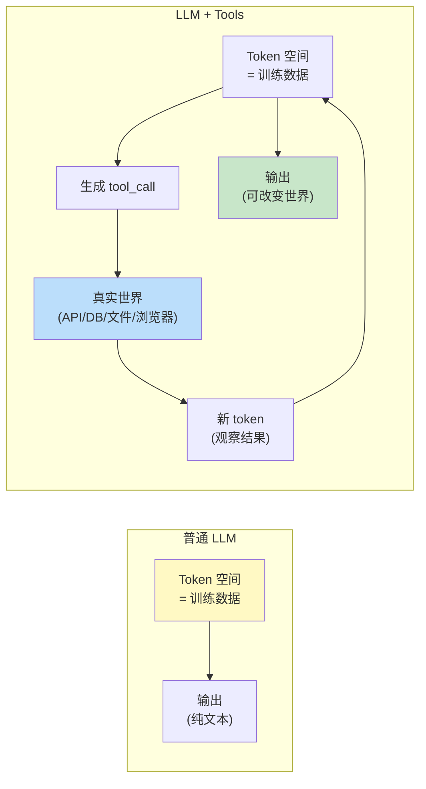
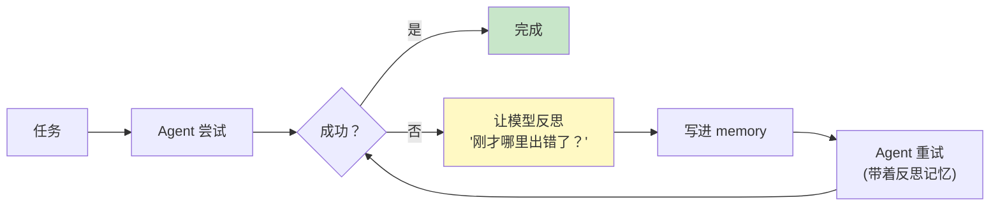
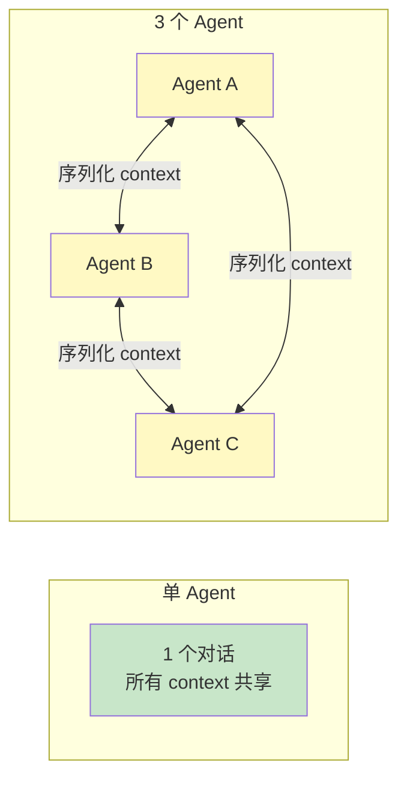
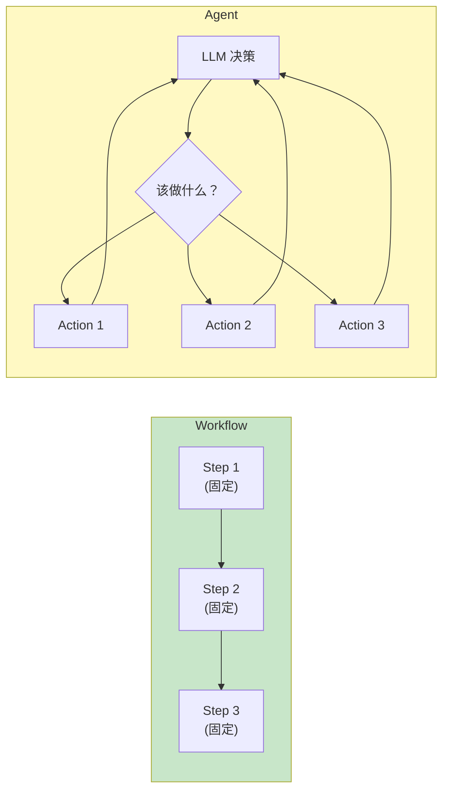
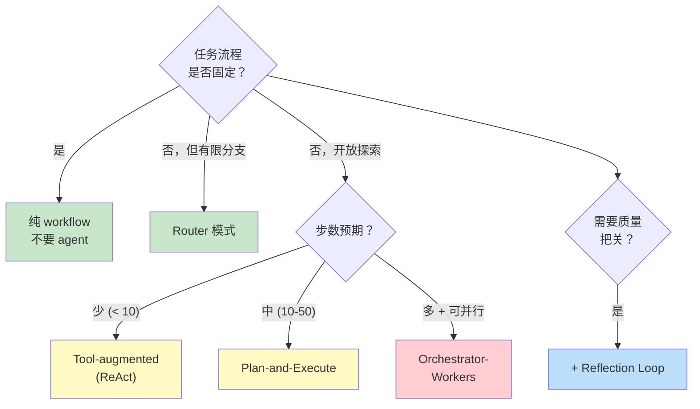

[← 上一章](10-knowledge.md) | [目录](../README.md) | [下一章 →](12-evaluation.md)

# 第十一章：Agent 的第一性原理

> "An agent is just a while loop with a tool call." — 大半实战的真相，但也只有一半。

"Agent" 是过去两年最被滥用的词。从 AutoGPT 到 LangChain agent、再到 OpenAI 的 GPTs、Anthropic 的 Computer Use，每个项目都在自称是 agent，但定义各不相同。

本章不去争术语。我们做一件更有用的事：从第九、十章建立的"prompt 是编程"和"知识注入"的视角出发，**推导**出 agent 是什么、什么时候需要、怎么设计才不会翻车。

核心论点：

1. **Agent 的本质，是把 LLM 的 token 空间扩展到真实世界**
2. **Agent 的根本困难，是自回归模型没有"前瞻规划"能力**
3. **绝大多数被宣称为"agent"的系统，其实一个 prompt 就够了**
4. **最好的 agent 设计，往往是最简单的**

读完这一章，你会对 "什么时候用 agent、什么时候不用" 有一个清晰的判据，并知道生产 agent 系统失败的几个最常见根因。

---

## 11.1 什么是 Agent：从 token 空间说起

### 一个最小定义

抛开所有花哨术语，agent 可以这样定义：

> **Agent = LLM + Tool Use + Loop**
>
> 一个 LLM 在一个循环里做：观察 → 思考 → 调用工具 → 获得新观察 → 继续。

```python
def minimal_agent(task, tools, max_steps=10):
    history = [task]
    for _ in range(max_steps):
        response = llm.generate(history, tools=tools)
        if response.is_final_answer():
            return response.text
        # 否则是 tool call
        result = execute(response.tool_call)
        history.append(response)
        history.append(result)
    return "Max steps reached"
```

这就是 agent 的"骨架"。**所有 agent 框架——LangChain、AutoGPT、CrewAI、Anthropic Computer Use——本质上都是这个 7 行循环的变体**，只是在工具集、循环控制、错误恢复上做了精细化。

### 第一性视角：Tool use 扩展 token 空间

回忆第一章：LLM 做的事是"在 token 空间里续写"。

普通 LLM 的 token 空间是封闭的——只有训练数据里见过的东西。但当你给 LLM 工具时：



**Tool use 不是"让 AI 用工具"——是把真实世界变成 LLM 可读写的 token**。

- 调用一个数据库查询 → 数据库返回的 JSON 进入 token 序列
- 浏览一个网页 → DOM 文本进入 token 序列
- 执行一段代码 → stdout 进入 token 序列
- 发送一封邮件 → "邮件已发送" 进入 token 序列

LLM 仍然只在 token 空间里续写。但这个 token 空间被工具扩展到了远远超出训练数据的范围。

理解这一点，你就能解释很多设计选择：

- 为什么工具的输出格式很重要 → 它要变成 LLM 能"读懂"的 token
- 为什么浏览器自动化是个难题 → 网页 DOM 是巨大的、嘈杂的 token 流
- 为什么 function calling 比文本约定可靠 → 结构化 token 比自由文本更易控制

---

## 11.2 ReAct：思考-行动-观察循环

### 经典模式

ReAct（Reasoning + Acting）由 Yao et al. (2022) 在 [_ReAct: Synergizing Reasoning and Acting in Language Models_](https://arxiv.org/abs/2210.03629) 中提出。它定义了 agent 循环的标准结构：

```
Thought: 我需要找到 X 的信息。先搜索一下。
Action: search("X")
Observation: 搜索返回 [...]
Thought: 结果里提到 Y。我需要查一下 Y 的具体定义。
Action: search("Y")
Observation: ...
Thought: 现在我有足够信息回答原问题了。
Action: finish("最终答案")
```

每一步循环包含：
- **Thought**：模型出声推理（CoT 在 agent 场景的回响）
- **Action**：调用工具
- **Observation**：工具返回结果

ReAct 的关键洞察：**让模型在工具调用前显式推理，比直接调用工具效果好得多**。

为什么？回到第八章：CoT 给模型"草稿纸"。Agent 场景里，"草稿纸"上要写的是"我现在该用哪个工具、为什么、参数是什么"。没有这一步，模型容易乱调工具。

### 现代实现

Anthropic、OpenAI 的 function calling 接口本质上是 ReAct 的语法糖：

```python
# Anthropic style
response = client.messages.create(
    model="claude-opus-4-7",
    tools=[{
        "name": "search",
        "description": "搜索互联网",
        "input_schema": {...}
    }],
    messages=[{"role": "user", "content": "X 的最新进展是什么？"}]
)

# 模型可能返回:
# - thinking 块: <thinking>我需要搜索 X...</thinking>  ← Thought
# - tool_use 块: {"name": "search", "input": {"query": "X"}}  ← Action
# 
# 你执行后把 tool_result 喂回去:
client.messages.create(
    model="claude-opus-4-7",
    messages=[
        ...previous,
        {"role": "user", "content": [
            {"type": "tool_result", "tool_use_id": ..., "content": "..."}  # ← Observation
        ]}
    ]
)
```

模式没变——只是 thinking/tool_use/tool_result 用了结构化 schema 而不是纯文本。

---

## 11.3 Agent 的根本困难：没有前瞻规划

### 自回归 = 走一步看一步

第六章和第八章已经反复提到这个问题：自回归生成意味着模型"走一步看一步"，没有真正的前瞻。

放到 agent 场景里，这个问题被**放大了**。因为 agent 的每一步可能花几秒到几分钟（工具调用），而且每一步都改变了世界状态（不可回退）。

```mermaid
flowchart TD
    subgraph 人类规划["人类做事"]
        H1["看到任务"] --> H2["想清楚整体流程"]
        H2 --> H3["在脑子里模拟<br>每一步可能的结果"]
        H3 --> H4["发现某条路<br>会失败"]
        H4 --> H5["改用另一条路"]
        H5 --> H6["开始执行"]
    end
    
    subgraph Agent["LLM Agent"]
        A1["看到任务"] --> A2["第一步：先做这个"]
        A2 --> A3["执行 → 看结果"]
        A3 --> A4["第二步：再做这个"]
        A4 --> A5["执行 → 看结果"]
        A5 --> A6["第三步发现走错了"]
        A6 --> A7["但前面已经做了不可逆的事..."]
    end
    
    style 人类规划 fill:#c8e6c9
    style Agent fill:#ffcdd2
```



LLM agent 没有"心里模拟"的能力。它"想到下一步"的方式，就是真的去做。

这导致几类典型失败：

**失败 1：低效绕路**

```
任务：把 /tmp/data 里所有 .csv 转成 .json

Agent 行为：
  Thought: 先看看 /tmp/data 里有什么
  Action: list_files("/tmp/data")
  Observation: [a.csv, b.csv, c.csv, ..., z.csv]  // 26 个文件
  Thought: 处理 a.csv
  Action: read_file("/tmp/data/a.csv")
  Action: write_file("/tmp/data/a.json", ...)
  Thought: 处理 b.csv
  Action: read_file("/tmp/data/b.csv")
  ...
  
（其实一行 bash 就能搞定）
```

**失败 2：陷入死循环**

```
任务：找到包含 "secret" 的文件

Agent 行为：
  Action: search_in_file("a.txt", "secret")
  Observation: not found
  Action: search_in_file("a.txt", "secret")  // 又试了一次同样的
  Observation: not found
  Action: search_in_file("a.txt", "Secret")  // 改了大小写继续转圈
  ...
```

**失败 3：不可逆错误**

```
任务：清理临时目录

Agent 行为：
  Thought: 清理 /tmp 下的旧文件
  Action: delete_files("/tmp/old_*")
  Observation: 删除了 500 个文件
  Thought: 等等，刚才那个 pattern 包括了用户的工作文件...
  
（无法撤销）
```

这些不是 prompt 没写好——它们是**自回归 agent 的结构性问题**。

---

## 11.4 缓解前瞻问题的几种策略

不能根除，但可以缓解。

### 策略一：让 agent 先写 plan

```python
prompt = f"""任务：{task}

在开始执行之前，请先写出完整的执行计划。包括：
1. 每一步要做什么
2. 每步的预期结果
3. 如果某步失败，备选方案是什么

写完计划后，等待我的确认，再开始执行。
"""
```

这把"自回归生成"的尺度从 token 拉大到了**计划单位**。模型在生成"计划"这一段时，仍然是自回归的，但生成的内容是"对未来的描述"，而不是真正的执行——错了可以重写。

代价：多一轮对话；plan 本身可能不准。但比直接执行好。

### 策略二：人在环（Human-in-the-loop）

危险动作前必须人工确认：

```python
DANGEROUS_TOOLS = ["delete_file", "send_email", "execute_payment", "rm", "drop_table"]

def execute_with_approval(tool_call):
    if tool_call.name in DANGEROUS_TOOLS:
        approval = ask_user(f"即将执行: {tool_call}\n确认？(y/n)")
        if not approval:
            return "用户拒绝执行"
    return execute(tool_call)
```

这不是技术问题，是产品问题。Anthropic Computer Use、Claude Code 都有类似的"权限提示"机制——给用户一个 kill switch。

### 策略三：限制搜索空间

不要给 agent 太多工具、不要给它太大的自由度。**约束越紧，越不容易跑飞**。

```python
# 不好：给 30 个工具，让模型自己挑
tools = [...30 个 tools...]

# 更好：根据任务类型，先决定"工具子集"
def get_tools_for_task(task_type):
    if task_type == "data_analysis":
        return [read_csv, run_sql, plot]
    if task_type == "web_research":
        return [search, fetch_url, summarize]
    ...

tools = get_tools_for_task(classify(user_request))
```

这其实是把"agent 自由发挥"问题，**部分回退成"路由 + 受限 agent"**。后者更可控。

### 策略四：限制循环深度和宽度

```python
def safe_agent_loop(task, max_steps=10, max_same_action_repeat=3):
    history = []
    action_counts = Counter()
    
    for step in range(max_steps):
        response = llm.generate(history)
        if response.is_final():
            return response
        
        # 检测重复
        action_key = (response.tool_call.name, response.tool_call.input)
        action_counts[action_key] += 1
        if action_counts[action_key] > max_same_action_repeat:
            return f"检测到重复动作，强制退出: {action_key}"
        
        result = execute(response.tool_call)
        history.append((response, result))
    
    return "达到最大步数"
```

不要让 agent 自己决定什么时候停——它的判断不可靠。

---

## 11.5 Reflection：让 agent 审视自己

### 让 agent 自我批评

Shinn et al. (2023) 的 [_Reflexion_](https://arxiv.org/abs/2303.11366) 提出一个直觉简单的模式：



```python
def reflexive_agent(task, max_attempts=3):
    reflections = []
    for attempt in range(max_attempts):
        history = [task] + reflections
        result = run_agent(history)
        
        if evaluate(result, task):  # 成功
            return result
        
        # 失败 → 让模型反思
        reflection = llm.generate(f"""
        任务：{task}
        我的尝试：{result}
        我没有完成任务。请反思：
        - 我哪一步走错了？
        - 我下次应该怎么做？
        请给出 1-2 句具体的教训。
        """)
        reflections.append(f"上次教训：{reflection}")
    
    return "多次尝试均失败"
```

这个模式有效是因为：**审查比生成更容易**——这是第七章已经讨论过的不对称。

### 慎用：自我审查的局限

但记住第七章的警告：模型自我审查的能力有限。如果 critic 和 actor 是同一个模型、同一段对话上下文，反思的质量会显著下降——它倾向于为自己的错误辩护。

更可靠的做法：

- 用**不同的模型**做 critic（如 Sonnet 做 actor、Opus 做 critic）
- 或者**清空上下文**，让 critic 看不到 actor 的"心路历程"，只看输入输出
- 或者用**确定性的验证器**（单元测试、断言、schema 检查）替代模型 critic

---

## 11.6 Multi-agent：分工的好处与代价

### "多 agent" 的诱惑

一个直觉的想法：既然单个 agent 难管，那就分工——一个专门做 research、一个专门做 coding、一个专门做 review，互相协作。CrewAI、AutoGen、Anthropic 的 agent 协议都在推这个方向。

理论上的好处：
- **专注**：每个 agent 只做擅长的事，prompt 更聚焦
- **并行**：独立任务可以同时进行
- **可解释**：分工明确，更易调试

### 现实的代价

但实际生产中，multi-agent 的代价常常被低估：

**代价 1：沟通成本爆炸**



每个 agent 切换都需要把上下文"翻译"成另一个 agent 能理解的形式。中间会丢信息、加误差。

**代价 2：错误传染**

如果 Agent A 的输出有幻觉，Agent B 把它当真，错误会被进一步放大。第七章的"推理幻觉"在 multi-agent 系统里会变成"协作幻觉"——一群 agent 都自信地在错误前提上推进。

**代价 3：评估困难**

单个 agent 做错了，你能看到完整的对话。多个 agent 协作出错，你要追查"是谁的锅"——可能是 A 的输出问题、B 的理解问题、协议本身的问题。

**代价 4：成本和延迟**

每个 agent 都是 LLM 调用。3 个 agent 协作 = 至少 3 倍调用，可能更多。如果要并行，工程复杂度也跟着上升。

### Anthropic 的经验法则

Anthropic 的工程文档（[_Building Effective Agents_](https://www.anthropic.com/research/building-effective-agents)）总结过：

> **从最简单的方案开始。只有当确实需要时才引入复杂度。**
> 
> 大多数被报道为 "agent" 的系统，实际上只需要：
> - 一个聪明的 prompt
> - 或一个 "prompt + 工具" 的循环
> - 或几个串联的 prompt（workflow，而非 agent）

不要因为"听起来高级"就上 multi-agent 框架。先把单 agent 做好，遇到具体瓶颈再分工。

---

## 11.7 Workflow vs Agent：一个常被混淆的区分

### 关键区别

Anthropic 的同一篇文章里提出了一个有用的区分：

- **Workflow**：流程是**预定义**的，每一步用什么工具、什么 prompt 都是工程师写死的。LLM 只在每一步做局部决策。
- **Agent**：流程是**动态**的，LLM 自己决定下一步做什么、用什么工具、什么时候停。



### 决策表

| 维度 | Workflow | Agent |
|------|---------|-------|
| 控制流 | 工程师定义 | LLM 决定 |
| 可预测性 | 高 | 低 |
| 可调试性 | 高 | 低 |
| 灵活性 | 低 | 高 |
| 适用场景 | 任务结构稳定 | 任务结构开放 |
| 失败模式 | 边界 case 处理不了 | 跑飞、死循环、走错路 |

**经验法则**：
- 如果你能**画出任务的流程图**，用 workflow
- 只有当**流程本身需要根据中间结果动态变化**，才用 agent

90% 被宣传为 "agent" 的产品，实际上是 workflow——而且因为做成 workflow 而更可靠。

### 一个例子

任务：阅读用户上传的 PDF，回答关于内容的问题。

**Workflow 实现**：
```
Step 1: PDF → 文本
Step 2: 文本 → chunks
Step 3: chunks → embeddings → 向量库
Step 4: 用户问题 → embedding → 检索 top-k chunks
Step 5: chunks + 问题 → LLM → 答案
```

**Agent 实现**：
```
给 LLM 工具: extract_pdf_text, chunk_text, search_chunks, answer_question
让 LLM 自己决定调用顺序
```

哪个更好？**几乎所有情况下 workflow 更好**——它快、便宜、可预测。Agent 只在用户问题非常多样、需要不同检索策略时才有优势。

---

## 11.8 Agent 设计模式

把前面的内容综合起来，几个有效的 agent 设计模式：

### 模式 1：Router

最简单的"agent"——根据输入分发到不同的 workflow。

```python
def router(user_input):
    classification = llm.classify(user_input, ["coding", "research", "qa"])
    if classification == "coding":
        return coding_workflow(user_input)
    elif classification == "research":
        return research_workflow(user_input)
    else:
        return qa_workflow(user_input)
```

控制流由人写、决策由 LLM 做。简单可靠。

### 模式 2：Tool-augmented LLM（单循环 ReAct）

最常用的真 agent 模式——一个 LLM、一组工具、一个循环。Anthropic Tool Use、OpenAI Function Calling 的标准用法。

适合：任务结构开放、需要少量工具调用（< 10 步）。

### 模式 3：Plan-and-Execute

先让 LLM 写完整计划，再分别执行每一步。

```python
def plan_and_execute(task):
    plan = llm.generate(f"为以下任务写一个分步计划: {task}")
    results = []
    for step in plan.steps:
        result = execute_step(step)
        results.append(result)
    return synthesize(results)
```

适合：任务可以预先规划、步骤之间依赖少。

### 模式 4：Orchestrator-Workers（编排者-工人）

一个"编排 LLM"决定要做什么，多个"工人 LLM"并行执行。结果再汇总。

适合：能并行的任务（如批处理多个文档）。

### 模式 5：Reflection Loop

Actor 生成 → Critic 审查 → Actor 改进 → 直到通过。

适合：有明确质量标准的任务（代码、文章）。

### 选型参考



---

## 11.9 生产 Agent 的工程检查表

把一个 agent 推到生产前，过一遍这个检查表：

### 工具设计

- [ ] 工具有清晰的、对 LLM 友好的描述（不是给人看的 docstring）
- [ ] 工具的输入有 JSON schema（不是自由文本）
- [ ] 工具的输出对 LLM 可读（结构化、不太长）
- [ ] 工具的错误信息提示了"该怎么修"（而不是只说失败）
- [ ] 危险工具有独立的权限层（确认/审批）

### 控制流

- [ ] 有最大步数限制
- [ ] 有重复动作检测
- [ ] 有超时机制（每个工具调用 + 总体）
- [ ] 失败后有重试策略（带 backoff）
- [ ] 有"放弃"机制（让 agent 能优雅地说"我做不到"）

### 可观测性

- [ ] 每一步都有完整日志（thought + action + observation）
- [ ] Token 使用量、延迟、成本都被记录
- [ ] 错误被分类（工具错误 vs 模型错误 vs 用户错误）
- [ ] 有 trace 工具（如 LangSmith、Langfuse、自建）

### 安全性

- [ ] Prompt injection 防护（来自工具输出的恶意指令）
- [ ] 敏感数据不泄露给工具（PII 过滤）
- [ ] 工具的权限范围最小化（不给 agent root）
- [ ] 重要动作有审计日志
- [ ] 有 kill switch

### 评估

- [ ] 有一组代表性任务集（不是单个 demo）
- [ ] 有自动化的成功率评估
- [ ] 有成本/延迟的基线
- [ ] 改了 prompt 后能跑回归测试

第十二章会专门讨论评估。

---

## 11.10 反直觉：最好的 agent 往往最简单

回过头来看本章开头的论点：**最好的 agent 设计往往是最简单的**。

复杂 agent 系统失败的原因，几乎从来不是"模型不够强"——是因为复杂度本身：

- 工具太多 → 模型选错
- 步骤太多 → 错误累积
- 角色太多 → 沟通失真
- 抽象太多 → 调试无门

而简单 agent 成功的原因：

- 工具少 + 描述清晰 → 模型选对
- 步骤少 + 每步可验证 → 错误能被发现
- 单一 LLM + 完整 context → 决策一致
- 控制流明确 → 调试容易

在 agent 设计上，**奥卡姆剃刀比"AI 思维"更重要**。能用 workflow 解决的，不要上 agent；能用单 agent 解决的，不要上 multi-agent；能用 5 个工具的，不要给 50 个。

---

## 总结

| 问题 | 答案 |
|------|------|
| Agent 的本质是什么 | LLM + Tools + Loop。把 LLM 的 token 空间扩展到真实世界 |
| Agent 的根本困难 | 自回归生成 = 走一步看一步，没有真正的前瞻规划 |
| 怎么缓解前瞻问题 | 显式 plan、人在环、限制工具集和循环深度 |
| ReAct 是什么 | Thought-Action-Observation 循环，让模型在调用工具前显式推理 |
| Reflection 有效吗 | 有效，但要避免"自己审查自己"——critic 应该和 actor 隔离 |
| Multi-agent 该用吗 | 谨慎使用。沟通成本和错误传染常常超过分工的好处 |
| Workflow vs Agent | 能预定义流程就用 workflow，只有真正需要动态决策才用 agent |
| 设计原则 | 越简单越好。复杂度是 agent 失败的主要根因 |

下一章我们讨论一个被严重低估的环节：**评估**。一个没有 eval 的 agent，本质上是一个 demo。

---

## 延伸阅读

- [Yao et al., 2022: _ReAct: Synergizing Reasoning and Acting_](https://arxiv.org/abs/2210.03629) — ReAct 范式的开创工作
- [Shinn et al., 2023: _Reflexion_](https://arxiv.org/abs/2303.11366) — 基于反思的 agent
- [Schick et al., 2023: _Toolformer_](https://arxiv.org/abs/2302.04761) — 让模型学会用工具
- [Anthropic, 2024: _Building Effective Agents_](https://www.anthropic.com/research/building-effective-agents) — 反对过度复杂化的工程指南
- [Wang et al., 2023: _Voyager: An Open-Ended Embodied Agent with LLMs_](https://arxiv.org/abs/2305.16291) — 长期 agent 的探索
- [Park et al., 2023: _Generative Agents_](https://arxiv.org/abs/2304.03442) — 模拟人类行为的 agent
- [Liu et al., 2023: _AgentBench_](https://arxiv.org/abs/2308.03688) — Agent 评估基准

[← 上一章](10-knowledge.md) | [目录](../README.md) | [下一章 →](12-evaluation.md)
