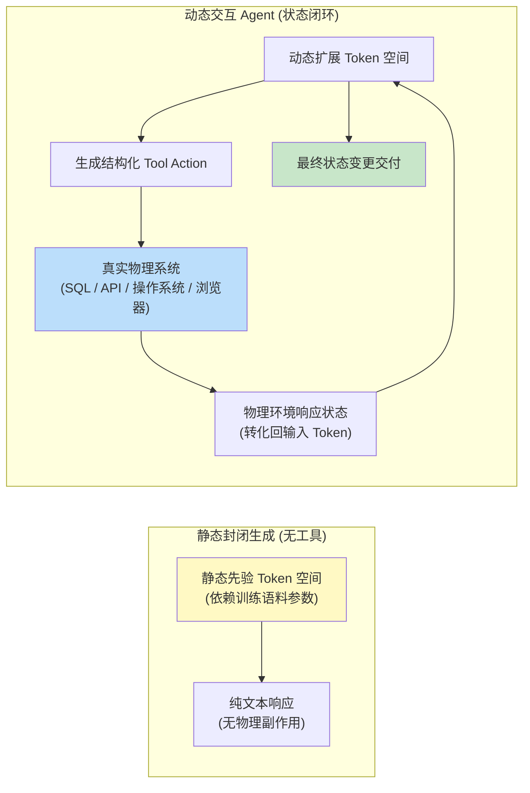
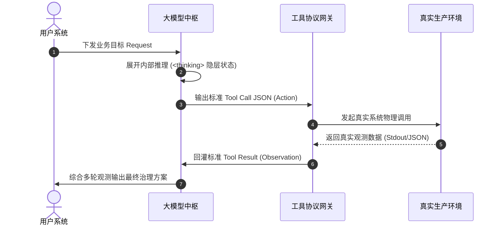
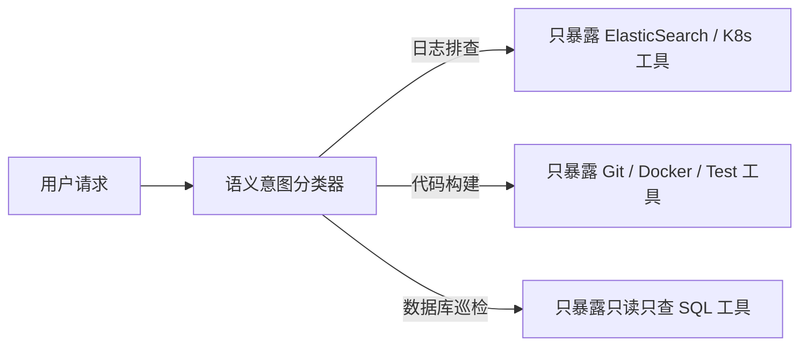
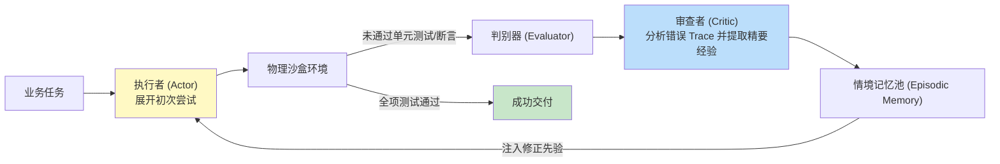
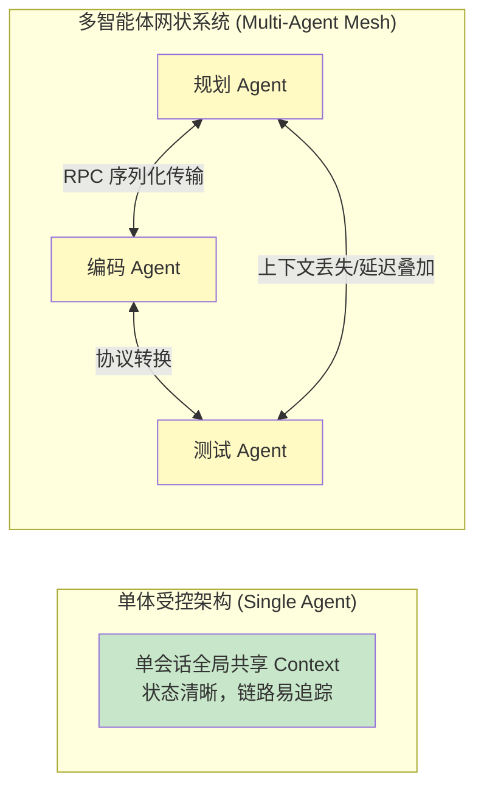
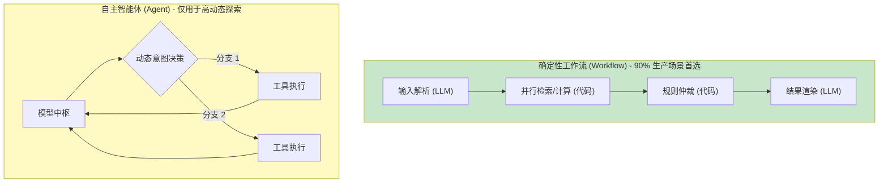
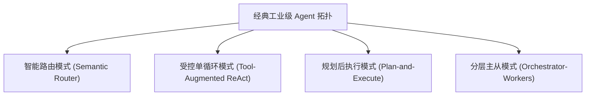
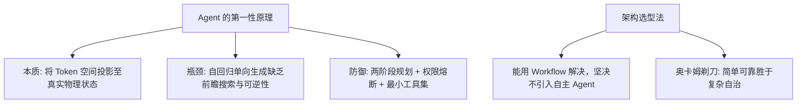

[← 上一章](10-knowledge.md) | [目录](../README.md) | [下一章 →](12-evaluation.md)

**English**: [English](../en/chapters/11-agents.md)

# 第十一章：智能体（Agent）的第一性原理

> "An agent is just a while loop with a tool call."
> （这道出了大半工业实践的底细，但也只揭开了一半的物理机制）

“智能体（Agent）”大概是如今大语言模型工程里最容易被随手套用的词。从早期的 AutoGPT 到五花八门的开发框架，从函数调用（Function Calling）机制到接管屏幕的桌面自动化（Computer Use），几乎所有方案都在往这个名字上靠。到处都在谈 Agent。

这一章要穿透浮在表面的术语泡沫，顺着第九章“Prompt 即程序”与第十章“先验知识注入”的第一性原理，**形式化推演** Agent 的计算本质、适用边界与生产环境下的架构准则。

核心论点：

1. Agent 的物理本质，是把语言模型的表征流形延展到真实世界的状态之中；
2. Agent 的结构性瓶颈，根植于自回归模型天生缺乏前瞻规划与全局回溯的能力；
3. 在绝大多数工业业务场景里，一个确定性的工作流（Workflow）远比完全自主的开放式 Agent 可靠得多；
4. 优秀的 Agent 架构遵循奥卡姆剃刀：用最精简的约束，换取确信度最高的状态转移。

---

## 11.1 什么是 Agent：表征空间的物理延展

### 最小形式化定义

剥掉外层复杂的工程封装，Agent 在计算本质上可以形式化为一个极简的等式：

> **Agent = 基础语言模型 (LLM) + 外部工具调用 (Tool Interface) + 动态环境反馈循环 (Environment Loop)**
> 
> 也就是说，模型在一个闭环系统里周而复始地跑着这套循环：状态感知（Observation） $\to$ 隐层推演（Thought） $\to$ 符号动作（Action） $\to$ 环境响应反馈（Observation）。

```python
def minimal_agent_loop(initial_goal: str, available_tools: list, max_iterations: int = 10) -> str:
    """Agent 架构的最小本质骨架"""
    interaction_trace = [initial_goal]
    
    for _ in range(max_iterations):
        # 1. 基于当前全量轨迹预测下一步决策
        step_response = llm.generate_decision(interaction_trace, tools=available_tools)
        
        # 2. 终止条件判定
        if step_response.is_terminal_state():
            return step_response.final_payload
            
        # 3. 拦截并执行物理工具调用
        observation_feedback = execute_tool_call(step_response.tool_call)
        
        # 4. 将环境物理响应回灌至上下文轨迹中
        interaction_trace.append(step_response)
        interaction_trace.append(observation_feedback)
        
    return "达到最大循环阈值，触发熔断降级"
```

市面上无论是 LangChain、CrewAI、AutoGen，还是接管桌面的 Computer Use，翻开底层的计算逻辑，全脱胎于上面这套闭环控制循环。框架之间真正的分别，无非是工具协议怎么定、状态机怎么路由，或是故障恢复策略做得有多精细。

### 第一性原理：工具调用对 Token 空间的物理拓扑扩张

回到第一章的核心结论：大语言模型自始至终只在离散的 Token 符号空间里做条件概率续写。

标准生成模型的 Token 空间严格受限于预训练语料的静态先验。引入工具调用之后，这片空间被彻底撑开了：



工具调用（Tool Use）的本质，从来不是赋予模型亲自操作工具的主体动作，而是把真实物理世界的动态状态，**投影**为模型能读懂也能生成的离散 Token。

- 数据库查询：SQL 查出的表格实体 $\to$ 投影为 JSON 格式的 Token 序列；
- 浏览器自动化：网页 DOM 树与视觉截屏 $\to$ 投影为结构化定位坐标与文本 Token；
- 代码解释器：Python 脚本运行的标准输出 $\to$ 投影为 stdout/stderr 的 Token 流。

模型自始至终没有迈出过自回归计算流半步。只是当外部环境的状态被动态注入上下文之后，它吐出的符号便拥有了撬动真实物理世界的杠杆。

---

## 11.2 ReAct 范式：推理与行动的因果交织

### 经典因果拓扑

Yao 等人（[Yao et al., 2022](https://arxiv.org/abs/2210.03629)）提出的 ReAct（Reasoning + Acting）架构，确立了智能体交互的标准因果拓扑：

```
Thought 1: 为解答用户关于系统 QPS 骤降的原因，首先需要查询集群过去 1 小时的监控指标。
Action 1: prometheus_query(metric="qps_rate", duration="1h")
Observation 1: 监控数据显示 14:20 分发生剧烈断崖式下跌，同时网关 502 错误率激增。
Thought 2: 502 错误率激增通常与上游微服务 OOM 崩溃相关，接下来需检索对应时间段的容器日志。
Action 2: fetch_k8s_logs(app="gateway", since="14:15", level="ERROR")
Observation 2: 捕获到多条 "java.lang.OutOfMemoryError: Java heap space"。
Thought 3: 故障根因已确立为网关堆内存耗尽，具备充分信息输出根因分析与恢复建议。
Action 3: finish_with_analysis(...)
```

ReAct 范式的核心洞察十分明确：在模型真正发出带有物理副作用的 Action 之前，先让它输出一段显式的 **Thought** 推理。多走这一步思考，工具调用的准确率与状态机的收敛速度都会大不一样。

这与第八章讲过的思维链（CoT）机理完全同构。中间那段 Thought 序列充当了计算图里的动态显存，让模型在生成具体的 API 签名与参数之前，先完成对前序观测结果的语义对齐与逻辑规划。

### 现代类型安全的工业实现

到了现代云原生架构中，原本靠纯文本驱动的 ReAct 已经全面演进为强类型协议：



底层的因果拓扑依然是经典的 ReAct 闭环。真正的变化在于，原本脆弱的自由文本被收拢进了形式化的强类型协议之中。

---

## 11.3 智能体的物理瓶颈：缺乏前瞻搜索与可逆性

### 自回归局部贪心策略的缺陷

自回归语言模型严格沿着单向时序生成，每一次做决策，本质上只是根据当前上下文里能看到的所有历史信息做**局部贪心采样**。

一旦场景切换到带有外部物理副作用的 Agent 任务中，这种只顾眼前的局部贪心策略，很快就会撞上严重的工程危机：

```mermaid
flowchart TD
    subgraph 人类前瞻推演["人类决策机制 (支持心智模拟与回溯)"]
        H1["确立目标"] --> H2["构建前瞻推演模型"]
        H2 --> H3["在推演中发现分支 B 存在不可逆风险"]
        H3 --> H4["主动放弃分支 B，切换至稳健路径 C"]
        H4 --> H5["开始实施物理操作"]
    end
    
    subgraph 贪心智能体["纯自回归 Agent (缺乏全局回溯)"]
        A1["接收目标"] --> A2["局部最优: 触发动作 A1"]
        A2 --> A3["物理生效 (已产生外部副作用)"]
        A3 --> A4["局部最优: 触发动作 A2 (误操作)"]
        A4 --> A5["遭遇系统崩溃 / 数据破坏"]
        A5 --> A6["因缺乏回滚机制导致状态不可逆"]
    end
    
    style 人类前瞻推演 fill:#c8e6c9
    style 贪心智能体 fill:#ffcdd2
```



### 三大典型工程失效模式

1. **组合爆炸与低效震荡**：处理多文件批量修改时，模型很容易在单个文件上反复调用 `read_file` 与 `write_file`，在冗余的状态轮询里不断打转；而在传统工程里，其实一行 Shell 脚本就能干脆解决；
2. **死循环与状态停滞**：一旦工具返回非预期的报错，模型受制于上下文里的注意力锚定，往往会在完全相同的错误参数空间里一遍遍盲目重试；
3. **不可逆的副作用灾难**：遇到删除数据（`DROP TABLE` 或 `rm -rf`）或是调用外部通信（发送邮件、触发支付接口）等操作，局部的单步误判就会直接酿成无法挽回的物理破坏。

这几类失效绝不是靠优化提示词就能抹平的小毛病，它们的根子，深植于自回归单向生成的**结构性局限**之中。

---

## 11.4 工业级 Agent 的工程防御机制

模型在前向生成中一旦出错，动作往往不可逆。要把系统稳妥地放进生产环境，必须构筑四道确定性的工程护栏：

### 护栏一：两阶段规划与执行解耦（Plan-and-Solve）

把“推演构想”与“物理执行”硬性切开，分成两轮明晰的交互：

```markdown
【前置规划阶段 Prompt】
目标任务：{task}
在发起任何物理工具调用前，请首先输出一份完整的形式化执行计划：
1. 步骤拓扑与依赖关系；
2. 每一步的预期成功判据（Exit Code / Assertion）；
3. 若遭遇权限缺失或格式异常时的降级预案。
计划提交后，需等待调度器仲裁确认方可进入执行阶段。
```

模型生成计划文本时，走的依然是自回归计算，可落下的字符只是一份可供修改的符号中间态。它只停留在草稿里，并未向外界环境发出带有副作用的写操作。

### 护栏二：人在环路与关键权限熔断（Human-in-the-loop）

```python
# 声明不可逆或破坏性操作的高风险集合
HIGH_RISK_ACTIONS = {
    "db_drop_table", "db_truncate", "fs_delete_recursive",
    "k8s_delete_pod", "payment_execute_transfer"
}

def dispatch_tool_with_gatekeeper(tool_call_request) -> str:
    action_name = tool_call_request.function.name
    arguments = tool_call_request.function.arguments
    
    if action_name in HIGH_RISK_ACTIONS:
        # 触发安全审计中断，上报人工网关
        approval_token = request_human_supervisor_approval(action_name, arguments)
        if not approval_token.is_authorized():
            return f"安全熔断：管理员拒绝执行高风险操作 [{action_name}]"
            
    return execute_sandboxed_api(action_name, arguments)
```

生产系统普遍会布下一道精细的鉴权拦截器，把守最要紧的关卡，为关键决策保留绝对的人工熔断开关。

### 护栏三：基于意图路由的工具空间动态收敛

一口气把几十个甚至上百个 API 描述全塞进上下文，是工程上的大忌。候选工具一旦堆积成山，模型在参数空间里的注意力就会被迅速扯散。

规范的做法是在第一阶段辨明意图，按需**动态加载最小特权工具子集**：



这项设计从架构上把高熵的开放式探索收拢为受限的状态机路由，系统的可预测性也就稳稳落了地。

### 护栏四：外部控制总线强制终止条件

绝不能把停机判定全交由模型自行裁决，必须在外部控制总线上施加硬性约束：
- 严格卡死单次会话的工具调用总步数（例如 $N \le 8$）；
- 用滑动窗口哈希算法盯住调用轨迹，检测最近 3 次工具调用是否陷入参数重复或死循环；
- 划定全局端到端超时时间与 Token 预算的消耗上限。

---

## 11.5 反思机制（Reflexion）的真实效能与误区

Shinn 等人（[Shinn et al., 2023](https://arxiv.org/abs/2303.11366)）提出的 Reflexion 范式，是在出错之后插入一道反思环节，把试错换来的经验写成文本记忆，一直保留到下一轮重试中：



这种模式之所以能走通，再次印证了第七章讲过的计算非对称性：校验状态与审查逻辑所需的计算，远比凭空做零样本生成要低廉得多。

**工程警示**：若让同一个模型在同一个对话上下文里兼任执行者与裁判，自我审查极容易陷入认知惯性，滑向防御性的合理化辩解。

生产级的反思系统必须立住两条规矩：
1. **角色物理隔离**：审查模型与生成模型彼此分立，或者直接由确定性测试断言（Unit Test / Linter / AST）充当客观裁判；
2. **上下文脱敏重构**：送交审查模型的应当是执行 Trace 与最终的差异对比，而非模型自己写就的那套看似自圆其说的长篇辩解。

---

## 11.6 多智能体系统（Multi-Agent System）的收益与工程代价

### 理论构想与现实摩擦

从直觉出发，工程师往往会抱有这样一种假设：既然单体智能体吃不下长链路的全功能任务，那就拉起一支分工明确的队伍，让架构师 Agent、编码 Agent 与测试 Agent 彼此配合、分头协作。

可真要落到生产线上，多智能体网络带来的往往是异常沉重的系统摩擦：



1. **序列化与上下文丢失**：多个智能体之间互发自然语言消息，前文定下的关键约束几经转递，极易发生信息衰减与语义漂移；
2. **错误级联放大**：单个智能体的一点推演幻觉，放到网状结构里会被层层传导、级联放大，最终扩散成不可收拾的群体幻觉；
3. **可观测性与排障黑洞**：单体系统的执行 Trace 顺着一条线就能查到底，可要是丢进多智能体协作网络，谁引发了故障、链路卡在哪一环，立刻就会变成难以厘清的黑洞；
4. **算力与时延成本指数膨胀**：多轮分布式会话一旦跑起来，Token 账单会成倍往上翻，拉出来的超长时延更是会直接击穿交互预期。

> **工程选型准则**：只要单体 Agent 配上确定性工具还能应付局面，就坚决不要引入自治的多智能体网络架构。

---

## 11.7 工作流（Workflow）与智能体（Agent）的本质分野

Anthropic 在《Building Effective Agents》中给出了一条极具穿透力的架构判定法则：

- **确定性工作流（Workflow）**：控制流完全由工程师用代码明明白白地编排妥当（包含条件分支、并行循环与状态持久化），LLM 只是嵌在预设节点里，负责局部的高维语义理解与转换；
- **自主智能体（Agent）**：控制流的大权彻底交给了 LLM，由模型在一步步前向计算中自行决定调用什么工具、要不要继续往下推、究竟何时停下来。



| 评估维度 | 确定性工作流 (Workflow) | 自主智能体 (Agent) |
|---|---|---|
| **控制流主导权** | 工程师硬编码 (Code-driven) | 语言模型概率驱动 (Model-driven) |
| **系统可预测性** | 极高（符合传统软件确定性预期） | 较低（存在长尾随机漂移风险） |
| **可观测与调试** | 极易（清晰的断点与日志打点） | 困难（依赖非结构化自然语言追踪） |
| **工程吞吐与时延** | 高吞吐、低延迟 | 延迟长、Token 消耗大 |
| **推荐适用场景** | 流程结构已知、边界严密的业务（90%） | 路径高度不确定、需探索式求解（10%） |

放到绝大多数工程实践中，确定性工作流都握有压倒性的性能与成本优势。

---

## 11.8 生产级 Agent 系统架构设计模式



### 模式一：智能语义路由（Semantic Router）
这是架构最精简的分流模式。系统只依据用户的输入动态判断意图，把请求径直导向专用的工作流引擎。

### 模式二：受控单循环 ReAct（Tool-Augmented ReAct）
这是应用最广的受控模式。单个语言模型居中充当推理中枢，驱动一组特定的工具，在动态循环里一轮轮迭代推进。

### 模式三：两阶段规划与执行（Plan-and-Execute）
这种模式专为依赖拓扑清晰的长链路任务而设计。第一阶段先由高阶模型生成全局有向无环图（DAG），定下执行步骤；第二阶段再交由执行器严格按序逐项跑通。

### 模式四：分层主从编排（Orchestrator-Workers）
面对能够高度并行的大规模批处理，分层主从结构最为适用。主控 Agent 专职负责拆解目标与聚合结果，多个工作 Agent 则各司其职，并行跑完彼此独立的子任务。

---

## 11.9 生产级 Agent 上线工程核对清单

```markdown
### 1. 工具接口契约
- [ ] 所有工具输入皆严格绑定 JSON Schema / Pydantic，禁止自然语言模糊传参；
- [ ] 工具异常时返回包含修复建议的高信噪比错误信息，避免单一的通用失败码；
- [ ] 破坏性与不可逆操作具备独立的人工授权拦截网关。

### 2. 状态机与控制流
- [ ] 设有不可突破的最大循环步数（Max Iterations）硬性上限；
- [ ] 部署动作序列重复性检测算法，防止状态停滞与无限死循环；
- [ ] 设有全局调用时延（Timeout）与 Token 预算熔断拦截器。

### 3. 可观测性与追踪
- [ ] 完整记录每一次生成过程中的 Thought、Tool Call 与 Observation 原始张量及日志；
- [ ] 接入 OpenTelemetry / Langfuse 等分布式 Trace 链路追踪平台；
- [ ] 建立失败归因分类监控（模型语义解析失败 vs 工具超时 vs 下游权限不足）。

### 4. 系统安全性防御
- [ ] 建立针对间接提示注入（Indirect Prompt Injection）的输入脱敏层；
- [ ] 工具调用实行基于角色的最小权限访问控制（RBAC）；
- [ ] 设立全局一键物理熔断开关（Kill Switch）。
```

---

## 11.10 奥卡姆剃刀：以极简设计对抗系统熵增

复杂的智能体系统之所以走向崩溃，往往是系统自身的熵增在作祟：
- 注册的工具塞得太多，导致模型在庞大的参数空间里分散了注意力；
- 状态转移的链条拖得过长，每一步的概率误差都会呈指数级向上累积；
- 角色定义划分得过细过碎，彼此通信的信噪比便一路恶化。

大语言模型系统架构的**第一设计法则**：永远优先使用确定性工作流。一旦非引入 Agent 不可，也必须把工具集收拢到极简，并确保状态机始终受控、随时可逆。

---

## 本章小结



核心要点：

1. **Tool Use 是状态空间的投影**：工具让语言模型真正能够读写外部真实世界的环境状态。
2. **警惕自回归的前向盲目性**：单向自回归模型缺乏全局回溯能力，外部系统必须替它建起严密的状态保护与回滚机制。
3. **重视 ReAct 结构化演进**：把松散的自然语言思考转化为强类型的规范接口调用，才能抹平自由文本带来的不确定性。
4. **工作流优先于开放智能体**：绝大多数业务都该选用确定性的工作流（Workflow），而不是把控制权交给充满随机性的多 Agent 系统。
5. **构筑完备的工程安全网关**：熔断控制、状态去重与鉴权拦截，是任何智能体系统开赴生产前不可或缺的工程底线。

下一章，我们将切入系统工程最核心的基石环节，全面摸清大语言模型及其智能体系统的量化评测体系（Evaluation）。

---

## 延伸阅读

- [ReAct: Synergizing Reasoning and Acting in Language Models](https://arxiv.org/abs/2210.03629), Yao et al., 2022
- [Reflexion: Language Agents with Verbal Reinforcement Learning](https://arxiv.org/abs/2303.11366), Shinn et al., 2023
- [Toolformer: Language Models Can Teach Themselves to Use Tools](https://arxiv.org/abs/2302.04761), Schick et al., 2023
- [Building Effective Agents](https://www.anthropic.com/research/building-effective-agents), Anthropic Research, 2024
- [Voyager: An Open-Ended Embodied Agent with Large Language Models](https://arxiv.org/abs/2305.16291), Wang et al., 2023
- [AgentBench: Evaluating LLMs as Agents](https://arxiv.org/abs/2308.03688), Liu et al., 2023

[← 上一章](10-knowledge.md) | [目录](../README.md) | [下一章 →](12-evaluation.md)
