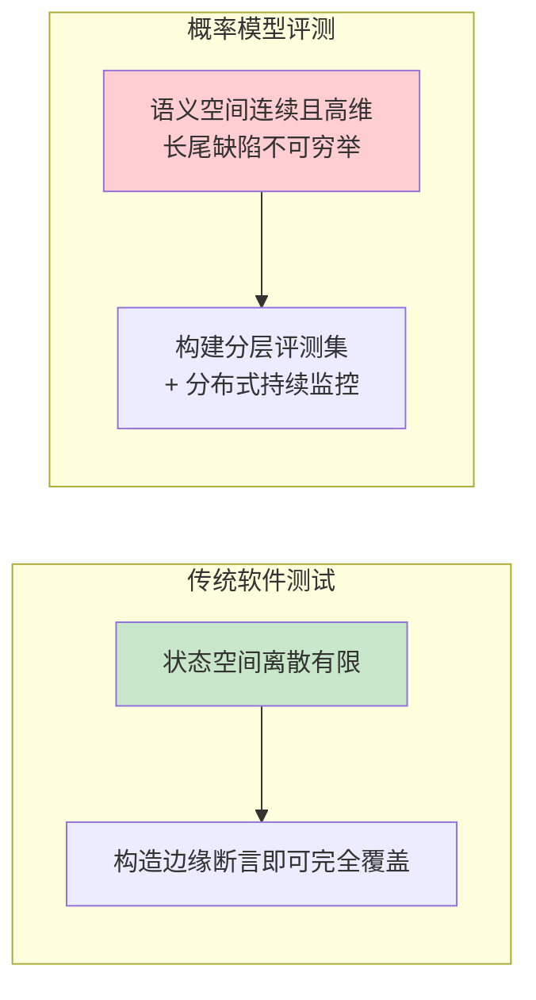
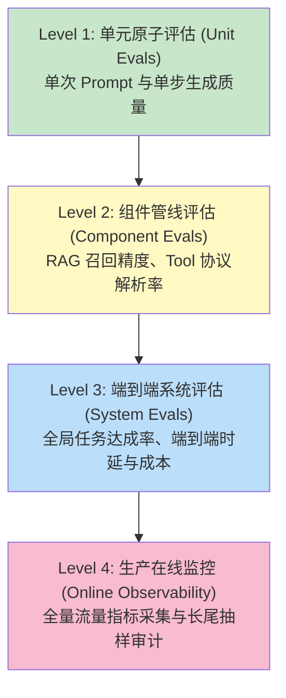
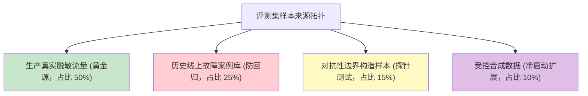
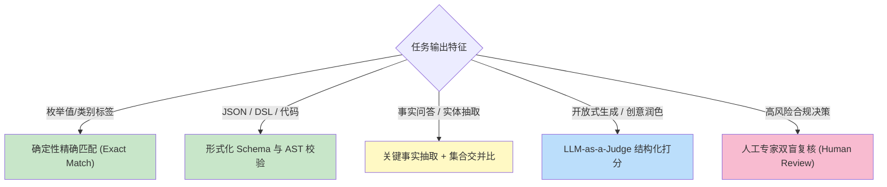
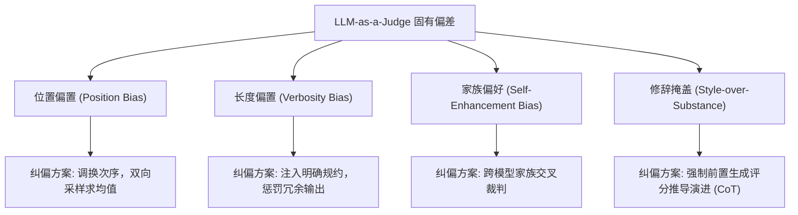
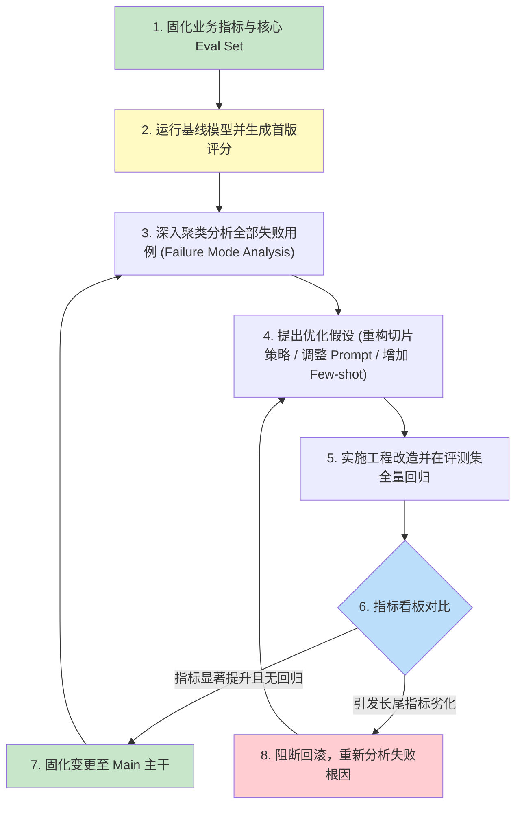
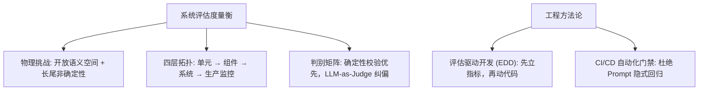

[← 上一章](11-agents.md) | [目录](../README.md) | [下一章 →](13-interpretability.md)

**English**: [English](../en/chapters/12-evaluation.md)

# 第十二章：系统评估的度量衡

> "If you can't measure it, you can't improve it. If you don't measure it, you'll definitely break it."

在前几章中，我们系统剖析了模型的表征机制、能力边界、提示词编程、知识注入与智能体拓扑。然而在工业级系统研发中，存在一个常被忽视却决定成败的根本命题：

**如何以科学、客观、可量化的工程手段证明系统的有效性与稳定性？**

工程师凭借主观直觉（Vibe Check）调整 Prompt 后便仓促上线，数日后生产环境暴露大量非预期长尾缺陷，由于缺乏量化基准，整个系统陷入无法定位回溯的失控状态。

大语言模型的非确定性采样、高维开放输出空间以及长尾失效特征，使得评估的复杂度远超传统确定性软件。

本章核心论点：

1. **缺乏完备评测（Eval）的系统仅是一个脆弱的演示原型（Demo）**：无法支持严谨的工程迭代；
2. **通用基准评测（Public Benchmarks）无法替代垂直业务度量**：必须构建与真实业务分布严格对齐的评估套件；
3. **大模型充当裁判（LLM-as-a-Judge）具备扩展性优势但也内生结构性偏差**：必须配套校准与监督机制；
4. **践行评估驱动开发（Eval-Driven Development）**：在调整系统参数或 Prompt 之前，必须先确立量化度量衡。

---

## 12.1 概率生成系统评估的本质挑战

### 确定性软件与高维生成系统的范式鸿沟

```
传统确定性软件工程:
  状态输入 X → 确定性算法 f(X) → 规范化输出 Y
  正确性判定: Y == Expected_Y (布尔逻辑断言)
  回归测试: 单元测试用例完全覆盖

大语言模型概率系统:
  高维输入 X → 条件概率采样 P(Y|X; W) → 开放连续文本 Y
  正确性判定: 语义等价性、格式合规度、事实忠实度的多维概率度量
  回归测试: 统计分布层面的置信度评估与长尾风险测绘
```

### 评估复杂度的三大物理根源

1. **开放输出空间的语义多义性**：同一业务意图在自然语言中存在无限种合法的表述形式，无法通过简单的字符串精确匹配（Exact Match）进行判定；
2. **采样温度引发的非确定性扩散**：在非零采样温度下，相同输入在不同请求批次中将沿着不同的概率分支演进；
3. **长尾缺陷的高隐蔽性**：模型可能在 95% 的常见分布上表现卓越，但在剩余 5% 的极端边界上发生严重幻觉。



### 工业界三大伪评估反模式

- **反模式一：主观直觉巡检（Vibe Check）**：仅凭人工随机构造 3 至 5 个样例肉眼观察，极易被表面流畅度误导；
- **反模式二：教条套用公开基准（Public Benchmark Gaming）**：过分迷信 MMLU、GSM8K 等学术跑分，脱离了具体业务场景的特定语义分布；
- **反模式三：完全依赖生产用户反馈（Post-hoc Monitoring Only）**：用户行为信号存在严重的滞后性与高噪声，且大量受挫用户往往选择无声流失而非主动反馈。

---

## 12.2 系统工程评测的四层拓扑

工业级评估体系应当具备清晰的垂直分层架构：



| 评测层次 | 核心度量目标 | 触发频次 | 自动化水平 |
|---|---|---|:---:|
| **L1 单元评估** | 提示词语法合规性、单步抽取准确度 | 每次代码/Prompt 提交 (Git Hook) | 100% 自动 |
| **L2 组件评估** | 向量检索 Recall@K、重排 MRR、Tool 传参合规率 | 每次基础设施/数据索引更新 | 100% 自动 |
| **L3 系统评估** | 多轮对话目标达成率、端到端业务转化率 | 生产发布前门禁流水线 (CI/CD) | 混合自动化 |
| **L4 在线监控** | 用户显式赞踩、P99 时延分布、Token 消耗率 | 全天候持续采集 (Real-time Stream) | 自动采集 + 抽样复核 |

---

## 12.3 评测数据集（Eval Set）的工程构建

评测数据集是整个评估系统的物理基准。评测集构建的严密程度直接决定了量化指标的置信度。



### 样本来源分级体系

1. **生产真实流量脱敏清洗（最高置信度）**：从真实生产日志中抽样，剔除 PII 隐私数据后固化为基准用例；
2. **线上故障用例库（回归防御）**：凡生产环境发生用户投诉或系统崩溃，必须立即提取输入并纳入防御测试集；
3. **专家级对抗构造（边界应力测试）**：由领域专家设计包含矛盾前提、诱导性误导、间接注入攻击的鲁棒性样本；
4. **受控合成样本（冷启动支持）**：在系统初期由强基座模型生成多样化样本，但需在后续迭代中逐步被真实数据置换。

---

## 12.4 判别器（Judge）的技术选型矩阵

如何定义输出的合法性与质量？应根据任务类型选用适配的判定机制：



### 六类判别机制技术对比

1. **精确匹配（Exact Match）**：针对输出空间有限的分类任务，计算成本为零，结果具备绝对确定性；
2. **形式化结构校验（Schema / AST Validation）**：此项是工程中最被低估的高效校验手段：计算开销极低，却能精准拦截绝大多数结构崩溃；
3. **事实元提取比对（Fact Extraction & Match）**：将模型输出拆解为原子事实三元组，与标准答案集合计算 Jaccard 相似度；
4. **模型裁判（LLM-as-a-Judge）**：引入高阶模型依据结构化评分准则（Rubric）输出量化分数与推导演进依据；
5. **成对胜率比较（Pairwise Elo Tournament）**：对候选输出进行盲测对抗比对，规避单点绝对打分的绝对标度漂移；
6. **专家人工双盲审计（Human-in-the-loop）**：作为黄金基准，用于标定前序自动判别器的统计信度。

---

## 12.5 LLM-as-a-Judge 的偏差机理与纠偏工程

大模型作为自动化裁判有效解决了评估规模化扩展的瓶颈，但在使用时必须在算法层面纠正其固有的系统性认知偏差：



### 生产级裁判调用标准范式

```python
def robust_llm_judge(
    query: str, 
    candidate_response: str, 
    reference_ground_truth: str,
    evaluator_client
) -> dict:
    """
    具备偏差纠正与结构化推演的生产级裁判实现
    """
    evaluation_rubric = """
    请作为严格的学术评审员评估候选回答。
    
    【核心评估维度】
    1. 事实忠实度 (0-2分): 是否完全基于参考事实，严禁虚构细节；
    2. 逻辑完备性 (0-2分): 是否严密覆盖了问题的核心诉求；
    3. 表述精炼度 (0-1分): 是否剔除了无意义的客套与冗余。
    
    【评分规则】
    - 禁止因回答字数较多而给予额外加分；
    - 必须首先输出详尽的扣分项推导理由 (Evaluation Trace)，最后输出 JSON 格式得分。
    """
    
    judge_prompt = f"""{evaluation_rubric}
    
    【用户问题】: {query}
    【标准参考】: {reference_ground_truth}
    【待评回答】: {candidate_response}
    
    请输出评测推导及最终结构化得分：
    """
    
    # 强制启用结构化解析
    return evaluator_client.generate_structured_score(judge_prompt)
```

---

## 12.6 业务维度的关键指标体系设计

### 1. RAG 知识检索系统黄金指标

- **Context Relevance（上下文相关度）**：检索切片与用户意图的信噪比；
- **Groundedness / Faithfulness（事实忠实度）**：生成回答对检索切片的依赖程度（防止模型擅自外推）；
- **Answer Relevance（答案切题率）**：生成内容对原始问题的响应完整性。

### 2. 智能体（Agent）系统效能指标

- **Task Success Rate（任务成功率）**：状态机是否收敛至最终目标；
- **Trajectory Efficiency（轨迹效率）**：达成目标所需的平均工具调用步数；
- **Tool Selection Precision（工具选择精确率）**：是否调用了非必要或错误的 API。

### 3. 安全合规双向指标

- **Refusal Precision（应拒绝请求的拦截率）**：针对对抗越狱与有害输入的防御率；
- **False Refusal Rate（安全误杀率）**：正常业务请求被模型误判为敏感内容的比例（防止系统过度防御导致可用性劣化）。

---

## 12.7 评估驱动开发（Eval-Driven Development）



该范式通过客观数据闭环，从根本上消除了主观试错引发的逻辑退化与系统返工。

---

## 12.8 CI/CD 持续集成门禁与防回归工程

Prompt 与模型配置的变更必须如同核心底层库一样，接入自动化持续集成流水线：

```yaml
# .github/workflows/llm-regression-eval.yml
name: LLM Core Regression Gate
on:
  pull_request:
    paths:
      - 'infra/prompts/**'
      - 'src/rag_pipeline/**'

jobs:
  run-eval-suite:
    runs-on: ubuntu-latest
    steps:
      - uses: actions/checkout@v4
      - name: Set up Python
        uses: actions/setup-python@v5
        with:
          python-version: '3.11'
          
      - name: Execute Automated Regression Suite
        run: |
          python -m eval_runner \
            --baseline-branch origin/main \
            --candidate-branch HEAD \
            --dataset-path ./eval_suites/gold_standard.jsonl \
            --report-out ./eval_report.json
            
      - name: Enforce Strict Quality Gate
        run: |
          python -c '
          import json, sys
          data = json.load(open("./eval_report.json"))
          if data["accuracy_delta"] < 0.0 or data["faithfulness_score"] < 0.92:
              print("❌ 质量门禁未通过: 发现核心指标回归退化")
              sys.exit(1)
          print("✅ 质量门禁通过，准予合并")
          '
```

---

## 本章小结



核心要点：

1. **没有 Eval 的系统无法实施工程重构**：量化度量衡是摆脱随机试错的唯一路径；
2. **分层度量组件与全局**：RAG 测三元指标，Agent 测轨迹收敛效率；
3. **纠正 LLM-as-a-Judge 结构偏差**：通过双向交换、长度抑制与显式推导保障裁判公允；
4. **将 Eval 固化为 CI 质量门禁**：每一次 Prompt 演进都必须经历确定性的回归校验；
5. **警惕未知分布外的极端风险**：持续结合线上监控与红队渗透，动态维护评测集的生命力。

在下一章中，我们将进一步深入深度神经网络的内部微观世界：探索机制可解释性（Mechanistic Interpretability）如何穿透黑箱，观测模型内部的表征流动与神经元激活回路。

---

## 延伸阅读

- [Judging LLM-as-a-Judge with MT-Bench and Chatbot Arena](https://arxiv.org/abs/2306.05685), Zheng et al., 2023
- [RAGAS: Automated Evaluation of Retrieval Augmented Generation](https://arxiv.org/abs/2309.15217), Es et al., 2023
- [G-Eval: NLG Evaluation using GPT-4 with Better Human Alignment](https://arxiv.org/abs/2303.16634), Liu et al., 2023
- [Holistic Evaluation of Language Models (HELM)](https://arxiv.org/abs/2211.09110), Liang et al., 2022
- [Measuring Massive Multitask Language Understanding (MMLU)](https://arxiv.org/abs/2009.03300), Hendrycks et al., 2021

[← 上一章](11-agents.md) | [目录](../README.md) | [下一章 →](13-interpretability.md)

