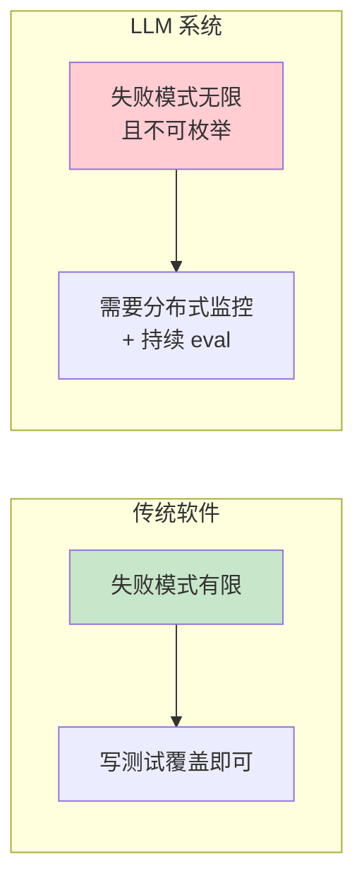
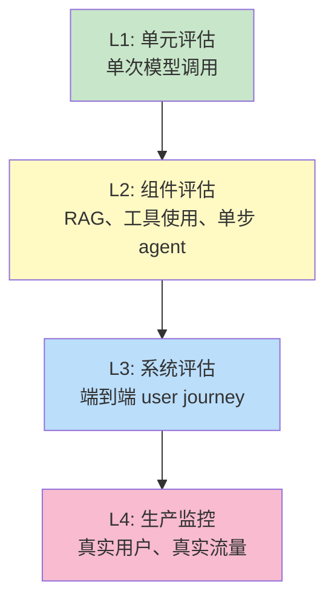
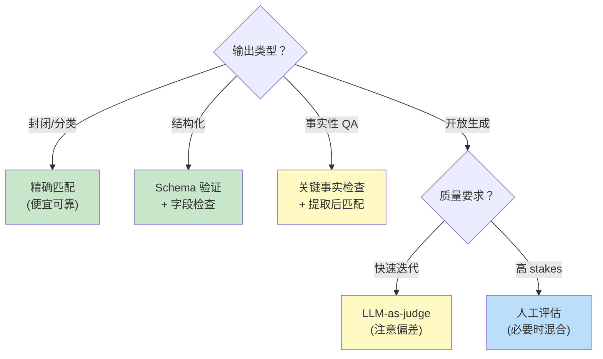
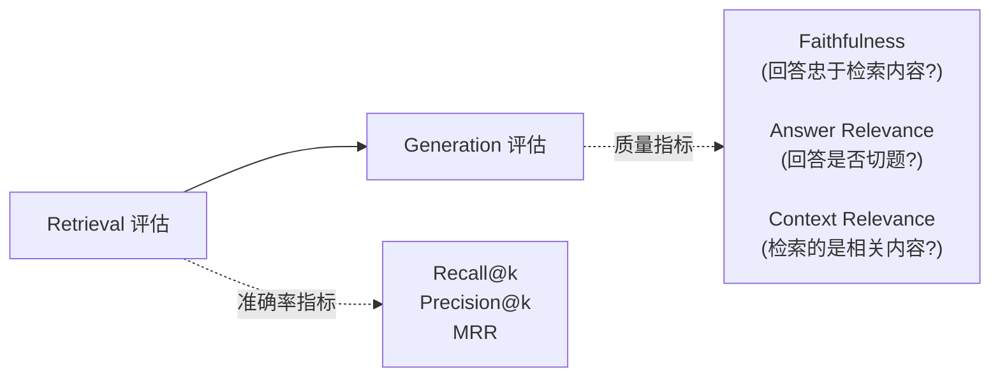
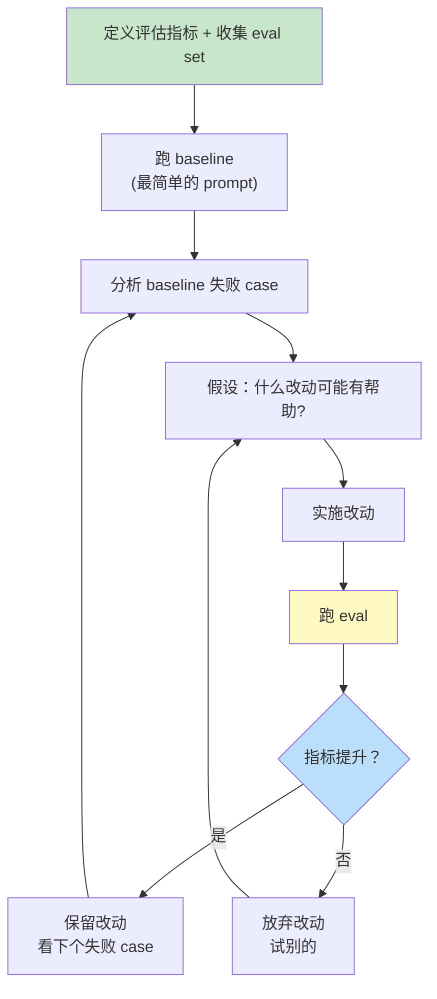

[← 上一章](11-agents.md) | [目录](../README.md) | [下一章 →](13-interpretability.md)

**English**: [English](../en/chapters/12-evaluation.md)

# 第十二章：评估，最被低估的环节

> "If you can't measure it, you can't improve it. If you don't measure it, you'll definitely break it."

写到这里，前面的章节已经把模型怎么“想”、能力的边界、prompt、知识注入与 agent 挨个翻了一遍。手里拿到的，全都是用来搭建系统的工具。可有一个最根本的问题，我们一直绕着没提：

你怎么知道自己做出来的东西到底行不行？

这大概是大语言模型工程里最容易被随手跳过的环节。常见的场景往往是：工程师调好了一版 prompt，凭着“vibe check”觉得挺不错，直接发布上线。可三天之后，用户那头接连报告各种差错，工程师却连问题是哪一次改动引出来的都查不清楚，全因为手头压根没有一条能做比对的基线。

大模型系统的输出空间完全开放，本身带着不确定性，加上防不胜防的长尾失效，使得这套评估做起来比传统软件难得多。可也正因为难，真正花心思把这件事做扎实的人，便能在同行之间建立起实打实的优势。

本章核心论点：

1. **没有 eval 的大模型系统只是 demo**：拿来演示看着光鲜，回过头去却根本无法迭代。
2. **单凭感觉与通用榜单都靠不住**：你真正需要的是面向具体任务的专门 eval。
3. **LLM-as-judge 是一把双刃剑**：它能把评测规模迅速推上去，但也自带结构性偏差。
4. **让评估反过来驱动开发**：先立好 eval 标尺，再去调整系统。

读完这一章，你手里会留下一套扎实可用的评估打法：从挑选合手的指标开始，到亲手搭建 eval set，再到把评测流程接入 CI 持续防止能力退化。

---

## 12.1 为什么 LLM 评估这么难

### 传统软件 vs LLM 系统

```
传统软件:
  输入 → 函数 → 输出
  正确性 = 输出是否符合规约
  评估 = 单元测试

LLM 系统:
  输入 → LLM → 输出
  正确性 = ???
  评估 = ???
```

大模型评估的难处，集中在三点：

**1. 输出是开放空间**

写普通函数时，输入 1+1，输出就必须严丝合缝地等于 2。可换到大模型这里，输入一句“总结这篇文章”，吐出来的合格摘要能有千百种写法。

你没法直接拿 `assertEqual(output, expected)` 往上硬套，因为世界上根本不存在唯一的 expected。

**2. 非确定性**

只要 Temperature > 0，同一个输入给过去，每次吐出的文字都会有些许不同。就算把 temperature 设成 0，底层的模型版本迭代、batch 批次切分，乃至硬件底层的浮点运算差异，随时都能让输出发生漂移。

**3. 长尾失败**

大模型在 95% 的日常场景里表现得挑不出毛病，剩下的 5% 却会以匪夷所思的方式败下阵来。平时靠随手抽查，很难撞见这 5% 的 corner case，可一旦扔进生产环境，真实用户的各色输入总能把它精准触发。



### 三个 anti-pattern

在实际项目里，我见过最典型的几类“假评估”：

**Anti-pattern 1：Vibe check**

```
"我试了几个例子，看着挺好的，发布。"
```

问题：随手试的那几个例子，十有八九属于最常见的简单输入，模型本来就不容易出错。至于那些真正致命的边界 case，凭空靠人脑很难全想周全。

**Anti-pattern 2：依赖通用 benchmark**

```
"我们的模型在 MMLU 上得 85 分。"
```

问题：MMLU、GPQA、HumanEval 这类公开评测集，丈量的只是模型通用的基础底子，根本代表不了模型落到你业务场景里的具体成色。一个在 MMLU 上拿下高分的模型，进到客服系统里完全可能当场露怯，比如满篇都是掉书袋的学究长文，根本答不到点子上。

**Anti-pattern 3：“最终用户会告诉我们”**

```
"上线后看用户反馈来迭代。"
```

问题：真实用户的反馈向来混着巨大的噪声，而且周期极长。等你终于攒够了能看清趋势的数据样本，前面的用户可能早就流失大半。更要命的是，用户不会特意把没说出口的不满逐条写给你，他们只会关掉页面，默默换去别家。

---

## 12.2 评估的层次

别把所有的评估一股脑混作一谈。评测天然分着不同的层级，每一层各自盯着完全不同的目标。



| 层次 | 评估对象 | 频率 | 自动化程度 |
|------|---------|------|-----------|
| L1 单元评估 | 单个 prompt / 单次调用 | 每次改 prompt | 完全自动 |
| L2 组件评估 | RAG 检索准确率、工具调用成功率 | 每次改组件 | 完全自动 |
| L3 系统评估 | 端到端任务完成率 | 每次发布 | 部分自动 + 人工 |
| L4 生产监控 | 真实流量上的指标 | 持续 | 自动 + 抽样人工 |

不少团队手头只做了 L1 单元评测，有的甚至连 L1 都没有，就直接把代码推上 L4 生产环境。夹在当中的 L2 和 L3 彻底悬空，这就带来一个尴尬的死结：工程师随手改了一处 prompt，谁也说不清整个系统究竟是变好了还是变糟了。

---

## 12.3 构建 Eval Set：最重要的一步

### Eval set 是什么

所谓的 eval set，本质上就是挑出一组足够具有代表性的输入样本，配上对应的判断准则。在模型评测的世界里，这就是你手里握着的 “ground truth”。

```python
eval_set = [
    {
        "input": "总结这篇关于气候变化的文章: ...",
        "judge": {
            "type": "llm_judge",
            "criteria": ["涵盖主要论点", "不超过 100 字", "中立语气"],
        }
    },
    {
        "input": "我的订单 #12345 在哪？",
        "judge": {
            "type": "exact_match",
            "expected": "订单 #12345 已发货，预计明天到达。",
        }
    },
    ...
]
```

磨出一套质量过硬的 eval set，往往比敲出业务代码还要耗费心力。可这件事一旦做扎实，后面所有的优化与迭代才算真正有了根基。

### 怎么收集 eval set 的输入

收集输入的渠道大致有这么几处，按数据成色的优劣从高往低排：

**1. 真实用户输入（最高质量）**

最顶级的输入永远流淌在真实的生产流量里。只有真实流量才能映射出不带修饰的用户分布，也只有它们才会把各式各样意想不到的边界 case 毫无保留地带到你面前。

```python
# 从生产日志采样
sampled = random.sample(production_logs, 200)
# 人工筛选/标注，去掉 PII
eval_inputs = clean_and_label(sampled)
```

如果系统还没正式推上线，不妨先在公司内部跑一个 internal alpha：拉来身边的同事充当真实用户，借此把最鲜活的第一批输入先攒在手里。

**2. 真实失败案例（高价值）**

只要生产环境里出现差错，就把绊倒系统的那个输入顺手塞进 eval set。日后无论系统怎么改动，自动化评测都会先跑一遍这个用例，牢牢守住防线，防止历史问题再次回归。

```python
# 用户报告 bug 后的标准流程
def add_failure_to_eval(input, expected_behavior):
    eval_set.append({
        "input": input,
        "judge": {"criteria": expected_behavior},
        "added_reason": "regression: bug from 2026-04-15",
    })
```

**3. 对抗性构造（覆盖边界）**

针对模型的软肋，专门构造一批容易让它出差错的输入：

- 语义模糊或者存有多义的问题
- 前后包含矛盾信息的问题
- 超长 context
- 语料中极其少见的罕见话题
- 混杂不同语言、口语表达或地方方言的输入
- 带有攻击意图的 prompt injection 尝试
- 试图绕开安全围栏的越狱尝试

**4. 合成数据（数量虽多但需小心质量）**

直接调用大模型批量生成评测输入，成本低、出题快。但这里藏着一个绕不开的隐患：合成数据折射出的往往只是生成端模型的内在偏置，根本代替不了千人千面的真实用户。

```python
prompt = f"""为一个客服 chatbot 生成 50 个不同类型的用户问题。
要求：
- 涵盖咨询、投诉、退款、技术问题
- 包括礼貌的和愤怒的
- 包括清晰的和模糊的
- 包括标准书面语和口语
"""
```

拿合成数据来做**起步**搭个架子没问题，可一旦系统跑起来，就该尽快用真实世界的数据把它替换下来。

### Eval set 的规模

到底要攒多少条数据才算够用？工程上的经验总结：

| 阶段 | 推荐规模 | 用途 |
|------|---------|------|
| 早期开发 | 20-50 | 快速迭代，找方向 |
| 上线前 | 200-500 | 系统性测试 |
| 生产稳定后 | 1000+ | 防回归 + 长尾覆盖 |

需要牢记的一点：**质量 > 数量**。100 个经过精心挑选、覆盖了各类复杂 case 的精选样本，远比 10000 个千篇一律的同质化随机样本管用得多。

---

## 12.4 怎么“判断”输出好不好

拿到输入数据之后，真正的麻烦才刚开始：你得定义什么才算“对的输出”。大模型评估的难处，大半都卡在这里。

按从简单到复杂的顺序，常见的评判方式大致有这么几种：

### Judge 方式 1：精确匹配（exact match）

```python
def exact_match(output, expected):
    return output.strip() == expected.strip()
```

**适合**：输出范围窄而且确定的场景，比如文本分类或者固定字段提取，可能出现的正确答案本来就只有那么几种。

**不适合**：开放式生成。哪怕模型表达的意思完全正确，只要换了几个词、变了句式，字符串对不上就会被判成错误。

### Judge 方式 2：数值/格式校验

```python
def is_valid_json(output):
    try:
        json.loads(output)
        return True
    except:
        return False

def matches_schema(output, schema):
    try:
        jsonschema.validate(json.loads(output), schema)
        return True
    except:
        return False
```

**适合**：结构化输出。这大概是工程实践里最容易被低估的评估手段：写起来简单，跑起来几乎零成本，却能干净利落地拦下大批低级的格式错误。

### Judge 方式 3：包含关键事实

```python
def contains_required_facts(output, required):
    """检查输出是否提到所有必需的事实"""
    return all(fact.lower() in output.lower() for fact in required)

# 例子
eval_item = {
    "input": "Roger 有 5 个网球，又买了 2 罐每罐 3 个。共多少个？",
    "judge": {
        "type": "contains",
        "required": ["11", "网球"],
    }
}
```

**适合**：问答与推理任务，核心是检验模型的回答里有没有给出那几个必不可少的事实点。

**陷阱**：很容易产生误判。比如回答写着“答案不是 11 而是 12”，字面里同样包含了“11”，规则却会把它当成正确答案放过去，后续还得配合更精细的手段。

### Judge 方式 4：结构化提取后再比

```python
def evaluate_qa(output, expected_answer):
    # 用一个简单的 LLM 调用提取最终答案
    extracted = llm.generate(f"""
    从以下回答中提取最终答案数字：
    {output}
    """).strip()
    return extracted == expected_answer
```

这套做法把“判断模型输出对不对”拆成了两步：先用模型**提取关键信息**，再用代码去做精确比对。比起直接让大模型充当裁判打分，这种组合拳往往更可靠。

### Judge 方式 5：LLM-as-judge

直接请另一个大模型来当裁判：

```python
def llm_judge(input, output, criteria):
    judge_prompt = f"""
    用户问题：{input}
    系统回答：{output}
    
    请按以下标准评估这个回答：
    {criteria}
    
    输出 JSON：
    {{
      "score": 1-5,
      "reasons": "...",
      "passes": true/false
    }}
    """
    return llm.generate(judge_prompt, model="claude-opus-4-7")
```

**适合**：开放式生成、主观质量评价，或是标准复杂的多指标综合判断。

不过这种方式暗藏不少问题，下一节会专门讨论它容易踩中的各种陷阱。

### Judge 方式 6：人工评估

```python
def human_judge(input, output):
    return show_to_human(input, output)  # 人来打分
```

**适合**：作为最终的金标准，用来校准新设计的指标、裁决争议样本，或者做上线前的终审验收。

**代价**：速度慢，花销大，不同标注人员之间还会出现评判尺度不一致的问题。

### 选型指南



---

## 12.5 LLM-as-Judge：威力与陷阱

### 为什么这个范式重要

LLM-as-judge 解决了一个核心瓶颈：**评估的 scaling**。

人工评估太贵，一个标注员忙活一个小时，顶多看几十条样本。要是换成大模型来当裁判，事情就完全不一样了：

- 速度提升 100x
- 成本降到几分之一  
- 能同时覆盖多个考察角度，把事实准确性、流畅度、有用性和安全性放在一起评判

如今不少主流的评估流水线都靠 LLM-as-judge 运转：MT-Bench、AlpacaEval、Chatbot Arena 的部分自动化评测，还有各大团队的内部 eval，底层都是这个逻辑。

### 已知偏差

然而让模型做裁判绝非万灵药。不论是学术研究还是工业界实践，都揪出过不少反复出现的固定偏差：

**偏差 1：位置偏差（Position bias）**

让模型去对比两个回答 A 和 B 时，它往往会有意无意地偏向排在前面的或者排在后面的那个。具体偏爱第几个，不同模型脾气各异，但这种位置偏好普遍存在。

```python
# 修正：每对样本都跑两次，A vs B 和 B vs A，取平均
score_AB = judge(A, B)
score_BA = judge(B, A)
final = (score_AB + (1 - score_BA)) / 2
```

**偏差 2：长度偏差**

裁判模型总容易对**篇幅更长**的回答产生偏爱，哪怕字数多并不等同于回答质量高。

```python
# 修正：明确告诉 judge 不要因为长度打分
judge_prompt = """
...请仅根据回答质量打分，不要因为回答更长就给更高分。
简洁的好回答应该和详细的好回答得到相同的分数。
"""
```

**偏差 3：自我偏好**

大模型当裁判时往往带有自恋倾向：GPT-4 坐庄更爱给 GPT-4 的回答亮高分，换成 Claude 当裁判，胜出的也往往是 Claude 自己的产物。

```python
# 修正：用不同 family 的模型当 judge
# 测 Claude 输出 → 用 GPT 当 judge
# 或者用一个第三方模型（如 open-source 模型）
```

**偏差 4：style over substance**

裁判模型极易被**光鲜的排版**蒙蔽。一段条理分明的列表、结构工整的段落，加上自信满满的口吻，很容易拿到高分，哪怕里面的核心论断全给答错了。

**偏差 5：rubric 解读漂移**

时间一变，或者 prompt 里的措辞微调了几个字，裁判模型对同一份评分规则的理解就会悄悄发生偏差。这需要我们持续做基准校准。

### 怎么用得相对可靠

```python
def reliable_llm_judge(input, output):
    # 1. 用强模型（不要用便宜模型当 judge）
    judge_model = "claude-opus-4-7"
    
    # 2. 给明确的 rubric，不要笼统问"好不好"
    rubric = """
    评估以下维度（每项 0-2 分）：
    - 事实准确性：信息是否正确？
    - 完整性：是否回答了完整问题？
    - 简洁性：是否没有冗余？
    - 安全性：是否避免了有害内容？
    """
    
    # 3. 要求 judge 先给理由再打分（避免直接拍脑袋）
    judge_prompt = f"""...先给出每项的理由，再给分..."""
    
    # 4. 多次采样取均值
    scores = [judge(input, output, rubric) for _ in range(3)]
    return mean(scores)
    
    # 5. 关键决策时，用人工抽样验证 judge 的可靠性
```

**最重要的一条**：裁判模型本身也必须接受评估。定期抽出 10% 到 20% 的样本交给人工作评判，比对模型裁判与人工打分的一致率。一旦两者的吻合度明显偏低（低于 80%），就说明裁判模型自己的尺度已经出了问题。

---

## 12.6 评估指标的设计

任务不同，关心的重点自然天差地别。这里梳理了几类典型业务场景下最常用的评估指标：

### RAG 系统



| 指标 | 定义 | 怎么测 |
|------|------|-------|
| Recall@k | 真实相关文档在 top-k 中的比例 | 需要标注的相关文档 |
| Precision@k | top-k 中相关文档的比例 | 需要标注 |
| MRR | 第一个相关文档的位置倒数 | 需要标注 |
| Faithfulness | 回答中的事实是否都来自检索内容 | LLM-judge 或事实分解 |
| Answer Relevance | 回答是否切题 | LLM-judge |
| Context Relevance | 检索结果是否相关 | LLM-judge 或人工 |

常用工具包括 [RAGAS](https://github.com/explodinggradients/ragas) 与 [TruLens](https://github.com/truera/trulens)。

### Agent 系统

| 指标 | 定义 |
|------|------|
| Task Success Rate | 任务最终是否完成 |
| Steps to Completion | 完成任务用了几步（少 = 高效） |
| Tool Call Accuracy | 调用了正确的工具 |
| Tool Argument Validity | 工具参数是否合法 |
| Cost per Task | 完成一个任务的总 API 成本 |
| Latency P50/P95 | 用户感知的延迟分布 |

### 分类 / 提取任务

对于这类任务，经典机器学习里的那一套评测指标依然管用：

- Accuracy、Precision、Recall 与 F1 值
- 混淆矩阵（Confusion matrix）
- 单类别指标（Per-class metrics，避免小类别样本的问题被宏平均给掩盖过去）

### 开放生成

这是最难制定硬性指标的场景。业内普遍采用的做法有这么几种：

- **Pairwise comparison**：把两个版本的模型输出放在一起做成对比较，分出高下，这往往比单独给单个回答打分更可靠
- **Multi-dimension rubric**：拆分多项标准分别打分（比如语言流畅度、切题程度、安全性与实用价值等）
- **Win rate**：选定一个基线模型（baseline），统计新版本在正面对决中胜出的比例

### 安全与合规

- Refusal rate（面对违规输入时的合理拒答率）
- False refusal rate（对正常请求的误拒率）
- Harmful content rate（有害内容生成率）
- PII leakage（隐私与个人敏感信息泄露率）
- Prompt injection success rate（提示词注入攻击的得逞率）

设计安全指标时，务必盯紧**双向指标**：一方面要看系统面对恶意诱导时能否守住底线该拒就拒，另一方面也得查验正常请求有没有被无辜拦下。误拒的情况极易被人忽略，到头来只会让系统变得草木皆兵、过度保守。

---

## 12.7 Eval-Driven Development

### 颠倒顺序

在传统的机器学习与日常工程开发里，大家的开发习惯向来是顺着来的：

```
写代码 → 跑跑看 → 觉得不错 → 写测试（如果有时间的话）
```

落到大语言模型系统上，这套逻辑必须倒过来走：

```
定义 eval → 跑 baseline → 改进 → 跑 eval → 看是否改进
```

这就是 **eval-driven development**，以评测驱动开发。把标尺立在最前面，好处十分实在：

1. 动手前先定下“什么是好”，省得只凭主观感觉做判断。
2. 每次调整 prompt，是变好还是变坏，跑一遍就能看得清清楚楚。
3. 不同的改动谁优谁劣，摆出数据就能直接分出高下。
4. 不会为了修好眼前的一个漏洞，悄悄扯坏了原本好端端的功能（regression）。

### 实战流程



改动一次就跑一遍 eval，每个决定都拿实打实的数据说话。这套循环初看有些笨拙，步调也慢，可比起改完 prompt 凭感觉肉眼扫两眼，实际走起来反而快得多：它省掉了所有以为改好了、回头却发现变差了的反复拉扯。

### 错误分析比指标更重要

跑完 eval 看到一个“78% 通过率”的数字，它本身其实说明不了太多事情。真正要紧的，是去看那失败的 22% 到底长什么样。

```python
# 错误分析的标准流程
failures = [item for item in eval_results if not item.passed]

# 1. 按失败类型分类
failure_types = classify_failures(failures)
# 例如：{
#   "事实错误": 8,
#   "格式不对": 5,
#   "未理解问题": 4,
#   "工具调用失败": 3,
#   "拒绝回答": 2,
# }

# 2. 看每类的代表性 case
for failure_type, count in failure_types.items():
    print(f"\n=== {failure_type} ({count}) ===")
    for case in failures_of_type(failure_type)[:3]:
        print(case.input, "→", case.output)
```

把错误分析做扎实，你能清楚看清几件最要紧的事：

- **下一步该改什么**：看清哪类失败占比最高、修起来最省力。
- **改动修什么、又引入什么**：改了这版 prompt，究竟修好了哪一类，又可能顺手带出哪一类新问题。
- **归因到底在哪里**：究竟是 prompt 没写清楚，还是模型本身的能力已经触到了天花板。

---

## 12.8 Regression Testing：防止退化

### 改 prompt 像改正则表达式

凡是写过复杂正则表达式的人，大都尝过这种滋味：只改动一个字符，原先匹配得好好的文本突然漏了，原本不该匹配的倒全撞了进来。Prompt 的脆弱程度与正则如出一辙，甚至还要更麻烦，因为它面对的是一片没有边界的开放自然语言空间。

```python
# 想象这个场景
原 prompt: "请简洁回答。"
改 prompt: "请简洁、礼貌地回答。"
# 看起来无害的修改

实际效果:
- 原本简洁的回答 → 变长了（"礼貌"加了套话）
- 原本拒绝的边界 case → 变得过度礼貌，有时会答应不该答的请求
- 整体 token 用量 +20%
```

要是不跑 eval，这些潜移默化的退化你根本无从察觉。

### CI 集成

把 eval 跑进 CI 管线：

```yaml
# .github/workflows/eval.yml
name: LLM Eval
on:
  pull_request:
    paths:
      - 'prompts/**'
      - 'src/**'

jobs:
  eval:
    runs-on: ubuntu-latest
    steps:
      - uses: actions/checkout@v3
      - run: python eval/run.py --baseline main --candidate ${{ github.head_ref }}
      - run: python eval/compare.py --threshold 0.95
        # 如果新分支的关键指标低于 main 的 95%，CI 失败
```

这么一来，只要有人改动 prompt，系统就会自动跑一遍回归测试，把潜在的退化稳稳拦在合入之前。

### Eval set 自身的演化

Eval set 绝不是写完就能一劳永逸的东西，它需要像业务代码一样持续维护：

- 线上每捕获一种新的失败模式，就把它收录进 eval set。
- 业务需求有了变动，对应的判断标尺也要跟着修正。
- 底层模型换代升级，充当裁判的 LLM judge 就得重新校准。
- 真实用户的提问习惯变了，及时拿新的代表性样本换掉过时的输入。

> **经验**：eval set 更新的节奏应当跟业务代码保持同步。一套躺着不动的评测集，不出几个月就会跟线上的真实分布彻底脱节，到头来给你的只是一层虚假的安全感。

---

## 12.9 一个完整的 RAG eval pipeline 示范

把这一章讨论的各处要点拼在一起，我们可以用一个 RAG 系统来搭建一套完整的评测流水线：

```python
import json
from dataclasses import dataclass

@dataclass
class EvalItem:
    question: str
    relevant_doc_ids: list  # 标注的相关文档 ID
    expected_answer_facts: list  # 答案应包含的事实

@dataclass
class EvalResult:
    item: EvalItem
    retrieved_doc_ids: list
    answer: str
    metrics: dict

def evaluate_rag_system(eval_set, rag_system):
    results = []
    for item in eval_set:
        # 跑系统
        retrieved = rag_system.retrieve(item.question)
        answer = rag_system.generate(item.question, retrieved)
        
        # 多维度评估
        metrics = {
            # Retrieval 指标（确定性）
            "recall@5": len(set(retrieved[:5]) & set(item.relevant_doc_ids)) / len(item.relevant_doc_ids),
            "precision@5": len(set(retrieved[:5]) & set(item.relevant_doc_ids)) / 5,
            
            # Answer 指标（部分用 LLM judge）
            "fact_coverage": fact_coverage(answer, item.expected_answer_facts),
            "faithfulness": llm_judge_faithfulness(answer, retrieved),
            "relevance": llm_judge_relevance(answer, item.question),
            
            # 系统指标
            "latency_ms": rag_system.last_latency,
            "cost_usd": rag_system.last_cost,
        }
        
        results.append(EvalResult(item, retrieved, answer, metrics))
    
    # 聚合
    return summarize(results)

def summarize(results):
    return {
        "n": len(results),
        "avg_recall@5": mean(r.metrics["recall@5"] for r in results),
        "avg_faithfulness": mean(r.metrics["faithfulness"] for r in results),
        "avg_relevance": mean(r.metrics["relevance"] for r in results),
        "p50_latency": median(r.metrics["latency_ms"] for r in results),
        "p95_latency": percentile(r.metrics["latency_ms"], 95),
        "total_cost": sum(r.metrics["cost_usd"] for r in results),
        
        # 分布分析
        "low_recall_examples": [r for r in results if r.metrics["recall@5"] < 0.5][:5],
        "low_faithfulness_examples": [r for r in results if r.metrics["faithfulness"] < 3][:5],
    }
```

仔细打量这套评测管线，有几处设计很值得留意：

- **多层指标**：从底层的检索召回、中间的文本生成，一路覆盖到顶层的系统开销。
- **混合 judge**：把确定性的硬指标（如 recall）与打分裁判 LLM judge（如 faithfulness）搭在一起用。
- **不只看均值**：单看平均分容易掩盖问题，主动捞出失败样本，才能沉下心做错误归因。
- **可以加进 CI**：整套流程轻便可控，每次改动 RAG 系统都能在集成管线里自动跑一遍。

---

## 12.10 LLM 评估的边界与未来

在这一节，我们得回过头来正视评估本身的局限：

### 1. 你测不到 "unknown unknowns"

任何一套 eval set，归根结底都只是**已知失败模式的集合**。在真实的生产环境里，真正把系统拖入泥潭的，往往是那些事先连想都想不到的长尾边界。

应对策略：建立实时的生产监控，配合持续的**红队测试**（red teaming），安排人员主动寻找破绽、尝试击穿系统。

### 2. LLM judge 有上限

一旦被测系统的能力超出了裁判的水平，裁判给出的打分就不再可信。拿 GPT-4 去评估 GPT-5 的输出，得出的结论往往经不起推敲。

应对策略：务必选用比被测系统**更强**的模型来担纲裁判，或者在关键节点直接引入人工评估。

### 3. Benchmark gaming（刷分）

面对任何一套固定不变的 eval set，只要反复拿它来指导迭代，系统迟早会产生“过拟合”。评测面板上的指标节节攀升，落到真实场景下的泛化能力却停滞不前。

应对策略：专门留出一组绝不参与日常调试的 **hold-out set**（保留测试集），并保持定期更新整个评测集的节奏。

### 4. 评估的成本边际

跑完一整套完整的 eval，往往要耗费几十美元与数个小时。倘若每次微调一行 prompt 都要全量跑上一遍，整个团队的开发节奏就会被生生拖慢。

应对策略：推行**分层 eval** 机制。日常调试只跑几十个样本的快速健全检查（sanity check），几秒内拿到反馈；等到正式发布上线前，再跑包含数百乃至上千个样本的完整回归。

---

## 总结

| 问题 | 答案 |
|------|------|
| 为什么 LLM 评估难 | 输出空间开放、自带随机性、长尾失败难以穷举 |
| Vibe check 够吗 | 不够。它只能看清简单样本，防不住性能退化，也做不到量化对比 |
| 通用 benchmark 够吗 | 不够。公开榜单只测模型本身的通用能力，测不出你的具体业务场景 |
| Eval set 怎么来 | 真实生产流量 > 线上失败案例 > 对抗性样本 > 合成数据 |
| 怎么 judge 输出 | 优先选用确定性规则；LLM-judge 必须定期校准；关键高风险场景依赖人工 |
| LLM-judge 的坑 | 位置偏差、长度偏差、自我偏好、重形式轻内容（style over substance） |
| 应该什么时候做 eval | 在写下第一行系统代码之前：践行评测驱动开发（eval-driven development） |
| 怎么防 prompt 退化 | 将 eval 接入 CI 管线，每次提 PR 自动跑回归测试 |

下一章我们将跨入第四部分（Part IV）的前沿话题，从评估外部表现的“黑箱”，一步步走向可解释性（interpretability）：试着拆开模型的外壳，看看那些层层叠叠的参数内部，究竟在计算些什么。

---

## 延伸阅读

- [Zheng et al., 2023: _Judging LLM-as-a-Judge with MT-Bench and Chatbot Arena_](https://arxiv.org/abs/2306.05685)：关于以大模型作为裁判（LLM-as-a-Judge）机制的深入探索与实证
- [Es et al., 2023: _RAGAS: Automated Evaluation of RAG_](https://arxiv.org/abs/2309.15217)：针对检索增强生成（RAG）系统的经典自动化评估框架
- [Chiang & Lee, 2023: _Can Large Language Models Be an Alternative to Human Evaluations?_](https://arxiv.org/abs/2305.01937)：对比大模型裁判与人工评审的异同，探讨模型替代人工评测的边界
- [Liu et al., 2023: _G-Eval: NLG Evaluation using GPT-4 with Better Human Alignment_](https://arxiv.org/abs/2303.16634)：利用 GPT-4 构造更贴合人类评分标准的自然语言生成评估方法
- [Hendrycks et al., 2021: _Measuring Massive Multitask Language Understanding (MMLU)_](https://arxiv.org/abs/2009.03300)：衡量大语言模型多任务综合理解能力的经典基准测试
- [Liang et al., 2022: _Holistic Evaluation of Language Models (HELM)_](https://arxiv.org/abs/2211.09110)：涵盖广泛场景与评测指标的语言模型全方位评估框架
- [Chatbot Arena](https://lmsys.org/blog/2023-05-03-arena/)：基于真实用户盲测对战与 Elo 评分机制的开放式排行榜

[← 上一章](11-agents.md) | [目录](../README.md) | [下一章 →](13-interpretability.md)
