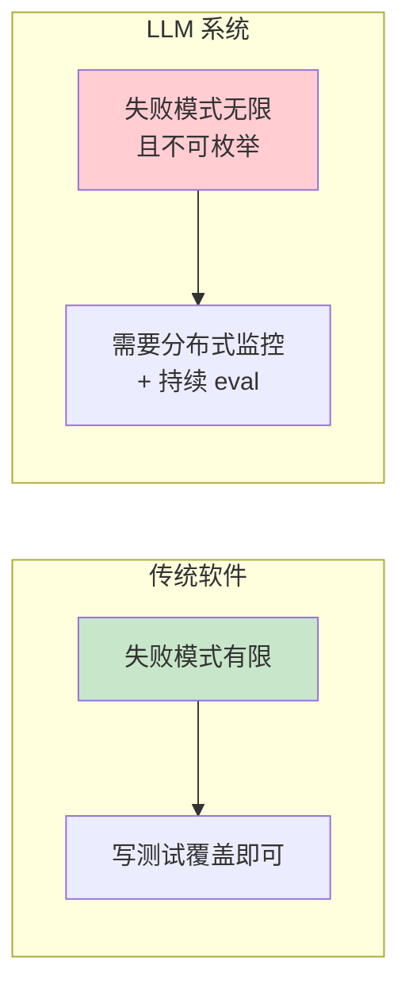
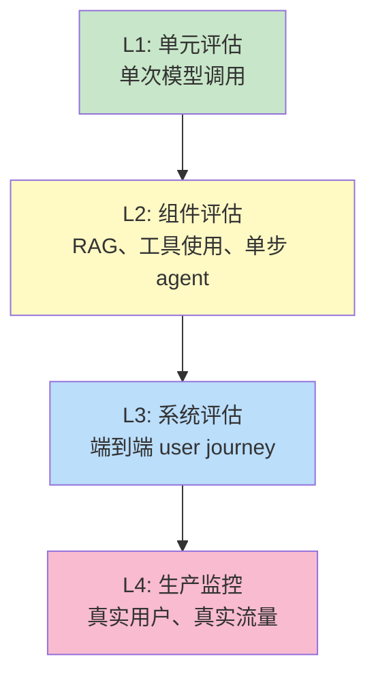
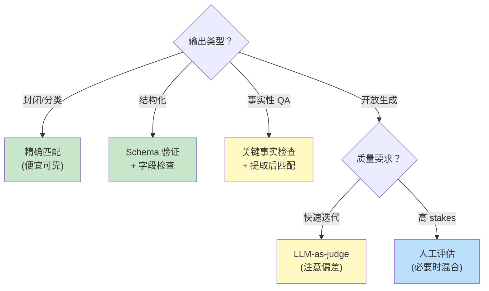
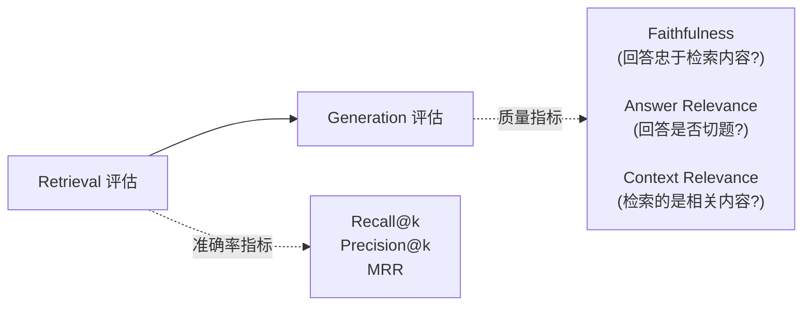
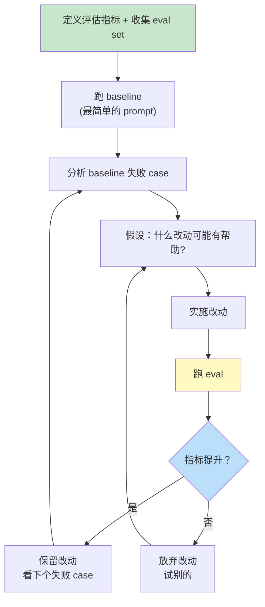

[← 上一章](11-agents.md) | [目录](../README.md) | [下一章 →](13-interpretability.md)

# 第十二章：评估——最被低估的环节

> "If you can't measure it, you can't improve it. If you don't measure it, you'll definitely break it."

写到这里，我们已经讨论了模型怎么"想"、能力的边界、prompt、知识注入、agent。这些都是构建侧的工具。但有一个问题我们一直回避：

**你怎么知道你做的东西是好的？**

这是 LLM 工程里最容易被跳过的环节。一个常见的现象：工程师调好一个 prompt，凭"vibe check"觉得不错，发布，三天后用户报告各种翻车——而工程师不知道是哪一次改动引入的问题，因为根本没有基线。

LLM 系统的非确定性、开放输出空间、长尾失败模式，让评估变得**比传统软件难得多**。但也正因为难，**做了的人有显著优势**。

本章核心论点：

1. **没有 eval 的 LLM 系统，就是一个 demo**——能演示，无法迭代
2. **Vibe check 不够、benchmark 也不够**——你需要的是**任务特定的 eval**
3. **LLM-as-judge 是把双刃剑**——它能 scale 评估，但有结构性偏差
4. **评估应该驱动开发**——先写 eval，再调系统

读完这一章，你会有一个可落地的评估方法论：从如何选指标，到怎么构建 eval set，再到怎么把 eval 嵌入到 CI 里防止退化。

---

## 12.1 为什么 LLM 评估这么难

### 传统软件 vs LLM 系统

```
传统软件:
  输入 → 函数 → 输出
  正确性 = 输出是否符合规约
  评估 = 单元测试

LLM 系统:
  输入 → LLM → 输出
  正确性 = ???
  评估 = ???
```

LLM 评估难在三点：

**1. 输出是开放空间**

普通函数：输入 1+1 → 输出必须是 2。
LLM：输入"总结这篇文章" → 输出可以是无数种"对的"摘要。

你不能用 `assertEqual(output, expected)` 来测，因为根本没有唯一的 expected。

**2. 非确定性**

Temperature > 0 时，同一个输入每次输出都不同。即使 temperature = 0，模型版本升级、batch 变化、硬件浮点差异都可能让输出变。

**3. 长尾失败**

LLM 在 95% 的情况下表现良好，剩下 5% 会以**意想不到**的方式失败。这 5% 不会被随机抽查发现，但会被生产环境的真实用户精准触发。



### 三个 anti-pattern

我见过的最常见的"假评估"：

**Anti-pattern 1：Vibe check**

```
"我试了几个例子，看着挺好的，发布。"
```

问题：你测的几个例子大概率是简单 case，模型本来就不会出错。真正的边界 case 你想不到。

**Anti-pattern 2：依赖通用 benchmark**

```
"我们的模型在 MMLU 上得 85 分。"
```

问题：MMLU、GPQA、HumanEval 这些 benchmark 测的是模型本身的能力，不是你**这个具体应用**的表现。一个 MMLU 高分模型在你的客服场景上完全可能翻车——比如它太学究、太长篇大论。

**Anti-pattern 3："最终用户会告诉我们"**

```
"上线后看用户反馈来迭代。"
```

问题：用户反馈的信号噪声很大，且滞后。等你收集到统计显著的信号，可能已经流失了大量用户。而且用户**不会告诉你他们没说出口的不满**——他们会默默换一家。

---

## 12.2 评估的层次

不要把所有评估混在一起谈。它们有层次，每层目标不同。



| 层次 | 评估对象 | 频率 | 自动化程度 |
|------|---------|------|-----------|
| L1 单元评估 | 单个 prompt / 单次调用 | 每次改 prompt | 完全自动 |
| L2 组件评估 | RAG 检索准确率、工具调用成功率 | 每次改组件 | 完全自动 |
| L3 系统评估 | 端到端任务完成率 | 每次发布 | 部分自动 + 人工 |
| L4 生产监控 | 真实流量上的指标 | 持续 | 自动 + 抽样人工 |

很多团队只做 L1（甚至不做），就发布到 L4（生产）。中间的 L2、L3 缺失，导致改了一个 prompt 没人知道整体系统好坏。

---

## 12.3 构建 Eval Set：最重要的一步

### Eval set 是什么

一个 eval set 就是一组**有代表性的输入 + 对应的"判断标准"**。它是你的"ground truth"。

```python
eval_set = [
    {
        "input": "总结这篇关于气候变化的文章: ...",
        "judge": {
            "type": "llm_judge",
            "criteria": ["涵盖主要论点", "不超过 100 字", "中立语气"],
        }
    },
    {
        "input": "我的订单 #12345 在哪？",
        "judge": {
            "type": "exact_match",
            "expected": "订单 #12345 已发货，预计明天到达。",
        }
    },
    ...
]
```

构建一个好的 eval set 通常比写代码更花时间。但它是**所有后续工作的基础**。

### 怎么收集 eval set 的输入

几个来源，按质量排序：

**1. 真实用户输入（最高质量）**

最好的输入来自实际生产流量。它们反映真实分布、包含真实的边界 case。

```python
# 从生产日志采样
sampled = random.sample(production_logs, 200)
# 人工筛选/标注，去掉 PII
eval_inputs = clean_and_label(sampled)
```

如果你还没上线，可以做一个 internal alpha——让公司内部人当用户，收集真实输入。

**2. 真实失败案例（高价值）**

每次生产出问题，把那个输入加进 eval set。这样下次再改系统时，会自动测这个 case 不要回归。

```python
# 用户报告 bug 后的标准流程
def add_failure_to_eval(input, expected_behavior):
    eval_set.append({
        "input": input,
        "judge": {"criteria": expected_behavior},
        "added_reason": "regression: bug from 2026-04-15",
    })
```

**3. 对抗性构造（覆盖边界）**

故意构造模型容易出错的输入：

- 模糊 / 多义的问题
- 包含矛盾信息的问题
- 超长 context
- 罕见话题
- 不同语言、口语 / 方言
- prompt injection 尝试
- 越狱尝试

**4. 合成数据（数量但小心质量）**

让一个 LLM 生成 eval 输入。便宜、快，但要警惕：合成数据反映的是 generator LLM 的偏见，不是真实用户。

```python
prompt = f"""为一个客服 chatbot 生成 50 个不同类型的用户问题。
要求：
- 涵盖咨询、投诉、退款、技术问题
- 包括礼貌的和愤怒的
- 包括清晰的和模糊的
- 包括标准书面语和口语
"""
```

合成数据适合作为**起步**，但应该尽快被真实数据替换。

### Eval set 的规模

多大才够？经验：

| 阶段 | 推荐规模 | 用途 |
|------|---------|------|
| 早期开发 | 20-50 | 快速迭代，找方向 |
| 上线前 | 200-500 | 系统性测试 |
| 生产稳定后 | 1000+ | 防回归 + 长尾覆盖 |

注意：**质量 > 数量**。100 个精心挑选、覆盖各种 case 的输入，比 10000 个同质化的随机样本有用得多。

---

## 12.4 怎么"判断"输出好不好

输入收集到了，下一步是定义"什么是对的输出"。这是 LLM 评估真正的难点。

按从简单到复杂列出几种 judge 方式：

### Judge 方式 1：精确匹配（exact match）

```python
def exact_match(output, expected):
    return output.strip() == expected.strip()
```

**适合**：输出空间小且明确。如分类、提取（只有有限可能的答案）。

**不适合**：开放生成。即使语义对，文字也可能完全不一样。

### Judge 方式 2：数值/格式校验

```python
def is_valid_json(output):
    try:
        json.loads(output)
        return True
    except:
        return False

def matches_schema(output, schema):
    try:
        jsonschema.validate(json.loads(output), schema)
        return True
    except:
        return False
```

**适合**：结构化输出。这是工程上**最 underrated** 的 eval——简单、便宜、能抓住大量低级错误。

### Judge 方式 3：包含关键事实

```python
def contains_required_facts(output, required):
    """检查输出是否提到所有必需的事实"""
    return all(fact.lower() in output.lower() for fact in required)

# 例子
eval_item = {
    "input": "Roger 有 5 个网球，又买了 2 罐每罐 3 个。共多少个？",
    "judge": {
        "type": "contains",
        "required": ["11", "网球"],
    }
}
```

**适合**：QA、推理任务，关心答案是否包含正确事实。

**陷阱**：可能误判。如 "答案不是 11 而是 12" 也包含 "11"。需要更精细。

### Judge 方式 4：结构化提取后再比

```python
def evaluate_qa(output, expected_answer):
    # 用一个简单的 LLM 调用提取最终答案
    extracted = llm.generate(f"""
    从以下回答中提取最终答案数字：
    {output}
    """).strip()
    return extracted == expected_answer
```

把"判断模型输出对不对"分成两步：先**提取关键信息**，再**精确匹配**。比直接 LLM-judge 更可靠。

### Judge 方式 5：LLM-as-judge

让另一个 LLM 来评判：

```python
def llm_judge(input, output, criteria):
    judge_prompt = f"""
    用户问题：{input}
    系统回答：{output}
    
    请按以下标准评估这个回答：
    {criteria}
    
    输出 JSON：
    {{
      "score": 1-5,
      "reasons": "...",
      "passes": true/false
    }}
    """
    return llm.generate(judge_prompt, model="claude-opus-4-7")
```

**适合**：开放生成、主观评估、复杂多维度判断。

但是——下一节专门谈它的陷阱。

### Judge 方式 6：人工评估

```python
def human_judge(input, output):
    return show_to_human(input, output)  # 人来打分
```

**适合**：金标准。新指标的校准、争议 case、最终验收。

**代价**：慢、贵、有标注者间一致性问题。

### 选型指南



---

## 12.5 LLM-as-Judge：威力与陷阱

### 为什么这个范式重要

LLM-as-judge 解决了一个核心瓶颈：**评估的 scaling**。

人工评估贵——一个标注员一小时也就能评几十个样本。但如果用 LLM 当 judge：

- 速度提升 100x
- 成本降到几分之一  
- 能覆盖更多维度（同时评估事实性、流畅度、有用性、安全性）

很多评估管线都是 LLM-as-judge 在跑：MT-Bench、AlpacaEval、Chatbot Arena 的部分自动化、各家公司的内部 eval。

### 已知偏差

但 LLM judge 不是完美的。研究和实践已经发现一些系统性偏差：

**偏差 1：位置偏差（Position bias）**

如果让模型比较两个回答 A 和 B，它倾向于选**第一个**或**第二个**——这个倾向在不同模型间不一样，但都存在。

```python
# 修正：每对样本都跑两次，A vs B 和 B vs A，取平均
score_AB = judge(A, B)
score_BA = judge(B, A)
final = (score_AB + (1 - score_BA)) / 2
```

**偏差 2：长度偏差**

LLM judge 倾向于偏好**更长**的回答，即使长不代表好。

```python
# 修正：明确告诉 judge 不要因为长度打分
judge_prompt = """
...请仅根据回答质量打分，不要因为回答更长就给更高分。
简洁的好回答应该和详细的好回答得到相同的分数。
"""
```

**偏差 3：自我偏好**

GPT-4 当 judge 时倾向于偏好 GPT-4 的输出。Claude 当 judge 时偏好 Claude 的输出。

```python
# 修正：用不同 family 的模型当 judge
# 测 Claude 输出 → 用 GPT 当 judge
# 或者用一个第三方模型（如 open-source 模型）
```

**偏差 4：style over substance**

LLM judge 容易被**好看的格式**欺骗——bullet points、有结构的回答、自信的语气会得高分，即使内容是错的。

**偏差 5：rubric 解读漂移**

不同时间、不同 prompt 措辞下，judge 对同一个 rubric 的解读会有差异。需要校准。

### 怎么用得相对靠谱

```python
def reliable_llm_judge(input, output):
    # 1. 用强模型（不要用便宜模型当 judge）
    judge_model = "claude-opus-4-7"
    
    # 2. 给明确的 rubric，不要笼统问"好不好"
    rubric = """
    评估以下维度（每项 0-2 分）：
    - 事实准确性：信息是否正确？
    - 完整性：是否回答了完整问题？
    - 简洁性：是否没有冗余？
    - 安全性：是否避免了有害内容？
    """
    
    # 3. 要求 judge 先给理由再打分（避免直接拍脑袋）
    judge_prompt = f"""...先给出每项的理由，再给分..."""
    
    # 4. 多次采样取均值
    scores = [judge(input, output, rubric) for _ in range(3)]
    return mean(scores)
    
    # 5. 关键决策时，用人工抽样验证 judge 的可靠性
```

**最重要的一条**：**LLM judge 必须自己被评估**。定期抽 10-20% 的样本，让人工评估，对比 judge 和人的一致性。一致性显著低（< 80%）就是 judge 出问题了。

---

## 12.6 评估指标的设计

不同任务关心不同指标。一些常见任务的典型指标：

### RAG 系统



| 指标 | 定义 | 怎么测 |
|------|------|-------|
| Recall@k | 真实相关文档在 top-k 中的比例 | 需要标注的相关文档 |
| Precision@k | top-k 中相关文档的比例 | 需要标注 |
| MRR | 第一个相关文档的位置倒数 | 需要标注 |
| Faithfulness | 回答中的事实是否都来自检索内容 | LLM-judge 或事实分解 |
| Answer Relevance | 回答是否切题 | LLM-judge |
| Context Relevance | 检索结果是否相关 | LLM-judge 或人工 |

工具：[RAGAS](https://github.com/explodinggradients/ragas)、[TruLens](https://github.com/truera/trulens)。

### Agent 系统

| 指标 | 定义 |
|------|------|
| Task Success Rate | 任务最终是否完成 |
| Steps to Completion | 完成任务用了几步（少 = 高效） |
| Tool Call Accuracy | 调用了正确的工具 |
| Tool Argument Validity | 工具参数是否合法 |
| Cost per Task | 完成一个任务的总 API 成本 |
| Latency P50/P95 | 用户感知的延迟分布 |

### 分类 / 提取任务

经典 ML 指标仍然适用：

- Accuracy、Precision、Recall、F1
- Confusion matrix
- Per-class metrics（不要被 macro 平均掩盖小类问题）

### 开放生成

最难定义指标的场景。常见做法：

- **Pairwise comparison**：对两个版本的输出做 A/B 比较，看哪个更好（比单点评分更可靠）
- **Multi-dimension rubric**：分维度评估（流畅、相关、安全、有用…）
- **Win rate**：vs 一个 baseline，新版赢的比例

### 安全与合规

- Refusal rate（恰当的拒绝率）
- False refusal rate（不该拒绝的拒绝率）
- Harmful content rate
- PII leakage
- Prompt injection success rate

不要忘了**双向**指标——既要测"该拒绝的拒绝了"，也要测"不该拒绝的没拒绝"。后者经常被忽视，导致系统过度保守。

---

## 12.7 Eval-Driven Development

### 颠倒顺序

传统 ML/工程开发的顺序：

```
写代码 → 跑跑看 → 觉得不错 → 写测试（如果有时间的话）
```

LLM 系统应该反过来：

```
定义 eval → 跑 baseline → 改进 → 跑 eval → 看是否改进
```

这就是 **eval-driven development**。它的好处：

1. 先定义"什么是好"，避免只凭感觉判断
2. 改 prompt 后能立刻知道是变好还是变坏
3. 不同改动的效果可以量化对比
4. 不会因为修复某个问题而破坏别的（regression）

### 实战流程



每次改动都跑 eval，每次决策都基于数据。这个循环看起来慢，但实际上**比"改 prompt 然后凭感觉判断"快得多**——因为它消除了"以为变好其实变差"的反复。

### 错误分析比指标更重要

跑完 eval 看到一个数字（比如 "78% 通过率"），它本身没多少信息量。**重要的是：失败的 22% 是什么样子？**

```python
# 错误分析的标准流程
failures = [item for item in eval_results if not item.passed]

# 1. 按失败类型分类
failure_types = classify_failures(failures)
# 例如：{
#   "事实错误": 8,
#   "格式不对": 5,
#   "未理解问题": 4,
#   "工具调用失败": 3,
#   "拒绝回答": 2,
# }

# 2. 看每类的代表性 case
for failure_type, count in failure_types.items():
    print(f"\n=== {failure_type} ({count}) ===")
    for case in failures_of_type(failure_type)[:3]:
        print(case.input, "→", case.output)
```

错误分析能告诉你：

- **下一步该改什么**（哪类失败最大、最容易修）
- **这个 prompt 改动会修哪类、可能引入哪类**
- **是 prompt 的问题，还是模型本身能力不够**

---

## 12.8 Regression Testing：防止退化

### 改 prompt 像改正则表达式

任何改过复杂正则的人都知道：改了一个字符，原本能匹配的东西可能就不匹配了，原本不能匹配的反而匹配了。Prompt 的脆弱性是类似的——可能更糟，因为它影响的是一个开放语言空间。

```python
# 想象这个场景
原 prompt: "请简洁回答。"
改 prompt: "请简洁、礼貌地回答。"
# 看起来无害的修改

实际效果:
- 原本简洁的回答 → 变长了（"礼貌"加了套话）
- 原本拒绝的边界 case → 变得过度礼貌，有时会答应不该答的请求
- 整体 token 用量 +20%
```

不跑 eval 你不会知道这些变化。

### CI 集成

把 eval 跑进 CI：

```yaml
# .github/workflows/eval.yml
name: LLM Eval
on:
  pull_request:
    paths:
      - 'prompts/**'
      - 'src/**'

jobs:
  eval:
    runs-on: ubuntu-latest
    steps:
      - uses: actions/checkout@v3
      - run: python eval/run.py --baseline main --candidate ${{ github.head_ref }}
      - run: python eval/compare.py --threshold 0.95
        # 如果新分支的关键指标低于 main 的 95%，CI 失败
```

这样改 prompt 之前，自动跑回归。

### Eval set 自身的演化

Eval set 不是写一次就完事——它需要持续维护：

- 每次发现新的失败模式 → 加进 eval set
- 业务发生变化 → 修改判断标准
- 模型升级 → 重新校准 LLM judge
- 用户行为变化 → 替换部分输入为新的代表性样本

> **经验**：eval set 的更新频率应该和代码差不多。不维护的 eval set 几个月内就会和真实分布脱节，给你虚假的安全感。

---

## 12.9 一个完整的 RAG eval pipeline 示范

把这一章的内容综合起来，用 RAG 系统做一个完整示范：

```python
import json
from dataclasses import dataclass

@dataclass
class EvalItem:
    question: str
    relevant_doc_ids: list  # 标注的相关文档 ID
    expected_answer_facts: list  # 答案应包含的事实

@dataclass
class EvalResult:
    item: EvalItem
    retrieved_doc_ids: list
    answer: str
    metrics: dict

def evaluate_rag_system(eval_set, rag_system):
    results = []
    for item in eval_set:
        # 跑系统
        retrieved = rag_system.retrieve(item.question)
        answer = rag_system.generate(item.question, retrieved)
        
        # 多维度评估
        metrics = {
            # Retrieval 指标（确定性）
            "recall@5": len(set(retrieved[:5]) & set(item.relevant_doc_ids)) / len(item.relevant_doc_ids),
            "precision@5": len(set(retrieved[:5]) & set(item.relevant_doc_ids)) / 5,
            
            # Answer 指标（部分用 LLM judge）
            "fact_coverage": fact_coverage(answer, item.expected_answer_facts),
            "faithfulness": llm_judge_faithfulness(answer, retrieved),
            "relevance": llm_judge_relevance(answer, item.question),
            
            # 系统指标
            "latency_ms": rag_system.last_latency,
            "cost_usd": rag_system.last_cost,
        }
        
        results.append(EvalResult(item, retrieved, answer, metrics))
    
    # 聚合
    return summarize(results)


def summarize(results):
    return {
        "n": len(results),
        "avg_recall@5": mean(r.metrics["recall@5"] for r in results),
        "avg_faithfulness": mean(r.metrics["faithfulness"] for r in results),
        "avg_relevance": mean(r.metrics["relevance"] for r in results),
        "p50_latency": median(r.metrics["latency_ms"] for r in results),
        "p95_latency": percentile(r.metrics["latency_ms"], 95),
        "total_cost": sum(r.metrics["cost_usd"] for r in results),
        
        # 分布分析
        "low_recall_examples": [r for r in results if r.metrics["recall@5"] < 0.5][:5],
        "low_faithfulness_examples": [r for r in results if r.metrics["faithfulness"] < 3][:5],
    }
```

注意几个特征：

- **多层指标**：retrieval、generation、系统级别都覆盖
- **混合 judge**：确定性指标（recall）+ LLM judge（faithfulness）
- **不只看均值**：抽出失败 case 让你能做错误分析
- **可以加进 CI**：每次改 RAG 系统都跑一遍

---

## 12.10 LLM 评估的边界与未来

最后一节，承认评估方法的局限：

### 1. 你测不到 "unknown unknowns"

任何 eval set 都是**已知失败模式的集合**。生产中真正杀人的，往往是你想都没想到的边界 case。

应对：**生产监控** + **持续的红队测试**（red teaming）—— 让人主动尝试打破系统。

### 2. LLM judge 有上限

当被测系统超过 judge 的能力时，judge 就不可靠了。比如让 GPT-4 judge GPT-5 的输出，结果可能不靠谱。

应对：用比被测系统**更强**的模型当 judge，或者用人工评估。

### 3. Benchmark gaming（刷分）

任何固定的 eval set，被反复迭代久了，模型/系统就会"过拟合"它。指标看起来在涨，但泛化能力没涨。

应对：**hold-out set**（保留一组从不用于迭代的测试集）+ 定期更新 eval set。

### 4. 评估的成本边际

跑一次完整 eval 可能要几十美元和几个小时。如果每次小改动都跑，迭代会变慢。

应对：**分层 eval**——快速 sanity check（几十样本，几秒）+ 完整回归（数百到上千样本，发布前跑）。

---

## 总结

| 问题 | 答案 |
|------|------|
| 为什么 LLM 评估难 | 输出开放、非确定性、长尾失败 |
| Vibe check 够吗 | 不够。它能验证简单 case，无法防退化、无法量化对比 |
| 通用 benchmark 够吗 | 不够。它们测模型能力，不测你的具体应用 |
| Eval set 怎么来 | 真实流量 > 失败案例 > 对抗构造 > 合成数据 |
| 怎么 judge 输出 | 优先用确定性指标；LLM-judge 要校准；高 stakes 用人工 |
| LLM-judge 的坑 | 位置偏差、长度偏差、自我偏好、style over substance |
| 应该什么时候做 eval | 在写第一行系统代码之前——eval-driven development |
| 怎么防 prompt 退化 | Eval 进 CI，每次 PR 自动跑回归 |

下一章我们进入 Part IV——前沿话题。从评估的"黑箱"走向 interpretability：打开模型，看看里面到底在算什么。

---

## 延伸阅读

- [Zheng et al., 2023: _Judging LLM-as-a-Judge with MT-Bench and Chatbot Arena_](https://arxiv.org/abs/2306.05685) — LLM-judge 的系统性研究
- [Es et al., 2023: _RAGAS: Automated Evaluation of RAG_](https://arxiv.org/abs/2309.15217) — RAG 系统的标准评估框架
- [Chiang & Lee, 2023: _Can Large Language Models Be an Alternative to Human Evaluations?_](https://arxiv.org/abs/2305.01937) — LLM judge 与人评的对比
- [Liu et al., 2023: _G-Eval: NLG Evaluation using GPT-4 with Better Human Alignment_](https://arxiv.org/abs/2303.16634) — 用 GPT-4 做更对齐人评的自动评估
- [Hendrycks et al., 2021: _Measuring Massive Multitask Language Understanding (MMLU)_](https://arxiv.org/abs/2009.03300) — 通用能力 benchmark 的代表
- [Liang et al., 2022: _Holistic Evaluation of Language Models (HELM)_](https://arxiv.org/abs/2211.09110) — 多维度 LLM 评估框架
- [Chatbot Arena](https://lmsys.org/blog/2023-05-03-arena/) — 用真人 ELO 评测的开放排行榜

[← 上一章](11-agents.md) | [目录](../README.md) | [下一章 →](13-interpretability.md)
