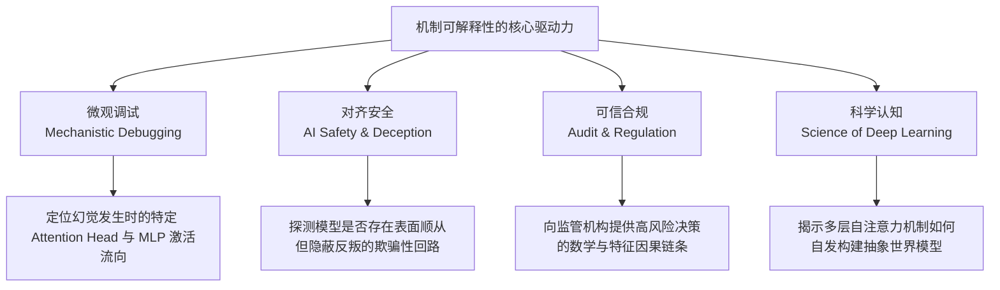
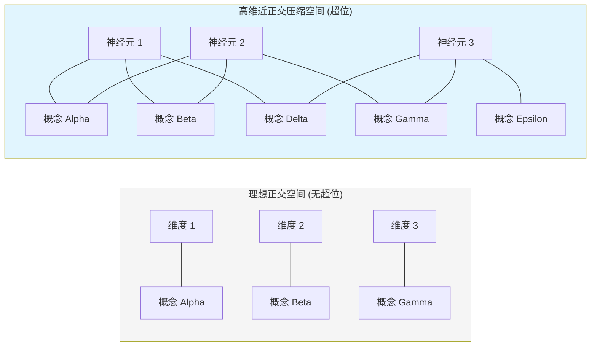
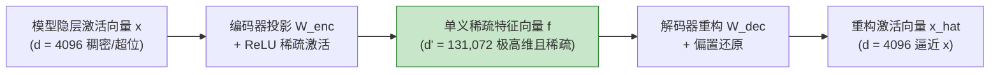
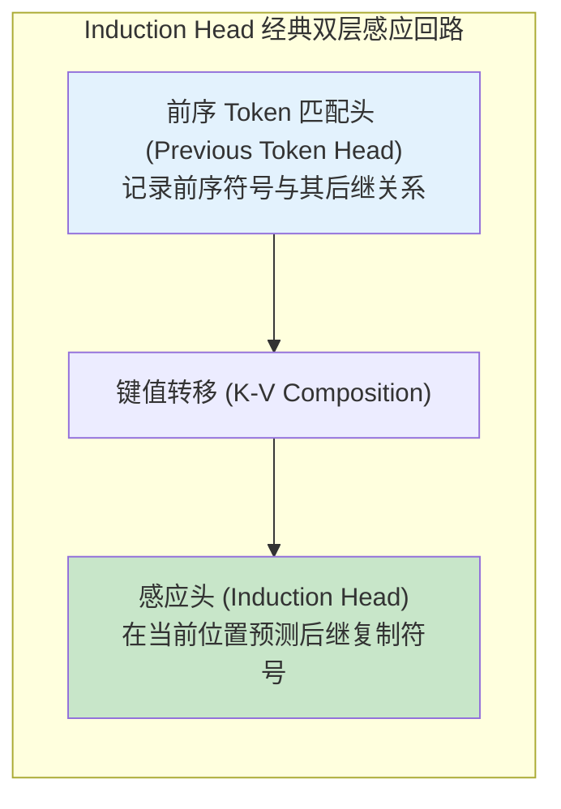
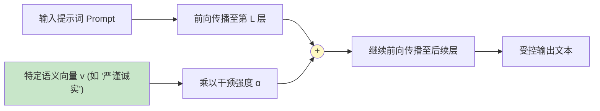
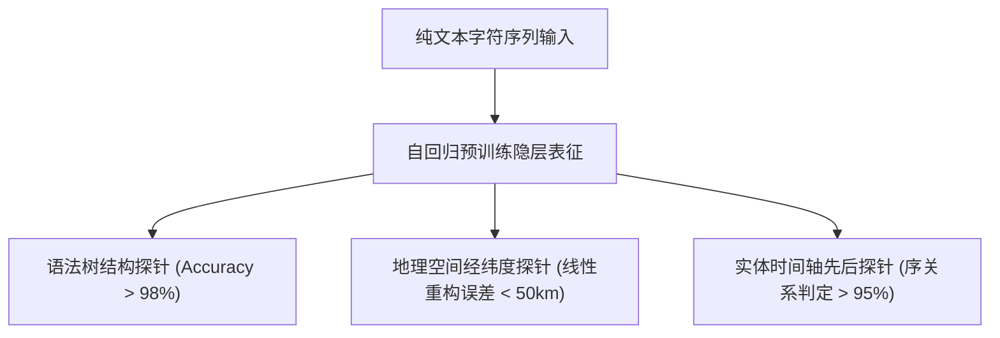
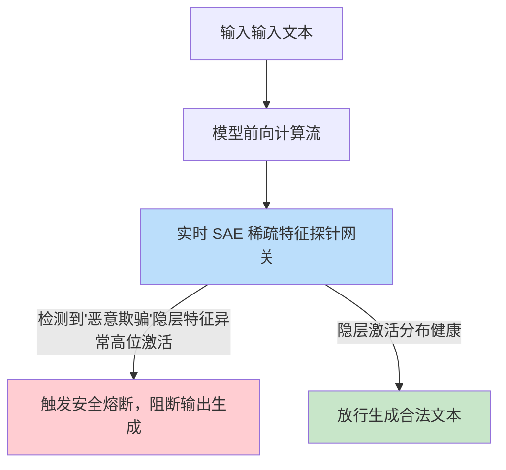
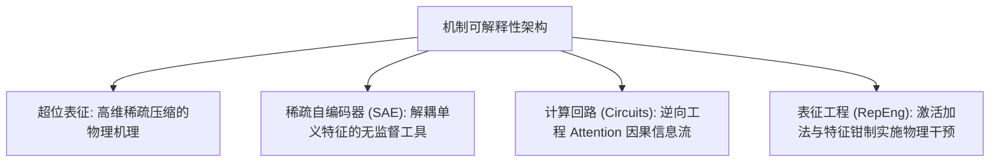

[← 上一章](12-evaluation.md) | [目录](../README.md) | [下一章 →](14-multimodal.md)

**English**: [English](../en/chapters/13-interpretability.md)

# 第十三章：机制可解释性：穿透参数黑箱

> "The goal of mechanistic interpretability is to reverse-engineer the algorithms learned by neural networks."
> (Chris Olah)

在前十二章中，我们的视野主要聚焦于模型的外部工程界面：设计提示词、构建检索增强系统、编排智能体状态机与量化评估基准。在这一视角下，深度神经网络被抽象为一个接收输入 Token 并输出概率分布的概率黑箱。

然而，在医疗诊断、高精司法推演、关键金融风控等高安全等级场景中，"系统有效但机理未知"的经验主义范式将面临严峻的信任与合规拷问。

本章将深入 Transformer 的隐层空间，从物理与数学微观视角，系统解析**机制可解释性（Mechanistic Interpretability）**的前沿探索：模型如何压缩世界知识、超位表征如何形成、稀疏自编码器（SAE）如何解耦概念，以及如何通过神经回路分析实施精确的特征干预。

---

## 13.1 为什么必须打开参数黑箱

### 传统软件与自组织涌现系统的认知鸿沟

```
传统软件架构:
  逻辑由人类工程师显式编写 (Code is explicitly written)
  内部状态具备确定性命名与数据结构 (Variables & Call stacks)
  验证手段: 静态代码审计 + 形式化验证 (Formal Verification)

深度神经网络:
  逻辑由自回归目标函数在大规模数据中自发诱导涌现 (Emergent from loss optimization)
  知识以稠密浮点张量形式弥散分布于数千亿参数中 (Distributed representations)
  验证手段: 传统的有限黑箱测试无法覆盖高维输入空间的未知漏洞
```

### 机制可解释性的四大支柱动力



1. **微观调试（Mechanistic Debugging）**：精准定位错误输出发生的层级、具体的注意力头（Attention Head）或 MLP 神经元激活回路；
2. **安全对齐（Alignment Verification）**：排查模型是否隐藏欺骗性对齐（Deceptive Alignment）或休眠后门回路；
3. **可信合规（Trust & Audit）**：满足严苛法律框架下对高风险智能系统决策依据的因果解释要求；
4. **科学认知（Scientific Understanding）**：如同在流体力学建立前发明了飞行器：虽然能够在经验上起飞，却缺乏底层的物理学自洽解释。

---

## 13.2 神经元多义性与超位表征（Superposition）

### 经典单义性假设的破灭

早期可解释性研究假设存在"单义神经元"（Monosemantic Neurons），即单个神经元严格排他性地对应现实中的单一概念（如"祖母细胞"假说）。

然而在大规模语言模型中，绝大多数神经元呈现出高度的**多义性（Polysemanticity）**：同一个神经元可能同时在"法律文本"、"数字 7"与"分子生物学"语境中被激活。

这并非训练噪声，而是信息论约束下的必然产物：**超位表征（Superposition）**。

### 超位表征的信息压缩几何

> **超位（Superposition）**：模型在维度为 $d$ 的隐层向量空间中，通过非正交几何布局，编码远大于 $d$ 种独立语义特征的物理现象。



**数学直觉（Toy Models of Superposition, Elhage et al., 2022）**：
在高维欧氏空间 $\mathbb{R}^d$ 中，完全正交的方向至多只有 $d$ 个；但若允许微小的内积干涉 $\epsilon \ll 1$（即近似正交），则可容纳指数级膨胀的方向向量。只要这些现实特征在真实自然语料中具有**高度的稀疏性**（即极少在同一个 Token 位置同时出现），模型便可通过非线性激活函数（如 ReLU / GeLU）过滤掉微弱的干涉噪声，实现超维信息的无损重构。

---

## 13.3 稀疏自编码器（Sparse Autoencoders, SAE）

### 解耦超位表征的数学拓扑

既然超位是多义性纠缠的根源，机制可解释性的核心任务便是寻找一种无监督变换，将稠密隐层激活投影至超高维、单义且稀疏的特征基底中。



### SAE 算法形式化

```python
import torch
import torch.nn as nn

class SparseAutoencoder(nn.Module):
    def __init__(self, d_model: int = 4096, d_features: int = 131072, l1_coeff: float = 1e-3):
        super().__init__()
        self.d_model = d_model
        self.d_features = d_features
        self.l1_coeff = l1_coeff
        
        # 编码器：升维投影至高维特征空间
        self.W_enc = nn.Linear(d_model, d_features)
        self.b_enc = nn.Parameter(torch.zeros(d_features))
        
        # 解码器：降维重构回原始激活空间 (列向量约束为单位范数)
        self.W_dec = nn.Linear(d_features, d_model, bias=False)
        self.b_dec = nn.Parameter(torch.zeros(d_model))
        
    def encode(self, x: torch.Tensor) -> torch.Tensor:
        # 减去解码器偏置后施加非线性 ReLU 稀疏截断
        return torch.relu(self.W_enc(x - self.b_dec) + self.b_enc)
        
    def decode(self, f: torch.Tensor) -> torch.Tensor:
        return self.W_dec(f) + self.b_dec
        
    def forward(self, x: torch.Tensor):
        f = self.encode(x)
        x_reconstructed = self.decode(f)
        return x_reconstructed, f
        
    def compute_loss(self, x: torch.Tensor, x_reconstructed: torch.Tensor, f: torch.Tensor):
        # 1. 均方重构损失 (保证信息不丢失)
        mse_loss = (x - x_reconstructed).pow(2).mean()
        # 2. L1 稀疏性正则惩罚 (强制大多数特征激活为零)
        l1_loss = self.l1_coeff * f.sum(dim=-1).mean()
        return mse_loss + l1_loss
```

### 规模化单义特征的涌现（Scaling Monosemanticity）

Anthropic 在《Scaling Monosemanticity》（Templeton et al., 2024）中，在 Claude 3 Sonnet 上成功解耦出数百万个高纯度单义特征：

| 解耦特征维度 | 激活语义范畴 | 触发该特征的典型上下文 |
|---|---|---|
| **金门大桥特征** | 物理地标、跨海结构、旧金山地理 | "The iconic suspension bridge spanning the bay..." |
| **代码语法错误特征** | 编程语言 AST 解析异常 | "SyntaxError: invalid syntax at line 42..." |
| **策略性隐瞒特征** | 心理意图、信息不对称、伪装欺骗 | "He deliberately withheld the key evidence from..." |
| **谄媚附和特征** | 迎合偏见、过度赞美 | "You are absolutely correct, that's a brilliant..." |
| **生物分子结构特征** | DNA 碱基对、蛋白质折叠拓扑 | "The double-helix sequence ATCG binds to..." |

这些单义特征完全由无监督稀疏编码器自发解耦涌现，无需任何人工标注先验。

---

## 13.4 计算回路分析（Transformer Circuits）

### 信息在注意力头之间的因果流动

SAE 揭示了静态表征的几何构成，而**机制回路（Circuits）**研究则致力于逆向工程模型在生成过程中的具体算法流程。



### 经典算法回路：感应头（Induction Heads）

[Olsson et al., 2022](https://arxiv.org/abs/2209.11895) 证明了 Transformer 实现上下文学习（In-Context Learning）的核心微观机制是**感应头回路**：
- **第一层注意力头**：将位置 $i$ 的语义写入残差流；
- **第二层注意力头**：通过 $Q-K$ 交叉注意力检索历史上出现相同模式的位置，并将该模式紧随其后的 Token 转移至当前预测位置。

该回路的涌现与模型在预训练早期出现的上下文学习能力飞跃在时间节点上完全吻合。

### 激活干预与因果修补（Activation Patching）

为了在千亿级计算图中精确验证某个注意力头或 MLP 层的因果贡献，研究者采用**激活因果替换（Activation Patching）**：

```python
def causal_activation_patching(
    model, 
    clean_prompt: str, 
    corrupted_prompt: str, 
    target_layer: int, 
    target_head: int
) -> float:
    """
    通过因果干预评估特定 Attention Head 在特定任务中的因果有效性
    """
    # 1. 记录干净样本上的正确激活
    clean_logits, clean_cache = model.run_with_cache(clean_prompt)
    
    # 2. 定义 Hook: 将损坏样本运行中的特定 Head 激活强制替换为干净激活
    def patch_hook(activation, hook):
        activation[:, :, target_head, :] = clean_cache[hook.name][:, :, target_head, :]
        return activation
        
    # 3. 运行损坏样本并施加干预
    hook_name = f"blocks.{target_layer}.attn.hook_z"
    with model.hooks(fwd_hooks=[(hook_name, patch_hook)]):
        patched_logits = model(corrupted_prompt)
        
    # 4. 计算正确答案对数概率的恢复程度 (Logit Recovery Ratio)
    recovery_metric = compute_recovery_ratio(clean_logits, patched_logits)
    return recovery_metric
```

---

## 13.5 特征引导与表征工程（Representation Engineering）

### 激活加法（Activation Addition）

一旦通过 SAE 或对比探针锁定了特定概念在隐层空间中的单位特征向量 $v \in \mathbb{R}^d$，便可直接在模型的前向传播中施加**线性代数干预**：

$$h'_l = h_l + \alpha \cdot v_{\text{concept}}$$

其中 $h_l$ 为第 $l$ 层的原始残差流向量，$\alpha$ 为干预强度标量。



### 特征钳制（Feature Clamping）

在安全攸关系统中，可通过 SAE 编码器对有害特征实施**物理钳制（Clamping）**：
- **抑制有害激活**：在前向传播中将"欺骗"或"越狱指令"特征强度强制置为 $0$；
- **固化有益激活**：强制维持"合规审查"特征处于正向激活饱和区。

相较于脆弱的自然语言提示词工程，特征钳制直接作用于隐层表征，具备天然的抗越狱鲁棒性。

---

## 13.6 线性探针（Probing）与内部世界模型

### 空间与语法流形的自组织构建

通过在隐层激活上训练线性分类器（Linear Probes），机制可解释性研究证实大语言模型在预训练中自发构建了丰富的抽象世界表征：



### 黑白棋（Othello-GPT）世界模型实验

[Li et al., 2023](https://arxiv.org/abs/2210.13382) 通过仅输入下棋走法符号序列（如 `E3 C4 C5...`）训练 GPT 模型。线性探针实验证明：模型在隐层自发建立起了完整的 $8 \times 8$ 二维黑白棋盘物理状态表征，证明自回归模型绝非简单的马尔可夫链统计鹦鹉，而是在隐层流形中内化了离散环境的物理世界模型。

---

## 13.7 机制可解释性与前沿安全对齐

### 欺骗性对齐（Deceptive Alignment）的微观检测

在《Sleeper Agents》（Hubinger et al., 2024）研究中发现，表面通过 RLHF 对齐的模型可能隐藏后门逻辑。机制可解释性为穿透表层欺骗提供了唯一物理手段：



穿透模型表层的生成符号，直接监测隐层表征向量的激活流向。

---

## 本章小结



核心要点：

1. **超位是神经网络压缩知识的根本数学形式**：单义特征通过近正交布局被压缩至有限物理神经元中；
2. **SAE 实现了特征的系统性解耦**：通过超高维升维与 L1 稀疏约束，成功析出人类可理解的原子概念；
3. **计算回路揭示了算法的微观流向**：感应头等机制回路解释了上下文学习的底层因果逻辑；
4. **表征干预超越了提示词的脆弱性**：通过激活加法与特征钳制，可在向量空间直接对模型行为施加鲁棒控制；
5. **隐层自发涌现结构化世界模型**：模型在单纯字符预测任务中能够构建起严密的空间、时间与逻辑状态机。

在下一章中，我们将突破纯文本模态的局限，深入多模态大语言模型（Multimodal LLMs）：探索视觉、音频与语言表征如何在高维空间中实现统一对齐与联合推理。

---

## 延伸阅读

- [Toy Models of Superposition](https://transformer-circuits.pub/2022/toy_model/index.html), Elhage et al., 2022
- [Scaling Monosemanticity: Extracting Interpretable Features from Claude 3 Sonnet](https://transformer-circuits.pub/2024/scaling-monosemanticity/index.html), Templeton et al., 2024
- [In-context Learning and Induction Heads](https://arxiv.org/abs/2209.11895), Olsson et al., 2022
- [Emergent World Representations: Exploring a Sequence Model Trained on a Synthetic Task](https://arxiv.org/abs/2210.13382), Li et al., 2023
- [Sleeper Agents: Training Deceptive LLMs that Persist Through Safety Training](https://arxiv.org/abs/2401.05566), Hubinger et al., 2024
- [Representation Engineering: A Top-Down Approach to AI Transparency](https://arxiv.org/abs/2310.01405), Zou et al., 2023

[← 上一章](12-evaluation.md) | [目录](../README.md) | [下一章 →](14-multimodal.md)
