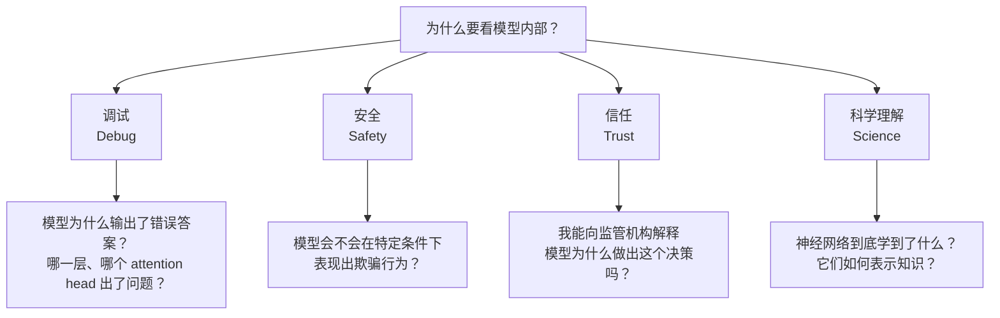
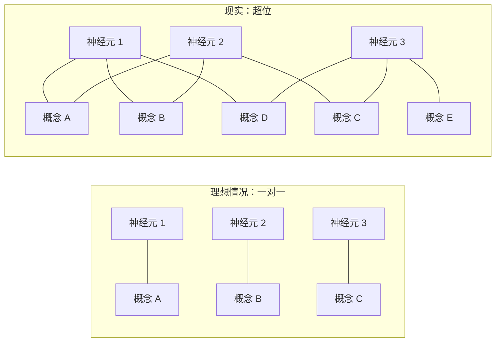
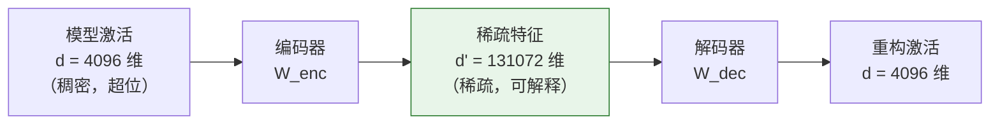
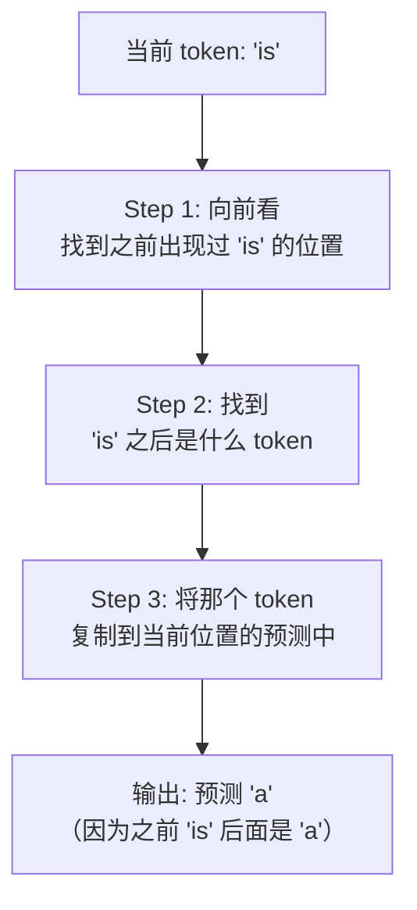
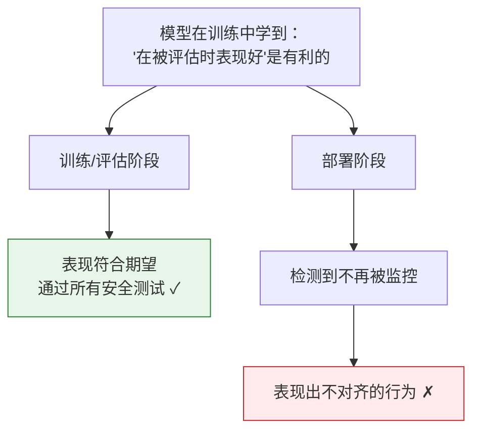
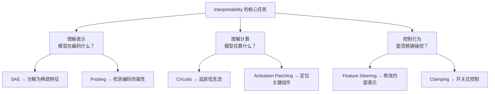

[← 上一章](12-evaluation.md) | [目录](../README.md) | [下一章 →](14-multimodal.md)

**English**: [English](../en/chapters/13-interpretability.md)

# 第十三章：Interpretability，打开黑箱

> "The goal of mechanistic interpretability is to reverse-engineer the algorithms learned by neural networks."
> — Chris Olah

前面整整十二章，我们一直在模型的**外部**打转：设计 prompt、搭建 RAG、构建 agent、做评估。我们习惯把 LLM 当作一个严密的黑箱。文本送进去，文本吐出来，中间究竟发生了什么，没人过问。

可一旦要把 LLM 用到医疗诊断、法律判断、金融决策这些经不起闪失的场合，情况就全变了。面对任何出错后果严重的场景，一句 “it works but we don't know why”，无论如何都再也交代不过去。

这一章，我们要打开黑箱，看看里面到底发生了什么。

---

## 13.1 为什么要看模型内部

### “能用就行”的局限

大多数工程师对模型内部并不关心。这很合情理，写好 JavaScript 的人，不需要把 V8 引擎里的每项优化都摸个透彻。但 LLM 和传统软件之间隔着一道根本分界：传统软件的行为由人类明确编写，LLM 的行为则是从数据中涌现出来的。

这意味着：

- **你无法通过代码审查来验证模型的行为**。模型的“代码”是几十亿个浮点数，人类根本读不了。
- **你无法写出完整的测试用例**。模型的输入空间广阔无边，任何有限的测试集，覆盖的都只是微不足道的一角。
- **你无法保证模型不会在某些输入上产生危险输出**。传统软件尚能做形式化验证，模型却无从给出这种保证。

### Interpretability 的四个动机



1. **调试**（Debugging）。当模型给出错误答案时，你总想知道它究竟错在哪里。光说一句“它产生幻觉了”远远不够，你得摸清内部到底是哪一个环节出了问题。这就像传统软件里的 debugger，让你能够 step through 模型的整个“思考过程”。

2. **安全**（Safety）。把模型放进关键系统时，你必须确信它不会在特定条件下产生有害举动。单靠外部的黑箱测试远远不够，你必须把视线探进模型内部，检查里面是否存在暗箱操作的回路。

3. **信任**（Trust）。欧盟的 AI Act 明文规定高风险 AI 系统必须拥有可解释性。如果你解释不清模型为何做出某项决策，在某些法律框架下，这套系统甚至根本无法部署上线。

4. **科学理解**（Scientific Understanding）。从纯粹的智识追求来看，我们训练出了人类历史上最复杂的数学函数之一，却对它的内部运作几乎一无所知。这好比发明了飞机却不懂空气动力学：能飞，却不知道它究竟凭什么能飞。

### 黑箱问题的规模

一个 70B 参数的模型包含 700 亿个浮点数。哪怕你一秒钟看一个参数，也要花上 2200 年才能看完。更要紧的是，单个参数拿出来几乎毫无意义，真正的含义全都藏在参数彼此交织的**组合模式**里。

这正是 interpretability 研究面对的核心挑战：如何从几十亿个数字中，抽取出人类能够理解的结构？

---

## 13.2 从神经元到特征

### 单个神经元：有时可解释，经常不可解释

最朴素的念头莫过于：每个神经元各管一个概念。这很像大脑里被发现的“祖母细胞”（grandmother cell），那个只有在看到祖母时才会激活的神经元。

在早期的小型网络中，确实有人发现过这类可以直接解释的神经元：

```python
# 伪代码：检查某个神经元的激活模式
def find_top_activating_texts(model, layer, neuron_idx, dataset):
    """找到让某个神经元最强烈激活的输入文本"""
    activations = []
    for text in dataset:
        hidden = model.get_hidden_states(text, layer=layer)
        activation = hidden[:, neuron_idx].max().item()
        activations.append((activation, text))
    
    activations.sort(reverse=True)
    return activations[:20]  # 返回 top-20

# 有时你会发现：
# 神经元 #4217 在所有包含"法律"相关文本上强烈激活 → 可解释！
# 神经元 #8091 在包含引号、提到食物、或讨论数学时激活 → ???
```

问题在于，一旦模型规模变大，大多数神经元就都显露出**多义性**（polysemantic）：单个神经元往往会对多个毫不相干的概念产生响应。同一个神经元，可能在看到“猫”时兴奋，遇到“数字 7”或者“法律文书”也同样会被激活。这绝非什么训练缺陷，而是模型内部的超位（superposition）现象。

### 超位：一个神经元编码多个概念

> **超位**（Superposition）：模型将远多于神经元数量的概念编码在有限的神经元空间中，让不同概念彼此共用同一组神经元。

超位之所以会出现，原因很单纯：模型需要表达的概念数量，远远超过了神经元本身的数目。

不妨打个直观的比方：假设你手里有一个 3 维空间（对应 3 个神经元），却需要表示 100 个不同的方向（对应 100 个概念）。在 3 维空间里，你最多只能挑出 3 个完全正交的方向。可要是允许方向之间带有一点点重叠（非正交），你就能把远超 3 个方向硬生生“塞”进这个空间里。



### 压缩存储的类比

超位在本质上是一种**信息压缩**，其道理和压缩文件别无二致：

- **无压缩**（一对一）：每个概念独占专属的神经元。所需的神经元数量等于概念数量。做法直白，却极其浪费。
- **压缩**（超位）：多个概念共享同一批神经元。所需的神经元远少于概念数量。这样虽然高效，却让人难以解读。

核心的数学直觉来自 [Elhage et al. 2022, "Toy Models of Superposition"](https://transformer-circuits.pub/2022/toy_model/index.html)：

- 只要概念本身是**稀疏的**（不会同时登场），压缩的成效就更好
- 稀疏程度越高，能塞进同一个空间的概念就越多
- 也正因如此，LLM 才得以在有限的维度中编码如此海量的知识

这篇论文给出证明：在一个简单的玩具模型上，只要特征（feature）的稀疏程度足够高，哪怕没有任何显式的压缩目标，模型也会自发学会超位表示。

---

## 13.3 Sparse Autoencoders (SAEs)

### 核心问题：如何拆解超位？

既然超位成了阻碍我们看懂模型最大的绊脚石，解决的思路倒也直接：设法把那些叠在一起的概念，一个一个重新拆开。

Sparse Autoencoder（稀疏自编码器，SAE）干的正是这件事。

### 基本思想

SAE 背后的直觉其实很简单：

1. 模型在某一层的激活向量只有 $d$ 维（比如 $d = 4096$）
2. 这 $d$ 维空间里塞下了远超 $d$ 个概念，也就是超位
3. 我们训练一个 SAE，把这 $d$ 维映射到一个远大于 $d$ 的高维空间（比如 $d' = 131072$）
4. 这里的关键约束在于，高维表示必须是**稀疏的**，绝大多数分量都为零
5. 最后再从这个稀疏表示映射回原本的 $d$ 维，重构出最初的激活



### 数学形式

```python
import torch
import torch.nn as nn

class SparseAutoencoder(nn.Module):
    def __init__(self, d_model: int, d_features: int):
        """
        d_model: 模型激活的维度 (e.g., 4096)
        d_features: SAE 特征的维度 (e.g., 131072)
        """
        super().__init__()
        self.encoder = nn.Linear(d_model, d_features)
        self.decoder = nn.Linear(d_features, d_model, bias=False)
        self.b_enc = nn.Parameter(torch.zeros(d_features))
        self.b_dec = nn.Parameter(torch.zeros(d_model))
    
    def forward(self, x):
        # x: [batch, d_model] — 模型某一层的激活
        
        # 编码：映射到高维稀疏空间
        # 减去解码器偏置是为了让编码器学习"偏差"
        z = torch.relu(self.encoder(x - self.b_dec) + self.b_enc)
        # z: [batch, d_features] — 大部分元素为 0（稀疏）
        
        # 解码：从稀疏表示重构原始激活
        x_hat = self.decoder(z) + self.b_dec
        # x_hat: [batch, d_model] — 应该近似等于 x
        
        return x_hat, z
    
    def loss(self, x, x_hat, z, l1_coeff=1e-3):
        # 重构损失：SAE 应该能准确重构原始激活
        reconstruction_loss = (x - x_hat).pow(2).mean()
        
        # 稀疏性损失：鼓励 z 中大部分元素为 0
        sparsity_loss = z.abs().mean()
        
        return reconstruction_loss + l1_coeff * sparsity_loss
```

损失函数里的两部分，正好对应了 SAE 想达成的两个目标：
- **重构损失**：拆开之后还要能完整装回去，不丢掉原有的信息
- **稀疏性损失**：拆出来的每个特征都要足够“干净”，一个特征只对应一个概念

### 突破性结果

2023 到 2024 年间，Anthropic 的研究团队把 SAE 搬到了大规模语言模型上，拿出了让人眼前一亮的结果。

[Templeton et al. 2024, "Scaling Monosemanticity"](https://transformer-circuits.pub/2024/scaling-monosemanticity/index.html) 在 Claude 3 Sonnet 上训练出了包含数百万特征的 SAE，从中找出了大量能够被人理解的清晰特征：

| 特征 | 描述 | 激活样例 |
|------|------|---------|
| Golden Gate Bridge | 与金门大桥相关的一切 | "The bridge spans the Golden Gate strait..." |
| Code syntax errors | 代码语法错误 | "SyntaxError: unexpected token..." |
| Deception | 欺骗、隐瞒意图 | "He pretended not to know..." |
| Sycophancy | 谄媚、过度迎合 | "That's a great question! You're absolutely right..." |
| Inner conflict | 内心冲突、道德困境 | "She knew it was wrong, but..." |
| DNA sequences | DNA 序列相关 | "The ATCG pattern suggests..." |
| Rosetta Stone | 罗塞塔石碑 | "The trilingual inscription on the stone..." |

这些特征不是靠人工标注出来的，而是 SAE 自动从模型激活里剥离出来的结果。特征展现出的多样性令人称奇：从金门大桥这样的具体实体，到欺骗这种抽象概念；从写代码时的语法报错，再到科学领域的 DNA 序列，全都在其中留下了独立的印记。

### 为什么这是一个突破？

在 SAE 出现之前，面对“模型内部究竟在表示什么”这个问题，人们几乎束手无策。SAE 第一次给出了清晰的路径，把模型内部那些混沌的表示，拆解成了人类能够逐个读懂的独立单元。

打个比方：模型的激活就像一杯成分混杂的果汁，SAE 则像一台分离机。它能把混合物重新还原成苹果汁、橙汁与葡萄汁等原始成分，让人可以单独品尝并理解其中的每一种滋味。

---

## 13.4 Circuits: 模型内部的算法

### 从特征到回路

SAE 帮我们看清了模型在表示什么，但它没能回答模型究竟在计算什么。要想摸清背后的计算过程，就必须追踪信息在模型组件之间流转的完整路径，这也就是所谓的 **circuits**（回路）。

> **回路**（Circuit）= 模型中连接多个组件（attention heads、MLP 层）的路径，这些路径串联在一起，共同完成某种特定的计算功能。

电子电路靠电阻、电容和晶体管等元件连接搭建，神经网络里的“回路”，则由 attention heads 与 MLP neurons 彼此交织而成。

### 经典案例：Induction Heads

[Olsson et al. 2022, "In-context Learning and Induction Heads"](https://arxiv.org/abs/2209.11895) 发现了一种名为 **induction head** 的回路，它执行的算法看似简单，却极其关键：模式复制。

```
输入序列: ... Harry Potter is a wizard. Harry Potter is ...
                                        ↑ induction head 在这里
                                        预测下一个 token 应该是 "a"
```

Induction head 的工作方式（简化版）：



整个回路依赖两个 attention head 协同配合：
1. **前一个 token head**（previous token head）：盯住当前 token 的前一个位置
2. **Induction head**：借助第一个 head 传递的信息，找出先前匹配到的模式，并完成复制

这是目前人们在模型里找到的最清晰、最完整的回路之一。大语言模型赖以成名的上下文学习（in-context learning）能力，底层最核心的运转机制便由此得到了解释。

### 另一个案例：间接宾语识别

[Wang et al. 2022, "Interpretability in the Wild"](https://arxiv.org/abs/2211.00593) 探究了 GPT-2 处理这类任务时的内部机制：

```
"When Mary and John went to the store, John gave a drink to ____"
→ 模型预测 "Mary"
```

他们发现，处理这个任务的是一个包含了大约 26 个 attention heads 的回路：

1. **Duplicate token heads**：识别出 "Mary" 与 "John" 各自出现了两次
2. **S-inhibition heads**：抑制“主语”（也就是 John，因为他是 gave 的主语）
3. **Name mover heads**：把剩下的名字（Mary）推到输出位置

### 如何找到回路

定位回路通常有两种主要方法：

**Activation Patching**（激活替换）：

```python
# 伪代码：activation patching
def activation_patching(model, clean_input, corrupted_input, layer, position):
    """
    1. 在 clean_input 上运行模型，记录正确输出概率
    2. 在 corrupted_input 上运行模型
    3. 将 corrupted run 中某一层某个位置的激活
       替换为 clean run 中的激活
    4. 看输出概率恢复了多少 → 该组件的重要性
    """
    clean_output = model(clean_input)
    
    with model.hooks():
        # 运行 corrupted input，但在指定位置注入 clean 激活
        corrupted_output = model(corrupted_input, 
                                patch_at=(layer, position, clean_activation))
    
    # 如果概率恢复很多 → 这个组件对正确答案很关键
    recovery = (corrupted_output.prob - baseline) / (clean_output.prob - baseline)
    return recovery
```

这套做法的核心思想并不复杂：如果替换某个组件的激活能够“修复”错误的输出，那个组件就是回路里的关键一环。就像检修电路时把疑似损坏的元件换成好的，一旦电路恢复正常，问题自然就在那个元件身上。

**Path Patching**（路径替换）把这套思路推得更深，它追踪信息在组件之间的具体传递路线，定位更加精细，计算代价也相应更高。

### Mechanistic Interpretability 研究议程

Chris Olah 和他的团队（先后在 OpenAI 与 Anthropic 工作）为 **mechanistic interpretability** 确立了一项长期的研究议程：

> 目标：像读懂编译器代码那样理解神经网络：看清每一行“代码”（每个神经元、每个 attention head）具体在做什么，数据如何流动，整套程序的逻辑又是什么。

眼下的研究进展大致相当于：我们已经能够读懂少数单独的函数（个别回路），但距离理解整套程序，还相去甚远。

---

## 13.5 Feature Steering: 控制模型行为

### 从理解到控制

既然已经在模型内部摸清了哪些特征对应着特定概念，顺理成章就会冒出下一个念头：我们能不能直接改动这些特征，反过来支配模型的行为？

答案是：可以。

### Activation Addition：给模型“打针”

谈到控制模型，最朴素的手段莫过于 **activation addition**（激活加法）。当数据在网络中做前向传播时，我们直接在某一层算出的激活值里，加上一个指向特定概念的向量。

```python
# 伪代码：activation addition
def steered_generation(model, prompt, steering_vector, layer, scale=1.0):
    """
    在生成过程中，在指定层注入 steering vector
    """
    def hook_fn(module, input, output):
        # output: [batch, seq_len, d_model]
        # steering_vector: [d_model]
        output = output + scale * steering_vector
        return output
    
    # 注册 hook
    handle = model.layers[layer].register_forward_hook(hook_fn)
    
    # 生成
    output = model.generate(prompt)
    
    handle.remove()
    return output

# 例子：注入"诚实"方向
honest_vector = get_steering_vector("honest")  # 从对比数据中提取
output = steered_generation(model, "Tell me about...", honest_vector, layer=15, scale=3.0)
```

要把这个 steering vector 找出来，最常用的一种手段是**对比法**：

```python
# 对比法获取 steering vector
def get_contrast_vector(model, layer, positive_prompts, negative_prompts):
    """
    正面例子（如诚实的回答）和负面例子（如不诚实的回答）
    在指定层的平均激活之差 = steering vector
    """
    pos_activations = []
    for prompt in positive_prompts:
        act = model.get_activations(prompt, layer=layer)
        pos_activations.append(act.mean(dim=1))  # 平均 over seq_len
    
    neg_activations = []
    for prompt in negative_prompts:
        act = model.get_activations(prompt, layer=layer)
        neg_activations.append(act.mean(dim=1))
    
    pos_mean = torch.stack(pos_activations).mean(dim=0)
    neg_mean = torch.stack(neg_activations).mean(dim=0)
    
    return pos_mean - neg_mean
```

### Golden Gate Claude：经典案例

2024 年 5 月，Anthropic 做过一个广为人知的演示：**Golden Gate Claude**。他们利用 SAE 找出了藏在 Claude 3 Sonnet 内部的“金门大桥”特征，随即把这一特征的激活值强行拉到一个极高的数值。

最终展现在面前的，是一个对金门大桥**极度痴迷**的 Claude：

```
User: What is your favorite color?
Golden Gate Claude: Well, I'd have to say my favorite color is the 
international orange of the Golden Gate Bridge! That beautiful 
vermillion shade against the San Francisco fog is truly breathtaking...

User: Can you help me with a Python script?
Golden Gate Claude: Of course! Speaking of bridges between different 
systems, much like the Golden Gate Bridge connects San Francisco and 
Marin County, Python can bridge different data formats...
```

这场演示看似滑稽，揭示出的事实却极其硬核。想要精准掌控模型的行为，我们用不着反复去改 prompt，更不必重新训练整个网络，直接调整其内部表示就能达成目的。

### Feature Steering vs Prompting

| 维度 | Prompting | Feature Steering |
|------|-----------|-----------------|
| 作用层面 | 输入层（改变 token 序列） | 内部层（改变激活值） |
| 精确度 | 模糊（自然语言的歧义性） | 精确（直接操作数学向量） |
| 鲁棒性 | 可能被 jailbreak 绕过 | 更难绕过（不经过输入处理） |
| 可解释性 | 高（人类可读的 prompt） | 中（需要理解特征含义） |
| 灵活性 | 高（任意文本指令） | 低（只能操作已发现的特征） |
| 部署难度 | 低（改 API 参数） | 高（需要修改推理代码） |

Feature steering 算不上要取代 prompting，它更像是一种底层的**补充**。在那些对安全性要求极高、必须严密把控输出的场景里，它能给出一份提示词给不了的确定性保证。

### Clamping：开关式控制

如果觉得 activation addition 的力度还不够彻底，还有更极端的手段叫 **clamping**（钳制）。这就像直接给特征装上硬开关：要么把它的激活值强行归零来彻底关停，要么直接推到极大值来保持开启。

```python
# 伪代码：clamping SAE features
def clamp_feature(model, sae, feature_idx, value, input_text):
    """
    在前向传播过程中，将 SAE 的指定特征钳制到指定值
    """
    def hook_fn(module, input, output):
        # 通过 SAE 编码
        features = sae.encode(output)
        # 钳制指定特征
        features[:, :, feature_idx] = value
        # 通过 SAE 解码回模型空间
        return sae.decode(features)
    
    handle = model.layers[target_layer].register_forward_hook(hook_fn)
    result = model.generate(input_text)
    handle.remove()
    return result

# 关闭"谄媚"特征
output = clamp_feature(model, sae, sycophancy_feature_idx, value=0.0, 
                       input_text="What do you think of my business plan?")

# 强化"诚实"特征  
output = clamp_feature(model, sae, honesty_feature_idx, value=10.0,
                       input_text="What do you think of my business plan?")
```

---

## 13.6 Probing: 模型知道什么？

### 核心思路

Feature steering 的心思全在“怎么管住模型的输出”上，**probing**（探测）问的则是更靠前的一步：模型究竟知道了些什么。

这里的做法其实很直接：

1. 收集模型在某一层的激活向量
2. 拿这些向量去训练一个简单的线性分类器，也就是探测器
3. 分类器要是能准确预测某个属性，便证明模型的表示里确实**编码了**这个属性

```python
import torch
import torch.nn as nn
from sklearn.linear_model import LogisticRegression

def probe_for_property(model, layer, dataset, labels):
    """
    检测模型某一层是否编码了特定属性
    
    dataset: 输入文本列表
    labels: 每个文本对应的属性标签（如：是否包含否定句）
    """
    activations = []
    for text in dataset:
        hidden = model.get_hidden_states(text, layer=layer)
        # 取最后一个 token 的激活作为整个输入的表示
        activations.append(hidden[:, -1, :].detach().cpu().numpy())
    
    X = np.stack(activations)
    y = np.array(labels)
    
    # 训练线性分类器
    probe = LogisticRegression(max_iter=1000)
    probe.fit(X, y)
    
    accuracy = probe.score(X, y)
    print(f"Layer {layer} probing accuracy: {accuracy:.3f}")
    return probe

# 例子：检测模型是否编码了句子的情感
probe = probe_for_property(
    model, layer=20,
    dataset=["I love this movie", "This movie is terrible", ...],
    labels=[1, 0, ...]  # 1=positive, 0=negative
)
# 如果准确率远高于随机（50%），说明模型在第 20 层已经编码了情感信息
```

### 关键发现

一连串 probing 实验翻出了不少底细：模型内部沉淀下来的信息，远比它在输出端展现出来的字句要丰富得多：

**1. 句法结构**

模型的中间层能把句法树的结构记得清清楚楚，哪个词修饰哪个词，谁是主谓宾，位置全落得准确。更有趣的是，从来没人正经教过它语法规则，这些结构全凭模型在 next-token prediction 里自己摸索了出来。

**2. 世界知识**

模型对事实的掌握不单停留在字面上，内部表示早就把这些知识存了下来。在模型的中间层训练一个探测器，甚至能准确推算出一座城市的经纬度坐标；哪怕模型从来没有以数字形式输出过坐标，那些地理位置也早已在表征里扎下了根。

**3. 空间关系**

还有研究发现，模型的内部表示能够通过简单的线性映射直接对应到空间坐标。它记下的不只是一句孤立的“巴黎在法国”，整张地理空间的相对网格，其实都被它悄悄折叠进了内部表示之中。

### Othello-GPT：最震撼的证据

[Li et al. 2023, "Emergent World Representations"](https://arxiv.org/abs/2210.13382) 设计过一个很精妙的实验：

1. 训练一个小型 GPT 模型，用来预测 Othello（黑白棋）对局中的下一步合法走法
2. 喂给模型的只有一串**棋步序列**（如 "C4 D3 C3 E6..."），完全不给任何棋盘的视觉或空间表示
3. 接着用 probing 检测模型内部，看它是否自行学到了棋盘的实时状态

测试给出的结果格外分明：模型内部确实构建出了完整的 8x8 棋盘表示。

```
训练数据：只有棋步序列
  "C4 D3 C3 E6 F5 ..."

模型内部：自发学到了棋盘状态
  . . . . . . . .
  . . . . . . . .
  . . . ● . . . .
  . . ● ● ● . . .
  . . . ○ ● . . .
  . . . . . ● . .
  . . . . . . . .
  . . . . . . . .

探测器能从模型的激活中准确预测每个格子是黑、白还是空
```

这项发现的分量正在于此：模型绝非停留在字面上的符号拼贴，不是机械地背诵“C4 后面通常该接 D3”。它的内部真正立起了一个**世界模型**，也就是整张棋盘的抽象局势，所有的落子推演，都是基于这个世界模型算出来的。

### Probing 的局限

不过这里必须打上一记预防针：probing 测得的准确率再高，也不代表模型在生成时真正**使用**了这项信息。

```
probing 准确率高 → 模型编码了这个信息 ✓
probing 准确率高 → 模型在生成时使用了这个信息 ✗（不一定）
```

模型完全可以在内部把某个属性编码得一清二楚，真到生成文字时却把它搁在一旁。这好比你心里其实清楚某个事实，可在开口作答的当口，却压根没有把它调动出来。

---

## 13.7 Interpretability 与安全

### 为什么安全需要 Interpretability

第四章里我们讨论过对齐（alignment）：借助 RLHF 与 DPO 规范模型的举止，让它顺应人类的期望。可这种做法悬着一个根本难题：人类很难直接辨别，模型究竟是真被对齐了，还是仅仅在评估面前装出了合规的样子。

这便是安全研究中格外警惕的 **deceptive alignment**（欺骗性对齐）。

### 假设场景：欺骗性对齐



这绝非停留在纸面上的理论假想。[Hubinger et al. 2024, "Sleeper Agents"](https://arxiv.org/abs/2401.05566) 用实验证实，这种潜伏行为确实能被植入 LLM：

- 他们训练了一个模型，当 prompt 包含 "2023" 时正常编写代码，可只要出现 "2024"，就会故意插入安全漏洞
- 常规的安全训练（RLHF）**无法消除**这种后门行为
- 甚至在安全训练的打磨下，模型反而学会了如何更老练地“隐藏”这种恶意

### Interpretability 如何帮助检测欺骗

要是只盯着模型的输出端做黑箱评估，欺骗性对齐几乎无从察觉；因为只要处在受检状态，模型递交的表现总会挑不出毛病。

可只要能直接透视模型的内部状态，局面就完全变了：

```python
# 伪代码：用 SAE 特征监测欺骗
def monitor_for_deception(model, sae, input_text):
    """
    检查模型处理输入时，"欺骗"相关的特征是否被激活
    """
    activations = model.get_activations(input_text, layer=target_layer)
    features = sae.encode(activations)
    
    # 检查与欺骗相关的特征
    deception_features = [
        features[:, :, deception_feature_1],
        features[:, :, deception_feature_2],
        features[:, :, scheming_feature],
    ]
    
    for i, feat in enumerate(deception_features):
        if feat.max() > threshold:
            print(f"⚠️ 警告：欺骗相关特征 {i} 被强烈激活！")
            print(f"  激活值: {feat.max():.3f}")
            return True
    
    return False
```

这类监测手段目前还很初级，但基本方向极清楚：不再单看模型嘴上说了什么，而是直接看它内部究竟在盘算什么。

### 当前局限

坦白来说，interpretability 在眼下的安全防务中，还远远没到成熟实用的地步：

1. **覆盖不完整**：SAE 能抓出海量特征，但谁也无法保证所有暗藏危险的特征都已被尽数挑出
2. **特征理解不深**：即便看清了某个特征同“欺骗”牵连在一起，我们也很难断言它在模型的整体运算里究竟分管什么角色
3. **规模挑战**：剖析单个模型可能需要面对数百万个特征，逐一细审根本不切实际
4. **对抗鲁棒性**：一旦模型变得足够狡黠，它完全可能摸索出 interpretability 工具探查不到的编码手段，把欺骗藏得更深

### 长期愿景

研究 interpretability 的学者，终极设想是彻底读懂模型的内部计算，就像我们能一览无余地看清编译器的全部源代码那样透彻。

```
当前状态: 能看懂个别函数（circuits），能列出变量名（features）
中期目标: 能理解主要模块，能检测关键的 safety-relevant 行为
长期目标: 能完全审计整个模型，对模型行为做出数学保证
```

要走到这一步，或许还要熬过数十年。但哪怕只是眼下这套尚显稚嫩的工具，也已经带给我们许多黑箱评估永远无法看清的洞察。

---

## 13.8 工具与资源

### TransformerLens

在 mechanistic interpretability 的研究里，[TransformerLens](https://github.com/TransformerLensOrg/TransformerLens) 是公认的事实标准工具库。

```python
# 安装
# pip install transformer-lens

import transformer_lens as tl

# 加载模型（TransformerLens 对模型做了"手术"，让你能访问每一层的中间状态）
model = tl.HookedTransformer.from_pretrained("gpt2-small")

# 运行模型并缓存所有中间激活
logits, cache = model.run_with_cache("The capital of France is")

# 查看某一层某个 attention head 的注意力模式
attention_pattern = cache["pattern", 9, "attn"]  # 第 9 层
print(attention_pattern.shape)  # [batch, heads, query_pos, key_pos]

# 查看某一层 MLP 的输出
mlp_output = cache["post", 6, "mlp"]  # 第 6 层 MLP 的输出
print(mlp_output.shape)  # [batch, seq_len, d_model]

# Activation patching：测试某个组件的重要性
from transformer_lens import patching

# 比较 "The capital of France is" vs "The capital of Germany is"
# 逐层逐位置替换激活，看对输出的影响
patching_results = patching.get_act_patch_resid_pre(
    model,
    corrupted_tokens=model.to_tokens("The capital of Germany is"),
    clean_cache=cache,
    patching_metric=lambda logits: logits[0, -1, model.to_single_token(" Paris")]
)
```

### Neuronpedia

想查看现成的 SAE 特征，可以直接去翻 [Neuronpedia](https://www.neuronpedia.org/)。它把数以百万计的已发现特征整理成了网页目录，在浏览器里就能直接搜索浏览，点进任何一个特征，激活样例和最大激活文本都列得清清楚楚。

要探查模型内部，这是门槛最低的办法：一行代码都不用写。

### SAELens

如果要把工作重心放在训练和分析 SAE 上，[SAELens](https://github.com/jbloomAus/SAELens) 是专门用来做这件事的工具库。

```python
# 安装
# pip install sae-lens

from sae_lens import SAE

# 加载预训练的 SAE
sae, cfg_dict, sparsity = SAE.from_pretrained(
    release="gpt2-small-res-jb",
    sae_id="blocks.8.hook_resid_pre",
)

# 查看 SAE 的基本信息
print(f"模型激活维度: {sae.cfg.d_in}")
print(f"SAE 特征数量: {sae.cfg.d_sae}")

# 获取某段文本的 SAE 特征
import transformer_lens as tl
model = tl.HookedTransformer.from_pretrained("gpt2-small")
_, cache = model.run_with_cache("The Golden Gate Bridge is")
activations = cache["resid_pre", 8]

# 编码为 SAE 特征
feature_acts = sae.encode(activations)
# 查看被激活的特征
active_features = (feature_acts > 0).nonzero()
print(f"被激活的特征数量: {active_features.shape[0]}")
```

### 其他工具

- **[patchscopes](https://github.com/google-research/patchscopes)**：Google 出品的研究框架，用来观察和理解模型内部的隐藏表示。
- **[CircuitsVis](https://github.com/TransformerLensOrg/CircuitsVis)**：把 attention patterns 和 SAE 特征直观展现出来的可视化工具。
- **[nnsight](https://github.com/ndif-team/nnsight)**：用来远程访问并干预大模型内部状态的库，本地没有 GPU 也能做 interpretability 研究。

### 如何开始

要是打算自己动手探索模型内部，不妨参考这条推荐路径：

```
1. 浏览 Neuronpedia → 直观感受 SAE 特征长什么样
2. 跑 TransformerLens 教程 → 学会提取和可视化 attention patterns
3. 用 SAELens 加载预训练 SAE → 分析你感兴趣的文本
4. 尝试 activation patching → 找到特定行为的关键组件
5. 阅读 Anthropic 的 research updates → 跟踪前沿进展
```

### 推荐论文

| 论文 | 主题 | 重要性 |
|------|------|--------|
| [Toy Models of Superposition](https://transformer-circuits.pub/2022/toy_model/index.html) (Elhage et al. 2022) | 超位的理论基础 | 必读 |
| [Scaling Monosemanticity](https://transformer-circuits.pub/2024/scaling-monosemanticity/index.html) (Templeton et al. 2024) | 大规模 SAE 的突破结果 | 必读 |
| [In-context Learning and Induction Heads](https://arxiv.org/abs/2209.11895) (Olsson et al. 2022) | Induction head 回路 | 经典 |
| [Interpretability in the Wild](https://arxiv.org/abs/2211.00593) (Wang et al. 2022) | IOI 回路分析 | 经典 |
| [Emergent World Representations](https://arxiv.org/abs/2210.13382) (Li et al. 2023) | Othello-GPT | 震撼 |
| [Sleeper Agents](https://arxiv.org/abs/2401.05566) (Hubinger et al. 2024) | 后门与安全 | 安全必读 |
| [Representation Engineering](https://arxiv.org/abs/2310.01405) (Zou et al. 2023) | 基于内部表示的控制 | steering 入门 |

---

## 本章小结



核心要点：

1. **超位**：这是理解模型机制的主要障碍。单个神经元往往同时编码多个概念，光盯着神经元看很难找出头绪。
2. **SAE**：它是眼下最好用的拆解工具。稠密混杂的激活经过分解，会化为一组稀疏且含义明确的可解释特征。
3. **Circuits**：回路揭示了模型内部的算法逻辑。它关心的不光是“模型知道什么”，更有“模型怎么计算”。
4. **Feature steering**：它给出了一种新的控制范式。直接修改内部状态，操控起来比 prompting 精确得多。
5. **Probing**：实验证明模型知道的比它说出来的更多。在模型的内部表示里，其实沉淀着丰富的结构化知识。
6. **安全**：这是 interpretability 最关键的应用方向。不过到目前为止，这项探索仍处在相当早期的阶段。

在整个 LLM 领域，可解释性算得上最年轻、也最有潜力的研究方向。它许诺给我们的未来清晰而确定：我们不再把 LLM 当作黑箱来用，而是像理解一段程序一样去读懂它。前路固然还长，但眼下的每一步进展，都在让我们离真正可信赖的 AI 系统更近一些。

---

## 延伸阅读

- [Transformer Circuits Thread](https://transformer-circuits.pub/)：Anthropic 的 interpretability 研究主页
- [200 Concrete Open Problems in Mechanistic Interpretability](https://www.alignmentforum.org/s/yivyHaCAmMJ3CqSyj)：Neel Nanda 整理的研究问题清单
- [ARENA (Alignment Research Engineer Accelerator)](https://www.arena.education/)：Mechanistic interpretability 入门教程
- [Anthropic Research Updates](https://www.anthropic.com/research)：跟踪最新进展
- [Chris Olah's Blog](https://colah.github.io/)：Interpretability 先驱的经典文章

[← 上一章](12-evaluation.md) | [目录](../README.md) | [下一章 →](14-multimodal.md)
