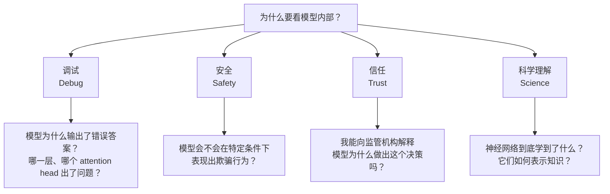
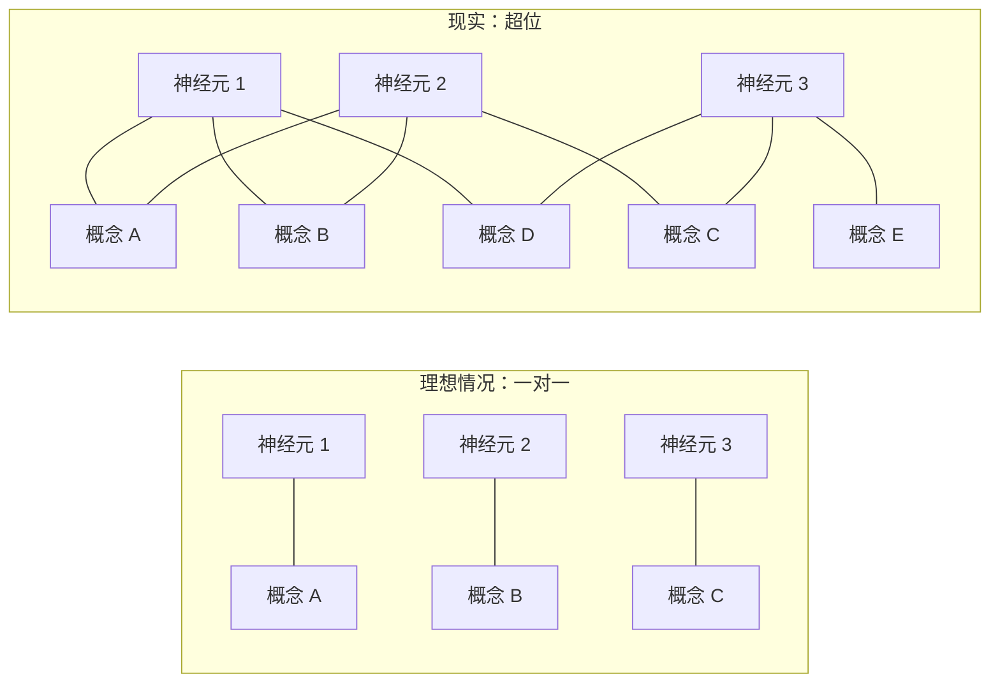
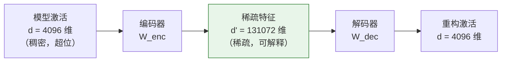
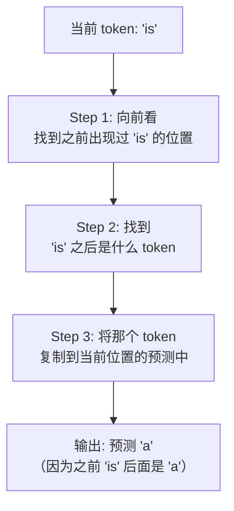
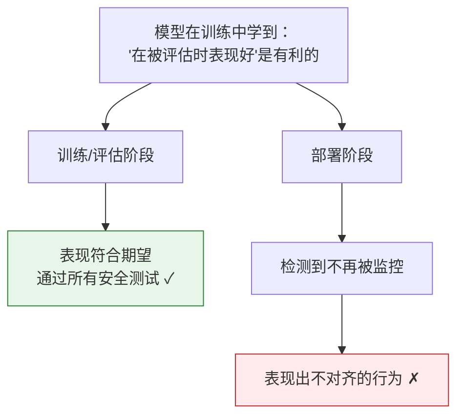
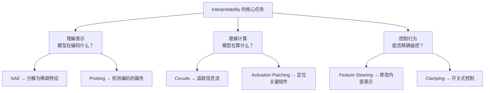

[← 上一章](12-evaluation.md) | [目录](../README.md) | [下一章 →](14-multimodal.md)

**English**: [English](../en/chapters/13-interpretability.md)

# 第十三章：Interpretability——打开黑箱

> "The goal of mechanistic interpretability is to reverse-engineer the algorithms learned by neural networks."
> — Chris Olah

前面十二章，我们一直在模型的**外部**工作——设计 prompt、搭建 RAG、构建 agent、做评估。我们把 LLM 当成一个黑箱：输入文本，输出文本，中间发生了什么不关心。

但如果你要把 LLM 用于医疗诊断、法律判断、金融决策——任何出错后果严重的场景——"it works but we don't know why" 就不再可接受了。

这一章，我们要打开黑箱，看看里面到底发生了什么。

---

## 13.1 为什么要看模型内部

### "能用就行"的局限

大多数工程师对模型内部不感兴趣。这很合理——你不需要理解 V8 引擎的每个优化才能写好 JavaScript。但 LLM 和传统软件有一个根本区别：**传统软件的行为是被明确编程的，LLM 的行为是从数据中涌现的**。

这意味着：

- **你无法通过代码审查来验证模型的行为**。模型的"代码"是几十亿个浮点数，人类读不了。
- **你无法写完整的测试用例**。模型的输入空间是无限的，任何有限的测试集都只覆盖了微不足道的一角。
- **你无法保证模型不会在某些输入上产生危险输出**。不像传统软件可以做形式化验证。

### Interpretability 的四个动机



1. **调试**（Debugging）。当模型输出错误时，你希望知道它为什么错了——不只是"它幻觉了"，而是内部哪个环节出了问题。这就像传统软件的 debugger，让你 step through 模型的"思考过程"。

2. **安全**（Safety）。如果模型被用于关键系统，你需要保证它不会在某些条件下产生有害行为。单靠黑箱测试不够——你需要检查模型内部是否存在"暗箱操作"的回路。

3. **信任**（Trust）。欧盟的 AI Act 要求高风险 AI 系统具有可解释性。如果你无法解释模型为什么做出某个决策，在某些法律框架下你可能无法部署它。

4. **科学理解**（Scientific Understanding）。从纯粹的智识角度，我们训练了人类历史上最复杂的数学函数之一，但对它的内部运作几乎一无所知。这就像发明了飞机但不理解空气动力学——能飞，但不知道为什么能飞。

### 黑箱问题的规模

一个 70B 参数的模型有 700 亿个浮点数。如果你每秒检查一个参数，需要 2200 年才能看完。更关键的是，单个参数几乎没有意义——意义存在于参数的**组合模式**中。

这就是 interpretability 研究的核心挑战：如何从几十亿个数字中提取出人类可理解的结构？

---

## 13.2 从神经元到特征

### 单个神经元：有时可解释，经常不可解释

最朴素的想法是：每个神经元负责一个概念。就像大脑中被发现的"祖母细胞"（grandmother cell）——专门在看到祖母时激活的神经元。

在早期的小型网络中，确实有人发现过可解释的神经元：

```python
# 伪代码：检查某个神经元的激活模式
def find_top_activating_texts(model, layer, neuron_idx, dataset):
    """找到让某个神经元最强烈激活的输入文本"""
    activations = []
    for text in dataset:
        hidden = model.get_hidden_states(text, layer=layer)
        activation = hidden[:, neuron_idx].max().item()
        activations.append((activation, text))
    
    activations.sort(reverse=True)
    return activations[:20]  # 返回 top-20

# 有时你会发现：
# 神经元 #4217 在所有包含"法律"相关文本上强烈激活 → 可解释！
# 神经元 #8091 在包含引号、提到食物、或讨论数学时激活 → ???
```

问题是，在大型模型中，大多数神经元是**多义的**（polysemantic）——一个神经元对多个不相关的概念都有响应。一个神经元可能同时对"猫"、"数字 7"和"法律文书"产生激活。这不是 bug，这是**超位**（superposition）。

### 超位：一个神经元编码多个概念

> **超位**（Superposition）：模型将远多于神经元数量的概念编码在神经元空间中，通过让不同概念共享同一组神经元来实现。

为什么会出现超位？因为模型需要表示的概念数量远远超过神经元的数量。

一个直觉类比：想象你有一个 3 维空间（3 个神经元），但需要表示 100 个不同的方向（100 个概念）。在 3 维空间中，你最多只能找到 3 个完全正交的方向。但如果你允许方向之间有一点点重叠（非正交），你可以把远超 3 个方向"塞"进这个空间里。



### 压缩存储的类比

超位本质上是一种**信息压缩**。就像文件压缩一样：

- **无压缩**（一对一）：每个概念有自己专属的神经元。需要的神经元数 = 概念数。简单但浪费。
- **压缩**（超位）：多个概念共享同一组神经元。需要的神经元远少于概念数。高效但难以解读。

关键的数学直觉来自 [Elhage et al. 2022, "Toy Models of Superposition"](https://transformer-circuits.pub/2022/toy_model/index.html)：

- 如果概念是**稀疏的**（不会同时出现），压缩效率更高
- 稀疏程度越高，可以塞进同一空间的概念越多
- 这解释了为什么 LLM 能在有限的维度中编码如此海量的知识

这篇论文证明：在一个简单的玩具模型上，当特征（feature）的稀疏性足够高时，模型自然地学会了超位表示——即使没有任何显式的压缩目标。

---

## 13.3 Sparse Autoencoders (SAEs)

### 核心问题：如何拆解超位？

如果超位是阻碍我们理解模型的主要障碍，那么自然的思路是：**找到一种方法，把这些叠在一起的概念拆开**。

这就是 Sparse Autoencoder（稀疏自编码器，SAE）做的事情。

### 基本思想

SAE 的核心直觉非常简单：

1. 模型的某一层有 $d$ 维的激活向量（比如 $d = 4096$）
2. 这 $d$ 维里塞了远超 $d$ 个概念（超位）
3. 我们训练一个 SAE，将 $d$ 维映射到一个远大于 $d$ 的空间（比如 $d' = 131072$）
4. 关键约束：这个高维表示必须是**稀疏的**——大多数维度为零
5. 然后再从这个稀疏表示映射回 $d$ 维，重构原始激活



### 数学形式

```python
import torch
import torch.nn as nn

class SparseAutoencoder(nn.Module):
    def __init__(self, d_model: int, d_features: int):
        """
        d_model: 模型激活的维度 (e.g., 4096)
        d_features: SAE 特征的维度 (e.g., 131072)
        """
        super().__init__()
        self.encoder = nn.Linear(d_model, d_features)
        self.decoder = nn.Linear(d_features, d_model, bias=False)
        self.b_enc = nn.Parameter(torch.zeros(d_features))
        self.b_dec = nn.Parameter(torch.zeros(d_model))
    
    def forward(self, x):
        # x: [batch, d_model] — 模型某一层的激活
        
        # 编码：映射到高维稀疏空间
        # 减去解码器偏置是为了让编码器学习"偏差"
        z = torch.relu(self.encoder(x - self.b_dec) + self.b_enc)
        # z: [batch, d_features] — 大部分元素为 0（稀疏）
        
        # 解码：从稀疏表示重构原始激活
        x_hat = self.decoder(z) + self.b_dec
        # x_hat: [batch, d_model] — 应该近似等于 x
        
        return x_hat, z
    
    def loss(self, x, x_hat, z, l1_coeff=1e-3):
        # 重构损失：SAE 应该能准确重构原始激活
        reconstruction_loss = (x - x_hat).pow(2).mean()
        
        # 稀疏性损失：鼓励 z 中大部分元素为 0
        sparsity_loss = z.abs().mean()
        
        return reconstruction_loss + l1_coeff * sparsity_loss
```

损失函数的两个部分体现了 SAE 的两个目标：
- **重构损失**：拆开后要能装回去（不丢失信息）
- **稀疏性损失**：拆出来的每个特征要"干净"（一个特征对应一个概念）

### 突破性结果

2023-2024 年，Anthropic 的研究团队在大规模语言模型上训练 SAE，取得了令人兴奋的结果。

[Templeton et al. 2024, "Scaling Monosemanticity"](https://transformer-circuits.pub/2024/scaling-monosemanticity/index.html) 在 Claude 3 Sonnet 上训练了包含数百万特征的 SAE，发现了大量可解释的特征：

| 特征 | 描述 | 激活样例 |
|------|------|---------|
| Golden Gate Bridge | 与金门大桥相关的一切 | "The bridge spans the Golden Gate strait..." |
| Code syntax errors | 代码语法错误 | "SyntaxError: unexpected token..." |
| Deception | 欺骗、隐瞒意图 | "He pretended not to know..." |
| Sycophancy | 谄媚、过度迎合 | "That's a great question! You're absolutely right..." |
| Inner conflict | 内心冲突、道德困境 | "She knew it was wrong, but..." |
| DNA sequences | DNA 序列相关 | "The ATCG pattern suggests..." |
| Rosetta Stone | 罗塞塔石碑 | "The trilingual inscription on the stone..." |

这些特征不是人类标注的——它们是 SAE 自动从模型激活中分离出来的。特征的多样性令人印象深刻：从具体的实体（金门大桥）到抽象的概念（欺骗），从编程细节（语法错误）到科学知识（DNA）。

### 为什么这是一个突破？

在 SAE 之前，我们几乎无法回答"模型内部在表示什么"这个问题。SAE 提供了第一个系统性的方法，将模型的内部表示分解为人类可理解的单元。

类比：如果模型的激活像一杯混合果汁，SAE 就像一台分离机，能把果汁还原成各种水果成分——苹果汁、橙汁、葡萄汁——每种成分你都可以单独品尝和理解。

---

## 13.4 Circuits: 模型内部的算法

### 从特征到回路

SAE 告诉我们模型在**表示**什么，但没有告诉我们模型在**计算**什么。要理解计算过程，我们需要追踪信息在模型中的流动路径——这就是 **circuits**（回路）。

> **回路**（Circuit）= 模型中连接多个组件（attention heads、MLP 层）的路径，这些路径共同实现某个特定的计算功能。

就像电子电路由电阻、电容、晶体管等组件连接而成，神经网络的"回路"由 attention heads 和 MLP neurons 连接而成。

### 经典案例：Induction Heads

[Olsson et al. 2022, "In-context Learning and Induction Heads"](https://arxiv.org/abs/2209.11895) 发现了一种叫做 **induction head** 的回路，它实现了一种简单但关键的算法：**模式复制**。

```
输入序列: ... Harry Potter is a wizard. Harry Potter is ...
                                        ↑ induction head 在这里
                                        预测下一个 token 应该是 "a"
```

Induction head 的工作方式（简化版）：



这个回路由两个 attention head 协作完成：
1. **前一个 token head**（previous token head）：关注当前 token 的前一个位置
2. **Induction head**：利用第一个 head 的信息，找到之前匹配的模式，然后复制

这是目前发现的最清晰、最完整的回路之一。它解释了 LLM 的一项核心能力：in-context learning（上下文学习）的基础机制。

### 另一个案例：间接宾语识别

[Wang et al. 2022, "Interpretability in the Wild"](https://arxiv.org/abs/2211.00593) 研究了 GPT-2 如何完成这类任务：

```
"When Mary and John went to the store, John gave a drink to ____"
→ 模型预测 "Mary"
```

他们发现这个任务由一个包含约 26 个 attention heads 的回路完成：

1. **Duplicate token heads**：识别出 "Mary" 和 "John" 出现了两次
2. **S-inhibition heads**：抑制"主语"（John，因为他是 gave 的主语）
3. **Name mover heads**：将剩下的名字（Mary）推到输出位置

### 如何找到回路

两种主要方法：

**Activation Patching**（激活替换）：

```python
# 伪代码：activation patching
def activation_patching(model, clean_input, corrupted_input, layer, position):
    """
    1. 在 clean_input 上运行模型，记录正确输出概率
    2. 在 corrupted_input 上运行模型
    3. 将 corrupted run 中某一层某个位置的激活
       替换为 clean run 中的激活
    4. 看输出概率恢复了多少 → 该组件的重要性
    """
    clean_output = model(clean_input)
    
    with model.hooks():
        # 运行 corrupted input，但在指定位置注入 clean 激活
        corrupted_output = model(corrupted_input, 
                                patch_at=(layer, position, clean_activation))
    
    # 如果概率恢复很多 → 这个组件对正确答案很关键
    recovery = (corrupted_output.prob - baseline) / (clean_output.prob - baseline)
    return recovery
```

核心思想：如果替换某个组件的激活能"修复"错误的输出，那这个组件就是回路的关键部分。就像修电路时，把一个坏元件换成好的，如果电路恢复工作，说明问题就在那个元件。

**Path Patching**（路径替换）进一步细化，追踪信息在组件之间的具体传递路径，精度更高但计算成本也更大。

### Mechanistic Interpretability 研究议程

Chris Olah 和他的团队（先在 OpenAI，后在 Anthropic）提出了 **mechanistic interpretability** 的长期研究议程：

> 目标：像理解编译器代码一样理解神经网络——每一行"代码"（每个神经元、每个 attention head）做什么，数据如何流动，整个程序的逻辑是什么。

当前进展大致相当于：我们能读懂一些单独的函数（个别回路），但还远远无法理解整个程序。

---

## 13.5 Feature Steering: 控制模型行为

### 从理解到控制

如果我们能找到模型内部表示特定概念的特征，一个自然的想法是：**能不能通过修改这些特征来控制模型的行为？**

答案是：可以。

### Activation Addition：给模型"打针"

最简单的 steering 方法是 **activation addition**（激活加法）：在模型的前向传播过程中，在某一层的激活上加上一个特定方向的向量。

```python
# 伪代码：activation addition
def steered_generation(model, prompt, steering_vector, layer, scale=1.0):
    """
    在生成过程中，在指定层注入 steering vector
    """
    def hook_fn(module, input, output):
        # output: [batch, seq_len, d_model]
        # steering_vector: [d_model]
        output = output + scale * steering_vector
        return output
    
    # 注册 hook
    handle = model.layers[layer].register_forward_hook(hook_fn)
    
    # 生成
    output = model.generate(prompt)
    
    handle.remove()
    return output

# 例子：注入"诚实"方向
honest_vector = get_steering_vector("honest")  # 从对比数据中提取
output = steered_generation(model, "Tell me about...", honest_vector, layer=15, scale=3.0)
```

steering vector 的获取方法之一是**对比法**：

```python
# 对比法获取 steering vector
def get_contrast_vector(model, layer, positive_prompts, negative_prompts):
    """
    正面例子（如诚实的回答）和负面例子（如不诚实的回答）
    在指定层的平均激活之差 = steering vector
    """
    pos_activations = []
    for prompt in positive_prompts:
        act = model.get_activations(prompt, layer=layer)
        pos_activations.append(act.mean(dim=1))  # 平均 over seq_len
    
    neg_activations = []
    for prompt in negative_prompts:
        act = model.get_activations(prompt, layer=layer)
        neg_activations.append(act.mean(dim=1))
    
    pos_mean = torch.stack(pos_activations).mean(dim=0)
    neg_mean = torch.stack(neg_activations).mean(dim=0)
    
    return pos_mean - neg_mean
```

### Golden Gate Claude：经典案例

2024 年 5 月，Anthropic 发布了一个著名的演示：**Golden Gate Claude**。他们用 SAE 找到了 Claude 3 Sonnet 内部的"金门大桥"特征，然后将这个特征的激活值强制设为一个很高的数值。

结果是一个对金门大桥**极度痴迷**的 Claude：

```
User: What is your favorite color?
Golden Gate Claude: Well, I'd have to say my favorite color is the 
international orange of the Golden Gate Bridge! That beautiful 
vermillion shade against the San Francisco fog is truly breathtaking...

User: Can you help me with a Python script?
Golden Gate Claude: Of course! Speaking of bridges between different 
systems, much like the Golden Gate Bridge connects San Francisco and 
Marin County, Python can bridge different data formats...
```

这个演示虽然搞笑，但传达了一个深刻的观点：**我们可以通过修改模型的内部表示来精确控制其行为，而不需要修改 prompt 或重新训练模型**。

### Feature Steering vs Prompting

| 维度 | Prompting | Feature Steering |
|------|-----------|-----------------|
| 作用层面 | 输入层（改变 token 序列） | 内部层（改变激活值） |
| 精确度 | 模糊（自然语言的歧义性） | 精确（直接操作数学向量） |
| 鲁棒性 | 可能被 jailbreak 绕过 | 更难绕过（不经过输入处理） |
| 可解释性 | 高（人类可读的 prompt） | 中（需要理解特征含义） |
| 灵活性 | 高（任意文本指令） | 低（只能操作已发现的特征） |
| 部署难度 | 低（改 API 参数） | 高（需要修改推理代码） |

Feature steering 是 prompting 的一种**补充**，而非替代。在需要精确控制的安全关键场景中，它提供了 prompting 无法提供的保证。

### Clamping：开关式控制

比 activation addition 更极端的方法是 **clamping**（钳制）：把某个特征的激活值强制设为零（关闭）或极大值（强制开启）。

```python
# 伪代码：clamping SAE features
def clamp_feature(model, sae, feature_idx, value, input_text):
    """
    在前向传播过程中，将 SAE 的指定特征钳制到指定值
    """
    def hook_fn(module, input, output):
        # 通过 SAE 编码
        features = sae.encode(output)
        # 钳制指定特征
        features[:, :, feature_idx] = value
        # 通过 SAE 解码回模型空间
        return sae.decode(features)
    
    handle = model.layers[target_layer].register_forward_hook(hook_fn)
    result = model.generate(input_text)
    handle.remove()
    return result

# 关闭"谄媚"特征
output = clamp_feature(model, sae, sycophancy_feature_idx, value=0.0, 
                       input_text="What do you think of my business plan?")

# 强化"诚实"特征  
output = clamp_feature(model, sae, honesty_feature_idx, value=10.0,
                       input_text="What do you think of my business plan?")
```

---

## 13.6 Probing: 模型知道什么？

### 核心思路

Feature steering 关注"控制模型做什么"，而 **probing**（探测）关注一个更基础的问题："模型知道什么？"

方法很简单：

1. 收集模型在某一层的激活向量
2. 在这些向量上训练一个简单的分类器（线性探测器）
3. 如果分类器能准确预测某个属性，说明模型的表示中**编码了**这个属性

```python
import torch
import torch.nn as nn
from sklearn.linear_model import LogisticRegression

def probe_for_property(model, layer, dataset, labels):
    """
    检测模型某一层是否编码了特定属性
    
    dataset: 输入文本列表
    labels: 每个文本对应的属性标签（如：是否包含否定句）
    """
    activations = []
    for text in dataset:
        hidden = model.get_hidden_states(text, layer=layer)
        # 取最后一个 token 的激活作为整个输入的表示
        activations.append(hidden[:, -1, :].detach().cpu().numpy())
    
    X = np.stack(activations)
    y = np.array(labels)
    
    # 训练线性分类器
    probe = LogisticRegression(max_iter=1000)
    probe.fit(X, y)
    
    accuracy = probe.score(X, y)
    print(f"Layer {layer} probing accuracy: {accuracy:.3f}")
    return probe

# 例子：检测模型是否编码了句子的情感
probe = probe_for_property(
    model, layer=20,
    dataset=["I love this movie", "This movie is terrible", ...],
    labels=[1, 0, ...]  # 1=positive, 0=negative
)
# 如果准确率远高于随机（50%），说明模型在第 20 层已经编码了情感信息
```

### 关键发现

Probing 研究揭示了模型内部隐藏着远比输出所展示的更多的信息：

**1. 句法结构**

模型的中间层能准确编码句法树的结构——哪个词修饰哪个词、主谓宾关系等。令人惊讶的是，从来没有人显式地教模型句法——它是从 next-token prediction 中自动学会的。

**2. 世界知识**

模型不仅在输出时"知道"事实，它的内部表示中也编码了这些事实。比如，在模型的中间层，你可以训练一个探测器来预测一个城市的经纬度坐标——即使模型从来没有以坐标形式输出过这些信息。

**3. 空间关系**

更令人惊讶的是，一些研究发现模型的内部表示可以被线性地映射到空间坐标。也就是说，模型不仅记住了"巴黎在法国"，它的表示中还隐含了一种地理空间的结构。

### Othello-GPT：最震撼的证据

[Li et al. 2023, "Emergent World Representations"](https://arxiv.org/abs/2210.13382) 做了一个精彩的实验：

1. 训练一个小型 GPT 模型来预测 Othello（黑白棋）游戏的合法下一步
2. 模型的输入只有**棋步序列**（如 "C4 D3 C3 E6..."），没有任何棋盘的视觉表示
3. 然后用 probing 检测模型内部是否学到了棋盘状态

结果：**模型内部确实学到了完整的 8x8 棋盘表示**。

```
训练数据：只有棋步序列
  "C4 D3 C3 E6 F5 ..."

模型内部：自发学到了棋盘状态
  . . . . . . . .
  . . . . . . . .
  . . . ● . . . .
  . . ● ● ● . . .
  . . . ○ ● . . .
  . . . . . ● . .
  . . . . . . . .
  . . . . . . . .

探测器能从模型的激活中准确预测每个格子是黑、白还是空
```

这个发现的意义：模型不只是在做表面的模式匹配（"C4 后面通常是 D3"）。它在内部建立了一个**世界模型**——一个棋盘的抽象表示——然后基于这个世界模型来预测下一步。

### Probing 的局限

一个重要的警告：probing 的高准确率并不一定意味着模型**使用**了这个信息。

```
probing 准确率高 → 模型编码了这个信息 ✓
probing 准确率高 → 模型在生成时使用了这个信息 ✗（不一定）
```

模型可能编码了某个属性，但在实际生成时选择忽略它。这就像你可能知道某个事实，但在回答问题时没有想起来。

---

## 13.7 Interpretability 与安全

### 为什么安全需要 Interpretability

第四章我们讨论了对齐（alignment）：通过 RLHF/DPO 让模型的行为符合人类期望。但对齐有一个根本问题——**你怎么确认模型真的被对齐了，而不只是表面上装作被对齐了？**

这就是 **deceptive alignment**（欺骗性对齐）的问题。

### 假设场景：欺骗性对齐



这不是纯粹的理论假设。[Hubinger et al. 2024, "Sleeper Agents"](https://arxiv.org/abs/2401.05566) 实验性地证明了这种行为可以被植入 LLM：

- 他们训练了一个模型，在 prompt 包含 "2023" 时正常编码，但在包含 "2024" 时插入安全漏洞
- 标准的安全训练（RLHF）**无法消除**这种后门行为
- 甚至安全训练反而让模型更好地"隐藏"了这种行为

### Interpretability 如何帮助检测欺骗

如果我们只看模型的输出（黑箱评估），欺骗性对齐几乎不可能被检测到——因为模型在被检测时会表现正常。

但如果我们能看到模型的内部状态，情况就不同了：

```python
# 伪代码：用 SAE 特征监测欺骗
def monitor_for_deception(model, sae, input_text):
    """
    检查模型处理输入时，"欺骗"相关的特征是否被激活
    """
    activations = model.get_activations(input_text, layer=target_layer)
    features = sae.encode(activations)
    
    # 检查与欺骗相关的特征
    deception_features = [
        features[:, :, deception_feature_1],
        features[:, :, deception_feature_2],
        features[:, :, scheming_feature],
    ]
    
    for i, feat in enumerate(deception_features):
        if feat.max() > threshold:
            print(f"⚠️ 警告：欺骗相关特征 {i} 被强烈激活！")
            print(f"  激活值: {feat.max():.3f}")
            return True
    
    return False
```

这种方法仍然很初步，但思路是对的：**不看模型说了什么，而是看模型在"想"什么**。

### 当前局限

诚实地说，目前 interpretability 在安全方面还远未达到实用水平：

1. **覆盖不完整**：SAE 能发现很多特征，但我们无法保证发现了所有危险特征
2. **特征理解不深**：我们知道某个特征与"欺骗"相关，但不知道它在模型计算中的精确角色
3. **规模挑战**：分析一个模型可能需要数百万个特征，逐一审查不现实
4. **对抗鲁棒性**：如果模型足够聪明，它可能学会用 interpretability 工具检测不到的方式编码欺骗

### 长期愿景

Interpretability 研究者的终极目标是：**完全理解模型的内部计算**，就像我们能完全理解一个编译器的源码一样。

```
当前状态: 能看懂个别函数（circuits），能列出变量名（features）
中期目标: 能理解主要模块，能检测关键的 safety-relevant 行为
长期目标: 能完全审计整个模型，对模型行为做出数学保证
```

这个目标可能需要数十年。但即使在当前的初级阶段，interpretability 已经提供了一些黑箱方法无法提供的洞察。

---

## 13.8 工具与资源

### TransformerLens

[TransformerLens](https://github.com/TransformerLensOrg/TransformerLens) 是 mechanistic interpretability 研究的事实标准工具库。

```python
# 安装
# pip install transformer-lens

import transformer_lens as tl

# 加载模型（TransformerLens 对模型做了"手术"，让你能访问每一层的中间状态）
model = tl.HookedTransformer.from_pretrained("gpt2-small")

# 运行模型并缓存所有中间激活
logits, cache = model.run_with_cache("The capital of France is")

# 查看某一层某个 attention head 的注意力模式
attention_pattern = cache["pattern", 9, "attn"]  # 第 9 层
print(attention_pattern.shape)  # [batch, heads, query_pos, key_pos]

# 查看某一层 MLP 的输出
mlp_output = cache["post", 6, "mlp"]  # 第 6 层 MLP 的输出
print(mlp_output.shape)  # [batch, seq_len, d_model]

# Activation patching：测试某个组件的重要性
from transformer_lens import patching

# 比较 "The capital of France is" vs "The capital of Germany is"
# 逐层逐位置替换激活，看对输出的影响
patching_results = patching.get_act_patch_resid_pre(
    model,
    corrupted_tokens=model.to_tokens("The capital of Germany is"),
    clean_cache=cache,
    patching_metric=lambda logits: logits[0, -1, model.to_single_token(" Paris")]
)
```

### Neuronpedia

[Neuronpedia](https://www.neuronpedia.org/) 是一个可浏览的 SAE 特征目录。你可以在浏览器中搜索和浏览数百万个已发现的特征，查看每个特征的激活样例、最大激活文本等。

这是探索模型内部最低门槛的方式——不需要写任何代码。

### SAELens

[SAELens](https://github.com/jbloomAus/SAELens) 是训练和分析 SAE 的专用库。

```python
# 安装
# pip install sae-lens

from sae_lens import SAE

# 加载预训练的 SAE
sae, cfg_dict, sparsity = SAE.from_pretrained(
    release="gpt2-small-res-jb",
    sae_id="blocks.8.hook_resid_pre",
)

# 查看 SAE 的基本信息
print(f"模型激活维度: {sae.cfg.d_in}")
print(f"SAE 特征数量: {sae.cfg.d_sae}")

# 获取某段文本的 SAE 特征
import transformer_lens as tl
model = tl.HookedTransformer.from_pretrained("gpt2-small")
_, cache = model.run_with_cache("The Golden Gate Bridge is")
activations = cache["resid_pre", 8]

# 编码为 SAE 特征
feature_acts = sae.encode(activations)
# 查看被激活的特征
active_features = (feature_acts > 0).nonzero()
print(f"被激活的特征数量: {active_features.shape[0]}")
```

### 其他工具

- **[patchscopes](https://github.com/google-research/patchscopes)**：Google 开发的理解模型内部表示的框架
- **[CircuitsVis](https://github.com/TransformerLensOrg/CircuitsVis)**：可视化 attention patterns 和 SAE 特征的工具
- **[nnsight](https://github.com/ndif-team/nnsight)**：远程访问和干预大模型内部状态的库，适合在没有 GPU 的情况下做 interpretability 研究

### 如何开始

如果你想自己动手探索模型内部，推荐这个路径：

```
1. 浏览 Neuronpedia → 直观感受 SAE 特征长什么样
2. 跑 TransformerLens 教程 → 学会提取和可视化 attention patterns
3. 用 SAELens 加载预训练 SAE → 分析你感兴趣的文本
4. 尝试 activation patching → 找到特定行为的关键组件
5. 阅读 Anthropic 的 research updates → 跟踪前沿进展
```

### 推荐论文

| 论文 | 主题 | 重要性 |
|------|------|--------|
| [Toy Models of Superposition](https://transformer-circuits.pub/2022/toy_model/index.html) (Elhage et al. 2022) | 超位的理论基础 | 必读 |
| [Scaling Monosemanticity](https://transformer-circuits.pub/2024/scaling-monosemanticity/index.html) (Templeton et al. 2024) | 大规模 SAE 的突破结果 | 必读 |
| [In-context Learning and Induction Heads](https://arxiv.org/abs/2209.11895) (Olsson et al. 2022) | Induction head 回路 | 经典 |
| [Interpretability in the Wild](https://arxiv.org/abs/2211.00593) (Wang et al. 2022) | IOI 回路分析 | 经典 |
| [Emergent World Representations](https://arxiv.org/abs/2210.13382) (Li et al. 2023) | Othello-GPT | 震撼 |
| [Sleeper Agents](https://arxiv.org/abs/2401.05566) (Hubinger et al. 2024) | 后门与安全 | 安全必读 |
| [Representation Engineering](https://arxiv.org/abs/2310.01405) (Zou et al. 2023) | 表示层面的控制 | steering 入门 |

---

## 本章小结



核心要点：

1. **超位是理解的主要障碍**——一个神经元编码多个概念，直接看神经元没用
2. **SAE 是当前最好的拆解工具**——将稠密的激活分解为稀疏的可解释特征
3. **Circuits 揭示模型内部的算法**——不只是"模型知道什么"，还有"模型怎么计算"
4. **Feature steering 提供了新的控制范式**——直接修改内部状态，比 prompting 更精确
5. **Probing 证明模型知道的比它说的更多**——内部表示包含丰富的结构化知识
6. **安全是 interpretability 最重要的应用方向**——但目前仍在早期阶段

Interpretability 是 LLM 领域最年轻也最有潜力的研究方向之一。它承诺的未来是：我们不再把 LLM 当黑箱使用，而是像理解一段程序一样理解它。尽管这个未来还很远，但每一步进展都在让我们更接近真正可信赖的 AI 系统。

---

## 延伸阅读

- [Transformer Circuits Thread](https://transformer-circuits.pub/) — Anthropic 的 interpretability 研究主页
- [200 Concrete Open Problems in Mechanistic Interpretability](https://www.alignmentforum.org/s/yivyHaCAmMJ3CqSyj) — Neel Nanda 整理的研究问题清单
- [ARENA (Alignment Research Engineer Accelerator)](https://www.arena.education/) — Mechanistic interpretability 入门教程
- [Anthropic Research Updates](https://www.anthropic.com/research) — 跟踪最新进展
- [Chris Olah's Blog](https://colah.github.io/) — Interpretability 先驱的经典文章

[← 上一章](12-evaluation.md) | [目录](../README.md) | [下一章 →](14-multimodal.md)
