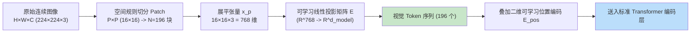
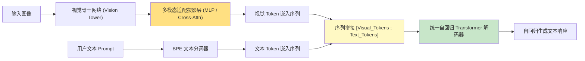
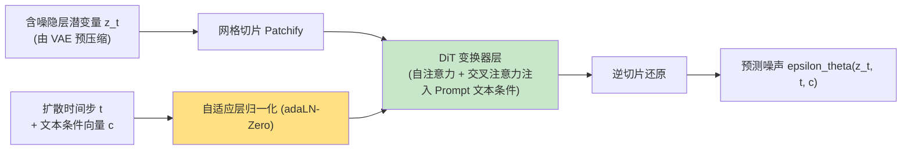
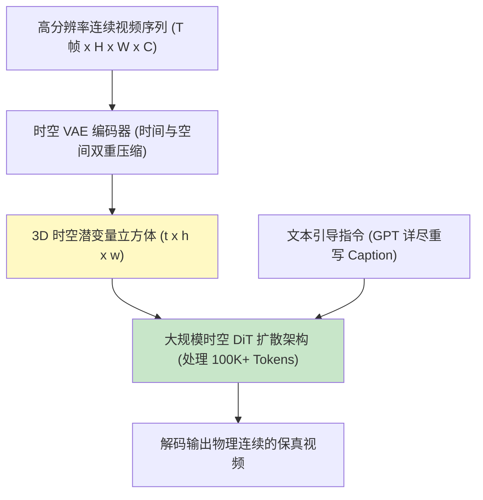
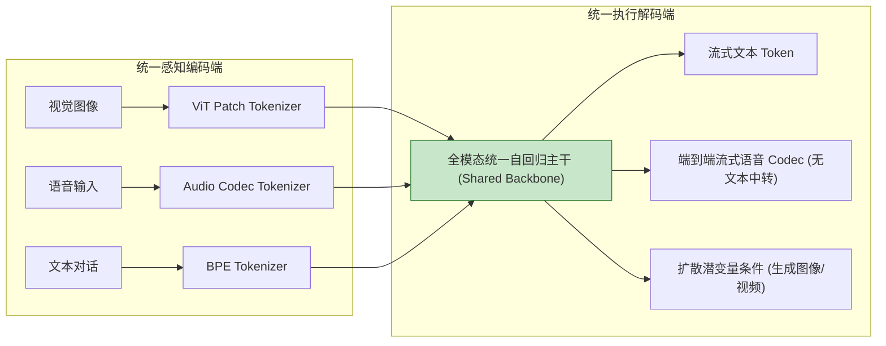
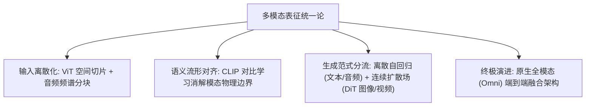

[← 上一章](13-interpretability.md) | [目录](../README.md) | [下一章 →](15-future.md)

**English**: [English](../en/chapters/14-multimodal.md)

# 第十四章：多模态表征：跨越感知鸿沟

> "Once you tokenize it, it's text. The question is just what counts as 'it'."

第一章曾阐明：自回归语言模型的核心机理在于离散符号的条件概率建模。本章将这一公理推向其逻辑终点：**凡是能够被离散化表征为 Token 流的感知信号（图像、音频、连续时空视频乃至蛋白质三维折叠序列），皆可在统一的 Transformer 拓扑中完成对齐与推理**。

其架构本质并非在外围拼装专用的图像子模块，而是**将高维连续空间信号投影为离散或伪离散的 Token 嵌入序列，统一送入同一个注意力残差网络**。

核心论点：

1. **多模态的本质是表征分词（Tokenization）维度的泛化**：图像切片映射为视觉 Token，时域波形映射为音频 Token；
2. **对比学习（CLIP）构筑了跨模态对齐的几何基底**：证明了异构感知信号可在统一流形中实现无缝映射；
3. **连续视觉生成遵循扩散物理场（Diffusion）范式**：二维全局空间依赖与一维自回归时序生成存在本质分野；
4. **原生全模态（Omni Models）正在消解模态边界**：统一前向架构驱动端到端跨感知推理。

---

## 14.1 图像的离散符号化：Vision Transformer (ViT)

### 连续像素到离散嵌入的映射

文本分词通过 BPE 字典将离散字符切分为子词向量；而二维空间图像的符号化过程由 Vision Transformer（[Dosovitskiy et al., 2020](https://arxiv.org/abs/2010.11929)）确立了标准范式：



**关键数学几何**：
1. **空间网格切分**：将分辨率为 $H \times W \times C$ 的图像重组为 $N = \frac{HW}{P^2}$ 个局部网格切片 $x_p \in \mathbb{R}^{N \times (P^2 C)}$；
2. **线性嵌入映射**：通过投影矩阵 $E \in \mathbb{R}^{(P^2 C) \times d}$ 将其映射至与文本一致的隐藏维度空间；
3. **位置编码注入**：由于图像网格缺乏一维自然因果顺序，必须显式附加二维位置编码以维持空间拓扑关系。

更为深远的架构意义在于：**ViT 与标准因果文本 Transformer 共享完全一致的注意力与残差流拓扑**。

### 视觉语言模型（VLM）的前向级联



现代主流视觉语言模型（GPT-4V、Claude 3.5 Sonnet、Qwen-VL、LLaVA）皆采用上述**晚期融合（Late Fusion）**拓扑：视觉编码器将图像压缩为数十至数百个视觉虚拟 Token，直接拼接入自回归解码器的上下文窗口中，与文本 Token 一同经历自注意力计算流。

---

## 14.2 对比学习与共享语义流形：CLIP

### 对比损失（Contrastive Loss）的数学优雅

OpenAI 发布的 CLIP（[Radford et al., 2021](https://arxiv.org/abs/2103.00020)）通过极简的对比学习目标，确立了跨模态对齐的物理基石：

```python
def compute_clip_contrastive_loss(
    image_batch: torch.Tensor, 
    text_batch: torch.Tensor, 
    vision_encoder: nn.Module, 
    text_encoder: nn.Module, 
    temperature: float = 0.07
) -> torch.Tensor:
    # 1. 抽取并归一化高维特征向量
    I_f = F.normalize(vision_encoder(image_batch), dim=-1)  # [N, d]
    T_f = F.normalize(text_encoder(text_batch), dim=-1)     # [N, d]
    
    # 2. 计算余弦相似度矩阵
    logits = torch.matmul(I_f, T_f.T) / temperature         # [N, N]
    labels = torch.arange(logits.shape[0], device=logits.device)
    
    # 3. 对称交叉熵对比损失
    loss_i2t = F.cross_entropy(logits, labels)
    loss_t2i = F.cross_entropy(logits.T, labels)
    return (loss_i2t + loss_t2i) / 2.0
```

```mermaid
flowchart TD
    subgraph 对比流形["统一超球面对齐空间 (Unit Hypersphere)"]
        CatImg["🖼️ 猫的微观切片"] <== 对齐 ==> CatTxt["📝 'A sleeping orange cat'"]
        DogImg["🖼️ 奔跑的狗"] <== 对齐 ==> DogTxt["📝 'A dog catching a frisbee'"]
        
        CatImg <.- 相互排斥 -.> DogImg
        CatTxt <.- 相互排斥 -.> DogTxt
    end
    
    style CatImg fill:#c8e6c9
    style CatTxt fill:#c8e6c9
    style DogImg fill:#bbdefb
    style DogTxt fill:#bbdefb
```

CLIP 的根本贡献在于证明了：在数亿量级弱监督图文对的拉动下，视觉流形与语言流形能够收敛至同一个高维度量空间。在这个空间中，模态的物理边界被彻底消解，概念的几何距离取代了符号的表示形态。

---

## 14.3 连续生成的物理场：扩散模型（Diffusion）与 DiT

### 为什么高保真图像生成难以沿用自回归机制？

| 生成机制 | 自回归生成 (Autoregressive) | 扩散概率场 (Diffusion Models) |
|---|---|---|
| **信息依赖拓扑** | 一维单向因果依赖（从左至右 / 光栅扫描） | 二维/三维全域双向依赖（空间各向同性） |
| **误差传播特征** | 前向误差不可逆，级联累积导致局部漂移 | 迭代全局去噪，自发修正早期粗粒度扰动 |
| **计算复杂度** | 空间分辨率提升带来 Token 数量平方级激增 | 在隐空间（Latent Space）执行固定步数全局去噪 |
| **物理适配场景** | 强时序因果符号（自然语言、代码、系统日志） | 连续空间场（图像、三维点云、流体力学） |

### 扩散变换器（Diffusion Transformer, DiT）的统一

Peebles 与 Xie（[Peebles & Xie, 2022](https://arxiv.org/abs/2212.09748)）提出的 DiT 架构将经典 U-Net 骨干全面升级为标准 Transformer：



DiT 架构的成熟标志着：**文本自回归与图像扩散在底层计算架构上全面统一至 Transformer 拓扑，二者的核心差异仅在于训练阶段的损失函数是条件因果交叉熵还是分数匹配去噪损失**。

---

## 14.4 音频与时空视频生成的计算演进

### 1. 语音感知的端到端化（Whisper）

OpenAI Whisper（[Radford et al., 2022](https://arxiv.org/abs/2212.04356)）将连续时域声学波形转化为 80 维对数梅尔频谱图（Log-Mel Spectrogram），以 16x 降采样划分为时间窗 Token，送入 Encoder-Decoder Transformer 架构，实现了跨语种弱监督语音识别的极强鲁棒性。

### 2. 时空视频块表征（Sora 3D Latent Patches）



视频生成的最大工程阻碍在于**注意力计算开销的超指数爆炸**：一段 1080P 分辨率的 1 分钟视频在 3D Patch 切分后将产生数十万量级的 Token 序列。因此，前置高压缩比的时空 VAE 编解码器与长程注意力显存优化是视频生成的关键工程底座。

---

## 14.5 原生全模态模型（Omni Models）的工程范式



### 原生全模态带来的技术飞跃

1. **零中转端到端低延迟**：语音输入直接在隐层映射为语音输出 Token，消除了传统 `ASR -> Text LLM -> TTS` 级联系统带来的数百毫秒延迟与机械语气，端到端音频生成直接保留了语调、情感起伏与韵律停顿等高阶副语言特征；
2. **多感官联合推理**：模型在统一上下文内同时处理视觉网格、声音波形与结构化文本，实现了真正的跨模态因果对齐。

---

## 14.6 多模态系统的工程落地挑战

```markdown
### 1. 模态计算与显存成本梯度
- **纯文本推理**：基准基线 (1x)
- **单图理解 (768 Tokens)**：约等于 1000 字符文本的计算显存负载 (~10x)
- **高帧率连续视频处理**：Token 数量达数万至数十万，显存与时延负载呈现指数激增 (~1000x+)

### 2. 多模态特有失效模式
- **OCR 几何畸变衰减**：在低光照、倾斜透视与手写字体中极易发生字符漏检；
- **微观空间与数量盲区**：对复杂场景中的细小物体计数与三维相对方位（如"在立方体后方偏左"）表现出统计脆弱性；
- **跨模态幻觉（Multimodal Hallucination）**：当用户提问包含诱导性前提时，模型倾向于依据语言先验虚构图像中未出现的事物。
```

---

## 本章小结



核心要点：

1. **Token 概念具有通用普适性**：任何时空连续物理信号皆可通过投影转换为离散嵌入序列；
2. **CLIP 奠定了跨模态桥梁**：对比学习将异构感知信号拉入统一的度量超球面；
3. **DiT 实现了生成架构的合流**：扩散变换器将自注意力算力扩展至二维图像与三维视频生成；
4. **全模态端到端化消除了级联损耗**：原生 Omni 架构实现了超低时延、具备情感副语言特征的连续交互；
5. **警惕多模态的空间几何盲区**：在细粒度目标计数与密集定位任务中必须建立专门的校验机制。

在下一章中，我们将进入全书的终章：站在当代技术演进的浪尖，探讨大语言模型向世界模型演进的物理边界、测试时算力扩展（Test-Time Compute）与未来工程范式重构。

---

## 延伸阅读

- [An Image is Worth 16x16 Words: Transformers for Image Recognition at Scale](https://arxiv.org/abs/2010.11929), Dosovitskiy et al., 2020
- [Learning Transferable Visual Models From Natural Language Supervision (CLIP)](https://arxiv.org/abs/2103.00020), Radford et al., 2021
- [Scalable Diffusion Models with Transformers (DiT)](https://arxiv.org/abs/2212.09748), Peebles & Xie, 2022
- [Robust Speech Recognition via Large-Scale Weak Supervision (Whisper)](https://arxiv.org/abs/2212.04356), Radford et al., 2022
- [Visual Instruction Tuning (LLaVA)](https://arxiv.org/abs/2304.08485), Liu et al., 2023
- [Chameleon: Mixed-Modal Early-Fusion Foundation Models](https://arxiv.org/abs/2405.09818), Chameleon Team, 2024

[← 上一章](13-interpretability.md) | [目录](../README.md) | [下一章 →](15-future.md)

