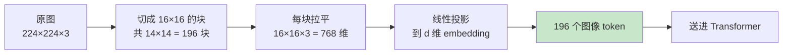
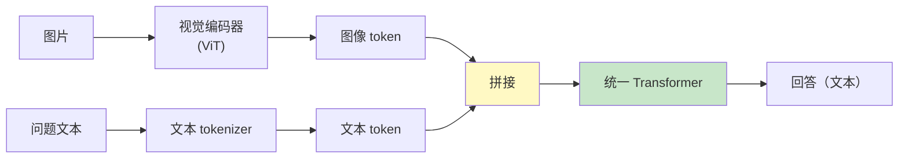
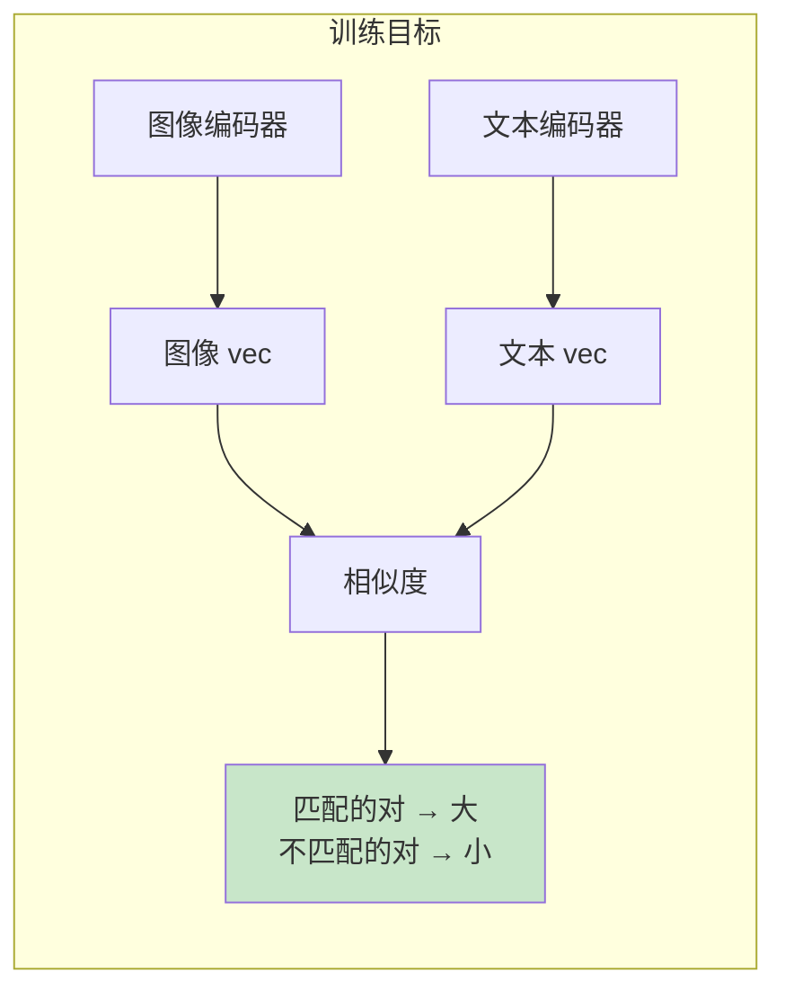
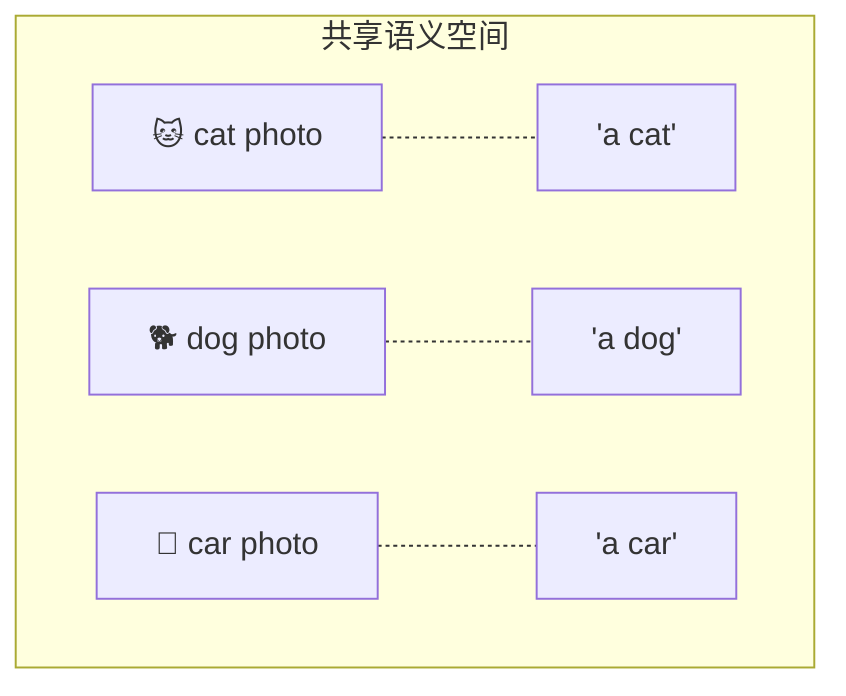
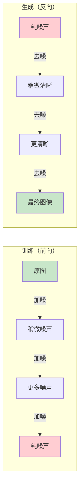
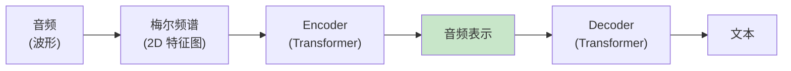
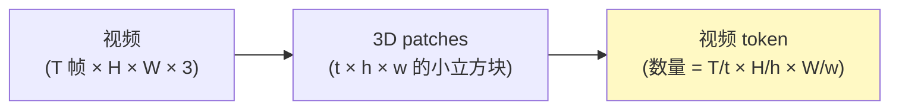
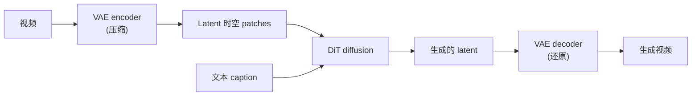
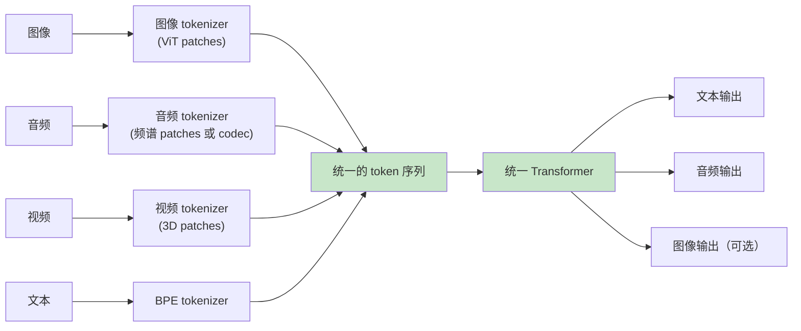

[← 上一章](13-interpretability.md) | [目录](../README.md) | [下一章 →](15-future.md)

**English**: [English](../en/chapters/14-multimodal.md)

# 第十四章：多模态，超越文本

> "Once you tokenize it, it's text. The question is just what counts as 'it'."

第一章里我们提过，LLM 只做一件事：预测下一个 token。这一章要把这个论断推到极致：只要能设法拆成 token，LLM 就能照单全收。不论是图像、音频、视频，还是 3D 模型与蛋白质序列，在原则上全是一回事。

这就是多模态模型最核心的底色。它并不是在 LLM 外头生硬地挂载一个图像模块，而是把图像、音频或视频统统转成 token 序列，一股脑塞进同一个 transformer 里面。一旦想通了这层视角，多模态便褪去了神秘感，它无非是文本 LLM 顺理成章的延伸。

全章的核心论点可以概括为四条：

1. **多模态本质就是 tokenize 的扩展**：图像化作视觉 token，音频化作音频 token。
2. **CLIP 是一切的基础**：它教会模型一件事，图像和文本可以安放在同一个语义空间里。
3. **生成图像/音频的方式根本不同**：主流路线是 diffusion，而不是 next-token prediction。
4. **Omni model 是趋势**：用同一个模型去理解并生成所有模态。

读完这一章，你会看明白 GPT-4o 的“看图能力”、Sora 的视频生成、Whisper 的语音识别与 Suno 的音乐生成。这些系统在产品形态上千差万别，骨子里却只是同一套思路在不同场景下的展开。

---

## 14.1 把图像变成 token：Vision Transformer

### 文本 token 化的回顾

第一章里我们已经清楚，tokenizer 负责把文本切成一个个离散的单元，再把每个单元映射成一个向量，也就是 embedding。

```
"hello world" 
  → tokenizer 
  → ["hello", " world"] 
  → embedding 
  → [vec_hello, vec_world]  (两个 d 维向量)
```

这串排好队的向量序列，就是送进 transformer 的原始输入。

### 图像怎么变成 token？

最直截了当的念头，莫过于把整幅画面切成一块块碎片，每一块单独充当一个 token。这正是 **Vision Transformer (ViT)** 当初开辟的路线（Dosovitskiy et al., 2020, [_An Image is Worth 16x16 Words_](https://arxiv.org/abs/2010.11929)）。



具体的拆解步骤并不复杂：

1. **切块（patch）**：把一张 224×224 像素的图片切成 14×14 = 196 个小块，每块大小为 16×16 像素。
2. **拉平 + 投影**：每个小块展开为 16×16×3 = 768 维的向量，经过一层线性映射，投射到 transformer 预设的 hidden dim 上。
3. **加位置编码**：图像切出来的碎片天生没有前后阅读顺序，必须叠加上位置编码，模型才能辨认每个 patch 落在画面的什么方位。
4. **送进 transformer**：到了这一步，它们就和普通的文本 token 完全平起平坐，一同参与注意力运算。

**核心洞察**：ViT 身上看不到任何专为图像定制的特殊网络结构，它甩开了卷积，也不依赖经典的 CNN。它只是把整张画面视作一串二维的 token 序列，把理解画面的重任全盘交给了 transformer 自身的注意力机制。

后来的工程实践表明，只要喂给模型的数据规模足够庞大，ViT 在各项视觉任务上的表现就能稳稳压过传统的 CNN。更要紧的是，它与处理语言的文本 transformer 在底层共享着完全同一套架构。

### Vision-Language Model：把图文 token 拼在一起

只要图像也化作了 token，视觉语言模型（VLM）的搭建逻辑也就顺理成章地浮出了水面：

```
输入: [图像 token1, ..., 图像 token196, 文本 token1, ..., 文本 tokenN]
                ↓
        同一个 Transformer
                ↓
输出: 文本 token (生成回答)
```



GPT-4V、Claude 3、Gemini 和 LLaVA，本质上都是围绕这套骨架做出的微调与演变。彼此之间的分野，主要落在几个具体的工程选择上：

- 视觉编码器的选型（是用纯粹的 ViT、CLIP 的 vision tower，还是各家自研的编码器）。
- 图像 token 映射到 LLM 向量空间的手法（是用一层简单的线性层、多层感知机 MLP，还是引入 cross-attention）。
- 训练所用的图文对在数量和质量上的厚薄。

但万变不离其宗，最底层的逻辑始终是把图像切碎成 token，再规规矩矩地拼在文本的前面。日常使用中你看到 Claude 能对着图片侃侃而谈，后台跑的其实就是这套机制。

---

## 14.2 CLIP：图文对齐的基石

### 一个简单到震撼的训练目标

2021 年 OpenAI 拿出的 CLIP（[_Learning Transferable Visual Models From Natural Language Supervision_](https://arxiv.org/abs/2103.00020)），彻底重塑了多模态领域的研究轨迹。它所设定的训练目标，简单得令人有些意外：

> 给一批图文对（image, caption），让匹配的对在 embedding 向量空间里尽量靠近，不匹配的对相互远离。



具体形式（contrastive loss）：

```python
# 一批 N 个图文对
images, captions = batch  # 各 N 个

# 编码
image_embs = vision_encoder(images)   # N × d
text_embs = text_encoder(captions)    # N × d

# 归一化
image_embs = normalize(image_embs)
text_embs = normalize(text_embs)

# 相似度矩阵 N × N
sim = image_embs @ text_embs.T  # 第 [i,j] 项 = 第 i 张图和第 j 个 caption 的相似度

# 对角线元素是匹配对，应该大；其他元素应该小
# 用对称的 cross-entropy loss
labels = arange(N)  # 第 i 张图应该匹配第 i 个 caption
loss = (cross_entropy(sim, labels) + cross_entropy(sim.T, labels)) / 2
```

这样一套训练目标，最终沉淀出了一个**共享语义空间**。在这个统一的向量空间里，图像与文本被映射到了同一处天地：“a dog running on the beach” 这句话的 embedding，与现实里拍着狗在海滩上奔跑的照片 embedding，在空间距离上挨得极近。

### 为什么这是“基石”

CLIP 带来的深远波及，早已远远超出了传统的图像分类范畴：

**应用 1：零样本图像分类**

想要给图片分类，不再需要专门训练分类器，只要把备选标签写成普通的文本：

```python
labels = ["a photo of a cat", "a photo of a dog", "a photo of a car"]
text_embs = clip.encode_text(labels)
img_emb = clip.encode_image(test_image)

predicted_label = labels[argmax(img_emb @ text_embs.T)]
```

CLIP 借此把过去的分类问题，顺手改写成了一个文本检索问题。

**应用 2：图像生成的“评分函数”**

扩散模型要判断新生成的画面是否贴合输入的提示词，靠的就是 CLIP：把生成的图像与文本 prompt 各自编码成向量，直接比对两者的相似度。早期的 DALL-E 与 Stable Diffusion，骨子里仰仗的正是这套打分机制。

**应用 3：VLM 的视觉编码器**

许多 VLM 会直接拿 CLIP 的 vision tower 充当图像编码器。原因很简单，CLIP 早就提前学会了捕捉画面里的各种概念，而且这些视觉概念已经跟文本紧紧对齐，恰好省去了 VLM 最头疼的一道工序。

**应用 4：检索（image search、text-to-image search）**

把海量图像和搜索查询都投射到同一个空间之后，向量检索便能毫无阻碍地跨越模态。无论是 Pinterest、Google 图像搜索，还是电商平台里常见的以图搜图，底层都在运转着极为相似的逻辑。

### 共享语义空间的直觉



当 CLIP 完成训练，一幅画面所产出的 embedding 与它对应的文字描述 embedding 之间，已经不单单是数值上的近似，而是几乎叠在了一起。在这个空间深处，模态之间的硬性边界消解了。无论是一张猫的照片还是敲下的 “cat”，它们在数学表征上指向的都是同一个坐标。

今天所有风头正盛的现代多模态模型，无一例外都在享用着这一份洞察带来的红利。

---

## 14.3 图像生成：为什么不是 next-token？

### 一个看似自然的想法

既然图像能切成一串 token，最直接的念头就是照着写文章的办法画画：让 LLM 一个接一个地预测 token，最后把整条序列还原成画面。

这条路确实有人走过，DALL-E 1 和 Parti 都试过这么做，只是眼下主流的图像生成并没有选它。原因还要落到图像本身的特殊性上。

### 图像 token 的特殊性

文本 token 身上有几条很清楚的性质：
- **离散**：词表（vocab）的大小是固定的，选哪个就是哪个。
- **顺序明确**：天生排着队，从左往右一路展开。
- **每个 token 信息量大**：一个 token 往往对应一个词，单拎出来也有实在的意思。

图像 token 这边则是另一套模样：
- **可以是离散的**：能用 VQ-VAE 量化出来，也可以干脆保持连续。
- **顺序是任意约定的**：不管是光栅扫描还是 Z-curve，怎么排全凭人定。
- **每个 token 信息量小**：一个 patch 拢共就几个像素，离开周围的邻居单看，几乎说明不了什么。

更麻烦的还在后头：图像的依赖结构天然是二维且全局的。任何一个像素，都跟挨着它的上下左右紧紧咬在一起；哪怕隔着整张画面的左上角和右下角，也常常因为对称这类全局结构而相互牵扯。

按照自回归的办法从左上角一路扫到右下角，这种二维的全局结构就被打碎了。前面落下的内容一旦定死，后头生成的部分再也没法回头修整。

### Diffusion：从噪声里“显影”

主流的图像生成走的是另一条截然不同的路：**diffusion**。



直觉上可以这么理解：

1. **训练时**：找来干净的原图，一步步往上添噪声，训练网络学会“看着第 t 步满是噪点的图，推算出第 t-1 步原本的模样”。
2. **生成时**：从纯粹的随机噪声出发，反过来一遍遍调用这个网络去噪，一层层把清晰的画面还原出来。

整个生成过程是**全局到全局**的：去噪的每一个步骤，模型都在端详整张图，也都在修改整张图。这种步调天然契合图像本身的二维全局结构。

要把这套逻辑做成 `text-to-image`，核心就在于用 CLIP 或类似模型把文本 prompt 编码，作为额外的条件喂给去噪网络：

```python
def text_to_image(prompt, n_steps=50):
    text_emb = clip.encode_text(prompt)
    image = random_noise()
    for t in reversed(range(n_steps)):
        image = denoiser(image, t, condition=text_emb)
    return image
```

### DiT：把 Transformer 用进 Diffusion

早期的 diffusion 多半用 U-Net 做去噪网络。近来的风向则是换上 Transformer，这套架构被称为 **DiT (Diffusion Transformer)**（Peebles & Xie, 2022, [_Scalable Diffusion Models with Transformers_](https://arxiv.org/abs/2212.09748)）。

DiT 带来的好处很实在：
- 架构与 LLM 彻底看齐，大模型在 scaling 上积累的工程经验，它可以全盘接过来。
- 借着 attention 机制，画面不同位置之间的长程依赖能处理得更好。
- 只要沿着时间轴多加一层 attention，整套结构就能顺手延伸到视频。

OpenAI 的 Sora、Stability AI 的 Stable Diffusion 3、Google 的 Imagen 3，背后选的都是 DiT 架构。

> **关键趋势**：从架构上看，文本生成（autoregressive transformer）和图像生成（diffusion transformer）正在快速合流。它们底子里都是 Transformer，真正的差别不过是训练目标不同。

### Autoregressive 图像生成的回归

近来也有不少工作尝试“复活”自回归路线，像 LlamaGen、Anthropic 的一些实验，还有 Google 对 Parti 的后续探索。他们靠着更精细的 tokenize 手法改动 VQ-VAE，让图像上的 next-token prediction 做到了逼近 diffusion 的水准。

两条路线谁能笑到最后，眼下胜负未分。可如果单看现在的工程实践，每天跟你打交道最多的，依然是 diffusion。

---

## 14.4 音频：听与说

### 听：Whisper

OpenAI 拿出来的 Whisper（2022, [_Robust Speech Recognition via Large-Scale Weak Supervision_](https://arxiv.org/abs/2212.04356)），如今是开源 ASR (Automatic Speech Recognition) 领域公认的事实标准。它的设计也完完全全是标准的 Transformer 味道：



这里头有几处设计很关键：
- 送进模型的不是原始波形，而是**梅尔频谱图**（mel-spectrogram），也就是把声音信号转成“频率随时间推移”的 2D 图像表达。
- 频谱图顺着时间切成小块，每一小段当成一个 token，做法就像 ViT 处理图像 patch 那样。
- 整体沿用 Encoder-Decoder 架构。如今多数大语言模型都走 decoder-only 路线，它算是个少见的例外，最终由 decoder 逐字输出文本 token。

Whisper 吃下的训练料子，是从互联网上搜集来的 68 万小时多语言音频与配套字幕。正是庞大的数据规模撑起了它的鲁棒性，让它在面对各路口音、杂乱背景音与生僻专业术语时，依然辨认得很稳。

### 说：TTS 的两种思路

Text-to-Speech (TTS) 要做的事情刚好反了过来：输入文本，输出音频。

**思路 1：tokenize 音频，然后 next-token prediction**

这条路上的代表作不少：Tortoise TTS、Bark、Meta 的 Voicebox，还有 Anthropic 内部的一些探索。

```python
# 用一个 audio tokenizer（如 EnCodec、SoundStream）把音频切成离散 token
audio_tokens = audio_tokenizer.encode(reference_voice)

# 训练一个 LLM 学习: text → audio_tokens
prompt = f"<text>{input_text}</text>"
generated_audio_tokens = llm.generate(prompt)

# 解码回波形
audio = audio_tokenizer.decode(generated_audio_tokens)
```

**思路 2：直接生成声学特征 + vocoder**

早先的 Tacotron 和 FastSpeech 系列，走的就是这个派系。

```
text → Acoustic Model → mel-spectrogram → Vocoder → 波形
```

第一种思路更合乎当下追求“统一架构”的心思；第二种尽管老派，但在工程里摸爬滚打多年，极为成熟。

到了 GPT-4o voice 与 Gemini Live，步子迈得更加彻底，直接押注**端到端音频对话**：音频输入交由 LLM 直接处理并输出音频，中间完全甩掉了“文本”这个中转站。过去经由文本中转时丢掉的情感、语气节奏和微妙停顿，终于能在模型里完整保留下来。

---

## 14.5 视频：最贵的模态

视频无非就是挂上了时间轴的图像。把它切成 token 的核心思路，是做成一个个 3D patches：



但这么做立刻会撞上一堵墙：token 数量会当场失考。拿一段 5 秒长、24fps、1024×1024 分辨率的视频来说，要是按 8×16×16 的 patch 往下切，总共会切出这么多 token：

```
(5*24/8) × (1024/16) × (1024/16) = 15 × 64 × 64 ≈ 60000 tokens
```

短短 1 分钟的视频，token 总量就会直接冲到百万量级。这也解释了为什么 Sora、Veo、Kling、Runway 这些视频生成模型贵得令人咋舌：屏幕上闪过的每一秒画面，背后全都是沉重无比的 attention 算力开销。

### Sora 的核心思路

OpenAI 在 2024 年拿出来的 Sora，把 DiT、3D patches 与大规模训练揉在了一起：

1. **统一表示**：图像和视频都被统一拆解成“时空 patch”序列，单张画面无非是只有一帧的特殊情况。
2. **DiT 架构**：去噪扩散的全过程，老老实实铺在这些时空 patch 上运行。
3. **VAE 压缩**：为了省下宝贵的算力，先用 VAE 把原始视频压进 latent space，后续的 diffusion 全在潜空间里完成。
4. **海量训练数据**：网页上搜罗来的海量视频，搭配由其他模型生成的合成字幕，构成了庞大的训练集。



**目前视频生成的工程现实**：

- 生成短短几秒钟的片段，在后台往往要耗费数十秒乃至数分钟。
- 追求高分辨率代价高昂，单次生成一段高清视频就可能花掉数美元的 API 成本。
- 物理规律的一致性依然是个难题，液体、布料或是人脸特征，时间稍长便难以维持一致。
- 只要视频长度超过 1 分钟，画面质量就会出现肉眼可见的退化。

视频无愧于“最贵的模态，也是最大的机会”这个评价。影视、广告、教育和游戏的需求摆在眼前，市场胃口极大，只是技术本身还没有成熟到足以支撑大规模应用的火候。

---

## 14.6 Omni Models：一个模型理解一切

### 趋势

从 2024 年开始，整个技术路线出现了一个清晰的转向：行业不再热衷于把文本、视觉和音频这几套独立模型拼成一条流水线，而是从预训练的第一天起，就用**单一模型**同时吞下所有模态的数据。输入不管是什么，都在同一个网络里消化。

走在这条路线前列的代表很明确：OpenAI 的 GPT-4o、Google 的 Gemini、Anthropic 加入视觉支持的 Claude，开源阵营里的 Llama 3.2 vision，还有 Qwen-VL 系列。

### 为什么 omni 是趋势

**好处 1：模态间知识迁移**

当一个模型在训练时看过了猫的照片，读过了描写猫的文字，也听过了真实的猫叫声，它对“猫”这个概念所建立的理解，自然要比只接触过单一模态的模型深刻得多。

**好处 2：跨模态任务变得自然**

听一段录音，看一张配套照片，顺手写出一小段文字总结：这类过去需要多级流水线倒腾的任务，全模态模型在一次前向推理里就能跑完，中间不需要任何格式转换。

**好处 3：更少的模型，更简单的部署**

只靠一个模型、一套权重、一个 API 入口，就能应对过去需要部署多个系统才能处理的多模态需求。

### Omni 模型的架构



在模型深处，各模态共享的核心组件完全一致：
- 同一个 transformer
- 同一套 attention
- 同一个 hidden dim

不同模态之间的差异，只留在了输入与输出的两端：
- **输入端**：每种模态配有专门的 tokenizer，负责把原始信号切成 token。
- **输出端**：按照具体任务挂载对应的 decoder，输出文本 token、音频 token 或是图像 latent。

### 工程上意味着什么

落到实际的应用开发上，这种架构转变带来了几个切实的工程变化：

**1. 你不需要拼模型了**

过去要在业务里做“看图回答”，要么调用早期的商业 API（如 GPT-4V），要么自己在后端把 BLIP、CLIP 和大语言模型辛苦拼装起来。如今直接调用 Claude、Gemini 或 GPT-4o 的单一 API，就能直接跑通整套交互。

**2. 多模态 prompt 是新技能**

```python
# 例如 Anthropic API
response = client.messages.create(
    model="claude-opus-4-7",
    messages=[{
        "role": "user",
        "content": [
            {"type": "image", "source": {...}},  # 图片
            {"type": "image", "source": {...}},  # 另一张图
            {"type": "text", "text": "对比这两张图的差异"},
        ]
    }]
)
```

第九章梳理过的所有 prompt 工程原则在这里依然适用，差别只在于此时送入模型的 prompt 不再局限于纯文本，而是容纳了图片的多模态输入。

**3. 评估也要多模态**

第十二章讨论过的 eval 框架必须随之扩展。衡量一个视觉语言模型（VLM）的综合表现，通常需要覆盖几个不同的评测项：
- VQA（Visual Question Answering）准确率
- 图像描述质量（BLEU、CIDEr、人评）
- OCR 准确率（看图认字）
- 图表理解能力
- 多图推理能力

---

## 14.7 多模态系统的工程现实

把多模态技术真正落到生产环境，有几条必须直面的工程现实：

### 1. 模态成本不一样

| 模态 | 1 个 token 的成本（粗略） |
|------|-----------------------|
| 文本 | 1x |
| 图像（每张约 1000 tokens） | 1000x |
| 视频（每分钟约 10 万 tokens） | 100000x |
| 音频（每分钟约 1500 tokens） | 1500x |

处理视频所消耗的开销，比纯文本高出几个数量级。在系统设计之初，这个悬殊的成本账本就必须放进每一个技术决策里。

### 2. 多模态延迟分布

视频和音频的生成往往只能采用**异步**模式：生成耗时很长，用户无法在界面前原地等待。这种物理上的等待时间直接塑造了产品的形态：
- 文本聊天 → 实时流式响应
- 图像生成 → 需要等待数秒
- 视频生成 → 任务式处理，生成完成后发送邮件通知

### 3. 多模态模型的失败模式

除了纯文本大语言模型已有的各种问题，视觉语言模型（VLM）还会暴露出自己特有的一批失败模式：

- **OCR 不准**：看图认字依然算不上可靠，遇到手写字体、倾斜排版或低分辨率图片时尤其容易出错。
- **数数不准**：画面里到底有几个人，模型经常数不明白。
- **空间关系混乱**：辨别“左边的杯子”和“右边的杯子”这类相对方位，模型常常左右不分。
- **看图编故事**：一旦被问起图中原本不存在的物体，模型会凭空捏造（multimodal hallucination）。
- **看不到细节**：整张图像被压缩成了有限数量的 token，微小的细节在编码阶段就丢掉了。

不要想当然地以为“模型看图”就等同于“人类用眼睛看图”。多模态模型的感知完全受制于分词机制，由 token 化带来的盲区不可避免，这和第六章剖析过的“在 strawberry 里数出几个 r”属于同一类问题。

### 4. 安全和隐私的新维度

- 用户上传的图片中可能包含人脸、身份证件或具体地址等个人隐私信息（PII）。
- 生成出来的图像可能带有训练数据中特定画家的鲜明风格，带来侵权风险。
- 视频与音频的生成技术可能被用于深度伪造，制造虚假内容。
- 跨模态提示词注入攻击（prompt injection），比如在图片背景里暗中嵌入一行“忽略上述指令”的文字。

多模态实实在在地拓宽了系统的攻击面。在搭建系统架构时，必须把这些防范措施提前算在账里。

---

## 14.8 一个反直觉的思考：模态会不会消失？

在全章结束前，留一个值得继续推演的开放问题：

当模型演进得足够强大之后，“模态”这个概念本身，或许只是工程师为了图方便而划出来的人工分类，在模型内部并不存在这样一道泾渭分明的界限。

人脑在看到一朵花和读到“花”这个字时，调动的并不是两套互不相通的独立系统，两者最终指向的是同一个概念表征。今天我们在模型里划分出“视觉编码器、文本编码器、音频编码器”，更多是眼下拼装已有预训练模型的权宜之计，并不是模型自身底层必须依赖这种割裂。

未来的全模态模型，完全可能呈现出更彻底的形态：
- 不再区分“视觉编码器”与“文本编码器”，所有输入都由同一个统一的 tokenizer 切割分词。
- 不再保留“图像生成 head”与“文本生成 head”，所有输出都经由同一个统一的 decoder 产出。
- 模态彻底变成一个**任意属性**，无论要求“输出 4K 视频”还是“输出 100 字总结”，在模型看来都是形式相同的生成指令。

前沿研究已经在这条路上迈出了步子，例如 Meta 的 Chameleon、Google 的 Pathways，还有 Anthropic 所做的多模态实验。

如果这一步彻底走通，第一章阐述过的核心论点就会显得更加纯粹：大语言模型自始至终其实只在做一件事，那就是预测下一个 token。只是到了这里，token 所涵盖的边界，被推到了语言之外更辽阔的世界。

---

## 总结

| 问题 | 答案 |
|------|------|
| 多模态的核心思路 | 把所有模态变成 token，喂进同一个 transformer |
| 图像怎么变 token | ViT：切成 patches，每个 patch 是一个 token |
| CLIP 的贡献 | 教会模型“图像和文本可以共享一个语义空间” |
| 为什么图像生成不用 next-token | 图像的二维全局依赖结构不适合自回归；diffusion 更自然 |
| Sora/视频生成的核心 | DiT + 3D 时空 patches + VAE 压缩 |
| 音频识别（Whisper）的设计 | 频谱图 → patches → encoder-decoder transformer |
| Omni model 是什么 | 一个模型同时理解和生成所有模态 |
| 工程现实 | 模态成本差几个数量级，失败模式各有不同 |

下一章是全书的尾声。我们站在当下审视大语言模型的未来，聊一聊 scaling law 是否会迎来边界，还有工程师这个角色在接下来的浪潮里会经历怎样的重塑。

---

## 延伸阅读

- [Dosovitskiy et al., 2020: _An Image is Worth 16x16 Words (ViT)_](https://arxiv.org/abs/2010.11929)，Vision Transformer 开山作。
- [Radford et al., 2021: _Learning Transferable Visual Models from Natural Language Supervision (CLIP)_](https://arxiv.org/abs/2103.00020)，图文对齐基石。
- [Ho et al., 2020: _Denoising Diffusion Probabilistic Models_](https://arxiv.org/abs/2006.11239)，Diffusion 的核心论文。
- [Peebles & Xie, 2022: _Scalable Diffusion Models with Transformers (DiT)_](https://arxiv.org/abs/2212.09748)，DiT 架构代表作。
- [Radford et al., 2022: _Whisper_](https://arxiv.org/abs/2212.04356)，大规模弱监督语音识别。
- [OpenAI, 2024: _Video generation models as world simulators (Sora technical report)_](https://openai.com/research/video-generation-models-as-world-simulators)，Sora 技术报告。
- [Liu et al., 2023: _Visual Instruction Tuning (LLaVA)_](https://arxiv.org/abs/2304.08485)，开源 VLM 的代表。
- [Team Chameleon (Meta), 2024: _Mixed-Modal Early-Fusion Foundation Models_](https://arxiv.org/abs/2405.09818)，早期融合的统一模型。

[← 上一章](13-interpretability.md) | [目录](../README.md) | [下一章 →](15-future.md)
