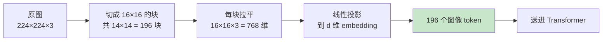
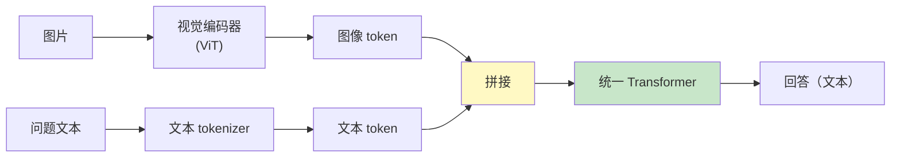
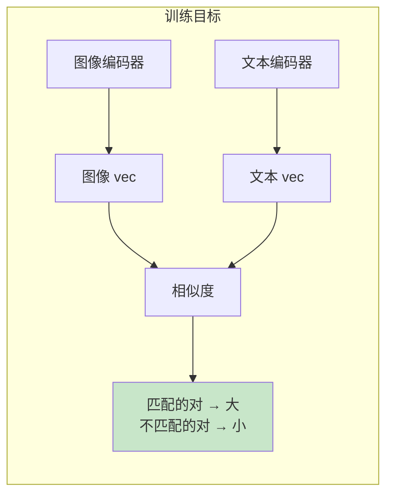
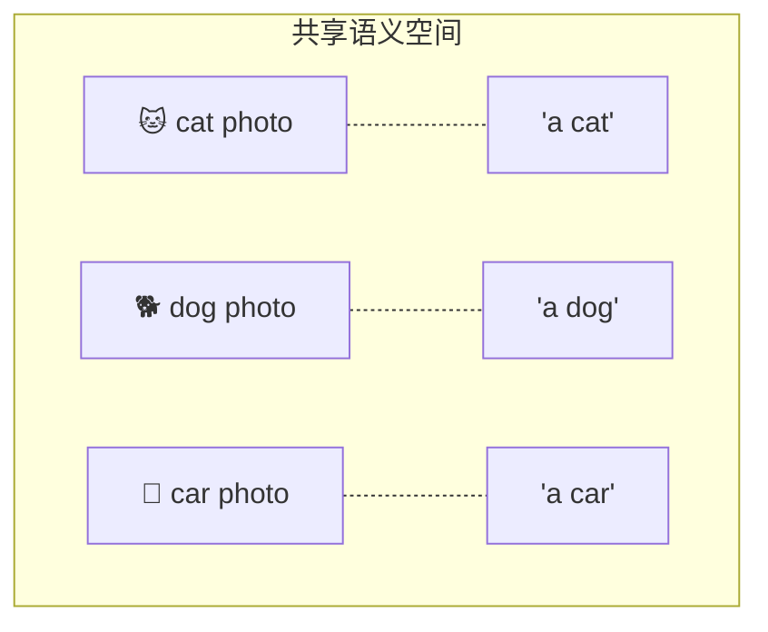
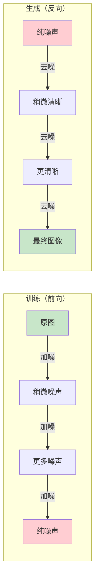
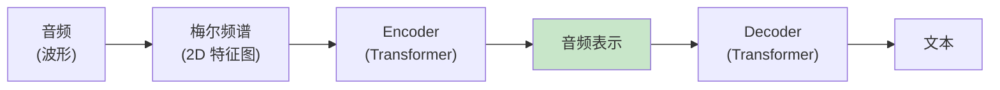
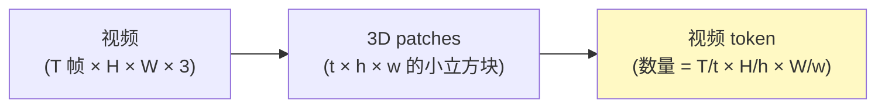
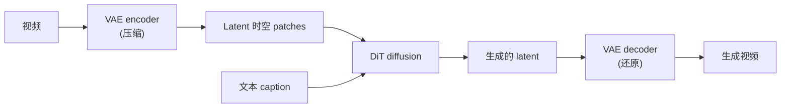
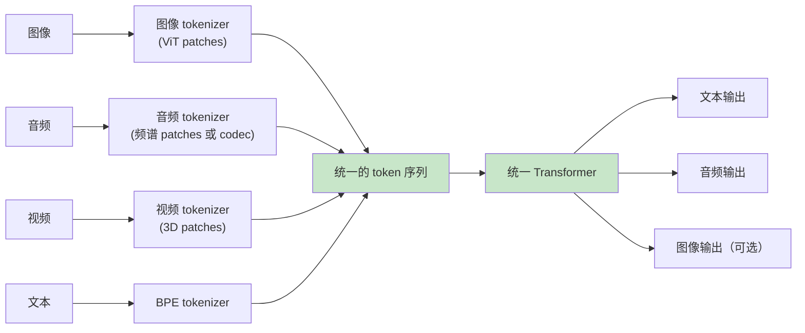

[← 上一章](13-interpretability.md) | [目录](../README.md) | [下一章 →](15-future.md)

**English**: [English](../en/chapters/14-multimodal.md)

# 第十四章：多模态——超越文本

> "Once you tokenize it, it's text. The question is just what counts as 'it'."

第一章我们说 LLM 只做一件事：预测下一个 token。本章把这个论点推向极致：**只要能把它变成 token，LLM 就能处理它**——图像、音频、视频、3D 模型、蛋白质序列，原则上都一样。

这就是多模态模型的核心思路。它不是"在 LLM 上又装了一个图像模块"，而是**把图像（或音频、视频）转换成 token 序列，喂进同一个 transformer**。一旦你接受这个视角，多模态就不再神秘——它是文本 LLM 的自然延伸。

本章核心论点：

1. **多模态本质就是 tokenize 的扩展**——图像变成视觉 token，音频变成音频 token
2. **CLIP 是一切的基础**——它教会模型"图像和文本可以共享一个语义空间"
3. **生成图像/音频的方式根本不同**——主流路径是 diffusion，不是 next-token prediction
4. **Omni model 是趋势**——一个模型理解和生成所有模态

读完本章，你会理解 GPT-4o 的"看图能力"、Sora 的视频生成、Whisper 的语音识别、Suno 的音乐生成——它们看似不同，背后是同一套思路的不同实现。

---

## 14.1 把图像变成 token：Vision Transformer

### 文本 token 化的回顾

第一章里我们已经知道：tokenizer 把文本切成离散单元，每个单元映射到一个向量（embedding）。

```
"hello world" 
  → tokenizer 
  → ["hello", " world"] 
  → embedding 
  → [vec_hello, vec_world]  (两个 d 维向量)
```

这个向量序列就是 transformer 的输入。

### 图像怎么变成 token？

最直接的想法：把图像也切成"块"，每块当一个 token。这正是 **Vision Transformer (ViT)** 的做法（Dosovitskiy et al., 2020, [_An Image is Worth 16x16 Words_](https://arxiv.org/abs/2010.11929)）。



具体步骤：

1. **切块（patch）**：把 224×224 的图片切成 14×14 = 196 个小块，每块 16×16 像素
2. **拉平 + 投影**：每个块 16×16×3 = 768 维，过一个线性层投到 transformer 的 hidden dim
3. **加位置编码**：让模型知道每个 patch 在原图哪里（图像 patch 没有"自然顺序"）
4. **送进 transformer**：和文本 token 一样处理

**核心洞察**：ViT 不需要任何"图像专用"的网络结构（不需要 CNN、不需要卷积）。它把图像当成"二维的 token 序列"，让 transformer 自己学怎么理解。

实践证明：当数据足够多时，ViT 在图像任务上能超过经典 CNN。而且——这是关键——**它和文本 transformer 是同一种架构**。

### Vision-Language Model：把图文 token 拼在一起

一旦图像也是 token 了，VLM（Vision-Language Model）的设计就显而易见：

```
输入: [图像 token1, ..., 图像 token196, 文本 token1, ..., 文本 tokenN]
                ↓
        同一个 Transformer
                ↓
输出: 文本 token (生成回答)
```



GPT-4V、Claude 3、Gemini、LLaVA 都是这种结构的变体。差异在于：

- 视觉编码器用什么（ViT、CLIP 的 vision tower、自研编码器）
- 怎么把图像 token 投影到 LLM 的 embedding 空间（线性层、MLP、cross-attention）
- 训练数据多少图文对、什么质量

但**核心思路就是"图像变 token，拼到文本前面"**。当你看到 Claude 能"看图回答"，背后做的就是这件事。

---

## 14.2 CLIP：图文对齐的基石

### 一个简单到震撼的训练目标

2021 年 OpenAI 发表的 CLIP（[_Learning Transferable Visual Models From Natural Language Supervision_](https://arxiv.org/abs/2103.00020)）改变了多模态。它的训练目标简单到不可思议：

> 给一批图文对（image, caption），让"匹配的对"在 embedding 空间里靠近，"不匹配的对"远离。



具体形式（contrastive loss）：

```python
# 一批 N 个图文对
images, captions = batch  # 各 N 个

# 编码
image_embs = vision_encoder(images)   # N × d
text_embs = text_encoder(captions)    # N × d

# 归一化
image_embs = normalize(image_embs)
text_embs = normalize(text_embs)

# 相似度矩阵 N × N
sim = image_embs @ text_embs.T  # 第 [i,j] 项 = 第 i 张图和第 j 个 caption 的相似度

# 对角线元素是匹配对，应该大；其他元素应该小
# 用对称的 cross-entropy loss
labels = arange(N)  # 第 i 张图应该匹配第 i 个 caption
loss = (cross_entropy(sim, labels) + cross_entropy(sim.T, labels)) / 2
```

**这个目标产生了什么？** 一个**共享的语义空间**：图像和文本被映射到同一个向量空间，里面"a dog running on the beach" 这句话的 embedding 和实际"狗在海滩跑步"的图片 embedding 距离很近。

### 为什么这是"基石"

CLIP 的影响远超图像分类：

**应用 1：零样本图像分类**

不需要训练分类器，只需要把候选标签变成文本：

```python
labels = ["a photo of a cat", "a photo of a dog", "a photo of a car"]
text_embs = clip.encode_text(labels)
img_emb = clip.encode_image(test_image)

predicted_label = labels[argmax(img_emb @ text_embs.T)]
```

CLIP 把"分类问题"变成了"文本检索问题"。

**应用 2：图像生成的"评分函数"**

Diffusion model 怎么知道"生成的图像是否符合 prompt"？用 CLIP：把生成的图像和 prompt 各自编码，看相似度。这是 DALL-E、Stable Diffusion 早期的核心机制。

**应用 3：VLM 的视觉编码器**

很多 VLM 直接用 CLIP 的 vision tower 作为图像编码器。因为 CLIP 已经学到了"图像里的概念"——和文本对齐过的，这正是 VLM 需要的。

**应用 4：检索（image search、text-to-image search）**

把所有图像和查询文本都编码到同一个空间，向量检索就能跨模态。Pinterest、Google 图像搜索、电商的"以图搜图"都用类似机制。

### 共享语义空间的直觉



CLIP 训练完后，"图片 embedding" 和"对应文字描述 embedding" 不是简单地相似——它们几乎重合。这意味着：在这个空间里，**模态的边界被消解了**。"cat" 这个概念，不管是用图片还是文字表达，对应的位置是同一个。

所有现代多模态模型都在用这个洞察。

---

## 14.3 图像生成：为什么不是 next-token？

### 一个看似自然的想法

既然图像可以变成 token 序列，那生成图像不就和生成文本一样吗？让 LLM 一个 token 一个 token 地预测，最后把 token 序列还原成图像。

这条路确实有人走（DALL-E 1、Parti），但**目前主流的图像生成不是这样**。原因要从图像的特殊性说起。

### 图像 token 的特殊性

文本 token 有几个性质：
- **离散**：只有有限个 vocab
- **顺序明确**：从左到右
- **每个 token 信息量大**：一个 token = 一个词

图像 token 不太一样：
- **可以是离散的**（用 VQ-VAE 量化）也可以是连续的
- **顺序是任意约定的**（光栅扫描、Z-curve...）
- **每个 token 信息量小**：一个 patch 只有几个像素，离开周围 patch 没多少意义

更要命的是：**图像的依赖结构是二维的、全局的**。一个像素和它上下左右的所有像素都强相关；一个图像的左上角和右下角也常常存在长程依赖（比如对称性）。

自回归地从左上扫到右下，会破坏这种二维全局结构——前面生成的内容固定后，后面生成的没法回头修。

### Diffusion：从噪声里"显影"

主流的图像生成走的是另一条路：**diffusion**。



直觉解释：

1. **训练时**：拿干净的图像，逐步加噪声，训练一个网络学会"看到 t 步的噪声图，预测 t-1 步的图"
2. **生成时**：从纯噪声开始，反复调用这个网络，逐步去噪，最终得到清晰图像

整个生成过程是**全局-到-全局**的：每一步去噪都看完整张图、修改完整张图。这天然适合图像的二维全局结构。

`text-to-image` 的实现就是把文本 prompt 编码（用 CLIP 或类似模型），作为去噪网络的条件输入：

```python
def text_to_image(prompt, n_steps=50):
    text_emb = clip.encode_text(prompt)
    image = random_noise()
    for t in reversed(range(n_steps)):
        image = denoiser(image, t, condition=text_emb)
    return image
```

### DiT：把 Transformer 用进 Diffusion

早期的 diffusion 用 U-Net 做去噪网络。最近的趋势是用 Transformer，称为 **DiT (Diffusion Transformer)**（Peebles & Xie, 2022, [_Scalable Diffusion Models with Transformers_](https://arxiv.org/abs/2212.09748)）。

DiT 的好处：
- 和 LLM 用同样的架构 → 能吃 transformer 的所有 scaling 经验
- 支持 attention → 长程依赖处理得更好
- 可以扩展到视频（在时间维度上加 attention）

OpenAI 的 Sora、Stability AI 的 Stable Diffusion 3、Google 的 Imagen 3 都用了 DiT 架构。

> **关键趋势**：架构上，文本生成（autoregressive transformer）和图像生成（diffusion transformer）正在收敛——都是 transformer，差别在训练目标。

### Autoregressive 图像生成的回归

最近也有"复活"自回归图像生成的工作（如 LlamaGen、Anthropic 的某些实验、Google 的 Parti 后续）。它们用更聪明的 tokenize 方法（VQ-VAE 的改进），让 next-token prediction 在图像上效果接近 diffusion。

哪条路最终胜出还在博弈中。但工程上你今天最常打交道的，仍然是 diffusion。

---

## 14.4 音频：听与说

### 听：Whisper

OpenAI 的 Whisper（2022, [_Robust Speech Recognition via Large-Scale Weak Supervision_](https://arxiv.org/abs/2212.04356)）是开源 ASR (Automatic Speech Recognition) 的事实标准。它的设计也很 transformer：



关键点：
- 输入不是原始波形，而是**梅尔频谱图**（mel-spectrogram）——一种把音频变成"频率随时间变化"的 2D 表示
- 频谱图被切成时间块，每块当一个 token（类似 ViT 的 patch）
- Encoder-Decoder 架构（少见——大部分现代 LLM 是 decoder-only），decoder 输出文本 token

Whisper 的训练数据：从互联网爬的 68 万小时多语言音频 + 字幕。规模驱动了它的鲁棒性——它能处理各种口音、背景噪声、专业术语。

### 说：TTS 的两种思路

Text-to-Speech (TTS) 的目标反过来：文本 → 音频。

**思路 1：tokenize 音频，然后 next-token prediction**

代表作：Tortoise TTS、Bark、Meta 的 Voicebox、Anthropic 的某些实验。

```python
# 用一个 audio tokenizer（如 EnCodec、SoundStream）把音频切成离散 token
audio_tokens = audio_tokenizer.encode(reference_voice)

# 训练一个 LLM 学习: text → audio_tokens
prompt = f"<text>{input_text}</text>"
generated_audio_tokens = llm.generate(prompt)

# 解码回波形
audio = audio_tokenizer.decode(generated_audio_tokens)
```

**思路 2：直接生成声学特征 + vocoder**

代表：Tacotron、FastSpeech 系列。

```
text → Acoustic Model → mel-spectrogram → Vocoder → 波形
```

第一种思路更现代、更接近"统一架构"的方向；第二种更传统但工程成熟。

近期的 GPT-4o voice、Gemini Live 走的是更激进的路线：**端到端音频对话**——音频输入 → LLM 直接处理 → 音频输出，中间没有"文本"中转。这避免了"文本中转损失情感、节奏、停顿"的问题。

---

## 14.5 视频：最贵的模态

视频可以理解为"图像 + 时间维度"。Tokenize 的思路是 3D patches：



数量爆炸的问题：一个 5 秒、24fps、1024×1024 的视频，按 8×16×16 的 patch 切，token 数量是：

```
(5*24/8) × (1024/16) × (1024/16) = 15 × 64 × 64 ≈ 60000 tokens
```

一个 1 分钟的视频就是百万 token 级别。这是为什么视频生成（Sora、Veo、Kling、Runway）极度昂贵——每一秒视频都是巨大的 attention 计算。

### Sora 的核心思路

OpenAI 的 Sora（2024）应用了 DiT + 3D patches + 大规模训练：

1. **统一表示**：图像、视频都被表示成"时空 patch"序列（图像 = 单帧的退化情形）
2. **DiT 架构**：在时空 patch 上做 diffusion
3. **VAE 压缩**：先把视频压缩到一个 latent space（节省计算），diffusion 在 latent 里做
4. **海量训练数据**：网页视频 + 合成（其他模型生成的）字幕



**目前视频生成的工程现实**：

- 几秒视频生成需要数十秒到几分钟
- 高分辨率成本极高（一段高清视频生成可能花几美元 API 成本）
- 物理一致性还是挑战（液体、布料、人脸长时间一致性）
- 长视频（>1 分钟）质量退化明显

视频是"最贵的模态、最大的机会"——市场需求极大（影视、广告、教育、游戏），但技术尚未成熟到大规模应用。

---

## 14.6 Omni Models：一个模型理解一切

### 趋势

2024 年开始的趋势：**单一模型同时处理所有模态**——不是"文本模型 + 视觉模型 + 音频模型"组合，而是从训练阶段就把所有模态混在一起。

代表：GPT-4o（OpenAI）、Gemini（Google）、Claude（Anthropic 的视觉支持）、Llama 3.2 vision、Qwen-VL 系列。

### 为什么 omni 是趋势

**好处 1：模态间知识迁移**

如果模型同时学过"猫的图片"、"猫的描述文字"、"猫叫的录音"，它对"猫"这个概念的理解会比单模态模型深。

**好处 2：跨模态任务变得自然**

"听一段音频，看一张相关图片，写一段文字总结" —— omni 模型可以一次完成，不需要中间转换。

**好处 3：更少的模型，更简单的部署**

一个模型、一套权重、一个 API 就能搞定多模态需求。

### Omni 模型的架构



各模态共享：
- 同一个 transformer
- 同一套 attention
- 同一个 hidden dim

差异只在两端：
- **输入端**：每种模态有自己的 tokenizer
- **输出端**：根据任务选择 decoder（文本 token、音频 token、图像 latent）

### 工程上意味着什么

对于应用开发者：

**1. 你不需要拼模型了**

以前要做"看图回答"，要么用商业 API（GPT-4V），要么自己拼 BLIP/CLIP + LLM。现在用 Claude / Gemini / GPT-4o 一个 API 就能搞定。

**2. 多模态 prompt 是新技能**

```python
# 例如 Anthropic API
response = client.messages.create(
    model="claude-opus-4-7",
    messages=[{
        "role": "user",
        "content": [
            {"type": "image", "source": {...}},  # 图片
            {"type": "image", "source": {...}},  # 另一张图
            {"type": "text", "text": "对比这两张图的差异"},
        ]
    }]
)
```

第九章讨论的所有 prompt 工程原则都适用——只是 prompt 现在是多模态的。

**3. 评估也要多模态**

第十二章的 eval 框架要扩展。比如 VLM 的 eval 通常包括：
- VQA（Visual Question Answering）准确率
- 图像描述质量（BLEU、CIDEr、人评）
- OCR 准确率（看图认字）
- 图表理解
- 多图推理

---

## 14.7 多模态系统的工程现实

把这一章落到实践，几个值得知道的事：

### 1. 模态成本不一样

| 模态 | 1 个 token 的成本（粗略） |
|------|-----------------------|
| 文本 | 1x |
| 图像（每张约 1000 tokens） | 1000x |
| 视频（每分钟约 10 万 tokens） | 100000x |
| 音频（每分钟约 1500 tokens） | 1500x |

视频处理是文本的几个数量级。设计系统时这个成本结构必须放进决策。

### 2. 多模态延迟分布

视频/音频生成通常是**异步**的（生成时间长，用户必须等）。这影响产品形态：
- 文本聊天 → 实时
- 图像生成 → 几秒等待
- 视频生成 → 任务式，发邮件通知

### 3. 多模态模型的失败模式

VLM 有自己独特的失败模式（除了文本 LLM 已有的）：

- **OCR 不准**：看图认字仍然不可靠（尤其是手写、倾斜、低分辨率）
- **数数不准**：图里有几个人？模型经常算错
- **空间关系混乱**："左边的杯子" vs "右边的杯子" 经常分不清
- **看图编故事**：被问到图中没有的东西时会编造（multimodal hallucination）
- **看不到细节**：图像被压缩成有限的 token，细节丢失

不要假设"看图 = 像人一样看图"。多模态模型有自己的 token 化导致的盲区——和第六章讲的"strawberry 数 r"是同一类问题。

### 4. 安全和隐私的新维度

- 用户上传图片可能包含 PII（脸、身份证、地址）
- 生成的图像可能侵权（训练数据里的画家风格）
- 深度伪造、虚假视频
- 跨模态的 prompt injection（图片里嵌入"忽略上述指令"的文字）

多模态扩大了攻击面。设计系统时要考虑。

---

## 14.8 一个反直觉的思考：模态会不会消失？

最后一节留个开放思考：

**当模型足够强大时，"模态"这个概念可能本身就是一个工程方便的分类，而不是模型内部的真实区分**。

人脑不会把"看花的图像"和"花"这个词分成两个独立系统——它们指向同一个概念表征。我们今天给模型分"视觉编码器、文本编码器、音频编码器"，更多是工程上的便利（已有的预训练模型可以拼装），而不是模型本身需要这种分割。

未来的 omni 模型可能：
- 没有"视觉编码器"和"文本编码器"——所有输入用同一个统一的 tokenizer
- 没有"图像生成 head"和"文本生成 head"——所有输出用同一个统一的 decoder
- 模态成为一个**任意属性**（"输出 4K 视频"和"输出 100 字总结"是同样的指令）

这条路在研究上已经在走（如 Meta 的 Chameleon、Google 的 Pathways、Anthropic 的多模态实验）。

如果这一步走通，第一章的论点会变得更彻底：**LLM 真的就只做一件事——预测下一个 token**。只不过 token 的含义被推到了极致。

---

## 总结

| 问题 | 答案 |
|------|------|
| 多模态的核心思路 | 把所有模态变成 token，喂进同一个 transformer |
| 图像怎么变 token | ViT：切成 patches，每个 patch 是一个 token |
| CLIP 的贡献 | 教会模型"图像和文本可以共享一个语义空间" |
| 为什么图像生成不用 next-token | 图像的二维全局依赖结构不适合自回归；diffusion 更自然 |
| Sora/视频生成的核心 | DiT + 3D 时空 patches + VAE 压缩 |
| 音频识别（Whisper）的设计 | 频谱图 → patches → encoder-decoder transformer |
| Omni model 是什么 | 一个模型同时理解和生成所有模态 |
| 工程现实 | 模态成本差几个数量级，失败模式各有不同 |

下一章是最后一章：站到当下，看 LLM 的未来——scaling 会撞墙吗？工程师这个角色会变成什么？

---

## 延伸阅读

- [Dosovitskiy et al., 2020: _An Image is Worth 16x16 Words (ViT)_](https://arxiv.org/abs/2010.11929) — Vision Transformer 开山作
- [Radford et al., 2021: _Learning Transferable Visual Models from Natural Language Supervision (CLIP)_](https://arxiv.org/abs/2103.00020) — 图文对齐基石
- [Ho et al., 2020: _Denoising Diffusion Probabilistic Models_](https://arxiv.org/abs/2006.11239) — Diffusion 的核心论文
- [Peebles & Xie, 2022: _Scalable Diffusion Models with Transformers (DiT)_](https://arxiv.org/abs/2212.09748) — DiT 架构
- [Radford et al., 2022: _Whisper_](https://arxiv.org/abs/2212.04356) — 大规模弱监督语音识别
- [OpenAI, 2024: _Video generation models as world simulators (Sora technical report)_](https://openai.com/research/video-generation-models-as-world-simulators) — Sora 技术报告
- [Liu et al., 2023: _Visual Instruction Tuning (LLaVA)_](https://arxiv.org/abs/2304.08485) — 开源 VLM 的代表
- [Team Chameleon (Meta), 2024: _Mixed-Modal Early-Fusion Foundation Models_](https://arxiv.org/abs/2405.09818) — 早期融合的统一模型

[← 上一章](13-interpretability.md) | [目录](../README.md) | [下一章 →](15-future.md)
