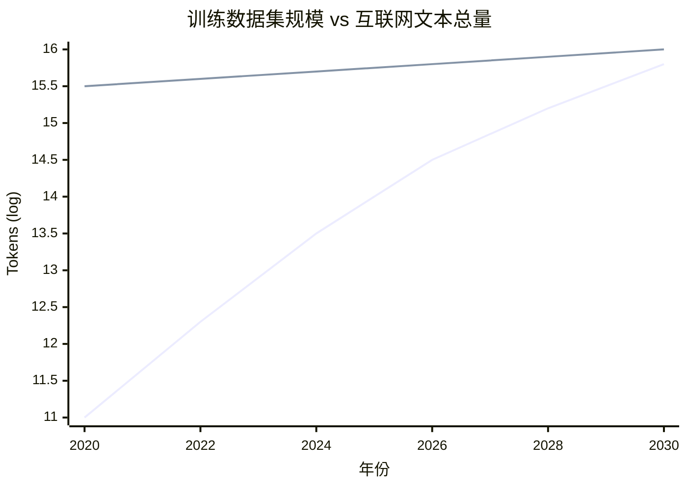
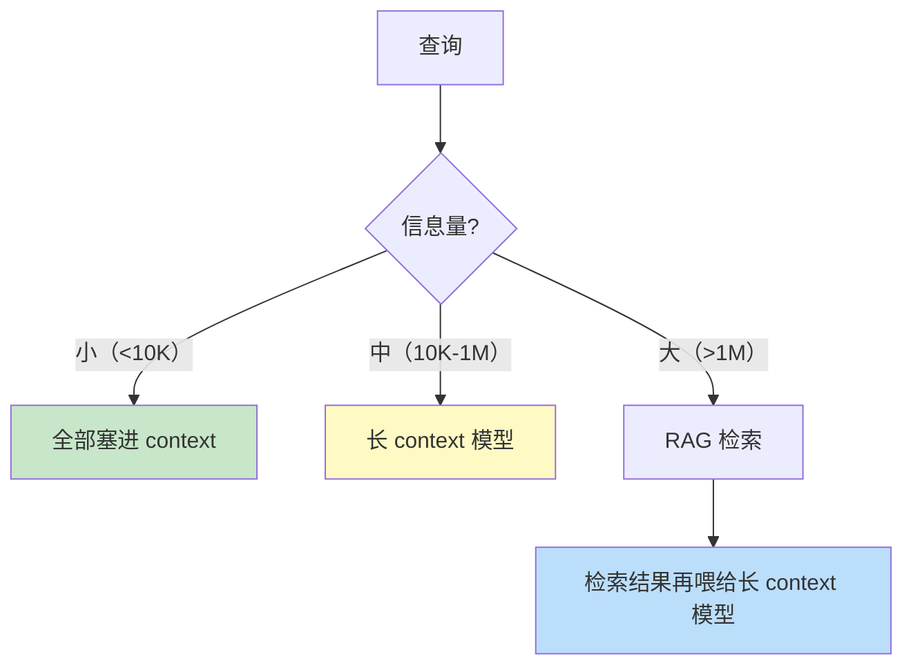
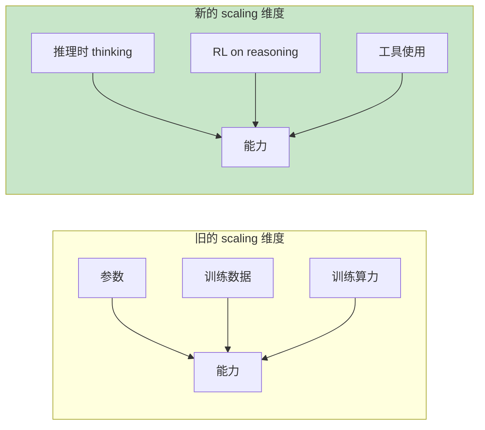
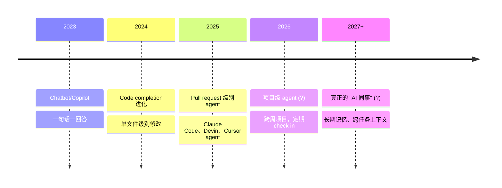
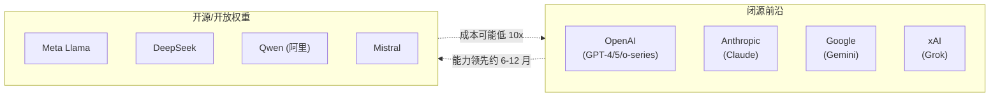

[← 上一章](14-multimodal.md) | [目录](../README.md)

**English**: [English](../en/chapters/15-future.md)

# 第十五章：LLM 的未来

> "Predictions are hard, especially about the future. Predictions about a field that doubles every six months are nearly worthless." — paraphrased

走到这一章，我们已经把 LLM “是什么、能做什么、不能做什么、该怎么用”完整走了一遍。最后一章，目光要转向前头：未来 5-10 年，究竟有哪些事正在发生？那些热闹的说法里，哪些是真趋势，哪些只是炒作？做 LLM 工程师，手头的功夫又该往哪里准备？

我不打算给出具体的预测，那更像占卜。我宁愿做一件实在得多的事：理出几组真实存在的**张力（tension）**，看清当前正在被各方推拉、答案却还没落定的力量。摸透这些正在角力的绳头，远比盲信某一条预言更有价值。

本章要看的几个核心张力：

1. **Scaling 的尽头**：还能继续放大吗？数据墙、能源墙与经济墙横在何处？
2. **合成数据**：它是 scaling 的救命稻草，还是把自身输出循环喂给自己的陷阱？
3. **长上下文 vs RAG**：上下文越做越长，RAG 还有留下的必要吗？
4. **Reasoning 的前途**：test-time compute 究竟能不能一直 scale 下去？
5. **Agent 从工具到同事**：自动化的边界到底划在哪里？
6. **开源 vs 闭源**：谁能走得更远？双方会长期共存，还是一方彻底碾压另一方？
7. **LLM 工程师这个角色**：会慢慢消失、向前进化，还是走向深度专门化？

这些张力没有现成的标准答案。接下来的讨论里，我会把两边的论据摆上桌面，亮出我自己的倾向，但最后的判断，依然要留给你自己。

---

## 15.1 Scaling 还能走多远？

### 三道墙

第三章谈到过 scaling laws 的基本法则：只要模型造得更大、喂的数据更多，loss 就会一路往下落。从 BERT 的 110M 参数走到 GPT-4 据估算的万亿规模，过去这十年，整条曲线几乎没有停下过向上的脚步。

但 scaling 从来不是免费的。眼下，这套打法正在迎面撞上三道墙：

**墙 1：数据墙**

整个互联网上的高质量文本，终究有数得清的上限。Villalobos et al. (2024) 在 [_Will we run out of data?_](https://arxiv.org/abs/2211.04325) 中给出过估算：现存的高质量文本数据很可能在 2026-2032 年间被“吃完”，也就是拿去训练的数据集规模，已经大致逼近人类目前可获得的全部高质量文本总量。



> 注：示意图，实际数字存在相当大的不确定性。

一旦迈过那个临界点，训练数据每想再翻上一倍，就必须付出截然不同的代价：
- 掉头重新深挖已有数据，靠更精细的 cleaning 与 deduplication 抠出增量
- 转向多模态，把图像与视频本质上当成体量更大的 token 来用
- 转向合成数据，具体机制我们会在下一节细说
- 接受边际收益逐步收窄的现实

**墙 2：能源/算力墙**

按业界估算，训练 GPT-4 动用了数万张 H100 连续跑上数月；到了 GPT-5 和 Claude 4 这一代，传闻中的需求直接跳到了十万卡级别。如果下一代还想再往上推 10x 计算量，所需的百万级 GPU 就会直接撞上现有数据中心的物理承载极限与电网供电能力。

NVIDIA、Meta、xAI 如今规划的数据中心，规模大到需要专门配套建造发电厂。这听上去像天方夜谭，却是眼下正在发生的现实。放眼短期，电力供应已经成了卡死 scaling 继续往上推的真正瓶颈。

**墙 3：经济墙**

训练成本正以指数级的速度向上爬升。如果算一算各代前沿模型的单次训练花销：

- 2020 GPT-3：约 5M 美元
- 2023 GPT-4：约 100M 美元
- 2025 据估算前沿模型：500M-1B 美元
- 2027 推测：5-10B 美元

几乎每一代模型的成本都要跳涨一个数量级。到了这个阶段，真正的拷问不再是“技术上能不能做出来”，而是“砸这么多钱做出来，到底值不值这个价”。

如果一次模型训练真要耗费 10B 美元，背后就必须有同等体量的商业回报来托底。眼下整个 AI 行业的实际营收，还远远撑不起这种量级的训练投入，这也是当下行业悬在头顶的最大经济风险。

### 立场对照

**乐观派（Sam Altman、Dario Amodei、Demis Hassabis）**：

- 数据墙可以靠合成数据、多模态与推理时计算合力打破
- 能源归根结底属于基础设施投资，只要预期回报足够高，资本市场自然会补齐缺口
- 商业回报迟早会跟上来：一旦 AI 真正接管“知识工作”，对应的 TAM (Total Addressable Market) 是数万亿美元的体量

**保守派（Yann LeCun、Gary Marcus）**：

- 基于 next-token 预测的现有 Transformer 架构存在根本局限，继续往上 scale 的收益只会越来越薄
- 真正的智能跃迁必须依赖新架构，比如 World Model 或 Energy-based 模型
- 资本泡沫的风险就摆在眼前，一旦商业回报接不上趟，整条 scaling 路径随时可能因为资金断裂而中途搁浅

**我的倾向**：scaling 大概率还能往前再推 1-2 个数量级（大致对应 5x-30x 的算力规模），只是往后每走一步，换来的性能收益都会比上一代更小。与此同时，新的支点（test-time compute、reasoning RL、多模态与 agent）会接力撑起新的增长，“单纯靠堆砌参数量就能赢”的时代正在走到尽头。

---

## 15.2 合成数据：救星还是陷阱？

### 想法的诱惑

如果“真实数据快要见底”，最直接的解法很直白：让大模型自己来生成训练数据。

```python
# 简化版合成数据流程
for prompt in seed_prompts:
    # 用强模型生成训练样本
    sample = strong_llm.generate(f"为以下任务生成一个训练例子: {prompt}")
    training_set.append(sample)
```

从理论上看，这种做法的扩展空间近乎无限，你再也不用被人类历史上到底写过多少文字给困住手脚。

### 实际的复杂性

然而把合成数据真正落到实处，会迎面撞上几处切实的风险：

**风险 1：模型坍缩（Model collapse）**

Shumailov et al. (2024) 在 [_The Curse of Recursion_](https://arxiv.org/abs/2305.17493) 中揭示过一个规律：要是反复拿合成数据喂给新一代模型，经过多轮迭代后模型就会出现“坍缩”，输出内容的多样性大幅收缩，长尾分布逐渐抹平，整台机器变得越来越平庸乏味。

其中的直觉并不复杂：每一代模型都在加倍强化“上一代自以为正确的那套认知”，原有的偏差与漏洞被逐级放大，而那些罕见却真实存在的内容，反而在这轮循环里被一层层过滤丢弃。

**风险 2：合成数据反映 generator 的偏见**

假如拿 GPT-4 生成的数据去训练 GPT-5，那么 GPT-5 学到的并不是真实的“世界”，而不过是“GPT-4 眼中的世界”。更棘手的是，这类偏差很难在自家的内部基准测试里露馅，因为用来评测的基准本身，多半也是靠 GPT-4 生成出来的。

**风险 3：分布漂移**

合成数据天然偏爱“模型本来就擅长的那部分领地”，也就是它能自信吐出的内容。偏偏那些罕见、困难、模型底子最薄弱的地方，才最值得花力气去训练，却在整个数据池里被彻底挤到了边缘，严重代表不足。

### 哪些合成数据真管用

并不是所有合成数据都会陷在这些问题里。真能挑大梁的**高质量合成数据**，往往踩准了这几个要点：

1. **不是纯生成，而是 transformation**：基于现成数据去派生（改写、翻译、提取问答对），而不是凭空无中生有
2. **有验证/筛选**：生成之后引入其他检验手段（跑单元测试、人工 review、多个模型交叉投票），把成色不足的样本剔除出去
3. **针对模型弱项**：把力气集中花在模型原本吃力的特定领域（数学、代码、逻辑推理）
4. **混入真实数据**：拿合成数据当真实数据的搭档与补充，而不是企图全盘替代

DeepSeek-R1 在训练环节中，就大量采用了**自动可验证的合成数据**（比如数学题答案能直接算出来，代码题能跑测试用例验证）。这类自带“ground truth”客观标准的数据，留在身上的风险就要小得多。

### 我的判断

合成数据会成为一股不可或缺的补充力量，但绝不可能全盘替代真实数据。往后真正管用的形态是**半合成**：要么是在已有语料上做高水平改写，要么深耕在自带客观检验机制的特定领域（比如数学、代码与形式逻辑）。

别轻易相信“无限合成数据等于无限 scaling”这种把复杂现实过分简化了的叙事。

---

## 15.3 长上下文会让 RAG 消失吗？

### 趋势

大模型的上下文窗口，这几年扩张得快得惊人：

```
2020: GPT-3        → 2K tokens
2022: GPT-3.5      → 4K
2023: GPT-4        → 8K (32K 后续)
2023: Claude 2     → 100K
2024: Gemini 1.5   → 1M (2M 后续)
2024: Claude 3.5   → 200K
2025-now: 多个模型 → 1M+
```

当窗口大到足以一口吞下整份文档、整个代码库甚至全部对话历史时，许多人自然会想，此前费尽心思搭建的 RAG 还有没有存在的必要。

### 长上下文的支持论点

- **简单**：省去了 chunking、embedding、向量库和 retrieval 调优的一整套工程麻烦。
- **保留全局上下文**：避开了“chunk 边界切断关键信息”的老毛病。
- **更好的连贯性**：模型一眼看全所有内容，做跨段落推理时心里有底。

### RAG 仍然必要的论点

- **成本**：第六章讲过 attention 的计算复杂度是 O(n²)，塞满 1M context 调用一次，账单可能就要几美元。
- **延迟**：硬吞 1M tokens，等上几十秒是常事，应付不来实时交互。
- **lost in the middle**：第六章讲过这个现象，落在长 context 中段的信息，利用率总会往下掉。
- **数据规模**：企业知识库可能有 100GB，哪怕把 context 撑到极限也装不下。
- **可更新性**：RAG 建立的索引能做增量更新，而长 context 每问一次都得把所有材料重新发送一遍。
- **审计性**：RAG 能清清楚楚指出“答案出自哪份文档”，光靠纯长 context 很难追溯来源。

### 折中：分层架构

往后看，局势大概不是“RAG 彻底消失”，而是走向 **RAG 与长 context 的分层**：



第十章讨论过的“知识注入三条路”谁也不会退场，只是各自占的比例与适用的场景在变。

### 我的判断

RAG 不会消失，但**形态会变**：过去非要把文本切碎成 512 token 的 chunks 才能硬挤进 context，往后则是检索一次就给模型送去 100K 到 1M token 的材料，由模型自己去消化。基于 embedding 和向量库的工程会变轻，切的 chunk 更大、检索做得更粗放，可绝不会一路滑向“只靠长 context”。

---

## 15.4 Reasoning 的前途

### Test-time compute 是新的 scaling 维度

第八章讲过，reasoning models 引入了一种新的能力来源：只要在推理时给模型留出更多思考时间，准确率就会稳步往上走。



这给 scaling 指出了一条新路。哪怕训练规模触到了瓶颈，只要在推理时多拨一些算力预算，模型的能力就还能继续往上拔。

不过 test-time compute 也有它的天花板。坊间传闻 OpenAI 的 o3 在训练阶段消耗了海量的推理算力，单次推理的开销可能就要几十美元。要是解一道题得花上 1000 美元，绝大多数实际场景当场就不复存在了。

### Reasoning 的应用扩散

落在具体的工程实践里，reasoning 模型会慢慢从“特殊场景下的杀手锏”变成人人习惯的“默认选项”，只是里头依然有着清晰的分层：

| 场景 | 用什么模型 |
|------|---------|
| 实时对话 | 普通模型 |
| 客服、信息查询 | 普通模型 + 工具 |
| 代码、分析、规划 | reasoning 模型 |
| 数学、研究、复杂决策 | reasoning + 大量 thinking budget |
| 离线高 stakes 任务 | reasoning + multi-sample + 验证 |

API 接口往后的演进方向很明朗：把裁量权交出去，允许用户为单次调用指定 **thinking budget**，由业务自己在质量、速度与成本之间做权衡。

---

## 15.5 Agent：从工具到同事

### 当前 agent 的能力曲线

第十一章讲过，眼下的 agent 应付起简单明了的 workflow 已经很稳当，可一旦被扔进长程开放任务，就容易频出差错。只是这条能力曲线移动得极快：

```
2023:  agent 能完成 5-10 步的任务（约 70% 成功率）
2024:  agent 能完成 30-50 步的任务（约 60% 成功率）
2025:  agent 能完成数小时的工作（约 50% 成功率，需要复核）
2026?: agent 能独立完成数天的项目?
```

METR 在 2025 年的一项研究 [_Measuring AI Ability to Complete Long Tasks_](https://arxiv.org/abs/2503.14499) 里发现了一个很有意思的规律：如果按人类完成所需的时间来折算，agent 能稳妥拿下的任务长度，大约每 7 个月就能翻上一倍。

要是这个势头能一直咬住，不出几年，agent 可以从头跟到尾的“任务长度”，很可能会从分钟级一路跨进以天计的跨度。

### 真实用例的演化



每往前迈出一步，对 **人机协作模式** 的要求就翻过一层。从最初把 agent 当成查询工具，到后来把它看作外包工人，再到真正把它当成团队成员，每一个台阶都需要配套全新的产品形态、信任机制与失败兜底方案。

### 还没解决的问题

在 agent 真正有资格被称为“同事”之前，横在面前的硬骨头还有不少：

- **长期记忆**：眼下 agent 的上下文用完即弃，根本没有跨越不同对话的真实记忆。
- **责任归属**：agent 一旦做错了事，最后的责任到底落在谁头上。
- **安全边界**：到底该放开多大的系统权限，出了闪失又该如何随时撤回。
- **协作协议**：多个 agent 之间该如何通信与协调，才能避开第十一章提过的“沟通成本爆炸”。

这里头的大多数麻烦，根子都不在纯技术上，而是实打实的 **产品和制度问题**。技术顶多能把前半程走完，剩下那一半，得留给社会、法律和组织在漫长的磨合中慢慢演化。

---

## 15.6 开源 vs 闭源

### 当前格局



### 趋势观察

**闭源的优势**：

- 背后有最雄厚的训练资金做支撑。
- 像 reasoning、长 context、多模态这类最前沿的能力，向来都是闭源模型最先跑出来。
- 愿意在安全工程与对齐工程上投入更多心力。

**开源的优势**：

- 部署起来手脚放得开，无论是私有化、跑在本地还是深度定制都由自己说了算。
- 成本低廉，权重一次性下载下来，用起来不必按 token 逐字算钱。
- 代码和权重摊在明处，经得起外部的审视与审计。
- 能盘活整个生态圈子，催生出大量的衍生研究、配套工具与 derived models。

**追赶窗口**在迅速缩短：过去闭源大体能领先 12 到 18 个月，如今在某些具体任务上，开源只要 3 到 6 个月就能追赶上来。DeepSeek-R1 在某些 benchmark 上几乎咬平了 o1，而且完全免费开放。

### 谁会赢？两个不同问题

讨论“开源与闭源谁能赢”，其实底下藏着两个完全不同的问题：

**问题 1**：技术前沿到底谁先抵达。

凭着资本与算力的绝对厚度，短期内抢先撞线的依然会是闭源阵营，但开源咬上来的速度早已不可同日而语。

**问题 2**：实际落地部署时到底谁唱主角。

两边最终会走向 **分层共存**：
- 面对高 stakes、非顶尖 SOTA 不可、同时又无需私有化的场景，首选走闭源 API。
- 遇上调用量极大、必须跑在本地、需要深度定制或是对隐私高度敏感的需求，开源是不二之选。
- 大多数企业都会选择 **混用**：把核心场景托付给闭源，用开源去吃下宽广的长尾需求。

这很像数据库走过的路：当年 MongoDB 没有消灭 Oracle，后来的 PostgreSQL 也没能消灭 SQL Server，大家都在各自的生态位里活得好好的。

### 政策维度

除开技术本身，**监管**还会给开源平添一层巨大的不确定性。已有部分政府在商讨“前沿大模型必须获得许可方可发布”，这件事一旦成真，开源前沿模型头顶上的法律风险就会陡增。这是技术演进之外不可忽视的现实变量。

---

## 15.7 LLM 工程师这个角色会演化成什么

### 当前定义

顶着“LLM 工程师”这个头衔，你手头每天在忙的事情大概不出这几样：

- 编写与调整 prompt
- 搭建 RAG 检索系统
- 做模型微调（fine-tuning）
- 接入 agent 与 function calling
- 跟踪评估指标与线上监控

### 短期演化（1-2 年）

不过，手头的一部分工作正在被自动化快速吃掉：

- **Prompt 工程**：推理模型（reasoning model）让调优 prompt 的边际收益越来越薄，底子更好的模型对写得随意的 prompt 宽容得多。
- **RAG 调优**：在 embedding 选取与分块策略（chunking）上的反复打磨，正逐渐被超长上下文与自动检索取代。
- **基础 fine-tuning**：合成数据生成搭配自动训练流水线，已经把小模型微调的门槛压到了极低。

与此同时，新的工程重心也在涌现：

- **Eval 工程**（第十二章）：几乎所有团队都开始意识到评测体系的缺失，把它当作头等大事。
- **Agent orchestration**：摸索怎么把 agent、调用工具和人类的真实工作流缝合在一起。
- **安全 / 红队 / 对齐工程**：随着 agent 拿到的操作权限越来越大，防御与对齐的分量随之倍增。
- **多模态工程**：把视频、音频和跨模态推理真正落进实际应用。

### 中期演化（3-5 年）

更有可能发生的情景是，LLM 工程师的分工会收拢为基础设施、评估体系与安全防御构成的三位一体，而具体怎么写 prompt，则会变成类似写 SQL 那样的通用基本功，所有工程师都得懂上一点。

这很像 2010 年代“机器学习工程师”走过的路：最初它是一门界限分明的独立工种，后来逐渐演化为“懂 ML 的软件工程师”。今天的 LLM 工程师大概也会经历完全相同的蜕变，专业化向纵深扎根，泛化则向整个工程团队漫开。

### 不会被替代的部分

短期内不会被自动化轻易抹掉的工作，边界其实十分清楚：

- **理解业务、定义任务**：把业务方口中模糊的需求，拆解并翻译成目标明确、结果可量化评估的模型任务。
- **失败案例的根因分析**：如同第六章与第七章所讨论的，精准诊断系统为什么在特定场景下交出糟糕的答卷。
- **跨学科系统设计**：把大模型、传统确定性软件和人类的操作节点缝合成一套真正跑得通的产品。
- **判断什么不该让 AI 做**：摸清能力的边界，清楚知道在什么时候该坚决说“不”。

对第一性原理的透彻理解，也就是整本书始终在强调的思考方式，只会在未来变得越发要紧。上层的框架与工具迭代得眼花缭乱，唯独底层的运行逻辑保持着长久的稳定。抓住了底层原理，每当行业里冒出新的热门工具时，你才能一眼看穿它到底值不值得被引入生产环境。

---

## 15.8 我的几个具体观点

在承认所有技术演进的不确定性之余，我还是想坦白给出自己持有的几点明确判断。这些想法完全有猜错的可能，但它们至少建立在扎实的工程观察与推演之上：

### 1. “LLM 撞墙”的故事被夸大了，但 GPT-4 → GPT-5 的跃迁可能是最后一次“震撼性”跨越

单纯靠堆叠参数规模换取性能提升的做法，边际收益正在肉眼可见地收窄。往后的技术进步会表现得更加分散：推理链条的延伸、agent 应对长程任务的稳定性、多模态融合还有垂直领域的精调，每一处都会往上涨，但很难再带来那种“睡了一觉醒来，模型突然变成了另一种物种”的震撼感。

### 2. 文本 LLM 的应用层已经开始进入“红海”

从聊天机器人、文档问答 RAG 到代码辅助插件，这些标准化场景里早就挤满了创业公司，彼此之间拉开差异的难度变得极高。真正的新机会正在向更深的水域转移：能够自主拆解并执行长程任务的 agent、打通视频与音频的多模态系统，还有深扎在医疗、法律与科研场景里的垂直应用。

### 3. Agent 是这一代最大的产品机会，也是最大的工程陷阱

“agent” 这个词在 2025 年所处的生态位，很像 2017 年的“区块链”。底层确实蕴含着颠覆性的变革力量，表面上也漂浮着海量的商业泡沫。能磨出一套真正稳定可靠的 agent 系统的团队，身价会水涨船高；大多挂着 agent 招牌的初创公司，终究会死掉。

### 4. 评估会从“被低估”变成“核心壁垒”

手里握着最扎实的评测集与评估方法论的团队，才能在迭代速度上长期压过对手一头。在今天的前沿模型公司里，这套评估能力正在演变成真正的核心护城河。

### 5. 开源永远不会消失，但前沿会越来越集中在少数公司

资本与算力的门槛只会越垒越高。最前沿的技术突破集中在 5 家公司手里，开源生态则在 18 个月之后跟进。对于 99% 的具体应用场景来说，这个时间差完全可以接受。

### 6. “AI 替代工程师”不会发生，“用 AI 的工程师替代不用 AI 的工程师”已经在发生

这句流传很广的行话其实切中了要害。真正的危机从来不是“AI 会不会抢走我的饭碗”，而是“那些擅长调度 AI 的同行，会不会抢走你的饭碗”。

### 7. 第一性原理会越来越值钱

上层的框架、API 接口乃至所谓的最佳实践，都会以极快的速度被淘汰。你在 2026 年苦心钻研的“怎么用 LangChain 搭建一套 agent”，到了 2027 年大概率就全用不上了。然而，弄明白“为什么大模型会产生幻觉”、“为什么 attention 计算复杂度是 O(n²)”、“为什么思维链（CoT）能奏效”，这些扎根底层的认知，放上十年也不会过时。

整本书押上的赌注，归根结底就是这第七条。

---

## 15.9 一个开放的结尾

大语言模型无疑是过去十年里最深刻的技术变革之一，但站在整个技术史的尺度上看，它其实还处在非常稚嫩的阶段。

写下这些文字时正值 2026 年。等你捧起这本书时，书中某些章节的具体细节或许早已翻篇：某个具体的模型被更新的架构淘汰，某项 benchmark 得分被彻底刷新，某个当年被奉为业界顶尖的做法，也已经被更新的方法所取代。

但一套底层的思考方式大概不会轻易过时：

- 一切本质上都是 token 上的自回归续写
- Attention 是动态的信息路由
- 规模增长驱动能力的涌现
- 对齐改变的是表达形态，而不是底层能力
- 模型存在确凿而具体的硬伤
- 幻觉是自回归续写天然付出的代价
- 推理（Reasoning）是用 token 长度换取思维深度
- Prompt 做的无非是在塑造条件概率
- 知识注入始终走在 RAG、fine-tune 与 context 这三条路上
- Agent 的本质就是大模型、工具与控制循环（loop）的组合
- 缺乏科学的 eval，就谈不上真正扎实的改进
- 多模态不过是 tokenize 机制向更广阔世界的扩展

这就是整本书想交付给你的“thinking in LLM”：一种稳定的心智模型。它能帮你穿透走马灯般变幻的技术表层，看清藏在最深处、始终不变的底层结构。

读完这十五个章节之后，如果你下一次面对一个新发布的大模型、一套新出炉的开发框架或是一篇刷屏的论文时，第一反应不再是“这又冒出了什么完全陌生的新花样”，而是“它究竟是哪个已有概念的延伸与变体”，那么这本书的使命就算彻底完成了。

剩下的路，全看你自己的了。

---

## 总结

| 张力 | 我的判断 |
|------|---------|
| Scaling 还能走多远 | 还能推进 1 到 2 个数量级，但单纯堆叠参数的时代已经落幕 |
| 合成数据 | 是重要补充而非彻底替代；“半合成 + 自动化验证”最能跑通 |
| 长 context vs RAG | 两者皆不会消失，而是走向“RAG 负责检索定位 + 长 context 负责消化整合”的分层架构 |
| Reasoning 的前途 | Test-time compute 成为扩展模型能力的新支点，但受制于推理成本上限 |
| Agent 的演化 | 可承载的任务长度大约每 7 个月翻一番，但产品形态与社会制度上的难题更难化解 |
| 开源 vs 闭源 | 闭源主导技术前沿，开源吞下长尾应用，两者将保持长期分层共存 |
| LLM 工程师 | 专业化深挖与泛化普及同步演进；对第一性原理的掌握变得愈发关键 |

---

## 延伸阅读

- [Villalobos et al., 2024: _Will we run out of data?_](https://arxiv.org/abs/2211.04325)：关于高质量文本数据墙与存量耗尽周期的量化测算
- [Shumailov et al., 2024: _The Curse of Recursion: Training on Generated Data_](https://arxiv.org/abs/2305.17493)：递归训练与模型坍缩现象的经典研究
- [Snell et al., 2024: _Scaling LLM Test-Time Compute Optimally_](https://arxiv.org/abs/2408.03314)：测试时计算（test-time compute）扩展策略的理论与实验分析
- [METR, 2025: _Measuring AI Ability to Complete Long Tasks_](https://arxiv.org/abs/2503.14499)：关于 Agent 解决长程复杂任务能力的实证测算与倍增规律
- [Anthropic, 2024: _Building Effective Agents_](https://www.anthropic.com/research/building-effective-agents)：面向工业界落地的实战 Agent 架构设计指南
- [Bommasani et al., 2021: _On the Opportunities and Risks of Foundation Models_](https://arxiv.org/abs/2108.07258)：斯坦福团队对基础模型机遇与风险的全景剖析
- [Bengio et al., 2024: _Managing extreme AI risks amid rapid progress_](https://www.science.org/doi/10.1126/science.adn0117)：多位图灵奖得主联合撰写的 AI 安全前沿政策视角
- [Hendrycks et al., 2023: _An Overview of Catastrophic AI Risks_](https://arxiv.org/abs/2306.12001)：全面梳理大模型长期潜在灾难性风险的综述文章

---

## 后记

从 next-token prediction、attention、scaling 到对齐、能力边界、幻觉，再到推理、prompt、RAG、agent、eval、interpretability、多模态与未来走向，整整 15 个章节，我们从底层机理一路走到了工程实战与未来展望。

可大模型这个领域的发展速度与涵盖范围，注定没有任何一本书能够做到面面俱到。在这本书里，我特意拿掉了几块内容：

- 训练工程的具体细节（数据流水线、分布式训练架构与底层推理优化）：这部分内容可以参考配套的[《LLM 训练工程师完全指南》](https://github.com/yingwang/llm-tutorial)。
- 特定开发框架的 API 细节（如 LangChain、LlamaIndex 或 Anthropic SDK）：这些接口极易过时，直接查阅官方文档会是更好的选择。
- 安全与对齐技术的深度探讨：这里面的每一个细分课题，都足以单独写成一本厚书。
- 商业逻辑与组织演化的话题（怎样在企业内部推动 AI 落地、如何规划 AI 产品的演进路线）。

这本书真正想给你的，是一套立足底层的**思考框架**。读罢全书，每当你看到任何一篇新论文、一款新工具或一个新模型时，都能迅速建立坐标，看清它对应着哪一章讲过的核心概念，究竟属于已有范式的延伸还是变体，又向我们过往的哪些认知发起了挑战。

只要这一点立住了，接下来的成长路线也就水到渠成：

1. **持续读论文**：特别是紧跟 Anthropic、OpenAI、Google DeepMind、Meta AI 与 DeepSeek 等顶尖团队发布的技术报告。
2. **动手做项目**：光看理论永远无法真正内化，唯有亲手写代码才能把知识变成肌肉记忆。
3. **关注高质量信号源**：比如定期阅读 Anthropic Blog、Simon Willison 的博客、Andrej Karpathy 的技术分享，还有 Hacker News 的前排讨论。
4. **深度参与开源**：哪怕只是把别人的开源项目跑起来并读懂代码，也远比单纯被动地消费内容成长得快。

最后的一点叮嘱：永远保持怀疑，永远保持好奇。在 AI 这个日新月异的领域里，那些自信满满宣称“事情定当如此”的人，往往会被现实以最快的速度打脸。这里面包括我，也包括这本书里的所有文字。

祝你亲手搭建出好用、结实的 LLM 系统。

Ying Wang，写于 2026 年春

[← 上一章](14-multimodal.md) | [目录](../README.md)
