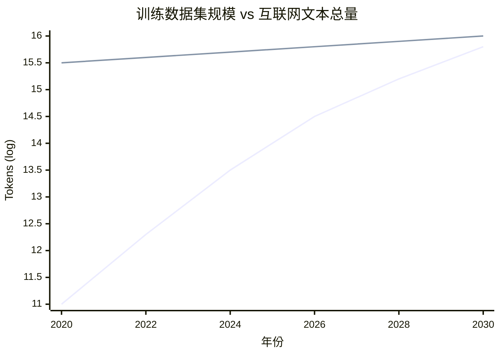
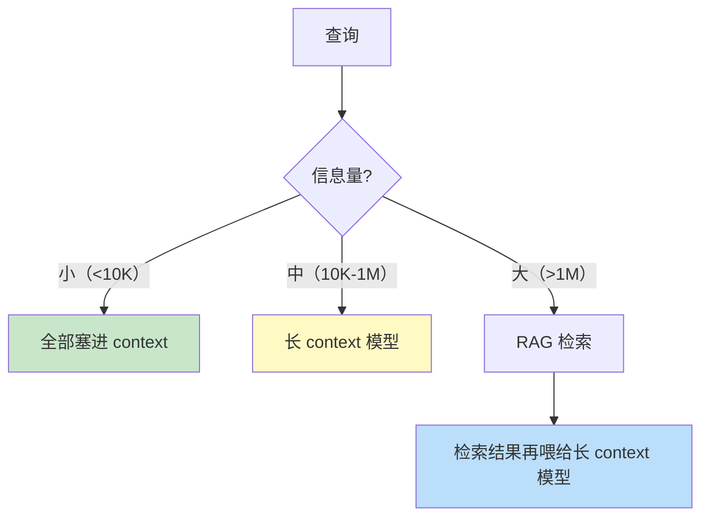
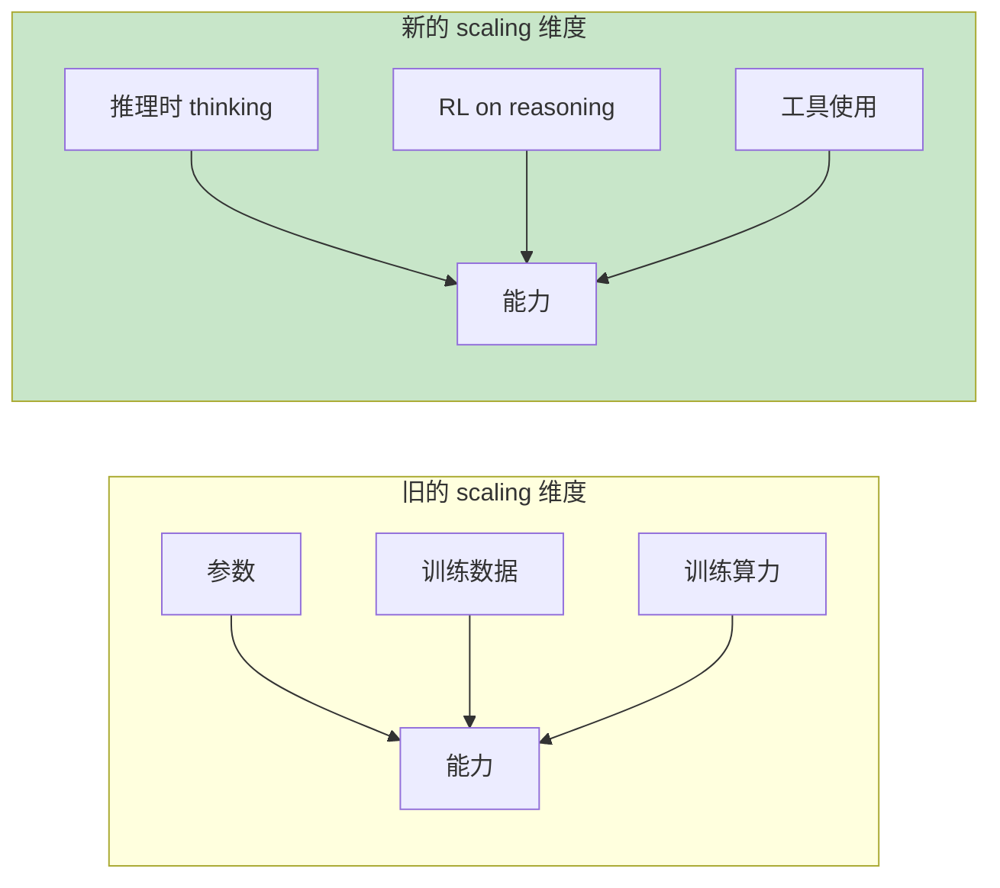
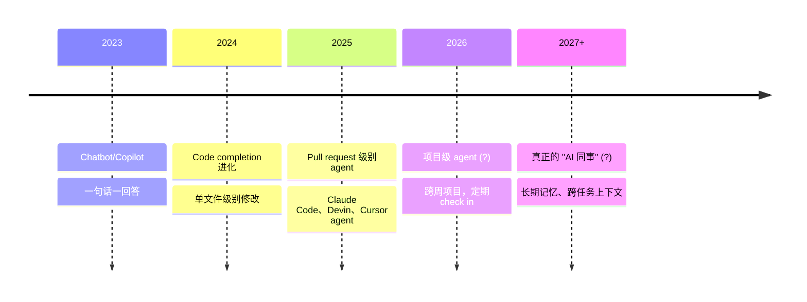
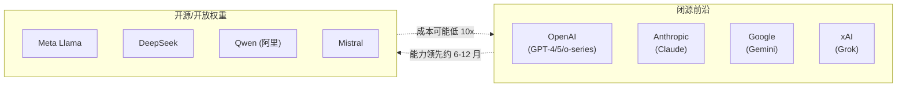

[← 上一章](14-multimodal.md) | [目录](../README.md)

# 第十五章：LLM 的未来

> "Predictions are hard, especially about the future. Predictions about a field that doubles every six months are nearly worthless." — paraphrased

到这一章，我们已经走完了 LLM 的"是什么、能什么、不能什么、怎么用"。最后这一章往前看：未来 5-10 年，哪些事情正在发生？哪些是真趋势、哪些是炒作？身为 LLM 工程师，应该往哪里准备？

我不会给具体预测——那更像占卜。我会做更有用的事：**梳理几个真实存在的张力（tension）**——那些当前正在被推拉、答案尚未明朗的力量。理解这些张力，比相信某个具体预言更有价值。

本章的几个核心张力：

1. **Scaling 的尽头**：还能继续放大吗？数据墙、能源墙、经济墙在哪里？
2. **合成数据**：是 scaling 的救命稻草，还是循环喂自己的陷阱？
3. **长上下文 vs RAG**：上下文越来越长，RAG 还需要吗？
4. **Reasoning 的前途**：test-time compute 能持续 scale 吗？
5. **Agent 从工具到同事**：自动化的边界在哪？
6. **开源 vs 闭源**：谁会赢？两者都会存在还是一方碾压？
7. **LLM 工程师这个角色**：会消失、会进化，还是会专门化？

这些张力没有标准答案。我会列出每边的论据，说明我的倾向，但你应该自己思考。

---

## 15.1 Scaling 还能走多远？

### 三道墙

第三章我们讲过 scaling laws：模型越大、数据越多，loss 越低。过去十年，从 BERT 的 110M 到 GPT-4 据估算的万亿级参数，这条曲线一直在涨。

但 scaling 不是免费的。它正在撞上三道墙：

**墙 1：数据墙**

互联网上的高质量文本是有限的。Villalobos et al. (2024) 的 [_Will we run out of data?_](https://arxiv.org/abs/2211.04325) 估算：高质量文本数据可能在 2026-2032 年间被"用完"——意思是已经训练数据集 ≈ 全部可获得的高质量文本。



> 注：示意图，实际数字有相当不确定性。

到了那个点之后，每多一倍训练数据需要：
- 重新挖掘已有数据（更聪明的 cleaning、deduplication）
- 转向多模态（图像、视频本质是更多 token）
- 转向合成数据（下一节）
- 接受边际收益递减

**墙 2：能源/算力墙**

训练 GPT-4 据估算用了几万张 H100 几个月。GPT-5/Claude 4 这一代据传需要十万级 GPU。下一代（10x 计算）需要百万级 GPU——这已经接近现有数据中心的物理极限和电网容量。

NVIDIA、Meta、xAI 都在建数据中心规模大到要单独建发电厂的程度。这不是夸张——是真的。短期内，电力供给已经是 scaling 的实际瓶颈。

**墙 3：经济墙**

训练成本在指数增长。如果一个最前沿模型训练成本：

- 2020 GPT-3：约 5M 美元
- 2023 GPT-4：约 100M 美元
- 2025 据估算前沿模型：500M-1B 美元
- 2027 推测：5-10B 美元

每代涨一个数量级。问题不是"做得到吗"——是"做出来值不值这个价"。

如果一个模型训练花 10B 美元，必须有相应规模的商业回报。当前 AI 行业的整体收入还远撑不起这个数量级的训练投入——这是当前最大的经济风险。

### 立场对照

**乐观派（Sam Altman、Dario Amodei、Demis Hassabis）**：

- 数据墙能用合成数据 + 多模态 + 推理时计算突破
- 能源问题是基础设施投资问题，资本市场会解决
- 经济回报会跟上——一旦 AI 能做"知识工作"，TAM (Total Addressable Market) 是几万亿美元

**保守派（Yann LeCun、Gary Marcus）**：

- 当前架构（next-token transformer）有根本局限，更多 scaling 收益递减
- 真正的智能突破需要新架构（World Model、Energy-based）
- 资本泡沫的风险很真实，scaling 路径可能因为商业崩溃而中断

**我的倾向**：scaling 还能走 1-2 个数量级（5x-30x 算力），但每一步收益会减小。同时，**新的维度**（test-time compute、reasoning RL、多模态、agent）会承担更多增长。"单纯堆参数"的时代正在结束。

---

## 15.2 合成数据：救星还是陷阱？

### 想法的诱惑

如果"真实数据要用完了"，最直接的想法：让 LLM 生成训练数据。

```python
# 简化版合成数据流程
for prompt in seed_prompts:
    # 用强模型生成训练样本
    sample = strong_llm.generate(f"为以下任务生成一个训练例子: {prompt}")
    training_set.append(sample)
```

理论上无限可扩展——你不再受限于人类写过多少东西。

### 实际的复杂性

但合成数据有几个真实的风险：

**风险 1：模型坍缩（Model collapse）**

Shumailov et al. (2024) 的 [_The Curse of Recursion_](https://arxiv.org/abs/2305.17493) 显示：如果反复用合成数据训练新模型，多代之后模型会"坍缩"——失去多样性、长尾分布消失、变得越来越平庸。

直觉：每一代都强化"前一代认为正确的东西"，错误和偏见被放大，罕见但真实的内容被丢弃。

**风险 2：合成数据反映 generator 的偏见**

如果 GPT-4 生成训练数据用来训 GPT-5，GPT-5 学到的不是"世界"，而是"GPT-4 眼中的世界"。这种偏差很难在内部基准上发现——因为内部基准本身可能也是 GPT-4 生成的。

**风险 3：分布漂移**

合成数据偏向"模型擅长的领域"——那些它自信生成的内容。罕见、困难、模型不擅长的内容（恰恰最值得训练的）被系统性低代表。

### 哪些合成数据真的有效

不是所有合成数据都有这些问题。**高质量合成数据**通常具备：

1. **不是纯生成，而是 transformation**：从已有数据派生（改写、翻译、提取问题等），而非凭空生成
2. **有验证/筛选**：生成后用其他机制（执行测试、人工 review、多模型投票）过滤掉低质量样本
3. **针对模型弱项**：定向补足模型不擅长的领域（数学、代码、推理）
4. **混入真实数据**：合成数据不替代真实数据，而是补充

DeepSeek-R1 的部分训练就大量用了**自动可验证的合成数据**（数学题：答案能算出来；代码题：能跑测试）。这种"有 ground truth"的合成数据风险小。

### 我的判断

合成数据**会成为重要补充**，但不会完全替代真实数据。最有效的会是"半合成"——已有数据的智能改写、有自动验证机制的领域（数学、代码、形式逻辑）。

不要相信"无限合成数据 = 无限 scaling"的简单叙事。

---

## 15.3 长上下文会让 RAG 消失吗？

### 趋势

上下文窗口在快速增长：

```
2020: GPT-3        → 2K tokens
2022: GPT-3.5      → 4K
2023: GPT-4        → 8K (32K 后续)
2023: Claude 2     → 100K
2024: Gemini 1.5   → 1M (2M 后续)
2024: Claude 3.5   → 200K
2025-now: 多个模型 → 1M+
```

如果窗口能装下整个用户文档/代码库/对话历史，RAG 还有必要吗？

### 长上下文的支持论点

- **简单**：不需要 chunking、embedding、向量库、retrieval 调优
- **保留全局上下文**：避免"chunk 边界切断关键信息"
- **更好的连贯性**：模型一次看到全部内容，能做跨段落推理

### RAG 仍然必要的论点

- **成本**：第六章已讲过，attention 是 O(n²)。1M context 一次调用可能要几美元
- **延迟**：处理 1M tokens 几十秒起步，不适合实时
- **lost in the middle**：第六章讲过，长 context 中间信息利用率低
- **数据规模**：企业知识库可能 100GB，再大的 context 也装不下
- **可更新性**：RAG 索引可以增量更新；context 需要每次重新发送
- **审计性**：RAG 能告诉你"答案来自哪个文档"；纯长 context 难追溯

### 折中：分层架构

未来更可能不是"RAG 消失"，而是 **RAG + 长 context 的分层**：



第十章讨论的"知识注入三条路"会继续存在，但比例和场景在变化。

### 我的判断

RAG 不会消失，但**形态会变**：从"必须切成 512 token chunks 来挤进 context"变成"检索一次给模型 100K-1M token 的相关材料，让模型自己消化"。Embedding + 向量库的工程会简化（chunk 更大、检索更粗），但永远不会变成"只用长 context"。

---

## 15.4 Reasoning 的前途

### Test-time compute 是新的 scaling 维度

第八章讲过：reasoning models 引入了一个新的能力来源——**推理时给模型更多思考时间，准确率单调提升**。



这给了 scaling 一条新出路：即使训练规模撞墙，也可以通过给模型更多推理预算来继续涨能力。

**但 test-time compute 也有上限**。OpenAI 的 o3 据传训练用了大量推理时计算，单次推理可能要几十美元。如果要推理一道题花 1000 美元，绝大多数应用场景就不存在了。

### Reasoning 的应用扩散

工程实践上，reasoning 模型会从"特殊场景"变成"默认选项"——但仍然分层：

| 场景 | 用什么模型 |
|------|---------|
| 实时对话 | 普通模型 |
| 客服、信息查询 | 普通模型 + 工具 |
| 代码、分析、规划 | reasoning 模型 |
| 数学、研究、复杂决策 | reasoning + 大量 thinking budget |
| 离线高 stakes 任务 | reasoning + multi-sample + 验证 |

API 接口的演化方向：**让用户为每次调用指定 thinking budget**，按"质量 vs 速度 vs 成本"取舍。

---

## 15.5 Agent：从工具到同事

### 当前 agent 的能力曲线

第十一章讲过：当前 agent 在简单 workflow 上很可靠，在长程开放任务上经常翻车。但这条曲线在快速移动：

```
2023:  agent 能完成 5-10 步的任务（约 70% 成功率）
2024:  agent 能完成 30-50 步的任务（约 60% 成功率）
2025:  agent 能完成数小时的工作（约 50% 成功率，需要复核）
2026?: agent 能独立完成数天的项目?
```

METR 的研究 [_Measuring AI Ability to Complete Long Tasks_](https://arxiv.org/abs/2503.14499)（2025）发现一个有趣的规律：**agent 能可靠完成的任务长度（按人类完成所需时间衡量），大约每 7 个月翻一倍**。

如果这个趋势持续，几年内 agent 能完成的"任务长度"可能从分钟级走到天级。

### 真实用例的演化



每往后一步，对**人机协作模式**的要求都不一样。从"agent 是个查询工具"到"agent 是个外包工人"再到"agent 是个团队成员"——每一步都需要新的产品形态、新的信任机制、新的失败兜底。

### 还没解决的问题

agent 真的成为"同事"前要解决：

- **长期记忆**：当前 agent 上下文是一次性的，没有跨对话的真实记忆
- **责任归属**：agent 做错了，谁负责？
- **安全边界**：给 agent 多大权限？怎么撤销？
- **协作协议**：多 agent 之间怎么通信、协调，避免第十一章说的"沟通成本爆炸"

这些大部分不是技术问题，是**产品和制度问题**。技术能解决一半，剩下一半要社会、法律、组织慢慢演化。

---

## 15.6 开源 vs 闭源

### 当前格局



### 趋势观察

**闭源的优势**：

- 训练资金最雄厚
- 最前沿能力（reasoning、长 context、多模态）通常先在闭源出
- 安全工程、对齐工程更投入

**开源的优势**：

- 部署灵活（私有化、本地、定制）
- 成本低（一次性下载，不按 token 算）
- 可被审视和审计
- 推动整个生态（很多研究、工具、derived models）

**"开源追赶时间"在缩短**：以前闭源领先 12-18 个月，现在某些任务上 3-6 个月开源就追上。DeepSeek-R1 几乎追上 o1（在某些 benchmark 上），且免费开放。

### 谁会赢？两个不同问题

"开源 vs 闭源谁赢" 其实是两个不同问题：

**问题 1：技术前沿谁先到？**

短期内仍然是闭源（资本和算力优势）。但开源在快速追赶。

**问题 2：实际部署中谁占主导？**

会**分层共存**：
- 高 stakes / 需要 SOTA / 不需要私有化 → 闭源 API
- 高量级 / 需要本地 / 需要定制 / 隐私敏感 → 开源
- 大部分企业会**混用**：核心场景闭源，长尾场景开源

类似数据库领域：MongoDB 没消灭 Oracle，PostgreSQL 没消灭 SQL Server——它们各有市场。

### 政策维度

值得提一笔：**监管会加大开源的不确定性**。一些政府正在讨论"前沿大模型必须许可"——如果这成真，开源前沿模型的法律风险会大幅上升。这是技术之外的真实变量。

---

## 15.7 LLM 工程师这个角色会演化成什么

### 当前定义

如果你今天是"LLM 工程师"，你大概在做：

- 设计 prompt
- 搭 RAG 系统
- 做 fine-tuning
- 实现 agent / function calling
- 评估 + 监控

### 短期演化（1-2 年）

某些工作正在被自动化：

- **Prompt 工程**：reasoning model 让"prompt 调优"的边际收益减小——好模型对"差 prompt"更宽容
- **RAG 调优**：embedding/chunk 策略的优化，会被"长 context + 自动检索"逐步替代
- **基础 fine-tuning**：合成数据生成 + 自动训练 pipeline 让小模型微调几乎傻瓜化

新增加的工作：

- **Eval 工程**（第十二章）：所有团队都开始意识到这个缺口
- **Agent orchestration**：怎么把 agent、工具、人类工作流缝起来
- **安全 / 红队 / 对齐工程**：随着 agent 权限上升，这块越来越重要
- **多模态工程**：视频、音频、跨模态推理的应用

### 中期演化（3-5 年）

更可能的方向：**LLM 工程师变成"基础设施 + 评估 + 安全" 三位一体**，而具体"prompt 怎么写"成为类似"SQL 怎么写"的基础技能——所有工程师都需要懂一点。

这有点像 2010 年代"机器学习工程师"的故事：最初是个独立工种，后来变成"懂 ML 的软件工程师"。LLM 工程师可能也会经历这个过程：**专业化** + **泛化**同时发生。

### 不会被替代的部分

哪些 LLM 工程师的工作短期内不会被自动化？

- **理解业务、定义任务**：把模糊的业务需求翻译成可评估的 LLM 任务
- **失败案例的根因分析**：第六、七章讲的"失败模式诊断"
- **跨学科系统设计**：把 LLM、传统软件、人类工作流缝合成可用的产品
- **判断什么不该让 AI 做**：知道何时说"不"

第一性原理理解（这本书想教的）会变得**更重要**而不是更不重要。因为表层工具变化太快，只有底层原理是稳定的——它让你能在新工具出现时快速判断"这值不值得用"。

---

## 15.8 我的几个具体观点

承认了所有不确定性之后，我还是给几个我自己持有的具体观点。这些**可能错**，但至少是有根据的猜测：

### 1. "LLM 撞墙"的故事被夸大了，但 GPT-4 → GPT-5 的跃迁可能是最后一次"震撼性"跨越

简单堆参数的边际收益在递减。后面的进步会更分散——reasoning 能力、agent 长程任务、多模态、专业领域微调，每一个都会涨，但没有"一夜之间感觉模型变成另一个生物"的体验。

### 2. 文本 LLM 的应用层已经开始进入"红海"

聊天 chatbot、问答 RAG、code copilot——这些场景挤满了创业公司，差异化越来越难。新的蓝海在 agent（长程任务）、多模态（视频、音频）、垂直领域（医疗、法律、科研）。

### 3. Agent 是这一代最大的产品机会，也是最大的工程陷阱

"agent" 这个词在 2025 年的位置，类似"区块链"在 2017 年——既有真实的革命性，也有大量泡沫。能做出真正可靠的 agent 系统的团队会非常值钱；大多数 "agent 创业公司" 会死。

### 4. 评估会从"被低估"变成"核心壁垒"

谁有最好的 eval set 和评估方法论，谁就能持续迭代得比别人快。这正在成为前沿模型公司的护城河之一。

### 5. 开源永远不会消失，但前沿会越来越集中在少数公司

资本和算力的门槛只会越来越高。前沿在 5 家公司，开源在 18 个月之后。对于 99% 的应用，这个时间差可以接受。

### 6. "AI 替代工程师"不会发生，"用 AI 的工程师替代不用 AI 的工程师"已经在发生

这个老段子是对的。问题不是"AI 会不会做我的工作"，是"会用 AI 的人会不会做你的工作"。

### 7. 第一性原理会越来越值钱

工具、API、最佳实践都在快速过时。在 2026 年学到的"用 LangChain 怎么搭 agent"在 2027 年可能完全无效。但"为什么 LLM 会幻觉"、"为什么 attention 是 O(n²)"、"为什么 CoT 有效"——这些理解十年都不过时。

这本书赌的就是第七点。

---

## 15.9 一个开放的结尾

LLM 是过去十年最深刻的技术变革之一，但它仍然非常年轻。

写这本书时是 2026 年。当你读到这本书时，可能某些章节的具体细节已经过时——某个具体模型被取代，某个 benchmark 被攻克，某个"最先进"的方法被新方法替代。

但**思考方式应该不会过时**：

- 一切都是 token 上的续写
- Attention 是信息路由
- 规模驱动涌现
- 对齐改变表达不改变能力
- 模型有真实的硬伤
- 幻觉是续写的代价
- Reasoning 是用 token 长度换深度
- Prompt 是在塑造条件概率
- 知识注入有 RAG / fine-tune / context 三条路
- Agent 是 LLM + tools + loop
- 没 eval 就没真改进
- 模态是 tokenize 的扩展

这些就是"thinking in LLM"——一种心智模型，让你在快速变化的工具表层之下，看清不变的底层结构。

如果你读完这本书之后，下次看到一个新模型、新工具、新论文，第一反应不是"这是什么新东西"，而是"这是哪个已有概念的延伸/变体"——那这本书就达成目标了。

剩下的，靠你自己。

---

## 总结

| 张力 | 我的判断 |
|------|---------|
| Scaling 还能走多远 | 还能走 1-2 个数量级，但纯堆参数的时代结束了 |
| 合成数据 | 是补充不是替代；"半合成 + 自动验证"最有效 |
| 长 context vs RAG | 不会消失，会变成"RAG 检索 + 长 context 消化"分层 |
| Reasoning 的前途 | Test-time compute 成为第三个 scaling 维度，但有成本上限 |
| Agent 的演化 | 任务长度每 7 月翻一倍，但社会/制度问题更难解 |
| 开源 vs 闭源 | 闭源领先前沿，开源占据长尾，会长期共存 |
| LLM 工程师 | 专业化 + 泛化同时发生；第一性原理变得更重要 |

---

## 延伸阅读

- [Villalobos et al., 2024: _Will we run out of data?_](https://arxiv.org/abs/2211.04325) — 数据墙的量化分析
- [Shumailov et al., 2024: _The Curse of Recursion: Training on Generated Data_](https://arxiv.org/abs/2305.17493) — 模型坍缩
- [Snell et al., 2024: _Scaling LLM Test-Time Compute Optimally_](https://arxiv.org/abs/2408.03314) — 推理时 scaling
- [METR, 2025: _Measuring AI Ability to Complete Long Tasks_](https://arxiv.org/abs/2503.14499) — Agent 任务长度的指数增长
- [Anthropic, 2024: _Building Effective Agents_](https://www.anthropic.com/research/building-effective-agents) — 实战 agent 设计
- [Bommasani et al., 2021: _On the Opportunities and Risks of Foundation Models_](https://arxiv.org/abs/2108.07258) — 基础模型的全景思考
- [Bengio et al., 2024: _Managing extreme AI risks amid rapid progress_](https://www.science.org/doi/10.1126/science.adn0117) — AI 安全的政策视角
- [Hendrycks et al., 2023: _An Overview of Catastrophic AI Risks_](https://arxiv.org/abs/2306.12001) — 长期风险的系统综述

---

## 后记

这本书覆盖了 next-token prediction、attention、scaling、对齐、能力边界、幻觉、推理、prompt、RAG、agent、eval、interpretability、多模态、未来——15 章，从原理到实践到展望。

但 LLM 这个领域大到没有任何一本书能"完整覆盖"。这本书有意省略了：

- 训练工程的细节（数据 pipeline、分布式训练、推理优化）—— 见配套的[《LLM 训练工程师完全指南》](https://github.com/yingwang/llm-tutorial)
- 具体框架的 API 使用（LangChain、LlamaIndex、Anthropic SDK 等）—— 这些会快速过时，建议直接读官方文档
- 安全和对齐的深入讨论 —— 这是另一本书的体量
- 商业和组织维度（怎么在公司里落地 AI、怎么做 AI 产品策略）

这本书的目标是给你一套**思考框架**——读完之后看任何新论文、新工具、新模型，你能快速定位"它属于哪个 chapter 讲的概念，是延伸还是变体，对哪些既有理解构成挑战"。

如果它做到了这一点，剩下的成长路径就很清楚：

1. **持续读论文**（特别是 Anthropic、OpenAI、Google DeepMind、Meta AI、DeepSeek 的官方报告）
2. **动手做项目**（理论不练就不消化）
3. **关注几个高质量信号源**（Anthropic Blog、Simon Willison、Andrej Karpathy、HackerNews top）
4. **参与开源**（即使是用别人的开源项目，也比纯消费内容学得快）

最后：保持怀疑、保持好奇。AI 这个领域里，**自信地宣称"事情就是这样"的人，往往是最快被打脸的**。包括我，包括这本书。

祝你写出有用的 LLM 系统。

— Ying Wang, 写于 2026 年春

[← 上一章](14-multimodal.md) | [目录](../README.md)
