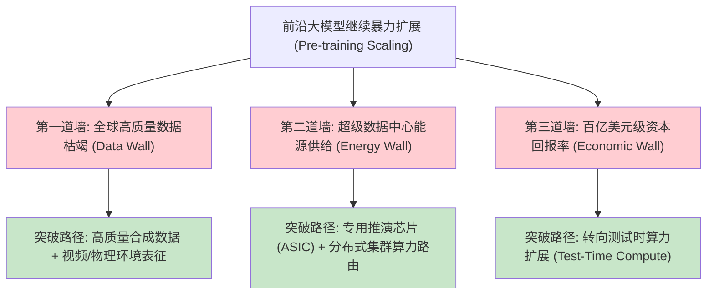
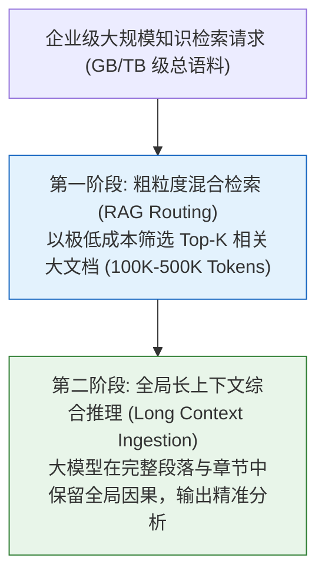
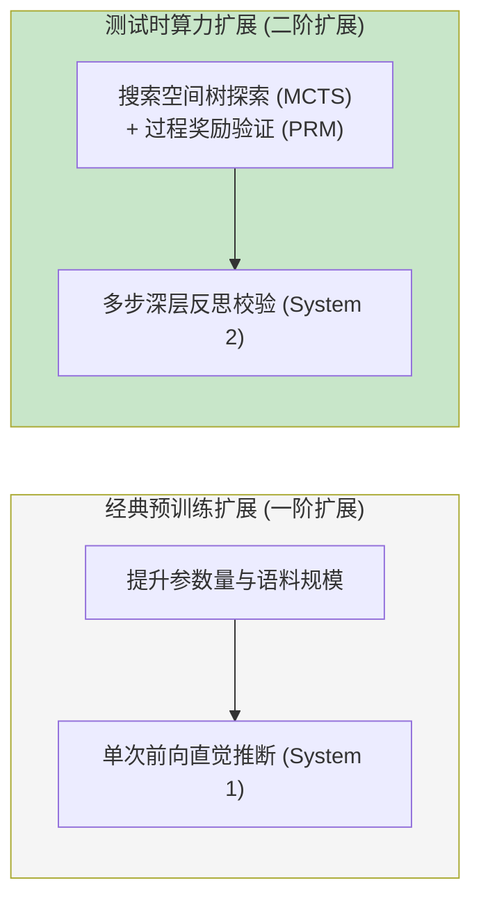
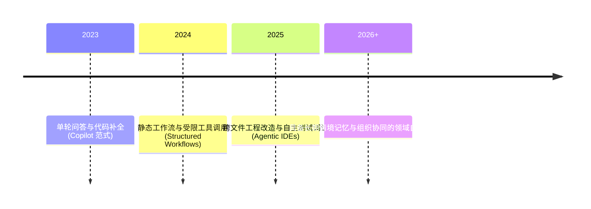
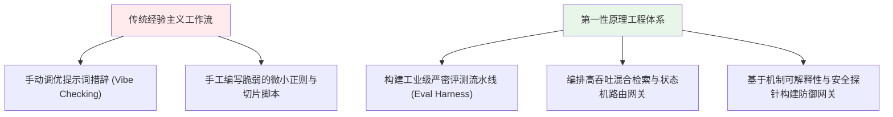

[← 上一章](14-multimodal.md) | [目录](../README.md)

**English**: [English](../en/chapters/15-future.md)

# 第十五章：前沿演进与范式重构

> "Predictions are hard, especially about the future. Predictions about a field that doubles every six months are nearly worthless."

在前十四章中，我们从物理与数学第一性原理出发，系统推演了自回归生成、自注意力路由、扩展定律、对齐工程、可靠性边界、智能体拓扑与多模态表征。站在当前技术范式的浪尖，我们必须审视这一领域的深层结构性张力（Structural Tensions）。

与其执着于短期的经验预言，不如**形式化梳理驱动技术演进的底层物理与经济张力**。正是这些相互制约与抗衡的力量，塑造着人工智能系统的未来轨迹。

本章核心张力拓扑：

1. **扩展定律（Scaling Laws）的物理与经济边界**：数据墙、能源消耗墙与边际资本回报率；
2. **合成数据（Synthetic Data）的收益与模型坍缩风险**：正向蒸馏 vs 自发递归退化；
3. **超长上下文（Long Context）与检索增强（RAG）的架构重构**：信息装载与高效路由的动态权衡；
4. **测试时算力（Test-Time Compute）与慢思考系统的跃迁**：推理尺度扩展带来的第二增长曲线；
5. **智能体（Agent）系统的自主性边界**：从工具接口向自主状态机的演进与可靠性约束；
6. **开源生态与前沿闭源壁垒的博弈演化**；
7. **大语言模型时代工程师角色的范式重塑**。

---

## 15.1 扩展定律（Scaling Laws）的物理与经济三道墙

第三章阐明了模型参数规模、数据量与计算开销之间的幂律收敛关系。然而在现实物理世界中，暴力扩展范式正面临三道实质性屏障：

### 1. 数据墙（The Data Wall）
据测算（[Villalobos et al., 2024](https://arxiv.org/abs/2211.04325)），人类互联网积累的高质量自然语言文本总量将在数年内被预训练集群遍历耗尽。纯文本 Token 的枯竭倒逼产业界转向多模态感知信号（视频、图像、声音）以及通过严格可验证环境生成的合成先验。

### 2. 能源与电网墙（The Energy Wall）
从十万卡集群迈向百万卡分布式集群，训练单一前沿模型的功耗已攀升至吉瓦（GW）级，这直接受制于区域电网容量、水冷散热极限与物理选址。

### 3. 经济回报墙（The Economic Wall）
单一前沿基础模型的单次训练成本正从数亿美元向数十亿美元跃进。核心矛盾不在于纯技术可行性，而在于边际资本回报率（Marginal ROI）与商业化飞轮的匹配度。

---

## 15.2 合成数据：模型坍缩与自监督验证

### 递归退化的数学机理（Model Collapse）

Shumailov 等人在《The Curse of Recursion》（[Shumailov et al., 2024](https://arxiv.org/abs/2305.17493)）中证明：若无节制地使用未经校验的模型生成内容训练后继模型，经过数代自回归循环后，分布尾部的长尾信息将被系统性抹除，模型将陷入方差收缩与表征坍缩：

### 破解之道：形式化可验证的合成回路

合成数据能够带来正向增益的核心前提是**具备客观确定性的判别准则（Ground-Truth Verifiability）**：
- **符号与代码世界**：通过单元测试、编译通过率与执行输出提供客观梯度反馈；
- **数学与定理证明**：通过 Lean / Isabelle 等形式化验证器验证推导闭环；
- **博弈环境对抗**：在受限沙盒与环境模拟器中获取物理奖励标量。

---

## 15.3 知识路由演进：超长上下文与 RAG 的垂直分工

超长上下文窗口（数百至数百万 Token）的普适化并未导致 RAG 的消亡，而是重构了知识路由的分工拓扑：

- **RAG 承担粗粒度空间寻址**：在百万级文档库中以低成本筛选最相关的宏观上下文；
- **Long Context 承担深层语义穿透**：避免了细粒度微小切片割裂前置因果关系的缺陷，在百千 Token 尺度内实施高保真全量注意力推理。

---

## 15.4 第二增长曲线：测试时算力（Test-Time Compute）

第八章详细探讨了推理模型在测试阶段通过延长思维链推导提升准确率的数学本质。这一范式开辟了独立于预训练的全新扩展轴：

$$\text{System Performance} \propto f(\text{Pre-training Compute}) \times g(\text{Test-Time Compute})$$

在工程实践中，用户调用模型的方式将演进为**指定推理预算（Thinking Budget）**：对于低门槛闲聊分配极少 Token，对于形式化证明与关键架构决策分配数万 Token 的深层搜索预算。

---

## 15.5 智能体演进：从辅助工具到受控状态机

智能体系统正跨越玩具级 Demo 的阶段，向具备明确状态边界与权限护栏的工业级系统演化：

工程落地的核心重心不再是如何让 Agent 自发做更多探索，而是**如何构建确定性环境沙盒、审计追踪协议以及异常熔断状态机**，确保自动化动作在物理世界中严格可控且可逆。

---

## 15.6 工程师角色的范式转移

表层的 API 语法与框架封装具有极短的半衰期。唯有第一性原理：自注意力计算复杂度、条件概率转移、因果损失函数与表征空间几何：能够经受住技术浪潮的更迭，成为工程师进行架构决策的坚实锚点。

---

## 总结：Thinking in LLM 的认知底座

全书通过十五章的严密推演，构建了一套穿透技术泡沫的系统心智模型：

| 核心维度 | 第一性原理物理图景 |
|---|---|
| **生成机制** | 离散符号空间的高维条件概率转移与因果自回归续写 |
| **注意力架构** | 动态内容寻址的键值路由机制，伴随 $O(N^2)$ 计算瓶颈 |
| **扩展定律** | 幂律驱动的平滑能力涌现与低秩隐层表征压缩 |
| **对齐与安全** | 改变输出风格分布而非注入全新认知，需防范对抗诱导与伪装迎合 |
| **可靠性与幻觉** | 自回归因果累积与信息论不完备性的必然代价，依托确定性断言约束 |
| **知识与推理** | 慢思考展开以 Token 长度置换推演深度，RAG 与长上下文分层寻址 |
| **智能体与多模态** | 工具调用将物理状态映射为 Token，全模态架构统一跨感知表征 |

无论未来模型规模如何跃迁、架构细节如何演进，掌握其底层数学流形与物理机理的工程师，将永远拥有看清技术本质、构筑可靠系统的掌控力。

---

## 延伸阅读

- [Will we run out of data? Limits of LLM scaling based on human-generated text](https://arxiv.org/abs/2211.04325), Villalobos et al., 2024
- [The Curse of Recursion: Training on Generated Data Makes Models Forget](https://arxiv.org/abs/2305.17493), Shumailov et al., 2024
- [Scaling LLM Test-Time Compute Optimally can be More Effective than Scaling Model Parameters](https://arxiv.org/abs/2408.03314), Snell et al., 2024
- [Measuring AI Ability to Complete Long Tasks](https://arxiv.org/abs/2503.14499), METR Research, 2025
- [On the Opportunities and Risks of Foundation Models](https://arxiv.org/abs/2108.07258), Bommasani et al., 2021
- [Managing extreme AI risks amid rapid progress](https://www.science.org/doi/10.1126/science.adn0117), Bengio et al., 2024

---

## 后记

本书系统探讨了从自回归机制、注意力路由、扩展定律、对齐工程、可靠性边界、幻觉治理、思维链推理、提示工程、知识注入、智能体系统、系统评估、机制可解释性、多模态表征到未来技术演进等 15 个章节，致力于从微观数学机理至宏观系统架构建立起自洽的第一性原理认知体系。

大语言模型与人工智能领域的演进速度极为迅猛，部分具体的接口协议与学术基准或将随着时间推移而演变，但底层关于计算复杂度、信息熵、概率流形与状态机控制的核心思维模型将历久弥新。

在工程实践中，保持严密的科学审慎与开放的探索精神，是以不变逻辑应对瞬息万变的技术浪潮的根本准则。

祝你在大语言模型的系统构建之旅中，构筑出优雅、稳健且具备深远价值的工程系统。

Ying Wang，写于 2026 年春

[← 上一章](14-multimodal.md) | [目录](../README.md)
