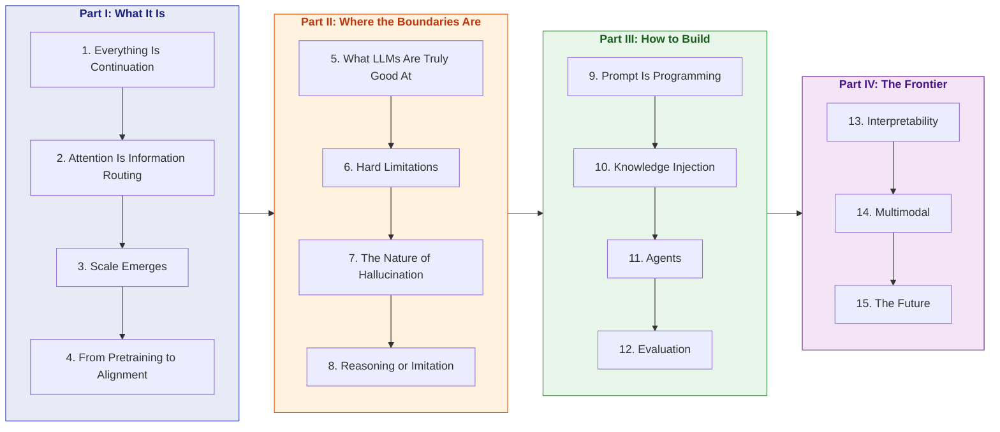

# Thinking in LLM

> A first-principles guide to how LLMs "think," starting from next-token prediction and ending with practical system design.

**Languages**: [中文](../README.md) | [English](README.md)
**Read online**: [yingwang.github.io/thinking-in-llm](https://yingwang.github.io/thinking-in-llm/) (search, dark mode, sidebar TOC)

**Glossary**: [English terminology](GLOSSARY.md)

For engineers who can program and are using, or want to use, LLMs to build products. No machine learning background is required.

## The Logic of This Book

**Core logic**: understand how LLMs "think" -> understand their boundaries -> build from the right mental model -> then look at the frontier.

Most material is either pure theory, such as papers, or pure practice, such as prompt cookbooks. This book derives **"how to do it" from "why it works"**. Once you understand attention, you can reason about what makes a prompt effective. Once you understand scaling laws, you can reason about when to switch to a larger model instead of tuning the prompt.

## Table of Contents

### Part I: What an LLM Is (The Machine)

| # | Chapter | Core Question |
|---|---------|---------------|
| 1 | [Everything Is Continuation](chapters/01-next-token.md) | An LLM does only one thing: predict the next token |
| 2 | [Attention Is Information Routing](chapters/02-attention.md) | Every token asks, "Where should I look?" |
| 3 | [Emergence From Scale](chapters/03-scaling.md) | Why do large models suddenly "get it"? |
| 4 | [From Pretraining to Alignment](chapters/04-alignment.md) | Alignment does not change capability, only expression |

### Part II: The Capability Boundaries of LLMs (The Boundaries)

| # | Chapter | Core Question |
|---|---------|---------------|
| 5 | [What LLMs Are Truly Good At](chapters/05-strengths.md) | Pattern recognition, transformation, compression |
| 6 | [The Hard Limitations of LLMs](chapters/06-limitations.md) | Why counting, arithmetic, and long-range reasoning fail |
| 7 | [The Nature of Hallucination](chapters/07-hallucination.md) | Hallucination is not a bug; it is inevitable for a continuation engine |
| 8 | [Reasoning or Imitation?](chapters/08-reasoning.md) | CoT, reasoning models, System 1 vs 2 |

### Part III: Building With LLMs (The Practice)

| # | Chapter | Core Question |
|---|---------|---------------|
| 9 | [Prompt Is Programming](chapters/09-prompting.md) | System prompt = class definition, few-shot = test cases |
| 10 | [Three Paths for Knowledge Injection](chapters/10-knowledge.md) | RAG vs Fine-tuning vs Long Context |
| 11 | [First Principles of Agents](chapters/11-agents.md) | Tool use extends token space into the real world |
| 12 | [Evaluation: The Most Underestimated Step](chapters/12-evaluation.md) | Write evals first, then tune the system |

### Part IV: Frontier and Future (The Frontier)

| # | Chapter | Core Question |
|---|---------|---------------|
| 13 | [Interpretability: Opening the Black Box](chapters/13-interpretability.md) | What is happening inside the model? |
| 14 | [Multimodal: Beyond Text](chapters/14-multimodal.md) | Images, audio, and video all become tokens |
| 15 | [The Future of LLMs](chapters/15-future.md) | Will scaling hit a wall? |

## Relationship to "The Complete Guide for LLM Training Engineers"

| | [Training Guide](https://github.com/yingwang/llm-tutorial) | Thinking in LLM |
|---|---|---|
| **Perspective** | How to **build** LLMs | How to **understand and use** LLMs |
| **Reader** | Training engineers | All LLM developers |
| **Prerequisite** | Requires ML background | Only requires programming background |
| **Goal** | Train models | Design LLM systems |

The two books complement each other: the training guide teaches you how to build the engine; this book teaches you how to drive. Not as a driving-school manual, but as driving after understanding how the engine works.

## How to Read

- **From beginning to end**: Part I -> II -> III -> IV. Each part builds on the previous one.
- **If you are short on time**: Chapter 1 -> Chapter 6 -> Chapter 9 -> Chapter 11 (the four core chapters).
- **If you already have the basics**: Jump to Part III, and go back to Part I/II when you encounter something unclear.

## Author

Ying Wang

## License

[CC BY-NC-SA 4.0](../LICENSE)

---

> Last updated: 2026-04-26 (all 15 chapters completed)
