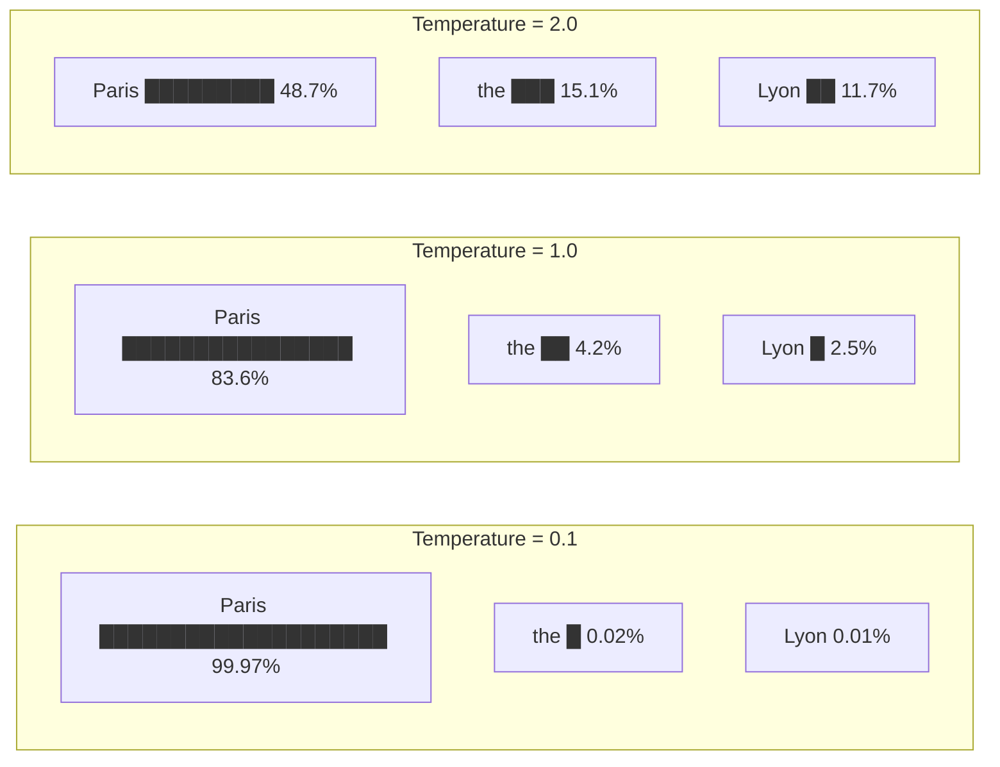
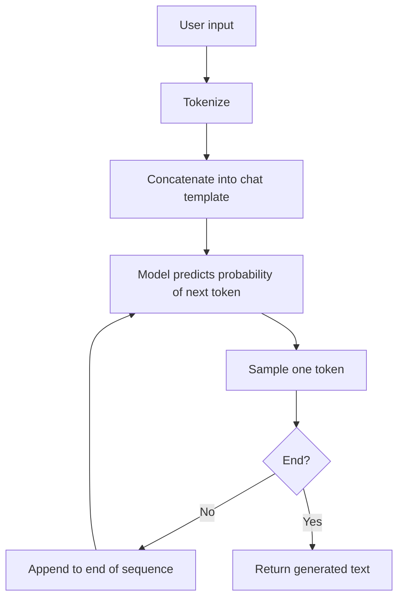
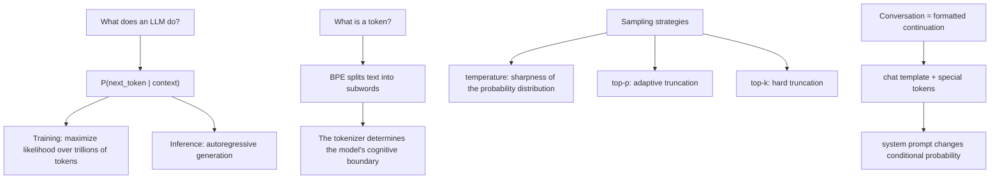

[Table of Contents](../README.md) | [Next Chapter →](02-attention.md)

**中文**: [中文](../../chapters/01-next-token.md)

# Chapter 1: Everything Is Continuation

> "The next token prediction objective is the most important idea in AI."
> — Ilya Sutskever

If you remember only one sentence from this book, let it be this: **large language models do one thing and only one thing: predict the next token**.

The impressive abilities you hear about in LLMs, such as writing poetry, programming, reasoning, and translation, are not functions specially programmed into them. They are byproducts that **emerge** from this extremely simple objective. Understand this, and you understand the foundation of LLMs.

---

## 1.1 Next-Token Prediction: The Only Thing an LLM Does

### Core Formula

A language model is essentially a probability distribution:

$$P(\text{next\_token} \mid \text{previous\_tokens})$$

Given all previous tokens, the model outputs a probability distribution over possible next tokens. That is all. There is no "understanding" module, no "reasoning" engine, and no "knowledge-base query", just this one probability distribution.

```
Input:   "The capital of France is"
Output:  {"Paris": 0.92, "the": 0.03, "a": 0.01, "located": 0.008, ...}
```

The model selects a token, such as "Paris", appends it to the input, and then predicts the next one. This loop continues until an end-of-sequence marker (EOS) is generated or a length limit is reached. This is **autoregressive generation**.

### Training: Maximizing Likelihood over Trillions of Tokens

The training process is just as simple: show the model a piece of real text, ask it to predict the next token at each position, and use cross-entropy loss to measure the accuracy of those predictions:

$$\mathcal{L} = -\sum_{t=1}^{T} \log P(x_t \mid x_1, x_2, \ldots, x_{t-1})$$

This objective function is called **maximum log-likelihood**. The model repeatedly optimizes this objective over text containing trillions of tokens: Wikipedia, books, code, papers, web pages, and almost the entire written record of human civilization.

### Why Can Such a Simple Objective Produce "Intelligence"?

This is the most counterintuitive part. You might ask: if it is only predicting the next word, how can it solve math problems, write code, or even reason?

The answer is: **to predict the next token truly well, you need to understand the structure behind the text**.

Consider this example:

```
"Zhang Wei was born in Beijing and later moved to Shanghai. What he missed most was the hutongs of ___."
```

To correctly predict "Beijing" rather than "Shanghai" in the blank, the model must:
1. Track the life narrative of "Zhang Wei"
2. Understand that "missed" points to a place in the past
3. Know that "hutongs" are characteristic of Beijing

In other words, to predict a token, the model is forced to build some kind of internal representation of world knowledge, grammatical structure, and logical relationships. Ilya Sutskever put it succinctly in a talk:

> "Predicting the next token well enough is equivalent to understanding the underlying reality that produced the text."

This does not mean the model really "understands" the world. We will discuss that philosophical question in Section 1.5. But from an engineering perspective, this is what the effect looks like.

---

## 1.2 Token ≠ Text

### You Think the Model Sees Text, but It Actually Sees Tokens

When you input "artificial intelligence", the model does not see two words. Depending on the tokenizer's vocabulary, it may see two tokens, `[artificial, intelligence]`, or three tokens, `[art, ificial, intelligence]`.

Tokens are the **smallest cognitive units** of an LLM. The model does not know "characters" or "words". It only knows tokens. Understand the tokenizer, and you understand the model's "perceptual boundary".

### BPE: Byte Pair Encoding

Most mainstream tokenizers currently use the **Byte Pair Encoding (BPE)** algorithm. Its core idea is simple:

1. Start from the smallest units, such as characters or bytes
2. Count the frequency of all adjacent pairs
3. Merge the most frequent pair into a new token
4. Repeat until the vocabulary reaches the target size, usually 32k-128k

```python
# Pseudocode showing how BPE works
# Original text, split by character
tokens = ['l', 'o', 'w', ' ', 'l', 'o', 'w', 'e', 'r', ' ', 'n', 'e', 'w']

# Round 1: 'l' + 'o' is most frequent → merge into 'lo'
tokens = ['lo', 'w', ' ', 'lo', 'w', 'e', 'r', ' ', 'n', 'e', 'w']

# Round 2: 'lo' + 'w' is most frequent → merge into 'low'
tokens = ['low', ' ', 'low', 'e', 'r', ' ', 'n', 'e', 'w']

# And so on...
```

### The "strawberry" Problem

A classic LLM failure case:

> Question: How many "r"s are there in "strawberry"?
> GPT-4 answer: 2 (the correct answer is 3)

Why? Because the tokenizer splits "strawberry" into tokens similar to `["str", "aw", "berry"]`. In that representation, the model has never "seen" each individual letter. It processes token-level sequences. Asking it to count letters is like asking you to count the chairs in a room while blindfolded.

```python
# Use tiktoken to inspect GPT-4's tokenization
import tiktoken

enc = tiktoken.encoding_for_model("gpt-4o")

text = "strawberry"
tokens = enc.encode(text)
print(f"Token IDs: {tokens}")
print(f"Token count: {len(tokens)}")
for t in tokens:
    print(f"  {t} → '{enc.decode([t])}'")

# Example output:
# Token IDs: [496, 675, 15717]
# Token count: 3
#   496 → 'str'
#   675 → 'aw'
#   15717 → 'berry'
```

The model sees three meaning chunks, not ten letters. It operates in token space, so letter-level tasks are naturally difficult for it.

### Multilingual Fertility: The Same Meaning, Different Token Counts

Tokenizers are usually trained primarily on English corpora. This creates an important asymmetry:

```python
import tiktoken

enc = tiktoken.encoding_for_model("gpt-4o")

texts = {
    "English": "Artificial intelligence is transforming the world.",
    "Chinese": "人工智能正在改变世界。",
    "Japanese": "人工知能が世界を変えています。",
    "Arabic": "الذكاء الاصطناعي يغير العالم.",
}

for lang, text in texts.items():
    tokens = enc.encode(text)
    print(f"{lang}: {len(tokens)} tokens for {len(text)} chars "
          f"(fertility: {len(tokens)/len(text):.2f})")

# Typical output:
# English: 8 tokens for 49 chars (fertility: 0.16)
# Chinese: 9 tokens for 11 chars (fertility: 0.82)
# Japanese: 12 tokens for 15 chars (fertility: 0.80)
# Arabic: 11 tokens for 29 chars (fertility: 0.38)
```

**Fertility** = token count / character count. Chinese has much higher fertility than English, which means:

- The same semantics consume more tokens → **higher cost** (APIs charge by token)
- The context window can fit less Chinese text
- Each token carries a different semantic density

This is not an abstract technical detail. It directly affects your API costs and context utilization.

### The Tokenizer Determines the Model's "Cognitive Boundary"

A deeper insight: the tokenizer fundamentally shapes the granularity at which the model can "think".

- If the tokenizer splits a technical term into multiple tokens, the model needs more "computation steps" to process that concept
- If the tokenizer is specially optimized for a programming language, as in code models, the model will be more efficient in that language
- This is why GPT-4o and Claude use different tokenizers and therefore have different performance characteristics

---

## 1.3 Temperature and Sampling: Choosing a Thinking Mode

The model outputs a probability distribution, but ultimately you need to select one concrete token from it. This selection process is called **sampling**, and temperature is the most important parameter controlling sampling behavior.

### Temperature: Adjusting the "Sharpness" of the Probability Distribution

Mathematically, temperature does something simple: it divides the logits by a scalar before softmax:

$$P(x_i) = \frac{\exp(z_i / T)}{\sum_j \exp(z_j / T)}$$

where $z_i$ is the logit output by the model, and $T$ is the temperature.

```
Suppose the logits output by the model are:
  "Paris": 5.0,  "the": 2.0,  "Lyon": 1.5,  "a": 1.0

Temperature = 0.1 (extremely low):
  "Paris": 0.9997, "the": 0.0002, "Lyon": 0.0001, "a": 0.0000
  → Almost certainly selects "Paris"

Temperature = 1.0 (default):
  "Paris": 0.8360, "the": 0.0416, "Lyon": 0.0253, "a": 0.0153
  → Very likely selects "Paris", with occasional surprises

Temperature = 2.0 (high):
  "Paris": 0.4869, "the": 0.1507, "Lyon": 0.1172, "a": 0.0912
  → The distribution becomes flatter, and many possibilities remain plausible
```



### Intuition for Different Temperatures

Do not treat temperature as just a "hyperparameter that needs tuning". Use a different mental model: **you are choosing the model's thinking style**:

| Temperature | Style | Suitable Scenarios |
|:---:|---|---|
| 0 | Greedy, always selecting the highest-probability token | Code generation, factual Q&A, JSON output |
| 0.3-0.7 | Moderately random, with occasional variation | General conversation, content writing |
| 0.8-1.2 | Creative, often exploring low-probability paths | Creative writing, brainstorming |
| >1.5 | Highly random, close to "nonsense" | Rarely used |

### Top-p (Nucleus Sampling): Adaptive Truncation

Top-p sampling works differently: instead of selecting a fixed number of candidate tokens, it selects the tokens whose cumulative probability, accumulated from high to low, reaches p.

```python
# How Top-p = 0.9 works
probs = {"Paris": 0.84, "the": 0.04, "Lyon": 0.03,
         "a": 0.02, "located": 0.015, ...}

# Sort by probability and accumulate to 0.9
# Paris (0.84) + the (0.04) + Lyon (0.03) = 0.91 > 0.9
# → Candidate set: {Paris, the, Lyon}
# → Sample among these three according to normalized probabilities
```

The elegance of top-p is that it is **adaptive**:
- When the model is very certain, such as when one token has probability 0.95, the candidate set contains only 1-2 tokens
- When the model is uncertain and probabilities are spread out, the candidate set automatically expands

### Top-k: Hard Truncation

Top-k is blunter: it keeps only the k tokens with the highest probabilities.

```python
# Top-k = 5
# No matter what the probability distribution looks like, keep only the top 5
# Drawback: when the model is very certain, k=50 introduces 49 unnecessary sources of noise
#           when the model is very uncertain, k=50 may not be enough
```

### Practical Advice

```python
# Factual tasks: low temperature, low top-p
response = client.messages.create(
    model="claude-sonnet-4-20250514",
    temperature=0,  # Fully deterministic
    messages=[{"role": "user", "content": "What is the capital of France?"}]
)

# Creative writing: high temperature, high top-p
response = client.messages.create(
    model="claude-sonnet-4-20250514",
    temperature=0.9,
    top_p=0.95,
    messages=[{"role": "user", "content": "Write a poem about autumn"}]
)
```

One key mental model: **temperature does not affect what the model "knows"; it only affects what it "says"**. A temperature=0 model and a temperature=1 model have exactly the same knowledge, but different expression strategies.

---

## 1.4 From Continuation to Conversation

### Base Model: A Continuation Engine

A freshly trained model, called a base model, is a continuation engine. Whatever you input, it continues from there:

```
Input: "The weather is really nice today"
Output: ", with bright sunshine, perfect for going out for a walk. Xiao Ming picked up his backpack..." (continuing a story)
```

It does not "answer questions". If you input "What is the capital of China?", it may continue with:

```
"What is the capital of China? This is a second-grade geography question. Many students..."
```

It is continuing an article about an exam rather than answering you.

### Chat Template: Creating the Illusion of Conversation with Special Tokens

To make the model "converse", we need a **chat template**. The core idea is to use special tokens to format the input as a conversation, so the model's continuation becomes an answer.

Using the ChatML format as an example:

```
<|im_start|>system
You are a helpful assistant.
<|im_end|>
<|im_start|>user
What is the capital of China?
<|im_end|>
<|im_start|>assistant
```

Because the model has seen large amounts of similarly formatted dialogue in the training data, it will continue this format with:

```
The capital of China is Beijing.
<|im_end|>
```

**Conversation is not a native capability of the model. It is continuation implemented through formatting**.

This means that, from a probabilistic perspective, what a dialogue model is really doing is:

$$P(\text{response} \mid \text{system\_prompt}, \text{chat\_history}, \text{user\_message})$$

The model is still doing next-token prediction. Only the conditioning has changed.

### System Prompt: Setting the Conditional Probability Distribution

The system prompt is a powerful tool because it **changes the starting point of the entire conditional probability distribution**.

```
Without a system prompt:
  P("I cannot" | user: "How to hack a website?") = 0.3
  P("First, you" | user: "How to hack a website?") = 0.4

With "You are a security expert...":
  P("I cannot" | system + user) = 0.1
  P("First, you" | system + user) = 0.6

With "You are a helpful assistant that never discusses hacking":
  P("I cannot" | system + user) = 0.8
  P("First, you" | system + user) = 0.05
```

A system prompt is not an "instruction". It is **conditional information that changes the probability landscape**. The model does not have a module for "following instructions". It is only continuing with the most likely tokens under the condition set by the system prompt.

This explains why:
- A very long system prompt may be less effective than a short, precise one, because the signal is diluted
- Content later in the system prompt often has more influence due to recency bias
- Format and wording can matter more than semantics, because the model matches patterns in the training data

### The Illusion of "Understanding"

When you talk with ChatGPT, it feels like it is "understanding" what you mean. But mechanically:



At every step, the model is doing only one thing: given the preceding text, predict the next token. There is no step for "understanding the input", no step for "thinking of the answer", and no step for "organizing language". All the "intelligent behaviors" we perceive are emergent effects of next-token prediction at sufficient model scale and over sufficient data.

---

## 1.5 Thought Experiment: Can a Next-Token Predictor Understand Language?

In this section, we temporarily leave engineering and enter philosophy. This is not for show. The reason is that **your answer to this question profoundly affects how you design systems and how much you trust model outputs**.

### The Chinese Room Argument, LLM Edition

The philosopher John Searle proposed the famous "Chinese room" thought experiment in 1980:

> Imagine an English speaker who does not understand Chinese sitting in a room with a detailed rulebook. Chinese notes are slipped in through the door. He follows the rulebook to look up and manipulate symbols, then passes the "correct" Chinese responses back out. The Chinese speakers outside think there is someone in the room who knows Chinese.
>
> The question is: does this English speaker "understand" Chinese?

Searle's answer is: no. He is only performing symbol manipulation, without any semantic understanding.

The LLM version of the question is: does a model trained by predicting the next token "understand" language?

### Compression = Understanding?

Marcus Hutter, the creator of AIXI, once established a **compression prize** (Hutter Prize): the better someone can compress Wikipedia, the better they understand human knowledge.

This intuition is persuasive: if you can perfectly predict the next token of a text, your cross-entropy loss is zero, which is equivalent to perfectly compressing that text. And to perfectly compress text, you must understand all the structures encoded in it:

- Grammatical rules; otherwise, ungrammatical sentences would also receive high probability
- Factual knowledge; otherwise, you would make mistakes on factual statements
- Logical reasoning; otherwise, you could not predict the next step in a reasoning chain
- Social common sense; otherwise, dialogue prediction would fail

From this perspective: **a sufficiently good next-token predictor must already "understand" the structures in the training data**.

### Objection: Shortcuts and Statistical Correlation

But critics will say that the model may have learned **statistical shortcuts** rather than real understanding.

For example, the model may have learned that "Marie Curie" is often followed by "radium" and "Nobel", rather than truly understanding radioactive physics. It is "parroting" (stochastic parrot, [Bender et al. 2021](https://dl.acm.org/doi/10.1145/3442188.3445922)), merely doing statistical pattern matching.

### A Pragmatic Engineer's Position

As an engineer, I recommend adopting this position:

1. **Do not anthropomorphize the model**. It has no intentions, beliefs, or desires. It is a complex mathematical function.
2. **But do not underestimate it either**. This mathematical function has indeed built some kind of internal representation of a world model. Later chapters will show evidence for this.
3. **Focus on behavior rather than essence**. "Does it understand?" is a poor question. A better question is: "On what tasks, under what conditions, is its behavior reliable?"

This stance keeps you from blindly trusting the model ("it understands, so it is safe to use") and from dismissing it ("it is only statistical correlation, so it is not worth using").

### Practical Implications

This philosophical discussion has very practical implications:

- **The model can generate text that looks correct but is factually wrong**, because it optimizes probability, not truth
- **The model will degrade gracefully outside the training distribution**, because it matches patterns, and when it has not seen a pattern, it guesses incorrectly
- **The model's "reasoning" is approximate, not exact**, because each step is probabilistic sampling, not logical deduction
- **But within the training distribution, the model's reliability can be very high**, because it has already compressed those patterns well

---

## Chapter Summary



Core takeaways:

1. **LLM = next-token predictor**; all capabilities are emergent byproducts
2. **Token ≠ character**; the tokenizer determines the model's "eyesight" and "billing method"
3. **Temperature selects a thinking mode**, rather than being a "tuning parameter"
4. **Conversation is formatted continuation**, not a native capability
5. **Understanding is a spectrum**. The model has indeed learned certain structures, but not "understanding" in the usual human sense

In the next chapter, we will open the model's black box and see how the attention mechanism lets tokens pass information to one another. This is the core of the Transformer architecture.

---

## Further Reading

- [Language Models are Few-Shot Learners (GPT-3)](https://arxiv.org/abs/2005.14165) — Brown et al. 2020
- [On the Dangers of Stochastic Parrots](https://dl.acm.org/doi/10.1145/3442188.3445922) — Bender et al. 2021
- [Hutter Prize](http://prize.hutter1.net/) — the relationship between compression and intelligence
- [The Bitter Lesson](http://www.incompleteideas.net/IncIdeas/BitterLesson.html) — Rich Sutton, 2019
- [tiktoken](https://github.com/openai/tiktoken) — OpenAI's tokenizer library
- [SentencePiece](https://github.com/google/sentencepiece) — Google's tokenizer library
